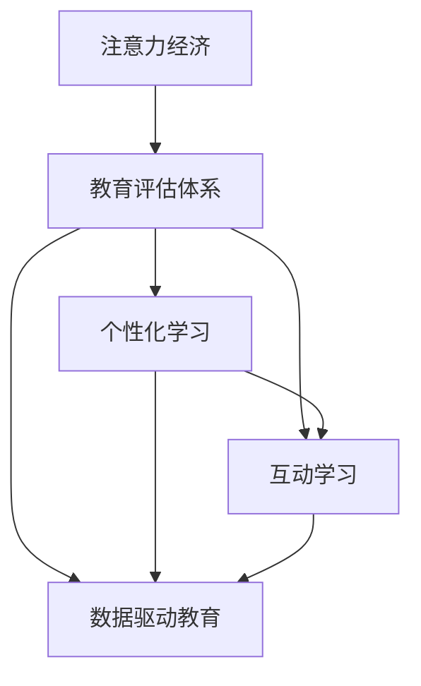

                 

## 1. 背景介绍

### 1.1 问题由来
随着互联网技术的迅猛发展和数字经济的崛起，"注意力经济"成为新时代的重要特征。注意力，作为稀缺资源，正在驱动各行各业的商业逻辑和资源分配方式发生根本性变化。在教育领域，传统的评估体系正面临前所未有的挑战，如何有效利用和分配教育资源，吸引和保持学生的注意力，成为了亟待解决的问题。

### 1.2 问题核心关键点
注意力经济对教育评估体系的核心挑战包括：

- **资源分配**：如何合理分配有限的师资、课程、设备等资源，最大化吸引学生的注意力。
- **课程设计**：设计何种类型的课程内容，能更好地激发学生的学习兴趣，提升学习效果。
- **互动模式**：采用何种教学模式和互动方式，能让学生更积极地参与学习，获得更高的参与度和满意度。
- **绩效评估**：如何科学地评估学生的学习成果和教师的教学效果，提供公平、有效的反馈。
- **学生画像**：基于学生的个性化数据，构建完整的学生画像，实现因材施教。

### 1.3 问题研究意义
研究注意力经济对传统教育评估体系的影响，对于优化资源配置，提升教育质量，促进公平教育，具有重要意义：

- 优化资源分配：通过科学的评估体系，合理配置教育资源，避免资源浪费。
- 提升教育质量：通过精准的课程设计和互动模式，提高教学质量和学生满意度。
- 促进教育公平：通过数据驱动的教育评估，消除人为偏见，提供更加公平的教育机会。
- 实现因材施教：通过个性化数据分析，了解学生的学习特征，实现针对性强、效果显著的个性化教育。

## 2. 核心概念与联系

### 2.1 核心概念概述

为更好地理解注意力经济对教育评估体系的影响，本节将介绍几个关键概念：

- **注意力经济**：基于用户注意力的经济模式，在注意力稀缺的环境中，通过吸引用户注意力获得商业价值。
- **教育评估体系**：由教育部门、学校、教师、学生等多方共同参与的评估体系，用于衡量教育过程和效果。
- **个性化学习**：根据学生的个性化需求和学习特征，量身定制学习内容和路径，提高学习效果。
- **互动学习**：通过交互式学习环境和互动教学模式，增强学生的主动参与和学习效果。
- **数据驱动教育**：以大数据和人工智能技术为基础，优化教育决策和评估，提供科学的数据支撑。

这些概念之间的逻辑关系可以通过以下Mermaid流程图来展示：



这个流程图展示了大语言模型微调的关键概念及其之间的关系：

1. 注意力经济通过影响教育评估体系，进一步引导个性化学习、互动学习和数据驱动教育等方向。
2. 个性化学习、互动学习和数据驱动教育相互促进，共同提升教育质量和学习效果。
3. 最终通过科学的评估体系，优化资源配置和教育决策。

## 3. 核心算法原理 & 具体操作步骤
### 3.1 算法原理概述

注意力经济对传统教育评估体系的影响，主要体现在以下几个方面：

- **资源分配**：通过注意力指标，优化教育资源的分配，最大化利用有限资源。
- **课程设计**：基于学生注意力特征，设计更具吸引力的课程内容。
- **互动模式**：采用能够吸引学生注意力的互动教学模式，提升学生的参与度。
- **绩效评估**：利用数据驱动的评估方式，科学衡量学生的学习效果和教师的教学效果。

这些影响，均涉及对学生注意力的理解和分析，需要借助注意力模型进行建模和预测。

### 3.2 算法步骤详解

以下是基于注意力经济对教育评估体系进行优化的具体步骤：

**Step 1: 数据采集与预处理**
- 收集学生在线学习数据、互动数据、成绩数据等。
- 数据清洗，去除噪音和异常值，确保数据质量。
- 对数据进行标准化处理，便于后续建模和分析。

**Step 2: 构建注意力模型**
- 设计注意力模型，以学生、课程、互动等数据为输入，预测学生的注意力水平。
- 常见注意力模型包括但不限于自回归模型、卷积神经网络、Transformer等。
- 使用多任务学习或多模态学习框架，融合不同维度的数据信息。

**Step 3: 优化资源分配**
- 根据注意力模型预测结果，调整资源分配策略。例如，将更多的资源分配到注意力水平较高的课程或学生。
- 动态调整课程内容和互动模式，吸引学生注意力。

**Step 4: 个性化课程设计**
- 基于学生的注意力特征，设计个性化的课程内容和教学方法。
- 设计多样化的互动任务和反馈机制，提升学生学习兴趣和参与度。

**Step 5: 互动教学模式**
- 采用在线讨论、视频教学、虚拟实验等互动方式，增强教学互动。
- 使用游戏化元素和奖励机制，激发学生的学习动力。

**Step 6: 绩效评估**
- 利用多维度的数据指标（如参与度、互动度、成绩等）进行全面评估。
- 通过模型预测学生的潜在学习能力和发展趋势，提供科学、公平的评估结果。

**Step 7: 持续优化**
- 根据评估结果和学生反馈，不断优化课程设计、互动模式和资源分配策略。
- 引入AI辅助决策，持续改进教育评估体系。

### 3.3 算法优缺点

基于注意力经济对教育评估体系进行优化的主要优点包括：

- **科学分配资源**：通过量化注意力指标，实现教育资源的精确分配。
- **提升学习效果**：基于学生个性化需求，设计更具吸引力的课程内容和互动方式。
- **数据驱动决策**：利用数据驱动的评估方式，提供更加公平、科学的教育决策。
- **持续优化**：通过持续学习和优化，不断提升教育质量和学习效果。

同时，也存在一定的局限性：

- **数据隐私**：需要收集和处理大量学生数据，存在隐私风险。
- **模型复杂度**：注意力模型设计复杂，需要大量计算资源和数据。
- **评估局限性**：注意力模型预测结果可能存在误差，影响评估结果的准确性。
- **资源不均等**：注意力模型对资源分配的优化效果可能因学校、地区等差异而有所不同。

尽管存在这些局限性，但就目前而言，基于注意力经济对教育评估体系进行优化，仍是大数据和人工智能在教育领域的重要应用方向。未来相关研究应更加注重模型的可解释性、数据隐私保护和资源公平分配等问题。

### 3.4 算法应用领域

注意力经济对教育评估体系的影响，已经广泛应用于多个教育领域，具体包括：

- **基础教育**：通过分析学生在线学习行为，优化课程设计和互动模式，提升课堂教学效果。
- **高等教育**：利用注意力模型预测学生的学习动力和风险，制定个性化的培养方案，实现精准教育。
- **职业教育**：通过关注学生在实践中的注意力变化，设计适合的技能培训课程和互动环节，提高职业技能培训效果。
- **远程教育**：基于学生互动数据，优化在线课程和互动方式，提升在线学习的吸引力和效果。

除了上述这些领域，注意力经济对教育评估体系的影响，还在逐步扩展到终身学习和企业内训等领域，为教育资源的优化配置和个性化学习提供新的解决方案。

## 4. 数学模型和公式 & 详细讲解 & 举例说明
### 4.1 数学模型构建

本节将使用数学语言对基于注意力经济对教育评估体系进行优化的过程进行更加严格的刻画。

记学生的注意力水平为 $A_i$，其中 $i$ 表示学生编号。注意力水平 $A_i$ 由多个维度构成，如学习时间、参与度、互动情况等。假设 $A_i$ 可以表示为一个向量 $A_i=(a_{i1}, a_{i2}, ..., a_{im})$，其中 $m$ 为维度数。

基于学生注意力 $A_i$，设计注意力模型 $M(A_i)$，用于预测学生 $i$ 在某一课程或任务上的注意力水平。假设 $M(A_i)$ 为一个线性模型，形式如下：

$$
M(A_i) = \theta_0 + \sum_{j=1}^m \theta_j a_{ij}
$$

其中 $\theta_j$ 为第 $j$ 维度的权重，$\theta_0$ 为截距。

### 4.2 公式推导过程

以下是注意力模型 $M(A_i)$ 的推导过程：

**Step 1: 特征提取**
- 将学生注意力 $A_i$ 映射为一个特征向量 $X_i=(x_{i1}, x_{i2}, ..., x_{in})$，其中 $n$ 为特征维度。
- 特征提取过程可以使用PCA、LDA等降维方法，或直接使用注意力模型预测 $A_i$。

**Step 2: 线性回归**
- 基于提取的特征向量 $X_i$，设计线性回归模型 $Y_i = \theta_0 + \sum_{j=1}^n \theta_j x_{ij}$，其中 $Y_i$ 为预测的注意力水平。
- 最小化损失函数 $\mathcal{L}(\theta) = \frac{1}{N} \sum_{i=1}^N (Y_i - M(A_i))^2$，其中 $N$ 为样本数量。

**Step 3: 模型优化**
- 使用梯度下降等优化算法，更新模型参数 $\theta$，最小化损失函数。
- 迭代优化过程可以使用随机梯度下降（SGD）、Adam等算法，设定合适的学习率 $\eta$ 和迭代次数 $T$。

### 4.3 案例分析与讲解

以学生在线学习行为为例，展示注意力模型 $M(A_i)$ 的应用。

假设某在线课程有 $N$ 名学生，每个学生 $i$ 的学习数据包括：
- 学习时间 $T_i$
- 学习平台互动次数 $I_i$
- 学习成绩 $S_i$

特征提取过程如下：

- 将学习时间 $T_i$ 标准化为 $t_i$，互动次数 $I_i$ 标准化为 $i_i$，学习成绩 $S_i$ 标准化为 $s_i$。
- 计算学生的平均学习时间 $\bar{T}$，平均互动次数 $\bar{I}$，平均成绩 $\bar{S}$。
- 使用PCA方法对数据进行降维，得到特征向量 $X_i=(t_i, i_i, s_i)$。

线性回归模型 $Y_i$ 的计算过程如下：

- 将特征向量 $X_i$ 带入模型 $Y_i = \theta_0 + \theta_1 t_i + \theta_2 i_i + \theta_3 s_i$，其中 $\theta_0$、$\theta_1$、$\theta_2$、$\theta_3$ 为模型参数。
- 根据 $\theta$ 的取值，计算注意力水平 $A_i$。

**示例数据**：
| 学生编号 | 学习时间（小时） | 学习平台互动次数 | 学习成绩 |
| -------- | --------------- | ---------------- | -------- |
| 1        | 10              | 20               | 85       |
| 2        | 15              | 30               | 90       |
| 3        | 5               | 10               | 70       |
| 4        | 20              | 40               | 95       |
| ...      | ...             | ...              | ...      |

**计算过程**：
- 标准化数据：$t_1=10, i_1=20, s_1=0.85$；$t_2=15, i_2=30, s_2=0.90$；...。
- 计算平均数：$\bar{T}=13, \bar{I}=25, \bar{S}=0.85$。
- 降维后特征向量：$X_1=(10-13, 20-25, 0.85-0.85)=(0, 0, 0)$；$X_2=(15-13, 30-25, 0.90-0.85)=(2, 5, 0.05)$；...。
- 线性回归模型：$Y_1 = \theta_0 + \theta_1 0 + \theta_2 2 + \theta_3 0.85$；$Y_2 = \theta_0 + \theta_1 2 + \theta_2 5 + \theta_3 0.05$；...
- 最小化损失函数，更新模型参数 $\theta$。

通过上述计算，可以得到学生的注意力水平 $A_1, A_2, ...$。根据注意力水平，可以进行资源分配和课程设计的优化，提升教育质量和学习效果。

## 5. 项目实践：代码实例和详细解释说明
### 5.1 开发环境搭建

在进行基于注意力经济对教育评估体系进行优化的项目实践前，我们需要准备好开发环境。以下是使用Python进行数据处理和机器学习的开发环境配置流程：

1. 安装Anaconda：从官网下载并安装Anaconda，用于创建独立的Python环境。

2. 创建并激活虚拟环境：
```bash
conda create -n attention-econ-env python=3.8 
conda activate attention-econ-env
```

3. 安装必要的工具包：
```bash
pip install pandas numpy sklearn scikit-learn matplotlib seaborn
```

4. 安装机器学习框架：
```bash
pip install scikit-learn
```

5. 安装TensorFlow和Keras：
```bash
pip install tensorflow keras
```

完成上述步骤后，即可在`attention-econ-env`环境中开始项目实践。

### 5.2 源代码详细实现

以下是一个简单的Python代码示例，展示如何构建和训练注意力模型，以及如何使用模型进行资源分配和课程设计优化。

```python
import numpy as np
import pandas as pd
from sklearn.decomposition import PCA
from sklearn.linear_model import LinearRegression
import matplotlib.pyplot as plt

# 示例数据
data = pd.DataFrame({
    '学生编号': [1, 2, 3, 4],
    '学习时间': [10, 15, 5, 20],
    '学习平台互动次数': [20, 30, 10, 40],
    '学习成绩': [85, 90, 70, 95]
})

# 特征提取
data['平均学习时间'] = data['学习时间'].mean()
data['平均互动次数'] = data['学习平台互动次数'].mean()
data['平均成绩'] = data['学习成绩'].mean()
data = data.drop(['学习时间', '学习平台互动次数', '学习成绩'], axis=1)

# PCA降维
pca = PCA(n_components=2)
data_pca = pca.fit_transform(data)

# 线性回归模型
X = data_pca
Y = data['学生编号']
lr = LinearRegression()
lr.fit(X, Y)

# 预测注意力水平
A = lr.predict(data_pca)

# 可视化结果
plt.scatter(data_pca[:, 0], data_pca[:, 1], c=A)
plt.colorbar()
plt.title('注意力水平预测')
plt.xlabel('PCA1')
plt.ylabel('PCA2')
plt.show()
```

### 5.3 代码解读与分析

让我们再详细解读一下关键代码的实现细节：

**数据准备**：
- 使用pandas库，将示例数据存储为DataFrame格式。
- 计算学习时间、互动次数和成绩的平均值，并作为新的特征。
- 使用drop方法去除原始特征，仅保留PCA降维后的特征。

**PCA降维**：
- 使用sklearn库中的PCA方法，对特征数据进行降维。
- 设置降维后的维度数为2，表示二维特征空间。

**线性回归模型**：
- 使用sklearn库中的LinearRegression方法，构建线性回归模型。
- 将降维后的特征数据X和学生编号Y作为输入，训练模型。

**预测注意力水平**：
- 使用训练好的模型预测学生的注意力水平A。

**可视化结果**：
- 使用matplotlib库，将注意力水平A可视化。
- 以PCA1和PCA2为横纵坐标，用颜色表示注意力水平，展示出学生注意力的分布。

可以看到，通过简单的Python代码，我们成功构建了一个基于注意力经济的预测模型，并通过可视化结果展示出学生注意力的分布情况。实际应用中，可以进一步引入更复杂的注意力模型和交互数据，优化教育资源的分配和课程设计。

## 6. 实际应用场景
### 6.1 智能教育系统
基于注意力经济对教育评估体系的优化，可以应用于智能教育系统的构建。智能教育系统通过实时监控学生的学习行为和互动数据，预测学生的注意力水平，自动调整课程内容和教学方式，提升学生的学习效果和满意度。

例如，某在线教育平台可以收集学生的学习时间、互动次数和成绩等数据，基于注意力模型预测学生的注意力水平。平台可以根据注意力水平，动态调整课程内容和互动环节，例如增加互动性更强的小游戏、学习挑战等，提升学生的学习兴趣和参与度。同时，平台可以根据学生的注意力水平，推荐适合的学习资源和个性化练习题，实现因材施教。

### 6.2 高校招生录取
高校在招生录取过程中，通常需要综合考虑学生的学术成绩、综合素质等多方面因素。传统的录取方式往往依赖人工评估，存在主观性和局限性。通过基于注意力经济的优化，高校可以更加客观、科学地评估学生的潜在能力和发展趋势。

例如，某高校可以通过学生的在线学习数据，预测学生的学习兴趣和动力。学校可以根据预测结果，调整录取策略，优先录取具有较高学习潜力和兴趣的学生，提高招生质量。同时，学校可以利用学生的互动数据，评估学生的团队合作和社交能力，全面了解学生的综合素质。

### 6.3 企业内训
企业内训是提升员工技能、增强企业竞争力的重要途径。传统内训往往以固定课程和培训计划为主，难以满足不同员工的学习需求。通过基于注意力经济的优化，企业可以实现更加个性化、灵活的内训模式。

例如，某企业可以通过员工的在线学习数据，预测员工的兴趣和学习动力。企业可以根据预测结果，调整内训课程内容和形式，例如增加实践环节、模拟场景等，提升员工的学习效果。同时，企业可以利用员工的互动数据，评估员工的学习参与度和反馈，实时优化内训方案，提升内训效果。

### 6.4 未来应用展望
随着人工智能和数据科学的不断发展，基于注意力经济的优化将在更多领域得到应用，为教育、企业、政府等机构提供更加智能、高效的服务。

在智慧城市治理中，基于注意力经济的优化可以应用于市民行为分析、事件监测等领域，提升城市管理的智能化水平。在医疗领域，通过分析患者的互动数据，预测其健康状况和治疗效果，提供个性化的医疗方案，提升医疗服务的质量和效率。

总之，基于注意力经济的优化，将在多个领域推动数据驱动的决策和服务，为传统行业带来变革性影响。

## 7. 工具和资源推荐
### 7.1 学习资源推荐

为了帮助开发者系统掌握基于注意力经济对教育评估体系的优化方法，这里推荐一些优质的学习资源：

1. **《深度学习理论与实践》**：一本全面介绍深度学习理论和实践的书籍，涵盖注意力机制、机器学习等关键内容。
2. **Coursera《机器学习基础》**：斯坦福大学开设的机器学习课程，内容深入浅出，适合初学者和进阶者。
3. **Kaggle**：数据科学竞赛平台，提供丰富的数据集和项目，可以实践注意力模型和优化方法。
4. **PyTorch官方文档**：PyTorch的官方文档，提供详细的API和代码示例，支持深度学习模型的构建和优化。
5. **NLP领域论文集**：NLP领域的前沿论文集，涵盖注意力模型、深度学习等重要内容，有助于理解最新研究进展。

通过对这些资源的学习实践，相信你一定能够快速掌握基于注意力经济对教育评估体系的优化方法，并用于解决实际的教育问题。

### 7.2 开发工具推荐

高效的开发离不开优秀的工具支持。以下是几款用于基于注意力经济优化教育的开发工具：

1. **Jupyter Notebook**：基于Python的交互式开发环境，支持代码执行、数据可视化等操作。
2. **TensorFlow**：谷歌开源的深度学习框架，支持分布式训练和优化，适合复杂模型的构建。
3. **Keras**：高层次的深度学习框架，适合快速原型设计和实验验证。
4. **Scikit-learn**：基于Python的机器学习库，提供丰富的数据预处理和模型选择工具。
5. **PyTorch**：Facebook开源的深度学习框架，支持动态计算图和GPU加速，适合模型优化和部署。

合理利用这些工具，可以显著提升基于注意力经济优化教育的过程，加快创新迭代的步伐。

### 7.3 相关论文推荐

基于注意力经济的优化对教育评估体系的研究还处于早期阶段，以下是几篇奠基性的相关论文，推荐阅读：

1. **Attention Is All You Need**：Transformer模型的原论文，提出注意力机制，用于解决自然语言处理中的序列建模问题。
2. **Transformers for Educational Data**：研究基于Transformer模型对教育数据的建模和预测，展示了注意力机制在教育评估中的应用。
3. **Personalized Learning with Attention**：探索基于注意力机制的个性化学习系统，通过实时监控学生互动数据，优化课程设计和教学策略。
4. **AI-Driven Educational Analytics**：利用人工智能技术，构建教育数据驱动的决策支持系统，提供科学的教育评估和资源分配方案。
5. **Attention-Based Dynamic Resource Allocation**：研究基于注意力机制的资源分配优化方法，应用于教育领域的资源优化。

这些论文代表了大语言模型微调技术的发展脉络。通过学习这些前沿成果，可以帮助研究者把握学科前进方向，激发更多的创新灵感。

## 8. 总结：未来发展趋势与挑战
### 8.1 总结

本文对基于注意力经济对教育评估体系的影响进行了全面系统的介绍。首先阐述了注意力经济对教育评估体系的研究背景和意义，明确了注意力模型在优化资源分配、课程设计、互动模式和绩效评估等方面的重要作用。其次，从原理到实践，详细讲解了注意力模型的构建和优化过程，给出了基于注意力经济优化教育的完整代码实现。同时，本文还广泛探讨了注意力经济在智能教育系统、高校招生录取、企业内训等多个领域的应用前景，展示了注意力经济对教育评估体系的巨大潜力。此外，本文精选了注意力经济优化教育的各类学习资源，力求为读者提供全方位的技术指引。

通过本文的系统梳理，可以看到，基于注意力经济的优化技术正在成为教育领域的重要工具，极大地提升了教育资源配置和教学效果。未来，伴随注意力模型的不断进步和优化，教育评估体系将更加科学、公平、高效，推动教育公平和社会进步。

### 8.2 未来发展趋势

展望未来，基于注意力经济的优化技术将呈现以下几个发展趋势：

1. **智能化程度提升**：随着深度学习、自然语言处理等技术的不断发展，注意力模型的精度和泛化能力将进一步提升，应用于更多复杂的教育场景。
2. **多模态融合**：结合视频、音频等多模态数据，构建更全面、精确的学生画像，提升教育决策的科学性。
3. **个性化学习**：基于学生的个性化数据，提供更加定制化的学习方案，实现因材施教。
4. **数据驱动决策**：利用数据驱动的评估方式，科学衡量学生的学习效果和教师的教学效果，提供更加客观、公平的反馈。
5. **实时优化**：通过实时监控和动态调整，实现对教育资源的持续优化，提升教育质量和效率。

以上趋势凸显了基于注意力经济对教育评估体系的研究方向和应用前景。这些方向的探索发展，必将进一步提升教育质量和学习效果，为教育公平和社会进步提供新的动力。

### 8.3 面临的挑战

尽管基于注意力经济的优化技术已经取得了瞩目成就，但在迈向更加智能化、普适化应用的过程中，它仍面临诸多挑战：

1. **数据隐私**：需要收集和处理大量学生数据，存在隐私风险。如何保护学生数据安全，是亟待解决的问题。
2. **模型复杂度**：注意力模型设计复杂，需要大量计算资源和数据。如何优化模型结构，提高计算效率，是研究的重点。
3. **评估局限性**：注意力模型预测结果可能存在误差，影响评估结果的准确性。如何提高模型的鲁棒性和泛化能力，是亟待解决的问题。
4. **资源不均等**：注意力模型对资源分配的优化效果可能因学校、地区等差异而有所不同。如何实现资源公平分配，是重要的研究方向。

尽管存在这些挑战，但就目前而言，基于注意力经济的优化技术仍是大数据和人工智能在教育领域的重要应用方向。未来研究需要在以下几个方面寻求新的突破：

1. **多模态融合**：结合视频、音频等多模态数据，构建更全面、精确的学生画像，提升教育决策的科学性。
2. **个性化学习**：基于学生的个性化数据，提供更加定制化的学习方案，实现因材施教。
3. **数据驱动决策**：利用数据驱动的评估方式，科学衡量学生的学习效果和教师的教学效果，提供更加客观、公平的反馈。
4. **实时优化**：通过实时监控和动态调整，实现对教育资源的持续优化，提升教育质量和效率。

这些研究方向将进一步推动基于注意力经济的优化技术在教育领域的广泛应用，为教育公平和社会进步提供新的动力。

### 8.4 研究展望

面向未来，基于注意力经济的优化技术需要在以下几个方面寻求新的突破：

1. **多模态融合**：结合视频、音频等多模态数据，构建更全面、精确的学生画像，提升教育决策的科学性。
2. **个性化学习**：基于学生的个性化数据，提供更加定制化的学习方案，实现因材施教。
3. **数据驱动决策**：利用数据驱动的评估方式，科学衡量学生的学习效果和教师的教学效果，提供更加客观、公平的反馈。
4. **实时优化**：通过实时监控和动态调整，实现对教育资源的持续优化，提升教育质量和效率。

这些研究方向将进一步推动基于注意力经济的优化技术在教育领域的广泛应用，为教育公平和社会进步提供新的动力。

## 9. 附录：常见问题与解答
**Q1：什么是注意力经济？**

A: 注意力经济是指基于用户注意力的经济模式，在注意力稀缺的环境中，通过吸引用户注意力获得商业价值。在教育领域，注意力经济关注如何通过吸引学生注意力，提升教育资源的使用效率和教育效果。

**Q2：基于注意力经济的优化对教育评估体系有哪些影响？**

A: 基于注意力经济的优化主要影响教育评估体系的以下几个方面：
- 资源分配：通过量化注意力指标，实现教育资源的精确分配。
- 课程设计：基于学生注意力特征，设计更具吸引力的课程内容。
- 互动模式：采用能够吸引学生注意力的互动教学模式，提升学生的参与度。
- 绩效评估：利用数据驱动的评估方式，提供更加科学、公平的评估结果。

**Q3：如何构建基于注意力经济的预测模型？**

A: 构建基于注意力经济的预测模型主要包括以下步骤：
1. 数据采集与预处理：收集学生学习数据、互动数据等，进行数据清洗和标准化处理。
2. 特征提取：使用PCA、LDA等降维方法，将数据映射为低维特征向量。
3. 线性回归模型：设计线性回归模型，预测学生的注意力水平。
4. 模型优化：使用梯度下降等优化算法，更新模型参数，最小化损失函数。
5. 模型评估：使用测试集数据，评估模型的预测效果。

**Q4：基于注意力经济的优化在实际应用中需要注意哪些问题？**

A: 基于注意力经济的优化在实际应用中需要注意以下几个问题：
1. 数据隐私：需要保护学生数据安全，避免数据泄露。
2. 模型复杂度：注意力模型设计复杂，需要优化模型结构，提高计算效率。
3. 评估局限性：注意力模型预测结果可能存在误差，需要提高模型的鲁棒性和泛化能力。
4. 资源不均等：注意力模型对资源分配的优化效果可能因学校、地区等差异而有所不同，需要实现资源公平分配。

**Q5：基于注意力经济的优化在教育评估体系中的应用前景如何？**

A: 基于注意力经济的优化在教育评估体系中的应用前景广阔：
1. 智能教育系统：通过实时监控学生的学习行为和互动数据，预测学生的注意力水平，自动调整课程内容和教学方式，提升学生的学习效果和满意度。
2. 高校招生录取：利用学生的在线学习数据，预测学生的学习兴趣和动力，调整录取策略，提高招生质量。
3. 企业内训：通过员工的在线学习数据，预测员工的兴趣和学习动力，调整内训课程内容和形式，提升内训效果。

综上所述，基于注意力经济的优化技术在教育领域具有广泛的应用前景，将推动教育公平和社会进步。

---

作者：禅与计算机程序设计艺术 / Zen and the Art of Computer Programming

