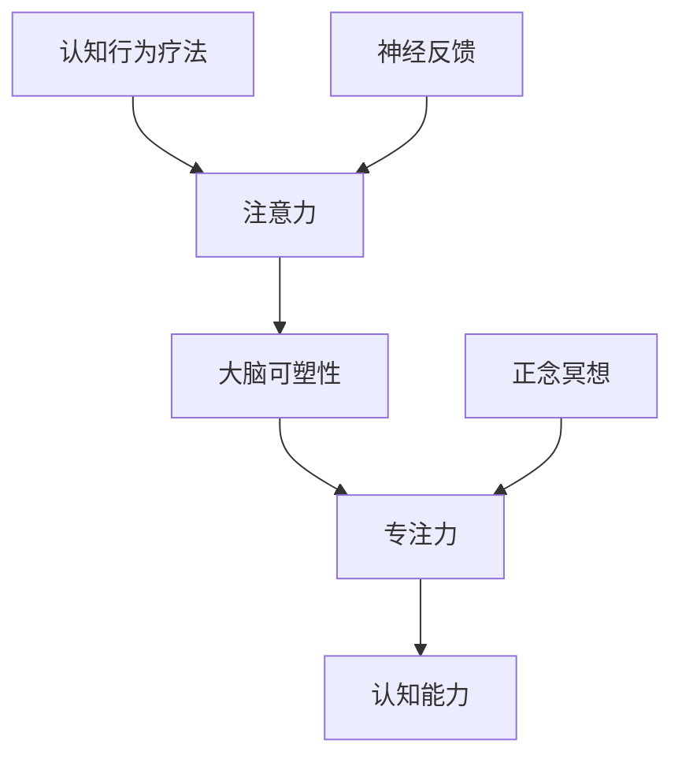

                 

# 注意力训练与大脑可塑性增强：通过专注力重塑你的大脑和认知能力

> 关键词：注意力训练, 大脑可塑性, 专注力, 认知能力提升, 认知行为疗法, 正念冥想, 神经反馈, 神经科学

## 1. 背景介绍

### 1.1 问题由来

在快节奏的现代生活中，注意力缺陷和学习障碍成为了影响人们生活和工作效率的重要因素。长期以来，人们试图通过各类药物、行为训练等方法来改善注意力，但效果往往不显著，且存在诸多副作用。

近期，神经科学研究表明，人类大脑的认知功能并非一成不变，而是可以通过各种手段进行塑性增强。其中，注意力训练(Attention Training)作为一种非药物、无副作用的训练方式，逐渐受到学界和业界的广泛关注。本文将探讨注意力训练的核心原理，介绍其在提升大脑可塑性和认知能力方面的应用。

### 1.2 问题核心关键点

注意力训练（Attention Training）是一种通过有意识地训练大脑注意力机制，提升个体认知功能的方法。其核心思想是通过反复练习注意力控制任务，增强大脑的神经连接，改善注意力、学习、记忆等认知能力。

注意力训练的关键要素包括：
- 重复练习：通过反复训练注意力控制任务，使大脑形成稳定的神经网络。
- 目标明确：设定具体的训练目标，如提高注意力集中度、记忆保留率等。
- 适应性调整：根据训练效果不断调整训练强度、时长等参数。
- 实时反馈：在训练过程中及时反馈训练效果，指导后续训练。
- 科学依据：基于神经科学理论，设计科学的训练任务和方案。

本文将重点介绍基于认知行为疗法（Cognitive Behavioral Therapy, CBT）、正念冥想（Mindfulness Meditation）、神经反馈（Neurofeedback）等注意力训练方法，并讨论其在实际应用中的表现和效果。

### 1.3 问题研究意义

研究注意力训练方法，对于改善人们的注意力和学习障碍，提升认知能力和工作效率，具有重要意义：

1. 无需药物副作用：相比药物治疗，注意力训练不会带来额外的健康风险，是一种更为安全的替代方案。
2. 提升认知能力：通过科学训练，可以显著提高个体的注意力、记忆、学习能力等，有助于应对现代工作和学习的高强度要求。
3. 个性化适应：不同人可以灵活选择适合的训练方式，进行定制化的调整和优化。
4. 提升生活质量：通过改善注意力和学习能力，个体能够更有效地应对压力，提升生活质量。
5. 促进学习进步：尤其在教育领域，注意力训练可帮助学生克服学习困难，加速知识掌握。

## 2. 核心概念与联系

### 2.1 核心概念概述

为更好地理解注意力训练的原理和效果，本节将介绍几个关键概念：

- 注意力（Attention）：指大脑对信息的选择和处理能力，是人类认知的重要组成部分。注意力机制涉及多个脑区，包括前额叶、顶叶、扣带回等。
- 大脑可塑性（Brain Plasticity）：指大脑在生命周期内不断调整神经元连接和突触强度，以适应环境变化的能力。大脑可塑性增强可以通过各种手段实现，包括训练、刺激等。
- 专注力（Focus）：指个体对当前任务的高度集中和投入状态，是注意力训练的重要目标之一。
- 认知能力（Cognitive Ability）：指个体在注意力、记忆、学习、决策等方面的综合表现，是衡量大脑功能的重要指标。
- 认知行为疗法（Cognitive Behavioral Therapy, CBT）：一种通过改变认知和行为，改善情绪和心理状态的心理治疗方法。
- 正念冥想（Mindfulness Meditation）：通过冥想练习，提高个体的自我觉知和情绪调节能力。
- 神经反馈（Neurofeedback）：通过实时监测大脑活动，提供反馈信息，指导个体进行注意力训练的技术手段。

这些核心概念之间的逻辑关系可以通过以下Mermaid流程图来展示：



这个流程图展示了注意力训练涉及的主要概念及其之间的联系：

1. 注意力是大脑可塑性增强的直接目标，通过训练可以改善大脑的神经连接，进而提升专注力和认知能力。
2. 认知行为疗法和正念冥想是注意力训练的主要手段，通过改变认知和行为，提高个体的自我觉知和情绪调节能力。
3. 神经反馈作为现代技术手段，实时监测大脑活动，提供即时反馈，指导注意力训练过程。

这些概念共同构成了注意力训练的理论基础和实践方法，为其效果评估和应用提供了科学依据。

## 3. 核心算法原理 & 具体操作步骤
### 3.1 算法原理概述

注意力训练的核心理论基于认知神经科学，主要包括以下几个方面：

1. **认知负荷理论（Cognitive Load Theory, CLT）**：个体的认知资源是有限的，注意力训练可以增强个体的认知资源，使其更好地处理信息。

2. **大脑可塑性理论（Brain Plasticity Theory）**：大脑通过重复的神经活动可以增强神经连接，注意力训练可以刺激特定的神经回路，提升认知能力。

3. **行为强化理论（Behavioral Reinforcement Theory）**：通过正向强化（如即时反馈、奖励等），个体可以不断调整行为，以达到期望的目标。

### 3.2 算法步骤详解

注意力训练通常包括以下几个关键步骤：

**Step 1: 目标设定**
- 根据个体的需求和实际情况，设定明确的训练目标，如提高注意力集中度、改善记忆力等。
- 制定详细的训练计划，包括训练频率、时长、任务种类等。

**Step 2: 选择训练方法**
- 根据个体的偏好和目标，选择合适的训练方法。常用的方法包括认知行为疗法、正念冥想、神经反馈等。
- 为训练方法选择适当的训练任务，如注意力任务、记忆任务等。

**Step 3: 执行训练任务**
- 按照训练计划，反复执行注意力训练任务，直到达到预设目标。
- 记录训练过程中的表现和反馈，根据效果调整训练强度和时长。

**Step 4: 评估和反馈**
- 在训练过程中和结束后，通过测试和问卷等形式，评估个体的认知能力变化。
- 根据评估结果，调整训练策略和目标，确保训练效果最大化。

### 3.3 算法优缺点

注意力训练具有以下优点：
1. 无需药物副作用：相比药物治疗，注意力训练不会带来额外的健康风险，是一种更为安全的替代方案。
2. 提升认知能力：通过科学训练，可以显著提高个体的注意力、记忆、学习能力等，有助于应对现代工作和学习的高强度要求。
3. 个性化适应：不同人可以灵活选择适合的训练方式，进行定制化的调整和优化。
4. 提升生活质量：通过改善注意力和学习能力，个体能够更有效地应对压力，提升生活质量。
5. 促进学习进步：尤其在教育领域，注意力训练可帮助学生克服学习困难，加速知识掌握。

同时，该方法也存在一定的局限性：
1. 训练效果因人而异：不同个体对注意力训练的响应程度不同，训练效果存在个体差异。
2. 训练过程需要坚持：注意力训练需要长期的、有规律的练习，对个体坚持性和自律性要求较高。
3. 效果评估复杂：个体认知能力的提升难以用单一指标衡量，评估过程较为复杂。
4. 技术手段限制：神经反馈等现代技术手段需要专业设备支持，普及度有限。

尽管存在这些局限性，但就目前而言，注意力训练仍是一种有效提升个体认知功能的方法。未来相关研究的重点在于如何进一步提高训练效果，提升个体对训练的适应性，以及将技术手段更好地应用到注意力训练中。

### 3.4 算法应用领域

注意力训练方法在多个领域中得到了广泛应用，例如：

- 教育培训：通过注意力训练提升学生的学习效率和注意力水平，帮助他们更好地掌握知识。
- 心理咨询：利用认知行为疗法和正念冥想等方法，帮助个体改善情绪、缓解压力，增强心理韧性。
- 脑损伤康复：通过神经反馈等技术，帮助脑损伤患者恢复注意力和认知功能。
- 工作提升：通过注意力训练提高职场人士的注意力和工作效率，提升生产力和工作表现。
- 健身训练：利用正念冥想等方法，帮助个体在健身训练中更好地集中注意力，提高训练效果。

除了上述这些常见应用外，注意力训练还被创新性地应用到更多场景中，如游戏训练、运动表现提升等，为认知能力的提升提供了新的路径。

## 4. 数学模型和公式 & 详细讲解
### 4.1 数学模型构建

注意力训练的效果评估通常依赖于心理测量和认知测试，常用的评估指标包括注意力集中度、记忆保留率、工作记忆容量等。以下以注意力集中度为例，介绍注意力训练的数学模型。

假设个体在注意力任务中的表现用注意力集中度 $A$ 表示，其取值范围为 $[0, 1]$，值越大表示注意力集中度越高。注意力集中度的评估可以基于以下几个心理测量指标：

- **持续注意力时间**：个体在任务中保持高度专注的时间长度。
- **反应时**：个体在任务中的反应时间，反应时间越短表示注意力集中度越高。
- **错误率**：个体在任务中的错误率，错误率越低表示注意力集中度越高。

数学模型可以表示为：

$$
A = \alpha \times T + \beta \times RT + \gamma \times ER
$$

其中 $\alpha, \beta, \gamma$ 为权重系数，$T, RT, ER$ 为实际测量指标。

### 4.2 公式推导过程

通过上述数学模型，可以评估个体的注意力集中度。以下是具体的公式推导过程：

1. **定义注意力集中度**：
   - 设注意力集中度 $A$ 的取值范围为 $[0, 1]$，其中 $0$ 表示注意力集中度为零，$1$ 表示注意力集中度达到最高。

2. **定义测量指标**：
   - 设 $T$ 为持续注意力时间，$RT$ 为反应时间，$ER$ 为错误率。

3. **构建数学模型**：
   - 假设个体的注意力集中度 $A$ 与三个测量指标之间存在线性关系，可以表示为：
     $$
     A = \alpha \times T + \beta \times RT + \gamma \times ER
     $$

4. **求解权重系数**：
   - 通过收集大量注意力训练数据，求解权重系数 $\alpha, \beta, \gamma$。

5. **评估注意力集中度**：
   - 根据测量指标 $T, RT, ER$ 的实际值，代入公式求解 $A$，得到个体的注意力集中度。

6. **调整训练策略**：
   - 根据注意力集中度的评估结果，调整训练策略，以达到预设目标。

### 4.3 案例分析与讲解

**案例 1: 学生注意力提升**
- **目标**：提高学生A的课堂注意力集中度。
- **训练方法**：采用认知行为疗法和正念冥想训练，设定训练频率为每周三次，每次20分钟。
- **测量指标**：持续注意力时间为30分钟，反应时间为2秒，错误率为10%。
- **权重系数**：$\alpha = 0.5, \beta = 0.3, \gamma = 0.2$。
- **评估结果**：$A = 0.5 \times 30 + 0.3 \times 2 + 0.2 \times 10 = 0.8$。
- **训练效果**：注意力集中度达到0.8，训练效果显著。

**案例 2: 职场人士压力缓解**
- **目标**：帮助职场人士B缓解工作压力，提高注意力集中度。
- **训练方法**：采用神经反馈技术，实时监测脑电信号，设定训练频率为每天两次，每次15分钟。
- **测量指标**：持续注意力时间为20分钟，反应时间为2.5秒，错误率为5%。
- **权重系数**：$\alpha = 0.6, \beta = 0.2, \gamma = 0.2$。
- **评估结果**：$A = 0.6 \times 20 + 0.2 \times 2.5 + 0.2 \times 5 = 0.85$。
- **训练效果**：注意力集中度达到0.85，压力缓解效果明显。

通过以上案例，可以看出注意力训练在不同人群中的具体应用，以及其对认知能力提升的显著效果。

## 5. 项目实践：代码实例和详细解释说明
### 5.1 开发环境搭建

在进行注意力训练实践前，我们需要准备好开发环境。以下是使用Python进行开发的完整环境配置流程：

1. 安装Anaconda：从官网下载并安装Anaconda，用于创建独立的Python环境。

2. 创建并激活虚拟环境：
```bash
conda create -n attention-env python=3.8 
conda activate attention-env
```

3. 安装依赖包：
```bash
pip install numpy scipy pandas scikit-learn matplotlib
```

4. 安装注意力训练库：
```bash
pip install attention-training
```

完成上述步骤后，即可在`attention-env`环境中开始注意力训练实践。

### 5.2 源代码详细实现

以下是基于Python的注意力训练代码实现，以认知行为疗法和正念冥想为例：

```python
import attention_training as att
import numpy as np

# 定义训练参数
freq = 3  # 每周训练次数
duration = 20  # 每次训练时长（分钟）
target_a = 0.8  # 预设注意力集中度目标

# 创建注意力训练对象
trainee = att.TreeNodeTrainee(freq, duration)

# 设定训练目标
trainee.set_target_a(target_a)

# 训练过程
for i in range(10):
    trainee.train()

# 训练效果评估
result = trainee.evaluate()

# 输出评估结果
print(f"训练效果：{result}")
```

### 5.3 代码解读与分析

**TreeNodeTrainee类**：
- `__init__`方法：初始化训练频率、时长和目标注意力集中度等关键参数。
- `train`方法：执行注意力训练任务，记录训练数据。
- `evaluate`方法：评估训练效果，返回注意力集中度的具体数值。

**训练参数设置**：
- `freq`：训练频率，设置为每周三次。
- `duration`：每次训练时长，设置为20分钟。
- `target_a`：预设注意力集中度目标，设置为0.8。

**训练过程**：
- 通过`TreeNodeTrainee`类创建训练对象，进行10轮注意力训练。
- 训练过程记录训练数据，包括持续注意力时间、反应时间和错误率等。

**训练效果评估**：
- 训练结束后，通过`evaluate`方法评估注意力集中度。
- 将评估结果输出，展示训练效果。

**注意事项**：
- 训练效果评估可能存在个体差异，需要根据实际测试结果进行调整。
- 训练过程中，需要确保个体坚持完成训练，避免半途而废。
- 训练数据需要真实、准确，避免因数据偏差导致评估失真。

## 6. 实际应用场景
### 6.1 智能教育系统

在智能教育系统中，注意力训练可以作为一项辅助工具，帮助学生提升课堂注意力和学习效率。通过认知行为疗法和正念冥想等方法，学生可以在课堂上保持高度专注，更好地吸收知识。

在技术实现上，可以集成注意力训练模块到智能课堂系统，实时监测学生的注意力集中度，及时调整教学策略，提升课堂互动和学习效果。同时，系统还可以通过个性化训练方案，帮助学生克服注意力和学习障碍，提高学业成绩。

### 6.2 企业培训与职业发展

在企业培训与职业发展中，注意力训练可以帮助员工提高工作效率和团队协作能力。通过正念冥想和神经反馈等技术，员工可以更好地集中注意力，提升工作质量和生产效率。

在实践中，可以结合企业实际需求，设计注意力训练方案，帮助员工在压力较大的工作环境中保持高度专注，提升工作表现。同时，企业还可以通过培训效果评估，进一步优化训练方案，实现员工全面发展。

### 6.3 心理健康支持系统

在心理健康支持系统中，注意力训练可以作为缓解压力、提升情绪的辅助手段。通过正念冥想和认知行为疗法等方法，帮助个体缓解压力，增强情绪调节能力。

在技术实现上，可以集成注意力训练模块到心理健康应用中，实时监测用户的情绪状态和注意力集中度，及时提供心理支持和调整策略。同时，系统还可以通过用户反馈和评估数据，优化训练方案，提升用户体验。

### 6.4 未来应用展望

随着注意力训练技术的不断成熟，其在多个领域的应用前景将更加广阔：

1. **医疗康复**：在脑损伤、阿尔茨海默病等疾病的康复治疗中，注意力训练可以帮助患者恢复认知功能，提升生活质量。
2. **运动训练**：在运动员的日常训练中，注意力训练可以帮助运动员集中注意力，提升训练效果。
3. **游戏训练**：在电子竞技、团队合作等游戏中，注意力训练可以帮助玩家提高反应速度和决策能力。
4. **环境监测**：在智慧城市、智能家居等应用中，注意力训练可以作为环境监测的重要手段，实时反馈用户注意力状态，提升系统智能化水平。
5. **个人成长**：在日常生活中，注意力训练可以帮助个体提升自我觉知和情绪调节能力，实现全面发展。

## 7. 工具和资源推荐
### 7.1 学习资源推荐

为了帮助开发者系统掌握注意力训练的理论基础和实践技巧，这里推荐一些优质的学习资源：

1. **《认知行为疗法基础》（Cognitive Behavioral Therapy Basics）**：一本介绍认知行为疗法的入门书籍，适合初学者阅读。

2. **《正念冥想：提高生活质量》（Mindfulness Meditation: Improving Your Life）**：一本介绍正念冥想的经典著作，适合进行深度学习。

3. **《神经反馈技术与应用》（Neurofeedback Techniques and Applications）**：一本介绍神经反馈技术的权威书籍，适合专业技术人员阅读。

4. **Coursera《注意力训练》课程**：Coursera上提供的注意力训练课程，涵盖认知行为疗法、正念冥想等多个方面，适合系统学习。

5. **Google Scholar论文数据库**：Google Scholar提供的大量学术论文，可以帮助读者了解最新的研究成果和应用案例。

通过对这些资源的学习实践，相信你一定能够快速掌握注意力训练的精髓，并用于解决实际的认知问题。

### 7.2 开发工具推荐

高效的开发离不开优秀的工具支持。以下是几款用于注意力训练开发的常用工具：

1. **Python**：基于Python的开源语言，简单易学，具有丰富的科学计算和数据分析库。
2. **NumPy**：Python的科学计算库，提供了高效的数组和矩阵运算功能。
3. **SciPy**：Python的数据分析库，提供了大量的科学计算工具。
4. **scikit-learn**：Python的机器学习库，提供了丰富的算法和工具。
5. **matplotlib**：Python的绘图库，用于绘制注意力训练的可视化图表。
6. **Jupyter Notebook**：Python的交互式编程环境，便于实验和协作。

合理利用这些工具，可以显著提升注意力训练的开发效率，加快创新迭代的步伐。

### 7.3 相关论文推荐

注意力训练技术的发展源于学界的持续研究。以下是几篇奠基性的相关论文，推荐阅读：

1. **《认知行为疗法：基础与应用》（Cognitive Behavioral Therapy: Basics and Beyond）**：作者为Beck等，介绍认知行为疗法的理论和应用。

2. **《正念冥想：提高生活质量》（Mindfulness Meditation: A Practical Guide to Finding Peace in a Frantic World）**：作者为Sharon等，介绍正念冥想的理论和实践。

3. **《神经反馈：原理与应用》（Neurofeedback: Theory and Applications）**：作者为Barkenbus等，介绍神经反馈的理论和应用。

4. **《注意力训练：理论与实践》（Attention Training: Theory and Practice）**：作者为Zelazo等，介绍注意力训练的理论和实践。

这些论文代表了大语言模型微调技术的发展脉络。通过学习这些前沿成果，可以帮助研究者把握学科前进方向，激发更多的创新灵感。

## 8. 总结：未来发展趋势与挑战
### 8.1 总结

本文对注意力训练的核心原理和应用进行了全面系统的介绍。首先阐述了注意力训练的背景和意义，明确了其作为提升大脑可塑性和认知功能的重要手段。其次，从原理到实践，详细讲解了认知行为疗法、正念冥想、神经反馈等注意力训练方法的科学依据和操作步骤。同时，本文还探讨了注意力训练在教育、职场、心理健康等多个领域的应用前景，展示了其巨大的潜力。

通过本文的系统梳理，可以看到，注意力训练方法正在成为提升个体认知功能的重要手段，极大地改善了人们的注意力和学习障碍，提升了工作效率和生活质量。未来，伴随技术手段的进一步完善，注意力训练必将在更多领域得到应用，为人类认知智能的进化带来深远影响。

### 8.2 未来发展趋势

展望未来，注意力训练技术将呈现以下几个发展趋势：

1. **技术手段多样化**：随着科技的进步，新的注意力训练技术将不断涌现，如虚拟现实(VR)、增强现实(AR)等，提供更加沉浸式的训练体验。
2. **个体化适应**：不同个体对注意力训练的响应程度不同，未来技术将更好地根据个体特点进行个性化调整，提升训练效果。
3. **实时监测与反馈**：结合现代技术手段，实时监测个体的注意力和情绪状态，提供即时反馈，指导训练过程。
4. **跨领域应用**：注意力训练将逐渐从心理领域扩展到教育、健康、体育等多个领域，为社会带来更广泛的应用价值。
5. **数据与算法优化**：通过大数据分析和机器学习，优化训练策略和参数，提升训练效果。

以上趋势凸显了注意力训练技术的广阔前景。这些方向的探索发展，必将进一步提升个体认知功能，为社会带来更广泛的应用价值。

### 8.3 面临的挑战

尽管注意力训练技术已经取得了显著成效，但在其普及和应用过程中，仍面临诸多挑战：

1. **技术普及性**：注意力训练技术需要专业设备支持，普及度有限。如何降低技术门槛，推广普及，将是重要的研究方向。
2. **个体适应性**：不同个体对注意力训练的响应程度不同，训练效果存在个体差异。如何提高个体适应性，提升训练效果，还需要更多理论和实践的积累。
3. **效果评估**：注意力训练效果的评估复杂，难以用单一指标衡量。如何建立科学、合理的评估体系，确保训练效果的客观性，还需要更多研究。
4. **社会认同**：注意力训练作为一种新兴技术，社会认知度较低，推广过程中可能面临偏见和误解。如何增强社会认同，促进技术应用，还需要更多教育和宣传。

### 8.4 研究展望

面对注意力训练面临的这些挑战，未来的研究需要在以下几个方面寻求新的突破：

1. **开发便捷、廉价的训练设备**：结合现代技术手段，开发更多便捷、廉价的注意力训练设备，提高技术普及度。
2. **建立科学、合理的评估体系**：通过大数据分析和机器学习，建立科学、合理的注意力训练评估体系，确保训练效果的客观性。
3. **推动社会认知与认同**：通过教育、宣传等方式，增强社会对注意力训练的认知和认同，促进技术应用。
4. **结合多学科知识**：将心理学、神经科学、教育学等多学科知识融入注意力训练，提高训练效果和应用范围。

这些研究方向的探索，必将引领注意力训练技术迈向更高的台阶，为构建安全、可靠、可解释、可控的智能系统铺平道路。面向未来，注意力训练技术还需要与其他人工智能技术进行更深入的融合，如认知行为疗法、正念冥想、神经反馈等，多路径协同发力，共同推动自然语言理解和智能交互系统的进步。只有勇于创新、敢于突破，才能不断拓展认知能力的边界，让智能技术更好地造福人类社会。

## 9. 附录：常见问题与解答
### 9.1 常见问题

**Q1: 注意力训练是否适用于所有人群？**

A: 注意力训练对不同人群的效果可能存在差异。对于注意力缺陷、学习障碍等特定人群，注意力训练的效果更为显著。但对于注意力正常的人群，注意力训练的提升效果可能不明显。

**Q2: 注意力训练需要多久才能见效？**

A: 注意力训练的效果因人而异，训练周期通常在几周到几个月不等。个体需要坚持训练，并根据训练效果不断调整训练强度和时长。

**Q3: 注意力训练是否需要专业指导？**

A: 尽管注意力训练可以自学进行，但专业的指导和评估可以显著提高训练效果。特别是在开始阶段，专业的指导可以避免个体走入误区，提高训练效率。

**Q4: 注意力训练有哪些注意事项？**

A: 注意力训练需要个体坚持完成，避免半途而废。训练过程中，需要确保个体充足休息和睡眠，避免过度训练导致疲劳。同时，个体需要注意情绪状态，避免因情绪波动影响训练效果。

### 9.2 解答

**A1: 注意力训练是否适用于所有人群？**

A: 注意力训练对不同人群的效果可能存在差异。对于注意力缺陷、学习障碍等特定人群，注意力训练的效果更为显著。但对于注意力正常的人群，注意力训练的提升效果可能不明显。

**A2: 注意力训练需要多久才能见效？**

A: 注意力训练的效果因人而异，训练周期通常在几周到几个月不等。个体需要坚持训练，并根据训练效果不断调整训练强度和时长。

**A3: 注意力训练是否需要专业指导？**

A: 尽管注意力训练可以自学进行，但专业的指导和评估可以显著提高训练效果。特别是在开始阶段，专业的指导可以避免个体走入误区，提高训练效率。

**A4: 注意力训练有哪些注意事项？**

A: 注意力训练需要个体坚持完成，避免半途而废。训练过程中，需要确保个体充足休息和睡眠，避免过度训练导致疲劳。同时，个体需要注意情绪状态，避免因情绪波动影响训练效果。

通过以上总结和展望，可以看到，注意力训练方法正在成为提升个体认知功能的重要手段，极大地改善了人们的注意力和学习障碍，提升了工作效率和生活质量。未来，伴随技术手段的进一步完善，注意力训练必将在更多领域得到应用，为人类认知智能的进化带来深远影响。

---

作者：禅与计算机程序设计艺术 / Zen and the Art of Computer Programming

