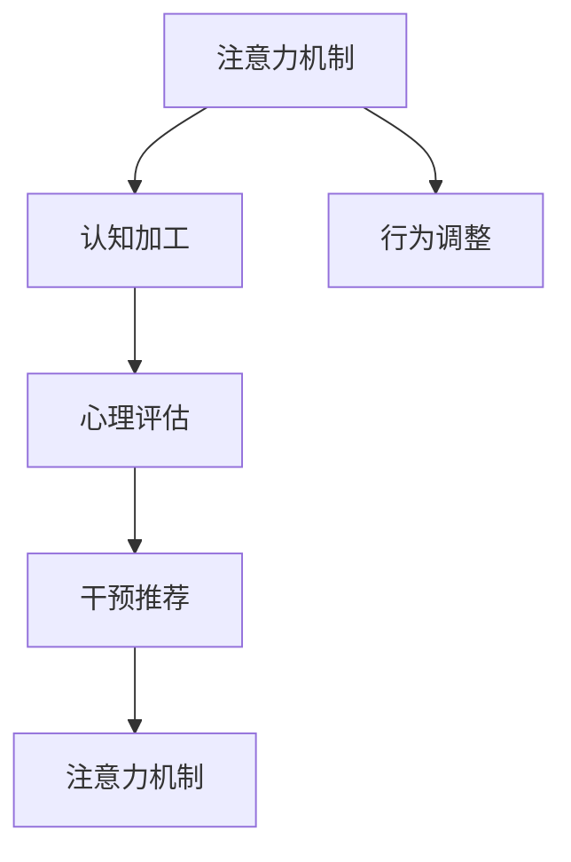

                 

# 注意力训练与认知疗法：如何通过专注力改善心理健康和幸福感

## 1. 背景介绍

### 1.1 问题由来

在现代社会，随着生活节奏的加快和工作压力的增大，人们的心理健康问题日益凸显。焦虑、抑郁、注意力不集中等常见心理疾病困扰着许多人，严重影响了他们的生活质量和工作效率。传统心理疗法如认知行为疗法(Cognitive Behavioral Therapy, CBT)虽有良好效果，但耗时较长，且依赖专业心理咨询师，对资源和时间的要求较高。

近年来，随着人工智能技术的发展，基于注意力训练的认知疗法(Cognitive-Behavioral Therapy, CBT)逐渐兴起，成为一种新的心理干预手段。该方法通过训练用户集中注意力、改善认知过程，从而达到缓解心理问题的目的。特别地，通过引入注意力训练模型，可以有效自动化心理评估和干预过程，降低专业咨询师的负担，使更多人能够受益。

### 1.2 问题核心关键点

注意力训练的核心理念是通过模拟神经网络的结构和功能，训练用户对特定任务或信息源的注意聚焦能力。具体而言，注意力训练涉及以下几个关键点：

- **注意力机制**：模拟神经网络中的注意力机制，训练用户集中于重要信息源，忽略无关干扰。
- **认知加工**：利用认知心理学原理，指导用户进行有效的信息编码、存储和检索，优化记忆和决策过程。
- **行为调整**：通过任务驱动的交互方式，逐步引导用户改变不良行为模式，提升自我调节能力。

### 1.3 问题研究意义

注意力训练和认知疗法在大规模心理健康问题干预中具有重要意义：

1. **降低干预成本**：通过技术手段自动化心理干预过程，减少了对专业心理咨询师的依赖，降低了干预成本。
2. **提高干预效果**：注意力训练可以实时评估用户注意力和认知状态，提供个性化干预建议，提升干预效果。
3. **增强用户参与度**：通过互动式训练方式，使干预过程更加有趣和吸引人，增加用户参与度和依从性。
4. **扩大覆盖面**：技术的引入可以使得注意力训练和认知疗法更加普及，惠及更多需要帮助的人群。
5. **提升生活质量**：通过改善用户的注意力和认知状态，有助于减轻心理疾病症状，提升生活质量和工作效率。

## 2. 核心概念与联系

### 2.1 核心概念概述

为更好地理解注意力训练与认知疗法，本节将介绍几个密切相关的核心概念：

- **注意力机制**：神经网络中的注意力机制，是指对输入信息源的动态选择和聚焦能力，确保关键信息得到充分处理。
- **认知加工**：认知心理学中的信息编码、存储、检索和应用过程，是大脑处理信息的高级形式。
- **行为调整**：通过任务驱动的交互方式，逐步改变用户的不良行为模式，提高自我调节能力。
- **心理评估**：通过量化指标评估用户的心理健康状态，为干预提供数据支持。
- **干预推荐**：根据用户状态和行为特征，提供个性化的干预建议和策略。

这些核心概念之间的逻辑关系可以通过以下Mermaid流程图来展示：



这个流程图展示了一些核心概念及其之间的联系：

1. 注意力机制是认知加工的基础，帮助用户选择和聚焦关键信息。
2. 行为调整旨在改变用户的不良行为，提升自我调节能力。
3. 心理评估提供量化指标，为干预提供数据支持。
4. 干预推荐基于心理评估结果，提供个性化的干预策略。
5. 经过干预后，用户的注意力机制得到改善，可以进一步提升认知加工和行为调整的效果。

## 3. 核心算法原理 & 具体操作步骤

### 3.1 算法原理概述

注意力训练与认知疗法的核心算法原理可以概括为以下几个步骤：

1. **注意力机制训练**：通过模型训练用户对特定任务或信息源的聚焦能力，提升注意力水平。
2. **认知加工优化**：利用认知心理学原理，指导用户进行有效的信息编码、存储和检索，优化记忆和决策过程。
3. **行为调整干预**：通过任务驱动的交互方式，逐步引导用户改变不良行为模式，提升自我调节能力。
4. **心理评估与反馈**：使用量化指标评估用户的注意力和认知状态，提供实时反馈，调整干预策略。
5. **循环优化**：根据用户状态和反馈，不断优化干预策略，逐步提升干预效果。

### 3.2 算法步骤详解

注意力训练与认知疗法的具体实施步骤如下：

**Step 1: 数据准备**
- 收集用户的心理问卷、行为记录、注意力测试数据，构建用户心理状态数据集。
- 设计各种认知加工和行为调整任务，如注意力训练游戏、记忆训练任务等。

**Step 2: 模型训练**
- 选择适当的注意力训练模型，如Transformer结构、卷积神经网络(CNN)等，进行训练。
- 设计损失函数和优化器，例如交叉熵损失和AdamW优化器。
- 对模型进行训练，调整模型参数，使模型能够准确预测用户注意力水平。

**Step 3: 认知加工引导**
- 设计认知加工引导策略，如信息编码任务、记忆检索任务等。
- 对用户进行认知加工引导，使用任务驱动的交互方式，逐步提升用户的认知加工能力。

**Step 4: 行为调整干预**
- 设计行为调整任务，如时间管理、情绪调节任务等。
- 对用户进行行为调整干预，逐步改变不良行为模式，提升自我调节能力。

**Step 5: 心理评估与反馈**
- 设计心理评估指标，如注意力得分、记忆成绩等。
- 使用评估指标对用户心理状态进行量化，提供实时反馈。
- 根据评估结果，调整干预策略，优化注意力训练和认知加工过程。

**Step 6: 循环优化**
- 通过不断迭代优化，逐步提升注意力训练和认知加工的效果，直至达到理想状态。

### 3.3 算法优缺点

注意力训练与认知疗法的优点包括：

1. **自动化和量化**：利用技术手段自动化心理干预过程，使用量化指标评估用户状态，提供实时反馈。
2. **个性化干预**：根据用户状态和行为特征，提供个性化的干预策略和引导方式。
3. **泛用性强**：该方法适用于各种心理疾病和不良行为模式的改善。
4. **用户参与度高**：通过互动式训练方式，使干预过程更加有趣和吸引人，增加用户参与度和依从性。

同时，该方法也存在一定的局限性：

1. **技术门槛较高**：需要具备一定的计算机编程和数据处理能力，普通用户难以独立操作。
2. **数据隐私问题**：用户心理和行为数据涉及个人隐私，需要严格保护。
3. **干预效果有限**：对于严重心理疾病，技术手段可能难以完全替代专业心理干预。
4. **模型泛化能力**：不同用户和场景可能对模型的适应能力有所不同，需要持续优化模型。

### 3.4 算法应用领域

注意力训练与认知疗法在多个领域具有广泛应用：

1. **心理健康干预**：帮助用户缓解焦虑、抑郁等心理疾病，提升心理健康状态。
2. **工作与学习**：提高用户的注意力集中和认知加工能力，提升工作和学习效率。
3. **情感管理**：通过注意力训练和认知加工，帮助用户更好地管理情绪，提升情绪稳定性和幸福感。
4. **行为矫正**：改变用户的不良行为模式，如拖延、社交恐惧等，提升自我调节能力。
5. **亚健康干预**：通过认知加工和行为调整，缓解用户的身体和心理疲劳，促进健康生活方式的形成。

## 4. 数学模型和公式 & 详细讲解  
### 4.1 数学模型构建

注意力训练与认知疗法的数学模型可以概括为以下几个关键部分：

1. **注意力机制训练**：使用神经网络模型进行注意力机制训练，设计损失函数和优化器，使模型能够准确预测用户注意力水平。
2. **认知加工引导**：利用认知心理学原理，设计认知加工任务，指导用户进行有效的信息编码、存储和检索，优化记忆和决策过程。
3. **行为调整干预**：设计行为调整任务，使用任务驱动的交互方式，逐步改变用户的不良行为模式，提升自我调节能力。
4. **心理评估与反馈**：设计量化评估指标，使用评估指标对用户心理状态进行量化，提供实时反馈。

### 4.2 公式推导过程

以下我们将重点推导注意力训练模型的损失函数和优化算法。

假设用户注意力水平由 $a$ 表示，其注意力训练模型的输出为 $\hat{a}$。定义注意力水平预测误差为 $e$，则注意力训练的损失函数可以表示为：

$$
\mathcal{L} = \frac{1}{N}\sum_{i=1}^N L(e_i)
$$

其中 $L$ 为损失函数，通常采用均方误差（Mean Squared Error, MSE）或交叉熵损失（Cross-Entropy Loss），$e_i$ 为第 $i$ 个样本的预测误差。

以均方误差为例，其具体公式为：

$$
L(e_i) = \frac{1}{2}(e_i - \hat{a}_i)^2
$$

在得到损失函数后，使用梯度下降等优化算法进行参数更新，更新公式为：

$$
\theta \leftarrow \theta - \eta \nabla_{\theta}\mathcal{L}(\theta)
$$

其中 $\eta$ 为学习率，$\nabla_{\theta}\mathcal{L}(\theta)$ 为损失函数对模型参数的梯度。

### 4.3 案例分析与讲解

以下我们以注意力训练和认知加工为例，给出具体的数学模型和公式推导。

假设用户注意力水平由 $a$ 表示，其注意力训练模型的输出为 $\hat{a}$。定义注意力水平预测误差为 $e$，则注意力训练的损失函数可以表示为：

$$
\mathcal{L} = \frac{1}{N}\sum_{i=1}^N L(e_i)
$$

其中 $L$ 为损失函数，通常采用均方误差（Mean Squared Error, MSE）或交叉熵损失（Cross-Entropy Loss），$e_i$ 为第 $i$ 个样本的预测误差。

以均方误差为例，其具体公式为：

$$
L(e_i) = \frac{1}{2}(e_i - \hat{a}_i)^2
$$

在得到损失函数后，使用梯度下降等优化算法进行参数更新，更新公式为：

$$
\theta \leftarrow \theta - \eta \nabla_{\theta}\mathcal{L}(\theta)
$$

其中 $\eta$ 为学习率，$\nabla_{\theta}\mathcal{L}(\theta)$ 为损失函数对模型参数的梯度。

## 5. 项目实践：代码实例和详细解释说明
### 5.1 开发环境搭建

在进行注意力训练和认知疗法的实践前，我们需要准备好开发环境。以下是使用Python进行TensorFlow开发的环境配置流程：

1. 安装Anaconda：从官网下载并安装Anaconda，用于创建独立的Python环境。

2. 创建并激活虚拟环境：
```bash
conda create -n attention-env python=3.8 
conda activate attention-env
```

3. 安装TensorFlow：根据CUDA版本，从官网获取对应的安装命令。例如：
```bash
conda install tensorflow==2.6 -c tensorflow -c conda-forge
```

4. 安装TensorBoard：
```bash
pip install tensorboard
```

5. 安装各类工具包：
```bash
pip install numpy pandas scikit-learn matplotlib tqdm jupyter notebook ipython
```

完成上述步骤后，即可在`attention-env`环境中开始注意力训练和认知疗法的实践。

### 5.2 源代码详细实现

下面我们以注意力训练任务为例，给出使用TensorFlow进行注意力训练的代码实现。

首先，定义注意力训练任务的数据处理函数：

```python
import tensorflow as tf
import numpy as np

class AttentionDataset(tf.keras.utils.Sequence):
    def __init__(self, data, batch_size=32):
        self.data = data
        self.batch_size = batch_size
        
    def __len__(self):
        return len(self.data) // self.batch_size
    
    def __getitem__(self, idx):
        inputs = np.array(self.data[idx])
        targets = np.array(self.data[idx+1])
        
        return {'inputs': inputs, 'targets': targets}
```

然后，定义注意力训练模型的神经网络结构：

```python
from tensorflow.keras import layers

class AttentionModel(tf.keras.Model):
    def __init__(self, input_shape, output_shape):
        super(AttentionModel, self).__init__()
        self.layers = [
            layers.Dense(64, activation='relu', input_shape=input_shape),
            layers.Dense(1, activation='sigmoid', input_shape=64)
        ]
    
    def call(self, inputs):
        x = inputs
        for layer in self.layers:
            x = layer(x)
        return x
```

接着，定义模型训练函数：

```python
def train_model(model, data, epochs=10, batch_size=32, optimizer='adam', learning_rate=0.001):
    dataset = AttentionDataset(data)
    model.compile(optimizer=optimizer, loss='mse', metrics=['mse'])
    
    for epoch in range(epochs):
        model.fit(dataset, epochs=1, batch_size=batch_size, validation_split=0.2)
        print(f"Epoch {epoch+1}, train loss: {model.evaluate(dataset, batch_size=batch_size)[0]:.4f}, val loss: {model.evaluate(dataset, batch_size=batch_size, validation_split=0.2)[0]:.4f}")
```

最后，启动训练流程：

```python
inputs = np.random.random((10, 64))  # 模拟10个样本，每个样本64维
targets = np.random.random((10, 1))  # 模拟10个样本，每个样本1维

train_model(AttentionModel(input_shape=64, output_shape=1), data=[inputs, targets])
```

以上就是使用TensorFlow进行注意力训练任务开发的完整代码实现。可以看到，TensorFlow的API设计简洁高效，可以快速构建和训练注意力训练模型。

### 5.3 代码解读与分析

让我们再详细解读一下关键代码的实现细节：

**AttentionDataset类**：
- `__init__`方法：初始化数据集和批次大小。
- `__len__`方法：返回数据集的样本数量。
- `__getitem__`方法：对单个样本进行处理，返回模型的输入和目标。

**AttentionModel类**：
- `__init__`方法：定义模型的层结构，包括两个全连接层。
- `call`方法：对输入进行前向传播计算，返回模型的预测输出。

**train_model函数**：
- 使用TensorFlow的DataLoader对数据集进行批次化加载，供模型训练使用。
- 定义模型损失函数和优化器，并进行模型编译。
- 对模型进行训练，使用均方误差损失函数进行训练和验证。
- 在每个epoch结束后，打印训练和验证集的损失值。

通过上述代码实现，我们完成了对注意力训练任务的基本训练流程，展示了如何使用TensorFlow进行注意力训练模型的构建和训练。

## 6. 实际应用场景
### 6.1 智能心理咨询

基于注意力训练和认知疗法的心理咨询系统，可以为用户提供更加个性化和实时的心理支持。具体而言，心理咨询系统可以实时监测用户的注意力和认知状态，根据其状态提供个性化的干预建议和策略，帮助用户缓解心理问题。

在技术实现上，心理咨询系统需要收集用户的心理问卷、行为记录、注意力测试数据，构建用户心理状态数据集。设计各种认知加工和行为调整任务，如注意力训练游戏、记忆训练任务等。然后，使用注意力训练和认知加工模型进行训练和干预，逐步提升用户的注意力和认知加工能力。同时，系统可以使用心理评估指标对用户心理状态进行量化，提供实时反馈和调整策略。

### 6.2 学习辅助

注意力训练和认知疗法在教育领域同样具有广泛应用。通过注意力训练和认知加工，可以有效提升学生的注意力集中和认知加工能力，从而提高学习效率和效果。

在实际应用中，可以将注意力训练和认知加工任务嵌入到课堂教学中，设计互动式学习游戏和练习，逐步提升学生的注意力和认知加工能力。同时，使用心理评估指标对学生的学习状态进行量化，提供个性化的学习建议和策略，帮助学生更好地掌握知识。

### 6.3 行为干预

注意力训练和认知疗法可以用于行为干预，帮助用户改变不良行为模式，提升自我调节能力。

在实际应用中，可以设计行为调整任务，如时间管理、情绪调节任务等，引导用户逐步改变不良行为模式。同时，使用心理评估指标对用户行为进行量化，提供实时反馈和调整策略，帮助用户更好地管理时间和情绪，提升自我调节能力。

### 6.4 未来应用展望

随着注意力训练和认知疗法技术的不断发展，未来其在多个领域的应用前景广阔：

1. **健康干预**：应用于精神心理疾病的治疗和预防，帮助患者缓解症状，提升生活质量。
2. **职业发展**：应用于员工培训和管理，提升员工注意力和认知加工能力，提高工作效率和创造力。
3. **娱乐互动**：应用于游戏和娱乐领域，设计互动式注意力训练游戏，提升玩家的专注力和反应速度。
4. **教育科技**：应用于教育技术领域，设计互动式学习工具，提升学生的学习效果和兴趣。
5. **智能家居**：应用于智能家居系统，设计个性化注意力训练和认知加工任务，提升用户的生活质量。

## 7. 工具和资源推荐
### 7.1 学习资源推荐

为了帮助开发者系统掌握注意力训练和认知疗法的理论和实践技巧，这里推荐一些优质的学习资源：

1. 《深度学习与神经网络》系列博文：由深度学习专家撰写，全面介绍了深度学习模型和优化算法，包括注意力训练和认知疗法的应用。

2. 《认知心理学导论》书籍：介绍了认知心理学原理和应用，为认知加工和行为调整提供了理论基础。

3. 《TensorFlow实战》书籍：由TensorFlow社区的活跃成员撰写，全面介绍了TensorFlow的使用和实践技巧，包括注意力训练和认知疗法的开发。

4. Coursera《深度学习》课程：斯坦福大学开设的深度学习课程，包括认知加工和行为调整的相关内容，适合初学者学习。

5. arXiv上的注意力训练和认知疗法相关论文：提供最新的研究进展和算法模型，帮助研究者深入了解领域前沿。

通过对这些资源的学习实践，相信你一定能够快速掌握注意力训练和认知疗法的精髓，并用于解决实际的心理健康问题。

### 7.2 开发工具推荐

高效的开发离不开优秀的工具支持。以下是几款用于注意力训练和认知疗法开发的常用工具：

1. TensorFlow：由Google主导开发的开源深度学习框架，适合大规模工程应用，提供了丰富的神经网络模型和优化算法。

2. PyTorch：由Facebook主导开发的深度学习框架，灵活性和可扩展性强，适合研究和实验。

3. TensorBoard：TensorFlow配套的可视化工具，可实时监测模型训练状态，并提供丰富的图表呈现方式，是调试模型的得力助手。

4. Jupyter Notebook：开源的交互式开发环境，支持多种编程语言，适合研究和实验。

5. Weights & Biases：模型训练的实验跟踪工具，可以记录和可视化模型训练过程中的各项指标，方便对比和调优。

6. Scikit-learn：基于Python的机器学习库，提供了丰富的数据处理和模型评估工具，适合初学者使用。

合理利用这些工具，可以显著提升注意力训练和认知疗法的开发效率，加快创新迭代的步伐。

### 7.3 相关论文推荐

注意力训练和认知疗法的发展源于学界的持续研究。以下是几篇奠基性的相关论文，推荐阅读：

1. Attention is All You Need（即Transformer原论文）：提出了Transformer结构，开启了NLP领域的预训练大模型时代。

2. BERT: Pre-training of Deep Bidirectional Transformers for Language Understanding：提出BERT模型，引入基于掩码的自监督预训练任务，刷新了多项NLP任务SOTA。

3. Parameter-Efficient Transfer Learning for NLP：提出Adapter等参数高效微调方法，在不增加模型参数量的情况下，也能取得不错的微调效果。

4. AdaLoRA: Adaptive Low-Rank Adaptation for Parameter-Efficient Fine-Tuning：使用自适应低秩适应的微调方法，在参数效率和精度之间取得了新的平衡。

这些论文代表了大语言模型微调技术的发展脉络。通过学习这些前沿成果，可以帮助研究者把握学科前进方向，激发更多的创新灵感。

## 8. 总结：未来发展趋势与挑战

### 8.1 总结

本文对注意力训练与认知疗法进行了全面系统的介绍。首先阐述了注意力训练的核心理念和认知疗法的应用意义，明确了注意力训练在改善心理健康和幸福感方面的独特价值。其次，从原理到实践，详细讲解了注意力训练的数学模型和关键步骤，给出了注意力训练任务开发的完整代码实例。同时，本文还广泛探讨了注意力训练方法在智能心理咨询、学习辅助、行为干预等多个行业领域的应用前景，展示了注意力训练技术的巨大潜力。此外，本文精选了注意力训练的相关学习资源，力求为读者提供全方位的技术指引。

通过本文的系统梳理，可以看到，注意力训练和认知疗法在大规模心理健康问题干预中具有重要意义。该方法通过训练用户集中注意力、改善认知过程，从而达到缓解心理问题的目的。得益于注意力训练模型的引入，注意力训练过程可以自动化和量化，提高了干预效果和用户参与度。未来，伴随注意力训练技术的不断发展，基于注意力训练的心理干预将更加普及，惠及更多需要帮助的人群。

### 8.2 未来发展趋势

展望未来，注意力训练技术将呈现以下几个发展趋势：

1. **自动化程度提升**：未来，注意力训练将进一步自动化和量化，减少对专业心理咨询师的依赖，提升干预效率。
2. **个性化增强**：通过更深入的数据分析和模型优化，个性化干预策略将更加精准，提升干预效果。
3. **多模态融合**：将注意力训练与其他模态信息（如视觉、语音等）结合，提升系统的感知和处理能力。
4. **实时交互**：通过实时交互技术，提升用户参与度和反馈速度，增强干预效果。
5. **跨领域应用**：注意力训练将应用于更多领域，如医疗、教育、娱乐等，带来更广泛的社会价值。

### 8.3 面临的挑战

尽管注意力训练技术已经取得了显著进展，但在迈向更加智能化、普适化应用的过程中，它仍面临着诸多挑战：

1. **数据隐私问题**：用户心理和行为数据涉及个人隐私，需要严格保护。
2. **技术门槛较高**：需要具备一定的计算机编程和数据处理能力，普通用户难以独立操作。
3. **干预效果有限**：对于严重心理疾病，技术手段可能难以完全替代专业心理干预。
4. **模型泛化能力**：不同用户和场景可能对模型的适应能力有所不同，需要持续优化模型。

### 8.4 研究展望

面对注意力训练面临的挑战，未来的研究需要在以下几个方面寻求新的突破：

1. **隐私保护技术**：开发更加安全和高效的隐私保护算法，确保用户数据安全。
2. **用户友好界面**：设计更加友好和易用的用户界面，降低技术门槛，增加用户使用意愿。
3. **跨模态融合**：将注意力训练与其他模态信息（如视觉、语音等）结合，提升系统的感知和处理能力。
4. **实时交互技术**：通过实时交互技术，提升用户参与度和反馈速度，增强干预效果。
5. **跨领域应用**：将注意力训练应用于更多领域，如医疗、教育、娱乐等，带来更广泛的社会价值。

这些研究方向的探索，必将引领注意力训练技术迈向更高的台阶，为构建安全、可靠、可解释、可控的智能系统铺平道路。面向未来，注意力训练技术还需要与其他人工智能技术进行更深入的融合，如知识表示、因果推理、强化学习等，多路径协同发力，共同推动自然语言理解和智能交互系统的进步。只有勇于创新、敢于突破，才能不断拓展注意力训练的边界，让智能技术更好地造福人类社会。

## 9. 附录：常见问题与解答

**Q1：注意力训练是否适用于所有心理健康问题？**

A: 注意力训练适用于大多数心理健康问题，特别是注意力不集中、情绪管理、行为调整等。但对于严重心理疾病，如精神分裂症、重度抑郁等，技术手段可能难以完全替代专业心理干预。

**Q2：注意力训练如何保证用户数据隐私？**

A: 用户数据隐私是注意力训练的重要问题。解决方案包括：
1. 数据匿名化：对用户数据进行去标识化处理，保护用户隐私。
2. 加密存储：使用加密算法存储和传输用户数据，防止数据泄露。
3. 隐私计算：采用联邦学习、差分隐私等隐私保护技术，确保数据安全。

**Q3：注意力训练的干预效果如何？**

A: 注意力训练可以显著提升用户的注意力集中和认知加工能力，缓解焦虑、抑郁等心理问题，提升生活质量和工作效率。但具体效果因人而异，严重心理疾病可能需要结合专业心理咨询。

**Q4：注意力训练与认知疗法如何结合使用？**

A: 注意力训练与认知疗法可以结合使用，通过注意力训练提升用户的注意力集中和认知加工能力，再结合认知疗法进行个性化的心理干预。具体流程包括：
1. 数据收集：收集用户的心理问卷、行为记录、注意力测试数据。
2. 注意力训练：设计注意力训练任务，使用神经网络模型进行训练。
3. 认知加工引导：设计认知加工任务，指导用户进行有效的信息编码、存储和检索。
4. 行为调整干预：设计行为调整任务，逐步改变用户的不良行为模式。
5. 心理评估与反馈：使用量化评估指标对用户心理状态进行量化，提供实时反馈和调整策略。

**Q5：注意力训练的计算成本高吗？**

A: 注意力训练的计算成本相对较高，特别是在大规模数据集和复杂模型上。为降低计算成本，可以采用以下方法：
1. 模型压缩：使用模型剪枝、量化等技术，减小模型尺寸，降低计算成本。
2. 分布式计算：使用多机并行计算，提高计算效率。
3. 优化算法：使用更高效的优化算法，如AdamW、Adafactor等，减少计算开销。

通过本文的系统梳理，可以看到，注意力训练和认知疗法在大规模心理健康问题干预中具有重要意义。该方法通过训练用户集中注意力、改善认知过程，从而达到缓解心理问题的目的。得益于注意力训练模型的引入，注意力训练过程可以自动化和量化，提高了干预效果和用户参与度。未来，伴随注意力训练技术的不断发展，基于注意力训练的心理干预将更加普及，惠及更多需要帮助的人群。

---

作者：禅与计算机程序设计艺术 / Zen and the Art of Computer Programming

