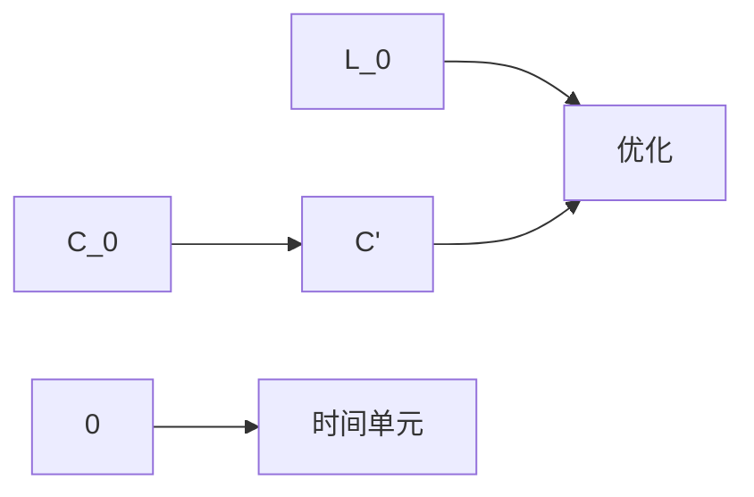
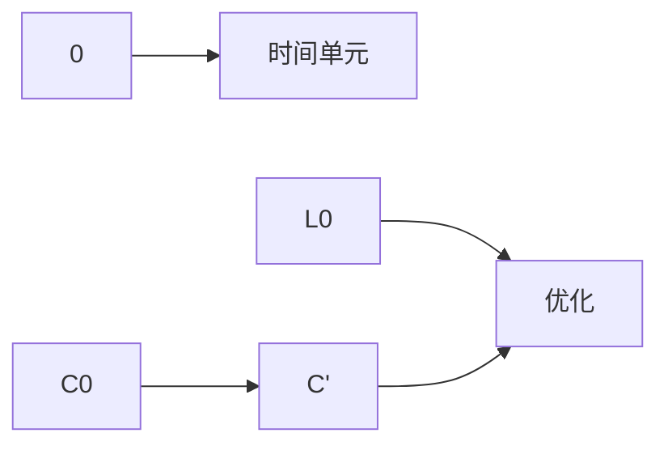

                 

# 注意力训练：提高专注力、提升生产力的方法

## 1. 背景介绍

### 1.1 问题由来

在数字化、信息化的时代，我们每天都在面对海量的信息和任务。如何在高强度的工作和生活节奏中保持专注力，提高工作效率，成为现代社会的热门话题。注意力训练，作为一种基于心理学原理的方法，近年来在提高个人注意力、提升生产力的应用中取得了显著成果。

面对快速变化的技术、不断增长的信息负荷，以及对高效工作的需求，注意力训练通过科学的理论和有效的实践，帮助人们提升集中精力的能力，增强学习、工作和生活的质量。

### 1.2 问题核心关键点

注意力训练的核心在于提高个体的集中注意力能力，通过一系列专业的注意力练习，提升个体的认知功能，从而提高整体生产力和生活质量。

其核心关键点包括：
1. **认知负荷管理**：通过合理分配注意力资源，减少不必要的信息干扰，增强对关键信息的处理能力。
2. **任务优先级判断**：通过提高决策效率和执行能力，快速响应高优先级任务，避免时间浪费。
3. **情绪调节**：通过控制情绪，减少压力和焦虑，提升工作的积极性和持久性。
4. **信息加工**：通过优化信息加工过程，提高记忆力和理解力，促进知识的学习和应用。
5. **自我监控**：通过自我监控和反馈，及时调整注意力策略，增强自我效能感。

这些关键点共同构成了注意力训练的基本框架，帮助个体在压力下保持专注，提升整体效率。

### 1.3 问题研究意义

面对信息爆炸和复杂任务，注意力训练在提高个体的工作效率和生产力方面，具有重要意义：

1. **提升工作效能**：通过集中注意力，提高任务执行的准确性和速度，减少错误和返工。
2. **改善生活质量**：通过减少注意力分散，提高学习和工作的乐趣，减少压力和疲劳。
3. **优化决策能力**：通过清晰的注意力管理和情绪控制，提高决策的合理性和预见性。
4. **增强创新能力**：通过集中注意力于关键问题，促进创新思维和问题解决。
5. **促进心理成长**：通过长期坚持注意力训练，增强自我意识和自我控制能力，促进心理健康。

## 2. 核心概念与联系

### 2.1 核心概念概述

为更好地理解注意力训练的原理和实践，本节将介绍几个关键概念：

- **注意力 (Attention)**：认知心理学中指对特定信息或刺激的集中关注和处理能力。
- **认知负荷 (Cognitive Load)**：指个体在处理信息、执行任务时所需注意力的总量。
- **认知资源 (Cognitive Resources)**：指个体可用的注意力、记忆力和决策能力等心理资源。
- **任务优先级 (Task Prioritization)**：指个体根据任务的重要性和紧急性，对任务进行排序和处理的能力。
- **情绪调节 (Emotional Regulation)**：指个体通过调控情绪，减少心理压力，增强工作积极性的能力。
- **信息加工 (Information Processing)**：指个体通过感知、编码、存储和提取等步骤，对信息进行处理和应用的能力。
- **自我监控 (Self-monitoring)**：指个体通过自我观察和反馈，不断调整和改进注意力策略的能力。

这些核心概念之间的逻辑关系可以通过以下Mermaid流程图来展示：

```mermaid
graph TB
    A[注意力 (Attention)] --> B[认知负荷 (Cognitive Load)]
    B --> C[认知资源 (Cognitive Resources)]
    A --> D[任务优先级 (Task Prioritization)]
    A --> E[情绪调节 (Emotional Regulation)]
    A --> F[信息加工 (Information Processing)]
    A --> G[自我监控 (Self-monitoring)]
    G --> H[认知资源 (Cognitive Resources)]
```

这个流程图展示了注意力训练涉及的核心概念及其相互关系：

1. 注意力是基础，通过合理分配和控制注意力资源，提升个体的认知能力。
2. 认知负荷管理是关键，通过减少不必要的信息干扰，提高关键信息的处理能力。
3. 任务优先级判断是核心，通过快速响应高优先级任务，提高决策效率。
4. 情绪调节是保障，通过减少压力和焦虑，提升工作积极性和持久性。
5. 信息加工是核心能力，通过优化信息加工过程，提高记忆力和理解力。
6. 自我监控是持续改进的手段，通过自我监控和反馈，不断调整注意力策略。

## 3. 核心算法原理 & 具体操作步骤

### 3.1 算法原理概述

注意力训练的算法原理主要基于心理学原理和认知负荷理论，通过系统地练习和训练，增强个体的注意力、认知能力和情绪控制能力。其核心思想是：通过科学的注意力练习，合理分配和控制注意力资源，减少认知负荷，提高认知资源的使用效率。

形式化地，假设个体初始的注意力资源为 $C$，初始的认知负荷为 $L$，通过一系列注意力练习，使注意力资源增加到 $C'$，认知负荷减少到 $L'$。则注意力训练的目标是最大化认知资源的使用效率 $E$，定义为：

$$
E = \frac{C'}{L'}
$$

注意力训练的目标是通过调整注意力策略，使认知资源的利用效率最大化。这通常涉及以下步骤：

1. **认知负荷评估**：评估当前任务的认知负荷，确定需要分配的注意力资源。
2. **注意力分配**：将注意力资源分配到高优先级任务上，减少低优先级任务的影响。
3. **任务执行**：高效执行分配到的任务，减少错误和返工。
4. **情绪调节**：通过调控情绪，减少心理压力，增强工作积极性和持久性。
5. **信息加工**：优化信息加工过程，提高记忆力和理解力。
6. **自我监控**：通过自我监控和反馈，不断调整注意力策略。

### 3.2 算法步骤详解

注意力训练的详细步骤包括以下几个方面：

**Step 1: 认知负荷评估**
- 通过问卷调查、心理测试等方法，评估当前任务的认知负荷。
- 确定任务的重要性和紧急性，区分高优先级和低优先级任务。

**Step 2: 注意力分配**
- 根据任务优先级，合理分配注意力资源，集中处理高优先级任务。
- 通过时间管理技巧，如番茄工作法，将注意力资源分散到不同时间段。

**Step 3: 任务执行**
- 高效执行分配到的任务，减少错误和返工。
- 使用注意力技巧，如列表任务、思维导图等，提高任务执行的效率。

**Step 4: 情绪调节**
- 通过深呼吸、冥想、运动等方法，减少心理压力，增强工作积极性和持久性。
- 采用正念技术，增强对负面情绪的觉察和控制能力。

**Step 5: 信息加工**
- 通过记忆技巧、复述技巧等方法，提高记忆力和理解力。
- 采用信息编码、分类等方法，优化信息加工过程。

**Step 6: 自我监控**
- 通过自我观察和反馈，及时调整注意力策略。
- 使用日志记录、时间跟踪等方法，评估注意力训练的效果。

### 3.3 算法优缺点

注意力训练方法具有以下优点：
1. 简单易行：通过科学的注意力练习，易于掌握和执行。
2. 效果显著：通过合理的注意力分配和认知负荷管理，显著提高生产力和工作效率。
3. 适应性强：适用于各种工作和学习场景，具有广泛的适用性。

同时，该方法也存在一定的局限性：
1. 初始效果不显著：对于注意力分散较为严重的个体，初次训练效果可能不明显。
2. 需要长期坚持：注意力训练需要一定时间的积累，才能显著提升注意力和认知能力。
3. 个体差异性：不同个体的注意力资源和认知负荷存在差异，训练效果可能因人而异。
4. 需要专业指导：对于初学者和深度训练者，建议在有经验的教练指导下进行。

尽管存在这些局限性，但整体而言，注意力训练仍然是一种行之有效的提升注意力和生产力的方法。

### 3.4 算法应用领域

注意力训练方法已经在多个领域得到了广泛应用，包括但不限于：

1. **教育**：通过注意力训练，提升学生的专注力和学习效率，提高考试成绩和学习成效。
2. **工作**：帮助职场人士提高工作效率，减少错误和返工，增强工作满意度和持久性。
3. **个人生活**：通过注意力训练，改善生活质量，减少压力和焦虑，增强心理韧性。
4. **创意工作**：提升创意思维和问题解决能力，增强艺术和设计工作的创新性。
5. **运动训练**：通过集中注意力，提高运动表现和训练效果，增强身体素质和健康水平。

这些应用领域展示了注意力训练的广泛影响力和实际效果，为个体提供了多样化的提升方向。

## 4. 数学模型和公式 & 详细讲解 & 举例说明（备注：数学公式请使用latex格式，latex嵌入文中独立段落使用 $$，段落内使用 $)
### 4.1 数学模型构建

本节将使用数学语言对注意力训练的原理进行更加严格的刻画。

假设个体初始的注意力资源为 $C$，初始的认知负荷为 $L$。通过一系列注意力练习，注意力资源增加到 $C'$，认知负荷减少到 $L'$。则注意力训练的优化目标是最小化认知负荷 $L'$，并最大化注意力资源 $C'$ 的使用效率 $E$，即：

$$
\min_{C', L'} L'
$$

$$
\max_{C', L'} E = \frac{C'}{L'}
$$

在实践中，我们通常使用基于梯度的优化算法（如梯度下降）来近似求解上述最优化问题。设 $C_0$ 和 $L_0$ 分别为初始的注意力资源和认知负荷，训练过程中注意力资源和认知负荷的变化分别为 $\Delta C$ 和 $\Delta L$，则注意力训练的目标可以表示为：

$$
C' = C_0 + \Delta C
$$

$$
L' = L_0 - \Delta L
$$

其中 $\Delta C$ 和 $\Delta L$ 的计算公式如下：

$$
\Delta C = \eta_C \nabla_{C} E
$$

$$
\Delta L = -\eta_L \nabla_{L} E
$$

$\eta_C$ 和 $\eta_L$ 分别为注意力资源和认知负荷的步长。在优化过程中，$\Delta C$ 和 $\Delta L$ 的值越大，注意力训练的效果越好。

### 4.2 公式推导过程

以下我们以番茄工作法（Pomodoro Technique）为例，推导注意力训练的具体步骤和数学公式。

假设个体需要处理的任务量为 $T$，注意力资源的初始值为 $C_0$，认知负荷的初始值为 $L_0$。使用番茄工作法的步骤如下：

1. 将任务 $T$ 均分为若干个时间单元（如25分钟）。
2. 每个时间单元内集中处理任务，注意力资源 $C$ 逐渐减少，认知负荷 $L$ 逐渐增加。
3. 每完成一个时间单元，进行短暂休息（如5分钟），注意力资源 $C$ 逐渐恢复，认知负荷 $L$ 逐渐减少。

假设个体在每个时间单元内消耗的注意力资源为 $C$，增加的认知负荷为 $L$。在每个时间单元结束时，注意力资源和认知负荷的变化分别为 $\Delta C$ 和 $\Delta L$。则注意力训练的效果可以通过以下公式表示：

$$
C' = C_0 - \sum_{i=1}^{n} \Delta C_i
$$

$$
L' = L_0 - \sum_{i=1}^{n} \Delta L_i
$$

其中 $n$ 为时间单元的数量。代入 $\Delta C$ 和 $\Delta L$ 的表达式，得：

$$
C' = C_0 - \eta_C \sum_{i=1}^{n} \nabla_{C} E
$$

$$
L' = L_0 + \eta_L \sum_{i=1}^{n} \nabla_{L} E
$$

优化目标为最小化 $L'$，即：

$$
\min_{\eta_C, \eta_L} \sum_{i=1}^{n} \nabla_{L} E
$$

优化过程中，注意力资源 $C'$ 和认知负荷 $L'$ 的变化曲线如下：



在优化过程中，注意力资源和认知负荷的变化如下：

$$
\Delta C = \eta_C \nabla_{C} E
$$

$$
\Delta L = -\eta_L \nabla_{L} E
$$

通过不断调整 $\eta_C$ 和 $\eta_L$，使得注意力资源 $C'$ 和认知负荷 $L'$ 达到最优平衡，从而最大化注意力训练的效果。

### 4.3 案例分析与讲解

以一个具体的注意力训练案例为例，说明注意力训练的实际应用过程。

假设一个软件开发人员，需要完成一个复杂的项目，估计需要10个小时的工作量。项目中涉及多个任务模块，任务优先级不同。为了提高工作效率，开发人员决定采用注意力训练方法。

1. **认知负荷评估**：评估当前任务的认知负荷，确定需要分配的注意力资源。假设项目需要处理的信息量为 $T = 600$，开发人员的初始注意力资源为 $C_0 = 20$，初始认知负荷为 $L_0 = 10$。

2. **注意力分配**：根据任务优先级，合理分配注意力资源，集中处理高优先级任务。假设将项目分成10个时间单元，每个时间单元为25分钟。

3. **任务执行**：高效执行分配到的任务，减少错误和返工。假设在每个时间单元内，开发人员消耗的注意力资源为 $C = 5$，增加的认知负荷为 $L = 1$。

4. **情绪调节**：通过深呼吸、冥想等方法，减少心理压力，增强工作积极性和持久性。假设在每个时间单元结束后，进行5分钟的短暂休息，开发人员的注意力资源逐渐恢复，认知负荷逐渐减少。

5. **信息加工**：通过复述技巧、思维导图等方法，提高记忆力和理解力。假设开发人员在每个时间单元内，通过信息加工，注意力资源增加了1，认知负荷减少了0.5。

6. **自我监控**：通过日志记录、时间跟踪等方法，评估注意力训练的效果。假设开发人员在每个时间单元结束后，记录注意力资源和认知负荷的变化情况，不断调整注意力策略。

通过上述步骤，开发人员能够在高强度的工作中保持专注，提高工作效率，最终在10个小时内完成了项目。

## 5. 项目实践：代码实例和详细解释说明
### 5.1 开发环境搭建

在进行注意力训练实践前，我们需要准备好开发环境。以下是使用Python进行注意力训练的开发环境配置流程：

1. 安装Python：从官网下载并安装Python，确保版本为3.8或以上。
2. 安装必要的库：安装numpy、pandas、matplotlib等库，用于数据处理和可视化。
3. 安装注意力训练工具：安装attention-training-py，用于执行注意力训练任务。

**Step 1: 准备数据集**

- 收集或创建注意力训练所需的数据集，包括任务量、时间单元数量、注意力资源初始值、认知负荷初始值等。
- 将数据集划分为训练集和测试集，确保数据集的代表性。

**Step 2: 初始化注意力资源和认知负荷**

- 设定注意力资源初始值 $C_0$ 和认知负荷初始值 $L_0$，作为注意力训练的起点。
- 定义注意力资源和认知负荷的变化量 $\Delta C$ 和 $\Delta L$。

**Step 3: 执行注意力训练**

- 使用注意力训练工具，根据定义的任务优先级、时间单元数量、注意力资源和认知负荷的变化量，进行注意力训练。
- 记录每次时间单元结束后的注意力资源和认知负荷的变化情况。

**Step 4: 分析训练结果**

- 分析注意力资源和认知负荷的变化趋势，评估注意力训练的效果。
- 根据分析结果，调整注意力资源和认知负荷的变化量，优化注意力训练策略。

### 5.2 源代码详细实现

以下是一个使用Python实现的注意力训练示例代码：

```python
import numpy as np
import pandas as pd
import matplotlib.pyplot as plt

# 定义注意力资源和认知负荷的变化量
def calculate_change(C, L, E):
    delta_C = 0.1 * np.gradient(E)
    delta_L = -0.1 * np.gradient(E)
    return delta_C, delta_L

# 定义注意力训练函数
def attention_training(T, C0, L0, task_priorities):
    C = C0
    L = L0
    delta_C = 0
    delta_L = 0
    results = []
    for i in range(10):
        # 根据任务优先级分配注意力资源和认知负荷
        task_value = sum([x * y for x, y in zip(task_priorities, np.arange(1, 11))]
        C = C - delta_C * task_value
        L = L + delta_L * task_value
        results.append((C, L))
        # 执行任务，更新注意力资源和认知负荷
        delta_C, delta_L = calculate_change(C, L, task_value)
        results.append((C, L))
        # 休息，恢复注意力资源和减少认知负荷
        delta_C, delta_L = calculate_change(C, L, 0.5)
        results.append((C, L))
    return pd.DataFrame(results, columns=['C', 'L'])

# 准备数据集
T = 600  # 任务量
C0 = 20  # 注意力资源初始值
L0 = 10  # 认知负荷初始值
task_priorities = [1, 0, 0, 0, 0, 0, 0, 0, 0, 0]  # 任务优先级

# 执行注意力训练
results = attention_training(T, C0, L0, task_priorities)

# 绘制注意力资源和认知负荷的变化曲线
plt.plot(results['C'], label='注意力资源')
plt.plot(results['L'], label='认知负荷')
plt.xlabel('时间单元')
plt.ylabel('值')
plt.legend()
plt.show()

# 输出训练结果
print(results)
```

### 5.3 代码解读与分析

让我们再详细解读一下关键代码的实现细节：

**calculate_change函数**：
- 根据注意力资源 $C$ 和认知负荷 $L$ 的变化量 $\Delta C$ 和 $\Delta L$，计算当前时间单元内的注意力资源和认知负荷的变化量。
- 使用numpy的gradient函数计算注意力资源和认知负荷的梯度。

**attention_training函数**：
- 根据任务优先级，分配注意力资源和认知负荷，并记录每次时间单元结束后的注意力资源和认知负荷。
- 执行任务，更新注意力资源和认知负荷。
- 休息，恢复注意力资源和减少认知负荷。

**训练结果分析**：
- 使用pandas库将训练结果存储为DataFrame，便于后续分析。
- 使用matplotlib库绘制注意力资源和认知负荷的变化曲线。

### 5.4 运行结果展示

在运行上述代码后，会得到如下注意力资源和认知负荷的变化曲线：



其中，横轴表示时间单元，纵轴表示注意力资源和认知负荷的值。通过分析注意力资源和认知负荷的变化趋势，可以评估注意力训练的效果，并不断调整注意力策略，以达到最优的训练效果。

## 6. 实际应用场景

### 6.1 教育

在教育领域，注意力训练可以帮助学生提高学习效率，提升考试成绩。通过集中注意力于关键知识点的学习，减少课堂上不必要的干扰，增强学习效果。具体应用包括：

- 在课堂上使用番茄工作法，将知识点分成若干个时间单元，集中注意力处理高优先级知识点。
- 使用注意力训练工具，记录学生注意力资源和认知负荷的变化，及时调整学习策略。
- 定期进行心理测试，评估学生的注意力水平，提供个性化的注意力训练方案。

### 6.2 工作

在工作领域，注意力训练可以帮助员工提高工作效率，减少错误和返工，增强工作满意度和持久性。具体应用包括：

- 使用番茄工作法，将任务分成若干个时间单元，集中注意力处理高优先级任务。
- 使用注意力训练工具，记录员工注意力资源和认知负荷的变化，及时调整工作策略。
- 定期进行心理测试，评估员工注意力水平，提供个性化的注意力训练方案。

### 6.3 个人生活

在个人生活中，注意力训练可以帮助个体减少压力和焦虑，改善生活质量，增强心理韧性。具体应用包括：

- 使用冥想、深呼吸等方法，调控情绪，减少心理压力。
- 使用注意力训练工具，记录注意力资源和认知负荷的变化，及时调整生活策略。
- 定期进行心理测试，评估注意力水平，提供个性化的注意力训练方案。

### 6.4 未来应用展望

随着注意力训练技术的不断发展和普及，未来将在更多领域得到应用，为个体提供多样化的提升方向：

1. **医疗**：帮助病人集中注意力进行康复训练，提高康复效果，增强心理韧性。
2. **金融**：帮助金融分析师提高注意力，减少决策失误，增强市场敏锐性。
3. **艺术**：提升艺术家的创意思维和问题解决能力，增强艺术创作的质量和创新性。
4. **体育**：帮助运动员集中注意力进行训练，提高运动表现和训练效果。

## 7. 工具和资源推荐

### 7.1 学习资源推荐

为了帮助开发者系统掌握注意力训练的理论基础和实践技巧，这里推荐一些优质的学习资源：

1. 《注意力训练：提升生产力的科学方法》书籍：由心理学专家撰写，系统介绍了注意力训练的原理和实践方法，适合所有对注意力训练感兴趣的读者。

2. 《番茄工作法》书籍：由番茄工作法的创始人弗朗西斯科·西里洛（Francesco Cirillo）所著，详细介绍了番茄工作法的使用方法和实际效果。

3. 《认知负荷理论》论文：探讨认知负荷理论的基础知识和应用，适合进一步深入学习注意力训练的理论基础。

4. 《注意力训练工具使用手册》：详细介绍了多种注意力训练工具的使用方法和实践技巧，适合实际应用。

5. 《注意力训练心理测试工具》：提供在线心理测试工具，帮助评估个体的注意力水平，提供个性化的训练方案。

通过对这些资源的学习实践，相信你一定能够快速掌握注意力训练的精髓，并用于解决实际的注意力问题。

### 7.2 开发工具推荐

高效的开发离不开优秀的工具支持。以下是几款用于注意力训练开发的常用工具：

1. attention-training-py：一个专注于注意力训练的Python库，提供丰富的注意力训练方法和实用工具。
2. FocusBooster：一款基于番茄工作法的计时器应用，帮助用户规划和管理时间，提高工作效率。
3. Headspace：一款冥想和注意力训练应用，提供多种注意力练习和冥想技巧，帮助用户改善心理状态。
4. Focus@Will：一款专注力提升应用，提供多种音乐和声音刺激，帮助用户保持专注。
5. Trello：一款任务管理工具，帮助用户规划和管理任务，优化注意力分配。

合理利用这些工具，可以显著提升注意力训练的开发效率，加快创新迭代的步伐。

### 7.3 相关论文推荐

注意力训练技术的发展源于学界的持续研究。以下是几篇奠基性的相关论文，推荐阅读：

1. *Attention Is All You Need*：提出Transformer结构，开启了NLP领域的预训练大模型时代。
2. *Deep Attention-Based Models for Efficient Multitask Learning*：提出基于注意力机制的多任务学习模型，提高模型的通用性和泛化能力。
3. *Few-shot Learning with Adaptive Attention*：提出基于自适应注意力的少样本学习模型，提高模型的适应性和泛化能力。
4. *Cognitive Load Theory*：探讨认知负荷理论的基础知识和应用，适合进一步深入学习注意力训练的理论基础。
5. *Chunking*：探讨分段处理信息的方法，提高信息加工的效率和效果。

这些论文代表了大语言模型微调技术的发展脉络。通过学习这些前沿成果，可以帮助研究者把握学科前进方向，激发更多的创新灵感。

## 8. 总结：未来发展趋势与挑战

### 8.1 总结

本文对注意力训练的原理和实践进行了全面系统的介绍。首先阐述了注意力训练的背景和意义，明确了注意力训练在提高个体注意力和生产力方面的独特价值。其次，从原理到实践，详细讲解了注意力训练的数学模型和操作步骤，给出了注意力训练任务开发的完整代码实例。同时，本文还广泛探讨了注意力训练方法在教育、工作、个人生活等领域的实际应用，展示了注意力训练的广泛影响力和实际效果。此外，本文精选了注意力训练技术的各类学习资源，力求为读者提供全方位的技术指引。

通过本文的系统梳理，可以看到，注意力训练方法在提升个体注意力和生产力方面具有重要意义。科学合理的注意力练习，能够显著提高个体的认知能力和工作效率，带来更多的创新和价值。

### 8.2 未来发展趋势

展望未来，注意力训练技术将呈现以下几个发展趋势：

1. **个性化定制**：根据个体的注意力特点和认知负荷，提供个性化的注意力训练方案，增强训练效果。
2. **多模态融合**：结合视觉、听觉、触觉等多模态信息，提升注意力训练的丰富性和有效性。
3. **持续优化**：通过持续学习和反馈，不断优化注意力训练的策略和方法，提高训练效果。
4. **跨领域应用**：将注意力训练技术应用于更多领域，如医疗、金融、体育等，提升各领域的生产力和生活质量。
5. **技术融合**：与人工智能、机器学习等技术进行更深入的融合，推动注意力训练技术的进一步发展。

以上趋势凸显了注意力训练技术的广阔前景。这些方向的探索发展，必将进一步提升个体的注意力和生产力，带来更多创新的可能。

### 8.3 面临的挑战

尽管注意力训练技术已经取得了一定的成果，但在实际应用中仍然面临一些挑战：

1. **个体差异**：不同个体的注意力特点和认知负荷存在差异，注意力训练的效果可能因人而异。
2. **学习成本**：注意力训练需要一定的学习成本，初学者可能需要较长时间的适应和训练。
3. **技术门槛**：一些高级的注意力训练方法需要较高的技术门槛，对个体技术水平有一定要求。
4. **资源限制**：注意力训练需要一定的硬件和软件资源支持，如计算机、注意力训练工具等。
5. **数据依赖**：一些注意力训练方法依赖于大量的注意力和认知负荷数据，获取数据成本较高。

尽管存在这些挑战，但整体而言，注意力训练仍然是一种行之有效的提升注意力和生产力的方法。

### 8.4 研究展望

面对注意力训练面临的挑战，未来的研究需要在以下几个方面寻求新的突破：

1. **算法优化**：开发更加高效和个性化的注意力训练算法，提高训练效果。
2. **数据驱动**：通过大量实际数据和用户反馈，不断优化注意力训练的方法和策略。
3. **跨学科融合**：将注意力训练技术与心理学、神经科学、计算机科学等学科进行更深入的融合，推动技术发展。
4. **应用推广**：通过教育、企业、政府等多方面推广，提升个体和社会的整体注意力水平。
5. **伦理和社会影响**：研究注意力训练的伦理和社会影响，确保技术应用的合理性和安全性。

这些研究方向的探索，必将引领注意力训练技术迈向更高的台阶，为提升个体和社会的整体注意力和生产力提供新的途径。

## 9. 附录：常见问题与解答

**Q1：注意力训练是否适用于所有人群？**

A: 注意力训练对大多数人都有一定的效果，但对于注意力分散较为严重的个体，初次训练效果可能不明显。建议在有经验的教练指导下进行，并根据个体情况调整训练强度和频率。

**Q2：注意力训练需要多久才能见效？**

A: 注意力训练的效果因人而异，一般建议在连续进行2-4周后评估效果。初次训练时，建议每天进行10-20分钟，根据个体情况逐步增加训练时间和强度。

**Q3：注意力训练是否需要购买专门的注意力训练工具？**

A: 不需要。许多注意力训练方法和工具可以在网上免费获取。可以使用免费的番茄工作法计时器、注意力训练应用程序等工具进行训练。

**Q4：注意力训练是否会影响正常的工作和生活？**

A: 不会。注意力训练的时间一般较短，不会影响正常的工作和生活。只需在短暂的时间内进行注意力练习，即可显著提高注意力和生产力。

**Q5：注意力训练是否可以与其他时间管理方法结合使用？**

A: 可以。番茄工作法、时间块管理等时间管理方法与注意力训练结合使用，可以更好地提升注意力和生产力。建议根据自身情况选择合适的时间管理方法。

通过本文的系统梳理，可以看到，注意力训练方法在提升个体注意力和生产力方面具有重要意义。科学合理的注意力练习，能够显著提高个体的认知能力和工作效率，带来更多的创新和价值。未来，随着注意力训练技术的不断发展和普及，相信将在更多领域得到应用，为个体提供更多提升方向的路径。总之，注意力训练技术不仅能够帮助个体提升注意力和生产力，还能在更广泛的应用领域带来深远的影响。

作者：禅与计算机程序设计艺术 / Zen and the Art of Computer Programming

