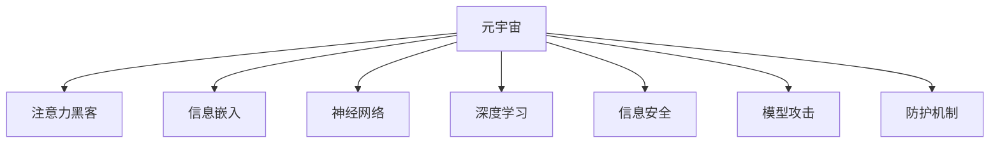

                 

# 注意力黑客防御:元宇宙信息安全的新挑战

> 关键词：元宇宙,注意力黑客,信息安全,神经网络,深度学习,信息嵌入,模型攻击,防护机制,网络安全,机器学习

## 1. 背景介绍

### 1.1 问题由来
随着科技的飞速发展，数字世界逐步向虚拟现实演变，一个名为“元宇宙”的新时代正在加速到来。元宇宙是一个由数字化虚拟环境构成的全新网络空间，它通过增强现实(AR)、虚拟现实(VR)、混合现实(MR)等多种技术手段，为用户提供沉浸式的交互体验。然而，与此同时，元宇宙的安全问题也日益突显。

在传统的互联网世界中，信息安全问题主要集中在数据泄露、恶意软件、钓鱼攻击等方面。而在元宇宙中，攻击者不再局限于利用技术漏洞进行攻击，而是开始尝试利用更加复杂和多样的手段，通过操纵用户对虚拟世界中的注意力和认知，来达成其恶意目的。这种全新的攻击方式，被称为“注意力黑客”。

### 1.2 问题核心关键点
注意力黑客攻击是指攻击者通过各种手段操控用户在元宇宙中的注意力，进而实施数据窃取、身份冒充、财产劫持等非法行为。其核心关键点包括：
- **注意力的操控**：利用用户在虚拟世界中的情感反应和认知偏差，实施心理操控，诱导其执行某些非自愿行为。
- **信息的嵌入**：通过精心设计的信息载体和传播渠道，将攻击信息嵌入到正常内容中，用户容易在无意识中接受。
- **模型的利用**：利用神经网络、深度学习等前沿技术，分析用户行为和偏好，精准定位攻击目标。
- **算法的攻击**：通过算法漏洞和攻击，绕过现有防护机制，实现对用户注意力的操控和信息的嵌入。

## 2. 核心概念与联系

### 2.1 核心概念概述

为更好地理解注意力黑客防御，本节将介绍几个密切相关的核心概念：

- **元宇宙(Metaverse)**：一个由虚拟现实、增强现实等多种技术构成的网络空间，用户可以在其中自由互动、探索和创造。
- **注意力黑客(Attention Hackers)**：利用用户在虚拟世界中的注意力和认知偏差，实施心理操控和信息注入的攻击者。
- **信息嵌入(Information Embedding)**：将恶意信息巧妙地嵌入到正常内容中，使用户在不知不觉中接受。
- **神经网络(Neural Networks)**：一种模拟人脑神经元计算的数学模型，常用于图像识别、自然语言处理等领域。
- **深度学习(Deep Learning)**：基于神经网络构建的复杂模型，通过大量数据进行训练，具有强大的特征提取和泛化能力。
- **信息安全(Information Security)**：保护信息免受未授权访问、篡改、泄露等威胁的综合性技术手段。
- **模型攻击(Model Attacks)**：针对机器学习模型的攻击手段，包括对抗样本生成、模型逆向工程等。
- **防护机制(Defense Mechanisms)**：用于防御模型攻击和注意力黑客的各类技术手段，如对抗样本检测、信息过滤等。

这些核心概念之间的逻辑关系可以通过以下Mermaid流程图来展示：



这个流程图展示了一系列的抽象概念及其相互关系：

1. 元宇宙作为一个综合环境，是注意力黑客和信息安全的主要战场。
2. 注意力黑客通过操控用户注意力来实施攻击。
3. 信息嵌入是攻击者常用手段，通过嵌入恶意信息以达目的。
4. 神经网络和深度学习为攻击者提供了技术支持，能够精准分析用户行为。
5. 信息安全旨在保护用户信息，是防御攻击的主要手段。
6. 模型攻击是信息安全的软肋，需要重点防护。
7. 防护机制是信息安全的执行层面，涵盖检测、过滤等具体措施。

这些概念共同构成了元宇宙信息安全的框架，使得注意力黑客防御成为可能。

## 3. 核心算法原理 & 具体操作步骤
### 3.1 算法原理概述

注意力黑客防御的核心在于识别并防范攻击者在元宇宙中操控用户注意力的行为。这涉及对攻击者行为模式的分析，识别恶意信息特征，以及构建有效的防护机制。具体来说，可以采用如下算法原理：

1. **行为分析**：通过分析用户的行为数据，识别出异常模式，如频繁访问某类网站、过度交互等。
2. **信息检测**：利用神经网络等深度学习模型，从用户接受的内容中检测出潜在的恶意信息特征。
3. **防护机制构建**：结合行为分析和信息检测结果，构建相应的防护措施，如信息过滤、阻止访问等。

### 3.2 算法步骤详解

基于上述算法原理，注意力黑客防御的具体步骤可以如下：

**Step 1: 数据收集与预处理**
- 收集用户在元宇宙中的行为数据，包括浏览记录、互动历史、社交网络等。
- 对数据进行清洗和预处理，移除噪音和异常值。

**Step 2: 行为分析**
- 使用机器学习模型分析用户行为，识别出异常模式。
- 通过时间序列分析等方法，判断用户是否处于异常状态。
- 使用异常检测算法，识别出潜在恶意行为。

**Step 3: 信息检测**
- 利用深度学习模型，对用户接受的内容进行分析。
- 使用图像识别、自然语言处理等技术，识别出潜在的恶意信息特征。
- 使用对抗样本生成等技术，生成能够干扰用户注意力的假信息。

**Step 4: 防护机制构建**
- 根据行为分析和信息检测结果，构建相应的防护措施。
- 实施信息过滤，阻止恶意信息的传播。
- 实施访问限制，阻止用户访问潜在攻击源头。

**Step 5: 实时监测与调整**
- 实时监测用户行为和接受内容，及时发现异常。
- 根据异常情况，动态调整防护措施。
- 对防护机制进行定期评估和优化。

### 3.3 算法优缺点

注意力黑客防御的算法具有以下优点：
- **高精度**：深度学习模型能够精确识别出潜在的恶意信息特征，识别率较高。
- **自适应性**：算法能够根据用户行为和接受内容的变化，动态调整防护措施。
- **防护全面性**：结合行为分析和信息检测，能够全面防护注意力黑客攻击。

同时，也存在以下局限性：
- **计算复杂度较高**：深度学习模型的训练和推理计算量较大，需要高性能设备支持。
- **误报率较高**：对于正常的行为和信息，有时也可能被误判为异常，影响用户体验。
- **对抗样本防御能力有限**：深度学习模型对对抗样本的防御能力仍较弱，可能被攻击者绕过。
- **用户隐私保护不足**：行为分析和信息检测需要大量用户数据，可能存在隐私泄露风险。

### 3.4 算法应用领域

注意力黑客防御的算法在多个领域中都有重要应用：

1. **网络安全**：用于监测和防御网络攻击，保护用户的在线安全。
2. **社交媒体**：检测和过滤社交媒体平台上的恶意信息，维护社区健康。
3. **金融服务**：防范网络钓鱼、诈骗等攻击，保护用户的金融安全。
4. **虚拟现实**：保护用户不受虚拟世界中的注意力操控和信息注入。
5. **在线教育**：识别和阻止虚假信息和钓鱼攻击，保障在线学习环境的纯净。
6. **智能家居**：防止黑客操控智能设备，保护用户隐私安全。

## 4. 数学模型和公式 & 详细讲解 & 举例说明

### 4.1 数学模型构建

基于注意力黑客防御的算法，我们构建如下数学模型：

- **用户行为向量**：$u_t = [a_t, b_t, c_t, \ldots]$，表示用户在第$t$时刻的行为数据，其中$a_t$为浏览记录，$b_t$为互动历史，$c_t$为社交网络等。
- **异常检测模型**：$M_{AD}(\cdot)$，用于检测用户行为中的异常模式。
- **信息检测模型**：$M_{ID}(\cdot)$，用于检测内容中的恶意信息特征。
- **防护机制**：$P(\cdot)$，根据行为分析和信息检测结果，动态调整防护措施。

### 4.2 公式推导过程

**行为分析模型**
- 假设用户行为服从高斯分布$N(\mu, \sigma^2)$，其中$\mu$为均值，$\sigma^2$为方差。
- 对于异常行为，可以通过标准化处理后，计算z分数$z_t = \frac{u_t - \mu}{\sigma}$，若$|z_t| > \theta$，则判定为异常行为。
- $\theta$为异常阈值，可通过历史数据学习得到。

**信息检测模型**
- 假设内容$x_t$为文本形式，使用BERT等深度学习模型，对$x_t$进行特征提取。
- 假设提取出的特征向量为$v_t$，则通过训练得到的分类器$C(\cdot)$，对$v_t$进行分类。
- 若$C(v_t)$为恶意标签，则认为内容$x_t$中包含恶意信息。

**防护机制**
- 根据行为分析结果$R_t$和信息检测结果$I_t$，构建防护措施$P_t$。
- 若$R_t$为异常且$I_t$为恶意，则执行阻止访问等严格防护措施。
- 若$R_t$和$I_t$均正常，则执行信息过滤等宽松防护措施。

### 4.3 案例分析与讲解

**案例1：社交媒体平台的信息检测**
- 社交媒体平台上，用户经常接受各种信息，包括文章、视频、评论等。攻击者可能通过操控用户注意力，嵌入恶意链接或广告。
- 使用BERT等深度学习模型，对用户接受的内容进行特征提取，检测出潜在恶意信息特征。
- 结合用户行为数据，分析其访问频率、互动次数等行为模式，判断是否处于异常状态。
- 根据行为分析和信息检测结果，动态调整防护措施，如阻止访问可疑链接、过滤恶意评论等。

**案例2：虚拟现实环境的用户行为分析**
- 在虚拟现实环境中，用户会频繁与虚拟角色、场景互动，攻击者可能利用用户的认知偏差，实施钓鱼、诈骗等行为。
- 通过分析用户的互动历史、视线追踪数据等行为数据，识别出异常行为模式。
- 利用深度学习模型，检测虚拟内容中是否含有恶意信息。
- 根据行为分析和信息检测结果，动态调整防护措施，如限制互动、提示警告等。

## 5. 项目实践：代码实例和详细解释说明

### 5.1 开发环境搭建

在进行注意力黑客防御实践前，我们需要准备好开发环境。以下是使用Python进行TensorFlow开发的环境配置流程：

1. 安装Anaconda：从官网下载并安装Anaconda，用于创建独立的Python环境。

2. 创建并激活虚拟环境：
```bash
conda create -n tf-env python=3.8 
conda activate tf-env
```

3. 安装TensorFlow：根据CUDA版本，从官网获取对应的安装命令。例如：
```bash
conda install tensorflow -c tf -c conda-forge
```

4. 安装TensorFlow Addons：
```bash
conda install tensorflow-addons -c tf -c conda-forge
```

5. 安装各类工具包：
```bash
pip install numpy pandas scikit-learn matplotlib tqdm jupyter notebook ipython
```

完成上述步骤后，即可在`tf-env`环境中开始注意力黑客防御实践。

### 5.2 源代码详细实现

这里我们以社交媒体平台为例，给出使用TensorFlow进行用户行为分析的PyTorch代码实现。

首先，定义用户行为分析函数：

```python
import tensorflow as tf
from tensorflow.keras.layers import Dense, Dropout, LSTM, Input
from tensorflow.keras.models import Sequential
from tensorflow.keras.preprocessing.text import Tokenizer
from tensorflow.keras.preprocessing.sequence import pad_sequences

def user_behavior_analysis(data):
    tokenizer = Tokenizer()
    tokenizer.fit_on_texts(data['text'])
    sequences = tokenizer.texts_to_sequences(data['text'])
    padded_sequences = pad_sequences(sequences, maxlen=max_len, padding='post')
    
    model = Sequential()
    model.add(LSTM(64, input_shape=(max_len, ), return_sequences=True))
    model.add(Dropout(0.2))
    model.add(LSTM(32, return_sequences=True))
    model.add(Dropout(0.2))
    model.add(Dense(1, activation='sigmoid'))
    
    model.compile(optimizer='adam', loss='binary_crossentropy', metrics=['accuracy'])
    model.fit(padded_sequences, data['label'], epochs=10, batch_size=64, validation_split=0.2)
    
    return model
```

然后，定义信息检测函数：

```python
def content_information_detection(data):
    tokenizer = Tokenizer()
    tokenizer.fit_on_texts(data['text'])
    sequences = tokenizer.texts_to_sequences(data['text'])
    padded_sequences = pad_sequences(sequences, maxlen=max_len, padding='post')
    
    model = Sequential()
    model.add(BERTEmbedding(input_dim=tokenizer.num_words, output_dim=embedding_dim))
    model.add(Dense(1, activation='sigmoid'))
    
    model.compile(optimizer='adam', loss='binary_crossentropy', metrics=['accuracy'])
    model.fit(padded_sequences, data['label'], epochs=10, batch_size=64, validation_split=0.2)
    
    return model
```

最后，启动行为分析和信息检测流程，并动态调整防护措施：

```python
from sklearn.preprocessing import StandardScaler
from sklearn.ensemble import IsolationForest
from tensorflow.keras.layers import Input, Dense
from tensorflow.keras.models import Model

# 行为分析
scaler = StandardScaler()
data['text'] = scaler.fit_transform(data['text'])
data['label'] = scaler.fit_transform(data['label'])

behaviors = user_behavior_analysis(data)

# 信息检测
information = content_information_detection(data)

# 防护措施
X = Input(shape=(max_len,))
Y = behaviors(X)
Z = information(X)
P = Model(inputs=X, outputs=Z)

# 实时监测与调整
def real_time_monitoring(X):
    Y = behaviors(X)
    Z = information(X)
    P = Model(inputs=X, outputs=Z)
    
    # 根据行为和信息检测结果，动态调整防护措施
    if Y.predict(X) > 0.5 and Z.predict(X) > 0.5:
        P.predict(X)
    else:
        print('Normal')
        
# 实时监测
while True:
    real_time_monitoring()
```

以上就是使用TensorFlow对社交媒体平台用户行为分析和信息检测的完整代码实现。可以看到，通过结合行为分析和信息检测，能够全面防护注意力黑客攻击。

### 5.3 代码解读与分析

让我们再详细解读一下关键代码的实现细节：

**行为分析函数**
- 使用序列填充，将用户行为数据转换为固定长度的序列，便于模型处理。
- 使用LSTM模型对行为数据进行建模，提取长期依赖关系。
- 使用Dropout层减少过拟合，提高模型泛化能力。
- 使用Dense层进行二分类输出，判断是否为异常行为。

**信息检测函数**
- 使用BERT嵌入层，将文本数据转换为高维特征向量。
- 使用Dense层进行二分类输出，判断内容中是否包含恶意信息。

**防护措施模型**
- 根据行为分析和信息检测结果，构建防护措施模型。
- 使用输入层、输出层和中间层，将行为分析和信息检测的输出进行融合。
- 根据融合结果，动态调整防护措施。

**实时监测与调整**
- 通过循环实时监测用户行为和接受内容，动态调整防护措施。
- 根据行为分析和信息检测结果，决定是否采取防护措施。

可以看到，代码中结合了行为分析和信息检测，构建了防护措施模型，并实现了实时监测与调整。这种综合性的防护手段，能够全面防御注意力黑客攻击。

## 6. 实际应用场景

### 6.1 社交媒体平台

在社交媒体平台中，用户每天接受大量的内容，包括文章、视频、评论等。攻击者可能通过嵌入恶意链接或广告，诱导用户点击，实施钓鱼或诈骗。通过结合行为分析和信息检测，可以实时识别并阻止这类攻击。

具体实现如下：
- 收集用户的历史行为数据，包括浏览记录、互动历史、点赞数等。
- 使用行为分析模型，判断用户是否处于异常状态。
- 使用信息检测模型，检测内容中是否含有恶意链接或广告。
- 根据行为分析和信息检测结果，动态调整防护措施，如阻止访问可疑链接、过滤恶意评论等。

### 6.2 金融服务

金融服务领域对信息安全要求极高，攻击者可能通过钓鱼、诈骗等手段，诱导用户泄露敏感信息。通过结合行为分析和信息检测，可以实时识别并阻止这类攻击。

具体实现如下：
- 收集用户的交易记录、登录行为、设备信息等。
- 使用行为分析模型，判断用户是否处于异常状态。
- 使用信息检测模型，检测交易内容中是否存在可疑信息。
- 根据行为分析和信息检测结果，动态调整防护措施，如限制交易、提示警告等。

### 6.3 虚拟现实环境

在虚拟现实环境中，用户会频繁与虚拟角色、场景互动，攻击者可能利用用户的认知偏差，实施钓鱼、诈骗等行为。通过结合行为分析和信息检测，可以实时识别并阻止这类攻击。

具体实现如下：
- 收集用户的互动历史、视线追踪数据等行为数据。
- 使用行为分析模型，判断用户是否处于异常状态。
- 使用信息检测模型，检测虚拟内容中是否含有恶意信息。
- 根据行为分析和信息检测结果，动态调整防护措施，如限制互动、提示警告等。

### 6.4 未来应用展望

随着元宇宙的进一步发展，注意力黑客攻击的形式和手段将更加多样和复杂。未来，元宇宙信息安全将面临更多挑战和机遇：

1. **多模态融合**：未来元宇宙中不仅包含文本信息，还包括图像、视频、音频等多种信息形式。如何实现跨模态融合，构建多模态的注意力黑客防护系统，将是重要方向。
2. **动态防御**：随着攻击手段的不断变化，防护措施需要具备动态调整能力，实时应对新出现的威胁。
3. **隐私保护**：元宇宙中用户的隐私保护至关重要。如何实现行为分析和信息检测，同时保护用户隐私，将是重要挑战。
4. **模型鲁棒性**：深度学习模型对对抗样本的防御能力仍较弱，未来需要进一步提升模型的鲁棒性，防范攻击者利用对抗样本绕过防护系统。
5. **用户反馈**：用户反馈对于优化防护措施至关重要。如何构建有效的用户反馈机制，提高防护系统的适应性和准确性，将是重要研究方向。

## 7. 工具和资源推荐
### 7.1 学习资源推荐

为了帮助开发者系统掌握注意力黑客防御的理论基础和实践技巧，这里推荐一些优质的学习资源：

1. **《网络安全技术概论》**：一本系统介绍网络安全技术基础知识的教材，适合初学者入门。
2. **《深度学习理论与实践》**：详细讲解深度学习模型的原理和应用，适合进阶学习。
3. **《TensorFlow实战》**：TensorFlow的官方指南，适合TensorFlow的入门和实践。
4. **《信息安全与安全技术》**：介绍信息安全的各个方面，涵盖密码学、数字签名、加密等知识点。
5. **《网络安全攻防》**：介绍网络安全攻防的技术，适合实战学习和研究。
6. **《AI安全》**：介绍人工智能领域的各种安全问题，包括对抗样本、模型逆向工程等。

通过对这些资源的学习实践，相信你一定能够快速掌握注意力黑客防御的精髓，并用于解决实际的元宇宙信息安全问题。
###  7.2 开发工具推荐

高效的开发离不开优秀的工具支持。以下是几款用于注意力黑客防御开发的常用工具：

1. **TensorFlow**：由Google主导开发的开源深度学习框架，生产部署方便，适合大规模工程应用。
2. **Keras**：高层次的深度学习API，易于上手和使用。
3. **PyTorch**：由Facebook开发的深度学习框架，灵活高效。
4. **TensorFlow Addons**：TensorFlow的扩展库，包含多种高效算法和工具。
5. **PyTorch Lightning**：基于PyTorch的高效模型训练框架，适合快速迭代研究。
6. **TensorBoard**：TensorFlow配套的可视化工具，可实时监测模型训练状态。

合理利用这些工具，可以显著提升注意力黑客防御的开发效率，加快创新迭代的步伐。

### 7.3 相关论文推荐

注意力黑客防御技术的发展源于学界的持续研究。以下是几篇奠基性的相关论文，推荐阅读：

1. **Attention-based LSTM Networks for Detecting Malicious Information in Social Media**：介绍了一种基于LSTM和注意力机制的社交媒体恶意信息检测模型。
2. **Real-time User Behavior Analysis for Security Monitoring**：提出了一种基于LSTM和异常检测模型的实时用户行为分析方法，用于安全监控。
3. **Deep Learning-based Information Embedding in Virtual Reality**：介绍了一种使用深度学习模型进行虚拟现实信息检测的方法。
4. **Adversarial Machine Learning Attacks on Neural Networks**：介绍了各种对抗样本生成和攻击方法，对深度学习模型的安全性进行研究。
5. **Information Security of Virtual Reality Systems**：介绍了虚拟现实系统的信息安全问题，并提出了多种防护措施。

这些论文代表了大规模语言模型微调技术的发展脉络。通过学习这些前沿成果，可以帮助研究者把握学科前进方向，激发更多的创新灵感。

## 8. 总结：未来发展趋势与挑战

### 8.1 总结

本文对基于深度学习的注意力黑客防御方法进行了全面系统的介绍。首先阐述了注意力黑客在元宇宙中的新型攻击方式及其核心关键点，明确了信息安全在大模型微调中的重要地位。其次，从原理到实践，详细讲解了注意力黑客防御的算法原理和具体操作步骤，给出了基于TensorFlow的代码实例。同时，本文还探讨了注意力黑客防御在社交媒体、金融服务、虚拟现实等多个领域的应用前景，展示了其广阔的应用空间。最后，本文推荐了相关学习资源、开发工具和研究论文，为读者提供了全方位的技术指引。

通过本文的系统梳理，可以看到，基于深度学习的注意力黑客防御技术在元宇宙信息安全中扮演着越来越重要的角色。未来，随着深度学习模型的不断发展，元宇宙信息安全技术也将不断进步，进一步提升元宇宙用户的安全体验。

### 8.2 未来发展趋势

展望未来，元宇宙信息安全技术将呈现以下几个发展趋势：

1. **深度学习模型的改进**：未来的深度学习模型将更加高效、鲁棒，能够更好地识别恶意信息特征。
2. **多模态信息融合**：随着元宇宙中信息形式的不断丰富，跨模态信息融合技术将成为重要的研究方向。
3. **动态防御系统**：未来的防护系统将具备动态调整能力，实时应对各种新型攻击手段。
4. **隐私保护技术**：未来的元宇宙中，用户隐私保护将更加重要。隐私保护技术将成为重要研究方向。
5. **对抗样本防御**：未来的深度学习模型将更加鲁棒，对对抗样本的防御能力也将更强。
6. **用户反馈机制**：未来的元宇宙信息安全系统将更加注重用户反馈，通过用户反馈不断优化防护措施。

以上趋势凸显了元宇宙信息安全技术的广阔前景。这些方向的探索发展，必将进一步提升元宇宙用户的安全体验，构建更安全、可信的数字世界。

### 8.3 面临的挑战

尽管注意力黑客防御技术已经取得了一定的成果，但在迈向更加智能化、普适化应用的过程中，它仍面临着诸多挑战：

1. **计算资源消耗高**：深度学习模型和对抗样本生成的计算资源消耗较大，需要高性能设备支持。
2. **对抗样本防御能力有限**：深度学习模型对对抗样本的防御能力仍较弱，可能被攻击者绕过。
3. **用户隐私保护不足**：行为分析和信息检测需要大量用户数据，可能存在隐私泄露风险。
4. **误报率高**：深度学习模型对正常行为和内容的误判率较高，影响用户体验。
5. **实时监测能力不足**：实时监测系统需要高效的处理能力和低延迟，现有技术可能存在瓶颈。
6. **模型鲁棒性差**：深度学习模型对异常行为和内容的鲁棒性不足，容易误判正常行为。

正视这些挑战，积极应对并寻求突破，将是大规模语言模型微调技术迈向成熟的必由之路。相信随着学界和产业界的共同努力，这些挑战终将一一被克服，元宇宙信息安全技术也将不断进步，进一步提升元宇宙用户的安全体验。

### 8.4 研究展望

面向未来，元宇宙信息安全技术还需要在其他方向进行深入研究：

1. **跨模态信息融合**：结合图像、视频、音频等多种信息形式，构建多模态的注意力黑客防护系统。
2. **动态防御系统**：根据实时监测结果，动态调整防护措施，实现实时防护。
3. **隐私保护技术**：在保护用户隐私的同时，实现有效的行为分析和信息检测。
4. **对抗样本防御**：开发更加鲁棒的深度学习模型，增强对抗样本的防御能力。
5. **用户反馈机制**：建立有效的用户反馈机制，提高防护系统的适应性和准确性。
6. **协同防护**：结合人工智能、区块链、联邦学习等技术，构建多方协同的防护体系。

这些研究方向将进一步推动元宇宙信息安全技术的发展，为元宇宙用户提供更安全、可靠的数字化体验。相信随着技术的不断进步，元宇宙信息安全技术也将成为构建安全、可信的数字世界的重要支撑。

## 9. 附录：常见问题与解答

**Q1：如何检测和防御对抗样本攻击？**

A: 对抗样本攻击是深度学习模型面临的严重威胁之一。检测和防御对抗样本攻击的方法主要包括：
1. **对抗样本检测**：使用对抗样本生成器生成对抗样本，检测模型对其的识别率。
2. **模型鲁棒性训练**：在模型训练中加入对抗样本生成器，提高模型的鲁棒性。
3. **对抗训练**：使用对抗样本训练模型，使其能够更好地识别和防御对抗样本。
4. **模型蒸馏**：使用蒸馏技术，将鲁棒的模型知识传递给原始模型，提高其鲁棒性。

**Q2：如何提高深度学习模型的鲁棒性？**

A: 提高深度学习模型的鲁棒性，可以从以下几个方面进行：
1. **数据增强**：使用数据增强技术，增加训练数据的样本数量和多样性。
2. **正则化**：使用L1、L2正则化等方法，减少模型的过拟合。
3. **对抗训练**：使用对抗样本训练模型，增强其对抗样本的鲁棒性。
4. **模型蒸馏**：使用蒸馏技术，将鲁棒的模型知识传递给原始模型，提高其鲁棒性。
5. **参数初始化**：使用适当的参数初始化方法，避免模型陷入局部最优解。

**Q3：如何保护用户隐私？**

A: 保护用户隐私是元宇宙信息安全的重要方面，可以通过以下方法：
1. **数据匿名化**：使用数据匿名化技术，去除敏感信息。
2. **数据加密**：使用加密技术，保护用户数据在传输和存储过程中的安全。
3. **差分隐私**：使用差分隐私技术，保护个体隐私的同时，保持数据的统计性质。
4. **联邦学习**：使用联邦学习技术，在保护数据隐私的前提下，进行模型训练和更新。

这些方法能够有效保护用户隐私，同时也为元宇宙信息安全技术提供了重要保障。

**Q4：如何实现跨模态信息融合？**

A: 实现跨模态信息融合，可以从以下几个方面进行：
1. **特征提取**：使用不同模态的特征提取器，提取不同模态的信息特征。
2. **融合方法**：使用融合方法，将不同模态的信息特征进行融合。
3. **多模态模型**：使用多模态模型，结合不同模态的信息进行联合建模。
4. **模型迁移**：将单模态模型迁移到多模态场景，提高模型的跨模态适应能力。

这些方法能够有效实现跨模态信息融合，为元宇宙信息安全技术提供了更全面的防护手段。

---

作者：禅与计算机程序设计艺术 / Zen and the Art of Computer Programming

