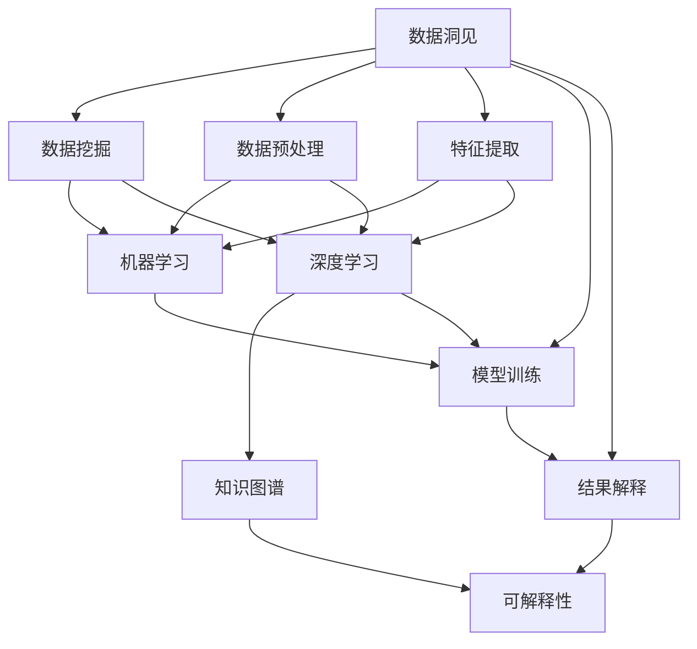

                 

# 洞见的价值：从理解到应用

> 关键词：洞见,数据挖掘,机器学习,深度学习,数据驱动决策,知识图谱,可解释性

## 1. 背景介绍

### 1.1 问题由来
在当今信息爆炸的时代，面对日益增长的海量数据，如何从中挖掘出有用的洞见，成为企业决策者和研究者共同关心的问题。数据不仅仅是堆砌的数字和符号，其背后蕴含着丰富的信息与洞见，能够为企业提供战略决策的依据。然而，海量数据的分析处理，单靠人工已无法胜任，计算机技术和人工智能的介入，为数据挖掘和洞见提取提供了新的可能。

### 1.2 问题核心关键点
数据的洞见价值在于其能够揭示数据之间的内在关联，帮助企业在复杂多变的环境中做出更加明智的决策。然而，数据的洞见往往隐藏在大量的噪声与无关信息之中，如何高效地从中提取洞见，是数据挖掘领域面临的核心挑战。

目前，基于机器学习（Machine Learning, ML）和深度学习（Deep Learning, DL）的数据挖掘技术，已经在大数据时代发挥了巨大的作用。从数据预处理、特征提取、模型训练，到结果解释和应用，这一系列的过程构成了数据洞见挖掘的完整流程。

### 1.3 问题研究意义
研究如何高效地从海量数据中挖掘洞见，具有重要的理论和实际意义：

1. 提高决策效率。基于数据的洞见可以为企业的战略决策提供有力支撑，减少决策过程中的不确定性。
2. 优化资源配置。洞见能够揭示资源配置的优劣，为企业提供更科学、更合理的资源配置方案。
3. 提升创新能力。洞见驱动企业进行技术创新和产品升级，保持行业竞争力。
4. 增强市场竞争力。洞见能够帮助企业及时掌握市场动态，制定有效的市场策略。

本文将深入探讨如何利用机器学习和深度学习技术，从海量数据中高效地挖掘洞见，并构建基于数据的洞见驱动决策框架。

## 2. 核心概念与联系

### 2.1 核心概念概述

为更好地理解数据洞见的挖掘过程，本节将介绍几个核心概念：

- 数据洞见(Data Insight)：通过数据分析处理，从海量数据中揭示出隐藏的、有用的信息和关联性，为企业决策提供有力支持。
- 数据挖掘(Data Mining)：利用计算机技术，从数据集中自动地发现相关知识、模式或规律的过程。
- 机器学习(Machine Learning)：通过算法自动地从数据中学习规律，并对未知数据进行预测或分类。
- 深度学习(Deep Learning)：一种特殊的机器学习技术，使用多层神经网络，从数据中学习复杂特征表示。
- 知识图谱(Knowledge Graph)：一种基于图结构的语义表示方法，用于组织和关联大量知识信息。
- 可解释性(Interpretability)：模型输出的结果能够被清晰解释，帮助用户理解模型的决策逻辑。

这些核心概念之间的逻辑关系可以通过以下Mermaid流程图来展示：



这个流程图展示了数据洞见挖掘的各个环节：

1. 数据预处理和特征提取：将原始数据转换为可供挖掘的特征集合。
2. 机器学习和深度学习：通过算法学习数据特征，揭示数据之间的内在关联。
3. 知识图谱构建：利用图结构组织和关联知识信息，形成更丰富的知识网络。
4. 可解释性增强：通过可解释性技术，使模型决策逻辑清晰可见。

这些环节共同构成了一个完整的洞见挖掘流程，使企业能够高效地从数据中提取洞见，驱动决策过程。

## 3. 核心算法原理 & 具体操作步骤

### 3.1 算法原理概述

数据洞见的挖掘，本质上是利用机器学习和深度学习技术，从海量数据中学习规律，揭示数据之间的关联性。常见的算法包括：

- 监督学习(Supervised Learning)：在已知标注数据的监督下，学习从输入到输出的映射关系。
- 无监督学习(Unsupervised Learning)：在无标注数据的条件下，学习数据的内在结构和特征表示。
- 强化学习(Reinforcement Learning)：通过与环境交互，优化决策策略。
- 半监督学习(Semi-Supervised Learning)：结合少量标注数据和大量无标注数据，优化模型性能。

数据洞见的挖掘过程通常包括以下几个步骤：

1. 数据预处理：清洗、归一化、降维等操作，使数据适合挖掘。
2. 特征提取：从原始数据中提取有意义的特征，作为模型的输入。
3. 模型训练：选择合适的算法，利用已知数据训练模型，优化模型参数。
4. 结果解释：对模型输出进行解释，揭示数据洞见。

### 3.2 算法步骤详解

数据洞见的挖掘流程主要包括以下几个关键步骤：

**Step 1: 数据预处理**

数据预处理是洞见挖掘的首要步骤，主要包括以下操作：

1. 数据清洗：去除缺失、异常、重复等无用的数据。
2. 数据归一化：将不同量级的数据归一化到0-1之间，方便后续计算。
3. 数据降维：利用PCA、LDA等降维算法，减少特征数量，提升计算效率。

**Step 2: 特征提取**

特征提取是将原始数据转换为可供模型处理的特征集合。常用的方法包括：

1. 统计特征提取：计算数据的均值、方差、最大值、最小值等基本统计量。
2. 文本特征提取：利用TF-IDF、Word2Vec等方法，提取文本数据的特征向量。
3. 图像特征提取：利用卷积神经网络（CNN）提取图像的特征向量。

**Step 3: 模型训练**

模型训练是洞见挖掘的核心步骤，主要包括以下操作：

1. 选择算法：根据任务类型选择合适的算法，如分类、回归、聚类等。
2. 划分数据集：将数据集划分为训练集、验证集和测试集，用于模型训练、调参和评估。
3. 模型训练：利用训练集数据，通过迭代优化，训练模型参数。
4. 模型调参：利用验证集数据，调整模型超参数，优化模型性能。

**Step 4: 结果解释**

结果解释是将模型输出转换为可理解的信息，揭示数据洞见的过程。常用的方法包括：

1. 特征重要性分析：通过特征重要性评分，揭示哪些特征对模型输出影响最大。
2. 决策树可视化：通过决策树可视化，揭示模型内部的决策逻辑。
3. 可视化技术：利用图表、热力图等可视化技术，直观展示模型结果。

### 3.3 算法优缺点

数据洞见挖掘算法具有以下优点：

1. 自动发现规律：机器学习和深度学习算法能够自动地从数据中学习规律，发现数据之间的关联性。
2. 高效处理大量数据：算法能够高效地处理海量数据，挖掘出隐含的洞见。
3. 多模态数据融合：算法能够融合不同模态的数据，提升洞见的全面性和准确性。

同时，这些算法也存在以下缺点：

1. 模型复杂度高：复杂模型可能需要大量数据和计算资源进行训练。
2. 结果解释性不足：部分算法输出结果难以解释，难以满足商业需求。
3. 数据隐私问题：挖掘过程中的数据隐私保护是一个重要问题。

尽管存在这些局限性，但就目前而言，基于机器学习和深度学习的数据洞见挖掘技术仍然是数据挖掘领域的主流范式。未来相关研究的重点在于如何进一步降低算法的计算复杂度，增强结果的解释性，以及加强数据隐私保护。

### 3.4 算法应用领域

数据洞见挖掘技术已经在诸多领域得到了广泛应用，例如：

- 市场营销：利用客户行为数据，挖掘客户画像和消费趋势，优化营销策略。
- 金融风控：利用交易数据，挖掘潜在的欺诈和风险，提升风控效果。
- 医疗健康：利用患者数据，挖掘疾病关联和诊疗方案，优化医疗服务。
- 供应链管理：利用物流和销售数据，挖掘供应链瓶颈和优化方案，提高供应链效率。
- 智能制造：利用设备数据，挖掘生产瓶颈和优化方案，提升生产效率。

除了上述这些经典应用外，数据洞见挖掘技术还被创新性地应用到更多场景中，如风险评估、城市规划、舆情分析等，为各行各业带来了显著的经济效益和社会效益。

## 4. 数学模型和公式 & 详细讲解 & 举例说明

### 4.1 数学模型构建

为更好地理解数据洞见的挖掘过程，本节将使用数学语言对数据挖掘流程进行更加严格的刻画。

设原始数据集为 $\{(x_i,y_i)\}_{i=1}^N$，其中 $x_i \in \mathbb{R}^d$ 为输入特征，$y_i \in \mathcal{Y}$ 为输出标签。假设选择的算法为 $f: \mathbb{R}^d \rightarrow \mathcal{Y}$，其中 $f$ 为映射函数，$\mathcal{Y}$ 为输出空间。

定义算法 $f$ 在数据样本 $(x,y)$ 上的损失函数为 $\ell(f(x),y)$，则在数据集 $D$ 上的经验风险为：

$$
\mathcal{L}(f) = \frac{1}{N}\sum_{i=1}^N \ell(f(x_i),y_i)
$$

最小化经验风险，即找到最优映射函数 $f^*$：

$$
f^* = \mathop{\arg\min}_{f} \mathcal{L}(f)
$$

在实践中，我们通常使用基于梯度的优化算法（如SGD、Adam等）来近似求解上述最优化问题。设 $\eta$ 为学习率，$\lambda$ 为正则化系数，则映射函数的更新公式为：

$$
f \leftarrow f - \eta \nabla_{f}\mathcal{L}(f) - \eta\lambda f
$$

其中 $\nabla_{f}\mathcal{L}(f)$ 为损失函数对映射函数 $f$ 的梯度，可通过反向传播算法高效计算。

### 4.2 公式推导过程

以下我们以二分类任务为例，推导决策边界和模型输出的计算公式。

假设模型 $f$ 在输入 $x$ 上的输出为 $\hat{y}=f(x) \in [0,1]$，表示样本属于正类的概率。真实标签 $y \in \{0,1\}$。则二分类决策边界为：

$$
\mathcal{L}(f) = -\frac{1}{N}\sum_{i=1}^N [y_i\log f(x_i)+(1-y_i)\log(1-f(x_i))]
$$

将损失函数对映射函数 $f$ 的梯度展开，得：

$$
\nabla_{f}\mathcal{L}(f) = -\frac{1}{N}\sum_{i=1}^N (\frac{y_i}{f(x_i)}-\frac{1-y_i}{1-f(x_i)}) \nabla_{x}f(x)
$$

其中 $\nabla_{x}f(x)$ 为映射函数对输入 $x$ 的导数，通过链式法则和反向传播算法计算得到。

在得到损失函数的梯度后，即可带入映射函数更新公式，完成模型的迭代优化。重复上述过程直至收敛，最终得到适应数据集 $D$ 的最优映射函数 $f^*$。

## 5. 项目实践：代码实例和详细解释说明

### 5.1 开发环境搭建

在进行数据洞见挖掘实践前，我们需要准备好开发环境。以下是使用Python进行Scikit-Learn开发的环境配置流程：

1. 安装Anaconda：从官网下载并安装Anaconda，用于创建独立的Python环境。

2. 创建并激活虚拟环境：
```bash
conda create -n sklearn-env python=3.8 
conda activate sklearn-env
```

3. 安装Scikit-Learn：从官网获取对应的安装命令。例如：
```bash
pip install scikit-learn
```

4. 安装各类工具包：
```bash
pip install numpy pandas scikit-learn matplotlib tqdm jupyter notebook ipython
```

完成上述步骤后，即可在`sklearn-env`环境中开始数据洞见挖掘实践。

### 5.2 源代码详细实现

这里我们以二分类任务为例，给出使用Scikit-Learn进行数据挖掘的Python代码实现。

首先，定义数据处理函数：

```python
from sklearn.model_selection import train_test_split
from sklearn.preprocessing import StandardScaler
from sklearn.linear_model import LogisticRegression
from sklearn.metrics import classification_report

def process_data(X, y):
    # 数据清洗：去除缺失值和异常值
    X = X[X['age'].notnull() & (X['age']>0)]
    y = y[y.notnull()]
    
    # 数据归一化
    scaler = StandardScaler()
    X = scaler.fit_transform(X[['age', 'income']])
    
    return X, y

# 加载数据
data = pd.read_csv('data.csv')
X = data[['age', 'income']]
y = data['default']

# 数据预处理
X, y = process_data(X, y)

# 划分训练集和测试集
X_train, X_test, y_train, y_test = train_test_split(X, y, test_size=0.2, random_state=42)

# 特征提取
X_train = scaler.transform(X_train)
X_test = scaler.transform(X_test)

# 模型训练
model = LogisticRegression()
model.fit(X_train, y_train)

# 结果评估
y_pred = model.predict(X_test)
print(classification_report(y_test, y_pred))
```

然后，定义训练和评估函数：

```python
from sklearn.model_selection import cross_val_score

def train_model(model, X_train, y_train):
    model.fit(X_train, y_train)
    return model

def evaluate_model(model, X_test, y_test):
    y_pred = model.predict(X_test)
    print(classification_report(y_test, y_pred))
```

最后，启动训练流程并在测试集上评估：

```python
# 模型训练
model = train_model(LogisticRegression(), X_train, y_train)

# 模型评估
evaluate_model(model, X_test, y_test)
```

以上就是使用Scikit-Learn对二分类数据进行挖掘的完整代码实现。可以看到，Scikit-Learn封装了常用的数据处理、模型训练、结果评估等功能，使得数据挖掘的代码实现变得简洁高效。

### 5.3 代码解读与分析

让我们再详细解读一下关键代码的实现细节：

**process_data函数**：
- 函数的主要目的是对数据进行清洗和归一化，去除缺失值和异常值，并将数值特征归一化到0-1之间。

**train_model函数**：
- 函数的主要目的是利用训练数据训练模型，并返回训练后的模型对象。

**evaluate_model函数**：
- 函数的主要目的是利用测试数据评估模型，并输出分类报告。

**训练流程**：
- 使用train_model函数对模型进行训练，返回训练后的模型对象。
- 使用evaluate_model函数在测试集上评估模型，输出分类报告。

可以看到，Scikit-Learn提供了完整的工具链，使得数据洞见挖掘的代码实现变得简单易懂。开发者可以将更多精力放在数据处理、模型选择等高层逻辑上，而不必过多关注底层的实现细节。

当然，工业级的系统实现还需考虑更多因素，如模型的保存和部署、超参数的自动搜索、更灵活的模型接口等。但核心的挖掘流程基本与此类似。

## 6. 实际应用场景

### 6.1 市场营销

基于数据洞见挖掘技术，市场营销可以更加精准地定位目标客户，优化广告投放策略。

具体而言，可以收集用户的历史浏览、购买、互动等数据，利用机器学习模型挖掘用户的兴趣点、行为特征和购买倾向。通过将这些洞见转化为营销策略，可以大幅提升广告的转化率和投资回报率。

### 6.2 金融风控

金融风控领域，利用数据洞见挖掘技术，可以有效识别潜在风险和欺诈行为。

通过收集用户的交易记录、行为数据和社交网络信息，利用深度学习模型挖掘用户的信用评分、风险等级和潜在欺诈行为。将这些洞见应用于信贷审批、反欺诈监测等环节，可以有效降低金融风险。

### 6.3 医疗健康

在医疗健康领域，数据洞见挖掘技术可以帮助医疗机构进行疾病预测和诊疗优化。

通过收集患者的病历、体检数据和基因信息，利用机器学习模型挖掘出疾病关联、诊疗方案和治疗效果。这些洞见可以帮助医生制定个性化的诊疗方案，提高治疗效果。

### 6.4 智能制造

智能制造领域，利用数据洞见挖掘技术，可以优化生产流程和设备维护。

通过收集生产设备的数据，利用深度学习模型挖掘生产瓶颈和设备故障。这些洞见可以帮助企业优化生产流程，减少故障停机时间，提高生产效率。

### 6.5 未来应用展望

随着数据洞见挖掘技术的不断发展，其在更多领域的应用前景将进一步扩大。

在智慧城市治理中，数据洞见挖掘技术可以应用于城市事件监测、舆情分析、应急指挥等环节，提高城市管理的自动化和智能化水平，构建更安全、高效的未来城市。

在智能交通领域，利用交通数据，挖掘出交通流模式和事故发生规律，优化交通管理和调度，减少交通拥堵和事故发生率。

在智能零售领域，利用用户数据，挖掘出购买行为和偏好，优化商品推荐和库存管理，提升零售业务的销售额和客户满意度。

此外，在智慧农业、智慧教育、智能安全等多个领域，数据洞见挖掘技术也将不断探索，为各行各业带来更多创新和突破。

## 7. 工具和资源推荐
### 7.1 学习资源推荐

为了帮助开发者系统掌握数据洞见挖掘的理论基础和实践技巧，这里推荐一些优质的学习资源：

1. 《机器学习实战》系列博文：由数据挖掘专家撰写，深入浅出地介绍了机器学习和深度学习的基本概念和应用。

2. Coursera《机器学习》课程：斯坦福大学开设的机器学习经典课程，内容全面，适合入门学习。

3. 《Python机器学习》书籍：本书详细介绍了机器学习和深度学习的Python实现，是开发数据洞见挖掘项目的必备参考。

4. Scikit-Learn官方文档：Scikit-Learn的官方文档，提供了详细的API文档和样例代码，是实践学习的重要资源。

5. Kaggle开源项目：Kaggle提供的大量开源数据集和竞赛，可以帮助开发者学习和实践数据洞见挖掘技术。

通过对这些资源的学习实践，相信你一定能够快速掌握数据洞见挖掘的精髓，并用于解决实际的业务问题。
###  7.2 开发工具推荐

高效的开发离不开优秀的工具支持。以下是几款用于数据洞见挖掘开发的常用工具：

1. Python：Python是数据洞见挖掘的主要编程语言，拥有丰富的库和工具支持。

2. R语言：R语言是数据科学和统计分析的重要工具，拥有强大的数据处理和可视化能力。

3. Scikit-Learn：Scikit-Learn是Python的一个机器学习库，提供了丰富的算法和工具支持。

4. TensorFlow：由Google主导开发的深度学习框架，生产部署方便，适合大规模工程应用。

5. Keras：Keras是一个深度学习库，提供了简单易用的API，适合快速迭代研究。

6. Jupyter Notebook：Jupyter Notebook是一个交互式的编程环境，适合进行数据探索和可视化。

合理利用这些工具，可以显著提升数据洞见挖掘的开发效率，加快创新迭代的步伐。

### 7.3 相关论文推荐

数据洞见挖掘技术的发展源于学界的持续研究。以下是几篇奠基性的相关论文，推荐阅读：

1. KDD Cup 2012 Winning Paper：提出了一种基于分类和聚类的组合模型，用于预测客户流失。

2. Datasets for Multiple Learning Algorithms：收集了大量开放域数据集，用于机器学习算法的比较研究。

3. Fastfood：提出了一种高效的特征选择算法，用于提升模型性能。

4. Deep Learning with Confidence：利用深度学习模型进行不确定性分析，揭示数据洞见。

5. GANs Trained by a Two-Level Minimax-Game Theory Objective：利用生成对抗网络（GANs）进行数据生成和增强，提高数据洞见挖掘效果。

这些论文代表了大数据挖掘领域的发展脉络。通过学习这些前沿成果，可以帮助研究者把握学科前进方向，激发更多的创新灵感。

## 8. 总结：未来发展趋势与挑战

### 8.1 总结

本文对数据洞见挖掘技术进行了全面系统的介绍。首先阐述了数据洞见的价值，明确了洞见挖掘在商业决策、资源配置、技术创新等方面的重要性。其次，从原理到实践，详细讲解了数据洞见挖掘的数学原理和关键步骤，给出了数据洞见挖掘项目的完整代码实例。同时，本文还广泛探讨了数据洞见挖掘技术在市场营销、金融风控、医疗健康、智能制造等多个行业领域的应用前景，展示了洞见挖掘范式的巨大潜力。此外，本文精选了洞见挖掘技术的各类学习资源，力求为读者提供全方位的技术指引。

通过本文的系统梳理，可以看到，数据洞见挖掘技术在大数据时代具有重要的应用价值，能够从海量数据中高效地提取洞见，驱动决策过程。未来，伴随数据规模的不断增长和算法的不断演进，洞见挖掘技术必将为各行各业带来更多创新和突破。

### 8.2 未来发展趋势

展望未来，数据洞见挖掘技术将呈现以下几个发展趋势：

1. 算法模型多样化。未来的算法模型将更加多样化和灵活，能够适应不同的业务场景和数据类型。

2. 自动化程度提升。数据洞见挖掘技术将进一步自动化，减少人工干预，提升挖掘效率。

3. 跨模态融合加强。未来的洞见挖掘将更加注重跨模态数据的融合，利用多源数据提升洞见的全面性和准确性。

4. 可解释性增强。未来的模型将更加注重结果的可解释性，帮助用户理解模型的决策逻辑。

5. 实时性要求提高。未来的洞见挖掘将更加注重实时性，能够在短时间内提供高质量的洞见输出。

6. 数据隐私保护加强。未来的数据洞见挖掘技术将更加注重数据隐私保护，确保用户数据的安全和合规。

以上趋势凸显了数据洞见挖掘技术的广阔前景。这些方向的探索发展，必将进一步提升数据挖掘的效率和效果，为商业决策和业务优化提供更强有力的支撑。

### 8.3 面临的挑战

尽管数据洞见挖掘技术已经取得了瞩目成就，但在迈向更加智能化、普适化应用的过程中，它仍面临着诸多挑战：

1. 数据规模和多样性：数据规模不断增大，数据类型不断增多，数据管理和处理难度加大。

2. 计算资源瓶颈：算法模型复杂度高，计算资源消耗大，需要高效的计算平台和工具支持。

3. 结果解释性不足：部分算法输出结果难以解释，难以满足商业需求。

4. 数据隐私问题：挖掘过程中的数据隐私保护是一个重要问题，需要严格的数据管理和隐私保护措施。

5. 数据噪声干扰：原始数据中存在大量噪声和干扰因素，如何有效清洗和处理数据，是一个重要的技术难题。

6. 模型泛化能力：模型在面对未知数据时，泛化能力不足，难以有效应对复杂多变的业务场景。

这些挑战需要我们在算法、数据、计算和隐私等多个维度进行全面优化，才能充分发挥数据洞见挖掘技术的潜力，推动其在各个行业的广泛应用。

### 8.4 研究展望

面对数据洞见挖掘面临的挑战，未来的研究需要在以下几个方面寻求新的突破：

1. 探索更多高效、轻量级的算法模型，降低计算资源消耗，提升实时性。

2. 开发更多可解释的模型，增强模型的可解释性，提升商业应用价值。

3. 加强跨模态数据融合技术，提升洞见的全面性和准确性。

4. 注重数据隐私保护，开发隐私保护算法，确保用户数据安全。

5. 引入更多的领域知识和规则，增强模型的泛化能力，提升模型的应用效果。

6. 探索更高效的模型压缩和优化技术，提升模型的计算效率。

这些研究方向的探索，必将引领数据洞见挖掘技术迈向更高的台阶，为数据驱动决策提供更强有力的技术支撑。

## 9. 附录：常见问题与解答

**Q1：数据洞见挖掘是否适用于所有数据类型？**

A: 数据洞见挖掘适用于大多数数据类型，包括数值型、文本型、图像型、视频型等。不同的数据类型可能需要采用不同的特征提取和模型训练方法。

**Q2：数据洞见挖掘是否需要大量标注数据？**

A: 数据洞见挖掘既可以利用大量标注数据，也可以利用无标注数据。无监督学习和半监督学习算法能够在数据标注不足的情况下，从数据中挖掘出有价值的洞见。

**Q3：数据洞见挖掘是否需要强大的计算资源？**

A: 数据洞见挖掘对计算资源的需求取决于具体算法和数据规模。一些高效的算法可以在单机上进行计算，而一些复杂的算法可能需要分布式计算平台的支持。

**Q4：数据洞见挖掘的结果如何应用到实际业务中？**

A: 数据洞见挖掘的结果通常需要进行可视化、解释和应用，才能转化为实际业务价值。可以通过数据仪表盘、报表、推荐系统等形式，将洞见结果应用到实际业务中，驱动决策和优化。

**Q5：数据洞见挖掘是否适用于小规模数据集？**

A: 数据洞见挖掘通常需要大量的数据进行训练，但也可以在小规模数据集上进行尝试。可以通过特征工程和数据增强等技术，提升小规模数据的挖掘效果。

通过本文的系统梳理，可以看到，数据洞见挖掘技术在大数据时代具有重要的应用价值，能够从海量数据中高效地提取洞见，驱动决策过程。未来，伴随数据规模的不断增长和算法的不断演进，洞见挖掘技术必将为各行各业带来更多创新和突破。只有勇于创新、敢于突破，才能不断拓展洞见挖掘的边界，让数据驱动决策的潜力得到充分释放。

---

作者：禅与计算机程序设计艺术 / Zen and the Art of Computer Programming

