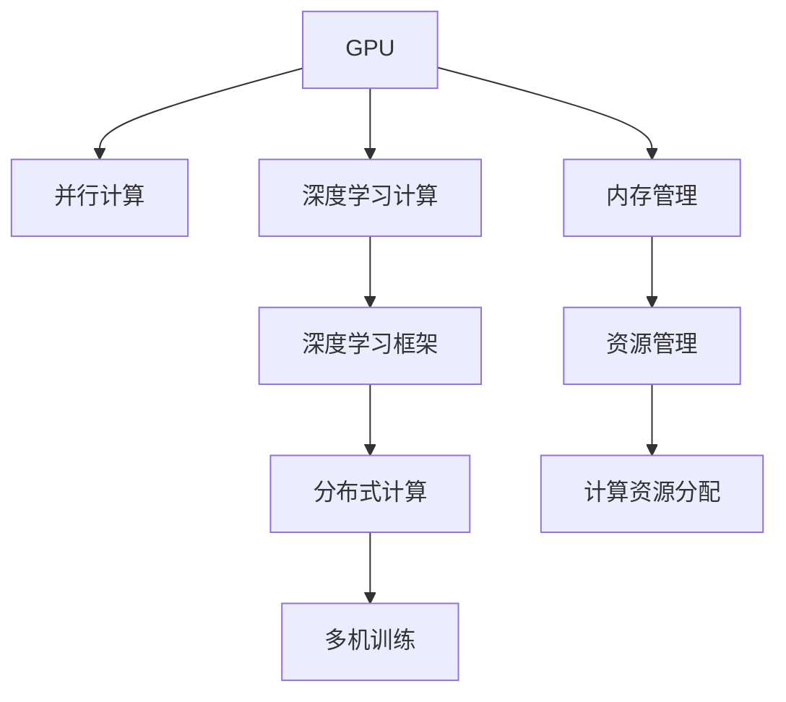

                 

# 深度学习加速：GPU和TPU的使用

> 关键词：深度学习,GPU,TPU,加速,硬件优化,资源管理,分布式计算

## 1. 背景介绍

### 1.1 问题由来
随着深度学习技术的发展，大规模深度神经网络模型在计算机视觉、自然语言处理、语音识别等多个领域取得了显著进展。这些模型通常包含数百万甚至数十亿个参数，训练过程中需要巨大的计算资源。传统CPU的计算能力难以满足要求，因此GPU和TPU等专用硬件应运而生。GPU（图形处理单元）和TPU（张量处理单元）是当今深度学习加速的主要硬件工具，它们以其高并行性、低延迟和高效能著称。本文将详细探讨GPU和TPU的原理、应用以及优化策略，为深度学习开发者提供实用的指导。

### 1.2 问题核心关键点
本节将明确GPU和TPU在深度学习加速中的核心作用和关键技术点，包括：
- GPU和TPU的并行处理机制。
- 深度学习框架（如TensorFlow、PyTorch等）对GPU和TPU的优化支持。
- 不同应用场景下的硬件选择和优化策略。
- 分布式计算和多机训练技术的实现和应用。

通过理解这些核心概念，我们能够更好地掌握GPU和TPU的优化原理和实际应用技巧，提升深度学习的训练和推理效率。

## 2. 核心概念与联系

### 2.1 核心概念概述

为更好地理解GPU和TPU在深度学习加速中的作用，本节将介绍几个关键概念：

- GPU：图形处理单元，最初用于加速图形渲染，后来被广泛应用于深度学习计算。GPU具有极高的并行计算能力，适合处理大规模向量计算任务。
- TPU：张量处理单元，是Google开发的一种定制硬件，专门针对TensorFlow框架进行了优化。TPU具有极高的计算密度和低延迟，适合大规模深度神经网络的训练和推理。
- 深度学习框架：如TensorFlow、PyTorch等，提供了GPU和TPU的接口和优化支持，使得开发者可以方便地使用这些硬件加速深度学习模型。
- 分布式计算：通过多台计算机的协同计算，分担大规模深度学习模型的计算负担，提升计算效率。
- 资源管理：包括内存管理、计算资源分配等，对深度学习模型的训练和推理效率有重要影响。

这些核心概念之间的逻辑关系可以通过以下Mermaid流程图来展示：



这个流程图展示了GPU和TPU在深度学习中的核心作用及其与其他概念的联系。

## 3. 核心算法原理 & 具体操作步骤
### 3.1 算法原理概述

GPU和TPU在深度学习加速中的原理主要基于它们的高并行计算能力和低延迟特性。具体来说：

- GPU通过多核并行处理，可以将单个计算任务拆分为多个子任务，由多个核同时计算。这样可以显著提升计算效率。
- TPU则采用了专门的硬件架构，包括片上内存、高速互连等设计，能够高效处理张量运算，适合大规模深度学习模型的计算。

在深度学习框架中，GPU和TPU的优化通常包括以下几个方面：

1. 自动并行化：框架能够自动将模型计算任务分解为并行任务，充分利用GPU和TPU的计算资源。
2. 内存优化：框架提供了优化内存分配的策略，避免内存瓶颈和数据传输损耗。
3. 算法优化：包括矩阵分解、稀疏矩阵计算等优化技术，提高计算效率。
4. 硬件加速：利用GPU和TPU的专用计算单元加速深度学习模型的训练和推理过程。

### 3.2 算法步骤详解

基于GPU和TPU的深度学习加速通常包括以下几个关键步骤：

**Step 1: 选择合适的硬件平台**
- 根据应用场景和需求，选择合适的GPU或TPU硬件平台，如NVIDIA的GeForce系列、Quadro系列，或Google的TPU v2、v3等。
- 考虑硬件的性能、功耗、成本等因素，选择最合适的硬件配置。

**Step 2: 安装深度学习框架**
- 在所选的硬件平台上安装深度学习框架，如TensorFlow、PyTorch等。
- 确保框架支持所选的硬件平台，并提供相应的优化支持。

**Step 3: 配置和优化模型**
- 根据硬件平台的特性，对深度学习模型进行配置和优化。
- 利用框架提供的优化工具和策略，如自动并行化、内存优化等，提高模型效率。
- 对模型算法进行优化，如矩阵分解、稀疏矩阵计算等，进一步提升计算效率。

**Step 4: 训练和推理**
- 在配置好的硬件平台上训练深度学习模型。
- 利用多机训练技术，如TensorFlow的分布式训练功能，加速训练过程。
- 对训练好的模型进行推理，利用GPU和TPU的硬件加速，提升推理速度。

**Step 5: 评估和调优**
- 在推理过程中，监控硬件性能和资源使用情况。
- 根据性能指标和资源消耗情况，进行评估和调优，如调整计算资源分配、优化内存使用等。

通过上述步骤，可以有效利用GPU和TPU的硬件加速能力，提升深度学习模型的训练和推理效率。

### 3.3 算法优缺点

GPU和TPU在深度学习加速中具有以下优点：
1. 高并行性：GPU和TPU可以同时处理多个计算任务，提高计算效率。
2. 低延迟：GPU和TPU的计算速度快，延迟低，适合实时处理任务。
3. 高效能：GPU和TPU专为深度学习设计，提供了强大的计算能力。
4. 高度优化：框架提供了大量的优化策略和工具，使得深度学习模型能够充分利用硬件加速。

同时，它们也存在一些缺点：
1. 高成本：GPU和TPU价格较高，对硬件投资成本有较大要求。
2. 硬件复杂性：GPU和TPU硬件配置复杂，需要专业知识进行管理和优化。
3. 软件依赖性：深度学习框架的优化需要与特定硬件平台相匹配，存在一定的学习成本。
4. 可移植性：GPU和TPU硬件优化针对性较强，跨平台移植性较弱。

尽管存在这些缺点，GPU和TPU在深度学习加速中仍然具有不可替代的地位，尤其是在大规模深度学习模型和高性能计算需求下。

### 3.4 算法应用领域

GPU和TPU的深度学习加速在以下几个领域得到了广泛应用：

- 计算机视觉：图像分类、目标检测、图像分割等任务。
- 自然语言处理：机器翻译、文本生成、语音识别等任务。
- 强化学习：智能游戏、机器人控制、自动驾驶等任务。
- 科学计算：量子计算、气候模拟、蛋白质折叠等任务。

随着深度学习技术的发展，GPU和TPU加速的应用领域还在不断扩大，未来将有更多领域受益于硬件加速的提升。

## 4. 数学模型和公式 & 详细讲解 & 举例说明
### 4.1 数学模型构建

深度学习模型的计算任务通常涉及大规模矩阵运算，如矩阵乘法、卷积运算等。这些运算可以通过GPU和TPU的并行计算能力高效完成。以下是一个简单的例子，说明如何在GPU或TPU上实现矩阵乘法。

设两个矩阵 $A$ 和 $B$ 的大小分别为 $m\times n$ 和 $n\times p$，其中 $m$、$n$、$p$ 均为正整数。矩阵乘法的计算公式为：

$$
C = A \times B
$$

其中 $C$ 为 $m\times p$ 的矩阵。在GPU和TPU上实现矩阵乘法的主要步骤为：

1. 将矩阵 $A$ 和 $B$ 分为若干个子矩阵，并行计算。
2. 对每个子矩阵进行矩阵乘法运算。
3. 将子矩阵计算结果合并，得到最终结果 $C$。

### 4.2 公式推导过程

矩阵乘法的并行计算过程可以表示为：

$$
C_{ij} = \sum_{k=1}^{n} A_{ik} \times B_{kj}
$$

其中 $C_{ij}$ 表示矩阵 $C$ 的第 $i$ 行第 $j$ 列元素，$A_{ik}$ 和 $B_{kj}$ 分别表示矩阵 $A$ 和 $B$ 的第 $i$ 行第 $k$ 列元素和第 $k$ 行第 $j$ 列元素。

为了利用GPU和TPU的并行计算能力，可以将矩阵 $A$ 和 $B$ 分别分成 $m$ 个子矩阵 $A_1, A_2, ..., A_m$ 和 $n$ 个子矩阵 $B_1, B_2, ..., B_n$。每个子矩阵的大小为 $m/n \times n/p$。

对每个子矩阵 $A_k$ 和 $B_j$ 进行矩阵乘法运算，得到中间矩阵 $X_k$，其中 $X_k$ 的大小为 $m/n \times n/p$。然后，将每个子矩阵 $X_k$ 合并，得到最终矩阵 $C$。

### 4.3 案例分析与讲解

以下是一个使用TensorFlow在GPU上实现矩阵乘法的简单例子。

```python
import tensorflow as tf

# 定义矩阵A和B
A = tf.constant([[1, 2], [3, 4]], dtype=tf.float32)
B = tf.constant([[5, 6], [7, 8]], dtype=tf.float32)

# 在GPU上定义计算图
with tf.device('/gpu:0'):
    C = tf.matmul(A, B)

# 运行计算图
with tf.Session() as sess:
    result = sess.run(C)
    print(result)
```

在上述代码中，我们首先定义了两个矩阵 $A$ 和 $B$，然后使用 `tf.device('/gpu:0')` 将计算任务分配到GPU 0上。接着，使用 `tf.matmul` 函数计算矩阵乘法，得到结果矩阵 $C$。最后，通过 `tf.Session` 运行计算图，并打印输出结果。

通过这个例子，我们可以看到，使用GPU进行矩阵乘法计算可以显著提升计算效率，尤其是在处理大规模矩阵时。

## 5. 项目实践：代码实例和详细解释说明
### 5.1 开发环境搭建

在进行深度学习加速的实践前，我们需要准备好开发环境。以下是使用Python进行TensorFlow开发的环境配置流程：

1. 安装Anaconda：从官网下载并安装Anaconda，用于创建独立的Python环境。

2. 创建并激活虚拟环境：
```bash
conda create -n tensorflow-env python=3.8 
conda activate tensorflow-env
```

3. 安装TensorFlow：
```bash
conda install tensorflow
```

4. 安装GPU驱动和CUDA工具包：
```bash
conda install -c anaconda -c nvidia tensorflow-gpu
```

5. 配置环境变量，设置GPU访问权限：
```bash
export CUDA_VISIBLE_DEVICES=0
```

完成上述步骤后，即可在`tensorflow-env`环境中开始深度学习加速的实践。

### 5.2 源代码详细实现

下面以一个简单的卷积神经网络（CNN）为例，展示如何使用TensorFlow和GPU加速模型训练。

首先，定义CNN模型：

```python
import tensorflow as tf

model = tf.keras.models.Sequential([
    tf.keras.layers.Conv2D(32, (3, 3), activation='relu', input_shape=(28, 28, 1)),
    tf.keras.layers.MaxPooling2D((2, 2)),
    tf.keras.layers.Flatten(),
    tf.keras.layers.Dense(10, activation='softmax')
])
```

然后，配置GPU加速：

```python
gpus = tf.config.list_physical_devices('GPU')
if gpus:
    try:
        # 设置GPU为第一块，如果多块GPU则设置为第二块、第三块...
        tf.config.set_visible_devices(gpus[0], 'GPU')
        print("Number of GPU(s):", len(gpus))
    except RuntimeError as e:
        print(e)
```

接着，编译模型：

```python
model.compile(optimizer='adam', loss='categorical_crossentropy', metrics=['accuracy'])
```

最后，训练模型：

```python
model.fit(x_train, y_train, epochs=5, batch_size=32, validation_data=(x_test, y_test))
```

### 5.3 代码解读与分析

让我们再详细解读一下关键代码的实现细节：

**配置GPU加速**：
- `tf.config.list_physical_devices('GPU')`：获取物理GPU设备列表。
- `tf.config.set_visible_devices(gpus[0], 'GPU')`：设置第一块GPU为可见设备，其他GPU设置为不可见设备，确保训练任务只在指定的GPU上运行。

**模型编译**：
- `model.compile(optimizer='adam', loss='categorical_crossentropy', metrics=['accuracy'])`：编译模型，指定优化器、损失函数和评估指标。

**模型训练**：
- `model.fit(x_train, y_train, epochs=5, batch_size=32, validation_data=(x_test, y_test))`：训练模型，指定训练数据、训练轮数、批次大小和验证数据。

可以看到，使用TensorFlow进行深度学习加速，只需要简单的配置即可充分利用GPU的硬件加速能力，提升模型的训练效率。

当然，工业级的系统实现还需考虑更多因素，如GPU优化、内存管理、分布式训练等。但核心的硬件加速范式基本与此类似。

## 6. 实际应用场景
### 6.1 智能推荐系统

智能推荐系统在电商、新闻、视频等多个领域得到了广泛应用。传统的推荐系统依赖用户的历史行为数据进行物品推荐，难以准确理解用户的真实兴趣。基于深度学习加速的推荐系统可以更好地挖掘用户行为背后的语义信息，从而提供更精准、多样的推荐内容。

在技术实现上，可以收集用户浏览、点击、评论、分享等行为数据，提取和用户交互的物品标题、描述、标签等文本内容。将文本内容作为模型输入，用户的后续行为（如是否点击、购买等）作为监督信号，在此基础上微调预训练语言模型。微调后的模型能够从文本内容中准确把握用户的兴趣点。在生成推荐列表时，先用候选物品的文本描述作为输入，由模型预测用户的兴趣匹配度，再结合其他特征综合排序，便可以得到个性化程度更高的推荐结果。

### 6.2 图像识别与处理

图像识别和处理是深度学习的重要应用之一。传统的图像处理任务需要大量的计算资源，而使用GPU和TPU加速可以显著提升计算效率。例如，在图像分类、目标检测、图像分割等任务中，GPU和TPU可以并行处理大规模图像数据，加速模型的训练和推理。

在实践中，可以使用卷积神经网络（CNN）等深度学习模型对图像进行特征提取和分类。通过GPU和TPU的加速，可以快速处理大规模图像数据，提升模型性能。同时，结合分布式计算和多机训练技术，进一步提升计算效率，满足实际应用的需求。

### 6.3 自然语言处理

自然语言处理（NLP）是深度学习的重要应用领域之一。传统的NLP任务如文本分类、情感分析、机器翻译等需要大量的计算资源。通过GPU和TPU的加速，可以显著提升NLP任务的训练和推理效率。

在实践中，可以使用Transformer等深度学习模型对文本进行编码和解码。通过GPU和TPU的加速，可以并行处理大规模文本数据，提升模型的训练和推理速度。同时，结合分布式计算和多机训练技术，进一步提升计算效率，满足实际应用的需求。

### 6.4 未来应用展望

随着深度学习技术的发展，GPU和TPU加速的应用场景还在不断扩大，未来将有更多领域受益于硬件加速的提升。

在智慧医疗领域，基于深度学习加速的医疗影像诊断、病历分析、药物研发等应用将提升医疗服务的智能化水平，辅助医生诊疗，加速新药开发进程。

在智能教育领域，基于深度学习加速的作业批改、学情分析、知识推荐等应用，将因材施教，促进教育公平，提高教学质量。

在智慧城市治理中，基于深度学习加速的城市事件监测、舆情分析、应急指挥等应用，将提高城市管理的自动化和智能化水平，构建更安全、高效的未来城市。

此外，在企业生产、社会治理、文娱传媒等众多领域，基于深度学习加速的人工智能应用也将不断涌现，为经济社会发展注入新的动力。相信随着硬件技术的发展和算法优化的不断进步，GPU和TPU加速将为深度学习带来更多突破，推动人工智能技术落地应用。

## 7. 工具和资源推荐
### 7.1 学习资源推荐

为了帮助开发者系统掌握GPU和TPU在深度学习中的作用和应用，这里推荐一些优质的学习资源：

1. TensorFlow官方文档：提供了GPU和TPU的详细配置和使用指南，是学习深度学习加速的必备资料。
2. PyTorch官方文档：提供了GPU和TPU的优化支持，帮助开发者更好地利用硬件加速。
3. NVIDIA官方文档：提供了GPU的详细配置和使用指南，是GPU加速的首选参考资料。
4. Google Cloud AI平台：提供了丰富的TPU资源和优化支持，适合大规模深度学习模型的训练和推理。
5. TensorFlow实战（第2版）：提供了深度学习加速的实战案例，适合深入了解GPU和TPU的使用。

通过对这些资源的学习实践，相信你一定能够快速掌握GPU和TPU在深度学习加速中的作用和应用技巧，提升深度学习的训练和推理效率。

### 7.2 开发工具推荐

高效的开发离不开优秀的工具支持。以下是几款用于深度学习加速开发的常用工具：

1. TensorFlow：由Google主导开发的开源深度学习框架，提供了GPU和TPU的优化支持，支持大规模深度学习模型的训练和推理。
2. PyTorch：Facebook开发的开源深度学习框架，支持GPU和TPU加速，提供了灵活的计算图和易于使用的API。
3. NVIDIA NVidia CUDA Toolkit：提供了NVIDIA GPU的优化支持，使得深度学习模型能够高效利用GPU计算资源。
4. Google Cloud AI平台：提供了丰富的TPU资源和优化支持，适合大规模深度学习模型的训练和推理。
5. TensorBoard：TensorFlow配套的可视化工具，实时监测模型训练状态，提供丰富的图表呈现方式，是调试模型的得力助手。

合理利用这些工具，可以显著提升深度学习加速的开发效率，加快创新迭代的步伐。

### 7.3 相关论文推荐

深度学习加速的硬件优化一直是学界和工业界的研究热点。以下是几篇奠基性的相关论文，推荐阅读：

1. Multi-GPU Programming and Fault Tolerance Using CUDA: A Tutorial (NVIDIA)：介绍了CUDA编程和故障容错技术，是学习GPU加速的入门教材。
2. Scaling Deep Learning with GPUs (Google)：介绍了Google在GPU加速方面的实践和经验，适合深入了解GPU加速的原理和应用。
3. TPU: A Custom ASIC Chip and Software System for Machine Learning (Google)：介绍了TPU的硬件架构和优化设计，是学习TPU加速的必备资料。
4. Scaling Deep Neural Networks to 100 Million Parameters (Google)：介绍了Google在深度学习模型规模上的突破，适合了解深度学习硬件优化的大趋势。

这些论文代表了大规模深度学习加速的发展脉络。通过学习这些前沿成果，可以帮助研究者把握学科前进方向，激发更多的创新灵感。

## 8. 总结：未来发展趋势与挑战
### 8.1 总结

本文对GPU和TPU在深度学习加速中的作用进行了全面系统的介绍。首先阐述了GPU和TPU在深度学习中的核心作用和关键技术点，明确了深度学习框架对GPU和TPU的优化支持。其次，从原理到实践，详细讲解了GPU和TPU加速的数学模型和操作步骤，给出了深度学习加速的完整代码实例。同时，本文还广泛探讨了GPU和TPU在智能推荐、图像识别、自然语言处理等多个领域的应用前景，展示了深度学习加速技术的广阔前景。

通过本文的系统梳理，可以看到，GPU和TPU在深度学习加速中具有不可替代的地位，显著提升了深度学习模型的训练和推理效率。未来，伴随硬件技术的不断发展和算法优化的持续进步，深度学习加速技术必将进一步提升深度学习模型的性能和应用范围，为人工智能技术落地应用提供坚实的基础。

### 8.2 未来发展趋势

展望未来，深度学习加速技术将呈现以下几个发展趋势：

1. 硬件性能提升：随着硬件制造技术的发展，GPU和TPU的计算能力将进一步提升，支持更大规模的深度学习模型训练和推理。
2. 硬件多样化：除了传统的GPU和TPU，未来还将涌现更多种类的专用硬件，如FPGA、ASIC等，进一步提升深度学习加速的效率和灵活性。
3. 软件优化：深度学习框架将不断优化对硬件的支持，提供更加高效、灵活的计算图和优化策略。
4. 分布式计算：随着数据规模的不断扩大，分布式计算和多机训练技术将进一步发展，提升深度学习模型的训练效率。
5. 硬件可移植性：未来将有更多种类的深度学习硬件可供选择，满足不同应用场景的需求。
6. 跨领域应用：深度学习加速技术将在更多领域得到应用，为各行各业带来变革性影响。

以上趋势凸显了深度学习加速技术的广阔前景。这些方向的探索发展，必将进一步提升深度学习模型的性能和应用范围，为人工智能技术落地应用提供坚实的基础。

### 8.3 面临的挑战

尽管深度学习加速技术已经取得了瞩目成就，但在迈向更加智能化、普适化应用的过程中，它仍面临着诸多挑战：

1. 硬件成本：高性能深度学习硬件价格较高，对企业投资成本有较大要求。
2. 硬件学习曲线：高性能深度学习硬件配置复杂，需要专业知识进行管理和优化。
3. 软件生态兼容性：不同深度学习框架和硬件之间的兼容性存在挑战，需要更多的优化和适配工作。
4. 计算资源分配：大规模深度学习模型需要大量的计算资源，如何高效分配和管理这些资源是一个重要问题。
5. 跨平台移植性：深度学习硬件加速技术往往针对特定平台进行优化，跨平台移植性较弱。

尽管存在这些挑战，深度学习加速技术在深度学习中的地位仍不可替代，尤其是在大规模深度学习模型和高性能计算需求下。未来，随着硬件技术的不断发展和算法优化的持续进步，这些挑战终将一一被克服，深度学习加速技术必将进一步提升深度学习模型的性能和应用范围。

### 8.4 研究展望

面向未来，深度学习加速技术需要在以下几个方面寻求新的突破：

1. 硬件创新：开发更加高效、低延迟、低成本的深度学习专用硬件，满足更多应用场景的需求。
2. 软件优化：提升深度学习框架对不同硬件平台的优化支持，提供更加灵活、高效的计算图和优化策略。
3. 分布式计算：进一步发展分布式计算和多机训练技术，提升深度学习模型的训练效率和资源利用率。
4. 硬件融合：将不同类型硬件（如GPU、TPU、FPGA等）进行协同优化，实现更高效、更灵活的深度学习加速。
5. 跨平台应用：开发跨平台的深度学习加速技术，实现深度学习模型在不同硬件平台上的高效部署和运行。

这些研究方向将引领深度学习加速技术的未来发展，为深度学习模型的训练和推理提供更加高效、灵活、可移植的硬件和软件支持。面向未来，深度学习加速技术将为人工智能技术落地应用提供坚实的基础，推动人工智能技术的进一步发展和普及。

## 9. 附录：常见问题与解答

**Q1：如何选择合适的深度学习硬件平台？**

A: 选择合适的深度学习硬件平台需要考虑以下几个因素：
1. 计算需求：根据任务需求，选择计算能力匹配的硬件平台，如GPU或TPU。
2. 成本预算：根据预算，选择性价比高的硬件平台。
3. 软硬件兼容性：选择深度学习框架支持硬件平台，并考虑软件兼容性。
4. 系统可靠性：选择稳定性高、可靠性强的硬件平台。

通过综合考虑以上因素，可以选到最适合深度学习任务需求的硬件平台。

**Q2：如何进行深度学习模型的硬件优化？**

A: 深度学习模型的硬件优化主要包括以下几个方面：
1. 自动并行化：利用深度学习框架的自动并行化功能，充分利用GPU和TPU的计算资源。
2. 内存优化：优化内存分配，避免内存瓶颈和数据传输损耗。
3. 算法优化：优化深度学习算法，提高计算效率，如矩阵分解、稀疏矩阵计算等。
4. 分布式计算：利用多机训练技术，提升计算效率。
5. 硬件加速：利用GPU和TPU的专用计算单元加速深度学习模型的训练和推理。

通过以上优化措施，可以显著提升深度学习模型的训练和推理效率。

**Q3：深度学习模型在硬件加速过程中需要注意哪些问题？**

A: 深度学习模型在硬件加速过程中需要注意以下几个问题：
1. 硬件兼容性：确保深度学习模型和硬件平台兼容，避免硬件配置问题。
2. 硬件性能：监控硬件性能和资源使用情况，及时调整硬件配置和优化策略。
3. 软件优化：优化深度学习框架和算法，提升硬件加速效果。
4. 分布式计算：合理分配计算资源，避免资源浪费和计算瓶颈。
5. 安全性：确保硬件和软件的安全性，防止数据泄露和系统崩溃。

通过以上措施，可以保障深度学习模型在硬件加速过程中的稳定性和可靠性。

---

作者：禅与计算机程序设计艺术 / Zen and the Art of Computer Programming

