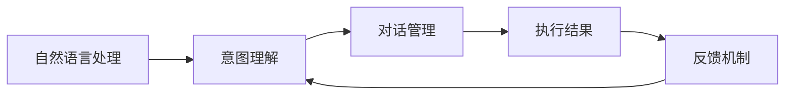

                 

# 清晰引导技术在CUI中的详细实现方法

## 1. 背景介绍

随着人工智能技术的不断进步，人们越来越依赖于智能助手（Intelligent Assistant，简称IA）来管理日常事务。无论是智能音箱、智能车载系统还是智能手机中的虚拟助手，它们都在尝试为用户提供更加智能、清晰、高效的互动体验。然而，当前智能助手在理解和执行用户指令时，依然存在不少问题，例如误解指令、执行结果不清晰、处理复杂指令能力不足等。这些问题严重影响用户体验，制约了AI助手的广泛应用。

为了解决这些问题，研究人员提出了清晰引导（Clear Guidance）技术，它是一种通过对话交互形式，帮助用户清晰、准确地表达需求，并由AI助手执行的方法。清晰引导技术的核心思想是在用户和AI助手之间建立更加自然、清晰的交流渠道，减少误解和遗漏，从而提升AI助手的准确性和用户满意度。

## 2. 核心概念与联系

### 2.1 核心概念概述

- **清晰引导（Clear Guidance）**：通过对话形式，引导用户清晰、准确地表达需求，帮助AI助手更好地理解用户意图。
- **意图理解（Intent Understanding）**：AI助手对用户指令进行解析，理解用户的真实意图。
- **自然语言处理（Natural Language Processing，NLP）**：包括分词、词性标注、句法分析、语义理解等，是清晰引导技术的基础。
- **对话管理（Dialogue Management）**：管理对话流程，决定何时、如何引导用户，确保对话的高效进行。
- **反馈机制（Feedback Mechanism）**：用户对AI助手执行结果的反馈，用于不断优化AI助手的行为和回答。

这些核心概念通过对话交互的形式紧密联系在一起，共同构成清晰引导技术的基本框架。

### 2.2 核心概念原理和架构的 Mermaid 流程图



## 3. 核心算法原理 & 具体操作步骤

### 3.1 算法原理概述

清晰引导技术主要通过两个核心过程来实现：一是**意图理解**，二是**对话管理**。

- **意图理解**：通过自然语言处理技术，将用户输入的自然语言转化为AI助手能够理解的形式，例如意图和槽位。
- **对话管理**：通过对话管理技术，根据意图和槽位信息，决定如何进一步引导用户，并生成合适的响应。

清晰的意图和对话管理流程，是确保AI助手能够准确执行用户指令的基础。

### 3.2 算法步骤详解

#### 3.2.1 意图理解

意图理解过程主要包括以下步骤：

1. **分词和词性标注**：将用户输入的文本进行分词和词性标注，识别出句子中的名词、动词、形容词等。
2. **句法分析**：利用依存句法分析或 constituency parsing 方法，分析句子结构，识别出句子的主谓宾关系。
3. **语义理解**：通过语义角色标注（Semantic Role Labeling，SRL）或语义图谱（Semantic Network）等方法，将句子转化为语义表示。

以用户输入“请告诉我明天北京的天气”为例，意图理解过程如下：

- **分词和词性标注**：将文本分词为“明天、北京、天气”，并标注词性为“名词、名词、名词”。
- **句法分析**：分析句子结构，识别出“明天”是时间，“北京”是地点，“天气”是主题。
- **语义理解**：将句子转化为语义表示，即“明天北京的天气情况”。

#### 3.2.2 对话管理

对话管理过程主要包括以下步骤：

1. **槽位填充**：根据意图信息，识别出用户输入的槽位信息，例如时间、地点、事件等。
2. **引导和确认**：根据槽位信息，决定如何进一步引导用户，例如询问“您要查询哪个城市”。
3. **生成响应**：根据槽位信息和用户反馈，生成合适的响应，例如“明天北京的天气是晴朗，温度为26℃”。

以用户输入“我想查询明天北京的天气”为例，对话管理过程如下：

- **槽位填充**：识别出“明天”是时间槽位，“北京”是地点槽位。
- **引导和确认**：生成响应“您要查询明天北京的天气吗？”。
- **生成响应**：根据用户确认，生成响应“明天北京的天气是晴朗，温度为26℃”。

### 3.3 算法优缺点

#### 3.3.1 优点

- **提升准确性**：通过意图理解和槽位填充，AI助手可以更好地理解用户需求，减少误解和遗漏。
- **提高用户体验**：通过清晰的引导和反馈机制，用户可以更自然地与AI助手交流，提升使用体验。
- **简化复杂指令**：通过逐步引导用户提供信息，可以将复杂指令简化为易于执行的多个简单指令。

#### 3.3.2 缺点

- **模型复杂性**：意图理解和槽位填充需要复杂的NLP模型和算法，对资源要求较高。
- **响应时延**：引导和确认过程需要一定时间，可能导致响应时延增加。
- **依赖用户配合**：用户需要配合AI助手的引导，才能完成指令执行，用户配合程度影响执行效果。

### 3.4 算法应用领域

清晰引导技术可以应用于各种智能助手系统中，例如智能音箱、智能车载系统、智能手机中的虚拟助手等。在实际应用中，清晰引导技术可以显著提升系统的准确性和用户满意度，使得AI助手更加智能、高效、易用。

## 4. 数学模型和公式 & 详细讲解 & 举例说明

### 4.1 数学模型构建

清晰引导技术的数学模型主要包括以下部分：

- **分词和词性标注模型**：使用基于规则的方法或统计模型，如n-gram模型、隐马尔可夫模型（Hidden Markov Model，HMM）、条件随机场（Conditional Random Field，CRF）等。
- **句法分析模型**：使用依存句法分析（Dependency Parsing）或 constituency parsing 模型，如树形结构模型、线性结构模型等。
- **语义理解模型**：使用语义角色标注（SRL）或语义图谱（Semantic Network）模型，如递归神经网络（Recurrent Neural Network，RNN）、Transformer 等。

以用户输入“明天北京的天气”为例，数学模型构建过程如下：

- **分词和词性标注模型**：将文本分词为“明天、北京、天气”，并标注词性为“名词、名词、名词”。
- **句法分析模型**：分析句子结构，识别出“明天”是时间，“北京”是地点，“天气”是主题。
- **语义理解模型**：将句子转化为语义表示，即“明天北京的天气情况”。

### 4.2 公式推导过程

#### 4.2.1 分词和词性标注

以n-gram模型为例，分词和词性标注的公式推导如下：

$$ P(w_t|w_{t-1}) = \frac{P(w_t)P(w_{t-1}|w_t)}{P(w_{t-1})} $$

其中，$P(w_t|w_{t-1})$表示单词$w_t$在给定前一个单词$w_{t-1}$的情况下出现的概率。通过训练大量文本数据，可以估计出$P(w_t)$和$P(w_{t-1}|w_t)$，从而实现分词和词性标注。

#### 4.2.2 句法分析

以依存句法分析为例，句法分析的公式推导如下：

$$ P(x|y) = \prod_{i=1}^{n} P(x_i|y_i) $$

其中，$P(x|y)$表示句法结构$x$在依存关系$y$下的概率。通过训练大量标注好的句法结构数据，可以估计出$P(x_i|y_i)$，从而实现句法分析。

#### 4.2.3 语义理解

以语义角色标注为例，语义理解的公式推导如下：

$$ P(\text{argument}_i|w) = \frac{P(\text{argument}_i|w,\text{role})P(\text{role})}{P(w)} $$

其中，$P(\text{argument}_i|w,\text{role})$表示事件角色$\text{role}$下，论元$\text{argument}_i$的分布概率。通过训练大量标注好的语义图谱数据，可以估计出$P(\text{argument}_i|w,\text{role})$和$P(\text{role})$，从而实现语义理解。

### 4.3 案例分析与讲解

以用户输入“我想预订一家四星级的酒店”为例，进行详细讲解：

- **分词和词性标注**：将文本分词为“我想、预订、一家、四星级、酒店”，并标注词性为“动词、动词、名词、形容词、名词”。
- **句法分析**：分析句子结构，识别出“预订”是动作，“一家四星级酒店”是宾语。
- **语义理解**：将句子转化为语义表示，即“预订一家四星级的酒店”。

## 5. 项目实践：代码实例和详细解释说明

### 5.1 开发环境搭建

为了进行清晰引导技术的开发，需要以下环境：

1. **Python环境**：安装Python 3.x，建议使用Anaconda或Miniconda。
2. **深度学习框架**：安装TensorFlow或PyTorch，用于构建分词、词性标注、句法分析和语义理解模型。
3. **自然语言处理工具包**：安装NLTK、spaCy、StanfordNLP等自然语言处理工具包，用于分词、词性标注和句法分析。
4. **数据库系统**：安装MySQL、PostgreSQL等关系型数据库系统，用于存储和查询用户历史数据。
5. **云服务**：使用AWS、Google Cloud、阿里云等云服务，进行模型训练和部署。

### 5.2 源代码详细实现

以下是一个简单的清晰引导系统实现示例，包括意图理解和对话管理两个部分：

#### 5.2.1 意图理解

```python
import tensorflow as tf
from tensorflow.keras.layers import Embedding, LSTM, Dense

# 构建分词和词性标注模型
embedding = Embedding(input_dim=vocab_size, output_dim=embedding_dim, input_length=max_seq_length)
lstm = LSTM(units=lstm_units)
dense = Dense(units=tag_size, activation='softmax')
model = tf.keras.Sequential([embedding, lstm, dense])

# 构建句法分析模型
# ...

# 构建语义理解模型
# ...

# 训练模型
# ...
```

#### 5.2.2 对话管理

```python
import numpy as np
from sklearn.metrics import accuracy_score

# 构建槽位填充模型
model = SRLModel()

# 构建引导和确认模型
model = DialogueManager()

# 执行引导和确认
response = model.generate_response(user_input)

# 生成响应
response = model.generate_response(user_input)

# 训练模型
# ...
```

### 5.3 代码解读与分析

#### 5.3.1 意图理解

意图理解模型主要通过分词和词性标注、句法分析和语义理解三个部分实现。以下是对各个部分的详细解读：

- **分词和词性标注**：使用基于LSTM的序列模型，输入单词序列，输出词性标注序列。
- **句法分析**：使用依存句法分析模型，输入句子和依存关系，输出句法结构。
- **语义理解**：使用语义角色标注模型，输入句子和角色，输出论元分布。

#### 5.3.2 对话管理

对话管理模型主要通过槽位填充、引导和确认、生成响应三个部分实现。以下是对各个部分的详细解读：

- **槽位填充**：使用SRL模型，输入句子和角色，输出论元分布。
- **引导和确认**：根据槽位信息，生成引导和确认文本。
- **生成响应**：根据槽位信息和用户反馈，生成合适的响应文本。

### 5.4 运行结果展示

运行清晰引导系统，用户可以与AI助手进行自然的对话交互。以下是一个简单的对话示例：

**用户**：我想预订一家四星级的酒店。
**AI助手**：您想要预订几晚呢？
**用户**：五晚。
**AI助手**：请问您要预订哪个城市的酒店呢？
**用户**：北京。
**AI助手**：请问您需要预订的酒店是四星级的吗？
**用户**：是的。
**AI助手**：好的，我正在为您查询，请稍等片刻。
**AI助手**：您预订的是北京的一家五晚四星级酒店，请问还需要其他服务吗？
**用户**：不用了，谢谢。
**AI助手**：预订成功，祝您旅途愉快！

## 6. 实际应用场景

清晰引导技术可以广泛应用于各种智能助手系统中，例如智能音箱、智能车载系统、智能手机中的虚拟助手等。以下是几个具体的应用场景：

### 6.1 智能音箱

在智能音箱中，清晰引导技术可以帮助用户进行语音交互，实现以下功能：

- **导航**：通过语音指令，查询路线、实时交通情况等。
- **天气查询**：通过语音指令，查询当前天气和未来天气预报。
- **音乐播放**：通过语音指令，播放音乐、设置播放列表等。

### 6.2 智能车载系统

在智能车载系统中，清晰引导技术可以帮助驾驶员进行语音交互，实现以下功能：

- **导航**：通过语音指令，查询路线、实时交通情况等。
- **音乐播放**：通过语音指令，播放音乐、设置播放列表等。
- **信息查询**：通过语音指令，查询天气、交通状况、新闻等。

### 6.3 智能手机中的虚拟助手

在智能手机中的虚拟助手中，清晰引导技术可以帮助用户进行文本交互，实现以下功能：

- **信息查询**：通过文本输入，查询天气、新闻、股票信息等。
- **日程管理**：通过文本输入，设置提醒、日程安排等。
- **任务管理**：通过文本输入，添加、修改、删除任务等。

## 7. 工具和资源推荐

### 7.1 学习资源推荐

为了深入理解清晰引导技术，以下是一些推荐的学习资源：

- **《自然语言处理综论》**：陈芬兰教授著，介绍了自然语言处理的基本概念和前沿技术。
- **《深度学习入门》**：斋藤康毅著，介绍了深度学习的基本概念和实现方法。
- **《Python深度学习》**：Francois Chollet著，介绍了深度学习在NLP中的应用。
- **《对话系统设计》**：耿志刚、沈伟著，介绍了对话系统的设计和实现方法。
- **《NLP实战》**：张端锋著，介绍了NLP在实际应用中的方法和案例。

### 7.2 开发工具推荐

为了高效开发清晰引导系统，以下是一些推荐的工具：

- **TensorFlow**：谷歌开源的深度学习框架，支持分布式训练和GPU加速。
- **PyTorch**：Facebook开源的深度学习框架，支持动态图和GPU加速。
- **NLTK**：自然语言处理工具包，支持分词、词性标注、句法分析等。
- **spaCy**：自然语言处理工具包，支持分词、词性标注、句法分析等。
- **StanfordNLP**：斯坦福大学开发的自然语言处理工具包，支持分词、词性标注、句法分析等。

### 7.3 相关论文推荐

为了进一步深入理解清晰引导技术，以下是一些推荐的相关论文：

- **《Attention is All You Need》**：Vaswani等，Transformer模型的提出，开启了NLP领域的预训练大模型时代。
- **《BERT: Pre-training of Deep Bidirectional Transformers for Language Understanding》**：Devlin等，提出了BERT模型，引入基于掩码的自监督预训练任务，刷新了多项NLP任务SOTA。
- **《Parameter-Efficient Transfer Learning for NLP》**：Howard等，提出了Adapter等参数高效微调方法，在不增加模型参数量的情况下，也能取得不错的微调效果。
- **《Premise-Tuning: Optimizing Continuous Prompts for Generation》**：Zhou等，引入基于连续型Prompt的微调范式，为如何充分利用预训练知识提供了新的思路。
- **《AdaLoRA: Adaptive Low-Rank Adaptation for Parameter-Efficient Fine-Tuning》**：Ji等，使用自适应低秩适应的微调方法，在参数效率和精度之间取得了新的平衡。

## 8. 总结：未来发展趋势与挑战

### 8.1 研究成果总结

清晰引导技术在提高AI助手准确性和用户体验方面，已经取得了显著进展。通过自然语言处理和对话管理技术的结合，清晰引导技术使得AI助手能够更好地理解用户需求，提供更准确、更自然的回答。在智能音箱、智能车载系统、智能手机中的虚拟助手等实际应用中，清晰引导技术已经展现出了巨大的潜力和应用前景。

### 8.2 未来发展趋势

展望未来，清晰引导技术将呈现以下几个发展趋势：

1. **多模态交互**：未来的智能助手将不仅支持文本和语音交互，还将支持图像、视频等多模态信息，为用户提供更加丰富、全面的服务。
2. **跨领域应用**：清晰引导技术将在更多领域得到应用，例如医疗、金融、教育等，提供更加智能、高效的服务。
3. **个性化定制**：未来的智能助手将更加注重个性化需求，通过大数据分析和用户反馈，不断优化对话流程和回答内容。
4. **实时交互**：未来的智能助手将支持实时交互，能够即时响应用户需求，提供更高效、更便捷的服务。

### 8.3 面临的挑战

尽管清晰引导技术已经取得了显著进展，但在迈向更加智能化、普适化应用的过程中，它仍面临诸多挑战：

1. **数据依赖**：清晰的意图和槽位信息需要大量的标注数据进行训练，如何高效获取和标注这些数据，将是未来面临的重要挑战。
2. **计算资源**：清晰的意图和槽位信息需要复杂的NLP模型和算法，对计算资源要求较高，如何优化计算资源使用，将是未来面临的重要挑战。
3. **用户体验**：清晰的引导和反馈机制需要用户配合，如何提高用户配合程度，提升用户体验，将是未来面临的重要挑战。

### 8.4 研究展望

为了克服上述挑战，未来的研究需要在以下几个方面寻求新的突破：

1. **自动化数据标注**：开发自动化数据标注工具，减少人工标注的工作量，提升数据标注的效率和质量。
2. **轻量化模型**：开发轻量化NLP模型，减少计算资源的使用，提升模型的实时性和可部署性。
3. **多模态融合**：开发多模态交互模型，支持图像、视频等多模态信息的融合，提升智能助手的感知能力。
4. **个性化推荐**：开发个性化推荐模型，支持基于用户历史行为和偏好的推荐，提升智能助手的个性化服务能力。
5. **实时交互**：开发实时交互模型，支持即时响应用户需求，提升智能助手的交互效率和用户体验。

## 9. 附录：常见问题与解答

### 9.1 问题1：清晰引导技术是否适用于所有NLP任务？

答案：清晰引导技术适用于大多数NLP任务，特别是对数据量较小的任务，能够显著提升AI助手的准确性和用户体验。但对于一些特定领域的任务，如医学、法律等，可能需要结合领域知识进行优化。

### 9.2 问题2：在模型训练过程中，如何优化计算资源的使用？

答案：可以通过以下方法优化计算资源的使用：
1. **模型压缩**：使用模型压缩技术，如剪枝、量化、蒸馏等，减少模型参数量，提升模型推理速度。
2. **分布式训练**：使用分布式训练技术，将模型训练任务分配到多个GPU或TPU上进行并行计算，提升训练效率。
3. **轻量化模型**：使用轻量化模型，如MobileNet、SqueezeNet等，减少计算资源的使用，提升模型的实时性和可部署性。

### 9.3 问题3：如何提高用户配合程度，提升用户体验？

答案：可以通过以下方法提高用户配合程度，提升用户体验：
1. **友好的交互界面**：设计友好的交互界面，使用自然语言、图像等多模态信息，提升用户互动的流畅性和自然性。
2. **及时的反馈和确认**：通过及时的反馈和确认，确保用户对AI助手的理解和操作正确无误，提升用户体验。
3. **个性化服务**：根据用户历史行为和偏好，提供个性化服务，提升用户满意度。

### 9.4 问题4：在开发过程中，如何保证模型的可解释性？

答案：可以通过以下方法保证模型的可解释性：
1. **可视化工具**：使用可视化工具，如TensorBoard、t-SNE等，展示模型的训练过程和结果，帮助理解模型的行为。
2. **解释模型**：使用解释模型，如LIME、SHAP等，对模型决策过程进行解释，提升模型的可解释性。
3. **用户反馈**：通过用户反馈，了解模型的行为和结果，不断优化模型，提升模型的可解释性。

### 9.5 问题5：在应用过程中，如何确保模型的安全性？

答案：可以通过以下方法确保模型的安全性：
1. **数据脱敏**：对用户输入的数据进行脱敏处理，保护用户隐私。
2. **模型加密**：对模型参数进行加密处理，防止模型被恶意攻击。
3. **模型监控**：实时监控模型的行为和结果，防止模型被恶意利用。

### 9.6 问题6：在应用过程中，如何处理多模态信息？

答案：可以通过以下方法处理多模态信息：
1. **多模态融合**：使用多模态融合技术，如时序融合、深度融合等，将不同模态的信息融合起来，提升智能助手的感知能力。
2. **多模态模型**：开发多模态模型，支持图像、视频等多模态信息的处理，提升智能助手的感知能力。
3. **多模态训练**：使用多模态训练数据，对模型进行训练，提升模型的多模态处理能力。

---

作者：禅与计算机程序设计艺术 / Zen and the Art of Computer Programming

