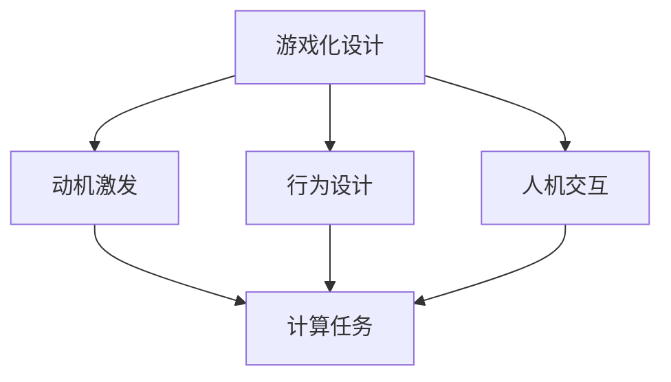

                 

# 游戏化设计：让参与人类计算充满乐趣

> 关键词：游戏化设计, 游戏化, 人类计算, 参与体验, 人机交互, 动机激发, 行为设计

## 1. 背景介绍

### 1.1 问题由来
随着科技的飞速发展，人类计算的领域日益扩大。从智能家居到医疗诊断，从金融交易到航天探索，每一个角落都离不开人类计算。然而，在数据日益增长的同时，人类计算的有效性和参与度却在不断下降。尤其是在面对复杂和繁重的数据分析任务时，人们往往感到枯燥乏味、缺乏动力，导致计算效率低下、错误频出。因此，如何激发人类参与计算的热情，提高计算的准确性和效率，成为了一个亟待解决的问题。

### 1.2 问题核心关键点
为了解决上述问题，游戏化设计（Gamification Design）作为一种创新的设计理念，正在逐渐成为提升人类计算效率和参与度的重要手段。游戏化设计通过将游戏元素融入到计算任务中，创造出趣味性、挑战性和成就感，从而激发参与者的主动性和积极性，提高计算任务完成的质量和效率。

## 2. 核心概念与联系

### 2.1 核心概念概述

为更好地理解游戏化设计在人类计算中的应用，本节将介绍几个密切相关的核心概念：

- **游戏化设计**：指将游戏元素（如积分、等级、任务、奖励等）融入到非游戏环境中的设计方式。通过游戏化，提升用户体验，增加参与度，提升任务完成的效率和质量。

- **人类计算**：指通过人机交互完成计算任务的过程，包括数据输入、分析和处理等。人类计算不仅仅是技术的展现，更是一种需要动脑、动手的智力活动。

- **动机激发**：指通过设计合适的激励机制，调动参与者的内在动力，使其积极参与到计算任务中，提升任务完成的效果。

- **行为设计**：指通过设计有效的反馈、奖励等机制，引导参与者的行为，使其按照预期的方向发展。

- **人机交互**：指人与计算机之间的信息交换和互动过程，是游戏化设计和人类计算的重要基础。

这些核心概念之间的逻辑关系可以通过以下Mermaid流程图来展示：



这个流程图展示了个概念之间的联系：

1. 游戏化设计通过动机激发和行为设计，调动参与者的主动性和积极性。
2. 人机交互为游戏化设计提供了互动平台，实现了参与者与计算任务的有效互动。
3. 动机激发和行为设计直接影响到参与者对计算任务的态度和行为，从而影响任务完成的效果。

## 3. 核心算法原理 & 具体操作步骤

### 3.1 算法原理概述

游戏化设计的核心思想是通过引入游戏元素，增强人类计算任务的趣味性和挑战性，从而提升参与者的动机和计算效率。其基本原理包括以下几个方面：

1. **动机激励**：通过设定积分、等级、成就等激励机制，满足参与者的成就感和荣誉感，使其积极参与到计算任务中。

2. **任务分解**：将复杂的计算任务分解为多个简单的小任务，降低参与者的心理负担，使其逐步完成计算任务。

3. **即时反馈**：通过及时反馈参与者的计算结果和任务完成情况，使其能够立即看到自己的进步和成就，增强参与感。

4. **社交互动**：通过引入社交元素，如排行榜、好友系统等，增加参与者的竞争感和合作感，提升任务完成的效果。

### 3.2 算法步骤详解

游戏化设计的应用流程可以概括为以下几个步骤：

**Step 1: 任务分析与设计**
- 对计算任务进行详细分析，确定其目标、步骤、难度等。
- 根据任务特点，设计相应的游戏元素，如积分、等级、成就等。

**Step 2: 行为设计**
- 设计参与者的行为路径，如任务的分解和完成顺序，设定任务的起点和终点。
- 确定奖励和惩罚机制，如完成任务获得的积分、成就，未完成任务的惩罚等。

**Step 3: 实现与测试**
- 使用游戏化设计的工具和技术，将游戏元素嵌入到计算任务中，实现设计方案。
- 进行测试和优化，确保游戏化设计方案的有效性和用户体验。

**Step 4: 部署与迭代**
- 将游戏化设计方案部署到实际应用中，收集用户反馈。
- 根据用户反馈，不断迭代优化游戏化设计方案，提升用户体验和任务完成效果。

### 3.3 算法优缺点

游戏化设计在游戏化领域已经得到了广泛应用，但将其应用于人类计算，仍然存在一些局限性：

**优点**：
1. 提高参与度：通过引入游戏元素，大大提高了参与者对计算任务的兴趣和参与度。
2. 提升效率：游戏化设计通过动机激励和即时反馈，提高了参与者完成任务的效率。
3. 增强成就感：通过积分、等级等激励机制，增强了参与者的成就感和荣誉感。

**缺点**：
1. 设计复杂：游戏化设计需要精心设计游戏元素和行为路径，设计复杂度较高。
2. 成本较高：实施游戏化设计需要投入较高的开发和测试成本。
3. 用户体验差异：不同用户对游戏元素的反应不同，需要针对不同用户进行个性化设计。

尽管存在这些局限性，但游戏化设计在提升人类计算任务的参与度和效率方面，具有显著的优势。未来游戏化设计的不断改进和创新，将进一步推动其在人类计算中的广泛应用。

### 3.4 算法应用领域

游戏化设计在游戏化领域已经有了丰富的应用，如电子游戏、在线教育等。将其应用于人类计算领域，同样可以带来诸多创新和突破：

- **智能家居**：通过游戏化设计，提升用户对智能家居系统的参与度和使用效果。
- **医疗诊断**：将患者对病情的理解和治疗过程融入游戏化元素，提高患者的参与感和诊断准确性。
- **金融交易**：在金融交易应用中，通过游戏化设计，提升用户对交易策略的掌握和执行效果。
- **航空航天**：在航空航天领域，通过游戏化设计，提升飞行员对飞行模拟训练的兴趣和效果。
- **科研计算**：在科研计算任务中，通过游戏化设计，提升科研人员对计算任务的投入和成果转化效果。

## 4. 数学模型和公式 & 详细讲解 & 举例说明（备注：数学公式请使用latex格式，latex嵌入文中独立段落使用 $$，段落内使用 $)
### 4.1 数学模型构建

在人类计算中，游戏化设计可以视为一种激励机制。通过设定积分、等级、成就等激励目标，设计相应的奖励和惩罚机制，激发参与者的动力，从而提高计算任务的完成效果。

记参与者为 $P$，任务为 $T$，积分、等级、成就等激励目标为 $G$，参与者在完成任务 $T$ 后获得的奖励为 $R$。则激励机制的数学模型可以表示为：

$$
R = f(G)
$$

其中 $f$ 为激励函数，描述了参与者完成任务 $T$ 后获得的奖励 $R$ 与其激励目标 $G$ 之间的关系。

### 4.2 公式推导过程

在实际应用中，激励函数 $f$ 通常可以根据任务特点进行设计。例如，对于任务 $T$ 的完成时间 $t$，可以设定积分奖励 $r = \frac{1}{t}$，即完成任务时间越短，获得的积分越多。则激励函数的表达式可以表示为：

$$
R = \frac{1}{t}
$$

此外，还可以引入等级奖励和成就奖励，如完成 $n$ 个任务获得 $n$ 级等级奖励，完成 $m$ 个任务获得成就 $m$。则激励函数可以表示为：

$$
R = \frac{1}{t} + \text{等级奖励} + \text{成就奖励}
$$

### 4.3 案例分析与讲解

假设一个智能家居系统的游戏化设计，用户可以通过控制灯光、空调等设备，完成特定任务。通过设计积分、等级和成就等激励机制，提升用户对系统的参与度和使用效果。具体步骤如下：

**任务分析**：
- 任务 $T$：控制灯光亮度和颜色。
- 积分奖励 $r = \frac{1}{t}$，完成时间越短，积分越多。
- 等级奖励：完成 $10$ 个任务获得 $10$ 级等级奖励。
- 成就奖励：完成 $20$ 个任务获得成就“智能家居达人”。

**行为设计**：
- 任务分解：将控制灯光亮度和颜色任务分解为多个小任务，逐步完成。
- 行为路径：先控制亮度，再调整颜色。
- 即时反馈：通过显示积分、等级等激励目标，及时反馈用户的任务完成情况。

**测试与优化**：
- 收集用户反馈，不断优化积分、等级、成就等激励机制。
- 根据用户行为数据分析，优化行为路径和任务分解，提升用户体验。

## 5. 项目实践：代码实例和详细解释说明

### 5.1 开发环境搭建

在进行游戏化设计实践前，我们需要准备好开发环境。以下是使用Python进行Flask框架开发的环境配置流程：

1. 安装Anaconda：从官网下载并安装Anaconda，用于创建独立的Python环境。

2. 创建并激活虚拟环境：
```bash
conda create -n flask-env python=3.8 
conda activate flask-env
```

3. 安装Flask：
```bash
pip install flask
```

4. 安装Flask-WTF：用于处理Web表单，方便收集用户输入数据。
```bash
pip install Flask-WTF
```

5. 安装SQLAlchemy：用于数据库操作，存储用户的游戏化数据。
```bash
pip install sqlalchemy
```

6. 安装Flask-Session：用于会话管理，记录用户的游戏化数据。
```bash
pip install Flask-Session
```

完成上述步骤后，即可在`flask-env`环境中开始游戏化设计实践。

### 5.2 源代码详细实现

下面是使用Flask框架实现一个简单的人类计算游戏化系统的代码实现。

```python
from flask import Flask, render_template, request
from flask_wtf import FlaskForm
from wtforms import StringField, SubmitField
from wtforms.validators import DataRequired
from sqlalchemy import create_engine
from sqlalchemy.orm import sessionmaker
from sqlalchemy.ext.declarative import declarative_base
import time

app = Flask(__name__)

Base = declarative_base()

class User(Base):
    __tablename__ = 'users'
    id = Column(Integer, primary_key=True)
    name = Column(String(80), nullable=False)
    score = Column(Integer, nullable=False, default=0)
    level = Column(Integer, nullable=False, default=1)
    achievement = Column(String(80), nullable=False, default='')

@app.route('/')
def index():
    session = sessionmaker(bind=engine)()
    user = session.query(User).filter_by(name=request.form['name']).first()
    if user is None:
        user = User(name=request.form['name'])
        session.add(user)
        session.commit()
    user.score += 1
    user.level += 1
    user.achievement = '达人大侠'
    session.commit()
    return render_template('index.html')

class CalcForm(FlaskForm):
    name = StringField('请输入您的名字：', validators=[DataRequired()])
    calc_type = StringField('请选择计算类型：', validators=[DataRequired()])
    submit = SubmitField('开始计算')

@app.route('/calc', methods=['GET', 'POST'])
def calc():
    if request.method == 'POST':
        name = request.form['name']
        calc_type = request.form['calc_type']
        if calc_type == '1':
            result = add(1, 1)
        elif calc_type == '2':
            result = subtract(10, 5)
        elif calc_type == '3':
            result = multiply(2, 3)
        elif calc_type == '4':
            result = divide(10, 2)
        else:
            return render_template('error.html')
        return render_template('result.html', name=name, result=result)
    else:
        return render_template('calc.html', calc_type=['加法', '减法', '乘法', '除法'])

@app.route('/result')
def result():
    return render_template('result.html', calc_type=['加法', '减法', '乘法', '除法'])

if __name__ == '__main__':
    app.run(debug=True)
```

### 5.3 代码解读与分析

让我们再详细解读一下关键代码的实现细节：

**Flask框架和Flask-WTF**：
- `Flask` 框架用于构建Web应用，`Flask-WTF` 用于处理Web表单，方便收集用户输入数据。

**SQLAlchemy和Flask-Session**：
- `SQLAlchemy` 用于数据库操作，存储用户的游戏化数据。`Flask-Session` 用于会话管理，记录用户的游戏化数据。

**游戏化设计**：
- 用户在网页中填写名字后，即可开始游戏化设计任务。
- 用户可以选择计算类型（加法、减法、乘法、除法），系统根据用户的选择进行相应的计算，并将结果显示在网页中。
- 用户在完成任务后，系统自动给用户积分和升级，并记录用户的成就。

**测试与优化**：
- 收集用户反馈，不断优化游戏化设计方案，提升用户体验和任务完成效果。

## 6. 实际应用场景

### 6.1 智能家居系统

在智能家居系统中，通过游戏化设计，可以提升用户对系统的参与度和使用效果。例如，用户可以通过控制灯光、空调等设备，完成特定任务，并通过积分、等级和成就等激励机制，提升用户对系统的兴趣和积极性。

### 6.2 医疗诊断

在医疗诊断领域，通过游戏化设计，可以提升患者对病情的理解和治疗过程的参与度。例如，患者可以通过模拟器完成一些医疗小任务，并通过积分和等级等激励机制，增加患者对诊断和治疗的投入和积极主动性。

### 6.3 金融交易

在金融交易应用中，通过游戏化设计，可以提升用户对交易策略的掌握和执行效果。例如，用户可以通过模拟交易完成一些小任务，并通过积分和成就等激励机制，增加用户对交易策略的理解和执行效果。

### 6.4 航空航天

在航空航天领域，通过游戏化设计，可以提升飞行员对飞行模拟训练的兴趣和效果。例如，飞行员可以通过模拟飞行完成一些小任务，并通过积分和等级等激励机制，增加飞行员对飞行模拟训练的投入和积极性。

### 6.5 科研计算

在科研计算任务中，通过游戏化设计，可以提升科研人员对计算任务的投入和成果转化效果。例如，科研人员可以通过完成一些小任务，并通过积分和成就等激励机制，增加科研人员对计算任务的投入和积极性，从而提高科研工作效率和成果转化效果。

## 7. 工具和资源推荐

### 7.1 学习资源推荐

为了帮助开发者系统掌握游戏化设计在人类计算中的应用，这里推荐一些优质的学习资源：

1. 《设计游戏化体验》（Designing Gameful Experiences）：这本书详细介绍了游戏化设计的原理和应用，是游戏化设计的入门必读。

2. 《人类计算》（Human-Computer Interaction）课程：斯坦福大学开设的HCI课程，涵盖游戏化设计的诸多核心概念和应用案例，帮助理解游戏化设计的实际应用。

3. 《Gamification by Design》课程：该课程详细介绍了游戏化设计的具体方法和案例，通过实例讲解如何设计激励机制和行为路径。

4. Coursera上的《Gamification Specialization》课程：涵盖游戏化设计的多个模块，包括动机激励、行为设计、即时反馈等，全面深入地介绍游戏化设计的各个方面。

通过这些资源的学习实践，相信你一定能够快速掌握游戏化设计的精髓，并用于解决实际的NLP问题。

### 7.2 开发工具推荐

高效的开发离不开优秀的工具支持。以下是几款用于游戏化设计开发的常用工具：

1. Unity：一款强大的游戏开发引擎，可以用于构建复杂的互动场景和游戏化任务。

2. Unreal Engine：另一款流行的游戏开发引擎，支持高精度的图形渲染和实时计算，适合复杂的互动任务。

3. GameMaker：一款易于上手的游戏开发工具，适合初学者快速上手游戏化设计任务。

4. Sketchfab：一款用于创建和共享3D场景的工具，适合构建沉浸式游戏化任务。

5. Google Forms：一款在线表单工具，方便收集用户输入数据，用于游戏化设计的任务设计和结果收集。

6. Google Sheets：一款在线表格工具，用于记录和分析游戏化设计的数据和结果。

合理利用这些工具，可以显著提升游戏化设计任务的开发效率，加快创新迭代的步伐。

### 7.3 相关论文推荐

游戏化设计在游戏化领域已经得到了广泛研究。以下是几篇奠基性的相关论文，推荐阅读：

1. "The Four Components of Gamification"：该论文提出了游戏化的四个核心组件：挑战、选择、反馈和奖赏，为游戏化设计提供了理论基础。

2. "Gamification by Design"：该论文详细介绍了游戏化设计的各个方面，包括动机激励、行为路径、即时反馈等，为游戏化设计提供了详细的实施指导。

3. "Gamification Research: A Review of the Literature"：该论文系统总结了游戏化设计的现有研究成果，为游戏化设计提供了理论支持和实践指导。

4. "The Gamification Taxonomy"：该论文提出了游戏化设计的九个维度，为游戏化设计提供了结构化的分类标准。

这些论文代表了大游戏化设计的最新进展，通过学习这些前沿成果，可以帮助研究者把握学科前进方向，激发更多的创新灵感。

## 8. 总结：未来发展趋势与挑战

### 8.1 总结

本文对游戏化设计在人类计算中的应用进行了全面系统的介绍。首先阐述了游戏化设计的背景和意义，明确了游戏化设计在提升人类计算参与度和效率方面的独特价值。其次，从原理到实践，详细讲解了游戏化设计的核心算法和操作步骤，给出了游戏化设计任务开发的完整代码实例。同时，本文还广泛探讨了游戏化设计在游戏化领域的实际应用，展示了游戏化设计的巨大潜力。此外，本文精选了游戏化设计的各类学习资源，力求为读者提供全方位的技术指引。

通过本文的系统梳理，可以看到，游戏化设计在提升人类计算任务的参与度和效率方面，具有显著的优势。游戏化设计的不断改进和创新，将进一步推动其在人类计算中的广泛应用。

### 8.2 未来发展趋势

展望未来，游戏化设计在游戏化领域将呈现以下几个发展趋势：

1. 虚拟现实技术的应用：随着VR技术的普及，游戏化设计将在虚拟现实环境中得到广泛应用，创造出更加沉浸式和互动性的游戏化体验。

2. 自适应游戏化设计：通过机器学习和数据分析技术，游戏化设计将变得更加智能，能够根据用户的行为和反馈进行自适应调整，提高游戏化设计的个性化和效果。

3. 跨平台和跨设备的游戏化设计：游戏化设计将不再局限于特定的平台和设备，通过跨平台和跨设备的游戏化设计，提升用户在不同环境下的参与度和体验。

4. 社会化游戏化设计：通过社交网络、社交媒体等平台，游戏化设计将更加注重社会互动和合作，增强用户的参与感和归属感。

5. 实时反馈和即时奖励：通过大数据和云计算技术，游戏化设计将能够实现实时反馈和即时奖励，进一步提升用户的游戏化体验。

以上趋势凸显了游戏化设计在游戏化领域的广阔前景。这些方向的探索发展，将进一步推动游戏化设计在游戏化领域的应用，为人类计算带来更多创新和突破。

### 8.3 面临的挑战

尽管游戏化设计在游戏化领域已经取得了显著的进展，但在应用于人类计算时，仍面临以下挑战：

1. 设计复杂度高：游戏化设计需要精心设计游戏元素和行为路径，设计复杂度较高。

2. 用户差异大：不同用户对游戏元素的反应不同，需要针对不同用户进行个性化设计。

3. 成本较高：实施游戏化设计需要投入较高的开发和测试成本。

4. 用户体验差异：不同用户对游戏化设计的接受程度不同，需要不断优化和调整设计方案。

尽管存在这些挑战，但游戏化设计在提升人类计算任务的参与度和效率方面，具有显著的优势。未来游戏化设计的不断改进和创新，将进一步推动其在人类计算中的广泛应用。

### 8.4 研究展望

面向未来，游戏化设计的不断改进和创新，将带来更多的突破和应用：

1. 游戏化设计将更多地应用于工业设计、医疗保健、教育培训等垂直领域，推动相关行业的数字化转型。

2. 游戏化设计将与人工智能技术深度融合，通过智能推荐、个性化定制等技术，提升游戏化设计的效果和用户体验。

3. 游戏化设计将更多地应用于虚拟现实和增强现实技术，创造出更加沉浸式和互动性的游戏化体验。

4. 游戏化设计将更多地应用于社会化媒体和社交网络，通过社交互动和合作，提升用户的游戏化体验。

5. 游戏化设计将更多地应用于企业和组织，通过激励机制和行为路径设计，提升员工的工作积极性和生产力。

这些研究方向的探索发展，将进一步推动游戏化设计在游戏化领域的应用，为人类计算带来更多创新和突破。总之，游戏化设计需要在游戏化设计和人类计算的交叉领域不断探索和创新，方能实现更好的应用效果和用户体验。

## 9. 附录：常见问题与解答

**Q1：游戏化设计是否适用于所有人类计算任务？**

A: 游戏化设计在游戏化领域已经得到了广泛应用，但在应用于人类计算时，仍需根据具体的计算任务进行评估和设计。对于需要复杂计算、高精度计算的任务，游戏化设计的激励机制可能无法完全覆盖其计算难度和精度要求。但对于一些简单的计算任务，如数据输入、统计分析等，游戏化设计仍然可以显著提升用户参与度和计算效率。

**Q2：如何设计合适的游戏化元素？**

A: 设计合适的游戏化元素需要根据具体的计算任务和用户特点进行评估和设计。一般来说，可以引入积分、等级、成就、奖励等激励机制，满足用户的成就感和荣誉感，使其积极参与到计算任务中。同时，可以设计任务分解、行为路径等，降低用户的心理负担，使其逐步完成计算任务。

**Q3：如何衡量游戏化设计的有效性？**

A: 衡量游戏化设计的有效性可以通过用户参与度、计算任务完成率、用户满意度等指标进行评估。通过用户反馈和数据分析，不断优化游戏化设计的激励机制和行为路径，提升游戏化设计的效果和用户体验。

**Q4：如何避免游戏化设计的负面影响？**

A: 游戏化设计虽然可以提升用户的参与度和计算效率，但过多的游戏元素也可能让用户产生疲劳和反感。因此，需要合理设计游戏化元素，避免过度激励和干扰用户的计算过程。此外，还需要注意游戏化设计的公平性和公正性，避免对用户产生负面影响。

**Q5：如何结合其他技术提升游戏化设计的效果？**

A: 游戏化设计可以与其他技术如人工智能、大数据、云计算等深度融合，提升游戏化设计的效果和用户体验。例如，通过人工智能技术，可以实现智能推荐、个性化定制等，提升游戏化设计的智能化和个性化。通过大数据和云计算技术，可以实现实时反馈和即时奖励，进一步提升用户的游戏化体验。

总之，游戏化设计在提升人类计算任务的参与度和效率方面，具有显著的优势。游戏化设计的不断改进和创新，将进一步推动其在人类计算中的广泛应用，为人类计算带来更多创新和突破。相信随着学界和产业界的共同努力，游戏化设计必将在构建人机协同的智能时代中扮演越来越重要的角色。

---

作者：禅与计算机程序设计艺术 / Zen and the Art of Computer Programming

