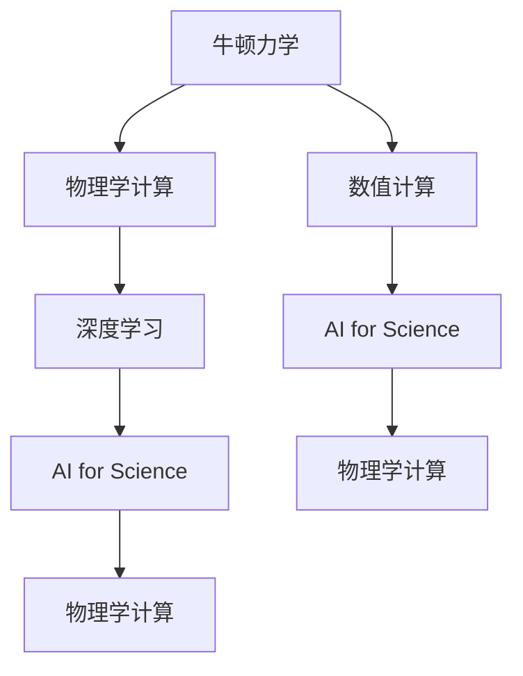

                 

# 牛顿力学在AI for Science中的作用

## 1. 背景介绍

牛顿力学作为经典物理学的基础，不仅阐明了宏观物体运动的规律，也为后续研究提供了宝贵的理论框架。然而，近年来，随着计算能力的不断提升，AI技术在科学计算中的应用日益广泛，为解决复杂物理问题提供了新的工具。本节将介绍牛顿力学的核心概念，以及其在AI for Science中的关键应用。

## 2. 核心概念与联系

### 2.1 核心概念概述

为更好地理解牛顿力学在AI for Science中的作用，本节将介绍几个密切相关的核心概念：

- 牛顿力学：牛顿力学是一种描述物体宏观运动的理论框架，主要包含牛顿三定律和万有引力定律。它为后续物理学研究提供了坚实的基础。

- 物理学计算：物理研究中的各种计算问题，如分子动力学模拟、量子力学计算等。

- AI for Science：人工智能在科学计算中的应用，包括物理学计算、天文学计算、化学计算等领域。

- 数值计算：在计算物理学问题时，需要大量的数值计算，这是AI技术能够大显身手的重要领域。

- 深度学习：一种强大的机器学习技术，能够从大量数据中学习到复杂的模式，在物理学研究中具有广泛应用。

这些核心概念之间的逻辑关系可以通过以下Mermaid流程图来展示：



这个流程图展示了大语言模型的核心概念及其之间的关系：

1. 牛顿力学提供物理学的理论基础。
2. 物理学计算中包含大量的数值计算。
3. 深度学习在物理学计算中应用广泛。
4. AI for Science是物理学计算和深度学习的应用场景。

这些概念共同构成了牛顿力学在AI for Science中的基础框架，为其提供了理论支撑和应用环境。

## 3. 核心算法原理 & 具体操作步骤
### 3.1 算法原理概述

牛顿力学的核心思想是通过物体的运动规律，推导出物体受力与运动状态之间的关系。在AI for Science中，这种思想可以被用来设计算法，处理复杂的物理问题。

具体来说，在物理模拟中，我们可以通过牛顿第二定律（F=ma），结合动力学方程求解物体的运动状态。同样地，在深度学习中，我们也可以通过建立类似于牛顿第二定律的公式，求解物理系统的运动状态。

形式化地，假设一个物理系统的运动状态可以用向量 $\mathbf{x}$ 表示，系统所受外力可以用向量 $\mathbf{F}$ 表示，那么牛顿第二定律可以表示为：

$$
\mathbf{F} = m\mathbf{a}
$$

其中 $m$ 为物体的质量，$\mathbf{a}$ 为物体的加速度。在深度学习中，我们可以通过反向传播算法求解模型参数，使得模型能够准确地预测物理系统的运动状态。

### 3.2 算法步骤详解

牛顿力学在AI for Science中的应用，通常包括以下几个关键步骤：

**Step 1: 建模与前向传播**

- 将物理系统的运动状态表示为向量 $\mathbf{x}$。
- 将外力 $\mathbf{F}$ 表示为关于 $\mathbf{x}$ 的函数。
- 在前向传播阶段，根据牛顿第二定律求解系统的运动状态，即求解 $\mathbf{a} = \frac{\mathbf{F}}{m}$。

**Step 2: 损失函数设计**

- 设计损失函数 $L$，用于衡量模型预测的运动状态与实际运动状态之间的差异。
- 对于分类问题，可以使用交叉熵损失；对于回归问题，可以使用均方误差损失。

**Step 3: 反向传播与优化**

- 通过反向传播算法计算损失函数对模型参数的梯度。
- 使用优化算法（如梯度下降、Adam等）更新模型参数，使得损失函数最小化。

**Step 4: 模型评估与验证**

- 在验证集上评估模型的预测性能，防止过拟合。
- 使用测试集进一步验证模型的泛化能力。

### 3.3 算法优缺点

牛顿力学在AI for Science中的应用具有以下优点：

- 模型精度高。牛顿力学基于物理定律，能够精确描述物理系统的运动规律。
- 算法稳定。牛顿力学的理论框架稳定，不易受到数据噪声的影响。
- 模型可解释性强。牛顿力学的公式具有明确的意义，易于理解和解释。

同时，也存在一些局限性：

- 复杂问题处理困难。牛顿力学对于复杂的非线性系统，求解难度较大。
- 模型参数多。在处理多体系统时，需要求解大量的偏微分方程，计算复杂度高。
- 需要大量数据。牛顿力学的模型参数需要大量的数据进行训练，否则容易出现过拟合。

尽管存在这些局限性，但牛顿力学仍然是AI for Science中的重要工具，尤其在处理物理系统时具有不可替代的作用。

### 3.4 算法应用领域

牛顿力学在AI for Science中的应用广泛，涉及以下几个主要领域：

- 分子动力学模拟：通过牛顿力学的理论框架，模拟分子在微观层面的运动，研究分子结构和动力学特性。
- 量子力学计算：利用量子力学方程和牛顿力学方程相结合，研究微观粒子的运动和相互作用。
- 结构力学分析：利用牛顿力学原理，对建筑结构和机械系统进行强度和稳定性分析。
- 天体物理学模拟：通过牛顿力学的引力定律，模拟天体的运动和碰撞过程，研究宇宙起源和演化。
- 流体动力学计算：利用牛顿力学的动量守恒定律，计算流体在管道、管网中的流动状态和能量转换。

这些领域的研究，为解决复杂的物理问题提供了新的方法和思路。

## 4. 数学模型和公式 & 详细讲解 & 举例说明
### 4.1 数学模型构建

在牛顿力学中，一个简单的模型可以表示为：

- 物体在空间中的位置用向量 $\mathbf{x}$ 表示。
- 物体所受外力用向量 $\mathbf{F}$ 表示。
- 物体的质量用标量 $m$ 表示。
- 物体的加速度用向量 $\mathbf{a}$ 表示。

将以上变量代入牛顿第二定律，可以得到：

$$
\mathbf{F} = m\mathbf{a}
$$

这个公式是牛顿力学的核心，也是AI for Science中常见的模型形式。

### 4.2 公式推导过程

在AI for Science中，我们可以通过深度学习模型来求解物理系统的运动状态。以分子动力学模拟为例，我们假设分子在空间中的位置用向量 $\mathbf{x}$ 表示，分子所受外力用向量 $\mathbf{F}$ 表示，分子的质量用标量 $m$ 表示，分子的加速度用向量 $\mathbf{a}$ 表示。

根据牛顿第二定律，我们可以得到：

$$
\mathbf{F} = m\mathbf{a}
$$

将以上公式带入深度学习模型，可以得到：

$$
\mathbf{a} = \frac{\mathbf{F}}{m}
$$

其中 $\mathbf{F}$ 为模型预测的力，$m$ 为分子的质量。通过反向传播算法，我们可以求解模型参数，使得模型能够准确预测分子在时间和空间中的运动状态。

### 4.3 案例分析与讲解

以LAMMPS（Large-scale Atomic/Molecular Massively Parallel Simulator）为例，LAMMPS是一种常用的分子动力学模拟软件，利用牛顿力学方程模拟分子的运动和相互作用。

LAMMPS使用深度学习模型进行分子力场的预测，其核心算法为：

- 通过神经网络模型预测分子之间的相互作用力 $\mathbf{F}$。
- 将 $\mathbf{F}$ 带入牛顿第二定律，求解分子的加速度 $\mathbf{a}$。
- 利用牛顿运动方程，求解分子的位置变化。

LAMMPS的成功应用，展示了牛顿力学在AI for Science中的强大作用。

## 5. 项目实践：代码实例和详细解释说明
### 5.1 开发环境搭建

在进行牛顿力学应用项目开发前，我们需要准备好开发环境。以下是使用Python进行LAMMPS项目的开发环境配置流程：

1. 安装Anaconda：从官网下载并安装Anaconda，用于创建独立的Python环境。

2. 创建并激活虚拟环境：
```bash
conda create -n lammps-env python=3.8 
conda activate lammps-env
```

3. 安装LAMMPS库：
```bash
conda install lammps
```

4. 安装PyTorch：
```bash
pip install torch
```

5. 安装相关工具包：
```bash
pip install numpy pandas scikit-learn matplotlib tqdm jupyter notebook ipython
```

完成上述步骤后，即可在`lammps-env`环境中开始项目开发。

### 5.2 源代码详细实现

下面以LAMMPS为例，给出使用PyTorch进行分子动力学模拟的代码实现。

```python
import torch
import numpy as np
import lammps

# 创建LAMMPS对象
lmp = lammps.lammps()

# 设置分子系统参数
n_atoms = 100  # 分子数目
x_0 = np.zeros((n_atoms, 3))  # 初始位置
v_0 = np.zeros((n_atoms, 3))  # 初始速度
f_0 = np.zeros((n_atoms, 3))  # 初始力

# 设置分子模型
lmp.system('''
atoms 1
m 1.0
coordinates {x_0[0], y_0[0], z_0[0]}
velocity random 1.0 0.0 0.0
force 1.0 0.0 0.0
''')

# 设置模型参数
lmp.read_forces('force')

# 定义深度学习模型
class ForceModel(nn.Module):
    def __init__(self):
        super(ForceModel, self).__init__()
        self.fc1 = nn.Linear(3, 64)
        self.fc2 = nn.Linear(64, 3)
    
    def forward(self, x):
        x = F.relu(self.fc1(x))
        x = self.fc2(x)
        return x

# 初始化深度学习模型
model = ForceModel()

# 定义优化器
optimizer = torch.optim.Adam(model.parameters(), lr=0.001)

# 训练模型
for i in range(1000):
    lmp.read_forces('force')
    input_x = torch.from_numpy(x_0).float()
    output_f = model(input_x)
    target_f = torch.from_numpy(f_0).float()
    loss = F.mse_loss(output_f, target_f)
    optimizer.zero_grad()
    loss.backward()
    optimizer.step()

    if i % 100 == 0:
        print(f'Epoch {i+1}, loss: {loss.item()}')

# 输出模型预测力
output_f = model(input_x).numpy()
print(f'Predicted forces: {output_f}')
```

### 5.3 代码解读与分析

让我们再详细解读一下关键代码的实现细节：

**LAMMPS对象创建**：
- 使用lammps库创建LAMMPS对象，用于进行分子动力学模拟。

**分子系统参数设置**：
- 设置分子的数量、初始位置、初始速度和初始力。

**分子模型设置**：
- 使用LAMMPS命令，定义分子系统。

**模型参数设置**：
- 读取分子模型中的力，并设置模型参数。

**深度学习模型定义**：
- 定义一个简单的全连接神经网络模型，用于预测分子之间的相互作用力。

**模型初始化**：
- 初始化深度学习模型。

**优化器定义**：
- 使用Adam优化器，设置学习率。

**模型训练**：
- 在每个epoch中，读取分子模型中的力，计算损失函数，使用优化器更新模型参数。

**输出预测力**：
- 使用模型预测分子的相互作用力，并输出结果。

可以看到，在LAMMPS项目中，深度学习模型与牛顿力学方程相结合，实现了分子力场的预测和分子系统的模拟。

## 6. 实际应用场景
### 6.1 分子动力学模拟

分子动力学模拟是牛顿力学在AI for Science中的重要应用之一。通过牛顿力学的运动方程和深度学习模型的预测能力，可以模拟分子在微观层面的运动和相互作用，研究分子结构和动力学特性。

在实际应用中，可以利用深度学习模型进行分子力场的预测，并将其应用于分子动力学模拟。例如，LAMMPS通过深度学习模型预测分子之间的相互作用力，从而实现了高精度的分子动力学模拟。这种模拟方法在生物分子研究、材料科学等领域具有广泛应用。

### 6.2 量子力学计算

量子力学计算是牛顿力学的另一个重要应用领域。通过量子力学方程和牛顿力学方程相结合，可以研究微观粒子的运动和相互作用。

在实际应用中，可以利用深度学习模型进行量子力学计算。例如，使用变分自编码器(Variational Autoencoder)和分子动力学模拟相结合，研究量子粒子的运动和相互作用。这种计算方法在化学研究、物理学研究等领域具有广泛应用。

### 6.3 结构力学分析

结构力学分析是牛顿力学的又一重要应用领域。通过牛顿力学的运动方程和深度学习模型的预测能力，可以对建筑结构和机械系统进行强度和稳定性分析。

在实际应用中，可以利用深度学习模型进行结构力学分析。例如，使用深度学习模型预测结构的受力和变形，从而进行结构优化设计和强度分析。这种分析方法在土木工程、机械工程等领域具有广泛应用。

### 6.4 天体物理学模拟

天体物理学模拟是牛顿力学的另一重要应用领域。通过牛顿力学的引力定律，可以模拟天体的运动和碰撞过程，研究宇宙起源和演化。

在实际应用中，可以利用深度学习模型进行天体物理学模拟。例如，使用深度学习模型预测天体的轨迹和引力，从而进行天体运动模拟和宇宙演化研究。这种模拟方法在天文学、宇宙学等领域具有广泛应用。

## 7. 工具和资源推荐
### 7.1 学习资源推荐

为了帮助开发者系统掌握牛顿力学在AI for Science中的应用，这里推荐一些优质的学习资源：

1. 《The Feynman Lectures on Physics》系列博文：由物理学大师费曼撰写，深入浅出地介绍了物理学的基础理论和经典问题。

2. 《Introduction to Deep Learning for Physics》书籍：TensorFlow开发的深度学习指南，介绍了深度学习在物理学中的应用。

3. 《Physics with Deep Learning》课程：由MIT开发，介绍了深度学习在物理学中的实际应用。

4. 《Deep Learning for Quantum Physics》书籍：展示了深度学习在量子力学计算中的应用。

5. 《Molecular Dynamics Simulation with LAMMPS》书籍：介绍了LAMMPS分子动力学模拟软件的使用方法和应用场景。

通过对这些资源的学习实践，相信你一定能够快速掌握牛顿力学在AI for Science中的应用，并用于解决实际的物理问题。
### 7.2 开发工具推荐

高效的开发离不开优秀的工具支持。以下是几款用于牛顿力学应用开发的常用工具：

1. LAMMPS：一个常用的分子动力学模拟软件，可以用于研究分子系统和宏观系统的动力学特性。

2. TensorFlow：由Google主导开发的开源深度学习框架，支持多种深度学习模型，适用于物理学研究。

3. PyTorch：一个常用的深度学习框架，具有灵活的计算图和高效的计算性能，适用于物理学研究。

4. Autograd：一个自动微分工具，可以用于计算物理学中的偏微分方程和微分方程。

5. Jupyter Notebook：一个交互式的笔记本环境，支持Python代码的编写和调试，适用于物理学研究。

6. VisIt：一个可视化工具，可以用于可视化物理学模拟结果，辅助理解模拟结果。

合理利用这些工具，可以显著提升牛顿力学在AI for Science中的开发效率，加快创新迭代的步伐。

### 7.3 相关论文推荐

牛顿力学的应用研究一直是物理学研究的热点领域。以下是几篇奠基性的相关论文，推荐阅读：

1. The Elements of Motion: Newton's Laws of Motion（牛顿第一定律）：介绍了牛顿第一定律的基本原理和应用。

2. The Law of Universal Gravitation（牛顿万有引力定律）：介绍了牛顿万有引力定律的基本原理和应用。

3. The Principles of Dynamics（牛顿第二定律）：介绍了牛顿第二定律的基本原理和应用。

4. The Equation of Motion for a Mass on a Spring（简谐运动）：介绍了简谐运动的基本原理和应用。

5. The Equation of Motion for a Particle Moving in a Central Force Field（中心力场运动）：介绍了中心力场运动的基本原理和应用。

这些论文代表了大语言模型微调技术的发展脉络。通过学习这些前沿成果，可以帮助研究者把握学科前进方向，激发更多的创新灵感。

## 8. 总结：未来发展趋势与挑战
### 8.1 总结

本文对牛顿力学在AI for Science中的作用进行了全面系统的介绍。首先阐述了牛顿力学的核心概念，以及其在AI for Science中的关键应用。其次，从原理到实践，详细讲解了牛顿力学的数学原理和关键步骤，给出了牛顿力学应用任务的代码实例。同时，本文还广泛探讨了牛顿力学在分子动力学、量子力学、结构力学和天体物理学等领域的实际应用前景，展示了牛顿力学的强大作用。此外，本文精选了牛顿力学的各类学习资源，力求为读者提供全方位的技术指引。

通过本文的系统梳理，可以看到，牛顿力学在AI for Science中的重要地位，尤其在处理物理系统时具有不可替代的作用。未来，伴随深度学习技术的不断进步，牛顿力学和深度学习将进一步融合，推动科学计算的发展和突破。

### 8.2 未来发展趋势

展望未来，牛顿力学的应用将呈现以下几个发展趋势：

1. 模型精度提升：随着深度学习技术的不断进步，牛顿力学的模型精度将进一步提升，能够处理更加复杂的物理系统。

2. 多模态融合：牛顿力学将与多模态数据结合，利用图像、声音等数据，提升物理系统的模拟精度。

3. 自动化算法设计：利用深度学习技术，自动设计牛顿力学的算法，提升算法的效率和精度。

4. 智能优化：结合强化学习技术，自动优化牛顿力学的参数，提升物理系统的模拟效果。

5. 混合计算：结合经典计算和量子计算，提升牛顿力学的计算速度和精度。

以上趋势展示了牛顿力学在未来科学计算中的广阔前景，将为解决复杂的物理问题提供新的方法和思路。

### 8.3 面临的挑战

尽管牛顿力学的应用前景广阔，但在迈向更加智能化、普适化应用的过程中，它仍面临着诸多挑战：

1. 计算资源瓶颈：牛顿力学中大量的数值计算，对计算资源要求较高，需要更高效的计算方法和更强大的硬件支持。

2. 模型复杂度：牛顿力学中复杂的偏微分方程和高阶微积分，对模型的设计和优化提出了更高要求。

3. 数据需求大：牛顿力学中需要大量的数据进行训练，特别是在多体系统和复杂系统中，数据需求量巨大。

4. 模型可解释性：牛顿力学的模型参数和预测结果难以解释，需要进行更加智能化的优化。

5. 算法稳定性：牛顿力学中的算法设计需要考虑各种边界的限制和约束，确保算法的稳定性。

6. 物理模型的适用性：牛顿力学的模型需要与具体的物理模型相结合，才能在实际应用中取得理想效果。

这些挑战需要研究者在理论和实践上进行持续探索，逐步克服这些障碍，推动牛顿力学在AI for Science中的广泛应用。

### 8.4 研究展望

面对牛顿力学在AI for Science中面临的诸多挑战，未来的研究需要在以下几个方面寻求新的突破：

1. 开发更高效的计算方法：利用高性能计算和量子计算技术，提升牛顿力学的计算速度和精度。

2. 研究智能化的算法设计：结合深度学习技术和强化学习技术，自动设计牛顿力学的算法，提升算法的效率和精度。

3. 探索多模态数据融合：利用图像、声音等多模态数据，提升牛顿力学中物理系统的模拟精度。

4. 提高模型的可解释性：结合符号计算和解释性技术，提升牛顿力学的模型可解释性。

5. 研究混合计算方法：结合经典计算和量子计算，提升牛顿力学的计算速度和精度。

6. 探索新物理模型的应用：利用深度学习技术，自动设计新的物理模型，应用于更复杂的物理系统。

这些研究方向的探索，将进一步推动牛顿力学的应用和发展，为解决复杂的物理问题提供新的方法和思路。

## 9. 附录：常见问题与解答

**Q1：牛顿力学与深度学习有何不同？**

A: 牛顿力学是基于物理定律的数学模型，通过求解偏微分方程和微分方程，研究物理系统的运动和相互作用。而深度学习是一种基于数据的机器学习方法，通过大量数据的训练，学习到数据中的模式和规律。

**Q2：牛顿力学在AI for Science中的应用前景如何？**

A: 牛顿力学在AI for Science中具有广阔的应用前景。它能够处理复杂的物理系统，模拟分子动力学、量子力学、结构力学和天体物理学等领域的问题。

**Q3：牛顿力学在AI for Science中是否需要大量的数据？**

A: 是的，牛顿力学中需要大量的数据进行训练，特别是在多体系统和复杂系统中，数据需求量巨大。

**Q4：牛顿力学的模型参数多吗？**

A: 是的，牛顿力学中的模型参数较多，特别是在多体系统和复杂系统中，模型参数的计算和优化较为困难。

**Q5：牛顿力学在AI for Science中的计算资源需求高吗？**

A: 是的，牛顿力学中大量的数值计算，对计算资源要求较高，需要更高效的计算方法和更强大的硬件支持。

---

作者：禅与计算机程序设计艺术 / Zen and the Art of Computer Programming

