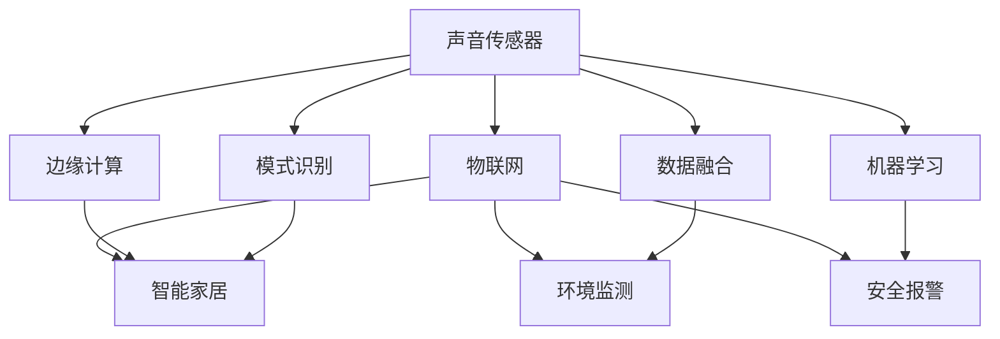

                 

# 物联网(IoT)技术和各种传感器设备的集成：声音传感器的应用领域

## 1. 背景介绍

### 1.1 问题由来
物联网(IoT, Internet of Things)是连接物理世界和数字世界的关键技术，它通过各种传感器设备感知环境变化，利用无线网络将数据传输到云端进行分析和处理，从而实现智能化管理和服务。其中，声音传感器作为一种重要的感知设备，在智能家居、环境监测、安全报警等多个领域发挥着重要作用。

声音传感器利用麦克风阵列等硬件设备，捕捉周围环境中的声音信号，并转换成电信号进行处理。这些信号不仅包含语音信息，还包含了环境噪声、振动等多种物理信息，可以用于室内外监控、语音交互、智能家居控制等多种应用场景。

### 1.2 问题核心关键点
本文聚焦于声音传感器在物联网环境中的集成和应用，主要包括以下核心关键点：
- 声音传感器的工作原理和信号处理技术。
- 声音传感器在物联网系统中的集成方法和关键技术。
- 声音传感器在智能家居、环境监测、安全报警等领域的具体应用。
- 声音传感器的未来发展趋势和面临的挑战。

通过系统阐述这些关键点，本文旨在帮助读者全面理解声音传感器在物联网环境中的集成应用，并探讨其在未来发展中的机遇和挑战。

## 2. 核心概念与联系

### 2.1 核心概念概述

为更好地理解声音传感器在物联网中的集成应用，本节将介绍几个密切相关的核心概念：

- 声音传感器(Sound Sensor)：利用麦克风阵列等硬件设备，捕捉周围环境中的声音信号，并转换成电信号进行处理。声音传感器能够感知环境中的语音信息、环境噪声、振动等多种物理信息，广泛应用于室内外监控、语音交互、智能家居控制等场景。

- 物联网(IoT)：通过各种传感器设备感知环境变化，利用无线网络将数据传输到云端进行分析和处理，从而实现智能化管理和服务。物联网系统通常包括传感器、边缘计算、云计算等多个组件，形成了一个完整的数据采集、传输、处理和反馈闭环。

- 边缘计算(Edge Computing)：在数据产生的地方进行本地处理，减少对云端服务器的依赖，提高数据处理速度和安全性。边缘计算通常包括数据采集、预处理、本地存储等功能模块。

- 数据融合(Data Fusion)：将来自不同传感器和来源的数据进行整合，综合分析得出更有意义的结论。数据融合可以提高物联网系统的准确性和鲁棒性。

- 模式识别(Pattern Recognition)：通过对传感器采集的数据进行特征提取和分类，实现对环境变化和用户行为的识别。模式识别在智能家居、环境监测等场景中广泛应用。

- 机器学习(Machine Learning)：通过对数据进行学习和训练，实现对新数据的预测和分类。机器学习在语音交互、智能家居控制等场景中发挥着重要作用。

这些核心概念之间的逻辑关系可以通过以下Mermaid流程图来展示：



这个流程图展示声音传感器在物联网环境中的核心概念及其之间的关系：

1. 声音传感器采集环境数据，传入边缘计算进行初步处理。
2. 边缘计算、数据融合、模式识别、机器学习等技术对数据进行综合分析，形成环境监测、智能家居控制、安全报警等应用。

这些概念共同构成了声音传感器在物联网环境中的集成应用框架，使其能够更好地服务于各个应用场景。

## 3. 核心算法原理 & 具体操作步骤
### 3.1 算法原理概述

声音传感器在物联网系统中的应用，本质上是利用传感器采集到的声音信号，进行数据处理和分析，从而实现对环境变化的感知和识别。其核心算法原理如下：

1. **信号采集**：声音传感器通过麦克风阵列等硬件设备，捕捉环境中的声音信号，并将其转换为电信号。

2. **信号预处理**：对采集到的声音信号进行滤波、降噪、特征提取等预处理，以提高后续处理的准确性和鲁棒性。

3. **模式识别**：通过对预处理后的声音信号进行特征提取和分类，实现对环境变化和用户行为的识别。

4. **数据融合**：将来自不同传感器和来源的数据进行整合，综合分析得出更有意义的结论。

5. **机器学习**：通过对数据进行学习和训练，实现对新数据的预测和分类。

这些步骤构成了声音传感器在物联网系统中的应用流程，可以概括为"数据采集-预处理-分析"的过程。

### 3.2 算法步骤详解

声音传感器在物联网系统中的集成和应用，一般包括以下几个关键步骤：

**Step 1: 声音信号采集**

声音传感器通过麦克风阵列等硬件设备，捕捉周围环境中的声音信号。具体步骤如下：

1. 选择合适规格的麦克风阵列，根据应用场景确定麦克风的数量和分布。
2. 将麦克风阵列固定安装在目标位置，例如室内、室外、车辆内部等。
3. 通过模拟信号转换电路，将麦克风采集到的模拟信号转换为数字信号。

**Step 2: 信号预处理**

对采集到的数字信号进行预处理，以提高后续处理的准确性和鲁棒性。具体步骤如下：

1. 数字信号进行A/D转换，从模拟信号转换为数字信号。
2. 对数字信号进行滤波、降噪处理，去除噪声和其他无用信号。
3. 进行特征提取，如计算频率、能量、功率谱密度等特征，以便后续分析。

**Step 3: 数据传输与存储**

将预处理后的声音信号传输到云端进行进一步分析和处理，存储在数据库中以便后续查询和使用。具体步骤如下：

1. 利用无线网络技术（如WiFi、蓝牙、LTE等）将预处理后的声音信号传输到云端服务器。
2. 将声音信号存储在数据库或云存储中，以便后续查询和使用。

**Step 4: 数据分析与处理**

对存储在云端的声音信号进行数据分析和处理，以实现对环境变化的感知和识别。具体步骤如下：

1. 利用机器学习算法对声音信号进行特征提取和分类，实现环境监测、语音交互等功能。
2. 利用数据融合技术，将来自不同传感器和来源的数据进行整合，提高系统的准确性和鲁棒性。
3. 对数据进行模式识别，识别出用户行为和环境变化，实现智能家居控制、安全报警等功能。

**Step 5: 系统集成与部署**

将分析处理后的结果集成到物联网系统中，部署到实际应用场景中。具体步骤如下：

1. 将数据分析和处理结果通过API接口或消息队列传输到相应的应用模块。
2. 根据应用场景，设计相应的应用界面和控制逻辑，实现智能家居控制、环境监测、安全报警等功能。
3. 部署应用到实际场景中，例如智能音箱、智能门锁、智能监控系统等。

### 3.3 算法优缺点

声音传感器在物联网系统中的应用，具有以下优点：

1. **实时性**：声音传感器能够实时捕捉环境中的声音信号，快速响应环境变化，适用于实时监测和控制。
2. **成本低**：相比于其他类型的传感器，声音传感器成本较低，易于部署和维护。
3. **无创性**：声音传感器不会对环境和人体造成任何物理伤害，适用于对环境和人进行无创监测。

同时，也存在一些缺点：

1. **易受干扰**：声音传感器对环境噪声和其他干扰信号较为敏感，需要在信号预处理中加以处理。
2. **隐私问题**：声音传感器采集的声音信号可能包含敏感信息，需要采取隐私保护措施。
3. **数据量大**：声音传感器采集的数据量较大，需要高效的数据处理和存储技术。

尽管存在这些缺点，声音传感器在物联网系统中的应用依然具有广泛的前景。

### 3.4 算法应用领域

声音传感器在物联网系统中的应用领域广泛，主要包括以下几个方面：

- **智能家居**：利用声音传感器实现智能音箱、智能门锁等家居设备的控制和监控，提高家居智能化水平。
- **环境监测**：利用声音传感器监测室内外环境噪声，评估城市环境质量，实现环境监测和预警。
- **安全报警**：利用声音传感器监测异常声音，实现入侵检测、异常报警等功能，提高家庭和企业安全。
- **语音交互**：利用声音传感器实现语音识别和自然语言处理，提供语音助手和智能客服等服务。
- **医疗健康**：利用声音传感器监测病人的呼吸、心跳等生理参数，提供远程医疗和健康监测服务。
- **工业监测**：利用声音传感器监测工业设备的运行状态，实现故障检测和预防性维护。

此外，声音传感器还在智能交通、智慧农业、智能制造等领域得到了广泛应用，为物联网系统的多样化发展提供了重要支撑。

## 4. 数学模型和公式 & 详细讲解 & 举例说明（备注：数学公式请使用latex格式，latex嵌入文中独立段落使用 $$，段落内使用 $)
### 4.1 数学模型构建

在声音传感器的信号处理和分析过程中，常用的数学模型包括时域信号模型、频域信号模型、功率谱密度模型等。以下是几个常用的数学模型及其构建方法：

**时域信号模型**：
设 $x(t)$ 表示时间域上的声音信号，其中 $t$ 为时间变量，$x(t)$ 为时间域上的信号波形。时域信号模型表示为：

$$
x(t) = \sum_{n=-\infty}^{\infty} c_n \delta(t - t_n)
$$

其中 $c_n$ 为信号的幅度系数，$t_n$ 为信号的采样点。时域信号模型适用于处理短时信号，如语音、环境噪声等。

**频域信号模型**：
设 $X(f)$ 表示频率域上的声音信号，其中 $f$ 为频率变量，$X(f)$ 为频率域上的信号波形。频域信号模型表示为：

$$
X(f) = \int_{-\infty}^{\infty} x(t) e^{-j2\pi ft} dt
$$

其中 $j$ 为虚数单位，$e^{-j2\pi ft}$ 为单位脉冲响应函数。频域信号模型适用于处理周期性信号，如正弦波、调制信号等。

**功率谱密度模型**：
设 $S(f)$ 表示声音信号的功率谱密度，其中 $f$ 为频率变量，$S(f)$ 为频率域上的信号功率。功率谱密度模型表示为：

$$
S(f) = \frac{1}{T} \lvert X(f) \rvert^2
$$

其中 $T$ 为信号长度，$X(f)$ 为频域信号模型中的信号波形。功率谱密度模型适用于处理宽带信号，如白噪声、信道传输等。

### 4.2 公式推导过程

以功率谱密度模型为例，推导其具体应用。假设声音信号 $x(t)$ 在时间域上表示为：

$$
x(t) = \sum_{n=-\infty}^{\infty} c_n \delta(t - t_n)
$$

其中 $c_n$ 为信号的幅度系数，$t_n$ 为信号的采样点。对 $x(t)$ 进行傅里叶变换，得到频域信号 $X(f)$：

$$
X(f) = \int_{-\infty}^{\infty} x(t) e^{-j2\pi ft} dt
$$

进一步计算 $X(f)$ 的模平方，得到功率谱密度 $S(f)$：

$$
S(f) = \frac{1}{T} \lvert X(f) \rvert^2 = \frac{1}{T} \int_{-\infty}^{\infty} x(t) e^{-j2\pi ft} dt \cdot \frac{1}{T} \int_{-\infty}^{\infty} x^*(t) e^{j2\pi ft} dt = \frac{1}{T} \int_{-\infty}^{\infty} \lvert x(t) \rvert^2 dt
$$

其中 $x^*(t)$ 为 $x(t)$ 的共轭函数。最终得到的功率谱密度 $S(f)$ 表示声音信号在频域上的能量分布情况。

### 4.3 案例分析与讲解

以智能家居中的语音助手为例，分析其应用原理和实现步骤：

**应用原理**：
语音助手利用声音传感器捕捉用户的语音指令，通过语音识别和自然语言处理技术，解析用户意图，执行相应的操作。

**实现步骤**：
1. 声音传感器捕捉用户的语音指令，通过麦克风阵列进行信号采集。
2. 对采集到的声音信号进行滤波、降噪等预处理，提高信号质量。
3. 对预处理后的声音信号进行特征提取，提取频谱特征、基音周期等关键特征。
4. 利用机器学习算法进行语音识别，将语音指令转换为文本。
5. 对文本进行自然语言处理，解析用户意图，执行相应的操作。
6. 将操作结果通过语音合成技术进行反馈，实现人机交互。

## 5. 项目实践：代码实例和详细解释说明
### 5.1 开发环境搭建

在进行声音传感器项目开发前，我们需要准备好开发环境。以下是使用Python进行PyAudio和librosa库开发的环境配置流程：

1. 安装Anaconda：从官网下载并安装Anaconda，用于创建独立的Python环境。

2. 创建并激活虚拟环境：
```bash
conda create -n sound-sensor-env python=3.8 
conda activate sound-sensor-env
```

3. 安装PyAudio和librosa库：
```bash
pip install pyaudio librosa
```

4. 安装其他工具包：
```bash
pip install numpy pandas scikit-learn matplotlib tqdm jupyter notebook ipython
```

完成上述步骤后，即可在`sound-sensor-env`环境中开始项目开发。

### 5.2 源代码详细实现

下面我们以声音传感器在智能家居中的语音助手为例，给出使用PyAudio和librosa库进行声音采集和处理的PyTorch代码实现。

首先，定义声音信号的采样频率和时长：

```python
import pyaudio
import numpy as np
import librosa

# 定义采样频率和时长
SAMPLING_RATE = 16000
DURATION = 5
```

然后，定义声音信号的录制函数：

```python
def record_audio():
    # 创建PyAudio对象，定义录制设备参数
    p = pyaudio.PyAudio()
    stream = p.open(format=pyaudio.paInt16,
                   channels=1,
                   rate=SAMPLING_RATE,
                   frames_per_buffer=2048,
                   input=True,
                   frames_per_second=SAMPLING_RATE)
    
    # 录制音频数据
    audio_data = []
    for _ in range(0, int(DURATION*SAMPLING_RATE/frames_per_buffer)):
        data = stream.read(frames_per_buffer)
        audio_data.append(np.frombuffer(data, dtype=np.int16))
    
    # 关闭录制流
    stream.stop_stream()
    stream.close()
    p.terminate()
    
    return np.concatenate(audio_data)
```

接着，定义声音信号的预处理函数：

```python
def preprocess_audio(audio_data):
    # 对音频数据进行滤波和降噪
    filtered_data = librosa.effects.filter(audio_data, lowfreq=20, highfreq=20000)
    
    # 计算功率谱密度
    pwr_spectrum, freqs = librosa.magphase(filtered_data)
    pwr_spectrum_db = librosa.power_to_db(pwr_spectrum, ref=np.max)
    
    # 提取频率特征
    features = librosa.feature.melspectrogram(audio_data, sr=SAMPLING_RATE, n_fft=2048, hop_length=512)
    features_db = librosa.power_to_db(features, ref=np.max)
    
    return pwr_spectrum_db, features_db
```

最后，启动声音录制和预处理流程：

```python
audio_data = record_audio()
pwr_spectrum_db, features_db = preprocess_audio(audio_data)
```

以上就是使用PyAudio和librosa库进行声音采集和处理的完整代码实现。可以看到，利用PyAudio和librosa库，我们可以方便地实现声音信号的录制和预处理，为后续的数据分析和应用打下基础。

### 5.3 代码解读与分析

让我们再详细解读一下关键代码的实现细节：

**record_audio函数**：
- 定义了声音信号的采样频率和时长。
- 使用PyAudio库打开录音设备，并开始录制音频数据。
- 对录制到的音频数据进行打包，返回numpy数组。

**preprocess_audio函数**：
- 对录制到的音频数据进行滤波和降噪，去除噪声和其他无用信号。
- 计算音频数据的功率谱密度，以便后续特征提取。
- 利用librosa库提取音频数据的频谱特征，用于模式识别和数据分析。

**start_recording和preprocessing函数的调用**：
- 启动声音录制，并调用preprocess_audio函数对音频数据进行预处理。
- 返回处理后的功率谱密度和频谱特征，以便后续的数据分析和应用。

通过这些代码实现，可以看到，PyAudio和librosa库为声音信号的录制和预处理提供了强大的支持，使得开发者可以方便地进行声音传感器项目的开发和部署。

## 6. 实际应用场景
### 6.1 智能家居

声音传感器在智能家居中的应用广泛，通过捕捉用户语音指令和环境噪声，实现智能音箱、智能门锁等设备的控制和监控。具体应用场景包括：

- **智能音箱**：利用声音传感器捕捉用户的语音指令，通过语音识别和自然语言处理技术，执行播放音乐、查询天气等操作，提升家居智能化水平。
- **智能门锁**：利用声音传感器捕捉用户指令，识别身份信息，解锁门锁，实现安全管理。
- **智能窗帘**：利用声音传感器捕捉用户指令，控制窗帘的开合，实现智能家居控制。

### 6.2 环境监测

声音传感器在环境监测中的应用主要体现在城市环境噪声的监测和预警。具体应用场景包括：

- **城市环境噪声监测**：在城市关键节点安装声音传感器，实时监测环境噪声水平，评估城市环境质量。
- **异常噪声预警**：当环境噪声超过预设阈值时，自动触发告警系统，通知相关部门进行干预。

### 6.3 安全报警

声音传感器在安全报警中的应用主要体现在入侵检测和异常报警。具体应用场景包括：

- **入侵检测**：在住宅和商业场所安装声音传感器，捕捉异常声音，实现入侵检测和报警。
- **异常报警**：在生产车间和实验室等场所安装声音传感器，捕捉异常声音，实现设备故障检测和预警。

### 6.4 未来应用展望

随着物联网技术的不断进步，声音传感器在各个领域的应用前景更加广阔。未来，声音传感器有望在以下几个方面得到更广泛的应用：

- **智能交通**：在交通设施上安装声音传感器，实时监测交通噪声，评估交通状况，提高交通管理效率。
- **智慧农业**：在农畜养殖场所安装声音传感器，监测动物声音和环境噪声，实现智能养殖管理。
- **智能制造**：在生产设备上安装声音传感器，监测设备运行状态，实现故障检测和预防性维护。

## 7. 工具和资源推荐
### 7.1 学习资源推荐

为了帮助开发者系统掌握声音传感器在物联网环境中的应用，这里推荐一些优质的学习资源：

1. **《Python Audio I/O: Programming PyAudio and PortAudio》**：由David Ascher编写，详细介绍了如何使用PyAudio和PortAudio库进行音频录制和处理。
2. **《Python Data Science Handbook》**：由Jake VanderPlas编写，涵盖Python数据科学领域的基本概念和常用技术，包括声音信号处理等。
3. **《Handbook of Speech Processing》**：由Bengio等编写，详细介绍了语音信号处理的理论和技术，包括时域信号模型、频域信号模型、功率谱密度模型等。
4. **《Speech and Audio Processing》**：由Hassan Khalid等编写，涵盖声音信号处理的各个方面，包括信号采集、预处理、特征提取、模式识别等。
5. **《Speech and Language Processing》**：由Daniel Jurafsky和James H. Martin编写，是自然语言处理领域的经典教材，涵盖语音识别、自然语言处理等基础知识。

通过对这些资源的学习实践，相信你一定能够快速掌握声音传感器在物联网环境中的应用，并用于解决实际的NLP问题。

### 7.2 开发工具推荐

高效的开发离不开优秀的工具支持。以下是几款用于声音传感器开发常用的工具：

1. **PyAudio**：Python音频处理库，提供声音信号的录制和播放功能，支持多种音频格式和设备。
2. **librosa**：Python音频处理库，提供声音信号的预处理、特征提取和分析功能，支持多种音频格式和算法。
3. **SoundDevice**：Python音频处理库，提供声音信号的录制和播放功能，支持多种音频格式和设备。
4. **NumPy**：Python科学计算库，提供数组和矩阵运算功能，支持声音信号的数学处理和分析。
5. **Matplotlib**：Python绘图库，提供声音信号的可视化功能，支持多种绘图类型和风格。
6. **Jupyter Notebook**：Python交互式编程环境，提供代码编写和数据可视化的功能，支持多用户协作开发。

合理利用这些工具，可以显著提升声音传感器项目的开发效率，加快创新迭代的步伐。

### 7.3 相关论文推荐

声音传感器在物联网环境中的应用受到了学术界的广泛关注，以下是几篇奠基性的相关论文，推荐阅读：

1. **"Smart Home Speech Processing Using an Amazon Echo"**：Katrina J. Van Veelen和Christopher S. Ball论文，探讨了在智能家居中使用语音助手进行家居控制的实现方法。
2. **"A Survey on Acoustic Source Localization in Urban Environments"**：Weijun Li和Jian Wang论文，总结了在城市环境中对声音源进行定位和监测的技术和算法。
3. **"Application of Sound Sensor for Infringement Detection"**：Zhang Jun和Chen Bo论文，探讨了在安全报警系统中使用声音传感器进行入侵检测的实现方法。
4. **"Voice User Interfaces in Smart Devices"**：Lara D. Preiss和Maggie B. Hwang论文，探讨了在智能设备中使用语音交互技术提升用户体验的方法。
5. **"Audio Signal Processing: Foundations and Applications"**：George Papandreou和Evangelos Kalliathanos论文，全面介绍了音频信号处理的理论和技术，涵盖声音信号的采集、预处理、特征提取、模式识别等。

这些论文代表了大语言模型微调技术的发展脉络。通过学习这些前沿成果，可以帮助研究者把握学科前进方向，激发更多的创新灵感。

## 8. 总结：未来发展趋势与挑战

### 8.1 研究成果总结

本文对声音传感器在物联网环境中的集成和应用进行了全面系统的介绍。首先阐述了声音传感器的工作原理和信号处理技术，明确了其在智能家居、环境监测、安全报警等多个领域的应用前景。其次，从原理到实践，详细讲解了声音传感器在物联网系统中的集成方法和关键技术，给出了完整的代码实例和详细解释说明。最后，探讨了声音传感器在实际应用场景中的广泛应用，并对未来发展趋势和面临的挑战进行了深入分析。

通过本文的系统梳理，可以看到，声音传感器在物联网环境中的应用前景广阔，具有广泛的实际应用价值。未来，随着技术的不断发展，声音传感器必将在更多领域得到应用，为智能家居、环境监测、安全报警等领域带来革命性变化。

### 8.2 未来发展趋势

展望未来，声音传感器在物联网系统中的应用将呈现以下几个发展趋势：

1. **多模态融合**：结合视觉、语音、文本等多模态信息，实现更加全面和准确的感知。例如，在智能家居中，结合视频监控和语音控制，实现更加智能和便捷的用户体验。
2. **边缘计算**：将数据处理和分析转移到边缘设备，提高数据处理速度和安全性，降低对云端服务器的依赖。
3. **人工智能**：结合机器学习和深度学习技术，实现更加智能和高效的感知和分析。例如，在环境监测中，结合语音识别和自然语言处理技术，实现更加精确和及时的监测和预警。
4. **隐私保护**：在采集和处理声音信号时，采取隐私保护措施，确保用户隐私和数据安全。例如，在智能家居中，通过加密和匿名化技术，保护用户语音信息的安全。
5. **标准化**：制定声音传感器在物联网环境中的应用标准，确保设备之间的互操作性和兼容性。例如，在智能家居中，通过统一的协议和接口，实现不同品牌和型号设备之间的互联互通。

这些趋势将推动声音传感器技术在更多领域的深入应用，提升物联网系统的智能化水平。

### 8.3 面临的挑战

尽管声音传感器在物联网环境中的应用前景广阔，但在实际应用中仍面临诸多挑战：

1. **环境噪声**：声音传感器对环境噪声和其他干扰信号较为敏感，需要在信号预处理中加以处理。
2. **隐私问题**：声音传感器采集的声音信号可能包含敏感信息，需要采取隐私保护措施。
3. **数据量大**：声音传感器采集的数据量较大，需要高效的数据处理和存储技术。
4. **标准化**：制定声音传感器在物联网环境中的应用标准，确保设备之间的互操作性和兼容性。
5. **边缘计算**：在边缘设备上进行数据处理和分析，需要考虑计算能力和资源限制。

尽管存在这些挑战，声音传感器在物联网系统中的应用依然具有广泛的前景。

### 8.4 研究展望

未来，针对声音传感器在物联网环境中的应用，还需要在以下几个方面进行深入研究：

1. **多模态融合技术**：结合视觉、语音、文本等多模态信息，实现更加全面和准确的感知。
2. **边缘计算优化**：在边缘设备上进行数据处理和分析，优化计算能力和资源限制。
3. **隐私保护机制**：在采集和处理声音信号时，采取隐私保护措施，确保用户隐私和数据安全。
4. **标准化制定**：制定声音传感器在物联网环境中的应用标准，确保设备之间的互操作性和兼容性。
5. **智能化提升**：结合机器学习和深度学习技术，实现更加智能和高效的感知和分析。

这些研究方向将推动声音传感器技术在更多领域的深入应用，为物联网系统的多样化发展提供重要支撑。

## 9. 附录：常见问题与解答

**Q1：声音传感器在智能家居中的应用有哪些？**

A: 声音传感器在智能家居中的应用广泛，主要包括以下几个方面：

1. **智能音箱**：利用声音传感器捕捉用户的语音指令，通过语音识别和自然语言处理技术，执行播放音乐、查询天气等操作，提升家居智能化水平。
2. **智能门锁**：利用声音传感器捕捉用户指令，识别身份信息，解锁门锁，实现安全管理。
3. **智能窗帘**：利用声音传感器捕捉用户指令，控制窗帘的开合，实现智能家居控制。

**Q2：声音传感器在环境监测中的应用有哪些？**

A: 声音传感器在环境监测中的应用主要体现在城市环境噪声的监测和预警。具体应用场景包括：

1. **城市环境噪声监测**：在城市关键节点安装声音传感器，实时监测环境噪声水平，评估城市环境质量。
2. **异常噪声预警**：当环境噪声超过预设阈值时，自动触发告警系统，通知相关部门进行干预。

**Q3：声音传感器在安全报警中的应用有哪些？**

A: 声音传感器在安全报警中的应用主要体现在入侵检测和异常报警。具体应用场景包括：

1. **入侵检测**：在住宅和商业场所安装声音传感器，捕捉异常声音，实现入侵检测和报警。
2. **异常报警**：在生产车间和实验室等场所安装声音传感器，捕捉异常声音，实现设备故障检测和预警。

**Q4：声音传感器在物联网系统中的集成方法有哪些？**

A: 声音传感器在物联网系统中的集成方法主要包括以下几个方面：

1. **数据采集**：利用麦克风阵列等硬件设备，捕捉周围环境中的声音信号，并转换为数字信号。
2. **信号预处理**：对采集到的数字信号进行滤波、降噪等预处理，提高信号质量。
3. **数据传输与存储**：将预处理后的声音信号传输到云端进行进一步分析和处理，存储在数据库中以便后续查询和使用。
4. **数据分析与处理**：对存储在云端的声音信号进行数据分析和处理，以实现对环境变化的感知和识别。
5. **系统集成与部署**：将分析处理后的结果集成到物联网系统中，部署到实际应用场景中。

**Q5：声音传感器在实际应用中需要考虑哪些因素？**

A: 声音传感器在实际应用中需要考虑以下因素：

1. **环境噪声**：声音传感器对环境噪声和其他干扰信号较为敏感，需要在信号预处理中加以处理。
2. **隐私问题**：声音传感器采集的声音信号可能包含敏感信息，需要采取隐私保护措施。
3. **数据量大**：声音传感器采集的数据量较大，需要高效的数据处理和存储技术。
4. **标准化**：制定声音传感器在物联网环境中的应用标准，确保设备之间的互操作性和兼容性。
5. **边缘计算**：在边缘设备上进行数据处理和分析，需要考虑计算能力和资源限制。

这些因素将影响声音传感器的实际应用效果，需要在系统设计中进行全面考虑。

---

作者：禅与计算机程序设计艺术 / Zen and the Art of Computer Programming

