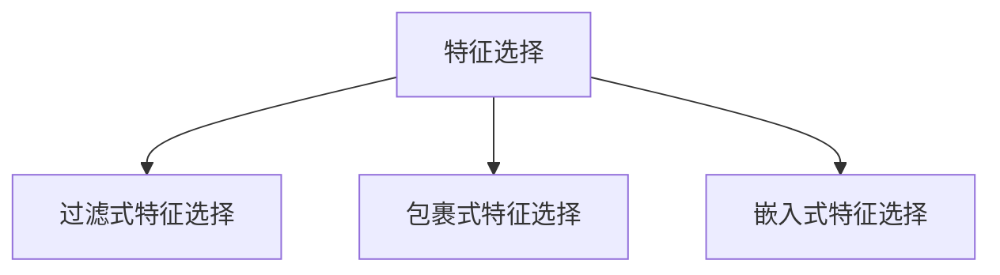

                 

## 1. 背景介绍

### 1.1 问题由来
在机器学习和数据科学领域，特征选择（Feature Selection）是一项重要的预处理步骤，它旨在从原始数据中挑选最具信息量的特征，以提高模型的性能和预测能力。随着数据量的急剧增加，如何有效地进行特征选择成为了一个挑战，尤其是对于大规模数据集和复杂模型。

### 1.2 问题核心关键点
特征选择的目的在于剔除不相关的特征，减少模型的复杂性，同时保留最重要、最有信息的特征，从而提高模型的泛化能力和解释性。当前，特征选择技术可以分为过滤式（Filter-based）、包裹式（Wrapper-based）和嵌入式（Embedded-based）三类。每种技术都有其优缺点和适用场景。

### 1.3 问题研究意义
特征选择对于提高机器学习模型的性能、降低模型复杂度、提高模型的可解释性具有重要意义。特别是在大数据时代，有效的特征选择能够显著提升模型训练速度，减少计算资源消耗，同时提高模型的泛化能力，避免过拟合。

## 2. 核心概念与联系

### 2.1 核心概念概述

为更好地理解特征选择方法，本节将介绍几个关键概念：

- **特征选择（Feature Selection）**：从原始特征集合中选择最具信息量的特征，以提高模型性能。
- **过滤式特征选择（Filter-based Feature Selection）**：先对特征进行独立评估，再基于某些准则（如相关性、信息增益）选择特征。
- **包裹式特征选择（Wrapper-based Feature Selection）**：将特征选择与模型训练相结合，通过交叉验证等技术动态选择特征。
- **嵌入式特征选择（Embedded-based Feature Selection）**：在模型训练过程中，通过正则化等技术自动选择特征。

这些概念之间的逻辑关系可以通过以下Mermaid流程图来展示：



## 3. 核心算法原理 & 具体操作步骤
### 3.1 算法原理概述

特征选择的主要目标是找到最具区分性的特征，以提高模型的性能和泛化能力。不同的方法通过不同的准则和算法来实现这一目标。以下是三种主要特征选择方法的简要概述：

- **过滤式特征选择**：基于特征与目标变量之间的统计关系进行独立评估，选择相关性最高的特征。
- **包裹式特征选择**：通过交叉验证等技术，将特征选择与模型训练结合，找到最优特征组合。
- **嵌入式特征选择**：在模型训练过程中，通过正则化等技术自动选择特征。

### 3.2 算法步骤详解

#### 3.2.1 过滤式特征选择

**步骤 1: 特征评估**
- 对于每个特征，计算其与目标变量之间的相关性或信息增益。
- 常见方法包括卡方检验、互信息、皮尔逊相关系数等。

**步骤 2: 特征排序**
- 根据计算得到的特征重要性指标，对所有特征进行排序。
- 一般选择重要性排名靠前的特征。

**步骤 3: 特征选择**
- 设定阈值，选择排序后重要性高于阈值的特征。

**步骤 4: 模型训练**
- 使用筛选后的特征进行模型训练。

#### 3.2.2 包裹式特征选择

**步骤 1: 特征子集生成**
- 对于每个特征子集，进行模型训练和验证。

**步骤 2: 性能评估**
- 记录模型在验证集上的性能指标，如准确率、F1值、均方误差等。

**步骤 3: 特征选择**
- 选择性能最优的特征子集。

**步骤 4: 模型训练**
- 使用选定的特征子集进行模型训练。

#### 3.2.3 嵌入式特征选择

**步骤 1: 模型训练**
- 使用正则化技术（如L1正则化）进行模型训练。

**步骤 2: 特征筛选**
- 根据正则化系数选择特征。
- L1正则化后的模型参数中，系数为0的特征将被自动选择为非重要特征。

**步骤 3: 特征选择**
- 保留系数不为0的特征，进行模型训练。

### 3.3 算法优缺点

- **过滤式特征选择**
  - **优点**：计算简单，适用于大规模数据集。
  - **缺点**：依赖于特征与目标变量之间的统计关系，可能存在过拟合风险。
  
- **包裹式特征选择**
  - **优点**：结合模型训练，能更好地考虑特征与目标变量之间的实际关系。
  - **缺点**：计算复杂，时间成本较高。
  
- **嵌入式特征选择**
  - **优点**：与模型训练结合，能自动进行特征选择。
  - **缺点**：正则化技术可能过度压缩特征，导致模型欠拟合。

### 3.4 算法应用领域

特征选择技术广泛应用于各类机器学习任务中，例如：

- 图像识别：从图像像素中选择最具信息量的特征，提高模型分类准确率。
- 自然语言处理：从文本中选择关键词和短语，增强情感分析和主题分类效果。
- 金融预测：从财务数据中选择最具预测力的特征，提升风险评估和股票预测精度。
- 生物信息学：从基因数据中选择最相关的特征，加速疾病诊断和基因表达分析。

## 4. 数学模型和公式 & 详细讲解 & 举例说明

### 4.1 数学模型构建

特征选择问题可以表示为一个二元分类问题，其中特征集 $X$ 和目标变量 $Y$ 之间的关系可以通过条件概率 $P(Y|X)$ 来表示。特征选择的目的就是最大化这一条件概率。

### 4.2 公式推导过程

以卡方检验（Chi-square test）为例，计算特征 $X_i$ 与目标变量 $Y$ 之间的卡方统计量 $χ^2_i$，用于评估其与目标变量之间的独立性。

$$
χ^2_i = \frac{(O_i - E_i)^2}{E_i}
$$

其中，$O_i$ 为实际观测次数，$E_i$ 为期望值。卡方统计量的值越大，表示特征与目标变量之间的关联性越强。

### 4.3 案例分析与讲解

假设我们有一组基因表达数据，目标是预测某种疾病的发生。我们可以使用卡方检验来评估每个基因与疾病之间的关联性，选择关联性最强的基因进行特征选择。

```python
import numpy as np
from scipy.stats import chi2_contingency

# 假设我们有一张基因表达矩阵X和疾病标签y
X = np.random.randn(100, 10)
y = np.random.randint(0, 2, size=100)

# 计算卡方统计量
_, p, _, _ = chi2_contingency(X, y)

# 选择卡方统计量大于阈值的基因
threshold = 5.0
selected_features = np.where(p > threshold, True, False)

# 输出选定的基因
print("Selected Features:", X[:, selected_features])
```

## 5. 项目实践：代码实例和详细解释说明

### 5.1 开发环境搭建

在进行特征选择实践前，我们需要准备好开发环境。以下是使用Python进行Scikit-learn开发的完整环境配置流程：

1. 安装Anaconda：从官网下载并安装Anaconda，用于创建独立的Python环境。
2. 创建并激活虚拟环境：
   ```bash
   conda create -n feature-selection python=3.8
   conda activate feature-selection
   ```
3. 安装Scikit-learn、NumPy、Pandas等依赖包：
   ```bash
   pip install scikit-learn numpy pandas
   ```

完成上述步骤后，即可在`feature-selection`环境中开始特征选择实践。

### 5.2 源代码详细实现

下面以卡方检验特征选择为例，给出使用Scikit-learn进行特征选择的Python代码实现。

```python
from sklearn.feature_selection import SelectKBest, chi2
from sklearn.linear_model import LogisticRegression
from sklearn.datasets import make_classification
import pandas as pd

# 创建模拟数据集
X, y = make_classification(n_samples=1000, n_features=10, n_informative=5, n_redundant=0, random_state=42)

# 创建数据框
df = pd.DataFrame(X, columns=['feature_' + str(i) for i in range(1, 11)])
df['target'] = y

# 使用卡方检验进行特征选择
selector = SelectKBest(chi2, k=3)
selected_features = selector.fit_transform(df.drop('target', axis=1), df['target'])

# 输出选定的特征
print("Selected Features:", selected_features)

# 训练模型
model = LogisticRegression()
model.fit(selected_features, y)

# 输出模型性能
print("Model Accuracy:", model.score(selected_features, y))
```

### 5.3 代码解读与分析

这段代码实现了一个简单的卡方检验特征选择流程：

- **数据准备**：首先创建一个模拟数据集，包含10个特征和1个目标变量。
- **特征选择**：使用`SelectKBest`类和卡方检验函数`chi2`，选择重要性最高的3个特征。
- **模型训练**：使用Logistic回归模型对选定的特征进行训练。
- **性能评估**：输出模型在选定的特征上的准确率。

可以看到，Scikit-learn的`SelectKBest`类提供了多种特征选择方法，包括卡方检验、互信息、相关系数等，非常适合于各种特征选择任务。

## 6. 实际应用场景

### 6.1 金融风控

在金融领域，特征选择技术可以帮助金融机构识别高风险客户和交易，从而有效降低坏账率。例如，通过分析客户的消费习惯、信用记录等特征，可以构建更准确的信用评分模型，提高风险评估的准确性。

### 6.2 医疗诊断

医疗数据通常包含大量冗余和不相关的特征，通过特征选择技术，可以提取出对疾病诊断最有价值的特征，如症状、病历记录等，提升诊断的准确性和效率。

### 6.3 工业检测

在工业生产中，数据采集设备可能产生大量的噪声和冗余数据，特征选择技术可以帮助工程师快速识别设备故障的信号特征，减少误报和漏报，提升设备维护的及时性。

### 6.4 未来应用展望

未来，特征选择技术将随着算法的不断优化和大数据技术的发展，变得更加高效和精准。基于深度学习的特征选择方法（如Deep Feature Selection）、多任务学习（Multi-Task Learning）等新兴技术，将进一步提升特征选择的性能和适用性。

## 7. 工具和资源推荐

### 7.1 学习资源推荐

为帮助开发者系统掌握特征选择的方法和实践技巧，这里推荐一些优质的学习资源：

1. 《Python数据科学手册》系列博文：由数据科学专家撰写，深入浅出地介绍了数据预处理、特征选择等基础概念。
2. 《机器学习实战》课程：由著名数据科学家李宏毅教授主讲，涵盖各种机器学习算法和实际案例，适合入门和进阶学习。
3. 《特征工程：构建高质量数据管道》书籍：详细介绍了特征工程的理论和实践，包括特征选择、特征提取、特征变换等技术。
4. Kaggle官方教程：提供大量数据集和特征选择实践案例，是数据科学家必备的学习平台。

通过对这些资源的学习实践，相信你一定能够快速掌握特征选择的精髓，并用于解决实际的机器学习问题。

### 7.2 开发工具推荐

高效的开发离不开优秀的工具支持。以下是几款用于特征选择开发的常用工具：

1. Scikit-learn：基于Python的机器学习库，提供多种特征选择算法，包括过滤式、包裹式和嵌入式特征选择。
2. TensorFlow：由Google主导开发的深度学习框架，支持分布式计算，适用于大规模特征选择任务。
3. PyTorch：由Facebook开发的深度学习框架，灵活易用，适合进行深度学习特征选择研究。
4. Weights & Biases：模型训练的实验跟踪工具，可以记录和可视化特征选择过程，方便调试和优化。

合理利用这些工具，可以显著提升特征选择的开发效率，加快创新迭代的步伐。

### 7.3 相关论文推荐

特征选择技术的发展源于学界的持续研究。以下是几篇奠基性的相关论文，推荐阅读：

1. "A Survey of Feature Selection Methods"（特征选择方法综述）：全面介绍了各种特征选择方法及其应用场景。
2. "Feature Selection for High-dimensional Data"（高维数据特征选择）：探讨了高维数据特征选择的技术和挑战。
3. "Deep Feature Selection"（深度学习特征选择）：利用深度学习模型进行特征选择的新方法。
4. "Embedded Feature Selection: A Review and Future Directions"（嵌入式特征选择综述）：介绍了嵌入式特征选择算法及其优缺点。

这些论文代表了大数据背景下特征选择技术的发展脉络。通过学习这些前沿成果，可以帮助研究者把握学科前进方向，激发更多的创新灵感。

## 8. 总结：未来发展趋势与挑战

### 8.1 总结

本文对特征选择方法进行了全面系统的介绍。首先阐述了特征选择的背景和意义，明确了特征选择技术在提高模型性能、降低模型复杂度、提高模型可解释性方面的重要作用。其次，从原理到实践，详细讲解了特征选择的数学原理和关键步骤，给出了特征选择任务开发的完整代码实例。同时，本文还广泛探讨了特征选择技术在金融、医疗、工业等多个领域的应用前景，展示了特征选择的巨大潜力。

通过本文的系统梳理，可以看到，特征选择技术在机器学习领域具有广泛的适用性和深远的影响。未来，伴随特征选择算法的不断优化和大数据技术的发展，特征选择技术必将在更广阔的应用领域大放异彩，为机器学习技术带来新的突破。

### 8.2 未来发展趋势

展望未来，特征选择技术将呈现以下几个发展趋势：

1. 自动化特征选择：随着深度学习和大数据分析技术的发展，特征选择将变得更加自动化和智能化，能够自动推荐最优特征组合。
2. 跨模态特征选择：随着多模态数据融合技术的发展，特征选择将不仅局限于单一模态，能够实现跨模态数据特征的自动选择和融合。
3. 实时特征选择：随着流数据处理技术的发展，特征选择将能够实时处理和选择特征，适应动态数据变化的需求。
4. 可解释性特征选择：随着可解释性技术的发展，特征选择将更加注重模型的可解释性，帮助用户理解特征选择的逻辑和依据。

这些趋势凸显了特征选择技术的广阔前景。这些方向的探索发展，必将进一步提升特征选择的性能和适用性，为机器学习技术带来新的突破。

### 8.3 面临的挑战

尽管特征选择技术已经取得了瞩目成就，但在迈向更加智能化、普适化应用的过程中，它仍面临着诸多挑战：

1. 高维数据处理：随着数据维度的增加，特征选择算法的时间复杂度和计算成本将显著上升。
2. 数据稀疏性问题：特征之间可能存在高度相关性，导致特征选择算法难以识别独立有效的特征。
3. 数据类型多样性：不同类型的数据（如文本、图像、音频等）具有不同的特征表示方式，需要设计专门的特征选择方法。
4. 特征选择与模型训练的平衡：特征选择应与模型训练相结合，但如何在特征选择和模型训练之间找到平衡点，仍需进一步探索。

### 8.4 研究展望

面对特征选择面临的这些挑战，未来的研究需要在以下几个方面寻求新的突破：

1. 研究适用于高维数据和稀疏数据的特征选择算法。
2. 开发能够处理多模态数据特征选择的技术。
3. 研究特征选择与模型训练的协同优化方法。
4. 引入可解释性技术，提升特征选择的透明度和可理解性。
5. 探索实时数据处理下的特征选择技术。

这些研究方向的探索，必将引领特征选择技术迈向更高的台阶，为机器学习技术带来新的突破。面向未来，特征选择技术还需要与其他人工智能技术进行更深入的融合，如知识表示、因果推理、强化学习等，多路径协同发力，共同推动机器学习技术的发展。

## 9. 附录：常见问题与解答

**Q1: 什么是特征选择？**

A: 特征选择是指从原始数据中挑选最具信息量的特征，以提高模型的性能和预测能力。

**Q2: 特征选择的目的是什么？**

A: 特征选择的目的是剔除不相关的特征，减少模型的复杂性，同时保留最重要、最有信息的特征，从而提高模型的泛化能力和解释性。

**Q3: 特征选择有哪些方法？**

A: 特征选择的方法可以分为过滤式、包裹式和嵌入式三类。过滤式特征选择先对特征进行独立评估，再基于某些准则（如相关性、信息增益）选择特征；包裹式特征选择通过交叉验证等技术，将特征选择与模型训练相结合；嵌入式特征选择在模型训练过程中，通过正则化等技术自动选择特征。

**Q4: 特征选择的优点和缺点是什么？**

A: 特征选择的优点包括计算简单、能够提高模型性能、降低模型复杂度等。缺点包括依赖于特征与目标变量之间的统计关系、可能存在过拟合风险等。

**Q5: 特征选择的未来发展方向是什么？**

A: 未来特征选择技术将更加自动化、智能化，能够自动推荐最优特征组合；能够处理多模态数据特征选择；能够实时处理和选择特征；更加注重模型的可解释性。

---

作者：禅与计算机程序设计艺术 / Zen and the Art of Computer Programming

