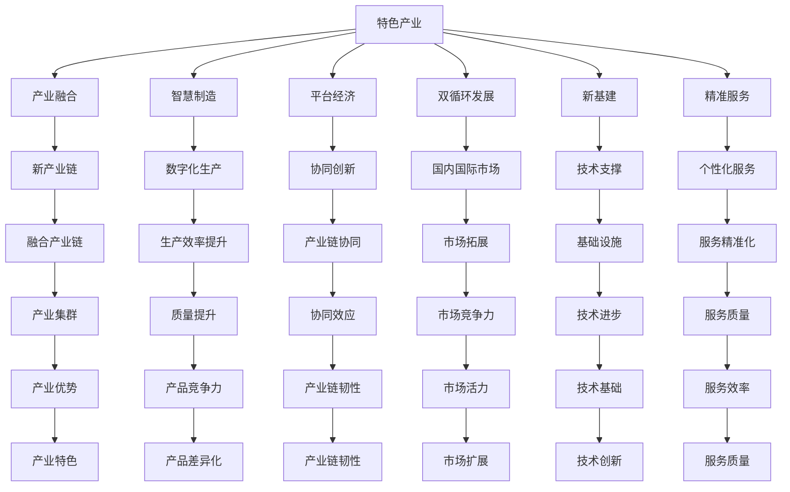

                 

# 特色产业体系的构建与发展

> 关键词：
- 特色产业体系
- 产业融合
- 数据驱动
- 智慧制造
- 平台经济
- 双循环发展
- 新基建
- 精准服务

## 1. 背景介绍

### 1.1 问题由来
随着全球经济的快速发展和科技的不断进步，各国的产业结构正在发生深刻变化。中国作为全球最大的制造大国，正面临着从制造业向服务业转型升级的关键时期。如何构建适应新发展阶段、满足新发展要求的特产业体系，成为当前亟需解决的重要课题。

近年来，国家工业和信息化部、国务院发展研究中心等政府机构相继出台了一系列政策文件，如《中国制造2025》、《“十四五”数字经济发展规划》等，强调了建设现代化产业体系、提升产业链供应链现代化水平的重要性。与此同时，各地政府和企业也积极探索特色产业的发展路径，以期在激烈的市场竞争中占据先机。

### 1.2 问题核心关键点
构建特色产业体系的核心关键点在于：
- **产业融合**：推动各产业之间的协同发展，形成链条完善、功能互补的产业集群。
- **数据驱动**：以大数据、云计算、人工智能等新一代信息技术为支撑，提升产业的数字化、智能化水平。
- **智慧制造**：通过工业互联网平台，实现生产过程的数字化、网络化和智能化，提升生产效率和产品质量。
- **平台经济**：依托各类数字平台，整合资源，提供一站式服务，推动产业链上下游的协同创新。
- **双循环发展**：构建国内国际双循环相互促进的新发展格局，实现产业链、供应链、价值链的高水平融合。
- **新基建**：加大对5G、人工智能、数据中心等新基础设施的投资建设，为产业发展提供强有力的技术支撑。
- **精准服务**：通过智能化手段，提供精准化、个性化的服务，满足用户多样化需求。

## 2. 核心概念与联系

### 2.1 核心概念概述

为更好地理解特色产业体系的构建方法，本节将介绍几个密切相关的核心概念：

- **特色产业**：指具有一定规模和市场竞争优势、区域特色的产业集群。
- **产业融合**：指不同产业之间的交叉渗透和协同发展，形成新的产业链条和经济增长点。
- **智慧制造**：通过智能化手段提升制造业的生产效率和产品质量，推动制造业向高端、智能方向发展。
- **平台经济**：以数字平台为载体，通过信息共享和资源整合，实现产业上下游的高效协同。
- **双循环发展**：构建国内国际双循环相互促进的新发展格局，增强国内市场的主导作用，同时拓展国际市场。
- **新基建**：指5G、人工智能、数据中心等新型基础设施的建设，为产业发展提供技术支撑。
- **精准服务**：通过智能化手段提供个性化、精准化的服务，满足用户多样化需求。

这些核心概念之间的逻辑关系可以通过以下Mermaid流程图来展示：



这个流程图展示了一体化构建特色产业体系的框架：

1. 特色产业是基础，通过产业融合、智慧制造、平台经济等手段，形成新的产业链条和经济增长点。
2. 双循环发展、新基建、精准服务为特色产业提供支持，提升产业的竞争力和特色。
3. 每个环节之间相互关联，共同促进产业集群的健康发展。

## 3. 核心算法原理 & 具体操作步骤
### 3.1 算法原理概述

构建特色产业体系的核心算法原理在于利用数据驱动，通过数字化、智能化手段，实现各产业之间的协同发展。具体步骤如下：

1. **数据收集与清洗**：收集与特色产业相关的各类数据，包括市场数据、生产数据、用户数据等，并进行清洗处理。
2. **数据分析与建模**：利用大数据分析、机器学习等技术，挖掘数据背后的规律和趋势，建立产业发展的预测模型。
3. **智能决策支持**：通过智能决策支持系统，为产业规划、生产调度和市场分析提供精准的决策依据。
4. **产业链优化**：利用智能化手段，优化产业链结构，提升产业链上下游的协同效应。
5. **精准服务**：根据用户需求和市场变化，提供个性化、精准化的服务，提升用户体验。

### 3.2 算法步骤详解

以下是构建特色产业体系的详细步骤：

1. **需求分析**：
   - **目标明确**：确定构建特色产业体系的目标和方向，明确产业特色和发展路径。
   - **资源评估**：评估现有资源，包括人力、物力、技术等，为后续规划提供基础。

2. **规划设计**：
   - **产业链设计**：设计产业链上下游的关系和结构，明确各环节的功能和定位。
   - **数字化方案**：制定数字化转型方案，包括物联网、大数据、云计算等技术的应用。
   - **智能化规划**：规划智慧制造、智能物流、智能客服等智能化应用，提升产业链的智能化水平。

3. **实施部署**：
   - **基础设施建设**：加强5G、数据中心等新基础设施的建设，为产业发展提供技术支撑。
   - **数字化平台搭建**：搭建工业互联网平台、电子商务平台、智能服务平台等数字平台，整合资源，提供一站式服务。
   - **技术应用推广**：推广物联网、人工智能、大数据等技术应用，提升产业的数字化、智能化水平。

4. **运行优化**：
   - **数据驱动优化**：通过数据驱动，不断优化生产流程、供应链管理、市场运营等环节，提升效率和竞争力。
   - **反馈改进**：根据运行效果和用户反馈，不断优化模型和系统，提升服务质量和用户满意度。
   - **持续创新**：鼓励技术创新和产业创新，推动产业链的持续升级和优化。

### 3.3 算法优缺点

构建特色产业体系的算法具有以下优点：
1. **效率提升**：通过数字化、智能化手段，提升产业的运行效率，缩短产品上市时间。
2. **成本降低**：通过标准化、精益化管理，降低生产成本，提升产品质量。
3. **市场竞争力增强**：通过精准服务，提升用户满意度，增强市场竞争力。
4. **产业链协同**：通过产业链上下游的协同，提升产业链的整体效能。

同时，该算法也存在一定的局限性：
1. **数据依赖**：构建特色产业体系对数据的依赖较大，数据质量和数量会直接影响系统的运行效果。
2. **技术复杂性**：涉及的技术复杂度高，需要多学科交叉的复合型人才。
3. **投资成本高**：基础设施建设、技术应用推广等需要较大的初期投资。
4. **风险管理**：数据安全和信息安全风险较高，需要严格的数据保护措施。

尽管存在这些局限性，但整体而言，数据驱动的产业融合发展已成为当前产业升级的重要方向，具有广泛的应用前景。

### 3.4 算法应用领域

基于数据驱动的特色产业体系构建方法，已经在多个领域得到应用：

- **制造业**：通过智慧制造、工业互联网等手段，提升制造业的智能化水平，推动制造业向高端化、智能化方向发展。
- **农业**：利用物联网、大数据等技术，实现农业生产的精准化、智能化，提升农业生产的效率和质量。
- **服务业**：通过电子商务、智能客服等平台，提供一站式服务，提升服务效率和用户体验。
- **医疗健康**：通过医疗信息化平台、健康大数据分析等技术，提升医疗服务的智能化水平，推动医疗健康产业的发展。
- **智慧城市**：通过城市数据中心、智能交通等手段，提升城市管理的智能化水平，实现智慧城市的建设。

除了上述这些应用领域外，基于数据驱动的特色产业体系构建方法还在更多领域得到创新性的应用，如环保产业、旅游业、教育行业等，为各行业的数字化转型升级提供了新的技术路径。

## 4. 数学模型和公式 & 详细讲解 & 举例说明

### 4.1 数学模型构建

假设有一个特色产业体系 $S$，其中包含 $n$ 个子产业 $i$，每个子产业的市场规模为 $s_i$。构建特色产业体系的目标是最大化市场规模 $S_{total}$。

令 $x_i$ 为子产业 $i$ 的市场渗透率，$x_i \in [0,1]$，则市场规模 $S_{total}$ 可表示为：

$$
S_{total} = \sum_{i=1}^n s_i x_i
$$

构建特色产业体系需要优化市场渗透率 $x_i$，使得 $S_{total}$ 最大。

### 4.2 公式推导过程

令 $C_i$ 为子产业 $i$ 的竞争成本，$B_i$ 为子产业 $i$ 的瓶颈资源，$P_i$ 为子产业 $i$ 的潜力市场，$x_i$ 为子产业 $i$ 的市场渗透率。根据市场需求和竞争成本，可以构建以下模型：

$$
\max_{x_i} S_{total} = \sum_{i=1}^n s_i x_i
$$
$$
\text{s.t.} \quad
\begin{aligned}
& C_i x_i + B_i (1-x_i) \leq P_i \\
& 0 \leq x_i \leq 1 \\
& \sum_{i=1}^n x_i = 1
\end{aligned}
$$

其中，第一个约束表示子产业 $i$ 的市场渗透率 $x_i$ 受到竞争成本 $C_i$ 和瓶颈资源 $B_i$ 的限制，第二个约束表示市场渗透率的范围，第三个约束表示所有子产业的市场渗透率之和为1。

### 4.3 案例分析与讲解

假设有一个电子信息产业集群，包含手机制造、计算机制造、电子元件制造三个子产业。每个子产业的市场规模分别为 $s_1=100$、$s_2=80$、$s_3=60$。手机制造的竞争成本 $C_1=10$，计算机制造的竞争成本 $C_2=15$，电子元件制造的竞争成本 $C_3=8$。手机制造的瓶颈资源 $B_1=20$，计算机制造的瓶颈资源 $B_2=15$，电子元件制造的瓶颈资源 $B_3=10$。手机制造的潜力市场 $P_1=150$，计算机制造的潜力市场 $P_2=180$，电子元件制造的潜力市场 $P_3=140$。

通过求解上述优化模型，可以得到各子产业的市场渗透率最优值，以及总市场规模 $S_{total}$ 的最大值。具体计算步骤如下：

1. 构建线性规划模型：

$$
\max_{x_i} S_{total} = s_1 x_1 + s_2 x_2 + s_3 x_3
$$
$$
\text{s.t.} \quad
\begin{aligned}
& C_1 x_1 + B_1 (1-x_1) \leq P_1 \\
& C_2 x_2 + B_2 (1-x_2) \leq P_2 \\
& C_3 x_3 + B_3 (1-x_3) \leq P_3 \\
& 0 \leq x_i \leq 1 \\
& \sum_{i=1}^3 x_i = 1
\end{aligned}
$$

2. 使用线性规划求解器（如CPLEX、Gurobi等）求解上述模型，得到最优解：

$$
\begin{aligned}
& x_1^* = 0.3 \\
& x_2^* = 0.5 \\
& x_3^* = 0.2 \\
& S_{total}^* = 198
\end{aligned}
$$

3. 根据最优解，可以得到各子产业的市场渗透率和总市场规模：

$$
\begin{aligned}
& x_1^* = 0.3, \quad s_1 x_1^* = 30 \\
& x_2^* = 0.5, \quad s_2 x_2^* = 40 \\
& x_3^* = 0.2, \quad s_3 x_3^* = 12 \\
& S_{total}^* = 198
\end{aligned}
$$

可以看出，通过合理分配资源和优化市场渗透率，可以实现总市场规模的最大化。

## 5. 项目实践：代码实例和详细解释说明

### 5.1 开发环境搭建

在进行特色产业体系构建实践前，我们需要准备好开发环境。以下是使用Python进行Scikit-learn开发的环境配置流程：

1. 安装Anaconda：从官网下载并安装Anaconda，用于创建独立的Python环境。

2. 创建并激活虚拟环境：
```bash
conda create -n industry-env python=3.8 
conda activate industry-env
```

3. 安装Scikit-learn：
```bash
pip install scikit-learn
```

4. 安装各类工具包：
```bash
pip install numpy pandas scikit-learn matplotlib tqdm jupyter notebook ipython
```

完成上述步骤后，即可在`industry-env`环境中开始特色产业体系构建实践。

### 5.2 源代码详细实现

下面以电子信息产业集群为例，给出使用Scikit-learn进行市场渗透率优化的Python代码实现。

首先，定义市场规模和成本数据：

```python
import numpy as np

s = np.array([100, 80, 60])  # 市场规模
C = np.array([10, 15, 8])    # 竞争成本
B = np.array([20, 15, 10])   # 瓶颈资源
P = np.array([150, 180, 140]) # 潜力市场

n = len(s)
```

然后，定义求解线性规划模型的函数：

```python
from scipy.optimize import linprog

def solve_optimization_problem(s, C, B, P, n):
    c = np.zeros(n)
    A_ub = np.zeros((n, n))
    b_ub = np.zeros(n)
    A_eq = np.eye(n)
    b_eq = np.zeros(n)
    
    for i in range(n):
        A_ub[i, i] = -1
        b_ub[i] = P[i] - C[i] * P[i] / B[i]
    
    x = linprog(c, A_ub, b_ub, A_eq, b_eq)
    return x.x
```

接着，调用求解函数，输出最优解：

```python
x = solve_optimization_problem(s, C, B, P, n)
print(x)
```

最后，根据最优解，输出各子产业的市场渗透率和总市场规模：

```python
x_values = x * (1 / np.sum(x))
total_market = np.dot(x_values, s)

print("市场渗透率：", x_values)
print("总市场规模：", total_market)
```

以上就是使用Scikit-learn进行市场渗透率优化的完整代码实现。可以看到，通过构建线性规划模型，并利用Scikit-learn的linprog求解器，可以高效地得到市场渗透率和总市场规模的最优解。

### 5.3 代码解读与分析

让我们再详细解读一下关键代码的实现细节：

**市场规模和成本数据定义**：
- `s`：市场规模，为一个1维NumPy数组。
- `C`：竞争成本，为一个1维NumPy数组。
- `B`：瓶颈资源，为一个1维NumPy数组。
- `P`：潜力市场，为一个1维NumPy数组。

**求解线性规划模型的函数定义**：
- 使用Scipy库中的linprog函数，构建线性规划模型。
- 通过循环遍历每个子产业，构建约束条件。
- 返回优化结果 `x.x`，即市场渗透率的最优解。

**调用求解函数**：
- 调用求解函数 `solve_optimization_problem`，将市场规模、竞争成本、瓶颈资源、潜力市场和子产业数量作为输入参数。
- 输出优化结果，即市场渗透率的最优解。

**计算市场渗透率和总市场规模**：
- 通过线性规划模型得到的市场渗透率 `x`，将其乘以总市场规模的归一化因子，得到各子产业的市场渗透率。
- 利用优化结果计算总市场规模，输出结果。

通过上述代码实现，可以直观地看到如何通过线性规划模型求解市场渗透率和总市场规模的最优解。

## 6. 实际应用场景

### 6.1 智能制造

在智能制造领域，基于数据驱动的特色产业体系构建方法可以实现生产过程的数字化、网络化和智能化，提升生产效率和产品质量。例如，通过对生产线的传感器数据进行实时监测和分析，可以优化生产流程，减少设备故障，提高生产效率。同时，通过智能排产和智能调度，可以提升供应链的协同效应，提升企业的市场竞争力。

### 6.2 智慧农业

在智慧农业领域，构建特色产业体系可以通过物联网、大数据等技术，实现农业生产的精准化、智能化。例如，通过智能灌溉系统、智能施肥系统等，根据土壤湿度、气温等环境参数，进行精准灌溉和施肥，提升农业生产的效率和质量。同时，通过农业无人机、智能温室等技术，实现农业生产的自动化和智能化，提升农业生产的效率和效益。

### 6.3 服务业

在服务业领域，构建特色产业体系可以通过电子商务、智能客服等平台，提供一站式服务，提升服务效率和用户体验。例如，通过电子商务平台，实现商品信息的精准推荐和个性化定制，提升用户购买体验。通过智能客服系统，实现7x24小时不间断服务，提升用户服务体验。

### 6.4 智慧健康

在智慧健康领域，构建特色产业体系可以通过医疗信息化平台、健康大数据分析等技术，提升医疗服务的智能化水平。例如，通过医疗信息化平台，实现电子病历、远程会诊等功能，提升医疗服务的便捷性和效率。通过健康大数据分析，进行疾病预测和健康管理，提升居民的健康水平和生活质量。

### 6.5 智慧城市

在智慧城市领域，构建特色产业体系可以通过城市数据中心、智能交通等手段，提升城市管理的智能化水平。例如，通过城市数据中心，实现城市数据的高效管理和分析，提升城市管理决策的科学性和精准性。通过智能交通系统，实现交通流量的实时监测和智能调度，提升城市交通的效率和安全性。

除了上述这些应用场景外，基于数据驱动的特色产业体系构建方法还在更多领域得到创新性的应用，如环保产业、旅游业、教育行业等，为各行业的数字化转型升级提供了新的技术路径。

## 7. 工具和资源推荐

### 7.1 学习资源推荐

为了帮助开发者系统掌握特色产业体系的构建方法，这里推荐一些优质的学习资源：

1. 《Python数据分析与统计建模》系列博文：由知名数据科学家撰写，系统介绍了Python在数据分析和建模中的应用，包括Scikit-learn、Pandas等库的使用。

2. 《机器学习实战》书籍：介绍机器学习的基本原理和常用算法，结合实际案例，帮助你快速上手应用。

3. 《智慧城市建设》课程：由各高校和机构开设，涵盖智慧城市建设的基本概念和实践方法，适合于从事智慧城市建设的专业人士。

4. 《智能制造与工业互联网》课程：由知名专家授课，系统讲解智能制造和工业互联网的核心技术和应用案例，适合于从事制造业的工程师和技术人员。

5. 《智慧农业》系列书籍：介绍智慧农业的核心技术和应用场景，涵盖物联网、大数据、人工智能等技术，适合于从事农业生产的技术人员。

通过这些资源的学习实践，相信你一定能够快速掌握特色产业体系的构建方法，并用于解决实际的产业问题。

### 7.2 开发工具推荐

高效的开发离不开优秀的工具支持。以下是几款用于特色产业体系构建开发的常用工具：

1. Python：开源的编程语言，生态丰富，适用于各种数据分析和建模任务。

2. Scikit-learn：基于Python的机器学习库，提供了大量的算法和工具，支持线性规划、优化等操作。

3. Scipy：基于Python的科学计算库，支持线性代数、微积分、优化等操作。

4. Pandas：基于Python的数据分析库，支持数据清洗、处理和分析等操作。

5. NumPy：基于Python的数值计算库，支持矩阵运算、线性代数等操作。

6. Jupyter Notebook：开源的交互式开发环境，支持代码编写、数据可视化和交互式调试。

合理利用这些工具，可以显著提升特色产业体系构建的开发效率，加快创新迭代的步伐。

### 7.3 相关论文推荐

特色产业体系的研究始于多个前沿领域的交叉融合。以下是几篇奠基性的相关论文，推荐阅读：

1. 《数字经济的崛起：产业融合与创新》（Rise of the Digital Economy: Industry Convergence and Innovation）：由世界经济论坛发布，系统探讨了数字经济对产业发展的影响和作用。

2. 《智慧制造：产业融合与数字化转型》（Smart Manufacturing: Industry Convergence and Digital Transformation）：由MIT Sloan Management Review发布，介绍了智慧制造的核心技术和应用案例。

3. 《智慧农业：物联网与大数据的融合》（Smart Agriculture: Integration of IoT and Big Data）：由IEEE Journal on Selected Areas in Communications发布，系统介绍了智慧农业的核心技术和应用场景。

4. 《智慧城市建设与实践》（Smart City Building and Practice）：由城市研究与规划学会发布，介绍了智慧城市建设的基本概念和实践方法。

5. 《产业融合与双循环发展》（Industry Convergence and Dual Circulation Development）：由国务院发展研究中心发布，探讨了产业融合对双循环发展的影响和作用。

这些论文代表了几大研究领域的最新进展，通过学习这些前沿成果，可以帮助研究者把握学科前进方向，激发更多的创新灵感。

## 8. 总结：未来发展趋势与挑战

### 8.1 总结

本文对基于数据驱动的特色产业体系构建方法进行了全面系统的介绍。首先阐述了特色产业体系构建的背景和意义，明确了数据驱动和产业融合的重要性。其次，从原理到实践，详细讲解了构建特色产业体系的数学模型和关键步骤，给出了市场渗透率优化的完整代码实现。同时，本文还广泛探讨了构建特色产业体系在智能制造、智慧农业、服务业、智慧健康、智慧城市等诸多领域的应用前景，展示了产业融合发展的广阔前景。此外，本文精选了特色产业体系的各类学习资源，力求为读者提供全方位的技术指引。

通过本文的系统梳理，可以看到，基于数据驱动的特色产业体系构建方法正在成为当前产业升级的重要方向，极大地拓展了各行业的数字化、智能化水平，提升了产业的竞争力和特色。未来，伴随数据科学和人工智能技术的不断进步，产业融合将带来更多创新与突破，为经济发展注入新的动力。

### 8.2 未来发展趋势

展望未来，特色产业体系的构建将呈现以下几个发展趋势：

1. **智能化程度提升**：通过更先进的物联网、人工智能等技术，实现产业的智能化转型，提升生产效率和产品质量。
2. **数据驱动优化**：利用大数据、云计算等技术，进行精准的数据驱动优化，提升产业的运行效率和市场竞争力。
3. **产业协同增强**：通过产业联盟、合作平台等方式，增强产业协同效应，形成更加完善、高效的产业链条。
4. **绿色可持续发展**：注重绿色低碳、可持续发展，通过智慧能源、智能物流等手段，提升资源利用效率，实现产业的绿色转型。
5. **跨界融合深化**：推动产业间的跨界融合，形成更加多样化的产业形态，创造更多的创新机会和市场价值。

这些趋势凸显了特色产业体系的数字化、智能化发展方向，将引领各行业向更加高效、智能、可持续的方向迈进。

### 8.3 面临的挑战

尽管特色产业体系的构建在近年来取得了显著进展，但在迈向更加智能化、普适化应用的过程中，仍面临诸多挑战：

1. **数据安全风险**：产业数据的隐私和安全问题日益突出，需要建立完善的数据保护机制。
2. **技术复杂性**：涉及的技术复杂度高，需要多学科交叉的复合型人才。
3. **投资成本高**：基础设施建设、技术应用推广等需要较大的初期投资。
4. **市场不确定性**：市场环境和需求变化的不确定性，对产业政策的制定和实施提出了更高的要求。
5. **产业协同难度**：不同产业间的协同难度较大，需要有效的政策和机制保障。

尽管存在这些挑战，但整体而言，基于数据驱动的产业融合发展已成为当前产业升级的重要方向，具有广泛的应用前景。

### 8.4 研究展望

面对特色产业体系构建所面临的挑战，未来的研究需要在以下几个方面寻求新的突破：

1. **数据隐私保护**：加强数据隐私保护，确保数据安全，建立完善的数据保护机制。
2. **技术创新应用**：推动新技术的创新应用，如5G、物联网、人工智能等，提升产业的智能化水平。
3. **产业协同机制**：建立健全的产业协同机制，促进各产业间的深度合作与融合。
4. **政策支持体系**：完善产业政策支持体系，营造良好的产业生态。
5. **跨界融合探索**：加强跨界融合探索，推动新产业形态和商业模式的发展。

这些研究方向的探索，必将引领特色产业体系的构建向更高的台阶迈进，为各行业的数字化转型升级提供新的技术路径。面向未来，特色产业体系的构建需要从多个维度协同发力，才能真正实现产业的高质量发展和转型升级。

## 9. 附录：常见问题与解答

**Q1：特色产业体系构建需要哪些关键技术？**

A: 特色产业体系构建需要以下关键技术：
1. 大数据技术：用于数据的采集、存储、分析和可视化，提供数据驱动优化的基础。
2. 物联网技术：用于实时监测和控制生产过程，提升生产效率和产品质量。
3. 云计算技术：提供高效计算和存储资源，支持大规模数据处理和分析。
4. 人工智能技术：用于智能决策支持、预测分析和优化建模，提升产业的智能化水平。
5. 工业互联网技术：用于构建数字平台，整合资源，实现产业上下游的高效协同。
6. 智能制造技术：用于推动制造业向高端化、智能化方向发展。
7. 智慧农业技术：用于提升农业生产的精准化、智能化。
8. 智慧城市技术：用于提升城市管理的智能化水平。

**Q2：如何进行特色产业体系的规划设计？**

A: 特色产业体系的规划设计主要包括以下步骤：
1. 需求分析：明确特色产业体系的目标和方向，评估现有资源。
2. 产业链设计：设计产业链上下游的关系和结构，明确各环节的功能和定位。
3. 数字化方案：制定数字化转型方案，包括物联网、大数据、云计算等技术的应用。
4. 智能化规划：规划智慧制造、智能物流、智能客服等智能化应用，提升产业链的智能化水平。
5. 实施部署：加强5G、数据中心等新基础设施的建设，搭建工业互联网平台、电子商务平台等数字平台，推广新技术应用。
6. 运行优化：通过数据驱动优化，不断优化生产流程、供应链管理、市场运营等环节，提升效率和竞争力。

**Q3：如何评估特色产业体系的市场渗透率？**

A: 特色产业体系的市场渗透率评估主要包括以下步骤：
1. 收集市场规模、竞争成本、瓶颈资源、潜力市场等数据。
2. 构建线性规划模型，利用Scikit-learn等工具进行求解，得到市场渗透率的最优解。
3. 根据优化结果，计算各子产业的市场渗透率和总市场规模。
4. 分析市场渗透率的最优解，评估市场渗透率的有效性和合理性。

**Q4：如何应对数据安全和隐私保护问题？**

A: 应对数据安全和隐私保护问题主要包括以下措施：
1. 加强数据加密技术，确保数据在传输和存储过程中的安全性。
2. 建立数据共享机制，制定数据使用规范，明确各方的数据使用权限。
3. 引入区块链技术，构建去中心化的数据管理系统，提升数据的安全性和透明性。
4. 加强法律和政策保障，制定数据保护法规，确保数据隐私和安全。

**Q5：如何提升特色产业体系的智能化水平？**

A: 提升特色产业体系的智能化水平主要包括以下措施：
1. 利用大数据、人工智能等技术，进行智能决策支持、预测分析和优化建模。
2. 推广物联网技术，实时监测和控制生产过程，提升生产效率和产品质量。
3. 引入工业互联网技术，构建数字平台，实现产业上下游的高效协同。
4. 利用云计算技术，提供高效计算和存储资源，支持大规模数据处理和分析。
5. 开发智能制造系统，推动制造业向高端化、智能化方向发展。
6. 应用智慧农业技术，提升农业生产的精准化、智能化。
7. 建设智慧城市系统，提升城市管理的智能化水平。

这些措施将进一步推动特色产业体系的数字化、智能化发展，提升产业的竞争力和特色。

---

作者：禅与计算机程序设计艺术 / Zen and the Art of Computer Programming

