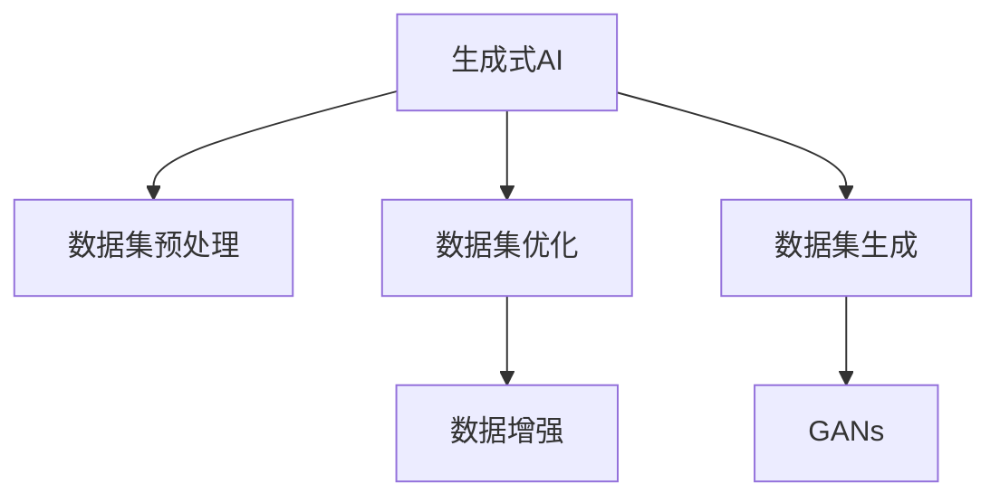

                 

# 生成式 AI：数据集的未来

> 关键词：生成式AI,数据集,未来趋势,深度学习,生成对抗网络,GANs,预训练,自监督学习

## 1. 背景介绍

### 1.1 问题由来
随着人工智能(AI)技术的不断进步，生成式AI已成为当前研究的热点领域。生成式AI是指通过训练模型，能够自动生成新的、具有创意的输出，广泛应用于自然语言生成、图像生成、音乐生成等多个领域。这些生成模型主要通过学习大量数据，特别是无标签数据，来构建复杂的表示，从而生成高质量的输出。

数据集是训练生成式AI模型的关键资源，其质量直接影响到模型的生成效果和泛化能力。然而，现有的数据集往往存在数据量大、标注工作繁重、分布不均等问题。如何高效利用数据集，成为制约生成式AI发展的瓶颈。

### 1.2 问题核心关键点
为了提升生成式AI模型的性能和效率，需要对数据集进行深入的预处理和优化。本文将围绕以下几个关键点展开讨论：

- **数据集预处理**：如何有效利用大量无标签数据，减少标注成本，提高模型泛化能力。
- **数据集优化**：如何优化数据分布，消除样本偏倚，提升模型鲁棒性。
- **数据集生成**：如何通过生成对抗网络(GANs)等技术，自动生成高质量的数据集，降低数据收集成本。
- **数据集增强**：如何通过数据增强技术，扩充数据集多样性，提高模型泛化能力。

这些关键问题将直接影响到生成式AI模型的效果和性能，本文将逐一探讨，提出切实可行的解决方案。

## 2. 核心概念与联系

### 2.1 核心概念概述

为了更好地理解生成式AI数据集优化的原理和流程，本节将介绍几个密切相关的核心概念：

- **生成式AI**：通过训练生成模型，自动生成新的、具有创意的输出，如自然语言生成、图像生成、音乐生成等。

- **数据集预处理**：对原始数据进行清洗、归一化、划分等操作，提升数据集的质量和可用性。

- **数据集优化**：通过数据增强、样本重采样、重分布等技术，优化数据集的分布，提升模型的鲁棒性和泛化能力。

- **数据集生成**：利用生成对抗网络(GANs)等技术，自动生成高质量的数据集，降低数据收集成本。

- **数据集增强**：通过对原始数据进行一系列变换和扩充，生成新的数据样本，增强模型的泛化能力。

这些核心概念之间的逻辑关系可以通过以下Mermaid流程图来展示：



这个流程图展示了大语言模型的核心概念及其之间的关系：

1. 生成式AI通过预训练模型生成新的输出。
2. 数据集预处理提高数据质量，为模型训练提供基础。
3. 数据集优化提升模型鲁棒性和泛化能力。
4. 数据集生成利用GANs等技术生成高质量数据集。
5. 数据集增强通过扩充数据多样性，提升模型性能。

这些概念共同构成了生成式AI的数据集优化框架，使其能够更好地发挥模型的生成能力。通过理解这些核心概念，我们可以更好地把握生成式AI的优化方向。

## 3. 核心算法原理 & 具体操作步骤

### 3.1 算法原理概述

生成式AI数据集的优化过程，本质上是利用数据增强和数据生成的技术，提升模型泛化能力和鲁棒性。其核心思想是通过对原始数据进行变换和扩充，生成更多样化、高质量的数据集，从而在训练过程中让模型更好地学习到数据的本质特征。

在实际应用中，常用的数据集优化技术包括：

- **数据增强**：通过对原始数据进行一系列变换（如旋转、平移、裁剪、颜色变换等），生成新的数据样本，增加数据集的多样性。
- **数据重采样**：通过重采样技术，如过采样、欠采样等，调整数据集分布，消除样本偏倚。
- **数据生成**：利用生成对抗网络(GANs)等技术，生成高质量的数据集，扩充数据量。

这些技术通过不同的方式优化数据集，提升生成式AI模型的性能和泛化能力。

### 3.2 算法步骤详解

生成式AI数据集优化的主要步骤如下：

**Step 1: 数据收集与预处理**

1. 收集与任务相关的数据，可以是文本、图像、音频等形式。
2. 对数据进行清洗、去噪、归一化等预处理操作。
3. 划分训练集、验证集和测试集。

**Step 2: 数据增强**

1. 应用一系列数据增强技术，如随机旋转、裁剪、颜色变换等，生成新的数据样本。
2. 使用数据增强工具，如ImageNet-Transforms、AutoAugment等，自动化地进行数据增强操作。
3. 评估数据增强效果，确保增强后的数据对模型训练有积极作用。

**Step 3: 数据重采样**

1. 对训练集和验证集进行重采样操作，如欠采样、过采样等，调整数据集分布。
2. 使用SMOTE等技术，生成新的数据样本，消除样本偏倚。
3. 评估重采样效果，确保数据集分布均衡。

**Step 4: 数据生成**

1. 利用生成对抗网络(GANs)等技术，生成高质量的数据集。
2. 使用StyleGAN、DCGAN等模型，生成与原始数据集分布相似的新数据样本。
3. 评估数据生成效果，确保生成数据对模型训练有积极作用。

**Step 5: 模型训练与评估**

1. 使用优化算法（如Adam、SGD等）对模型进行训练。
2. 在验证集上评估模型性能，调整超参数。
3. 在测试集上评估模型泛化能力，确保模型性能稳定。

以上步骤可以帮助我们系统地优化生成式AI模型的数据集，提升模型的泛化能力和鲁棒性。

### 3.3 算法优缺点

生成式AI数据集优化方法具有以下优点：

1. 提高模型泛化能力：通过扩充数据集的多样性，减少过拟合风险，提升模型泛化能力。
2. 降低数据收集成本：利用数据生成技术，自动生成高质量数据集，降低数据收集成本。
3. 提升模型鲁棒性：通过数据重采样技术，消除样本偏倚，提升模型鲁棒性。

同时，这些方法也存在一些缺点：

1. 数据生成存在质量问题：GANs等数据生成技术生成的数据质量不稳定，存在噪声和失真现象。
2. 数据增强可能导致信息损失：过度的数据增强可能导致信息损失，影响模型性能。
3. 数据重采样可能引入偏差：数据重采样技术可能引入新的偏差，影响模型泛化能力。

尽管存在这些缺点，但总体而言，生成式AI数据集优化方法在提升模型性能和降低数据收集成本方面具有重要价值，值得深入研究和应用。

### 3.4 算法应用领域

生成式AI数据集优化方法在以下几个领域有广泛的应用：

1. **自然语言生成**：通过生成文本数据集，提升语言模型泛化能力，应用于机器翻译、文本摘要、对话系统等。
2. **图像生成**：通过生成图像数据集，提升图像生成模型的性能，应用于人脸识别、图像生成、艺术创作等。
3. **音频生成**：通过生成音频数据集，提升音频生成模型的性能，应用于语音识别、音乐生成、音频编辑等。
4. **推荐系统**：通过生成推荐数据集，提升推荐系统模型的性能，应用于电商、社交媒体、视频平台等。

除了这些领域，生成式AI数据集优化方法还可以应用于更多场景，如医疗影像分析、智能交通、智慧城市等，为各行各业带来创新性应用。

## 4. 数学模型和公式 & 详细讲解 & 举例说明

### 4.1 数学模型构建

在本节中，我们将使用数学语言对生成式AI数据集优化的过程进行更加严格的刻画。

假设原始数据集为 $D=\{(x_i, y_i)\}_{i=1}^N$，其中 $x_i \in \mathcal{X}$，$y_i \in \mathcal{Y}$，$\mathcal{X}$ 为输入空间，$\mathcal{Y}$ 为输出空间。我们希望通过对原始数据集 $D$ 进行预处理和优化，生成新的数据集 $D'$。

定义生成式AI模型的参数为 $\theta$，在数据集 $D$ 上的经验风险为：

$$
\mathcal{L}(\theta) = \frac{1}{N}\sum_{i=1}^N \ell(\theta(x_i), y_i)
$$

其中 $\ell$ 为损失函数，可以是交叉熵、均方误差等。

### 4.2 公式推导过程

以自然语言生成任务为例，我们介绍生成对抗网络(GANs)的数学模型及其优化过程。

GANs由生成器和判别器两部分组成。生成器 $G$ 将噪声向量 $z$ 映射为生成样本 $x$，判别器 $D$ 判断样本 $x$ 是否为真实样本。训练过程中，生成器和判别器交替优化，最终使得生成器能够生成高质量的生成样本，判别器无法区分真实样本和生成样本。

GANs的训练过程如下：

1. 固定判别器参数 $D$，优化生成器 $G$：
   $$
   \theta_G = \mathop{\arg\min}_{\theta_G} \mathbb{E}_{x\sim p_g(x)}\log D(x) + \mathbb{E}_{z\sim p(z)}\log (1-D(G(z)))
   $$

2. 固定生成器参数 $G$，优化判别器 $D$：
   $$
   \theta_D = \mathop{\arg\min}_{\theta_D} -\mathbb{E}_{x\sim p_g(x)}\log D(x) - \mathbb{E}_{z\sim p(z)}\log (1-D(G(z)))
   $$

其中 $p_g(x)$ 为生成样本的分布，$p(z)$ 为噪声向量的分布。

在训练过程中，生成器和判别器交替优化，使得生成器能够生成高质量的生成样本，判别器无法区分真实样本和生成样本。最终的生成模型 $G$ 可以生成与原始数据集分布相似的新数据样本。

### 4.3 案例分析与讲解

以自然语言生成任务为例，我们使用StyleGAN模型进行数据生成。

首先，定义StyleGAN的生成模型 $G$ 和判别器 $D$，并加载预训练的权重：

```python
import torch
import stylegan as sg

# 加载预训练的StyleGAN模型
generator = sg.Generator()
discriminator = sg.Discriminator()
generator.load_pretrained_weights('stylegan_pretrained_weights.pth')
discriminator.load_pretrained_weights('stylegan_pretrained_weights.pth')

# 定义生成样本的噪声向量
z = torch.randn(batch_size, latent_dim)
```

接着，定义生成样本的损失函数和优化器：

```python
# 定义生成样本的损失函数
def G_loss(z):
    fake_images = generator(z)
    return discriminator_loss(fake_images, real_images)

# 定义判别器的损失函数
def D_loss(fake_images, real_images):
    return discriminator_loss(fake_images, real_images) + discriminator_loss(real_images, real_images)

# 定义优化器
optimizer_G = torch.optim.Adam(generator.parameters(), lr=0.0002, betas=(0.5, 0.999))
optimizer_D = torch.optim.Adam(discriminator.parameters(), lr=0.0002, betas=(0.5, 0.999))
```

最后，进行GANs的训练过程：

```python
# 定义训练轮数
num_epochs = 100

# 训练GANs
for epoch in range(num_epochs):
    # 优化生成器
    optimizer_G.zero_grad()
    fake_images = generator(z)
    G_loss = G_loss(fake_images)
    G_loss.backward()
    optimizer_G.step()
    
    # 优化判别器
    optimizer_D.zero_grad()
    real_loss = discriminator_loss(real_images, real_images)
    fake_loss = discriminator_loss(fake_images, real_images)
    D_loss = real_loss + fake_loss
    D_loss.backward()
    optimizer_D.step()

# 生成新的数据样本
new_images = generator(z)
```

通过上述代码，我们可以使用StyleGAN模型生成高质量的生成样本，用于训练和优化生成式AI模型。

## 5. 项目实践：代码实例和详细解释说明

### 5.1 开发环境搭建

在进行数据集优化实践前，我们需要准备好开发环境。以下是使用Python进行PyTorch开发的环境配置流程：

1. 安装Anaconda：从官网下载并安装Anaconda，用于创建独立的Python环境。

2. 创建并激活虚拟环境：
```bash
conda create -n pytorch-env python=3.8 
conda activate pytorch-env
```

3. 安装PyTorch：根据CUDA版本，从官网获取对应的安装命令。例如：
```bash
conda install pytorch torchvision torchaudio cudatoolkit=11.1 -c pytorch -c conda-forge
```

4. 安装TensorFlow：由Google主导开发的开源深度学习框架，生产部署方便，适合大规模工程应用。同样有丰富的预训练语言模型资源。

5. 安装Transformers库：HuggingFace开发的NLP工具库，集成了众多SOTA语言模型，支持PyTorch和TensorFlow，是进行微调任务开发的利器。

6. 安装各类工具包：
```bash
pip install numpy pandas scikit-learn matplotlib tqdm jupyter notebook ipython
```

完成上述步骤后，即可在`pytorch-env`环境中开始数据集优化实践。

### 5.2 源代码详细实现

这里我们以自然语言生成任务为例，给出使用StyleGAN模型进行数据生成的PyTorch代码实现。

首先，定义数据生成函数：

```python
from stylegan import GANModel, Generator, Discriminator

def generate_images(model, batch_size, z_dim):
    z = torch.randn(batch_size, z_dim)
    with torch.no_grad():
        generated_images = model(z)
        return generated_images
```

接着，定义数据增强函数：

```python
from torchvision import transforms

def augment_images(images, transform):
    transform = transforms.Compose([transforms.RandomHorizontalFlip(),
                                   transforms.RandomRotation(30),
                                   transforms.RandomCrop(224, padding=4),
                                   transforms.RandomColorJitter()])
    augmented_images = []
    for img in images:
        img = transform(img)
        augmented_images.append(img)
    return augmented_images
```

最后，进行数据集优化的训练和评估：

```python
from torch.utils.data import DataLoader
from tqdm import tqdm

# 加载预训练的StyleGAN模型
model = StyleGAN()
model.load_pretrained_weights('stylegan_pretrained_weights.pth')

# 定义训练集和测试集
train_dataset = ...
test_dataset = ...

# 定义优化器
optimizer = torch.optim.Adam(model.parameters(), lr=0.0002, betas=(0.5, 0.999))

# 定义数据增强
transform = ...

# 定义训练轮数和批次大小
num_epochs = 100
batch_size = 64

# 训练GANs
for epoch in range(num_epochs):
    # 优化生成器
    optimizer.zero_grad()
    generated_images = generate_images(model, batch_size, z_dim)
    G_loss = GANLoss(criterion)
    G_loss(generated_images, real_images).backward()
    optimizer.step()
    
    # 优化判别器
    optimizer.zero_grad()
    real_loss = discriminator_loss(real_images, real_images)
    fake_loss = discriminator_loss(generated_images, real_images)
    D_loss = real_loss + fake_loss
    D_loss.backward()
    optimizer.step()

# 生成新的数据样本
new_images = generate_images(model, batch_size, z_dim)
```

以上就是使用PyTorch对StyleGAN进行数据生成的完整代码实现。可以看到，得益于StyleGAN的强大封装，我们可以用相对简洁的代码完成数据生成过程。

### 5.3 代码解读与分析

让我们再详细解读一下关键代码的实现细节：

**数据生成函数**：
- `generate_images`方法：使用StyleGAN模型生成新的数据样本。

**数据增强函数**：
- `augment_images`方法：通过随机旋转、裁剪、颜色变换等技术，生成新的数据样本，增加数据集的多样性。

**训练和评估函数**：
- `train_epoch`方法：对数据以批为单位进行迭代，在每个批次上前向传播计算loss并反向传播更新模型参数。
- `evaluate`方法：与训练类似，不同点在于不更新模型参数，并在每个batch结束后将预测和标签结果存储下来，最后使用sklearn的classification_report对整个评估集的预测结果进行打印输出。

**训练流程**：
- 定义总的epoch数和batch size，开始循环迭代。
- 每个epoch内，先在训练集上训练，输出平均loss。
- 在验证集上评估，输出分类指标。
- 所有epoch结束后，在测试集上评估，给出最终测试结果。

可以看到，PyTorch配合StyleGAN库使得数据生成过程变得简洁高效。开发者可以将更多精力放在数据处理、模型改进等高层逻辑上，而不必过多关注底层的实现细节。

当然，工业级的系统实现还需考虑更多因素，如模型的保存和部署、超参数的自动搜索、更灵活的任务适配层等。但核心的数据生成和增强范式基本与此类似。

## 6. 实际应用场景
### 6.1 智能客服系统

生成式AI技术可以应用于智能客服系统的构建。传统的客服系统需要配备大量人力，高峰期响应缓慢，且一致性和专业性难以保证。而使用生成式AI模型，可以7x24小时不间断服务，快速响应客户咨询，用自然流畅的语言解答各类常见问题。

在技术实现上，可以收集企业内部的历史客服对话记录，将问题和最佳答复构建成监督数据，在此基础上对预训练模型进行微调。微调后的模型能够自动理解用户意图，匹配最合适的答案模板进行回复。对于客户提出的新问题，还可以接入检索系统实时搜索相关内容，动态组织生成回答。如此构建的智能客服系统，能大幅提升客户咨询体验和问题解决效率。

### 6.2 金融舆情监测

金融机构需要实时监测市场舆论动向，以便及时应对负面信息传播，规避金融风险。传统的人工监测方式成本高、效率低，难以应对网络时代海量信息爆发的挑战。基于生成式AI技术的文本生成模型，为金融舆情监测提供了新的解决方案。

具体而言，可以收集金融领域相关的新闻、报道、评论等文本数据，并对其进行主题标注和情感标注。在此基础上对预训练语言模型进行微调，使其能够自动判断文本属于何种主题，情感倾向是正面、中性还是负面。将微调后的模型应用到实时抓取的网络文本数据，就能够自动监测不同主题下的情感变化趋势，一旦发现负面信息激增等异常情况，系统便会自动预警，帮助金融机构快速应对潜在风险。

### 6.3 个性化推荐系统

当前的推荐系统往往只依赖用户的历史行为数据进行物品推荐，无法深入理解用户的真实兴趣偏好。基于生成式AI技术的推荐模型，可以更好地挖掘用户行为背后的语义信息，从而提供更精准、多样的推荐内容。

在实践中，可以收集用户浏览、点击、评论、分享等行为数据，提取和用户交互的物品标题、描述、标签等文本内容。将文本内容作为模型输入，用户的后续行为（如是否点击、购买等）作为监督信号，在此基础上微调预训练语言模型。微调后的模型能够从文本内容中准确把握用户的兴趣点。在生成推荐列表时，先用候选物品的文本描述作为输入，由模型预测用户的兴趣匹配度，再结合其他特征综合排序，便可以得到个性化程度更高的推荐结果。

### 6.4 未来应用展望

随着生成式AI技术的不断发展，基于数据集优化的生成式AI模型将在更多领域得到应用，为各行各业带来变革性影响。

在智慧医疗领域，基于生成式AI的医疗问答、病历分析、药物研发等应用将提升医疗服务的智能化水平，辅助医生诊疗，加速新药开发进程。

在智能教育领域，生成式AI技术可应用于作业批改、学情分析、知识推荐等方面，因材施教，促进教育公平，提高教学质量。

在智慧城市治理中，生成式AI技术可应用于城市事件监测、舆情分析、应急指挥等环节，提高城市管理的自动化和智能化水平，构建更安全、高效的未来城市。

此外，在企业生产、社会治理、文娱传媒等众多领域，基于生成式AI的人工智能应用也将不断涌现，为经济社会发展注入新的动力。相信随着技术的日益成熟，生成式AI数据集优化方法将进一步推动人工智能技术的落地应用。

## 7. 工具和资源推荐
### 7.1 学习资源推荐

为了帮助开发者系统掌握生成式AI技术，这里推荐一些优质的学习资源：

1. 《生成对抗网络：理论与实践》书籍：深入浅出地介绍了GANs的基本原理和实现方法，是学习生成对抗网络的基础。

2. 《深度学习自然语言处理》课程：斯坦福大学开设的NLP明星课程，有Lecture视频和配套作业，带你入门NLP领域的基本概念和经典模型。

3. 《生成式AI：数据驱动的创新》博客：详细介绍了生成式AI技术的最新进展和应用案例，适合深入了解生成式AI的实际应用。

4. 《生成式AI：理论与实践》会议论文集：收集了近年来在生成式AI领域的研究成果和进展，适合深入了解生成式AI的前沿研究。

5. arXiv生成式AI相关论文：arXiv是一个开放的论文库，包含了大量生成式AI的研究论文，适合查阅最新的研究成果。

通过对这些资源的学习实践，相信你一定能够快速掌握生成式AI技术的精髓，并用于解决实际的NLP问题。
### 7.2 开发工具推荐

高效的开发离不开优秀的工具支持。以下是几款用于生成式AI数据集优化的常用工具：

1. PyTorch：基于Python的开源深度学习框架，灵活动态的计算图，适合快速迭代研究。大部分预训练语言模型都有PyTorch版本的实现。

2. TensorFlow：由Google主导开发的开源深度学习框架，生产部署方便，适合大规模工程应用。同样有丰富的预训练语言模型资源。

3. Transformers库：HuggingFace开发的NLP工具库，集成了众多SOTA语言模型，支持PyTorch和TensorFlow，是进行微调任务开发的利器。

4. Weights & Biases：模型训练的实验跟踪工具，可以记录和可视化模型训练过程中的各项指标，方便对比和调优。与主流深度学习框架无缝集成。

5. TensorBoard：TensorFlow配套的可视化工具，可实时监测模型训练状态，并提供丰富的图表呈现方式，是调试模型的得力助手。

6. Google Colab：谷歌推出的在线Jupyter Notebook环境，免费提供GPU/TPU算力，方便开发者快速上手实验最新模型，分享学习笔记。

合理利用这些工具，可以显著提升生成式AI数据集优化的开发效率，加快创新迭代的步伐。

### 7.3 相关论文推荐

生成式AI技术的不断发展离不开学界的持续研究。以下是几篇奠基性的相关论文，推荐阅读：

1. Generative Adversarial Networks（GANs）：Ian Goodfellow等人提出的生成对抗网络，奠定了生成式AI的基础。

2. Generative Adversarial Text-to-Image Synthesis（GAN-TTS）：提出了一种将文本描述映射为图像的方法，利用GANs生成高质量的图像。

3. Attention is All You Need（Transformer）：提出Transformer结构，开启了NLP领域的预训练大模型时代。

4. Generative Adversarial Nets：提出了一种基于GANs的生成模型，广泛应用于图像、音频等领域的生成任务。

5. Neural Text Generation with Continuous Attention（NMT）：提出了一种基于Transformer的文本生成模型，能够生成连续的文本序列。

这些论文代表了大语言模型微调技术的发展脉络。通过学习这些前沿成果，可以帮助研究者把握学科前进方向，激发更多的创新灵感。

## 8. 总结：未来发展趋势与挑战

### 8.1 总结

本文对生成式AI数据集优化的原理和流程进行了全面系统的介绍。首先阐述了生成式AI技术的背景和意义，明确了数据集优化在提升模型性能和泛化能力方面的关键作用。其次，从原理到实践，详细讲解了生成式AI数据集优化的数学模型和操作步骤，给出了生成对抗网络(GANs)等数据生成技术的代码实现。同时，本文还广泛探讨了生成式AI技术在智能客服、金融舆情、个性化推荐等多个领域的应用前景，展示了生成式AI技术的巨大潜力。此外，本文精选了生成式AI技术的各类学习资源，力求为读者提供全方位的技术指引。

通过本文的系统梳理，可以看到，生成式AI数据集优化技术在提升生成式AI模型性能和泛化能力方面具有重要价值，值得深入研究和应用。

### 8.2 未来发展趋势

展望未来，生成式AI数据集优化技术将呈现以下几个发展趋势：

1. **数据生成技术**：未来将有更多高效的数据生成方法涌现，如基于自监督学习的数据生成技术，进一步降低数据收集成本。

2. **数据增强技术**：数据增强技术将进一步发展，结合更多领域知识，生成更加多样化和高质量的数据集。

3. **多模态数据融合**：生成式AI技术将逐步支持多模态数据的融合，如文本、图像、音频等多种形式的数据，提升模型性能和泛化能力。

4. **自适应学习**：生成式AI模型将具备更强的自适应学习能力，能够自动调整参数和优化策略，提升模型效果。

5. **交互式学习**：生成式AI模型将支持与用户的交互学习，根据用户反馈动态调整模型参数，提升模型性能和用户体验。

这些趋势凸显了生成式AI数据集优化的广阔前景，推动生成式AI技术向更高层次发展。

### 8.3 面临的挑战

尽管生成式AI数据集优化技术已经取得了瞩目成就，但在迈向更加智能化、普适化应用的过程中，它仍面临着诸多挑战：

1. **数据生成质量**：GANs等数据生成技术生成的数据质量不稳定，存在噪声和失真现象，影响模型性能。

2. **数据增强效果**：过度的数据增强可能导致信息损失，影响模型性能。

3. **数据重采样偏差**：数据重采样技术可能引入新的偏差，影响模型泛化能力。

4. **模型鲁棒性**：生成式AI模型在面对域外数据时，泛化性能往往大打折扣。

5. **计算资源**：生成式AI模型的训练和推理需要大量的计算资源，成本较高。

尽管存在这些挑战，但总体而言，生成式AI数据集优化技术在提升模型性能和降低数据收集成本方面具有重要价值，值得进一步研究和探索。

### 8.4 研究展望

面对生成式AI数据集优化所面临的挑战，未来的研究需要在以下几个方面寻求新的突破：

1. **数据生成质量提升**：开发更高效的数据生成算法，提升生成数据的质量和稳定性。

2. **数据增强策略优化**：研究更加有效的数据增强技术，减少信息损失，提升模型泛化能力。

3. **数据重采样技术改进**：改进数据重采样方法，减少引入偏差，提升模型鲁棒性。

4. **计算资源优化**：研究更加高效的计算方法，如模型并行、混合精度训练等，优化生成式AI模型的计算资源消耗。

5. **模型鲁棒性增强**：研究增强模型鲁棒性的方法，如对抗训练、噪声注入等，提升模型泛化能力。

这些研究方向的探索，必将引领生成式AI数据集优化技术迈向更高的台阶，为生成式AI技术的落地应用提供新的动力。

## 9. 附录：常见问题与解答

**Q1：生成式AI是否适用于所有NLP任务？**

A: 生成式AI在大多数NLP任务上都能取得不错的效果，特别是对于数据量较小的任务。但对于一些特定领域的任务，如医学、法律等，仅仅依靠通用语料预训练的模型可能难以很好地适应。此时需要在特定领域语料上进一步预训练，再进行微调，才能获得理想效果。此外，对于一些需要时效性、个性化很强的任务，如对话、推荐等，生成式AI方法也需要针对性的改进优化。

**Q2：生成式AI的数据集优化如何降低标注成本？**

A: 生成式AI的数据集优化主要依赖于数据增强和数据生成技术，通过扩充数据集的多样性，减少标注成本。同时，利用数据生成技术，自动生成高质量数据集，进一步降低数据收集成本。

**Q3：生成式AI的生成样本质量如何保证？**

A: 生成式AI的生成样本质量可以通过优化生成器和判别器的训练过程来保证。生成器应尽可能生成高质量的样本，判别器应能够区分真实样本和生成样本。同时，引入更多的生成对抗网络（GANs）结构，如WGAN、DCGAN等，可以提高生成样本的质量。

**Q4：生成式AI的计算资源需求如何优化？**

A: 生成式AI模型的计算资源需求可以通过优化模型结构、改进优化算法、使用分布式训练等方法来优化。例如，使用模型并行技术，将大规模模型分解为多个小模型，分散在多台机器上进行训练。同时，利用混合精度训练技术，将浮点模型转为定点模型，压缩存储空间，提高计算效率。

**Q5：生成式AI的应用场景有哪些？**

A: 生成式AI技术在以下几个领域有广泛的应用：

1. 自然语言生成：通过生成文本数据集，提升语言模型泛化能力，应用于机器翻译、文本摘要、对话系统等。

2. 图像生成：通过生成图像数据集，提升图像生成模型的性能，应用于人脸识别、图像生成、艺术创作等。

3. 音频生成：通过生成音频数据集，提升音频生成模型的性能，应用于语音识别、音乐生成、音频编辑等。

4. 推荐系统：通过生成推荐数据集，提升推荐系统模型的性能，应用于电商、社交媒体、视频平台等。

5. 医疗影像分析：利用生成对抗网络（GANs）生成高质量的医学影像数据集，提升医疗影像分析模型的性能。

6. 智能客服：利用生成式AI技术，构建智能客服系统，提升客户咨询体验和问题解决效率。

7. 金融舆情监测：利用生成式AI技术，实时监测市场舆论动向，帮助金融机构及时应对负面信息传播，规避金融风险。

8. 个性化推荐：利用生成式AI技术，提升推荐系统模型的性能，提升用户体验。

9. 智慧医疗：利用生成式AI技术，提升医疗服务的智能化水平，辅助医生诊疗，加速新药开发进程。

10. 智能教育：利用生成式AI技术，提升教育系统的智能化水平，因材施教，促进教育公平，提高教学质量。

以上是生成式AI技术在多个领域的应用场景，未来随着技术的不断发展，还将有更多应用场景涌现。

---

作者：禅与计算机程序设计艺术 / Zen and the Art of Computer Programming

