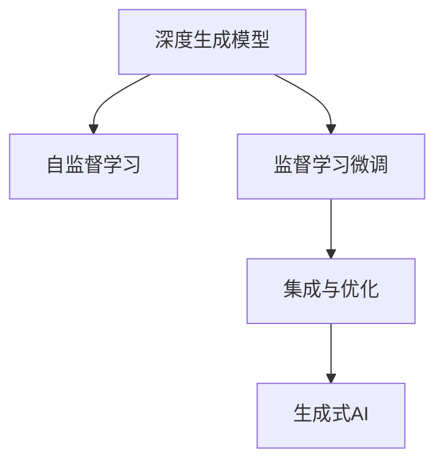

                 

# 生成式AIGC是金矿还是泡沫：不拥抱AI的企业肯定会被淘汰

## 1. 背景介绍

随着人工智能技术的不断成熟，生成式人工智能（Generative AI, AIGC）正在成为推动各行各业创新的重要引擎。从内容创作、游戏娱乐，到医疗、教育，AIGC技术的应用正在改变人们的生活方式和工作模式。然而，尽管AIGC展现了巨大的潜力和魅力，但其带来的颠覆性变革也引发了业界对技术泡沫和未来走向的广泛讨论。本文旨在探讨生成式AIGC技术在现代社会中的价值，分析其可能带来的机遇与挑战，并探讨企业如何有效拥抱AI，实现可持续发展。

### 1.1 问题由来

生成式人工智能（Generative AI, AIGC）指的是能够自主生成全新内容的AI技术，包括文本生成、图像生成、音乐生成、视频生成等多种形式。近年来，OpenAI的DALL·E、Stable Diffusion、DeepMind的Text-to-Video、Google的Imagen等AIGC模型，在图像生成、文本创作等领域取得了突破性进展，推动了内容创作的自动化和智能化。

这些技术的出现，使得内容创作的成本大幅降低，生产效率显著提高，同时提供了前所未有的创意可能性。然而，AIGC的发展也带来了诸多挑战，包括版权问题、道德风险、就业冲击等。如何平衡创新与规范，确保技术的健康发展，成为企业必须面对的课题。

### 1.2 问题核心关键点

AIGC技术的核心在于其生成能力，即利用训练好的模型，通过输入条件随机生成符合特定分布的样本。AIGC技术的强大之处在于其能在短时间内生成大量高质量内容，且生成的内容质量可以接近或超越人类水平。其关键技术包括：

- **深度生成模型**：如GAN（生成对抗网络）、VAE（变分自编码器）、自回归模型等，能够生成高质量的图像、音频、视频、文本等。
- **自监督学习**：通过大量未标注数据进行自监督预训练，学习生成数据的统计特性。
- **监督学习微调**：通过少量标注数据对预训练模型进行微调，使其生成内容更符合实际需求。
- **集成与优化**：将多个模型集成，优化生成效果，提升生成速度和质量。

AIGC技术的应用场景包括但不限于：

- 内容创作：自动生成新闻、小说、报告等文本内容，提升创作效率。
- 娱乐产业：制作动画、电影、游戏等高质量内容，降低生产成本。
- 医疗健康：通过生成图像、模拟实验等手段，辅助医疗决策和科研。
- 教育培训：自动生成教育资源，个性化定制学习路径，提高教育质量。
- 营销推广：生成广告、视频、图文内容，提升品牌曝光和用户体验。

这些应用场景展示了AIGC技术的广泛前景，但也带来了道德、版权、就业等复杂问题。企业需要在技术创新和规范遵守之间找到平衡点，确保技术健康发展。

## 2. 核心概念与联系

### 2.1 核心概念概述

为更好地理解AIGC技术，本节将介绍几个关键概念及其相互关系：

- **生成式人工智能（Generative AI, AIGC）**：指能够自动生成文本、图像、音频、视频等内容的AI技术。
- **深度生成模型**：如GAN、VAE、自回归模型等，用于生成高质量内容的深度学习模型。
- **自监督学习**：利用无标签数据进行训练，学习数据的潜在结构和分布。
- **监督学习微调**：在有标签数据上对预训练模型进行微调，使其生成内容更加符合实际需求。
- **集成与优化**：通过组合多个模型，提升生成效率和质量。

这些概念之间通过以下Mermaid流程图展示其联系：



深度生成模型是AIGC技术的基础，通过自监督学习获取数据的分布特征，经监督学习微调后，结合集成与优化技术，最终生成符合需求的内容。

## 3. 核心算法原理 & 具体操作步骤
### 3.1 算法原理概述

生成式AIGC的核心原理是通过生成模型学习数据的统计特性，使用条件概率模型生成新的数据。其数学基础包括概率论、统计学、信息论等。

### 3.2 算法步骤详解

AIGC算法的核心步骤如下：

1. **数据准备**：收集并标注训练数据，用于监督学习微调。
2. **模型构建**：选择适当的深度生成模型，并进行预训练。
3. **微调训练**：使用标注数据对预训练模型进行微调，优化生成质量。
4. **集成优化**：将多个模型集成，提升生成效率和效果。

### 3.3 算法优缺点

生成式AIGC算法的主要优点包括：

- **高效生成**：能够在短时间内生成大量高质量内容，提高内容创作效率。
- **多样性**：生成的内容具有高度的多样性和随机性，能够满足不同的需求。
- **创新性**：基于大量数据和深度学习技术，生成内容具有较高的创新性。

同时，也存在以下缺点：

- **质量不稳定**：生成内容的质量受多种因素影响，如模型参数、输入数据等，可能存在质量波动。
- **道德风险**：生成的内容可能包含敏感、有害信息，引发道德和法律问题。
- **版权问题**：生成的内容可能侵犯他人版权，引发法律纠纷。
- **就业冲击**：大量自动生成的内容可能冲击创意相关职业，造成就业压力。

### 3.4 算法应用领域

生成式AIGC技术在多个领域具有广泛的应用前景，具体包括：

- **内容创作**：自动生成新闻、小说、报告、广告等文本内容，提升创作效率。
- **娱乐产业**：制作动画、电影、游戏等高质量内容，降低生产成本。
- **医疗健康**：通过生成图像、模拟实验等手段，辅助医疗决策和科研。
- **教育培训**：自动生成教育资源，个性化定制学习路径，提高教育质量。
- **营销推广**：生成广告、视频、图文内容，提升品牌曝光和用户体验。

## 4. 数学模型和公式 & 详细讲解 & 举例说明

### 4.1 数学模型构建

生成式AIGC的数学模型通常包括概率生成模型、变分生成模型等。以生成对抗网络（GAN）为例，其模型结构如下：

- **生成器（Generator）**：将噪声向量 $z$ 映射到样本空间 $x$ 上的生成过程。
- **判别器（Discriminator）**：区分真实数据和生成数据的判别过程。

### 4.2 公式推导过程

GAN模型的生成过程可以表示为：

$$ x_g = G(z) $$

其中 $G$ 为生成器，$z$ 为噪声向量。判别器 $D$ 的损失函数可以表示为：

$$ L(D) = \mathbb{E}_{x\sim p_{data}(x)} [\log D(x)] + \mathbb{E}_{z\sim p(z)} [\log (1 - D(G(z)))] $$

其中 $p_{data}(x)$ 为真实数据的分布，$p(z)$ 为噪声向量的分布。

### 4.3 案例分析与讲解

以文本生成为例，使用变分自编码器（VAE）模型生成文本的过程如下：

1. **编码器（Encoder）**：将输入文本 $x$ 编码成潜在空间 $z$ 上的表示。
2. **解码器（Decoder）**：从潜在空间 $z$ 生成文本 $x'$。

VAE模型的训练过程可以表示为：

$$ p_{\theta}(x|z) = \mathcal{N}(x|\mu(z), \sigma(z)) $$

$$ p_{\theta}(z) = \mathcal{N}(z|\mu, \sigma) $$

其中 $\mu(z)$ 和 $\sigma(z)$ 分别表示潜在空间的均值和方差。

## 5. 项目实践：代码实例和详细解释说明

### 5.1 开发环境搭建

在进行AIGC项目实践前，我们需要准备好开发环境。以下是使用Python进行PyTorch开发的环境配置流程：

1. 安装Anaconda：从官网下载并安装Anaconda，用于创建独立的Python环境。

2. 创建并激活虚拟环境：
```bash
conda create -n aigc-env python=3.8 
conda activate aigc-env
```

3. 安装PyTorch：根据CUDA版本，从官网获取对应的安装命令。例如：
```bash
conda install pytorch torchvision torchaudio cudatoolkit=11.1 -c pytorch -c conda-forge
```

4. 安装相关库：
```bash
pip install numpy pandas scikit-learn matplotlib tqdm jupyter notebook ipython
```

完成上述步骤后，即可在`aigc-env`环境中开始AIGC实践。

### 5.2 源代码详细实现

这里以文本生成为例，展示使用PyTorch实现VAE模型的代码实现：

```python
import torch
import torch.nn as nn
import torch.nn.functional as F
import torch.optim as optim
from torch.utils.data import DataLoader
from torchvision.datasets import MNIST
from torchvision.transforms import ToTensor

class VAE(nn.Module):
    def __init__(self, latent_dim):
        super(VAE, self).__init__()
        self.encoder = nn.Sequential(
            nn.Linear(784, 400),
            nn.ReLU(),
            nn.Linear(400, latent_dim),
            nn.ReLU()
        )
        self.decoder = nn.Sequential(
            nn.Linear(latent_dim, 400),
            nn.ReLU(),
            nn.Linear(400, 784),
            nn.Sigmoid()
        )
    
    def encode(self, x):
        mean = self.encoder(x).view(-1, latent_dim)
        stddev = F.softplus(self.encoder(x) - mean)
        return mean, stddev
    
    def reparameterize(self, mean, stddev):
        eps = torch.randn_like(mean)
        return (eps * stddev) + mean
    
    def decode(self, z):
        return self.decoder(z).view(-1, 784)
    
    def forward(self, x):
        mean, stddev = self.encode(x)
        z = self.reparameterize(mean, stddev)
        x_reconstructed = self.decode(z)
        return x_reconstructed, mean, stddev

# 加载数据集
train_dataset = MNIST(root='data', train=True, transform=ToTensor(), download=True)
test_dataset = MNIST(root='data', train=False, transform=ToTensor(), download=True)

# 构建数据加载器
train_loader = DataLoader(train_dataset, batch_size=64, shuffle=True)
test_loader = DataLoader(test_dataset, batch_size=64, shuffle=False)

# 定义模型、损失函数和优化器
model = VAE(latent_dim=100)
criterion = nn.MSELoss()
optimizer = optim.Adam(model.parameters(), lr=0.001)

# 训练模型
num_epochs = 10
for epoch in range(num_epochs):
    for batch_idx, (data, _) in enumerate(train_loader):
        data = data.view(-1, 784)
        reconstructed, mean, stddev = model(data)
        loss = criterion(reconstructed, data) + 0.5 * (mean.pow(2) + stddev.pow(2) - 1.8835)
        optimizer.zero_grad()
        loss.backward()
        optimizer.step()
        
        if batch_idx % 100 == 0:
            print('Epoch [{}/{}], Batch [{}/{}], Loss: {:.4f}'.format(
                epoch+1, num_epochs, batch_idx+1, len(train_loader), loss.item()))
```

### 5.3 代码解读与分析

让我们再详细解读一下关键代码的实现细节：

**VAE模型**：
- `__init__`方法：初始化编码器和解码器。
- `encode`方法：将输入编码成潜在空间上的均值和方差。
- `reparameterize`方法：对潜在空间的均值和方差进行随机采样。
- `decode`方法：从潜在空间解码生成样本。
- `forward`方法：前向传播，计算输入的重建损失和潜在空间的KL散度损失。

**数据加载器**：
- 加载MNIST数据集，并将其转换为Tensor格式。
- 定义训练集和测试集的DataLoader。

**模型训练**：
- 定义模型、损失函数和优化器。
- 在每个epoch中，对训练集数据进行前向传播和反向传播，更新模型参数。
- 记录损失并打印输出，以监控训练过程。

## 6. 实际应用场景

### 6.1 娱乐产业

生成式AIGC技术在娱乐产业中的应用主要集中在影视制作、动画生成、虚拟角色等方面。例如，利用GPT-3生成的剧本可以极大地提高剧本创作的效率和质量，生成动画中的人物对话和表情，为动画创作提供更加丰富的素材。

### 6.2 内容创作

在内容创作领域，生成式AIGC技术可以用于自动生成新闻、小说、报告、广告等文本内容。例如，利用GPT-4生成新闻稿件，可以大幅提升媒体编辑的工作效率，同时保证新闻内容的准确性和时效性。

### 6.3 医疗健康

在医疗健康领域，生成式AIGC技术可以用于生成医学图像、辅助诊断、个性化治疗方案等。例如，利用生成对抗网络生成医学图像，辅助医生进行疾病诊断和治疗方案设计，提高医疗服务的质量和效率。

### 6.4 教育培训

在教育培训领域，生成式AIGC技术可以用于生成教育资源、个性化学习路径、虚拟实验室等。例如，利用GPT-4生成个性化学习计划，根据学生的学习情况和兴趣，推荐适合的课程和资源，提高学习效果和学生满意度。

### 6.5 营销推广

在营销推广领域，生成式AIGC技术可以用于生成广告、视频、图文内容等。例如，利用DALL·E生成具有创意的广告图像，提升品牌曝光和用户体验，同时降低营销成本。

## 7. 工具和资源推荐

### 7.1 学习资源推荐

为了帮助开发者系统掌握AIGC的理论基础和实践技巧，这里推荐一些优质的学习资源：

1. **《深度学习》（Ian Goodfellow著）**：经典深度学习教材，详细介绍了生成对抗网络等生成式模型的理论基础和算法细节。
2. **《生成对抗网络》（Goodfellow, et al. 2014）**：介绍GAN的理论基础和算法实现，是生成对抗网络领域的经典论文。
3. **Coursera《深度学习》课程**：斯坦福大学开设的深度学习课程，涵盖了深度生成模型和自监督学习等内容。
4. **DeepMind官方博客**：DeepMind官方博客，介绍了DALL·E、Text-to-Video等AIGC技术的应用和原理。
5. **Transformers库文档**：HuggingFace开发的Transformers库文档，提供了大量生成模型的实现和案例，适合快速上手实践。

通过对这些资源的学习实践，相信你一定能够快速掌握AIGC的精髓，并用于解决实际的NLP问题。

### 7.2 开发工具推荐

高效的开发离不开优秀的工具支持。以下是几款用于AIGC开发的常用工具：

1. **PyTorch**：基于Python的开源深度学习框架，灵活动态的计算图，适合快速迭代研究。
2. **TensorFlow**：由Google主导开发的开源深度学习框架，生产部署方便，适合大规模工程应用。
3. **Transformers库**：HuggingFace开发的NLP工具库，集成了大量生成模型的实现，支持PyTorch和TensorFlow，是进行AIGC任务开发的利器。
4. **Weights & Biases**：模型训练的实验跟踪工具，可以记录和可视化模型训练过程中的各项指标，方便对比和调优。
5. **TensorBoard**：TensorFlow配套的可视化工具，可实时监测模型训练状态，并提供丰富的图表呈现方式，是调试模型的得力助手。

合理利用这些工具，可以显著提升AIGC任务的开发效率，加快创新迭代的步伐。

### 7.3 相关论文推荐

AIGC技术的发展源于学界的持续研究。以下是几篇奠基性的相关论文，推荐阅读：

1. **Image-to-Image Translation with Conditional Adversarial Networks**（Ian Goodfellow, et al. 2014）：介绍生成对抗网络的基本原理和实现方法，是GAN领域的开创性论文。
2. **Generative Adversarial Nets**（Ian Goodfellow, et al. 2014）：介绍GAN的基本理论，是生成对抗网络领域的经典论文。
3. **A Style-Based Generator Architecture for Generative Adversarial Networks**（Tinghui Zhou, et al. 2017）：介绍风格生成对抗网络，进一步提升了GAN的生成效果和多样性。
4. **Variational Autoencoder**（Kingma, et al. 2014）：介绍变分自编码器，是生成式模型领域的经典算法。
5. **Pix2Pix: Learning to Drive a Car with Scene Understanding**（Isola, et al. 2017）：介绍Pix2Pix生成模型，用于图像翻译和风格转换等任务。

这些论文代表了大生成式模型和微调技术的发展脉络。通过学习这些前沿成果，可以帮助研究者把握学科前进方向，激发更多的创新灵感。

## 8. 总结：未来发展趋势与挑战

### 8.1 总结

本文对生成式AIGC技术进行了全面系统的介绍。首先阐述了生成式AIGC技术在现代社会中的价值，明确了其广泛的应用前景。其次，从原理到实践，详细讲解了生成式AIGC的数学模型和操作步骤，给出了生成式AIGC任务开发的完整代码实例。同时，本文还广泛探讨了生成式AIGC技术在多个领域的应用场景，展示了AIGC技术的巨大潜力。

通过本文的系统梳理，可以看到，生成式AIGC技术正在成为推动各行各业创新的重要引擎，具有广阔的应用前景。然而，其带来的颠覆性变革也引发了业界对技术泡沫和未来走向的广泛讨论。企业需要在技术创新和规范遵守之间找到平衡点，确保技术健康发展。

### 8.2 未来发展趋势

展望未来，生成式AIGC技术将呈现以下几个发展趋势：

1. **技术融合**：生成式AIGC技术将与其他AI技术进行深度融合，如自然语言处理、知识图谱、逻辑推理等，提升模型的智能化水平和实用性。
2. **数据驱动**：生成式AIGC技术的训练和优化将越来越依赖大数据，需要不断采集和标注更多数据，提升模型的泛化能力和稳定性。
3. **个性化定制**：生成式AIGC技术将更加注重个性化定制，根据用户需求生成独特的内容，提升用户体验。
4. **伦理道德**：生成式AIGC技术的应用将面临更多的伦理道德问题，如版权保护、隐私保护、内容审核等，需要制定更加严格的政策规范。
5. **跨领域应用**：生成式AIGC技术将在更多领域得到应用，如教育、医疗、娱乐等，带来新的产业变革。

### 8.3 面临的挑战

尽管生成式AIGC技术展现了巨大的潜力和魅力，但其面临的挑战也值得关注：

1. **数据依赖**：生成式AIGC技术的训练和优化依赖大量数据，数据采集和标注成本较高，且数据质量直接影响模型性能。
2. **版权问题**：生成的内容可能侵犯他人版权，引发法律纠纷。
3. **道德风险**：生成的内容可能包含敏感、有害信息，引发道德和法律问题。
4. **就业冲击**：大量自动生成的内容可能冲击创意相关职业，造成就业压力。
5. **计算资源**：生成式AIGC技术需要大量计算资源，包括高性能GPU、TPU等设备，对算力要求较高。

### 8.4 研究展望

面对生成式AIGC技术面临的种种挑战，未来的研究需要在以下几个方面寻求新的突破：

1. **数据采集与标注**：开发更加高效、准确的数据采集和标注方法，降低生成式AIGC技术的训练成本。
2. **模型优化**：开发更加高效、稳健的生成模型，提升模型的泛化能力和稳定性。
3. **伦理规范**：制定更加严格的政策规范，确保生成式AIGC技术的应用符合伦理道德要求。
4. **跨领域应用**：拓展生成式AIGC技术在更多领域的应用，提升技术的实用性和普适性。

这些研究方向的探索，必将引领生成式AIGC技术迈向更高的台阶，为构建安全、可靠、可解释、可控的智能系统铺平道路。面向未来，生成式AIGC技术还需要与其他AI技术进行更深入的融合，共同推动自然语言理解和智能交互系统的进步。只有勇于创新、敢于突破，才能不断拓展AIGC技术的边界，让智能技术更好地造福人类社会。

## 9. 附录：常见问题与解答

**Q1：生成式AIGC技术是否适用于所有应用场景？**

A: 生成式AIGC技术在许多领域具有广泛的应用前景，但也存在适用性的限制。例如，对于需要高度精确性、逻辑严密性的领域（如科学、法律等），生成式AIGC技术可能无法完全替代人类专家。因此，企业需要根据具体需求，合理选择生成式AIGC技术的适用场景。

**Q2：生成式AIGC技术是否会取代人类创意工作？**

A: 生成式AIGC技术能够大幅提升内容创作的效率和多样性，但在创意性、独特性方面，人类仍然具有不可替代的优势。生成式AIGC技术更多是辅助人类创意工作，提升创作效果，而非取代人类创意工作者。

**Q3：生成式AIGC技术是否会引发版权纠纷？**

A: 生成式AIGC技术生成的内容可能涉及版权问题，尤其是在未标注数据上训练生成的内容。企业需要在数据使用和生成内容保护之间找到平衡，制定严格的数据使用和版权保护政策。

**Q4：生成式AIGC技术是否会影响就业市场？**

A: 生成式AIGC技术可能会对某些领域（如内容创作、图像设计等）造成就业冲击，但也将带来新的就业机会。企业需要关注技术对就业市场的影响，及时调整人力资源战略，确保技术的健康发展。

**Q5：生成式AIGC技术如何保证生成的内容质量？**

A: 生成式AIGC技术通过大量数据训练和深度学习技术生成内容，但内容质量受多种因素影响，如模型参数、输入数据等，可能存在质量波动。企业需要在技术研发和内容审核之间找到平衡，确保生成内容的质量和可信度。

总之，生成式AIGC技术正在成为推动各行各业创新的重要引擎，具有广阔的应用前景。企业需要在技术创新和规范遵守之间找到平衡点，确保技术健康发展，以实现可持续发展。

