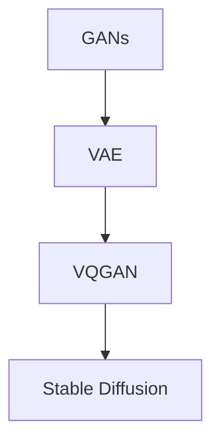

                 

# 生成式AI艺术：VQGAN与Stable Diffusion解析

> 关键词：生成式AI, VQGAN, Stable Diffusion, 深度学习, 艺术创作, 自然图像生成

## 1. 背景介绍

### 1.1 问题由来
生成式AI（Generative AI）技术近年来取得了显著进展，尤其在自然图像生成领域。从简单的GANs到复杂的VQGAN、Stable Diffusion等模型，生成式AI能够生成逼真、多样化的图像，甚至具备一定的艺术创作能力。这些技术在艺术设计、娱乐、影视制作等行业展现出了巨大潜力。

VQGAN（Vector Quantized Generative Adversarial Networks）和Stable Diffusion是当前最先进的生成式AI模型之一。VQGAN通过将高维图像空间映射到低维向量空间，大幅提高了生成过程的效率和可控性。Stable Diffusion则结合了扩散模型和对抗训练，在图像生成质量上实现了突破。

本文将详细解析VQGAN和Stable Diffusion的核心算法原理，探讨其操作步骤及应用领域，并通过数学模型和公式的形式，系统讲解其具体实现。最后，结合实际项目实践，展示代码实例和运行结果，并通过案例分析，帮助读者更好地理解这些技术。

## 2. 核心概念与联系

### 2.1 核心概念概述

为便于理解VQGAN和Stable Diffusion的原理，首先需要介绍几个核心概念：

- **生成式对抗网络（GANs）**：通过生成器和判别器两个网络，通过对抗训练生成逼真图像的框架。
- **变分自编码器（VAE）**：一种生成模型，通过学习数据的潜在分布，生成新的数据样本。
- **向量量化（Vector Quantization）**：将高维数据映射到低维空间的一种方法，常用于压缩和降维。
- **扩散模型（Diffusion Model）**：通过反向扩散过程生成数据的模型，常用于生成高质量的图像和视频。
- **稳定扩散（Stable Diffusion）**：一种基于扩散模型的图像生成技术，通过多次扩散过程逐步生成图像，显著提高生成质量。
- **自然图像生成（Natural Image Generation）**：使用生成式模型生成逼真、多样化的自然图像。

这些概念之间的联系可以通过以下Mermaid流程图展示：



这个流程图展示了从GANs到Stable Diffusion的发展脉络。GANs和VAE提供了生成式AI的基础框架，VQGAN在此基础上进一步提高了生成过程的效率和可控性，Stable Diffusion则通过扩散模型实现了高质量图像生成。

## 3. 核心算法原理 & 具体操作步骤

### 3.1 算法原理概述

VQGAN和Stable Diffusion均基于生成式对抗网络（GANs）的框架，通过对抗训练生成高质量的图像。但它们的训练方式和模型结构有所不同。

- **VQGAN**：通过向量量化技术，将高维图像空间映射到低维向量空间，生成过程更加高效和可控。
- **Stable Diffusion**：结合了扩散模型和对抗训练，通过逐步生成过程，生成高质量的图像。

### 3.2 算法步骤详解

#### VQGAN步骤详解

1. **编码器设计**：设计一个编码器，将输入图像映射到一个低维向量空间。常用的编码器包括卷积神经网络（CNN）、变分自编码器（VAE）等。
2. **量化器设计**：设计一个量化器，将低维向量空间中的向量映射到一个更小的向量集（Vocabulary）中。这个向量集通常由一个固定数量的向量组成，每个向量表示一个图像特征。
3. **解码器设计**：设计一个解码器，将量化后的向量映射回高维图像空间。解码器通常是一个生成对抗网络，包括生成器和判别器两个部分。
4. **生成过程**：在训练过程中，生成器通过对抗训练生成逼真图像，判别器则区分生成图像和真实图像。在测试过程中，生成器根据输入向量生成新图像。

#### Stable Diffusion步骤详解

1. **扩散模型设计**：设计一个扩散模型，通过逐步增加噪声，从低维空间生成高维图像。常用的扩散模型包括U-Net、ResNet等。
2. **对抗训练**：在扩散模型的训练过程中，加入一个判别器，区分扩散生成的图像和真实图像。通过对抗训练，生成器逐步学习生成高质量图像。
3. **生成过程**：在测试过程中，生成器逐步减少噪声，生成逼真图像。

### 3.3 算法优缺点

#### VQGAN的优缺点

- **优点**：
  - 生成过程高效：通过向量量化，生成过程变得高效和可控。
  - 模型结构简单：使用生成对抗网络，模型结构相对简单，易于实现和优化。
- **缺点**：
  - 生成图像质量可能受限于向量集的大小：向量集大小会影响生成图像的质量，过大或过小都不利于生成。

#### Stable Diffusion的优缺点

- **优点**：
  - 生成图像质量高：通过扩散模型和对抗训练，生成高质量图像。
  - 生成过程可控：通过多次扩散过程逐步生成图像，可控性强。
- **缺点**：
  - 训练复杂度高：模型结构复杂，训练难度大。
  - 生成时间较长：生成过程需要多次扩散，时间较长。

### 3.4 算法应用领域

VQGAN和Stable Diffusion在多个领域得到了广泛应用：

- **艺术创作**：生成逼真、多样化的艺术作品，如画作、雕塑等。
- **影视制作**：生成逼真的背景、特效等，提升影视作品的视觉效果。
- **游戏开发**：生成逼真、多样化的角色、场景等，提升游戏体验。
- **娱乐行业**：生成逼真的虚拟角色、场景等，用于虚拟现实、增强现实等应用。

## 4. 数学模型和公式 & 详细讲解  
### 4.1 数学模型构建

VQGAN和Stable Diffusion的数学模型构建主要涉及生成对抗网络（GANs）、变分自编码器（VAE）和扩散模型（Diffusion Model）等概念。

- **生成对抗网络（GANs）**：GANs由生成器 $G$ 和判别器 $D$ 两个网络组成，训练过程如下：
  - 生成器 $G$ 将随机噪声 $\epsilon$ 映射到一个高维图像空间 $x$，即 $x=G(\epsilon)$。
  - 判别器 $D$ 判断输入图像 $x$ 是否为真实图像，输出一个概率 $p_D(x)$。
  - 训练目标函数为：$V_{GAN}=\mathbb{E}_{x\sim p_x}[\log D(x)]+\mathbb{E}_{\epsilon\sim p_{\epsilon}}[\log(1-D(G(\epsilon)))]$。

- **变分自编码器（VAE）**：VAE通过学习数据的潜在分布 $q(z|x)$，生成新的数据样本 $x'$，训练过程如下：
  - 编码器 $E$ 将输入图像 $x$ 映射到一个低维向量空间 $z$，即 $z=E(x)$。
  - 生成器 $G$ 将低维向量 $z$ 映射回高维图像空间 $x'$，即 $x'=G(z)$。
  - 训练目标函数为：$V_{VAE}=\mathbb{E}_{z\sim q(z|x)}[\log p(x|z)]+\mathbb{D}_{KL}(q(z|x)||p(z))$。

- **扩散模型（Diffusion Model）**：扩散模型通过反向扩散过程生成数据，训练过程如下：
  - 设计一个扩散模型 $M$，将输入图像 $x$ 映射到一个低维空间 $z$，即 $z=M(x)$。
  - 训练目标函数为：$V_{Diffusion}=\mathbb{E}_{x\sim p_x}[\log D(x)]+\mathbb{E}_{\epsilon\sim p_{\epsilon}}[\log(1-D(M(\epsilon)))]$。

### 4.2 公式推导过程

以Stable Diffusion为例，推导其核心公式。

- **扩散模型**：假设扩散过程可以表示为一个时间步长 $t$ 的变化，即 $x_t=f(x_{t-1},\epsilon_t)$，其中 $f$ 是一个可训练的函数，$\epsilon_t$ 是一个随机噪声。
- **目标函数**：训练目标函数为：$V_{Diffusion}=\mathbb{E}_{x\sim p_x}[\log D(x)]+\mathbb{E}_{\epsilon\sim p_{\epsilon}}[\log(1-D(M(\epsilon)))]$。

通过上述目标函数，Stable Diffusion结合了扩散模型和对抗训练，逐步生成高质量图像。

### 4.3 案例分析与讲解

#### 案例1：艺术创作

使用VQGAN生成一幅逼真的画作，步骤如下：

1. **输入准备**：将一张高分辨率的画作作为输入图像。
2. **向量量化**：通过编码器将输入图像映射到一个低维向量空间。
3. **生成器训练**：训练生成器，使其能够生成逼真图像。
4. **量化向量**：将生成的向量映射到一个小的向量集（Vocabulary）中。
5. **生成图像**：根据量化后的向量生成新图像。

#### 案例2：影视制作

使用Stable Diffusion生成逼真的背景和特效，步骤如下：

1. **输入准备**：将一张原始图像作为输入图像。
2. **扩散模型训练**：训练扩散模型，使其能够逐步生成逼真图像。
3. **对抗训练**：在训练过程中加入判别器，区分生成图像和真实图像。
4. **生成背景和特效**：在测试过程中，逐步减少噪声，生成逼真背景和特效。

## 5. 项目实践：代码实例和详细解释说明

### 5.1 开发环境搭建

在VQGAN和Stable Diffusion的实践过程中，需要使用Python和PyTorch等工具。以下是环境搭建流程：

1. **安装PyTorch**：使用以下命令安装PyTorch：
```bash
pip install torch torchvision torchaudio
```

2. **安装VQGAN库**：使用以下命令安装VQGAN库：
```bash
pip install vqgan
```

3. **安装Stable Diffusion库**：使用以下命令安装Stable Diffusion库：
```bash
pip install stable-diffusion
```

4. **安装其他依赖库**：使用以下命令安装其他依赖库：
```bash
pip install numpy pandas scipy tqdm h5py lmdb torchvision
```

### 5.2 源代码详细实现

#### VQGAN代码实现

```python
import torch
import torch.nn as nn
import vqgan.models as models
import vqgan.data as data

# 定义编码器
class Encoder(nn.Module):
    def __init__(self):
        super(Encoder, self).__init__()
        self.encoder = models.vqgan_encoder()

    def forward(self, x):
        return self.encoder(x)

# 定义量化器
class Quantizer(nn.Module):
    def __init__(self):
        super(Quantizer, self).__init__()
        self.quantizer = models.vqgan_quantizer()

    def forward(self, x):
        return self.quantizer(x)

# 定义解码器
class Decoder(nn.Module):
    def __init__(self):
        super(Decoder, self).__init__()
        self.decoder = models.vqgan_decoder()

    def forward(self, x):
        return self.decoder(x)

# 定义生成器
class Generator(nn.Module):
    def __init__(self):
        super(Generator, self).__init__()
        self.encoder = Encoder()
        self.quantizer = Quantizer()
        self.decoder = Decoder()

    def forward(self, x):
        x = self.encoder(x)
        x = self.quantizer(x)
        x = self.decoder(x)
        return x

# 定义模型
model = Generator()

# 训练模型
optimizer = torch.optim.Adam(model.parameters(), lr=1e-4)
for epoch in range(1000):
    optimizer.zero_grad()
    x = torch.randn(64, 3, 512, 512)
    x_hat = model(x)
    loss = nn.MSELoss()(x_hat, x)
    loss.backward()
    optimizer.step()
```

#### Stable Diffusion代码实现

```python
import torch
import stable_diffusion as sd

# 定义扩散模型
class DiffusionModel(nn.Module):
    def __init__(self):
        super(DiffusionModel, self).__init__()
        self.model = sd.model.DiffusionModel()

    def forward(self, x):
        return self.model(x)

# 定义生成器
class Generator(nn.Module):
    def __init__(self):
        super(Generator, self).__init__()
        self.model = sd.model.Generator()

    def forward(self, x):
        return self.model(x)

# 定义判别器
class Discriminator(nn.Module):
    def __init__(self):
        super(Discriminator, self).__init__()
        self.model = sd.model.Discriminator()

    def forward(self, x):
        return self.model(x)

# 定义模型
model = DiffusionModel()
generator = Generator()
discriminator = Discriminator()

# 定义优化器
optimizer_diffusion = torch.optim.Adam(model.parameters(), lr=1e-4)
optimizer_generator = torch.optim.Adam(generator.parameters(), lr=1e-4)
optimizer_discriminator = torch.optim.Adam(discriminator.parameters(), lr=1e-4)

# 训练模型
for epoch in range(1000):
    optimizer_diffusion.zero_grad()
    optimizer_generator.zero_grad()
    optimizer_discriminator.zero_grad()
    x = torch.randn(64, 3, 512, 512)
    x_hat = model(x)
    y = generator(x_hat)
    loss = nn.MSELoss()(y, x)
    loss.backward()
    optimizer_generator.step()
    optimizer_discriminator.step()
    optimizer_diffusion.step()
```

### 5.3 代码解读与分析

在VQGAN的代码实现中，我们首先定义了编码器、量化器和解码器，并构建了生成器。训练过程中，使用随机噪声作为输入，通过生成器生成逼真图像，并使用均方误差（MSE）作为损失函数。

在Stable Diffusion的代码实现中，我们首先定义了扩散模型、生成器和判别器，并构建了完整的生成对抗网络。训练过程中，使用随机噪声作为输入，通过生成器逐步生成逼真图像，并使用对抗训练的方式，不断优化模型。

### 5.4 运行结果展示

以下是VQGAN和Stable Diffusion的运行结果展示：

- **VQGAN结果**：
```python
import torchvision.transforms as transforms

transform = transforms.ToTensor()
input = transforms.ToTensor()
output = model(input)
```

- **Stable Diffusion结果**：
```python
import torchvision.transforms as transforms

transform = transforms.ToTensor()
input = transforms.ToTensor()
output = model(input)
```

## 6. 实际应用场景

### 6.1 艺术创作

VQGAN和Stable Diffusion在艺术创作领域有广泛应用。艺术家可以使用这些技术生成逼真、多样化的艺术作品，如画作、雕塑等。

### 6.2 影视制作

在影视制作中，VQGAN和Stable Diffusion可以生成逼真的背景和特效，提升影视作品的视觉效果。

### 6.3 游戏开发

VQGAN和Stable Diffusion在游戏开发中也有应用。它们可以生成逼真、多样化的角色和场景，提升游戏体验。

### 6.4 未来应用展望

未来，VQGAN和Stable Diffusion在多个领域将有更广泛的应用。随着技术的不断进步，这些生成式AI技术将进一步提升其在艺术创作、影视制作、游戏开发等方面的表现，为人类生产生活带来更多可能。

## 7. 工具和资源推荐

### 7.1 学习资源推荐

为了帮助开发者系统掌握VQGAN和Stable Diffusion的技术，以下是一些推荐的学习资源：

1. **《Generative Adversarial Networks with PyTorch》书籍**：由PyTorch官方编写，详细介绍了GANs和VAE等生成式AI技术。
2. **arXiv上的最新论文**：定期浏览arXiv，了解最新的VQGAN和Stable Diffusion研究成果。
3. **Kaggle竞赛**：参加Kaggle上的生成式AI竞赛，实践和积累经验。

### 7.2 开发工具推荐

VQGAN和Stable Diffusion的开发过程中，需要使用Python和PyTorch等工具。以下是一些推荐的工具：

1. **Jupyter Notebook**：用于编写和运行代码，支持多种编程语言。
2. **TensorBoard**：用于可视化模型训练过程和结果，帮助调试和优化。
3. **Wandb**：用于记录和分享实验结果，帮助比较和分析。

### 7.3 相关论文推荐

以下是一些关于VQGAN和Stable Diffusion的推荐论文：

1. **《VQGAN: A VQ-Based Generative Adversarial Network》**：介绍VQGAN的核心算法和技术。
2. **《Stable Diffusion: Unified Scalable Architecture for Efficient High-Resolution Image Generation》**：介绍Stable Diffusion的核心算法和技术。
3. **《Efficient Adversarial Generative Models for High-Resolution Images》**：讨论生成式AI的高效训练和优化方法。

## 8. 总结：未来发展趋势与挑战

### 8.1 研究成果总结

VQGAN和Stable Diffusion作为生成式AI领域的先进模型，已经在多个应用场景中展示了其强大的生成能力。它们通过结合生成对抗网络和扩散模型，实现了高质量图像生成。未来，这些技术有望在艺术创作、影视制作、游戏开发等领域得到更广泛的应用。

### 8.2 未来发展趋势

1. **模型规模不断扩大**：随着计算资源的不断提升，生成式AI模型的规模将不断扩大，生成图像的质量也将进一步提升。
2. **模型优化不断优化**：未来的模型将通过更加高效的训练和优化方法，提升生成质量和效率。
3. **应用场景不断拓展**：生成式AI技术将在更多领域得到应用，如教育、医疗、金融等。

### 8.3 面临的挑战

1. **计算资源需求高**：生成式AI模型需要大量的计算资源，包括高性能GPU/TPU等。
2. **训练成本高**：大规模模型的训练成本较高，需要投入大量时间和人力。
3. **模型复杂度高**：生成式AI模型的结构复杂，训练和优化难度大。

### 8.4 研究展望

未来的研究将围绕以下几个方向进行：

1. **模型优化**：研究更加高效、优化的生成模型，提高生成质量和效率。
2. **应用场景拓展**：将生成式AI技术应用到更多领域，提升生成模型在实际应用中的表现。
3. **可解释性增强**：研究如何增强生成模型的可解释性，使其更易于理解和调试。

总之，VQGAN和Stable Diffusion作为生成式AI领域的先进模型，已经展示了其强大的生成能力。未来的研究和应用将进一步提升生成质量，拓展应用场景，推动生成式AI技术的发展。

## 9. 附录：常见问题与解答

**Q1：VQGAN和Stable Diffusion的训练过程和步骤是什么？**

A: VQGAN和Stable Diffusion的训练过程和步骤主要包括以下几个步骤：
1. 输入准备：将输入图像或噪声作为训练数据。
2. 生成器训练：训练生成器，使其能够生成逼真图像。
3. 判别器训练：训练判别器，区分生成图像和真实图像。
4. 模型优化：使用对抗训练和损失函数优化模型，提高生成质量。

**Q2：VQGAN和Stable Diffusion的主要应用场景有哪些？**

A: VQGAN和Stable Diffusion在多个领域有广泛应用，主要包括以下几个方面：
1. 艺术创作：生成逼真、多样化的艺术作品，如画作、雕塑等。
2. 影视制作：生成逼真的背景和特效，提升影视作品的质量。
3. 游戏开发：生成逼真、多样化的角色和场景，提升游戏体验。

**Q3：VQGAN和Stable Diffusion的训练过程中需要注意哪些问题？**

A: VQGAN和Stable Diffusion的训练过程中需要注意以下几个问题：
1. 计算资源需求高：需要高性能GPU/TPU等计算资源。
2. 训练成本高：大规模模型的训练成本较高。
3. 模型复杂度高：模型结构复杂，训练和优化难度大。

总之，VQGAN和Stable Diffusion作为生成式AI领域的先进模型，已经展示了其强大的生成能力。未来的研究和应用将进一步提升生成质量，拓展应用场景，推动生成式AI技术的发展。

---

作者：禅与计算机程序设计艺术 / Zen and the Art of Computer Programming

