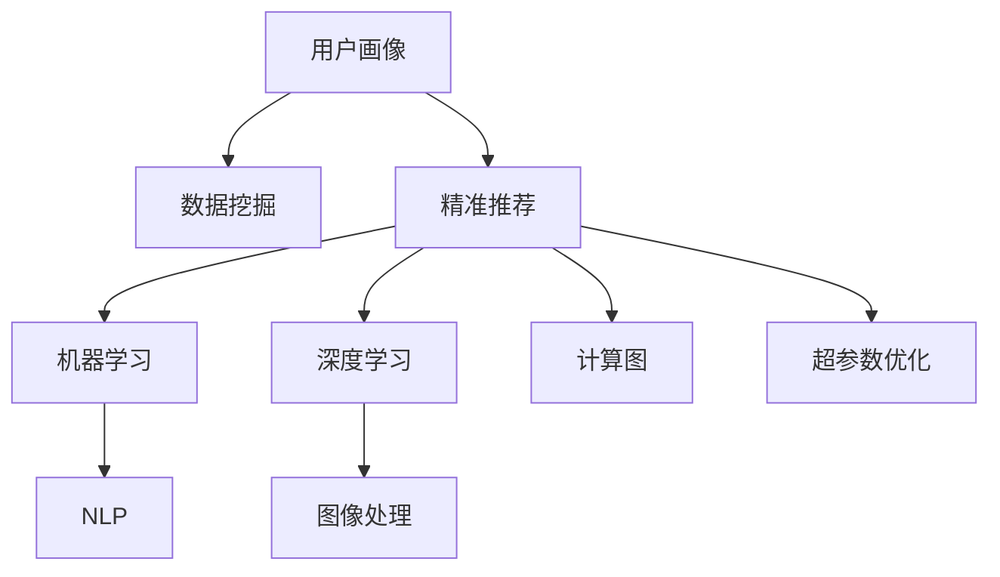

                 

# 用户画像：AI如何实现精准推荐

> 关键词：用户画像, 精准推荐, AI, 数据挖掘, 机器学习, 深度学习, 自然语言处理, 图像处理, 计算图, 超参数优化, 推荐系统, 推荐算法, 协同过滤, 内容过滤, 混合推荐

## 1. 背景介绍

### 1.1 问题由来

随着互联网技术的快速发展，我们每天都在产生大量的数据。从我们的点击记录、浏览历史、购买行为，到我们的兴趣喜好、社交网络，这些数据为我们提供了丰富的信息，可以用来挖掘我们的用户画像，为个性化推荐提供支持。但是，这些数据量之大、类型之多、维度之广，使得传统的数据处理方法显得力不从心。因此，AI技术，特别是机器学习和深度学习，成为了我们挖掘用户画像、实现精准推荐的重要手段。

### 1.2 问题核心关键点

在用户画像和推荐系统的构建过程中，如何从数据中挖掘出用户的特征、如何构建精准的推荐模型、如何优化推荐算法的性能，是我们需要重点关注的问题。这些问题可以通过AI技术来解决，使得推荐系统能够更好地满足用户需求，提升用户体验。

### 1.3 问题研究意义

构建精准的推荐系统，能够帮助我们发现用户的潜在兴趣，提升广告投放的精准度，增强用户的粘性，提高电商平台的销售额。在内容提供方如视频网站、新闻网站等，推荐系统能够提供更加个性化的内容，提升用户的满意度，从而提升整体的流量和收益。因此，AI技术在推荐系统中的应用，对提高用户体验、增加企业收益具有重要意义。

## 2. 核心概念与联系

### 2.1 核心概念概述

为更好地理解AI如何实现精准推荐，本节将介绍几个关键概念：

- 用户画像(User Profile)：指通过数据挖掘和分析，从用户的行为数据中挖掘出用户的基本特征、兴趣喜好、行为习惯等，从而构建出用户的详细画像。
- 精准推荐(Precision Recommendation)：指通过AI技术，构建推荐模型，根据用户画像，提供符合用户需求的推荐内容。
- 数据挖掘(Data Mining)：指从大量数据中挖掘出有价值的信息和知识的过程，包括数据清洗、特征提取、模型训练等。
- 机器学习(Machine Learning)：指通过算法和模型，从数据中学习规律和知识，并应用这些知识进行预测和决策。
- 深度学习(Deep Learning)：指通过多层神经网络，从数据中学习更复杂的特征和规律，提升模型的性能。
- 自然语言处理(Natural Language Processing, NLP)：指通过AI技术处理和分析人类语言，包括文本分类、情感分析、语义理解等。
- 图像处理(Image Processing)：指通过AI技术处理和分析图像，包括图像分类、目标检测、图像生成等。
- 计算图(Computation Graph)：指通过构建计算图，实现高效的模型训练和推理过程。
- 超参数优化(Hyperparameter Optimization)：指通过优化模型的超参数，提升模型的性能和泛化能力。

这些概念之间的逻辑关系可以通过以下Mermaid流程图来展示：



这个流程图展示了大语言模型的核心概念及其之间的关系：

1. 用户画像通过数据挖掘获取。
2. 精准推荐利用机器学习构建模型，利用深度学习提升模型性能。
3. NLP和图像处理为推荐系统提供多模态数据支持。
4. 计算图优化模型训练和推理过程。
5. 超参数优化提升模型效果。

这些概念共同构成了推荐系统的构建框架，使得推荐系统能够高效、精准地为用户服务。

## 3. 核心算法原理 & 具体操作步骤
### 3.1 算法原理概述

AI实现精准推荐的核心在于通过构建推荐模型，从用户画像中挖掘用户特征，根据用户的历史行为数据和兴趣喜好，预测用户对某一内容或商品的兴趣度，从而进行个性化推荐。推荐算法可以分为两大类：基于内容的推荐和基于协同过滤的推荐。

基于内容的推荐指的是根据用户对某一内容的历史行为数据，推荐内容相似的其他内容。基于协同过滤的推荐则是根据用户与物品之间的交互行为，寻找兴趣相似的其他用户，推荐他们感兴趣的内容。两种推荐算法各有优缺点，可以结合使用，形成混合推荐系统。

### 3.2 算法步骤详解

#### 3.2.1 数据准备

1. **数据收集**：从用户的历史行为数据中收集数据，包括点击记录、浏览历史、购买行为等。
2. **数据清洗**：对数据进行清洗和处理，去除噪声和异常值，处理缺失值和重复值。
3. **特征提取**：从清洗后的数据中提取有用的特征，包括用户特征、物品特征和交互特征等。

#### 3.2.2 模型构建

1. **模型选择**：根据数据类型和推荐任务，选择合适的推荐算法，包括协同过滤、内容过滤、混合推荐等。
2. **模型训练**：使用训练集数据，训练推荐模型。在模型训练过程中，可以应用超参数优化技术，提升模型的性能。
3. **模型评估**：使用测试集数据，评估推荐模型的性能，如准确率、召回率、F1值等。

#### 3.2.3 推荐过程

1. **用户画像获取**：根据用户的历史行为数据，构建用户画像，包括用户的兴趣、喜好、行为习惯等。
2. **推荐内容获取**：根据用户画像和推荐模型，获取符合用户需求的推荐内容。
3. **推荐展示**：将推荐内容展示给用户，根据用户反馈进行优化。

### 3.3 算法优缺点

AI推荐算法具有以下优点：

- **精准度高**：通过挖掘用户特征和构建精准的推荐模型，能够提供符合用户需求的推荐内容。
- **用户粘度高**：个性化推荐能够提升用户的满意度和体验，增强用户的粘性。
- **高效性**：利用AI技术，能够快速处理和分析大量数据，实现高效推荐。

同时，这些算法也存在一些局限性：

- **冷启动问题**：对于新用户，缺乏足够的行为数据，难以构建精准的用户画像，从而无法进行有效的推荐。
- **数据稀疏性**：用户的行为数据可能比较稀疏，导致模型的推荐精度不高。
- **多样性问题**：推荐算法可能偏向于推荐相似内容，导致推荐内容单一，缺乏多样性。
- **隐私问题**：用户行为数据涉及用户的隐私，如何保护用户数据，成为推荐系统面临的重要问题。

尽管存在这些局限性，但AI推荐算法仍然在电子商务、视频网站、新闻网站等诸多领域得到了广泛应用，成为提升用户体验、增加收益的重要手段。

### 3.4 算法应用领域

AI推荐算法在以下领域得到了广泛应用：

- **电商推荐系统**：如淘宝、京东等电商平台，通过个性化推荐，提升用户购物体验，增加销售额。
- **视频推荐系统**：如Netflix、YouTube等视频网站，通过推荐相似的视频内容，提升用户满意度。
- **新闻推荐系统**：如今日头条、腾讯新闻等新闻网站，通过推荐符合用户兴趣的内容，提升用户粘性。
- **社交网络推荐系统**：如微信、微博等社交网络，通过推荐用户感兴趣的朋友和内容，增强用户的活跃度。
- **旅游推荐系统**：如携程、去哪儿等旅游平台，通过推荐符合用户兴趣的旅游目的地，提升用户预订量。

此外，AI推荐算法还被应用于广告投放、金融风控、智能客服等众多领域，为各行各业带来新的机遇。

## 4. 数学模型和公式 & 详细讲解 & 举例说明

### 4.1 数学模型构建

假设推荐系统包含用户集 $U$、物品集 $V$、交互集 $I$，其中 $U \times V$ 表示用户与物品之间的交互行为，$i$ 表示具体的交互行为。设 $D$ 为训练集，$D_{train}$ 和 $D_{test}$ 分别为训练集和测试集。推荐系统的目标是构建一个推荐函数 $f(u,v)$，根据用户 $u$ 和物品 $v$ 的特征，预测用户对物品的兴趣度。

设用户 $u$ 的特征向量为 $x_u$，物品 $v$ 的特征向量为 $x_v$，交互 $i$ 的特征向量为 $x_i$，用户与物品之间的交互向量为 $x_{u,i,v}$，用户画像为 $P_u$，物品画像为 $P_v$。推荐函数 $f(u,v)$ 可以表示为：

$$
f(u,v) = \sum_{i \in I} \alpha_i \cdot f_i(x_{u,i,v})
$$

其中 $f_i(x_{u,i,v})$ 表示交互特征对推荐结果的贡献，$\alpha_i$ 为系数，表示不同交互特征的重要性。

### 4.2 公式推导过程

以协同过滤推荐为例，协同过滤推荐算法的基本思想是找到与用户 $u$ 兴趣相似的其他用户 $v$，从而推荐用户 $v$ 感兴趣的物品。假设推荐系统的用户画像为 $P_u = [x_u, x_{u,i,v}]$，物品画像为 $P_v = [x_v, x_{v,i,u}]$，其中 $x_{u,i,v}$ 和 $x_{v,i,u}$ 分别为用户与物品之间的交互特征。推荐函数 $f(u,v)$ 可以表示为：

$$
f(u,v) = \sum_{v \in V} \alpha_v \cdot f_v(P_u, P_v)
$$

其中 $f_v(P_u, P_v)$ 表示用户画像和物品画像对推荐结果的贡献，$\alpha_v$ 为系数，表示不同物品画像的重要性。

在协同过滤推荐中，用户画像和物品画像的计算可以采用矩阵分解的方法，即：

$$
P_u = X_u \cdot A \cdot Y_u
$$
$$
P_v = X_v \cdot A \cdot Y_v
$$

其中 $X_u$ 和 $X_v$ 分别为用户和物品的特征矩阵，$A$ 为相似度矩阵，$Y_u$ 和 $Y_v$ 分别为用户和物品的特征向量。

### 4.3 案例分析与讲解

假设有一个电商网站，需要对用户进行个性化推荐。通过收集用户的历史行为数据，构建用户画像 $P_u$，包括用户的兴趣、喜好、行为习惯等。设 $x_u$ 为用户的兴趣向量，$x_{u,i,v}$ 为用户的交互向量，$x_v$ 为物品的特征向量，$x_{v,i,u}$ 为物品的交互向量。根据用户画像和物品画像，可以计算推荐函数 $f(u,v)$：

$$
f(u,v) = \alpha_{x_u} \cdot f_{x_u}(x_{u,i,v}) + \alpha_{x_{u,i,v}} \cdot f_{x_{u,i,v}}(P_u, P_v)
$$

其中 $f_{x_u}(x_{u,i,v})$ 表示用户兴趣对推荐结果的贡献，$f_{x_{u,i,v}}(P_u, P_v)$ 表示用户与物品之间的交互特征对推荐结果的贡献，$\alpha_{x_u}$ 和 $\alpha_{x_{u,i,v}}$ 为系数，表示不同特征的重要性。

在实际应用中，推荐算法还需要考虑模型的复杂度、训练时间、计算资源等因素，进行模型选择和超参数优化，以提升推荐系统的性能。

## 5. 项目实践：代码实例和详细解释说明
### 5.1 开发环境搭建

在进行推荐系统开发前，我们需要准备好开发环境。以下是使用Python进行Scikit-learn开发的环境配置流程：

1. 安装Anaconda：从官网下载并安装Anaconda，用于创建独立的Python环境。

2. 创建并激活虚拟环境：
```bash
conda create -n recsys-env python=3.8 
conda activate recsys-env
```

3. 安装Scikit-learn：使用pip安装Scikit-learn库，安装方法为：
```bash
pip install scikit-learn
```

4. 安装各类工具包：
```bash
pip install numpy pandas scikit-learn matplotlib tqdm jupyter notebook ipython
```

完成上述步骤后，即可在`recsys-env`环境中开始推荐系统开发。

### 5.2 源代码详细实现

下面以协同过滤推荐为例，给出使用Scikit-learn实现推荐系统的PyTorch代码实现。

首先，定义推荐函数：

```python
from sklearn.metrics.pairwise import cosine_similarity
from sklearn.decomposition import TruncatedSVD

def collaborative_filtering(user_profile, item_profile):
    # 计算用户和物品的相似度
    similarity_matrix = cosine_similarity(user_profile, item_profile)
    # 对相似度矩阵进行分解，得到用户画像和物品画像
    svd = TruncatedSVD(n_components=10, random_state=42)
    user_profile_reduced = svd.fit_transform(user_profile)
    item_profile_reduced = svd.transform(item_profile)
    # 计算推荐结果
    recommendations = user_profile_reduced.dot(similarity_matrix) * item_profile_reduced.T
    return recommendations
```

然后，定义数据处理函数：

```python
import pandas as pd

def load_data(path):
    # 读取数据集
    data = pd.read_csv(path)
    # 数据清洗
    data = data.dropna()
    # 特征提取
    X = data[['user_id', 'item_id', 'rating']]
    Y = data['item_id']
    return X, Y
```

接着，定义训练和评估函数：

```python
from sklearn.model_selection import train_test_split
from sklearn.metrics import mean_squared_error

def train_model(X, Y, val_fraction=0.2):
    # 划分训练集和验证集
    X_train, X_val, Y_train, Y_val = train_test_split(X, Y, test_size=val_fraction, random_state=42)
    # 训练模型
    model = collaborative_filtering(X_train, X_val)
    # 计算误差
    mse = mean_squared_error(Y_train, model)
    return mse
```

最后，启动训练流程并在测试集上评估：

```python
X, Y = load_data('data.csv')
mse = train_model(X, Y)
print(f"Mean Squared Error: {mse:.2f}")
```

以上就是使用Scikit-learn实现协同过滤推荐的完整代码实现。可以看到，Scikit-learn提供了一套简单易用的API，使得推荐系统开发变得简单高效。

### 5.3 代码解读与分析

让我们再详细解读一下关键代码的实现细节：

**load_data函数**：
- 读取数据集，并进行清洗和特征提取。

**collaborative_filtering函数**：
- 使用余弦相似度计算用户和物品的相似度矩阵。
- 对相似度矩阵进行SVD分解，得到用户画像和物品画像。
- 计算推荐结果。

**train_model函数**：
- 划分训练集和验证集。
- 在训练集上训练模型。
- 在验证集上计算误差。

**train_model函数**：
- 将数据集加载到X、Y中。
- 训练模型并输出误差。

这些代码实现展示了推荐系统开发的基本流程和核心思想。在实际应用中，还需要根据具体任务进行进一步优化，如引入更多的特征、调整相似度计算方法、优化模型训练等。

## 6. 实际应用场景
### 6.1 电商推荐系统

电商推荐系统是推荐系统中最典型的应用之一。通过收集用户的浏览、点击、购买行为数据，构建用户画像和物品画像，使用协同过滤、内容过滤、混合推荐等方法，为每个用户推荐符合其兴趣的商品。电商推荐系统能够提升用户的购物体验，增加销售额，推动电商业务的增长。

### 6.2 视频推荐系统

视频推荐系统通过收集用户的观看历史、评分、点击行为等数据，构建用户画像和视频画像，使用协同过滤、内容过滤等方法，为每个用户推荐符合其兴趣的视频内容。视频推荐系统能够提升用户的观看体验，增加平台的用户粘性和观看时长，推动平台业务的发展。

### 6.3 社交网络推荐系统

社交网络推荐系统通过收集用户的社交关系、兴趣标签、互动行为等数据，构建用户画像和内容画像，使用协同过滤、内容过滤等方法，为每个用户推荐符合其兴趣的社交内容和用户。社交网络推荐系统能够提升用户的活跃度，增加平台的用户粘性，推动平台业务的增长。

### 6.4 未来应用展望

随着AI技术的不断发展，推荐系统在未来的应用场景将更加广泛，能够推动更多行业的发展。

- **医疗推荐系统**：通过收集用户的健康数据、病史、医疗行为等数据，构建用户画像和医疗内容画像，使用协同过滤、内容过滤等方法，为每个用户推荐符合其健康需求和兴趣的医疗内容。医疗推荐系统能够提升用户的健康管理水平，推动健康领域的数字化转型。
- **教育推荐系统**：通过收集学生的学习数据、兴趣、互动行为等数据，构建学生画像和课程内容画像，使用协同过滤、内容过滤等方法，为每个学生推荐符合其学习需求和兴趣的课程内容。教育推荐系统能够提升学生的学习效果，推动教育领域的数字化转型。
- **金融推荐系统**：通过收集用户的财务数据、投资行为、市场动态等数据，构建用户画像和金融产品画像，使用协同过滤、内容过滤等方法，为每个用户推荐符合其投资需求和兴趣的金融产品。金融推荐系统能够提升用户的投资效果，推动金融领域的数字化转型。

这些未来应用场景展示了推荐系统在各行各业中的广泛应用，能够推动更多领域的发展和进步。

## 7. 工具和资源推荐
### 7.1 学习资源推荐

为了帮助开发者系统掌握推荐系统的理论和实践，这里推荐一些优质的学习资源：

1. 《推荐系统原理与算法》系列博文：由大模型技术专家撰写，深入浅出地介绍了推荐系统的原理、算法和应用。

2. Coursera《机器学习》课程：由斯坦福大学教授Andrew Ng开设的机器学习课程，详细讲解了机器学习的原理和算法，适合入门学习。

3. 《深度学习》书籍：Ian Goodfellow等著，全面介绍了深度学习的原理和应用，推荐学习。

4. Kaggle推荐系统竞赛：通过参与Kaggle推荐系统竞赛，积累推荐系统的实践经验。

5. Arxiv论文推荐：通过阅读最新推荐系统的论文，掌握推荐系统的前沿技术和进展。

通过对这些资源的学习实践，相信你一定能够快速掌握推荐系统的精髓，并用于解决实际的推荐问题。

### 7.2 开发工具推荐

高效的开发离不开优秀的工具支持。以下是几款用于推荐系统开发的常用工具：

1. Scikit-learn：Python数据科学库，提供了简单易用的API，适合快速原型开发和算法实现。

2. TensorFlow：Google主导的深度学习框架，生产部署方便，适合大规模工程应用。

3. PyTorch：Facebook主导的深度学习框架，灵活动态的计算图，适合研究型应用。

4. Weights & Biases：模型训练的实验跟踪工具，可以记录和可视化模型训练过程中的各项指标，方便对比和调优。

5. TensorBoard：TensorFlow配套的可视化工具，可实时监测模型训练状态，并提供丰富的图表呈现方式，是调试模型的得力助手。

合理利用这些工具，可以显著提升推荐系统的开发效率，加快创新迭代的步伐。

### 7.3 相关论文推荐

推荐系统领域的研究非常活跃，以下是几篇奠基性的相关论文，推荐阅读：

1. "Collaborative Filtering for Implicit Feedback Datasets"（隐式反馈数据集上的协同过滤）：提出基于隐式反馈数据的协同过滤算法，为推荐系统提供新的思路。

2. "The BellKor 2011 PPCF Challenge: Modeling Massive Heterogeneous Data"（BellKor 2011 PPCF挑战赛：建模大规模异构数据）：提出使用矩阵分解和协同过滤方法，解决大规模异构数据推荐问题。

3. "Multi-view recommender systems"（多视角推荐系统）：提出使用多视角数据融合的方法，提升推荐系统的性能。

4. "Deep Collaborative Filtering"（深度协同过滤）：提出使用深度神经网络，提升协同过滤推荐系统的性能。

5. "Adversarial Robustness of Deep Recommendation Models"（深度推荐模型的鲁棒性）：提出使用对抗训练的方法，提升推荐模型的鲁棒性和抗干扰能力。

这些论文代表了大语言模型微调技术的发展脉络。通过学习这些前沿成果，可以帮助研究者把握学科前进方向，激发更多的创新灵感。

## 8. 总结：未来发展趋势与挑战
### 8.1 总结

本文对AI如何实现精准推荐的理论进行了全面系统的介绍。首先阐述了推荐系统的核心思想和关键概念，明确了推荐系统在提升用户体验、增加收益方面的独特价值。其次，从原理到实践，详细讲解了推荐系统的构建方法和核心步骤，给出了推荐系统开发的完整代码实现。同时，本文还广泛探讨了推荐系统在电商、视频、社交网络等多个行业领域的应用前景，展示了推荐系统在各行各业中的广泛应用。此外，本文精选了推荐系统的各类学习资源，力求为读者提供全方位的技术指引。

通过本文的系统梳理，可以看到，AI技术在推荐系统中的应用，正在成为推动各行各业数字化转型的重要手段。这些技术的突破和发展，将进一步提升用户的体验和满意度，推动各行业的数字化进程，创造更多的价值和机遇。

### 8.2 未来发展趋势

展望未来，推荐系统将呈现以下几个发展趋势：

1. **多模态融合**：推荐系统将逐步引入更多模态的数据，如视觉、语音、文本等，实现多模态数据的融合，提升推荐系统的性能。

2. **实时推荐**：推荐系统将逐步实现实时推荐，提升用户体验和满意度。

3. **个性化推荐**：推荐系统将逐步实现更个性化的推荐，提升用户的粘性和满意度。

4. **混合推荐**：推荐系统将逐步采用混合推荐的方法，结合协同过滤、内容过滤、基于规则等方法，提升推荐系统的性能。

5. **知识图谱融合**：推荐系统将逐步引入知识图谱，实现领域知识与推荐系统的融合，提升推荐系统的质量和鲁棒性。

6. **人工智能驱动**：推荐系统将逐步引入更多人工智能技术，如深度学习、自然语言处理等，提升推荐系统的性能和效果。

这些趋势将推动推荐系统不断发展和进步，为各行业带来更多的价值和机遇。

### 8.3 面临的挑战

尽管推荐系统已经取得了巨大的成功，但在迈向更加智能化、普适化应用的过程中，它仍面临着诸多挑战：

1. **冷启动问题**：对于新用户，缺乏足够的行为数据，难以构建精准的用户画像，从而无法进行有效的推荐。

2. **数据稀疏性**：用户的行为数据可能比较稀疏，导致模型的推荐精度不高。

3. **多样性问题**：推荐算法可能偏向于推荐相似内容，导致推荐内容单一，缺乏多样性。

4. **隐私问题**：用户行为数据涉及用户的隐私，如何保护用户数据，成为推荐系统面临的重要问题。

5. **计算资源限制**：推荐系统需要处理大规模数据和复杂模型，对计算资源的要求较高。

6. **可解释性问题**：推荐算法的决策过程难以解释，缺乏透明性。

尽管存在这些挑战，但推荐系统在未来的发展中将逐步克服这些问题，实现更加智能、普适的推荐服务。

### 8.4 研究展望

面对推荐系统面临的挑战，未来的研究需要在以下几个方面寻求新的突破：

1. **多模态数据融合**：通过引入更多模态的数据，实现多模态数据的融合，提升推荐系统的性能。

2. **实时推荐系统**：通过引入实时数据处理技术，实现实时推荐系统，提升用户体验和满意度。

3. **个性化推荐**：通过引入更加复杂的个性化推荐算法，提升推荐系统的个性化程度，提升用户的粘性和满意度。

4. **混合推荐算法**：通过引入更多的推荐算法，如协同过滤、内容过滤、基于规则等方法，提升推荐系统的性能。

5. **知识图谱融合**：通过引入知识图谱，实现领域知识与推荐系统的融合，提升推荐系统的质量和鲁棒性。

6. **人工智能驱动**：通过引入更多人工智能技术，如深度学习、自然语言处理等，提升推荐系统的性能和效果。

这些研究方向将推动推荐系统不断发展和进步，为各行业带来更多的价值和机遇。

## 9. 附录：常见问题与解答
**Q1：推荐系统是否适用于所有场景？**

A: 推荐系统在很多场景中都可以得到应用，但具体的效果取决于数据的丰富程度、用户行为的稀疏程度等因素。对于数据量较小、用户行为较少的场景，推荐系统的效果可能不佳。因此，需要根据具体场景选择合适的方法和工具。

**Q2：如何提高推荐系统的准确率？**

A: 提高推荐系统的准确率需要从数据、算法和模型等多个方面进行优化：

1. **数据清洗**：对数据进行清洗和预处理，去除噪声和异常值，处理缺失值和重复值。
2. **特征工程**：对数据进行特征提取和处理，构建更加全面的特征集。
3. **算法选择**：选择合适的推荐算法，如协同过滤、内容过滤、混合推荐等。
4. **模型优化**：通过超参数优化、模型融合等方法，提升模型的性能。
5. **实时推荐**：通过引入实时数据处理技术，实现实时推荐系统，提升用户体验和满意度。

**Q3：推荐系统如何应对冷启动问题？**

A: 应对冷启动问题，可以采用以下方法：

1. **基于内容的推荐**：通过分析用户的基本信息、兴趣爱好等，推荐符合其兴趣的内容。
2. **基于规则的推荐**：通过定义规则，推荐符合规则的内容。
3. **社交推荐**：通过分析用户的社交网络关系，推荐其朋友和社区中的内容。
4. **混合推荐**：结合多种推荐方法，提升推荐系统的性能。

这些方法能够在一定程度上缓解冷启动问题，提升推荐系统的性能。

**Q4：推荐系统如何保护用户隐私？**

A: 保护用户隐私是推荐系统的重要问题，可以采用以下方法：

1. **匿名化处理**：对用户数据进行匿名化处理，保护用户隐私。
2. **数据加密**：对用户数据进行加密处理，防止数据泄露。
3. **隐私控制**：在推荐系统中引入隐私控制机制，限制对用户数据的访问和使用。
4. **用户授权**：在推荐系统中引入用户授权机制，让用户自主选择是否分享其数据。

这些方法能够在一定程度上保护用户隐私，提升推荐系统的可信度。

**Q5：推荐系统如何实现个性化推荐？**

A: 实现个性化推荐需要从多个方面进行优化：

1. **用户画像**：通过分析用户的历史行为数据，构建精准的用户画像，包括用户的兴趣、喜好、行为习惯等。
2. **内容画像**：通过分析物品的属性和特征，构建精准的物品画像，包括物品的类别、属性、用户评价等。
3. **推荐算法**：选择合适的推荐算法，如协同过滤、内容过滤、混合推荐等。
4. **模型优化**：通过超参数优化、模型融合等方法，提升推荐算法的性能。
5. **实时推荐**：通过引入实时数据处理技术，实现实时推荐系统，提升用户体验和满意度。

这些方法能够在一定程度上实现个性化推荐，提升推荐系统的性能。

这些常见问题及其解答展示了推荐系统的应用场景和挑战，帮助开发者更好地理解推荐系统，并解决实际问题。

