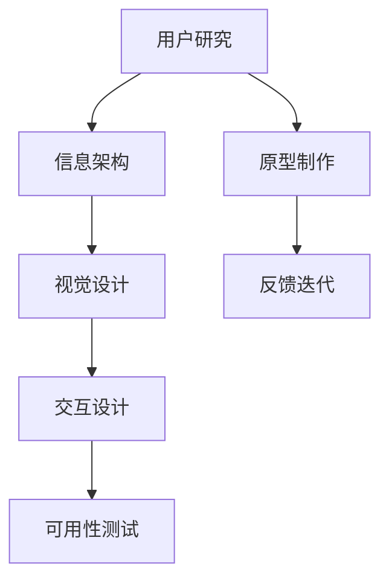

                 

# 用户界面设计：打造友好易用的人机交互体验

## 1. 背景介绍

### 1.1 问题由来

随着科技的飞速发展，用户体验（User Experience, UX）在各种产品和应用中变得越来越重要。优秀的用户界面设计（User Interface Design, UI Design）能够有效提升产品的可用性、易用性和吸引力，增加用户粘性，从而提升商业价值。无论是移动应用、网站、桌面软件还是物联网设备，界面设计都是其核心竞争力之一。

### 1.2 问题核心关键点

UI设计涉及到许多复杂且相互关联的元素，包括用户研究、信息架构、视觉设计、交互设计等。优秀的UI设计能够使产品易学易用，帮助用户快速完成任务，从而提升用户满意度和产品价值。然而，UI设计并非易事，它需要设计师具备广泛的知识面、创新的思维以及敏锐的用户洞察力。

### 1.3 问题研究意义

UI设计作为用户体验设计的一部分，其重要性不言而喻。良好的UI设计不仅可以提升用户满意度，还能降低用户的学习成本，增加产品的竞争力。通过深入研究UI设计，设计师可以更好地理解用户需求，创造更加符合用户期望的产品。

## 2. 核心概念与联系

### 2.1 核心概念概述

为更好地理解UI设计，本节将介绍几个密切相关的核心概念：

- **用户研究（User Research）**：通过调查、访谈、观察等手段，深入了解用户需求和使用习惯，从而指导UI设计。
- **信息架构（Information Architecture, IA）**：设计信息组织的框架，使其逻辑清晰、易于理解，帮助用户快速找到所需信息。
- **视觉设计（Visual Design）**：使用色彩、形状、排版等视觉元素，构建美观、一致的界面风格。
- **交互设计（Interaction Design, ID）**：设计用户与系统交互的流程和方式，提升交互的直观性和效率。
- **可用性测试（Usability Testing）**：通过测试用户使用产品的过程，评估产品的易用性和性能。

这些核心概念之间的逻辑关系可以通过以下Mermaid流程图来展示：



这个流程图展示了许多核心概念及其之间的关系：

1. 用户研究是信息架构、视觉设计和交互设计的基础。
2. 信息架构提供了视觉设计和交互设计的结构框架。
3. 视觉设计是交互设计的视觉展现。
4. 可用性测试是整个设计流程的反馈环节，指导原型制作和迭代改进。

## 3. 核心算法原理 & 具体操作步骤
### 3.1 算法原理概述

UI设计并非算法驱动，但通过系统化的设计和测试方法论，可以提升设计的科学性和精确度。以下是UI设计中常用的几个基本原则：

- **一致性（Consistency）**：界面元素风格、布局、交互方式等应保持一致，帮助用户快速理解。
- **直观性（Intuitiveness）**：用户应能直观地理解和使用产品，避免繁琐的引导和学习过程。
- **可访问性（Accessibility）**：设计应考虑不同用户（如老年人、色盲用户等）的需求，使产品尽可能普适。
- **反馈（Feedback）**：用户操作后，系统应立即给予反馈，让用户知道操作结果。
- **无障碍（Affordance）**：用户应能通过观察和交互自然地理解元素的功能，无需额外学习。

### 3.2 算法步骤详解

UI设计通常包括以下几个关键步骤：

**Step 1: 用户研究**
- 通过调查问卷、用户访谈、焦点小组等方式，收集用户的基本信息和需求。
- 使用分析工具（如Google Analytics）收集用户行为数据。

**Step 2: 信息架构**
- 梳理核心功能，设计信息组织的框架，包括导航结构、内容分类等。
- 使用工具（如Miro、Lucidchart）制作信息架构图。

**Step 3: 原型制作**
- 使用工具（如Sketch、Figma）制作初步界面原型，进行用户测试。
- 根据用户反馈不断迭代改进，形成最终设计方案。

**Step 4: 视觉设计**
- 设计界面元素的颜色、字体、图标等视觉元素，保持风格一致。
- 使用工具（如Adobe XD、Sketch）进行视觉设计。

**Step 5: 交互设计**
- 设计用户与系统的交互方式，如按钮、菜单、手势等。
- 使用工具（如InVision、Principle）制作交互动画和交互原型。

**Step 6: 可用性测试**
- 设计测试任务，邀请用户测试界面，记录用户操作过程和反馈。
- 使用工具（如UserTesting、Lookback）进行远程测试，评估易用性。

**Step 7: 反馈迭代**
- 根据测试结果不断优化界面设计，形成最终产品。
- 上线后继续收集用户反馈，进行持续改进。

以上是UI设计的一般流程。在实际应用中，还需要根据具体项目需求，对各个环节进行优化设计，如改进测试方法、优化视觉设计等，以进一步提升设计质量。

### 3.3 算法优缺点

UI设计的优点在于其科学性、系统性和可测试性，能够确保设计的质量和用户的满意度。然而，设计过程中需要大量的人力和时间投入，特别是在前期用户研究和信息架构设计阶段。同时，设计结果的最终效果也依赖于设计师的个人经验和创造力，存在一定的局限性。

## 4. 数学模型和公式 & 详细讲解  
### 4.1 数学模型构建

UI设计虽然不涉及复杂的数学模型，但可以通过统计学和心理学的方法来评估设计效果。以下是一些常用的评估指标：

- **任务完成时间（Time to Task Completion）**：衡量用户完成任务所需的时间。
- **错误率（Error Rate）**：衡量用户完成任务时犯错的次数。
- **用户满意度（User Satisfaction）**：通过调查问卷收集用户的主观反馈。
- **认知负荷（Cognitive Load）**：衡量用户完成任务所需的认知努力。

这些指标可以通过调查问卷、操作日志等方式进行量化评估，帮助设计师优化设计。

### 4.2 公式推导过程

以下是一些常见的评估指标的推导公式：

- **任务完成时间**：$T = t_1 + t_2 + \cdots + t_n$，其中$t_i$为第$i$个任务所需时间。
- **错误率**：$E = \frac{\text{错误次数}}{\text{总任务次数}}$。
- **用户满意度**：$S = \frac{1}{N} \sum_{i=1}^N s_i$，其中$s_i$为第$i$个用户的满意度评分，$N$为总用户数。
- **认知负荷**：$\text{CL} = \text{CL}_{认知} + \text{CL}_{记忆} + \text{CL}_{决策}$，其中$\text{CL}_i$为第$i$个任务的认知负荷。

这些公式反映了用户完成任务所需的时间和精力，帮助设计师评估设计的易用性。

### 4.3 案例分析与讲解

以一个电商网站为例，通过以下步骤进行UI设计评估：

1. **用户研究**：收集用户的基本信息，如年龄、性别、职业等。使用调查问卷了解用户的购物习惯和偏好。

2. **信息架构**：梳理核心功能，设计信息组织框架。例如，商品分类、购物车、结算等。

3. **原型制作**：使用Sketch制作初步界面原型，进行用户测试。根据测试结果，不断优化设计。

4. **视觉设计**：设计界面元素的颜色、字体、图标等视觉元素，保持风格一致。

5. **交互设计**：设计用户与系统的交互方式，如按钮、菜单、手势等。

6. **可用性测试**：设计测试任务，邀请用户测试界面，记录用户操作过程和反馈。使用UserTesting进行远程测试，评估易用性。

7. **反馈迭代**：根据测试结果不断优化界面设计，形成最终产品。上线后继续收集用户反馈，进行持续改进。

通过这些步骤，设计师可以系统地评估UI设计效果，提升用户满意度和产品价值。

## 5. 项目实践：代码实例和详细解释说明
### 5.1 开发环境搭建

在进行UI设计实践前，我们需要准备好开发环境。以下是使用Adobe XD进行原型制作的开发环境配置流程：

1. 下载并安装Adobe XD：从Adobe官网下载并安装Adobe XD。

2. 安装必要的插件：如Design Specs，方便将设计导出为规范的开发文档。

3. 配置设计风格：通过Adobe XD的Style Panel，设置一致的色彩、字体和图标风格。

完成上述步骤后，即可在Adobe XD中进行原型制作。

### 5.2 源代码详细实现

以下是使用Adobe XD进行原型制作的代码实现示例。

首先，定义页面布局和元素：

```xml
<page>
    <artboard name="Home Page" width="1920" height="1080">
        <frame id="Banner" x="0" y="0" width="1920" height="480">
            <image id="Image 1" x="500" y="100" width="800" height="400" src="banner.png" alt="Banner" style="opacity:100%">
                <placeholder placeholderType="Image" />
            </image>
        </frame>
        <frame id="Logo" x="10" y="10" width="80" height="80">
            <image id="Image 2" x="10" y="10" width="80" height="80" src="logo.png" alt="Logo" style="opacity:100%">
                <placeholder placeholderType="Image" />
            </image>
        </frame>
        <frame id="Search" x="10" y="200" width="400" height="50">
            <text id="Text 1" x="10" y="20" width="400" height="30" text="Search" style="font-family:'Arial';font-weight: bold;opacity:100%">
                <placeholder placeholderType="Text" />
            </text>
        </frame>
        <!-- 省略其他元素 -->
    </artboard>
</page>
```

然后，通过设计面板进行元素设置和交互设计：

- 在 design panel 中拖动元素到相应位置，调整大小和位置。
- 使用互动面板进行交互设计，如按钮的点击事件、鼠标悬停效果等。
- 使用 prototype panel 进行用户测试，记录用户操作过程。

最后，导出设计规范文档：

1. 在 design panel 中选中所有元素，点击 export icon。
2. 选择 JSON、HTML/CSS/JS 等导出格式，生成规范的开发文档。

### 5.3 代码解读与分析

让我们再详细解读一下关键代码的实现细节：

**页面布局和元素定义**：
- `<artboard>` 元素定义了页面布局，包括宽度、高度、背景色等属性。
- `<frame>` 元素定义了页面中的具体元素，如图片、文本等。
- `id` 属性用于标识元素，方便后续的交互设计。
- `<placeholder>` 元素用于设置占位符，便于设计元素的对齐和布局。

**元素设置和交互设计**：
- `x` 和 `y` 属性定义了元素在页面中的位置。
- `width` 和 `height` 属性定义了元素的大小。
- `src` 属性定义了元素的图像资源路径。
- `alt` 属性定义了元素的替代文本，便于无障碍设计。
- `<text>` 元素用于定义文本，`style` 属性定义了文本的字体、大小和颜色。
- `opacity` 属性定义了元素的透明度，方便展示和交互。

**导出设计规范文档**：
- 点击 export icon 打开导出对话框。
- 选择 JSON、HTML/CSS/JS 等格式，导出设计规范文档。
- 导入导出文档，可以方便地进行协作和开发。

## 6. 实际应用场景
### 6.1 电商平台
电商平台作为常见的电商应用，界面设计的重要性不言而喻。通过以下步骤进行UI设计：

1. **用户研究**：收集用户的基本信息，了解用户的购物习惯和偏好。

2. **信息架构**：梳理核心功能，设计信息组织框架。例如，商品分类、购物车、结算等。

3. **原型制作**：使用Adobe XD制作初步界面原型，进行用户测试。根据测试结果，不断优化设计。

4. **视觉设计**：设计界面元素的颜色、字体、图标等视觉元素，保持风格一致。

5. **交互设计**：设计用户与系统的交互方式，如按钮、菜单、手势等。

6. **可用性测试**：设计测试任务，邀请用户测试界面，记录用户操作过程和反馈。使用UserTesting进行远程测试，评估易用性。

7. **反馈迭代**：根据测试结果不断优化界面设计，形成最终产品。上线后继续收集用户反馈，进行持续改进。

通过这些步骤，电商平台可以提供简洁、美观、易用的界面，提升用户购物体验。

### 6.2 移动应用
移动应用作为便携式应用，界面设计需要考虑屏幕大小和用户操作习惯。通过以下步骤进行UI设计：

1. **用户研究**：通过调查问卷、用户访谈等方式，收集用户的基本信息和使用习惯。

2. **信息架构**：梳理核心功能，设计信息组织框架。例如，导航结构、内容分类等。

3. **原型制作**：使用Sketch或Figma制作初步界面原型，进行用户测试。根据测试结果，不断优化设计。

4. **视觉设计**：设计界面元素的颜色、字体、图标等视觉元素，保持风格一致。

5. **交互设计**：设计用户与系统的交互方式，如按钮、菜单、手势等。

6. **可用性测试**：设计测试任务，邀请用户测试界面，记录用户操作过程和反馈。使用UserTesting进行远程测试，评估易用性。

7. **反馈迭代**：根据测试结果不断优化界面设计，形成最终产品。上线后继续收集用户反馈，进行持续改进。

通过这些步骤，移动应用可以提供流畅、易用的界面，提升用户体验。

### 6.3 网站
网站作为常见的Web应用，界面设计需要考虑不同设备和浏览器的兼容性。通过以下步骤进行UI设计：

1. **用户研究**：通过调查问卷、用户访谈等方式，收集用户的基本信息和使用习惯。

2. **信息架构**：梳理核心功能，设计信息组织框架。例如，导航结构、内容分类等。

3. **原型制作**：使用Sketch或Figma制作初步界面原型，进行用户测试。根据测试结果，不断优化设计。

4. **视觉设计**：设计界面元素的颜色、字体、图标等视觉元素，保持风格一致。

5. **交互设计**：设计用户与系统的交互方式，如按钮、菜单、手势等。

6. **可用性测试**：设计测试任务，邀请用户测试界面，记录用户操作过程和反馈。使用UserTesting进行远程测试，评估易用性。

7. **反馈迭代**：根据测试结果不断优化界面设计，形成最终产品。上线后继续收集用户反馈，进行持续改进。

通过这些步骤，网站可以提供美观、易用的界面，提升用户访问体验。

### 6.4 未来应用展望

随着技术的不断进步，UI设计将呈现以下几个发展趋势：

1. **个性化设计**：通过AI和大数据分析，设计更加符合用户个性化需求的界面。

2. **多平台适配**：设计能够在不同设备和平台（如PC、移动、Web等）上良好兼容的界面。

3. **交互式设计**：设计更加动态、交互式的界面，提升用户体验。

4. **无障碍设计**：设计更加普适、友好的界面，确保所有用户都能顺畅使用。

5. **虚拟现实设计**：设计能够在虚拟现实环境中使用的界面，拓展交互方式。

6. **自动生成设计**：通过AI辅助设计工具，自动生成UI界面，提升设计效率。

以上趋势凸显了UI设计的广阔前景，为设计师提供了更多的创作空间和工具支持。通过持续探索和创新，UI设计必将在未来发挥更大的作用，提升产品的竞争力和用户体验。

## 7. 工具和资源推荐
### 7.1 学习资源推荐

为了帮助UI设计师系统掌握UI设计的理论基础和实践技巧，这里推荐一些优质的学习资源：

1. **《Don't Make Me Think》**：书籍，作者Steve Krug，介绍了UI设计的心理学基础和实践技巧。

2. **《Interaction of Computers and People》**：书籍，作者Jane Blythe，介绍了人机交互的基本原理和设计方法。

3. **Nielsen Norman Group**：网站，提供UI设计的最佳实践和案例分析。

4. **Material Design**：网站，Google推出的UI设计规范，适用于移动应用和Web应用。

5. **Airbnb Design**：网站，Airbnb的UI设计团队分享了他们的设计经验和技巧。

6. **Design System**：网站，提供UI设计规范和组件库，方便设计师快速创建一致的界面风格。

通过学习这些资源，设计师可以更好地掌握UI设计的原理和实践，提升设计水平。

### 7.2 开发工具推荐

高效的开发离不开优秀的工具支持。以下是几款用于UI设计开发的常用工具：

1. **Adobe XD**：全球领先的UI/UX设计工具，支持原型制作、协作和测试等功能。

2. **Sketch**：Mac平台上的UI设计工具，支持快速原型设计和协作。

3. **Figma**：在线协作的UI设计工具，支持实时编辑和分享功能。

4. **InVision**：原型设计和用户测试工具，支持交互动画和用户测试。

5. **Lookback**：远程用户测试工具，方便设计师获取用户反馈。

合理利用这些工具，可以显著提升UI设计的开发效率，加快创新迭代的步伐。

### 7.3 相关论文推荐

UI设计作为一门综合学科，其研究和实践涉及许多领域。以下是几篇奠基性的相关论文，推荐阅读：

1. **"Human-Computer Interaction" by Bill Rogers**：介绍人机交互的基本原理和设计方法。

2. **"Interaction of Computers and People" by Jane Blythe**：介绍人机交互的心理学基础和设计方法。

3. **"The Design of Everyday Things" by Don Norman**：介绍人机交互设计的基本原则和实践。

4. **"Design Patterns" by Erich Gamma et al.**：介绍软件设计的经典模式，包含许多UI设计模式。

5. **"Interaction Design Foundation"**：提供UI设计的最佳实践和案例分析。

这些论文代表了大语言模型微调技术的发展脉络。通过学习这些前沿成果，可以帮助研究者把握学科前进方向，激发更多的创新灵感。

## 8. 总结：未来发展趋势与挑战
### 8.1 总结

本文对UI设计进行了全面系统的介绍。首先阐述了UI设计的重要性，明确了UI设计在用户体验中的核心作用。其次，从原理到实践，详细讲解了UI设计的关键步骤和方法，给出了UI设计任务开发的完整代码实例。同时，本文还广泛探讨了UI设计在电商、移动应用、网站等众多领域的应用前景，展示了UI设计范式的巨大潜力。此外，本文精选了UI设计的各类学习资源，力求为读者提供全方位的技术指引。

通过本文的系统梳理，可以看到，UI设计作为用户体验设计的一部分，其重要性不言而喻。良好的UI设计能够有效提升产品的可用性、易用性和吸引力，增加用户粘性，从而提升商业价值。未来，伴随技术的不断进步，UI设计也将迎来更多的创新和发展，为人工智能技术在产品中的应用提供新的方向。

### 8.2 未来发展趋势

展望未来，UI设计将呈现以下几个发展趋势：

1. **数据驱动设计**：通过大数据分析和用户研究，设计更加符合用户需求的界面。

2. **AI辅助设计**：通过AI和大数据分析，设计更加符合用户个性化需求的界面。

3. **多平台适配**：设计能够在不同设备和平台（如PC、移动、Web等）上良好兼容的界面。

4. **交互式设计**：设计更加动态、交互式的界面，提升用户体验。

5. **无障碍设计**：设计更加普适、友好的界面，确保所有用户都能顺畅使用。

6. **虚拟现实设计**：设计能够在虚拟现实环境中使用的界面，拓展交互方式。

以上趋势凸显了UI设计的广阔前景，为设计师提供了更多的创作空间和工具支持。通过持续探索和创新，UI设计必将在未来发挥更大的作用，提升产品的竞争力和用户体验。

### 8.3 面临的挑战

尽管UI设计已经取得了瞩目成就，但在迈向更加智能化、普适化应用的过程中，它仍面临着诸多挑战：

1. **用户需求多样性**：不同用户的需求千差万别，UI设计需要灵活应对。

2. **设计复杂性**：UI设计涉及多个学科，需要设计师具备广泛的知识面。

3. **交互体验一致性**：界面元素风格、布局、交互方式等应保持一致，帮助用户快速理解。

4. **可用性测试难度**：测试用户使用产品的过程，评估产品的易用性和性能，需要大量时间和资源。

5. **设计效率**：UI设计需要大量的人力和时间投入，特别是在前期用户研究和信息架构设计阶段。

6. **设计创新**：如何在现有设计规范的基础上进行创新，是设计师面临的一大挑战。

正视UI设计面临的这些挑战，积极应对并寻求突破，将是大语言模型微调技术走向成熟的必由之路。相信随着学界和产业界的共同努力，这些挑战终将一一被克服，UI设计必将在构建人机协同的智能时代中扮演越来越重要的角色。

### 8.4 研究展望

面对UI设计所面临的种种挑战，未来的研究需要在以下几个方面寻求新的突破：

1. **用户研究方法的创新**：通过更多样化、更深入的用户研究方法，了解用户需求和行为。

2. **信息架构的优化**：设计更加清晰、逻辑合理的信息架构，提升用户理解和使用效率。

3. **视觉设计的创新**：通过新的视觉元素和设计语言，提升界面的吸引力和识别性。

4. **交互设计的优化**：设计更加直观、高效的交互方式，提升用户操作效率和满意度。

5. **可用性测试方法的优化**：通过更多样化、更科学的可用性测试方法，评估和优化界面设计。

6. **AI辅助设计**：通过AI和大数据分析，设计更加符合用户个性化需求的界面。

这些研究方向的探索，必将引领UI设计技术迈向更高的台阶，为构建安全、可靠、可解释、可控的智能系统铺平道路。面向未来，UI设计需要与其他人工智能技术进行更深入的融合，如知识表示、因果推理、强化学习等，多路径协同发力，共同推动自然语言理解和智能交互系统的进步。只有勇于创新、敢于突破，才能不断拓展UI设计的边界，让智能技术更好地造福人类社会。

## 9. 附录：常见问题与解答

**Q1：UI设计是否适用于所有产品？**

A: UI设计适用于大多数产品，但不同产品的设计需求和用户群体各异。例如，医疗设备、军事装备等产品可能需要更专业的设计考虑，不适合直接应用UI设计。

**Q2：UI设计是否需要大量的时间投入？**

A: UI设计需要大量的时间投入，特别是在前期用户研究和信息架构设计阶段。但通过系统化的设计流程和方法，可以有效缩短设计时间，提升设计效率。

**Q3：UI设计的成本是否很高？**

A: UI设计的成本主要包括时间成本和人力成本，相对于整体产品开发成本，UI设计的成本占比不大。但优秀的UI设计能够显著提升产品的竞争力和用户满意度，带来更大的商业回报。

**Q4：UI设计是否需要专业知识？**

A: UI设计需要设计师具备广泛的知识面，包括心理学、人机交互、视觉设计等。但通过系统化的学习和实践，可以快速掌握基本设计技能。

**Q5：UI设计是否容易被复制？**

A: UI设计需要设计师的创意和创新，但也可以借鉴和参考其他优秀的设计案例。通过持续学习和创新，UI设计可以不断优化和提升，保持竞争优势。

通过本文的系统梳理，可以看到，UI设计作为用户体验设计的一部分，其重要性不言而喻。良好的UI设计能够有效提升产品的可用性、易用性和吸引力，增加用户粘性，从而提升商业价值。未来，伴随技术的不断进步，UI设计也将迎来更多的创新和发展，为人工智能技术在产品中的应用提供新的方向。设计师需要不断学习和实践，提升设计水平，才能在未来的竞争中保持优势。

---

作者：禅与计算机程序设计艺术 / Zen and the Art of Computer Programming

