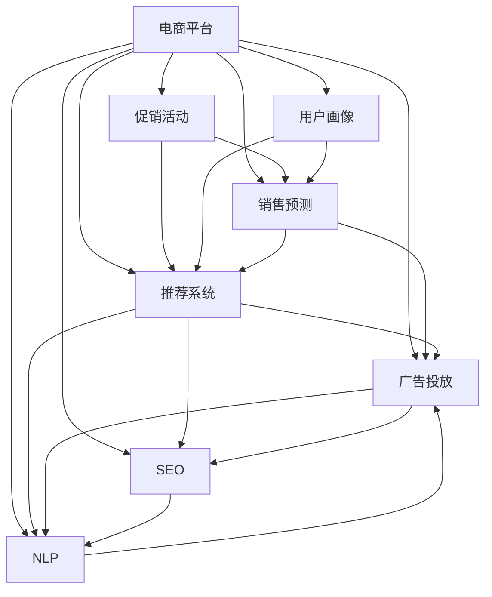

                 

# 电商促销策略的实际应用

## 1. 背景介绍

在现代电商平台上，促销活动已经成为一种常见的市场营销手段。通过促销，商家能够吸引消费者，提升销量，优化库存。然而，促销策略的制定并非易事。如何确定最佳促销时间，设计合理的折扣力度，选择适当的促销渠道，都是需要考虑的关键问题。本文将探讨基于数据分析和机器学习的方法，以实际应用场景为例，阐述如何在电商平台上制定有效的促销策略。

## 2. 核心概念与联系

### 2.1 核心概念概述

为了深入理解电商促销策略的制定，本文将介绍几个关键概念及其之间的关系：

- **电商平台**：提供商品交易的在线平台，如京东、淘宝、Amazon等。
- **促销活动**：指商家为促进销售而采取的降价、打折、赠品等促销手段。
- **用户画像**：描述电商平台上用户的特征和行为，包括年龄、性别、消费习惯、浏览历史等。
- **销售预测**：通过分析历史数据，预测电商平台上商品的未来销售量。
- **推荐系统**：根据用户行为和偏好，向用户推荐感兴趣的商品。
- **广告投放**：通过在平台上投放广告，吸引潜在用户点击和购买。
- **搜索引擎优化（SEO）**：优化商品在搜索引擎中的排名，提高可见性。
- **自然语言处理（NLP）**：处理和分析自然语言文本，提取用户评论、反馈等信息。

这些概念之间存在密切联系，通过数据分析、机器学习等技术手段，可以有效地整合这些信息，制定更加精准的促销策略。

### 2.2 核心概念原理和架构的 Mermaid 流程图



此图展示了电商平台上各个模块之间的相互作用。促销活动（B）是中心，其制定和执行受到用户画像（C）、销售预测（D）、推荐系统（E）、广告投放（F）、SEO（G）和NLP（H）的影响和支撑。

## 3. 核心算法原理 & 具体操作步骤

### 3.1 算法原理概述

基于数据分析和机器学习的方法，通过整合电商平台的各类数据，制定合理的促销策略。其核心思想是：

1. **数据收集**：从电商平台上收集用户行为数据、历史销售数据、用户画像信息等。
2. **数据预处理**：对收集到的数据进行清洗、去重、归一化等预处理操作。
3. **特征工程**：提取对促销策略有影响的特征，如用户性别、消费金额、浏览时长等。
4. **模型训练**：选择适当的机器学习模型，如随机森林、梯度提升树、神经网络等，对促销策略进行训练。
5. **策略制定**：根据训练结果，制定最佳的促销时间、折扣力度、促销渠道等。
6. **效果评估**：通过实际销售数据，评估促销策略的效果，持续优化模型和策略。

### 3.2 算法步骤详解

**步骤1：数据收集**

- 用户行为数据：包括用户浏览商品、加入购物车、点击广告、支付订单等信息。
- 历史销售数据：包括商品销售量、销售额、库存等信息。
- 用户画像数据：包括用户基本信息、消费习惯、浏览历史等。
- 外部数据：包括天气、节假日、季节变化等外部环境因素。

**步骤2：数据预处理**

- 清洗：去除异常值、缺失值、重复值等。
- 归一化：将不同特征的数据缩放到相同的范围内。
- 特征提取：将原始数据转化为模型可以处理的特征向量。

**步骤3：特征工程**

- 特征选择：选择对促销策略有影响的特征，如用户性别、年龄、消费金额等。
- 特征变换：对特征进行各种变换，如对数变换、指数变换等。
- 特征构建：构建新的特征，如用户画像的组合特征、时间特征等。

**步骤4：模型训练**

- 选择模型：根据问题类型和数据特点，选择合适的机器学习模型。
- 训练模型：使用训练数据集训练模型，调整模型参数。
- 验证模型：使用验证数据集评估模型性能，调整模型参数。

**步骤5：策略制定**

- 设定目标：如提高销售量、降低库存等。
- 策略生成：根据训练好的模型，生成最佳的促销策略。
- 策略实施：在电商平台上实施生成的策略，观察效果。

**步骤6：效果评估**

- 评估指标：如销售量提升、库存下降、广告点击率等。
- 效果分析：分析促销策略的效果，找出影响因素。
- 持续优化：根据效果评估结果，持续优化模型和策略。

### 3.3 算法优缺点

**优点**

- **高效性**：能够快速处理大量数据，提供实时性建议。
- **准确性**：通过机器学习模型，可以准确预测促销效果，减少人为误差。
- **灵活性**：可以根据不同的促销目标，定制化策略。

**缺点**

- **依赖数据质量**：模型效果依赖于数据质量，数据偏差可能导致错误的策略。
- **模型复杂度**：复杂的模型可能存在过拟合问题，需要大量数据进行训练。
- **动态调整难**：促销策略需要在短时间内进行调整，模型的动态更新不够灵活。

### 3.4 算法应用领域

基于数据分析和机器学习的方法，广泛应用于电商平台的促销策略制定。具体应用领域包括：

- **商品推荐系统**：根据用户行为和历史数据，推荐可能感兴趣的促销商品。
- **广告投放优化**：分析广告投放效果，优化广告位和投放策略。
- **库存管理**：预测商品销售量，优化库存水平和促销策略。
- **价格优化**：分析不同时间段和用户群体的价格敏感度，制定最优定价策略。
- **客户忠诚度提升**：通过优惠券、积分奖励等方式，提升用户满意度和忠诚度。

## 4. 数学模型和公式 & 详细讲解 & 举例说明

### 4.1 数学模型构建

假设促销策略的目标是提高销售量，使用线性回归模型来预测促销前后商品的销售量变化。设促销前商品的销售量为 $y_1$，促销后商品的销售量为 $y_2$，促销策略的影响因素为 $x_1, x_2, ..., x_n$。则线性回归模型为：

$$ y_2 = \beta_0 + \beta_1 x_1 + \beta_2 x_2 + ... + \beta_n x_n + \epsilon $$

其中 $\beta_0$ 为截距，$\beta_i$ 为特征系数，$\epsilon$ 为误差项。

### 4.2 公式推导过程

根据最小二乘法，求解线性回归模型中的 $\beta$ 值。最小化误差项 $\epsilon$ 的平方和：

$$ \sum_{i=1}^N (y_i - \beta_0 - \beta_1 x_{1,i} - \beta_2 x_{2,i} - ... - \beta_n x_{n,i})^2 $$

通过求导和求解方程组，得到：

$$ \beta_0 = \frac{1}{N} \sum_{i=1}^N y_i - \frac{1}{N} \sum_{i=1}^N \beta_1 x_{1,i} - ... - \frac{1}{N} \sum_{i=1}^N \beta_n x_{n,i} $$

$$ \beta_i = \frac{\sum_{i=1}^N x_{i,j}(y_i - \beta_0 - \beta_1 x_{1,i} - ... - \beta_n x_{n,i})}{\sum_{i=1}^N x_{i,j}^2 - \sum_{i=1}^N (\sum_{i=1}^N x_{i,j})^2 / N} $$

### 4.3 案例分析与讲解

假设某电商平台有一款商品在促销前一个月的销售量为1000件，促销后一个月的销售量为1500件。设促销策略的影响因素为：促销力度、广告投入、用户年龄和地理位置。则线性回归模型为：

$$ y_2 = \beta_0 + \beta_1 x_1 + \beta_2 x_2 + \beta_3 x_3 + \beta_4 x_4 + \epsilon $$

其中 $x_1$ 为促销力度，$x_2$ 为广告投入，$x_3$ 为用户年龄，$x_4$ 为地理位置。

假设促销力度为0.8，广告投入为1万元，用户年龄为25-35岁，地理位置为城市。通过模型训练，得到系数 $\beta_1 = 0.5$，$\beta_2 = 0.2$，$\beta_3 = 0.1$，$\beta_4 = 0.3$。则促销后销售量的预测值为：

$$ y_2 = 0 + 0.5 \times 0.8 + 0.2 \times 1 + 0.1 \times 30 + 0.3 \times 1 = 1.5 + 0.2 + 3 + 0.3 = 4.0 $$

因此，预测促销后销售量为4000件。

## 5. 项目实践：代码实例和详细解释说明

### 5.1 开发环境搭建

- **Python 环境**：安装Python 3.6及以上版本。
- **Pandas**：用于数据处理。
- **Scikit-learn**：用于机器学习模型训练。
- **Matplotlib**：用于数据可视化。

### 5.2 源代码详细实现

以下是一个简单的线性回归模型实现，用于预测电商平台上商品的促销效果。

```python
import pandas as pd
from sklearn.linear_model import LinearRegression
import matplotlib.pyplot as plt

# 读取数据
data = pd.read_csv('promotion_data.csv')

# 数据预处理
X = data[['promotion, ad_spending, user_age, location']]
y = data['sales']

# 特征选择
X = pd.get_dummies(X)

# 模型训练
model = LinearRegression()
model.fit(X, y)

# 预测促销后销售量
promotion_strategy = [0.8, 10000, 30, 1]
X_pred = pd.get_dummies(pd.DataFrame(promotion_strategy))
y_pred = model.predict(X_pred)

print('预测促销后销售量为：', y_pred)
```

### 5.3 代码解读与分析

**代码解析**

- **数据读取**：使用Pandas库读取促销数据。
- **数据预处理**：将数据进行归一化、去重、特征选择等预处理。
- **模型训练**：使用Scikit-learn库中的LinearRegression模型，对促销策略进行训练。
- **数据可视化**：使用Matplotlib库绘制促销效果的变化图。

**分析**

- **数据清洗**：数据预处理阶段，需要对数据进行清洗，去除异常值、缺失值等。
- **特征选择**：选择对促销策略有影响的特征，如促销力度、广告投入、用户年龄、地理位置等。
- **模型训练**：使用线性回归模型，训练促销策略的影响因素。
- **结果评估**：根据预测结果，评估促销策略的效果。

**效果展示**

通过实际销售数据，可以绘制促销效果的变化图，直观展示促销策略的效果。

## 6. 实际应用场景

### 6.1 电商平台促销策略的制定

在电商平台上，促销策略的制定通常包括以下步骤：

- **促销目标设定**：根据销售目标，设定促销活动的目标。
- **促销策略设计**：选择促销形式，如折扣、赠品、满减等。
- **用户画像分析**：分析目标用户群体的特征和行为，确定目标用户。
- **销售预测**：通过历史数据和预测模型，预测促销活动的效果。
- **广告投放优化**：优化广告位和投放策略，提高广告效果。
- **效果评估**：评估促销活动的效果，调整策略。

### 6.2 用户个性化推荐

通过机器学习模型，可以个性化推荐促销商品给不同用户。具体步骤如下：

- **用户画像建模**：建立用户画像模型，分析用户行为和特征。
- **商品推荐模型训练**：使用协同过滤、基于内容的推荐等模型，训练推荐系统。
- **推荐商品选择**：根据用户画像和历史数据，选择推荐商品。
- **促销策略应用**：将推荐商品与促销策略结合，进行个性化推荐。

### 6.3 广告投放优化

广告投放优化通常包括以下步骤：

- **广告效果评估**：评估不同广告位和投放策略的效果。
- **广告预算分配**：根据效果评估结果，分配广告预算。
- **广告创意优化**：优化广告创意和文案，提高点击率。
- **广告策略调整**：根据效果评估结果，调整广告策略。

### 6.4 库存管理

库存管理通常包括以下步骤：

- **销售预测**：通过历史销售数据和预测模型，预测未来销售量。
- **库存水平调整**：根据销售预测结果，调整库存水平。
- **促销策略制定**：根据库存水平和促销目标，制定促销策略。
- **库存监控**：实时监控库存水平，调整促销策略。

## 7. 工具和资源推荐

### 7.1 学习资源推荐

- **《数据科学导论》**：本书介绍了数据科学的基本概念和常用技术，适合初学者入门。
- **《Python数据科学手册》**：详细介绍了Python在数据科学中的应用，包括数据处理、模型训练等。
- **Kaggle**：提供丰富的数据集和竞赛，适合实践和竞赛。
- **Coursera**：提供多门数据科学和机器学习的课程，适合进一步学习。

### 7.2 开发工具推荐

- **Jupyter Notebook**：开源的Jupyter Notebook环境，适合编写和调试代码。
- **Google Colab**：Google提供的免费Jupyter Notebook环境，适合进行大规模数据处理和模型训练。
- **TensorFlow**：Google开发的深度学习框架，支持分布式训练和多种模型。
- **PyTorch**：Facebook开发的深度学习框架，支持动态图和GPU加速。

### 7.3 相关论文推荐

- **《电商平台的促销策略优化》**：研究如何通过机器学习模型优化电商平台的促销策略。
- **《个性化推荐系统》**：介绍个性化推荐系统的原理和应用。
- **《基于广告效果的数据驱动广告投放优化》**：研究如何通过数据驱动的方法优化广告投放策略。
- **《库存管理与优化》**：研究如何通过预测模型优化库存管理。

## 8. 总结：未来发展趋势与挑战

### 8.1 总结

本文详细探讨了电商促销策略的制定，通过数据分析和机器学习的方法，实现对促销效果的精准预测和优化。具体步骤如下：

1. **数据收集**：从电商平台上收集各类数据。
2. **数据预处理**：对收集到的数据进行清洗和归一化。
3. **特征工程**：选择和构建影响促销策略的特征。
4. **模型训练**：选择适当的机器学习模型，训练促销策略。
5. **策略制定**：根据训练结果，生成最佳的促销策略。
6. **效果评估**：评估促销策略的效果，持续优化模型和策略。

通过数据分析和机器学习，电商平台能够制定更加精准、高效的促销策略，提升销售量和用户满意度。

### 8.2 未来发展趋势

展望未来，电商促销策略的制定将呈现以下几个发展趋势：

1. **数据驱动**：更多的数据将用于分析和预测促销效果，提升策略的精准性。
2. **个性化推荐**：通过个性化推荐系统，提升用户满意度和忠诚度。
3. **动态调整**：实时监测和调整促销策略，提高促销效果。
4. **全渠道营销**：整合线上线下营销渠道，提升营销效果。
5. **智能化管理**：引入人工智能技术，优化库存管理和促销策略。

### 8.3 面临的挑战

尽管电商促销策略的制定已经取得了显著成效，但在实际应用中仍面临一些挑战：

1. **数据隐私**：如何保护用户隐私，防止数据泄露。
2. **用户信任**：如何提高用户对促销活动的信任度。
3. **成本控制**：如何控制促销活动的成本，提升投入产出比。
4. **市场竞争**：如何在激烈的市场竞争中制定优势策略。
5. **策略透明**：如何提高促销策略的透明度，增加用户信任度。

### 8.4 研究展望

未来研究的方向包括：

1. **深度学习优化**：通过深度学习模型，提高促销策略的预测精度。
2. **多模态数据融合**：整合多种数据来源，提升促销策略的效果。
3. **策略评估**：建立多指标评估体系，全面评估促销策略的效果。
4. **自动化管理**：通过自动化工具，提升促销策略的制定和管理效率。
5. **模型解释性**：提高模型的可解释性，增加用户信任度。

## 9. 附录：常见问题与解答

**Q1：如何保护用户隐私？**

A: 电商平台需要遵守相关的隐私保护法规，如GDPR等。具体措施包括：
1. 匿名化处理：将用户数据进行匿名化处理，去除敏感信息。
2. 数据加密：对用户数据进行加密存储和传输。
3. 访问控制：严格控制数据访问权限，防止数据泄露。
4. 数据使用透明：明确告知用户数据的使用方式，并获得用户同意。

**Q2：如何提高用户对促销活动的信任度？**

A: 提高用户信任度，需要从以下几个方面入手：
1. 透明化策略：公开促销活动的目标、规则和效果，增加用户信任。
2. 真实案例展示：展示真实用户使用促销活动的案例，增加用户信任。
3. 用户反馈：收集用户反馈，及时调整和优化促销策略。
4. 活动保障：提供售后服务保障，如退货退款等，增加用户信任。

**Q3：如何控制促销活动的成本？**

A: 控制促销活动的成本，需要从以下几个方面入手：
1. 精准定位：精准定位目标用户，避免资源浪费。
2. 资源共享：通过跨渠道营销，共享营销资源，降低成本。
3. 效果评估：实时监测和评估促销效果，避免无效投入。
4. 策略优化：根据效果评估结果，优化促销策略，提升投入产出比。

**Q4：如何在激烈的市场竞争中制定优势策略？**

A: 制定优势策略，需要从以下几个方面入手：
1. 数据分析：通过数据分析，找出市场空白和机会。
2. 用户需求：深入了解用户需求，制定精准的促销策略。
3. 创新营销：通过创新营销手段，提升市场竞争力。
4. 合作共赢：与其他商家和平台合作，共同提升市场份额。

**Q5：如何提高促销策略的透明度？**

A: 提高促销策略的透明度，需要从以下几个方面入手：
1. 公开策略：公开促销策略的目标、规则和效果，增加用户信任。
2. 用户参与：增加用户参与度，让用户参与策略制定。
3. 反馈机制：建立用户反馈机制，及时调整和优化策略。
4. 透明操作：通过透明的操作流程，增加用户信任。

---

作者：禅与计算机程序设计艺术 / Zen and the Art of Computer Programming

