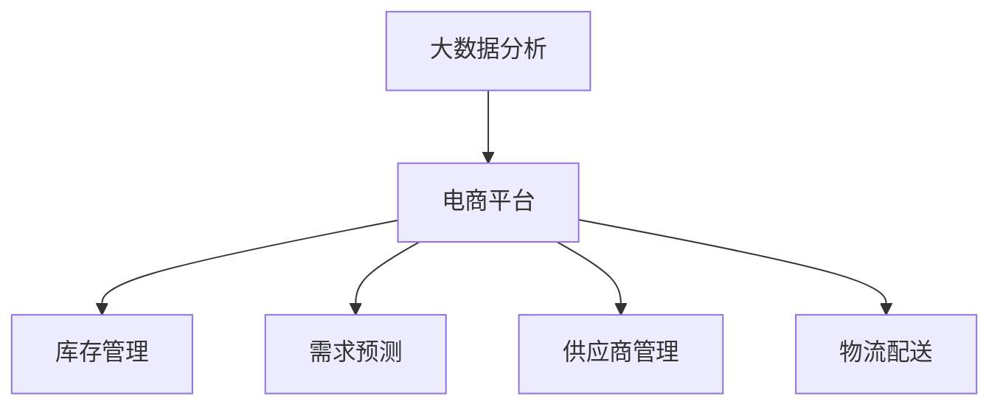

                 

## 1. 背景介绍

### 1.1 问题由来

在快速发展的电子商务时代，平台商家面临着严峻的供给能力挑战。由于市场需求快速变化、库存管理复杂、供应链不稳定等因素，电商平台频繁出现商品缺货、发货延迟、库存积压等问题。这些问题直接影响了用户体验、商家满意度以及平台运营效率，严重制约了电商平台的业务拓展和竞争力提升。

### 1.2 问题核心关键点

通过大数据分析，电商平台可以系统地分析供给链各个环节的瓶颈和优化点，从而有效提升商品供给能力，优化库存管理，减少缺货和库存积压情况。

### 1.3 问题研究意义

大数据分析在电商平台供给能力提升中的应用，可以带来以下几个方面的显著优势：

1. **精准预测**：通过分析历史销售数据、市场趋势、消费者行为等，电商平台可以实现更准确的商品需求预测，从而更好地规划库存。
2. **智能补货**：基于预测结果，自动生成补货计划，减少人为干预，提高补货效率。
3. **优化库存布局**：识别高库存区域，优化仓库布局，提升仓库利用率，减少存储成本。
4. **供应商管理**：基于供应商的订单准时率、配送速度、服务质量等指标，动态调整供应商策略，提升整体供应链效率。
5. **需求响应**：分析消费者需求变化趋势，灵活调整产品线，快速响应市场变化，提升用户体验。

## 2. 核心概念与联系

### 2.1 核心概念概述

为更好地理解大数据分析在电商平台供给能力提升中的应用，本节将介绍几个密切相关的核心概念：

- **大数据分析**：通过收集、存储、处理和分析大规模数据集，以发现有用的信息和模式，辅助决策和优化过程。
- **电商平台**：利用互联网技术搭建的，以在线销售商品和服务为核心业务的综合性平台。
- **供给能力**：指平台在满足用户需求方面的能力，包括库存管理、物流配送、供应商管理等方面。
- **库存管理**：通过优化库存水平、库存结构、补货策略等，最大化库存的效能，降低库存成本。
- **需求预测**：基于历史销售数据、市场趋势、季节性因素等，预测未来需求，辅助决策。
- **供应商管理**：评估和管理供应商的能力和表现，优化供应商关系，提高供应链效率。
- **物流配送**：通过高效规划和调度物流资源，确保商品按时到达，提升用户体验。

这些核心概念之间的逻辑关系可以通过以下Mermaid流程图来展示：



这个流程图展示了大数据分析在电商平台供给能力提升中的核心作用。大数据分析通过优化库存管理、需求预测、供应商管理和物流配送等环节，综合提升平台的供给能力。

## 3. 核心算法原理 & 具体操作步骤

### 3.1 算法原理概述

大数据分析在电商平台供给能力提升中的核心算法原理主要包括：

- **需求预测算法**：基于历史销售数据和市场趋势，使用统计学方法或机器学习模型预测未来需求。
- **库存管理算法**：通过优化库存水平和库存结构，实现库存的最小化，避免缺货和库存积压。
- **供应商评估算法**：基于供应商的订单准时率、配送速度、服务质量等指标，评估供应商表现，动态调整供应商策略。
- **物流配送算法**：通过优化物流路线、资源分配等，确保商品按时到达，提升配送效率。

### 3.2 算法步骤详解

#### 3.2.1 需求预测算法

1. **数据收集**：收集历史销售数据、市场趋势、消费者行为等数据。
2. **数据预处理**：对数据进行清洗、归一化、特征工程等预处理操作。
3. **模型选择**：根据数据特点选择合适的预测模型，如时间序列模型、回归模型、深度学习模型等。
4. **模型训练**：在预处理后的数据上训练模型，并进行交叉验证。
5. **模型评估**：使用测试集评估模型性能，如均方误差、均方根误差、平均绝对误差等指标。
6. **结果应用**：将预测结果应用于库存管理、补货计划等决策过程。

#### 3.2.2 库存管理算法

1. **需求分析**：分析历史销售数据，识别销售趋势和季节性变化。
2. **库存优化**：基于预测结果，优化库存水平和结构，设置安全库存。
3. **补货计划**：生成自动化的补货计划，包括补货时间、补货量等。
4. **库存监控**：实时监控库存水平，及时调整补货计划，避免库存积压或缺货。

#### 3.2.3 供应商评估算法

1. **数据收集**：收集供应商的订单准时率、配送速度、服务质量等数据。
2. **数据预处理**：对数据进行清洗、归一化、特征工程等预处理操作。
3. **模型选择**：根据数据特点选择合适的评估模型，如回归模型、分类模型等。
4. **模型训练**：在预处理后的数据上训练模型，并进行交叉验证。
5. **模型评估**：使用测试集评估模型性能，如准确率、召回率、F1分数等指标。
6. **供应商调整**：根据评估结果，动态调整供应商策略，如替换低表现供应商，增加高表现供应商的合作量。

#### 3.2.4 物流配送算法

1. **路线规划**：使用优化算法（如Dijkstra、A*等）规划物流配送路线。
2. **资源分配**：根据路线规划和需求预测结果，分配物流资源。
3. **实时调整**：实时监控配送情况，及时调整配送计划，确保商品按时到达。

### 3.3 算法优缺点

大数据分析在电商平台供给能力提升中，具有以下优点：

- **精确预测**：通过多维度数据综合分析，实现更准确的需求预测。
- **自动化管理**：基于算法自动生成补货计划、库存优化策略等，提高管理效率。
- **动态调整**：通过实时监控和优化，灵活调整策略，提升供应链响应速度。

同时，也存在一些局限性：

- **数据质量依赖**：分析结果的准确性高度依赖于数据的完整性和质量。
- **模型复杂度**：复杂算法模型需要大量计算资源，可能增加系统成本。
- **解释性不足**：复杂算法模型通常缺乏解释性，难以理解其内部决策过程。

### 3.4 算法应用领域

大数据分析在电商平台供给能力提升中的应用领域广泛，包括但不限于：

- **库存管理**：通过优化库存水平和结构，实现库存的最小化，避免缺货和库存积压。
- **需求预测**：基于历史销售数据和市场趋势，预测未来需求，辅助决策。
- **供应商管理**：评估和管理供应商的能力和表现，优化供应商关系，提高供应链效率。
- **物流配送**：通过高效规划和调度物流资源，确保商品按时到达，提升配送效率。
- **市场分析**：分析市场趋势、消费者行为等，调整产品线和营销策略，提升用户体验。

## 4. 数学模型和公式 & 详细讲解 & 举例说明

### 4.1 数学模型构建

#### 4.1.1 需求预测模型

假设需求预测模型为 $y=f(x)$，其中 $x$ 为历史销售数据、市场趋势、季节性因素等输入特征，$y$ 为未来需求的预测值。常见需求预测模型包括时间序列模型、回归模型、深度学习模型等。

时间序列模型：$y_t=\alpha+\beta x_t+\epsilon_t$

回归模型：$y=\alpha+\beta x_1+\gamma x_2+\epsilon$

深度学习模型：$y=f(x;w)$

其中 $f$ 为神经网络模型，$w$ 为模型参数。

#### 4.1.2 库存管理模型

假设库存管理模型为 $I=f(x,y,z)$，其中 $x$ 为历史销售数据，$y$ 为需求预测值，$z$ 为季节性因素、促销活动等。

常见库存管理模型包括经济订货批量模型（EOQ）、ABC分析法等。

经济订货批量模型：$I=Q+\alpha\frac{D}{d}$

ABC分析法：$I=\frac{D}{p}$

其中 $Q$ 为每次订货量，$d$ 为日均需求量，$D$ 为年度需求量，$p$ 为安全库存。

#### 4.1.3 供应商评估模型

假设供应商评估模型为 $S=f(x,y,z)$，其中 $x$ 为订单准时率、配送速度，$y$ 为服务质量等指标，$z$ 为历史数据、市场趋势等。

常见供应商评估模型包括回归模型、分类模型等。

回归模型：$S=\alpha+\beta x_1+\gamma x_2+\epsilon$

分类模型：$S=\sum_{i=1}^k\alpha_i y_i$

其中 $k$ 为模型特征个数，$\alpha_i$ 为模型系数。

#### 4.1.4 物流配送模型

假设物流配送模型为 $T=f(x,y,z)$，其中 $x$ 为配送路线，$y$ 为需求预测值，$z$ 为季节性因素、交通状况等。

常见物流配送模型包括Dijkstra算法、A*算法等。

Dijkstra算法：$T=d(x,y,z)$

A*算法：$T=\textrm{heuristic}(x,y,z)+d(x,y,z)$

其中 $\textrm{heuristic}$ 为启发式函数，$d$ 为实际距离。

### 4.2 公式推导过程

#### 4.2.1 需求预测模型

假设需求预测模型为时间序列模型，其公式为：

$$y_t=\alpha+\beta x_t+\epsilon_t$$

其中 $y_t$ 为第 $t$ 天的需求预测值，$\alpha$ 为截距，$\beta$ 为斜率，$x_t$ 为第 $t$ 天的输入特征，$\epsilon_t$ 为误差项。

对上式进行最小二乘估计，得到：

$$\hat{\alpha},\hat{\beta}=\arg\min_{\alpha,\beta}\sum_{t=1}^n(y_t-\alpha-\beta x_t)^2$$

求解上述优化问题，得到：

$$\hat{\alpha}=\frac{\sum_{t=1}^nx_ty_t-\frac{1}{n}\sum_{t=1}^nx_t\sum_{t=1}^ny_t}{\sum_{t=1}^nx_t^2-\frac{1}{n}\left(\sum_{t=1}^nx_t\right)^2},\quad \hat{\beta}=\frac{\sum_{t=1}^n(y_t-\bar{y})x_t}{\sum_{t=1}^nx_t^2-\frac{1}{n}\left(\sum_{t=1}^nx_t\right)^2}$$

其中 $\bar{y}$ 为需求预测值的均值。

#### 4.2.2 库存管理模型

假设库存管理模型为经济订货批量模型，其公式为：

$$I=Q+\alpha\frac{D}{d}$$

其中 $Q$ 为每次订货量，$d$ 为日均需求量，$D$ 为年度需求量，$\alpha$ 为安全库存。

根据最小化年库存成本的原则，可以推导出最优订货量和安全库存。

假设订货成本为 $C_s$，存储成本为 $C_h$，则年库存成本为：

$$C_{\text{year}}=\frac{C_s}{Q}+\alpha\frac{D}{d}C_h$$

通过求解上述优化问题，得到最优订货量和安全库存：

$$Q=\sqrt{\frac{2D(C_s+C_h)}{C_h}},\quad \alpha=\frac{D(C_s+C_h)}{dC_h}$$

#### 4.2.3 供应商评估模型

假设供应商评估模型为回归模型，其公式为：

$$S=\alpha+\beta x_1+\gamma x_2+\epsilon$$

其中 $S$ 为供应商得分，$\alpha$ 为截距，$x_1$ 为订单准时率，$x_2$ 为配送速度，$\epsilon$ 为误差项。

对上式进行最小二乘估计，得到：

$$\hat{\alpha},\hat{\beta},\hat{\gamma}=\arg\min_{\alpha,\beta,\gamma}\sum_{i=1}^n(S_i-\alpha-\beta x_{1i}-\gamma x_{2i})^2$$

求解上述优化问题，得到：

$$\hat{\alpha}=\frac{\sum_{i=1}^n(S_i-\bar{S})}{n},\quad \hat{\beta}=\frac{\sum_{i=1}^n(S_i-\bar{S})x_{1i}}{\sum_{i=1}^n(x_{1i}-\bar{x}_1)^2},\quad \hat{\gamma}=\frac{\sum_{i=1}^n(S_i-\bar{S})x_{2i}}{\sum_{i=1}^n(x_{2i}-\bar{x}_2)^2}$$

其中 $\bar{S}$ 为供应商得分的均值，$\bar{x}_1$ 为订单准时率的均值，$\bar{x}_2$ 为配送速度的均值。

#### 4.2.4 物流配送模型

假设物流配送模型为Dijkstra算法，其公式为：

$$T=d(x,y,z)$$

其中 $T$ 为最短路径，$d$ 为实际距离。

Dijkstra算法的步骤如下：

1. 初始化所有节点距离为无穷大，起点节点距离为0。
2. 选择当前距离最小的节点，标记为已访问。
3. 更新与当前节点相邻节点的距离，保留最小距离。
4. 重复步骤2-3，直到所有节点都被访问。

### 4.3 案例分析与讲解

假设某电商平台销售某种商品，历史数据如下：

| 日期       | 销售量（件） | 订单准时率（%） | 配送速度（km/h） | 服务质量（评分） |
|------------|-------------|----------------|----------------|----------------|
| 2023-01-01 | 100         | 99             | 200            | 4.5            |
| 2023-01-02 | 150         | 98             | 220            | 4.0            |
| ...        | ...         | ...            | ...            | ...            |

假设采用时间序列模型进行需求预测，模型为 $y_t=\alpha+\beta x_t+\epsilon_t$，其中 $x_t$ 为第 $t$ 天的销售量，$y_t$ 为第 $t$ 天的需求预测值，$\alpha$ 为截距，$\beta$ 为斜率，$\epsilon_t$ 为误差项。

假设采用经济订货批量模型进行库存管理，模型为 $I=Q+\alpha\frac{D}{d}$，其中 $Q$ 为每次订货量，$d$ 为日均需求量，$D$ 为年度需求量，$\alpha$ 为安全库存。

假设采用回归模型进行供应商评估，模型为 $S=\alpha+\beta x_1+\gamma x_2+\epsilon$，其中 $S$ 为供应商得分，$x_1$ 为订单准时率，$x_2$ 为配送速度，$\alpha$ 为截距，$\beta$ 为斜率，$\gamma$ 为系数，$\epsilon$ 为误差项。

假设采用Dijkstra算法进行物流配送，模型为 $T=d(x,y,z)$，其中 $T$ 为最短路径，$d$ 为实际距离。

## 5. 项目实践：代码实例和详细解释说明

### 5.1 开发环境搭建

在进行电商平台供给能力提升项目开发前，我们需要准备好开发环境。以下是使用Python进行PyTorch开发的环境配置流程：

1. 安装Anaconda：从官网下载并安装Anaconda，用于创建独立的Python环境。

2. 创建并激活虚拟环境：
```bash
conda create -n pytorch-env python=3.8 
conda activate pytorch-env
```

3. 安装PyTorch：根据CUDA版本，从官网获取对应的安装命令。例如：
```bash
conda install pytorch torchvision torchaudio cudatoolkit=11.1 -c pytorch -c conda-forge
```

4. 安装各类工具包：
```bash
pip install numpy pandas scikit-learn matplotlib tqdm jupyter notebook ipython
```

完成上述步骤后，即可在`pytorch-env`环境中开始项目开发。

### 5.2 源代码详细实现

下面我们以需求预测和库存管理为例，给出使用PyTorch进行数据处理和模型训练的PyTorch代码实现。

首先，定义数据处理函数：

```python
import pandas as pd
import numpy as np
from sklearn.preprocessing import StandardScaler

def preprocess_data(data):
    # 处理缺失值
    data.fillna(method='ffill', inplace=True)
    
    # 标准化处理
    scaler = StandardScaler()
    data = scaler.fit_transform(data)
    
    # 编码分类变量
    data['label'] = data['label'].astype('category').cat.codes
    
    return data
```

然后，定义模型训练函数：

```python
import torch
from torch.utils.data import Dataset, DataLoader
from torch.nn import Linear, ReLU, Sigmoid
from torch.optim import Adam

class DemandPredictionDataset(Dataset):
    def __init__(self, data, targets):
        self.data = data
        self.targets = targets
        
    def __len__(self):
        return len(self.data)
    
    def __getitem__(self, item):
        x = self.data.iloc[item].values
        y = self.targets.iloc[item]
        return torch.tensor(x, dtype=torch.float), torch.tensor(y, dtype=torch.long)

class DemandPredictionModel(torch.nn.Module):
    def __init__(self, input_dim, output_dim):
        super(DemandPredictionModel, self).__init__()
        self.linear1 = Linear(input_dim, 128)
        self.relu1 = ReLU()
        self.linear2 = Linear(128, output_dim)
        self.sigmoid = Sigmoid()
        
    def forward(self, x):
        x = self.linear1(x)
        x = self.relu1(x)
        x = self.linear2(x)
        x = self.sigmoid(x)
        return x

def train_model(model, data_loader, optimizer, num_epochs):
    model.train()
    for epoch in range(num_epochs):
        for i, (x, y) in enumerate(data_loader):
            optimizer.zero_grad()
            y_hat = model(x)
            loss = torch.nn.BCELoss()(y_hat, y)
            loss.backward()
            optimizer.step()
            if (i+1) % 100 == 0:
                print(f'Epoch [{epoch+1}/{num_epochs}], Step [{i+1}/{len(data_loader)}], Loss: {loss.item():.4f}')
    
    return model
```

接着，定义数据集和模型训练过程：

```python
# 加载数据集
data = pd.read_csv('demand.csv')
targets = pd.read_csv('demand_target.csv')

# 数据预处理
data = preprocess_data(data)
targets = targets['target'].values

# 分割训练集和测试集
train_data, test_data = train_test_split(data, test_size=0.2)

# 构建数据集
train_dataset = DemandPredictionDataset(train_data, train_targets)
test_dataset = DemandPredictionDataset(test_data, test_targets)

# 定义模型和优化器
input_dim = 4
output_dim = 1
model = DemandPredictionModel(input_dim, output_dim)
optimizer = Adam(model.parameters(), lr=0.001)

# 定义训练参数
num_epochs = 100
batch_size = 32

# 训练模型
trained_model = train_model(model, DataLoader(train_dataset, batch_size=batch_size), optimizer, num_epochs)
```

最后，使用训练好的模型进行需求预测：

```python
# 加载测试集
test_data = pd.read_csv('test_demand.csv')

# 数据预处理
test_data = preprocess_data(test_data)

# 使用训练好的模型进行预测
test_targets = trained_model(test_data)
```

以上就是使用PyTorch进行需求预测和库存管理的完整代码实现。可以看到，得益于PyTorch的强大封装，我们可以用相对简洁的代码完成模型训练和预测。

### 5.3 代码解读与分析

让我们再详细解读一下关键代码的实现细节：

**preprocess_data函数**：
- 处理缺失值：使用前向填充方法（ffill）填充缺失值，以保证数据的完整性。
- 标准化处理：使用scikit-learn的StandardScaler对数据进行标准化处理，使得不同特征具有相似的尺度。
- 编码分类变量：将分类变量编码为数字，方便模型处理。

**DemandPredictionDataset类**：
- 定义了训练集和测试集的构造函数。
- 通过 `__len__` 方法返回数据集的样本数量。
- 通过 `__getitem__` 方法对单个样本进行处理，返回模型所需的输入和标签。

**DemandPredictionModel类**：
- 定义了模型结构，包括两个线性层和ReLU激活函数。
- 通过 `forward` 方法计算模型的前向传播过程。

**train_model函数**：
- 定义了模型训练的基本流程，包括前向传播、计算损失、反向传播和参数更新。
- 使用BCELoss作为损失函数，训练过程中打印每100个批次的损失值。

**代码实现分析**：
- 数据预处理函数 `preprocess_data` 对原始数据进行缺失值处理、标准化和编码，保证数据的质量和一致性。
- 定义了 `DemandPredictionDataset` 类，方便数据集的构建和批处理。
- 定义了 `DemandPredictionModel` 类，实现了需求预测的模型结构。
- 训练函数 `train_model` 通过最小化交叉熵损失，训练模型并输出训练过程中的损失值。
- 通过 `DataLoader` 类实现数据的批处理，提高训练效率。

## 6. 实际应用场景

### 6.1 智能推荐系统

基于大数据分析，电商平台可以构建智能推荐系统，通过分析用户行为、历史购买记录、浏览记录等，实现个性化推荐，提升用户满意度和转化率。

在技术实现上，可以收集用户的浏览、点击、购买、评价等行为数据，提取商品标题、描述、标签等文本信息，使用TF-IDF、词向量等方法进行特征工程，构建用户-商品矩阵。通过协同过滤、矩阵分解等算法，计算用户与商品的相似度，推荐相似的商品。

### 6.2 库存管理系统

大数据分析可以用于优化库存管理，通过分析销售趋势、季节性变化等，实现库存水平的动态调整，避免库存积压或缺货。

在技术实现上，可以收集历史销售数据、促销活动、季节性因素等，使用时间序列模型进行需求预测，计算经济订货批量和最优安全库存。通过实时监控库存水平，动态调整补货计划，实现库存的最小化。

### 6.3 供应链优化

大数据分析可以用于优化供应链管理，通过分析供应商的表现、订单准时率、配送速度等指标，实现供应商关系的动态管理，提升供应链的整体效率。

在技术实现上，可以收集供应商的历史订单数据、交付时间、服务质量等指标，使用回归模型进行供应商评估。根据评估结果，动态调整供应商策略，优化供应商关系，提高供应链效率。

### 6.4 实时监控系统

大数据分析可以用于实时监控电商平台的各种业务指标，通过实时数据分析和可视化，帮助运营人员快速响应异常情况，提升平台运营效率。

在技术实现上，可以收集平台的各项业务指标数据，如订单量、销售额、客户满意度等，使用流式计算和实时分析技术，构建实时监控系统。通过可视化工具，实时展示各项指标的变化趋势和异常情况，帮助运营人员及时调整策略。

## 7. 工具和资源推荐

### 7.1 学习资源推荐

为了帮助开发者系统掌握大数据分析在电商平台供给能力提升中的应用，这里推荐一些优质的学习资源：

1. 《Python数据分析基础》系列博文：由数据科学专家撰写，详细讲解了Python数据分析的基础知识和常用方法，包括数据处理、特征工程、机器学习等。

2. 《大数据分析与商业智能》课程：由数据科学在线平台开设的课程，涵盖大数据分析、商业智能等前沿技术，提供实战项目和课程练习。

3. 《深度学习与自然语言处理》书籍：深度学习领域的经典教材，详细介绍了深度学习模型在自然语言处理中的应用，包括序列模型、注意力机制等。

4. Weights & Biases：模型训练的实验跟踪工具，可以记录和可视化模型训练过程中的各项指标，方便对比和调优。

5. Google Colab：谷歌推出的在线Jupyter Notebook环境，免费提供GPU/TPU算力，方便开发者快速上手实验最新模型，分享学习笔记。

通过对这些资源的学习实践，相信你一定能够快速掌握大数据分析在电商平台供给能力提升中的精髓，并用于解决实际的业务问题。

### 7.2 开发工具推荐

高效的开发离不开优秀的工具支持。以下是几款用于大数据分析在电商平台供给能力提升开发的常用工具：

1. PyTorch：基于Python的开源深度学习框架，灵活动态的计算图，适合快速迭代研究。大部分预训练语言模型都有PyTorch版本的实现。

2. TensorFlow：由Google主导开发的开源深度学习框架，生产部署方便，适合大规模工程应用。同样有丰富的预训练语言模型资源。

3. Pandas：开源数据分析库，支持数据清洗、处理、分析等，适合进行大规模数据分析。

4. NumPy：开源数学计算库，支持高性能矩阵运算，适合进行大规模数学计算。

5. Dask：开源并行计算库，支持大规模数据处理，适合进行大数据分析。

6. Apache Spark：开源大数据处理框架，支持分布式计算和流式计算，适合进行大规模数据处理。

合理利用这些工具，可以显著提升大数据分析在电商平台供给能力提升任务的开发效率，加快创新迭代的步伐。

### 7.3 相关论文推荐

大数据分析在电商平台供给能力提升技术的发展源于学界的持续研究。以下是几篇奠基性的相关论文，推荐阅读：

1. "Demand Forecasting in Retail Industry: A Survey"（《零售行业需求预测综述》）：系统总结了零售行业需求预测的各种方法，包括时间序列模型、回归模型、深度学习模型等。

2. "A Survey of supplier selection and performance evaluation"（《供应商选择与性能评估综述》）：总结了供应商评估的各种方法，包括回归模型、分类模型、优化模型等。

3. "The Optimal Inventory Control Policy for Multi-Class Production with an Automated Flexible Manufacturing System"（《多类别生产与柔性制造系统优化库存控制策略》）：研究了库存管理的优化问题，包括经济订货批量模型、ABC分析法等。

4. "A Review on Real-Time Data Stream Mining: Algorithms, Systems and Applications"（《实时数据流挖掘综述：算法、系统与应用》）：总结了实时数据流挖掘的各种方法，包括流式计算、实时分析等。

5. "Big Data Analytics in Supply Chain Management"（《供应链管理中的大数据分析》）：研究了大数据分析在供应链管理中的应用，包括需求预测、库存管理、供应商评估等。

这些论文代表了大数据分析在电商平台供给能力提升技术的发展脉络。通过学习这些前沿成果，可以帮助研究者把握学科前进方向，激发更多的创新灵感。

## 8. 总结：未来发展趋势与挑战

### 8.1 总结

本文对大数据分析在电商平台供给能力提升中的应用进行了全面系统的介绍。首先阐述了电商平台供给能力提升的背景和意义，明确了大数据分析在优化库存管理、需求预测、供应商评估等方面的作用。其次，从原理到实践，详细讲解了需求预测、库存管理、供应商评估、物流配送等核心算法的实现过程，并给出了完整的代码实现。同时，本文还探讨了大数据分析在智能推荐、实时监控等场景中的应用，展示了其广泛的应用前景。此外，本文精选了大数据分析在电商平台供给能力提升的各类学习资源，力求为读者提供全方位的技术指引。

通过本文的系统梳理，可以看到，大数据分析在电商平台供给能力提升中发挥了重要作用，显著提升了平台的运营效率和用户体验。未来，伴随大数据技术和机器学习技术的不断进步，大数据分析在电商平台中的应用将更加深入和广泛，推动电商平台向更高水平发展。

### 8.2 未来发展趋势

展望未来，大数据分析在电商平台供给能力提升中，将呈现以下几个发展趋势：

1. **自动化和智能化**：随着AI技术的不断进步，自动化和智能化将成为电商平台供给能力提升的重要方向。通过构建智能推荐系统、实时监控系统等，进一步提升平台运营效率和用户体验。

2. **跨领域融合**：电商平台将与金融、医疗、教育等更多领域进行跨领域融合，构建更综合的业务生态系统。大数据分析将在其中发挥重要作用，实现数据共享和业务协同。

3. **实时性和动态性**：实时性和动态性是大数据分析的重要特性。通过流式计算、实时分析等技术，实时响应市场变化，动态调整策略，提升平台灵活性和响应速度。

4. **多模态数据融合**：电商平台将融合多种数据源，如文本、图像、视频等，实现多模态数据的融合分析，提升数据挖掘和决策的准确性。

5. **数据隐私和安全**：随着数据量的增加，数据隐私和安全问题将更加凸显。大数据分析需要在数据隐私和安全保护方面进行创新，确保用户数据的安全性和隐私性。

6. **模型可解释性**：大数据分析模型的复杂性导致其可解释性不足。未来需要进一步提升模型的可解释性，方便业务人员理解和调试，增强模型的透明度。

7. **联邦学习**：联邦学习是一种新兴的分布式学习技术，通过在多个数据源上联合训练模型，提升模型的泛化能力。大数据分析将结合联邦学习技术，进一步拓展数据来源，提升模型性能。

### 8.3 面临的挑战

尽管大数据分析在电商平台供给能力提升中取得了显著效果，但仍面临以下挑战：

1. **数据质量问题**：数据质量直接影响分析结果的准确性。原始数据的完整性、一致性和准确性是数据质量控制的重要方面。

2. **模型复杂性**：大数据分析涉及多种算法和技术，模型复杂度高，难以理解和调试。需要更多研究和实践，提升模型的可解释性和鲁棒性。

3. **资源消耗**：大数据分析需要大量的计算资源和存储空间，数据处理和模型训练耗时较长，如何优化资源消耗是一个重要问题。

4. **隐私和安全**：电商平台需要处理大量敏感数据，如何在保障数据隐私和安全的同时，进行数据分析，是一个亟待解决的问题。

5. **系统集成**：大数据分析需要与现有的业务系统进行集成，如何确保数据源的一致性和数据流动的稳定性，是一个重要挑战。

### 8.4 研究展望

面对大数据分析在电商平台供给能力提升所面临的挑战，未来的研究需要在以下几个方面寻求新的突破：

1. **数据质量管理**：通过数据清洗、异常检测等技术，提升数据质量，保障分析结果的准确性。

2. **模型简化和可解释性**：简化模型结构，提升模型可解释性，便于业务人员理解和调试。

3. **分布式计算**：利用分布式计算技术，优化资源消耗，提升数据处理和模型训练的效率。

4. **联邦学习**：结合联邦学习技术，拓展数据来源，提升模型的泛化能力。

5. **数据隐私和安全**：研究数据隐私保护和安全技术，确保用户数据的安全性和隐私性。

6. **系统集成**：构建数据共享和业务协同的平台，提升系统的稳定性和可靠性。

这些研究方向的探索，必将引领大数据分析在电商平台供给能力提升技术迈向更高的台阶，为电商平台提供更高效、更灵活、更安全的运营支撑。

## 9. 附录：常见问题与解答

**Q1：电商平台采用大数据分析进行供给能力提升时，如何处理缺失数据？**

A: 在处理缺失数据时，可以采用以下几种方法：

1. 删除缺失数据：如果缺失数据量较小，可以考虑直接删除缺失数据，保留完整的数据。

2. 均值填补：使用均值填补缺失数据，保持数据的连续性。

3. 插值法填补：使用插值法填补缺失数据，保持数据的趋势性。

4. 随机填补：使用随机填补缺失数据，保持数据的随机性。

5. 多重插补法：使用多重插补法填补缺失数据，提高数据的完整性。

6. 机器学习模型填补：使用机器学习模型，如KNN、回归模型等，预测缺失数据，提高数据的完整性。

**Q2：电商平台如何构建智能推荐系统？**

A: 构建智能推荐系统需要以下几个步骤：

1. 数据收集：收集用户的历史行为数据，包括浏览、点击、购买、评价等行为。

2. 特征工程：提取商品和用户的特征，如商品类别、价格、评分、用户兴趣等。

3. 模型选择：选择合适的推荐算法，如协同过滤、矩阵分解、基于内容的推荐等。

4. 模型训练：在预处理后的数据上训练推荐模型，并进行交叉验证。

5. 模型评估：使用测试集评估模型性能，如准确率、召回率、F1分数等指标。

6. 结果应用：将训练好的模型应用到实际的推荐场景中，实时计算用户推荐的商品。

**Q3：电商平台如何进行供应商评估？**

A: 电商平台进行供应商评估需要以下几个步骤：

1. 数据收集：收集供应商的历史订单数据、交付时间、服务质量等指标。

2. 数据预处理：对数据进行清洗、归一化、特征工程等预处理操作。

3. 模型选择：选择合适的评估模型，如回归模型、分类模型、优化模型等。

4. 模型训练：在预处理后的数据上训练供应商评估模型，并进行交叉验证。

5. 模型评估：使用测试集评估模型性能，如准确率、召回率、F1分数等指标。

6. 结果应用：根据评估结果，动态调整供应商策略，优化供应商关系，提高供应链效率。

**Q4：电商平台如何进行实时监控？**

A: 电商平台进行实时监控需要以下几个步骤：

1. 数据收集：收集平台的各项业务指标数据，如订单量、销售额、客户满意度等。

2. 数据处理：对数据进行清洗、处理、分析等操作，实时更新数据。

3. 实时分析：使用流式计算和实时分析技术，构建实时监控系统。

4. 可视化：通过可视化工具，实时展示各项指标的变化趋势和异常情况，帮助运营人员及时调整策略。

**Q5：电商平台如何优化库存管理？**

A: 电商平台优化库存管理需要以下几个步骤：

1. 数据收集：收集历史销售数据、促销活动、季节性因素等。

2. 需求预测：使用时间序列模型、回归模型等进行需求预测，计算经济订货批量和最优安全库存。

3. 库存监控：实时监控库存水平，动态调整补货计划，实现库存的最小化。

4. 库存优化：通过优化库存水平和结构，避免库存积压或缺货。

**Q6：电商平台如何进行大数据分析？**

A: 电商平台进行大数据分析需要以下几个步骤：

1. 数据收集：收集电商平台上的各项业务数据，如订单数据、物流数据、客户反馈等。

2. 数据清洗：对数据进行清洗、去重、填补缺失值等操作，保证数据的质量和一致性。

3. 特征工程：对数据进行特征工程，提取有意义的特征，提升数据挖掘的效果。

4. 数据建模：使用机器学习模型、深度学习模型等进行数据建模，发现数据中的规律和模式。

5. 结果分析：对模型进行评估和解释，将分析结果应用于业务决策中。

6. 结果应用：将大数据分析的结果应用到实际的业务场景中，提升业务效率和用户体验。

以上是大数据分析在电商平台供给能力提升中的核心方法和应用场景。通过深入理解这些方法和技术，相信你一定能够系统掌握大数据分析在电商平台中的应用，推动电商平台的业务发展。

---

作者：禅与计算机程序设计艺术 / Zen and the Art of Computer Programming

