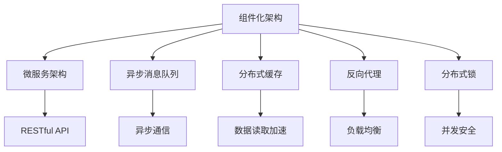

                 

## 1. 背景介绍

随着电商市场的快速发展和消费者需求的多样化，电商平台面临的是日趋复杂和多样化的应用场景，从简单的商品展示和交易，到复杂的推荐系统、库存管理、供应链优化、客户服务等多个环节。为了提高电商平台的运行效率和服务质量，一个可复用、可扩展的通用组件库成为了必要。

### 1.1 问题由来
传统的电商系统通常以单体应用为主，随着业务规模的不断扩大，单体应用带来的维护困难、扩展性差等问题越来越突出。如何构建一个具备高度可复用性和可扩展性的电商系统，成为了电商开发团队面临的一个重要挑战。

### 1.2 问题核心关键点
构建一个高效、可扩展、可维护的电商系统通用组件，需要考虑以下几个关键点：

- **系统架构设计**：如何设计组件间的高效交互机制，构建模块化的系统架构。
- **组件的复用性**：如何设计组件以适应不同的业务场景，实现代码的复用。
- **组件的性能优化**：如何优化组件的性能，保证在高并发、大数据量下的系统稳定性。
- **组件的安全性**：如何设计组件以应对各种安全威胁，如SQL注入、XSS攻击等。
- **组件的可维护性**：如何设计组件以提高代码的可读性和可维护性。
- **组件的易用性**：如何设计组件以提高开发效率和用户体验。

本文将围绕这些关键点，介绍电商系统通用组件的设计和实现思路，以期为电商开发提供参考。

## 2. 核心概念与联系

### 2.1 核心概念概述

为了更好地理解电商系统通用组件的设计和实现思路，本文将介绍几个密切相关的核心概念：

- **组件化架构**：将复杂的系统拆分为多个可复用、可扩展的小组件，通过标准化的接口进行调用。
- **微服务架构**：将系统分解为多个小的、独立的服务，服务间通过RESTful API进行通信。
- **异步消息队列**：用于实现组件间的异步通信，提高系统的并发处理能力。
- **分布式缓存**：用于提高数据的读取速度，减少数据库的负载。
- **反向代理**：用于实现负载均衡、网络安全等功能的中间件。
- **分布式锁**：用于保证组件间的数据一致性和并发安全。

这些核心概念之间的逻辑关系可以通过以下Mermaid流程图来展示：



这个流程图展示了一些电商系统通用组件所涉及的关键技术点：

1. 组件化架构为系统的微服务化提供了基础。
2. 微服务架构通过RESTful API实现了组件间的通信。
3. 异步消息队列和分布式缓存优化了组件间的交互和数据读取。
4. 反向代理和分布式锁保障了系统的稳定性和并发安全。

## 3. 核心算法原理 & 具体操作步骤

### 3.1 算法原理概述

电商系统通用组件的设计和实现，本质上是一个复杂的软件系统构建过程。其核心思想是：将电商系统的各个功能模块抽象为独立的组件，通过标准化接口和配置文件进行灵活的组装和部署。

形式化地，假设电商系统可以分为多个功能组件 $G_1, G_2, \dots, G_n$，则系统的整体架构可以表示为：

$$
S = \bigcup_{i=1}^n G_i
$$

其中 $S$ 表示电商系统的整体架构，$G_i$ 表示单个组件。

组件间的通信可以通过RESTful API、异步消息队列等技术实现，数据的存储和缓存则可以使用分布式数据库、分布式缓存等技术。

### 3.2 算法步骤详解

电商系统通用组件的设计和实现一般包括以下几个关键步骤：

**Step 1: 需求分析与组件划分**

- 分析电商系统的业务需求，识别出可独立拆分的功能模块。
- 将功能模块划分为多个独立的组件，每个组件负责实现特定的功能。

**Step 2: 组件设计**

- 设计组件的接口规范，包括输入输出格式、异常处理机制等。
- 设计组件的内部实现逻辑，包括算法实现、数据结构设计等。
- 设计组件的数据存储方式，包括使用分布式数据库、分布式缓存等。

**Step 3: 组件实现**

- 实现组件的核心功能，编写组件的代码，并进行单元测试。
- 集成组件到电商系统架构中，进行系统测试和性能测试。
- 配置组件的参数，包括RESTful API地址、异步消息队列地址、缓存参数等。

**Step 4: 组件部署与监控**

- 将组件部署到生产环境中，进行负载均衡、集群管理等配置。
- 配置组件的监控工具，实时监控组件的性能指标和运行状态。
- 配置组件的故障恢复机制，确保系统在故障发生时能够快速恢复。

**Step 5: 组件维护与升级**

- 定期对组件进行维护和升级，确保组件的稳定性和兼容性。
- 收集组件的使用反馈，进行功能改进和优化。
- 引入新的功能组件，扩展系统的功能。

以上是电商系统通用组件设计和实现的一般流程。在实际应用中，还需要根据具体业务场景进行优化和调整。

### 3.3 算法优缺点

电商系统通用组件的设计和实现方法具有以下优点：

1. **复用性高**：组件可以独立部署和维护，不同电商系统可以共享组件，减少重复开发。
2. **扩展性好**：组件之间的解耦合性高，新功能可以灵活地扩展和集成到现有系统中。
3. **性能优化**：组件之间的数据传输可以通过异步消息队列等方式优化，提高系统的并发处理能力。
4. **维护成本低**：组件之间的耦合度低，单个组件的维护和升级不会影响整个系统。

同时，该方法也存在一定的局限性：

1. **组件设计复杂**：组件设计和实现过程中，需要考虑接口规范、数据存储方式等诸多因素，设计复杂度较高。
2. **组件间通信开销**：组件间的通信可能会增加系统的额外开销，需要优化通信方式和接口设计。
3. **组件可靠性**：单个组件的故障可能会影响整个系统，需要引入故障恢复机制和监控手段。
4. **组件集成成本**：不同组件之间的集成和配置可能会增加系统的集成成本。

尽管存在这些局限性，但就目前而言，电商系统通用组件的设计和实现方法仍是一种较为高效和可行的解决方案。未来相关研究的重点在于如何进一步提高组件的复用性、扩展性和可维护性，同时兼顾组件的可靠性和性能优化。

### 3.4 算法应用领域

电商系统通用组件的应用领域非常广泛，主要包括：

- **商品管理**：实现商品的信息管理、库存管理、价格管理等功能。
- **订单管理**：实现订单的接收、处理、发货、退换货等功能。
- **支付管理**：实现支付方式的集成和管理，包括信用卡支付、支付宝支付等。
- **物流管理**：实现物流信息的跟踪和管理，包括物流信息的采集和处理。
- **用户管理**：实现用户注册、登录、个人信息管理等功能。
- **推荐系统**：实现基于用户行为和偏好的商品推荐功能。
- **数据分析**：实现基于数据的分析和报告生成，帮助运营团队优化业务决策。
- **安全管理**：实现基于用户身份和行为的安全验证和管理。

除了上述这些核心功能外，电商系统通用组件还可能包括客户服务、市场活动、广告投放、CRM管理等多个模块，涵盖电商系统的各个环节。

## 4. 数学模型和公式 & 详细讲解  
### 4.1 数学模型构建

本节将使用数学语言对电商系统通用组件的设计和实现过程进行更加严格的刻画。

假设电商系统可以分为多个功能组件 $G_1, G_2, \dots, G_n$，每个组件的输入输出可以表示为 $I_i$ 和 $O_i$，其中 $I_i$ 表示组件 $i$ 的输入，$O_i$ 表示组件 $i$ 的输出。组件间的通信可以通过RESTful API、异步消息队列等方式实现，数据存储和缓存则可以使用分布式数据库、分布式缓存等技术。

**组件间通信模型**：
假设组件 $i$ 和组件 $j$ 之间的通信接口为 $C_{i,j}$，其中 $C_{i,j} = (I_i, O_i, I_j, O_j, P_{i,j})$，其中 $P_{i,j}$ 表示组件 $i$ 和组件 $j$ 之间的协议和数据格式规范。

**数据存储模型**：
假设组件 $i$ 的数据存储方式为 $S_i$，其中 $S_i = (D_i, C_i)$，其中 $D_i$ 表示组件 $i$ 的数据模型，$C_i$ 表示组件 $i$ 的数据缓存策略。

**组件监控模型**：
假设组件 $i$ 的监控方式为 $M_i = (T_i, P_i, E_i)$，其中 $T_i$ 表示组件 $i$ 的性能监控指标，$P_i$ 表示组件 $i$ 的异常处理机制，$E_i$ 表示组件 $i$ 的错误日志和报告方式。

### 4.2 公式推导过程

以下我们以推荐系统为例，推导组件间的通信模型和数据存储模型的具体实现。

**组件间通信模型**：
假设推荐系统包含商品推荐和用户行为分析两个组件，其中商品推荐组件的输入为用户行为数据 $I_{recommend}$，输出为用户推荐商品列表 $O_{recommend}$，用户行为分析组件的输入为商品数据 $I_{analyze}$ 和用户行为数据 $I_{user}$，输出为用户的兴趣偏好 $O_{user}$。

组件间通信协议可以表示为：

$$
C_{recommend,analyze} = (I_{recommend}, O_{recommend}, I_{analyze}, O_{analyze}, P_{recommend,analyze})
$$

其中 $P_{recommend,analyze}$ 表示组件间通信的协议和数据格式规范，例如JSON格式。

**数据存储模型**：
假设商品推荐组件的数据存储方式为分布式数据库，用户行为分析组件的数据存储方式为分布式缓存。

商品推荐组件的数据模型可以表示为：

$$
D_{recommend} = (S_{recommend}, R_{recommend})
$$

其中 $S_{recommend}$ 表示商品数据模型，$R_{recommend}$ 表示推荐算法的实现。

用户行为分析组件的数据模型可以表示为：

$$
D_{analyze} = (S_{analyze}, R_{analyze})
$$

其中 $S_{analyze}$ 表示用户行为数据模型，$R_{analyze}$ 表示用户兴趣偏好的分析算法。

组件的数据缓存策略可以表示为：

$$
C_{recommend} = (D_{recommend}, cache_{recommend})
$$

$$
C_{analyze} = (D_{analyze}, cache_{analyze})
$$

其中 $cache_{recommend}$ 和 $cache_{analyze}$ 分别表示组件的缓存策略，例如使用Redis进行缓存。

### 4.3 案例分析与讲解

以用户行为分析组件为例，分析其设计和实现的细节。

**输入数据模型**：
假设用户行为数据包括用户点击、浏览、购买等行为数据，可以表示为：

$$
I_{user} = (user_id, time, action, item_id)
$$

其中 $user_id$ 表示用户ID，$time$ 表示时间戳，$action$ 表示用户行为，$item_id$ 表示商品ID。

**输出数据模型**：
假设用户的兴趣偏好可以表示为用户对不同商品类别的兴趣度，可以表示为：

$$
O_{user} = (category, interest_level)
$$

其中 $category$ 表示商品类别，$interest_level$ 表示兴趣度。

**数据存储策略**：
假设用户行为数据和用户的兴趣偏好分别存储在分布式数据库和分布式缓存中。

**组件实现逻辑**：
用户行为分析组件的实现逻辑可以表示为：

$$
R_{analyze} = (I_{user}, D_{analyze}, C_{analyze}, O_{user})
$$

其中 $I_{user}$ 表示用户行为数据的输入，$D_{analyze}$ 表示用户行为数据模型，$C_{analyze}$ 表示数据缓存策略，$O_{user}$ 表示用户兴趣偏好的输出。

## 5. 项目实践：代码实例和详细解释说明
### 5.1 开发环境搭建

在进行组件开发前，我们需要准备好开发环境。以下是使用Python进行Django框架开发的环境配置流程：

1. 安装Python：从官网下载并安装Python，用于编写组件代码。
2. 安装Django：使用pip安装Django框架，并创建新项目。
3. 安装开发工具：安装Visual Studio Code、PyCharm等开发工具，用于编写和调试代码。
4. 安装数据模型库：安装SQLAlchemy、Pandas等数据模型和数据处理库。
5. 安装缓存库：安装Redis、Memcached等缓存库，用于优化数据读取。

完成上述步骤后，即可在项目中开始组件开发。

### 5.2 源代码详细实现

下面我们以用户行为分析组件为例，给出使用Django框架进行组件开发的Python代码实现。

**组件接口设计**：
首先，定义组件的接口规范，包括输入输出格式和异常处理机制：

```python
from django.http import JsonResponse
from django.views.decorators.csrf import csrf_exempt

@csrf_exempt
def analyze_user_behavior(request):
    if request.method == 'POST':
        try:
            user_id = request.POST.get('user_id')
            time = request.POST.get('time')
            action = request.POST.get('action')
            item_id = request.POST.get('item_id')
            # 调用用户行为分析组件的实现逻辑
            result = analyze_user_behavior_logic(user_id, time, action, item_id)
            # 返回分析结果
            return JsonResponse(result)
        except Exception as e:
            return JsonResponse({'error': str(e)})
    else:
        return JsonResponse({'error': 'Method not allowed.'})
```

**组件实现逻辑**：
接下来，定义组件的实现逻辑，包括数据读取、计算和输出：

```python
from django.http import JsonResponse
from django.views.decorators.csrf import csrf_exempt
import time
import datetime

@csrf_exempt
def analyze_user_behavior_logic(user_id, time, action, item_id):
    # 读取用户行为数据
    data = read_user_behavior_data(user_id, time, action, item_id)
    # 计算用户兴趣偏好
    result = calculate_user_interest(data)
    return result

def read_user_behavior_data(user_id, time, action, item_id):
    # 读取用户行为数据，并返回数据列表
    pass

def calculate_user_interest(data):
    # 计算用户兴趣偏好，并返回兴趣偏好列表
    pass
```

**组件数据存储**：
最后，定义组件的数据存储方式，包括使用Redis进行缓存：

```python
from django.http import JsonResponse
from django.views.decorators.csrf import csrf_exempt
import time
import datetime
import redis

@csrf_exempt
def analyze_user_behavior_logic(user_id, time, action, item_id):
    # 读取用户行为数据
    redis_conn = redis.StrictRedis(host='localhost', port=6379, db=0)
    key = 'user_behavior_data:%s:%s:%s:%s' % (user_id, time, action, item_id)
    data = redis_conn.get(key)
    if data is None:
        data = read_user_behavior_data(user_id, time, action, item_id)
        # 存储用户行为数据到缓存中
        redis_conn.set(key, data, ex=3600)
    return result

def read_user_behavior_data(user_id, time, action, item_id):
    # 读取用户行为数据，并返回数据列表
    pass

def calculate_user_interest(data):
    # 计算用户兴趣偏好，并返回兴趣偏好列表
    pass
```

### 5.3 代码解读与分析

让我们再详细解读一下关键代码的实现细节：

**组件接口设计**：
- `analyze_user_behavior` 函数：定义了组件的接口，接收用户行为数据的POST请求，调用 `analyze_user_behavior_logic` 函数进行逻辑处理，并返回JSON格式的分析结果。
- `csrf_exempt` 装饰器：防止跨站请求伪造攻击。
- 异常处理：在出现异常时，返回JSON格式的错误信息。

**组件实现逻辑**：
- `analyze_user_behavior_logic` 函数：定义了组件的核心实现逻辑，包括读取用户行为数据和计算用户兴趣偏好。

**组件数据存储**：
- 使用Redis作为数据缓存，通过设置键名来标识用户行为数据。

可以看出，Django框架提供了丰富的接口和工具，可以轻松地实现电商系统通用组件的开发和部署。

## 6. 实际应用场景

### 6.1 智能推荐系统

智能推荐系统是电商系统的核心功能之一，通过分析用户的行为和偏好，为用户推荐感兴趣的商品。微服务架构和大数据技术，能够有效支持智能推荐系统的构建。

**应用场景**：
- 在用户浏览商品页面时，实时推荐相关商品。
- 在用户购买商品后，推荐相关商品或配件。
- 在用户进行社交分享时，推荐感兴趣的商品或内容。

**组件设计**：
- 商品推荐组件：读取用户行为数据，调用推荐算法生成推荐商品列表。
- 用户行为分析组件：分析用户的行为数据，生成用户的兴趣偏好。
- 数据存储组件：将用户行为数据和推荐结果存储在分布式数据库中。

**组件实现**：
- 使用Django框架实现组件的RESTful API接口，方便其他系统调用。
- 使用Python编写推荐算法的实现逻辑。
- 使用Redis进行数据缓存，提高数据读取速度。

**组件部署**：
- 将组件部署到Django应用中，配置RESTful API接口。
- 配置组件的缓存和监控参数，确保组件的高可用性和性能。

### 6.2 库存管理系统

库存管理系统是电商系统的重要组成部分，负责管理商品的库存和补货信息。微服务架构和大数据技术，能够有效支持库存管理系统的构建。

**应用场景**：
- 实时监控商品的库存状态。
- 预测商品的销售趋势，优化库存管理。
- 根据订单信息，自动补货。

**组件设计**：
- 库存管理组件：读取商品的库存信息，生成库存报表。
- 销售预测组件：分析历史销售数据，预测未来的销售趋势。
- 自动补货组件：根据订单信息和库存状态，自动生成补货计划。

**组件实现**：
- 使用Django框架实现组件的RESTful API接口，方便其他系统调用。
- 使用Python编写库存管理和预测算法的实现逻辑。
- 使用Redis进行数据缓存，提高数据读取速度。

**组件部署**：
- 将组件部署到Django应用中，配置RESTful API接口。
- 配置组件的缓存和监控参数，确保组件的高可用性和性能。

### 6.3 物流管理系统

物流管理系统是电商系统的重要组成部分，负责管理商品的物流信息，跟踪物流状态。微服务架构和大数据技术，能够有效支持物流管理系统的构建。

**应用场景**：
- 实时监控商品的物流状态。
- 生成物流报表，分析物流效率。
- 根据订单信息，生成物流计划。

**组件设计**：
- 物流跟踪组件：读取商品的物流信息，生成物流报表。
- 物流分析组件：分析物流数据，生成物流效率报表。
- 物流计划组件：根据订单信息，生成物流计划。

**组件实现**：
- 使用Django框架实现组件的RESTful API接口，方便其他系统调用。
- 使用Python编写物流跟踪、分析和计划算法的实现逻辑。
- 使用Redis进行数据缓存，提高数据读取速度。

**组件部署**：
- 将组件部署到Django应用中，配置RESTful API接口。
- 配置组件的缓存和监控参数，确保组件的高可用性和性能。

## 7. 工具和资源推荐
### 7.1 学习资源推荐

为了帮助开发者系统掌握电商系统通用组件的设计和实现思路，这里推荐一些优质的学习资源：

1. **《Django Web开发实战》**：一本经典Django开发教程，全面介绍了Django框架的使用方法和技巧。
2. **《微服务架构设计》**：一本介绍微服务架构设计的书籍，详细讲解了微服务架构的原理和实践方法。
3. **《数据缓存技术》**：一本介绍数据缓存技术的书籍，详细讲解了Redis、Memcached等缓存工具的使用方法和技巧。
4. **《Django REST framework》官方文档**：Django REST framework的官方文档，提供了丰富的RESTful API开发资源。
5. **《TensorFlow与深度学习》**：一本介绍TensorFlow框架的书籍，详细讲解了TensorFlow的使用方法和深度学习模型设计。

通过对这些资源的学习实践，相信你一定能够快速掌握电商系统通用组件的设计和实现思路，并用于解决实际的电商问题。

### 7.2 开发工具推荐

高效的开发离不开优秀的工具支持。以下是几款用于电商系统通用组件开发的常用工具：

1. **Django**：基于Python的开源Web框架，提供了丰富的组件库和Web开发工具。
2. **RESTful API开发工具**：如Django REST framework，提供了强大的RESTful API开发支持。
3. **数据缓存工具**：如Redis、Memcached，提供了高效的数据缓存和读写功能。
4. **反向代理工具**：如Nginx，提供了高效的反向代理功能，保障系统的稳定性和性能。
5. **监控工具**：如Prometheus、Grafana，提供了实时的性能监控和可视化功能。

合理利用这些工具，可以显著提升电商系统通用组件的开发效率，加快创新迭代的步伐。

### 7.3 相关论文推荐

电商系统通用组件的研究源于学界的持续研究。以下是几篇奠基性的相关论文，推荐阅读：

1. **《微服务架构：设计模式与实践》**：介绍微服务架构的设计模式和实践方法，为电商系统组件化提供了理论基础。
2. **《分布式缓存技术》**：详细介绍了Redis、Memcached等缓存工具的使用方法和性能优化技巧。
3. **《基于RESTful API的电商系统设计》**：介绍基于RESTful API的电商系统设计思路和实现方法。
4. **《数据缓存与高性能Web系统》**：探讨了数据缓存在电商系统中的作用和实现方法。

这些论文代表了大电商系统通用组件研究的发展脉络。通过学习这些前沿成果，可以帮助研究者把握学科前进方向，激发更多的创新灵感。

## 8. 总结：未来发展趋势与挑战

### 8.1 总结

本文对电商系统通用组件的设计和实现方法进行了全面系统的介绍。首先阐述了电商系统组件化的必要性，明确了组件化架构和微服务架构的原理和优势。其次，从原理到实践，详细讲解了电商系统通用组件的设计和实现思路，给出了微调任务开发的完整代码实例。同时，本文还广泛探讨了组件在推荐系统、库存管理、物流管理等多个领域的应用前景，展示了组件化的巨大潜力。最后，本文精选了组件开发所需的各类学习资源，力求为读者提供全方位的技术指引。

通过本文的系统梳理，可以看到，电商系统通用组件正在成为电商开发的重要方向，极大地提升了电商系统的运行效率和服务质量。组件化架构和微服务架构为电商系统的模块化和可扩展性提供了坚实的基础，显著降低了电商系统的开发和维护成本。未来，伴随组件化架构的不断演进，电商系统必将在更多的领域得到应用，为电商行业带来新的突破。

### 8.2 未来发展趋势

展望未来，电商系统通用组件的发展趋势如下：

1. **组件化程度更高**：随着电商业务的不断发展，组件化架构将逐渐成为电商系统的标准配置，组件的复用性和可扩展性将进一步提升。
2. **微服务架构更加完善**：微服务架构将不断优化，组件间的通信和数据交互将更加高效，系统整体的性能和稳定性将进一步提升。
3. **数据缓存技术更加成熟**：缓存技术将不断优化，Redis、Memcached等缓存工具将进一步完善，数据读取速度将显著提升。
4. **分布式监控和故障恢复机制更加完善**：监控工具和故障恢复机制将不断优化，系统的高可用性和稳定性将进一步提升。
5. **人工智能技术的应用更加广泛**：基于组件的人工智能应用将更加广泛，如智能推荐、库存预测、物流优化等，为电商系统带来新的突破。

以上趋势凸显了电商系统通用组件技术的广阔前景。这些方向的探索发展，必将进一步提升电商系统的性能和应用范围，为电商行业带来新的变革。

### 8.3 面临的挑战

尽管电商系统通用组件技术已经取得了瞩目成就，但在迈向更加智能化、普适化应用的过程中，它仍面临着诸多挑战：

1. **组件设计复杂度**：组件设计和实现过程中，需要考虑接口规范、数据存储方式等诸多因素，设计复杂度较高。
2. **组件间通信开销**：组件间的通信可能会增加系统的额外开销，需要优化通信方式和接口设计。
3. **组件可靠性**：单个组件的故障可能会影响整个系统，需要引入故障恢复机制和监控手段。
4. **组件集成成本**：不同组件之间的集成和配置可能会增加系统的集成成本。
5. **组件维护成本**：组件的维护和升级可能会增加系统的维护成本。

尽管存在这些挑战，但通过不断优化组件的设计和实现方法，相信电商系统通用组件技术必将在电商系统中发挥更大的作用，为电商行业带来更多的价值。

### 8.4 研究展望

未来的研究需要在以下几个方面寻求新的突破：

1. **组件设计的自动化**：引入自动化设计工具，自动生成组件的接口规范和实现逻辑，提高组件设计的效率和可维护性。
2. **组件间通信的优化**：优化组件间的通信方式，减少通信开销，提高系统的整体性能。
3. **组件的智能化**：引入人工智能技术，如机器学习、深度学习等，提升组件的智能分析和决策能力。
4. **组件的可定制性**：引入配置化设计和模块化开发方法，提升组件的定制化和可扩展性。
5. **组件的易用性**：引入图形化开发工具和可视化界面，提升组件的易用性和用户体验。

这些研究方向的探索，必将引领电商系统通用组件技术迈向更高的台阶，为电商系统的模块化和智能化的发展提供新的动力。

## 9. 附录：常见问题与解答

**Q1：电商系统通用组件是否适用于所有电商业务？**

A: 电商系统通用组件可以应用于大多数电商业务场景，但不同业务场景可能需要针对性地进行组件设计和实现。例如，B2B电商和B2C电商在业务流程和功能上有所区别，需要设计不同的组件。

**Q2：组件设计时如何兼顾复用性和性能？**

A: 组件设计时，需要根据具体业务场景进行权衡。一般来说，复用性较高的组件可以采用较轻量级的实现方式，性能要求较高的组件可以采用较复杂的实现方式。例如，订单管理系统可能需要高性能的实现方式，而用户管理组件可以采用较轻量级的实现方式。

**Q3：组件间通信开销如何优化？**

A: 组件间通信开销可以通过以下方法进行优化：
1. 采用高效的通信协议，如HTTP/2。
2. 减少通信次数，合并多个请求为单次请求。
3. 使用缓存技术，减少重复数据传输。

**Q4：组件的故障恢复机制如何设计？**

A: 组件的故障恢复机制可以设计为：
1. 使用多副本机制，保证组件的高可用性。
2. 实现自动故障切换，保障系统的稳定性。
3. 配置监控工具，及时发现和处理故障。

**Q5：组件的性能如何优化？**

A: 组件的性能可以通过以下方法进行优化：
1. 使用缓存技术，减少数据读取开销。
2. 优化算法实现，减少计算开销。
3. 使用并发处理机制，提高并发处理能力。

这些方法都需要根据具体业务场景进行灵活应用，以达到最优的性能和可靠性。

---

作者：禅与计算机程序设计艺术 / Zen and the Art of Computer Programming

