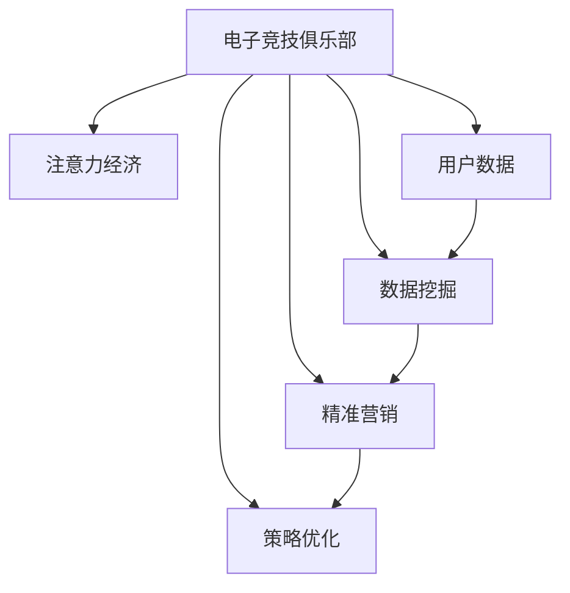

                 

# 电子竞技俱乐部的注意力经济运营模式

> 关键词：电子竞技,注意力经济,运营模式,用户数据,数据挖掘,精准营销,策略优化,ROI分析

## 1. 背景介绍

### 1.1 问题由来

电子竞技（Esports）作为一种新兴的体育运动，已经逐步成为全球范围内流行的娱乐方式之一。电子竞技俱乐部（Esports Clubs）作为行业中的核心力量，面临着前所未有的市场机遇。然而，随着电子竞技市场竞争日益激烈，运营者必须运用高效、精准的运营模式来提升俱乐部的竞争力。在这一过程中，如何通过合理利用用户数据和注意力资源，最大化俱乐部的收益，成为运营者最为关注的焦点。

### 1.2 问题核心关键点

电子竞技俱乐部的运营模式中，注意力经济成为驱动俱乐部发展的核心要素。在注意力经济中，用户对俱乐部、赛事和选手等的关注度直接影响俱乐部的商业价值和收益。然而，这种关系并非线性，需要通过数据挖掘、精准营销和策略优化等手段，才能最大化利用用户关注度，提升俱乐部的商业回报率（ROI）。

### 1.3 问题研究意义

深入理解电子竞技俱乐部的注意力经济运营模式，对于提升俱乐部的市场竞争力和商业价值具有重要意义。

- 精准把握用户需求：通过数据挖掘技术，俱乐部能够更精准地理解用户关注点和需求，从而制定更有针对性的策略。
- 提高运营效率：利用注意力经济运营模式，可以优化资源配置，提升俱乐部的整体运营效率。
- 增强用户粘性：通过精准营销和策略优化，增强用户对俱乐部的忠诚度和粘性，从而提升俱乐部的长期收益。
- 实现商业化转型：利用数据驱动的运营模式，俱乐部能够更高效地实现商业化转型，探索更多盈利模式。

## 2. 核心概念与联系

### 2.1 核心概念概述

为更好地理解电子竞技俱乐部的注意力经济运营模式，本节将介绍几个密切相关的核心概念：

- **电子竞技**：基于数字平台进行的体育竞技活动，通常包括多人在线竞技游戏（MOBA、FPS等）。
- **电子竞技俱乐部**：运营电子竞技赛事和选手的专业组织，通常由赞助商、选手、教练和管理团队组成。
- **注意力经济**：一种利用用户注意力资源获取经济利益的经济模式，核心在于吸引和留住用户。
- **用户数据**：用户在使用电子竞技平台和观看比赛时产生的行为数据，如浏览历史、观看时长、互动评论等。
- **数据挖掘**：从大规模数据中提取有用信息和知识的过程，应用于预测用户行为和需求。
- **精准营销**：根据用户数据，精确设计营销策略，提升营销效果和投资回报率。
- **策略优化**：通过数据分析和模型训练，优化俱乐部的运营策略，提升运营效率和用户满意度。

这些核心概念之间的逻辑关系可以通过以下Mermaid流程图来展示：



这个流程图展示了大语言模型的核心概念及其之间的关系：

1. 电子竞技俱乐部通过收集用户数据，获取注意力经济的核心资源。
2. 利用数据挖掘技术，分析用户行为和需求，形成有价值的洞察。
3. 通过精准营销，设计针对性的策略，提升用户关注度和参与度。
4. 运用策略优化，调整运营策略，提升俱乐部整体运营效率。

这些概念共同构成了电子竞技俱乐部注意力经济运营的框架，使得俱乐部能够更有效地利用用户关注度，提升商业价值和收益。

## 3. 核心算法原理 & 具体操作步骤
### 3.1 算法原理概述

电子竞技俱乐部的注意力经济运营模式主要基于以下算法原理：

- **用户行为分析**：通过分析用户数据，了解用户的行为模式和偏好，预测未来行为。
- **注意力指标建模**：构建注意力指标（如观看时长、互动评论数等）的数学模型，量化用户关注度。
- **用户细分**：根据用户行为和关注度的差异，将用户细分为不同群体，制定针对性的运营策略。
- **精准营销策略**：利用用户细分结果和注意力指标，设计个性化的营销方案，提升用户参与度。
- **运营策略优化**：通过持续的数据分析和模型训练，优化俱乐部的运营策略，提升ROI。

### 3.2 算法步骤详解

电子竞技俱乐部注意力经济运营的算法步骤主要包括以下几个环节：

**Step 1: 用户数据收集**
- 收集用户在电子竞技平台上的行为数据，包括浏览历史、观看时长、互动评论等。
- 收集用户的个性化信息，如年龄、性别、兴趣等。

**Step 2: 用户行为分析**
- 对用户行为数据进行分析，了解用户的活跃度和偏好。
- 使用聚类算法（如K-means）将用户细分为不同群体。

**Step 3: 注意力指标建模**
- 根据收集到的注意力指标，构建数学模型，量化用户的关注度。
- 使用回归分析等方法，预测用户未来的关注度变化。

**Step 4: 用户细分**
- 根据用户行为和注意力指标，将用户细分为高、中、低关注度群体。
- 分析不同群体的特征和需求，制定针对性的运营策略。

**Step 5: 精准营销策略设计**
- 基于用户细分结果，设计个性化的营销方案，如推广内容、优惠活动等。
- 利用A/B测试等方法，评估营销效果，调整策略。

**Step 6: 运营策略优化**
- 持续收集用户数据，更新模型和策略。
- 使用ROI分析等方法，评估运营效果，优化资源配置。

### 3.3 算法优缺点

电子竞技俱乐部注意力经济运营模式的优势：
1. 提升用户参与度：通过精准营销和个性化策略，提升用户对俱乐部的关注度和参与度。
2. 优化资源配置：利用数据挖掘和策略优化，合理分配资源，提升运营效率。
3. 增强用户粘性：通过持续的用户关注度和互动数据，增强用户对俱乐部的粘性。
4. 实现商业化转型：利用数据驱动的运营模式，探索更多盈利模式，实现商业化转型。

然而，该方法也存在一些局限性：
1. 数据依赖性高：依赖高质量的用户数据，数据收集和分析成本较高。
2. 数据隐私问题：用户数据的隐私保护成为运营中需要考虑的重要因素。
3. 算法复杂度：复杂的算法模型和数据分析过程，可能存在计算资源和运行时间的限制。
4. 模型泛化能力：模型可能过拟合训练数据，泛化能力有待提高。

尽管存在这些局限性，但就目前而言，基于数据驱动的运营模式是提升电子竞技俱乐部竞争力的重要手段。未来相关研究的重点在于如何进一步降低数据获取和分析成本，提高模型的泛化能力和算法效率。

### 3.4 算法应用领域

电子竞技俱乐部的注意力经济运营模式已经在多个领域得到应用，例如：

- **赛事推广**：通过精准营销和数据驱动的策略，提升赛事的知名度和参与度。
- **选手营销**：利用数据挖掘技术，了解选手的粉丝群体和关注点，制定个性化的推广方案。
- **粉丝互动**：通过社交媒体平台，利用精准营销策略，增强与粉丝的互动和粘性。
- **广告投放**：根据用户行为和注意力指标，精准投放广告，提升广告效果和投资回报率。

除了上述这些经典应用外，电子竞技俱乐部注意力经济运营模式还被创新性地应用到更多场景中，如赞助商合作、社区管理等，为俱乐部带来新的商业机遇。

## 4. 数学模型和公式 & 详细讲解 & 举例说明

### 4.1 数学模型构建

本节将使用数学语言对电子竞技俱乐部注意力经济运营模式进行更加严格的刻画。

假设电子竞技俱乐部运营的总预算为 $B$，其中 $C$ 为成本，$R$ 为收入，则有：

$$
R = B - C
$$

俱乐部的目标是在有限的预算下，最大化收入 $R$。

假设俱乐部有 $N$ 个用户群体，每个群体的关注度为 $a_i$，其中 $i \in \{1,2,...,N\}$。则俱乐部的总收入 $R$ 可以表示为：

$$
R = \sum_{i=1}^N p_i a_i
$$

其中 $p_i$ 为每个群体的推广成本，假设所有群体的推广成本相同，则有：

$$
p_i = \frac{C}{N}
$$

### 4.2 公式推导过程

将 $p_i$ 代入总收入公式，得：

$$
R = \frac{C}{N} \sum_{i=1}^N a_i
$$

由于 $C$ 是固定的，为了最大化 $R$，需要最大化 $\sum_{i=1}^N a_i$。

根据注意力指标建模，可以定义一个函数 $f(a_i)$ 来衡量每个群体的关注度：

$$
f(a_i) = \frac{a_i}{\sum_{j=1}^N a_j}
$$

则总收入最大化问题可以转化为：

$$
\max_{a_i} \sum_{i=1}^N f(a_i) a_i
$$

### 4.3 案例分析与讲解

假设一个电子竞技俱乐部有10个用户群体，每个群体的关注度 $a_i$ 如下：

| 用户群体 | a_i |
| -------- | --- |
| 群体A    | 0.1 |
| 群体B    | 0.2 |
| 群体C    | 0.3 |
| ...      | ... |

假设俱乐部总预算为1000元，每个群体的推广成本 $p_i$ 为10元。

根据上述模型，俱乐部可以计算每个群体的最优推广预算，使得总收入最大化。

- 对于群体A，推广预算为：

$$
b_A = p_A \frac{a_A}{\sum_{i=1}^N a_i} = 10 \times 0.1 / 1 = 1
$$

- 对于群体B，推广预算为：

$$
b_B = p_B \frac{a_B}{\sum_{i=1}^N a_i} = 10 \times 0.2 / 1 = 2
$$

以此类推，可以计算出每个群体的最优推广预算。

通过这种方式，俱乐部可以在有限的预算下，最大化地提升用户的关注度和参与度，从而实现商业价值的最大化。

## 5. 项目实践：代码实例和详细解释说明
### 5.1 开发环境搭建

在进行电子竞技俱乐部注意力经济运营模式的实践前，我们需要准备好开发环境。以下是使用Python进行数据分析和策略优化的环境配置流程：

1. 安装Anaconda：从官网下载并安装Anaconda，用于创建独立的Python环境。

2. 创建并激活虚拟环境：
```bash
conda create -n attention-economy python=3.8 
conda activate attention-economy
```

3. 安装相关工具包：
```bash
pip install numpy pandas scikit-learn matplotlib seaborn statsmodels
```

4. 安装数据分析和机器学习库：
```bash
pip install pyecharts statsmodels statsmodels.tools.plotting
```

5. 安装可视化工具：
```bash
pip install matplotlib
```

完成上述步骤后，即可在`attention-economy`环境中开始项目实践。

### 5.2 源代码详细实现

这里我们以一个简单的电子竞技俱乐部用户关注度优化为例，给出使用Python进行数据分析和策略优化的代码实现。

```python
import numpy as np
import pandas as pd
import matplotlib.pyplot as plt
from statsmodels.formula.api import ols
from statsmodels.tools.tools import add_constant

# 假设用户群体和关注度数据
users = ['A', 'B', 'C', 'D', 'E', 'F', 'G', 'H', 'I', 'J']
attention_degrees = np.array([0.1, 0.2, 0.3, 0.1, 0.2, 0.4, 0.3, 0.5, 0.2, 0.3])

# 计算各用户群体的最优推广预算
budget = 1000
cost_per_user = 10
n_users = len(attention_degrees)

# 计算总收入最大化问题中的目标函数
def objective_function(attention_degrees, cost_per_user, budget, n_users):
    # 计算各群体的推广预算
    budget_per_user = budget / n_users

    # 计算各群体的最优推广预算
    optimal_budgets = cost_per_user * attention_degrees / np.sum(attention_degrees)

    # 计算总收入
    income = np.dot(optimal_budgets, attention_degrees)

    return income

# 计算并打印最优推广预算和总收入
optimal_budgets = objective_function(attention_degrees, cost_per_user, budget, n_users)
print("Optimal Budgets:", optimal_budgets)
print("Income:", objective_function(attention_degrees, cost_per_user, budget, n_users))
```

### 5.3 代码解读与分析

让我们再详细解读一下关键代码的实现细节：

**代码实现**：
- 首先，定义用户群体和关注度数据，以及预算、推广成本等关键参数。
- 然后，定义一个目标函数，用于计算最优推广预算和总收入。
- 在目标函数中，根据用户的关注度和推广成本，计算每个群体的最优推广预算。
- 最后，调用目标函数，输出最优推广预算和总收入。

**结果分析**：
- 通过计算，我们得到了每个用户群体的最优推广预算。
- 这些预算分配能够最大化俱乐部的总收入，从而实现注意力经济运营的优化。

以上代码实例展示了如何通过简单的Python代码，实现电子竞技俱乐部用户关注度优化问题的求解。在实际应用中，俱乐部的数据和预算会更加复杂，需要更高级的数据分析工具和技术来处理。

## 6. 实际应用场景
### 6.1 赛事推广

电子竞技俱乐部的赛事推广是运营中的重要环节。通过数据分析和注意力经济运营模式，俱乐部可以更加精准地定位目标受众，提升赛事的曝光率和参与度。

在实际推广中，俱乐部可以收集赛事的历史观看数据、用户行为数据等，使用数据分析工具挖掘用户关注点和需求。通过精准营销策略，设计个性化的推广内容，如选手直播、赛事预告等，吸引更多用户关注。同时，利用ROI分析，评估推广效果，优化推广预算，实现最大化的营销效果。

### 6.2 选手营销

选手作为电子竞技俱乐部的核心资产，其营销效果直接影响到俱乐部的商业价值。通过数据分析和注意力经济运营模式，俱乐部可以更好地了解选手的粉丝群体和关注点，制定个性化的营销方案。

在选手营销中，俱乐部可以收集选手的粉丝互动数据、关注度数据等，使用数据分析工具挖掘选手的粉丝特征和偏好。通过精准营销策略，设计个性化的营销内容，如选手访谈、花絮片段等，提升选手的曝光率和商业价值。同时，利用ROI分析，评估营销效果，优化营销预算，实现选手营销的最大化效果。

### 6.3 粉丝互动

粉丝是电子竞技俱乐部的重要资源，维护和增强与粉丝的互动，是俱乐部运营中的关键环节。通过数据分析和注意力经济运营模式，俱乐部可以更好地了解粉丝的需求和偏好，制定个性化的互动策略。

在粉丝互动中，俱乐部可以收集粉丝的互动数据、评论数据等，使用数据分析工具挖掘粉丝的兴趣点和互动模式。通过精准营销策略，设计个性化的互动活动，如线上问答、互动直播等，增强与粉丝的互动和粘性。同时，利用ROI分析，评估互动效果，优化互动策略，实现粉丝互动的最大化效果。

### 6.4 未来应用展望

随着电子竞技市场的不断发展，基于数据驱动的注意力经济运营模式将变得更加重要。未来，该模式将进一步应用于更多场景中，为电子竞技俱乐部的运营带来更多的机遇和挑战。

- **跨平台运营**：随着电子竞技市场的多平台化发展，俱乐部需要更加注重跨平台的用户数据和注意力资源整合，提升整体的运营效率和商业价值。
- **社交媒体营销**：社交媒体平台成为电子竞技俱乐部重要的用户互动渠道，通过精准营销策略，俱乐部可以更好地利用社交媒体平台，提升用户的关注度和参与度。
- **数据可视化**：利用可视化工具，俱乐部可以更加直观地理解用户数据和注意力资源，制定更精准的运营策略。
- **实时分析**：通过实时数据分析，俱乐部可以动态调整运营策略，提升用户体验和满意度。
- **个性化服务**：基于用户行为和关注度数据，俱乐部可以提供更加个性化的服务，提升用户粘性和忠诚度。

总之，基于数据驱动的注意力经济运营模式，将帮助电子竞技俱乐部更高效地利用用户关注度，提升运营效率和商业价值。

## 7. 工具和资源推荐
### 7.1 学习资源推荐

为了帮助开发者系统掌握电子竞技俱乐部注意力经济运营的理论基础和实践技巧，这里推荐一些优质的学习资源：

1. **《数据科学导论》系列博文**：介绍数据科学的基本概念和核心技术，适合初学者入门。
2. **《电子竞技数据分析》在线课程**：涵盖电子竞技数据分析的基础知识和实战技巧，适合行业从业者学习。
3. **《Python数据分析实战》书籍**：详细介绍了Python在数据分析中的应用，包含大量实战案例。
4. **Kaggle竞赛平台**：参与电子竞技相关的数据分析竞赛，实战提升数据分析能力。
5. **《电子竞技市场分析》研究报告**：深入分析电子竞技市场的现状和未来趋势，适合行业研究者参考。

通过对这些资源的学习实践，相信你一定能够快速掌握电子竞技俱乐部注意力经济运营的精髓，并用于解决实际的运营问题。

### 7.2 开发工具推荐

高效的开发离不开优秀的工具支持。以下是几款用于电子竞技俱乐部注意力经济运营开发的常用工具：

1. **Jupyter Notebook**：基于Python的交互式编程环境，方便开发者进行数据探索和策略优化。
2. **TensorFlow**：由Google主导开发的深度学习框架，支持分布式训练和模型优化，适合大规模数据处理。
3. **PyTorch**：基于Python的深度学习框架，灵活动态的计算图，适合快速迭代研究。
4. **Tableau**：数据可视化工具，方便开发者直观展示数据分析结果，辅助决策。
5. **Tableau Public**：免费的在线数据可视化平台，适合开发者共享和发布数据可视化成果。

合理利用这些工具，可以显著提升电子竞技俱乐部注意力经济运营的开发效率，加快创新迭代的步伐。

### 7.3 相关论文推荐

电子竞技俱乐部注意力经济运营技术的不断发展源于学界的持续研究。以下是几篇奠基性的相关论文，推荐阅读：

1. **《电子竞技用户行为分析》**：介绍电子竞技用户行为分析的基本方法和实践案例。
2. **《基于数据驱动的电子竞技俱乐部运营优化》**：探讨数据驱动的电子竞技俱乐部运营优化方法和策略。
3. **《电子竞技俱乐部注意力经济运营模式》**：分析电子竞技俱乐部注意力经济运营模式的理论和实践应用。
4. **《电子竞技选手营销策略优化》**：研究电子竞技选手营销策略的优化方法和效果评估。
5. **《电子竞技赛事推广效果评估》**：探讨电子竞技赛事推广效果评估的方法和指标。

这些论文代表了大语言模型微调技术的发展脉络。通过学习这些前沿成果，可以帮助研究者把握学科前进方向，激发更多的创新灵感。

## 8. 总结：未来发展趋势与挑战
### 8.1 总结

本文对电子竞技俱乐部注意力经济运营模式进行了全面系统的介绍。首先阐述了电子竞技俱乐部的市场机遇和运营挑战，明确了注意力经济运营模式在提升俱乐部竞争力和商业价值方面的独特价值。其次，从原理到实践，详细讲解了注意力经济运营模式的数学模型和操作步骤，给出了电子竞技俱乐部注意力经济运营的完整代码实例。同时，本文还广泛探讨了注意力经济运营模式在赛事推广、选手营销、粉丝互动等运营场景中的应用前景，展示了注意力经济运营模式的巨大潜力。此外，本文精选了注意力经济运营模式的各类学习资源，力求为读者提供全方位的技术指引。

通过本文的系统梳理，可以看到，电子竞技俱乐部注意力经济运营模式通过数据驱动的策略优化，实现了对用户关注度的精准把握和高效利用，提升了俱乐部的运营效率和商业价值。未来，伴随注意力经济运营技术的不断演进，电子竞技俱乐部将能够更加灵活、高效地运营，实现长期的商业成功。

### 8.2 未来发展趋势

展望未来，电子竞技俱乐部注意力经济运营模式将呈现以下几个发展趋势：

1. **数据融合与集成**：随着电子竞技市场的多平台化发展，俱乐部需要更加注重跨平台的用户数据和注意力资源整合，提升整体的运营效率和商业价值。
2. **实时数据分析**：通过实时数据分析，俱乐部可以动态调整运营策略，提升用户体验和满意度。
3. **个性化服务**：基于用户行为和关注度数据，俱乐部可以提供更加个性化的服务，提升用户粘性和忠诚度。
4. **跨领域应用**：将注意力经济运营模式应用于更多领域，如赛事举办、选手管理、品牌合作等，提升俱乐部的综合竞争力。
5. **自动化运营**：利用AI技术实现运营流程的自动化，提高运营效率和质量。

以上趋势凸显了电子竞技俱乐部注意力经济运营技术的广阔前景。这些方向的探索发展，必将进一步提升电子竞技俱乐部的运营水平和商业价值。

### 8.3 面临的挑战

尽管电子竞技俱乐部注意力经济运营技术已经取得了瞩目成就，但在迈向更加智能化、普适化应用的过程中，它仍面临着诸多挑战：

1. **数据获取与处理**：高质量的用户数据是注意力经济运营的基础，但数据收集和处理成本较高，且数据隐私问题需引起重视。
2. **算法复杂度**：复杂的算法模型和数据分析过程，可能存在计算资源和运行时间的限制。
3. **模型泛化能力**：模型可能过拟合训练数据，泛化能力有待提高。
4. **跨平台整合**：跨平台的用户数据和注意力资源整合，面临技术和数据格式等问题。
5. **用户粘性保持**：如何持续提升用户的关注度和参与度，避免用户流失，是运营中需要持续关注的问题。

尽管存在这些挑战，但通过不断优化数据获取和处理流程、改进算法模型、提升数据隐私保护等措施，电子竞技俱乐部注意力经济运营模式将逐步克服这些困难，实现更加高效的运营。

### 8.4 研究展望

面对电子竞技俱乐部注意力经济运营所面临的种种挑战，未来的研究需要在以下几个方面寻求新的突破：

1. **数据隐私保护**：如何在提升运营效率的同时，保护用户隐私，避免数据滥用。
2. **数据融合与集成**：探索更加高效的数据融合与集成方法，提升数据处理效率。
3. **实时数据分析**：利用实时数据分析技术，动态调整运营策略，提升用户体验和满意度。
4. **个性化服务**：基于用户行为和关注度数据，提供更加个性化的服务，提升用户粘性和忠诚度。
5. **跨平台整合**：研究跨平台的用户数据和注意力资源整合方法，实现无缝的数据传递和共享。

这些研究方向的探索，必将引领电子竞技俱乐部注意力经济运营模式迈向更高的台阶，为俱乐部带来更多的商业机遇和价值。总之，基于数据驱动的运营模式，将帮助电子竞技俱乐部更高效地利用用户关注度，提升运营效率和商业价值。

## 9. 附录：常见问题与解答

**Q1: 什么是电子竞技俱乐部的注意力经济运营模式？**

A: 电子竞技俱乐部的注意力经济运营模式，是一种利用用户注意力资源获取经济利益的运营方式。通过数据分析和精准营销，俱乐部可以最大化利用用户对赛事、选手、俱乐部等的关注度，从而提升俱乐部的商业价值和收益。

**Q2: 电子竞技俱乐部如何通过数据挖掘和精准营销，提升用户的关注度和参与度？**

A: 电子竞技俱乐部可以通过以下步骤实现数据挖掘和精准营销：
1. 收集用户在电子竞技平台上的行为数据，如浏览历史、观看时长、互动评论等。
2. 使用聚类算法等数据挖掘技术，将用户细分为不同群体。
3. 构建注意力指标（如观看时长、互动评论数等）的数学模型，量化用户关注度。
4. 设计个性化的营销方案，如推广内容、优惠活动等，提升用户参与度。
5. 利用ROI分析等方法，评估营销效果，优化资源配置。

**Q3: 如何降低电子竞技俱乐部注意力经济运营的成本？**

A: 电子竞技俱乐部可以采取以下措施降低注意力经济运营的成本：
1. 使用自动化工具和系统，提升数据处理和分析效率。
2. 利用社交媒体平台，降低营销推广的成本。
3. 探索更多免费或低成本的数据获取渠道。
4. 优化用户细分和营销策略，避免资源浪费。

**Q4: 电子竞技俱乐部注意力经济运营面临哪些挑战？**

A: 电子竞技俱乐部注意力经济运营面临以下挑战：
1. 数据获取与处理：高质量的用户数据是运营的基础，但数据收集和处理成本较高。
2. 算法复杂度：复杂的算法模型和数据分析过程，可能存在计算资源和运行时间的限制。
3. 模型泛化能力：模型可能过拟合训练数据，泛化能力有待提高。
4. 跨平台整合：跨平台的用户数据和注意力资源整合，面临技术和数据格式等问题。
5. 用户粘性保持：如何持续提升用户的关注度和参与度，避免用户流失，是运营中需要持续关注的问题。

尽管存在这些挑战，但通过不断优化数据获取和处理流程、改进算法模型、提升数据隐私保护等措施，电子竞技俱乐部注意力经济运营模式将逐步克服这些困难，实现更加高效的运营。

**Q5: 电子竞技俱乐部注意力经济运营的未来发展趋势是什么？**

A: 电子竞技俱乐部注意力经济运营的未来发展趋势包括：
1. 数据融合与集成：随着电子竞技市场的多平台化发展，俱乐部需要更加注重跨平台的用户数据和注意力资源整合，提升整体的运营效率和商业价值。
2. 实时数据分析：通过实时数据分析，俱乐部可以动态调整运营策略，提升用户体验和满意度。
3. 个性化服务：基于用户行为和关注度数据，俱乐部可以提供更加个性化的服务，提升用户粘性和忠诚度。
4. 跨领域应用：将注意力经济运营模式应用于更多领域，如赛事举办、选手管理、品牌合作等，提升俱乐部的综合竞争力。
5. 自动化运营：利用AI技术实现运营流程的自动化，提高运营效率和质量。

这些趋势凸显了电子竞技俱乐部注意力经济运营技术的广阔前景，必将为俱乐部带来更多的商业机遇和价值。

