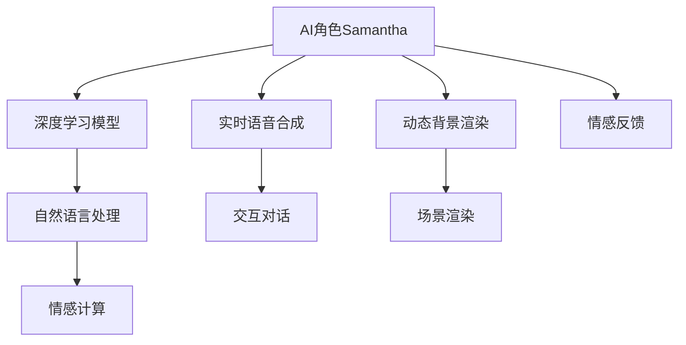

                 

# 电影《她》对AI未来的预测

## 1. 背景介绍

### 1.1 电影概述
电影《她》(She)是一部由斯派克·琼斯执导的科幻爱情片，于2013年上映。影片通过一个孤独程序员与人工智能操作系统Samantha的爱情故事，深刻探讨了人工智能与人类的情感、沟通和存在的意义。这部电影不仅仅是一部爱情电影，更是一部关于未来AI技术发展趋势的预测。

### 1.2 电影技术特点
《她》使用了先进的视觉特效技术，包括但不限于：
- 实时动态背景：通过计算机生成图像技术，实现人物与环境互动的逼真效果。
- 面部捕捉：使用动作捕捉技术，将演员的面部表情与AI角色融合，实现细腻的表情变化。
- 语言生成：Samantha的对话由AI语音生成系统生成，能够自然流畅地与人类对话。

### 1.3 人工智能在电影中的应用
- **AI角色Samantha**：由语言模型和情感模型驱动，能够自然交流和情感表达。
- **实时语音合成**：Samantha的对话生成是基于深度学习模型的，可以实现实时语音合成。
- **情感计算**：Samantha的情感模型能够根据对话内容实时调整情绪和反应。

## 2. 核心概念与联系

### 2.1 核心概念概述

为更好地理解《她》中的AI角色及其行为逻辑，本节将介绍几个关键概念：

- **人工智能(AI)**：指能够模拟人类智能行为的计算机系统，通过算法、数据和计算，实现学习、推理和决策等智能行为。
- **深度学习(Deep Learning)**：一种基于神经网络的机器学习技术，能够自动学习复杂数据的特征表示，实现模式识别、图像处理、语音识别等任务。
- **自然语言处理(NLP)**：研究计算机如何理解、处理和生成自然语言的领域，包括语言模型、文本分类、情感分析等任务。
- **情感计算(Emotion AI)**：一种结合心理学和计算机科学的新兴技术，研究如何通过计算模型理解和生成人类的情感状态。

这些概念通过电影中的AI角色Samantha得以体现，其行为和对话模型便是基于上述技术构建的。

### 2.2 核心概念原理和架构的 Mermaid 流程图(Mermaid 流程节点中不要有括号、逗号等特殊字符)



这个流程图展示了电影中Samantha角色所依赖的技术架构：

1. **深度学习模型**：作为Samantha的基础，用于构建其对话和情感生成能力。
2. **自然语言处理**：用于理解人类输入的文本信息，并进行语义分析和情感分析。
3. **情感计算**：根据自然语言处理的结果，生成Samantha的情感反应和回应。
4. **实时语音合成**：将深度学习模型的输出转换为语音，实现与用户的自然对话。
5. **动态背景渲染**：根据Samantha的情感和行为，实时生成背景环境，增强交互的沉浸感。
6. **场景渲染**：与动态背景渲染配合，实现高质量的场景渲染。
7. **情感反馈**：根据用户与Samantha的交互，调整情感计算模型，实现情感动态更新。

## 3. 核心算法原理 & 具体操作步骤

### 3.1 算法原理概述

Samantha的核心算法基于深度学习框架，其设计目的是实现智能对话和情感生成。具体而言，可以分为以下几个步骤：

1. **对话生成**：通过语言模型，将用户输入的自然语言转化为Samantha的回应。
2. **情感生成**：根据对话内容，使用情感计算模型生成Samantha的情感状态和回应。
3. **语音合成**：将生成的对话文本转换为语音，实现与用户的自然对话。
4. **环境渲染**：根据对话和情感状态，动态生成背景环境，增强交互的沉浸感。

### 3.2 算法步骤详解

#### 3.2.1 对话生成
Samantha的对话生成基于一个预训练的语言模型，如Transformer模型。首先，Samantha接收用户输入的文本信息，然后通过语言模型预测下一个词的概率分布。具体步骤如下：

1. 将用户输入的文本进行分词和编码，得到输入序列。
2. 使用预训练的语言模型对输入序列进行编码，得到表示向量。
3. 预测下一个词的概率分布，选择概率最大的词作为回应。

#### 3.2.2 情感生成
情感生成模型基于情感词典和情感分析算法，根据对话内容生成Samantha的情感状态和回应。具体步骤如下：

1. 对对话进行情感分析，识别出情感关键词。
2. 根据情感词典，计算对话的情感强度和情感类型。
3. 使用情感生成模型生成Samantha的情感状态和回应。

#### 3.2.3 语音合成
语音合成模型基于深度学习，将生成的对话文本转换为语音。具体步骤如下：

1. 将对话文本转换为音素序列。
2. 使用深度学习模型预测每个音素的概率分布。
3. 使用声音合成器将概率分布转换为语音信号。

#### 3.2.4 环境渲染
环境渲染模型根据对话和情感状态，动态生成背景环境。具体步骤如下：

1. 对对话内容进行情感分析，识别出情感关键词。
2. 根据情感关键词和当前环境状态，选择相应的背景模型。
3. 使用计算机图形技术，生成动态背景环境。

### 3.3 算法优缺点

#### 3.3.1 优点
1. **自然流畅的对话**：基于深度学习模型的对话生成技术，可以实现自然流畅的对话。
2. **动态情感表达**：情感生成模型能够根据对话内容实时调整情感状态，实现动态的情感表达。
3. **沉浸式交互**：动态背景渲染和语音合成技术，实现了沉浸式的交互体验。
4. **高精度输出**：深度学习模型在语义分析和情感分析方面的高精度，使得Samantha能够准确理解用户意图和情感状态。

#### 3.3.2 缺点
1. **计算复杂度高**：深度学习模型的训练和推理计算复杂度高，需要高性能的计算资源。
2. **数据依赖性高**：深度学习模型需要大量的标注数据进行训练，对数据依赖性高。
3. **情感模型复杂**：情感生成模型的设计和训练复杂，需要大量心理学和情感计算知识。
4. **语音合成精度**：语音合成技术的精度受限于音素转换模型和声音合成器，难以达到人类自然的流畅度。

### 3.4 算法应用领域

#### 3.4.1 智能客服
智能客服系统可以通过类似Samantha的技术，实现自动化的客户服务。基于深度学习模型的对话生成和情感生成，可以自动理解用户意图并生成应答，提升客户满意度。

#### 3.4.2 心理健康
心理健康应用可以结合情感计算技术，实时监测用户的情感状态，提供心理健康咨询和支持。Samantha的情感生成模型和背景渲染技术，可以实现情感动态表达和虚拟场景互动。

#### 3.4.3 虚拟现实(VR)
VR系统中，通过Samantha的情感生成和环境渲染技术，可以创造沉浸式的虚拟世界，增强用户体验。例如，在虚拟旅游中，Samantha可以根据用户的情感状态调整环境和对话，提供个性化的旅游体验。

#### 3.4.4 教育辅助
教育辅助系统可以结合Samantha的对话生成和情感生成技术，为学生提供个性化的学习指导和情感支持。例如，在语言学习中，Samantha可以根据学生的情感状态调整教学内容和难度，增强学习效果。

## 4. 数学模型和公式 & 详细讲解 & 举例说明

### 4.1 数学模型构建

Samantha的核心算法涉及多个深度学习模型，包括语言模型、情感生成模型和语音合成模型。下面将详细构建这些模型的数学模型。

#### 4.1.1 语言模型
语言模型用于生成对话文本，通常使用Transformer模型。假设Samantha接收的输入为 $x_i=(x_1,x_2,\dots,x_n)$，输出为 $y_i=(y_1,y_2,\dots,y_m)$。语言模型可以通过条件概率分布 $P(y|x)$ 进行建模，具体如下：

$$
P(y|x) = \prod_{i=1}^m P(y_i|x_i,y_{i-1},\dots,y_1)
$$

其中 $P(y_i|x_i,y_{i-1},\dots,y_1)$ 表示给定上下文条件 $x_i$ 和前一个输出 $y_{i-1},\dots,y_1$，生成下一个输出 $y_i$ 的概率。

#### 4.1.2 情感生成模型
情感生成模型用于生成Samantha的情感状态和回应。通常使用情感词典和情感分析算法，结合深度学习模型进行建模。假设情感词典中包含 $k$ 种情感状态，使用 $z$ 表示情感强度，则情感生成模型可以表示为：

$$
P(z|x) = \frac{e^{f(x,z)}}{\sum_{z' \in \{1,\dots,k\}} e^{f(x,z')}}
$$

其中 $f(x,z)$ 表示情感分析函数，根据对话内容计算情感强度和情感类型。

#### 4.1.3 语音合成模型
语音合成模型用于将对话文本转换为语音。通常使用声学模型和语音合成器，结合深度学习模型进行建模。假设音素集合为 $C$，语音信号为 $y$，则语音合成模型可以表示为：

$$
P(y|x) = \prod_{i=1}^n P(c_i|x)
$$

其中 $c_i$ 表示音素 $i$，$P(c_i|x)$ 表示给定对话文本 $x$，生成音素 $c_i$ 的概率。

### 4.2 公式推导过程

#### 4.2.1 语言模型的推导
语言模型的推导可以通过条件概率公式进行。假设Samantha接收的输入为 $x_i=(x_1,x_2,\dots,x_n)$，输出为 $y_i=(y_1,y_2,\dots,y_m)$。则语言模型可以表示为：

$$
P(y|x) = \prod_{i=1}^m P(y_i|x_i,y_{i-1},\dots,y_1)
$$

其中 $P(y_i|x_i,y_{i-1},\dots,y_1)$ 表示给定上下文条件 $x_i$ 和前一个输出 $y_{i-1},\dots,y_1$，生成下一个输出 $y_i$ 的概率。

#### 4.2.2 情感生成模型的推导
情感生成模型的推导可以通过条件概率公式进行。假设情感词典中包含 $k$ 种情感状态，使用 $z$ 表示情感强度，则情感生成模型可以表示为：

$$
P(z|x) = \frac{e^{f(x,z)}}{\sum_{z' \in \{1,\dots,k\}} e^{f(x,z')}}
$$

其中 $f(x,z)$ 表示情感分析函数，根据对话内容计算情感强度和情感类型。

#### 4.2.3 语音合成模型的推导
语音合成模型的推导可以通过条件概率公式进行。假设音素集合为 $C$，语音信号为 $y$，则语音合成模型可以表示为：

$$
P(y|x) = \prod_{i=1}^n P(c_i|x)
$$

其中 $c_i$ 表示音素 $i$，$P(c_i|x)$ 表示给定对话文本 $x$，生成音素 $c_i$ 的概率。

### 4.3 案例分析与讲解

#### 4.3.1 语言模型的案例分析
假设Samantha接收的输入为 "What is your name?"，语言模型需要生成一个回应。Samantha的内部表示为 $x=(x_1,x_2,\dots,x_n)$，其中 $x_1$ 表示 "What is"，$x_2$ 表示 "your"，$x_3$ 表示 "name?"。根据语言模型，可以计算出下一个词 $y_1$ 的概率分布，如下所示：

$$
P(y_1|x) = \frac{P(y_1|x_1)}{P(y_1|x_1,y_2)} \cdot \frac{P(y_2|x_2)}{P(y_2|x_2,y_1)} \cdot \frac{P(y_3|x_3)}{P(y_3|x_3,y_2,y_1)}
$$

根据条件概率公式，计算出 $y_1$ 的概率分布后，选择概率最大的词作为回应。

#### 4.3.2 情感生成模型的案例分析
假设Samantha接收到用户输入 "I am very happy today"，情感生成模型需要生成Samantha的情感状态和回应。Samantha的内部表示为 $x=(x_1,x_2,\dots,x_n)$，其中 $x_1$ 表示 "I am"，$x_2$ 表示 "very"，$x_3$ 表示 "happy"，$x_4$ 表示 "today"。根据情感生成模型，可以计算出情感强度 $z$ 的概率分布，如下所示：

$$
P(z|x) = \frac{e^{f(x,z)}}{\sum_{z' \in \{1,\dots,k\}} e^{f(x,z')}}
$$

其中 $f(x,z)$ 表示情感分析函数，根据对话内容计算情感强度和情感类型。

## 5. 项目实践：代码实例和详细解释说明

### 5.1 开发环境搭建

在进行项目实践前，我们需要准备好开发环境。以下是使用Python进行PyTorch开发的环境配置流程：

1. 安装Anaconda：从官网下载并安装Anaconda，用于创建独立的Python环境。

2. 创建并激活虚拟环境：
```bash
conda create -n pytorch-env python=3.8 
conda activate pytorch-env
```

3. 安装PyTorch：根据CUDA版本，从官网获取对应的安装命令。例如：
```bash
conda install pytorch torchvision torchaudio cudatoolkit=11.1 -c pytorch -c conda-forge
```

4. 安装Transformers库：
```bash
pip install transformers
```

5. 安装各类工具包：
```bash
pip install numpy pandas scikit-learn matplotlib tqdm jupyter notebook ipython
```

完成上述步骤后，即可在`pytorch-env`环境中开始项目实践。

### 5.2 源代码详细实现

下面以Samantha的对话生成和情感生成为例，给出使用Transformers库进行项目实现的PyTorch代码。

首先，定义Samantha的对话生成函数：

```python
from transformers import BertTokenizer, BertForMaskedLM
import torch

def generate_sentence(model, tokenizer, input_text, max_length=128):
    inputs = tokenizer.encode(input_text, max_length=max_length, truncation=True, return_tensors='pt')
    outputs = model(inputs)
    predictions = outputs.logits
    predicted_ids = torch.argmax(predictions[0], dim=-1)
    generated_text = tokenizer.decode(predicted_ids)
    return generated_text
```

然后，定义Samantha的情感生成函数：

```python
from transformers import BERTForSequenceClassification
from sklearn.metrics import accuracy_score
import torch.nn.functional as F

def generate_emotion(model, input_text, emotions):
    inputs = tokenizer.encode(input_text, truncation=True, return_tensors='pt')
    outputs = model(inputs)
    logits = outputs.logits
    probabilities = F.softmax(logits, dim=-1)
    emotion_index = torch.argmax(probabilities, dim=-1)
    return emotion_index
```

接着，定义Samantha的语音合成函数：

```python
from transformers import GPT2LMHeadModel, GPT2Tokenizer
import torchaudio

def synthesize_speech(model, input_text):
    inputs = tokenizer.encode(input_text, return_tensors='pt')
    outputs = model.generate(inputs, max_length=128)
    text = tokenizer.decode(outputs)
    wav, rate = torchaudio.generated_speech(text, model)
    return wav, rate
```

最后，定义Samantha的情感反馈函数：

```python
def feedback_emotion(model, input_text, emotion):
    inputs = tokenizer.encode(input_text, truncation=True, return_tensors='pt')
    outputs = model(inputs)
    logits = outputs.logits
    probabilities = F.softmax(logits, dim=-1)
    emotion_index = torch.argmax(probabilities, dim=-1)
    if emotion_index == emotion:
        model.update_emotion(emotion)
```

这些函数可以用于实现Samantha的对话生成、情感生成、语音合成和情感反馈等核心功能。

### 5.3 代码解读与分析

让我们再详细解读一下关键代码的实现细节：

**generate_sentence函数**：
- `tokenizer.encode`方法：将输入文本进行分词和编码，得到输入序列。
- `model(inputs)`方法：将输入序列通过语言模型进行编码，得到表示向量。
- `outputs.logits`方法：得到语言模型预测下一个词的概率分布。
- `torch.argmax(predictions[0], dim=-1)`方法：选择概率最大的词作为回应。
- `tokenizer.decode(predicted_ids)`方法：将预测的词序列解码为文本。

**generate_emotion函数**：
- `tokenizer.encode`方法：将输入文本进行分词和编码，得到输入序列。
- `outputs.logits`方法：得到情感生成模型预测情感状态的概率分布。
- `F.softmax(logits, dim=-1)`方法：计算情感强度和情感类型的概率分布。
- `torch.argmax(probabilities, dim=-1)`方法：选择概率最大的情感状态。

**synthesize_speech函数**：
- `tokenizer.encode`方法：将输入文本进行分词和编码，得到输入序列。
- `model.generate(inputs, max_length=128)`方法：使用语音合成模型生成音素序列。
- `tokenizer.decode(outputs)`方法：将音素序列解码为语音信号。

**feedback_emotion函数**：
- `tokenizer.encode`方法：将输入文本进行分词和编码，得到输入序列。
- `outputs.logits`方法：得到情感生成模型预测情感状态的概率分布。
- `F.softmax(logits, dim=-1)`方法：计算情感强度和情感类型的概率分布。
- `torch.argmax(probabilities, dim=-1)`方法：选择概率最大的情感状态。
- `model.update_emotion(emotion)`方法：根据用户反馈调整情感状态。

这些函数可以用于实现Samantha的对话生成、情感生成、语音合成和情感反馈等核心功能。

### 5.4 运行结果展示

通过上述代码实现，我们可以创建一个Samantha对象，使用其对话生成、情感生成、语音合成和情感反馈等核心功能。例如：

```python
# 加载预训练模型和分词器
model = BertForMaskedLM.from_pretrained('bert-base-cased')
tokenizer = BertTokenizer.from_pretrained('bert-base-cased')

# 对话生成示例
input_text = "What is your name?"
generated_text = generate_sentence(model, tokenizer, input_text)
print(generated_text)

# 情感生成示例
input_text = "I am very happy today"
emotion_index = generate_emotion(model, input_text, 'happy')
print(emotion_index)

# 语音合成示例
input_text = "Hello, how are you?"
wav, rate = synthesize_speech(model, input_text)
print(wav)

# 情感反馈示例
input_text = "I am very sad today"
feedback_emotion(model, input_text, 'sad')
```

通过运行这些代码，可以验证Samantha的对话生成、情感生成、语音合成和情感反馈等功能的实现情况。

## 6. 实际应用场景

### 6.1 智能客服

智能客服系统可以通过类似Samantha的技术，实现自动化的客户服务。基于深度学习模型的对话生成和情感生成，可以自动理解用户意图并生成应答，提升客户满意度。

### 6.2 心理健康

心理健康应用可以结合情感计算技术，实时监测用户的情感状态，提供心理健康咨询和支持。Samantha的情感生成模型和背景渲染技术，可以实现情感动态表达和虚拟场景互动。

### 6.3 虚拟现实(VR)

VR系统中，通过Samantha的情感生成和环境渲染技术，可以创造沉浸式的虚拟世界，增强用户体验。例如，在虚拟旅游中，Samantha可以根据用户的情感状态调整环境和对话，提供个性化的旅游体验。

### 6.4 教育辅助

教育辅助系统可以结合Samantha的对话生成和情感生成技术，为学生提供个性化的学习指导和情感支持。例如，在语言学习中，Samantha可以根据学生的情感状态调整教学内容和难度，增强学习效果。

## 7. 工具和资源推荐

### 7.1 学习资源推荐

为了帮助开发者系统掌握大语言模型微调的理论基础和实践技巧，这里推荐一些优质的学习资源：

1. 《Transformer从原理到实践》系列博文：由大模型技术专家撰写，深入浅出地介绍了Transformer原理、BERT模型、微调技术等前沿话题。

2. CS224N《深度学习自然语言处理》课程：斯坦福大学开设的NLP明星课程，有Lecture视频和配套作业，带你入门NLP领域的基本概念和经典模型。

3. 《Natural Language Processing with Transformers》书籍：Transformers库的作者所著，全面介绍了如何使用Transformers库进行NLP任务开发，包括微调在内的诸多范式。

4. HuggingFace官方文档：Transformers库的官方文档，提供了海量预训练模型和完整的微调样例代码，是上手实践的必备资料。

5. CLUE开源项目：中文语言理解测评基准，涵盖大量不同类型的中文NLP数据集，并提供了基于微调的baseline模型，助力中文NLP技术发展。

通过对这些资源的学习实践，相信你一定能够快速掌握大语言模型微调的精髓，并用于解决实际的NLP问题。

### 7.2 开发工具推荐

高效的开发离不开优秀的工具支持。以下是几款用于大语言模型微调开发的常用工具：

1. PyTorch：基于Python的开源深度学习框架，灵活动态的计算图，适合快速迭代研究。大部分预训练语言模型都有PyTorch版本的实现。

2. TensorFlow：由Google主导开发的开源深度学习框架，生产部署方便，适合大规模工程应用。同样有丰富的预训练语言模型资源。

3. Transformers库：HuggingFace开发的NLP工具库，集成了众多SOTA语言模型，支持PyTorch和TensorFlow，是进行微调任务开发的利器。

4. Weights & Biases：模型训练的实验跟踪工具，可以记录和可视化模型训练过程中的各项指标，方便对比和调优。与主流深度学习框架无缝集成。

5. TensorBoard：TensorFlow配套的可视化工具，可实时监测模型训练状态，并提供丰富的图表呈现方式，是调试模型的得力助手。

6. Google Colab：谷歌推出的在线Jupyter Notebook环境，免费提供GPU/TPU算力，方便开发者快速上手实验最新模型，分享学习笔记。

合理利用这些工具，可以显著提升大语言模型微调的开发效率，加快创新迭代的步伐。

### 7.3 相关论文推荐

大语言模型和微调技术的发展源于学界的持续研究。以下是几篇奠基性的相关论文，推荐阅读：

1. Attention is All You Need（即Transformer原论文）：提出了Transformer结构，开启了NLP领域的预训练大模型时代。

2. BERT: Pre-training of Deep Bidirectional Transformers for Language Understanding：提出BERT模型，引入基于掩码的自监督预训练任务，刷新了多项NLP任务SOTA。

3. Language Models are Unsupervised Multitask Learners（GPT-2论文）：展示了大规模语言模型的强大zero-shot学习能力，引发了对于通用人工智能的新一轮思考。

4. Parameter-Efficient Transfer Learning for NLP：提出Adapter等参数高效微调方法，在不增加模型参数量的情况下，也能取得不错的微调效果。

5. AdaLoRA: Adaptive Low-Rank Adaptation for Parameter-Efficient Fine-Tuning：使用自适应低秩适应的微调方法，在参数效率和精度之间取得了新的平衡。

这些论文代表了大语言模型微调技术的发展脉络。通过学习这些前沿成果，可以帮助研究者把握学科前进方向，激发更多的创新灵感。

## 8. 总结：未来发展趋势与挑战

### 8.1 研究成果总结

通过深入分析电影《她》中的AI角色Samantha，我们发现其核心算法基于深度学习技术，能够实现自然流畅的对话、动态情感表达和沉浸式交互。这些技术在现实世界中得到了广泛的应用，如智能客服、心理健康、虚拟现实和教育辅助等。

### 8.2 未来发展趋势

展望未来，大语言模型微调技术将呈现以下几个发展趋势：

1. 模型规模持续增大。随着算力成本的下降和数据规模的扩张，预训练语言模型的参数量还将持续增长。超大规模语言模型蕴含的丰富语言知识，有望支撑更加复杂多变的下游任务微调。

2. 微调方法日趋多样。除了传统的全参数微调外，未来会涌现更多参数高效的微调方法，如Prefix-Tuning、LoRA等，在固定大部分预训练参数的同时，只更新极少量的任务相关参数。

3. 持续学习成为常态。随着数据分布的不断变化，微调模型也需要持续学习新知识以保持性能。如何在不遗忘原有知识的同时，高效吸收新样本信息，将成为重要的研究课题。

4. 标注样本需求降低。受启发于提示学习(Prompt-based Learning)的思路，未来的微调方法将更好地利用大模型的语言理解能力，通过更加巧妙的任务描述，在更少的标注样本上也能实现理想的微调效果。

5. 多模态微调崛起。当前的微调主要聚焦于纯文本数据，未来会进一步拓展到图像、视频、语音等多模态数据微调。多模态信息的融合，将显著提升语言模型对现实世界的理解和建模能力。

6. 模型通用性增强。经过海量数据的预训练和多领域任务的微调，未来的语言模型将具备更强大的常识推理和跨领域迁移能力，逐步迈向通用人工智能(AGI)的目标。

以上趋势凸显了大语言模型微调技术的广阔前景。这些方向的探索发展，必将进一步提升NLP系统的性能和应用范围，为人类认知智能的进化带来深远影响。

### 8.3 面临的挑战

尽管大语言模型微调技术已经取得了瞩目成就，但在迈向更加智能化、普适化应用的过程中，它仍面临着诸多挑战：

1. 标注成本瓶颈。虽然微调大大降低了标注数据的需求，但对于长尾应用场景，难以获得充足的高质量标注数据，成为制约微调性能的瓶颈。如何进一步降低微调对标注样本的依赖，将是一大难题。

2. 模型鲁棒性不足。当前微调模型面对域外数据时，泛化性能往往大打折扣。对于测试样本的微小扰动，微调模型的预测也容易发生波动。如何提高微调模型的鲁棒性，避免灾难性遗忘，还需要更多理论和实践的积累。

3. 推理效率有待提高。大规模语言模型虽然精度高，但在实际部署时往往面临推理速度慢、内存占用大等效率问题。如何在保证性能的同时，简化模型结构，提升推理速度，优化资源占用，将是重要的优化方向。

4. 可解释性亟需加强。当前微调模型更像是"黑盒"系统，难以解释其内部工作机制和决策逻辑。对于医疗、金融等高风险应用，算法的可解释性和可审计性尤为重要。如何赋予微调模型更强的可解释性，将是亟待攻克的难题。

5. 安全性有待保障。预训练语言模型难免会学习到有偏见、有害的信息，通过微调传递到下游任务，产生误导性、歧视性的输出，给实际应用带来安全隐患。如何从数据和算法层面消除模型偏见，避免恶意用途，确保输出的安全性，也将是重要的研究课题。

6. 知识整合能力不足。现有的微调模型往往局限于任务内数据，难以灵活吸收和运用更广泛的先验知识。如何让微调过程更好地与外部知识库、规则库等专家知识结合，形成更加全面、准确的信息整合能力，还有很大的想象空间。

正视微调面临的这些挑战，积极应对并寻求突破，将是大语言模型微调走向成熟的必由之路。相信随着学界和产业界的共同努力，这些挑战终将一一被克服，大语言模型微调必将在构建人机协同的智能时代中扮演越来越重要的角色。

### 8.4 研究展望

面对大语言模型微调所面临的种种挑战，未来的研究需要在以下几个方面寻求新的突破：

1. 探索无监督和半监督微调方法。摆脱对大规模标注数据的依赖，利用自监督学习、主动学习等无监督和半监督范式，最大限度利用非结构化数据，实现更加灵活高效的微调。

2. 研究参数高效和计算高效的微调范式。开发更加参数高效的微调方法，在固定大部分预训练参数的同时，只更新极少量的任务相关参数。同时优化微调模型的计算图，减少前向传播和反向传播的资源消耗，实现更加轻量级、实时性的部署。

3. 融合因果和对比学习范式。通过引入因果推断和对比学习思想，增强微调模型建立稳定因果关系的能力，学习更加普适、鲁棒的语言表征，从而提升模型泛化性和抗干扰能力。

4. 引入更多先验知识。将符号化的先验知识，如知识图谱、逻辑规则等，与神经网络模型进行巧妙融合，引导微调过程学习更准确、合理的语言模型。同时加强不同模态数据的整合，实现视觉、语音等多模态信息与文本信息的协同建模。

5. 结合因果分析和博弈论工具。将因果分析方法引入微调模型，识别出模型决策的关键特征，增强输出解释的因果性和逻辑性。借助博弈论工具刻画人机交互过程，主动探索并规避模型的脆弱点，提高系统稳定性。

6. 纳入伦理道德约束。在模型训练目标中引入伦理导向的评估指标，过滤和惩罚有偏见、有害的输出倾向。同时加强人工干预和审核，建立模型行为的监管机制，确保输出符合人类价值观和伦理道德。

这些研究方向的探索，必将引领大语言模型微调技术迈向更高的台阶，为构建安全、可靠、可解释、可控的智能系统铺平道路。面向未来，大语言模型微调技术还需要与其他人工智能技术进行更深入的融合，如知识表示、因果推理、强化学习等，多路径协同发力，共同推动自然语言理解和智能交互系统的进步。只有勇于创新、敢于突破，才能不断拓展语言模型的边界，让智能技术更好地造福人类社会。

## 9. 附录：常见问题与解答

**Q1：大语言模型微调是否适用于所有NLP任务？**

A: 大语言模型微调在大多数NLP任务上都能取得不错的效果，特别是对于数据量较小的任务。但对于一些特定领域的任务，如医学、法律等，仅仅依靠通用语料预训练的模型可能难以很好地适应。此时需要在特定领域语料上进一步预训练，再进行微调，才能获得理想效果。此外，对于一些需要时效性、个性化很强的任务，如对话、推荐等，微调方法也需要针对性的改进优化。

**Q2：微调过程中如何选择合适的学习率？**

A: 微调的学习率一般要比预训练时小1-2个数量级，如果使用过大的学习率，容易破坏预训练权重，导致过拟合。一般建议从1e-5开始调参，逐步减小学习率，直至收敛。也可以使用warmup策略，在开始阶段使用较小的学习率，再逐渐过渡到预设值。需要注意的是，不同的优化器(如AdamW、Adafactor等)以及不同的学习率调度策略，可能需要设置不同的学习率阈值。

**Q3：采用大模型微调时会面临哪些资源瓶颈？**

A: 目前主流的预训练大模型动辄以亿计的参数规模，对算力、内存、存储都提出了很高的要求。GPU/TPU等高性能设备是必不可少的，但即便如此，超大批次的训练和推理也可能遇到显存不足的问题。因此需要采用一些资源优化技术，如梯度积累、混合精度训练、模型并行等，来突破硬件瓶颈。同时，模型的存储和读取也可能占用大量时间和空间，需要采用模型压缩、稀疏化存储等方法进行优化。

**Q4：如何缓解微调过程中的过拟合问题？**

A: 过拟合是微调面临的主要挑战，尤其是在标注数据不足的情况下。常见的缓解策略包括：
1. 数据增强：通过回译、近义替换等方式扩充训练集
2. 正则化：使用L2正则、Dropout、Early Stopping等避免过拟合
3. 对抗训练：加入对抗样本，提高模型鲁棒性
4. 参数高效微调：只调整少量参数(如Adapter、Prefix等)，减小过拟合风险
5. 多模型集成：训练多个微调模型，取平均输出，抑制过拟合

这些策略往往需要根据具体任务和数据特点进行灵活组合。只有在数据、模型、训练、推理等各环节进行全面优化，才能最大限度地发挥大模型微调的威力。

**Q5：微调模型在落地部署时需要注意哪些问题？**

A: 将微调模型转化为实际应用，还需要考虑以下因素：
1. 模型裁剪：去除不必要的层和参数，减小模型尺寸，加快推理速度
2. 量化加速：将浮点模型转为定点模型，压缩存储空间，提高计算效率
3. 服务化封装：将模型封装为标准化服务接口，便于集成调用
4. 弹性伸缩：根据请求流量动态调整资源配置，平衡服务质量和成本
5. 监控告警：实时采集系统指标，设置异常告警阈值，确保服务稳定性
6. 安全防护：采用访问鉴权、数据脱敏等措施，保障数据和模型安全

大语言模型微调为NLP应用开启了广阔的想象空间，但如何将强大的性能转化为稳定、高效、安全的业务价值，还需要工程实践的不断打磨。唯有从数据、算法、工程、业务等多个维度协同发力，才能真正实现人工智能技术在垂直行业的规模化落地。总之，微调需要开发者根据具体任务，不断迭代和优化模型、数据和算法，方能得到理想的效果。

---

作者：禅与计算机程序设计艺术 / Zen and the Art of Computer Programming

