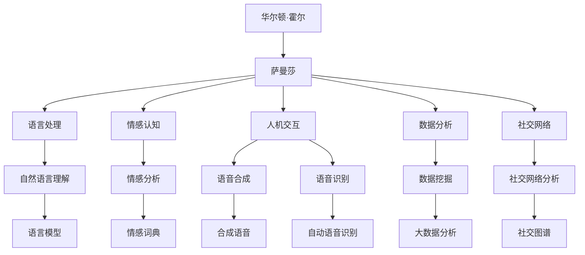

                 

# 电影《她》对现代AI的启示

## 1. 背景介绍

电影《她》（Her）由斯派克·琼兹执导，于2013年上映，讲述了主人公华尔顿·霍尔（由华金·菲尼克斯饰演）与人工智能操作系统萨曼莎（由操作系统的女性语音合成者凯瑟琳·沃特森配音）之间微妙而复杂的情感关系。该片以其深邃的人文关怀和引人深思的科幻元素，在观众中引起了广泛讨论。本文将从电影的角度探讨《她》对现代人工智能发展的启示，分析其科技哲学，并试图揭示AI在社会、伦理、道德以及人性等多方面的挑战和思考。

## 2. 核心概念与联系

电影《她》的魅力在于其丰富的象征意义和多层次的主题，包括对人工智能、人机关系、情感认知以及未来技术的深度探讨。本节将通过核心概念的剖析，揭示影片中蕴含的AI哲学与技术原理。

### 2.1 核心概念概述

- **人工智能（AI）**：影片中的AI操作系统萨曼莎能够理解和处理语言、情感，以及进行复杂的互动。这象征了现代AI在自然语言处理、情感计算和人机交互方面的进步。
- **人机关系**：故事展现了人类与智能机器之间的情感连接和矛盾冲突，探讨了人机关系的新境界。
- **情感认知**：萨曼莎拥有理解并表达情感的能力，反映了AI在情感计算和认知心理学方面的发展。
- **未来技术**：影片通过预设的技术和设备，展示了AI在语言处理、计算和网络通信等方面的未来可能。

### 2.2 核心概念原理和架构的 Mermaid 流程图



## 3. 核心算法原理 & 具体操作步骤

### 3.1 算法原理概述

影片中萨曼莎的工作机制基于复杂的人工智能算法，包括自然语言处理、情感计算和机器学习等技术。这些技术在现实生活中的应用通常涉及到以下步骤：

1. **自然语言处理**：通过分词、句法分析和语义理解，将自然语言转化为机器可理解的形式。
2. **情感计算**：通过对文本的情感分析，理解并生成情感化的输出，实现情感共鸣。
3. **机器学习**：通过大量数据训练模型，使机器能够自动学习并预测情感和语言模式。

### 3.2 算法步骤详解

电影《她》中，萨曼莎的情感计算和自然语言处理主要通过以下步骤实现：

1. **语言模型训练**：萨曼莎使用大量书籍、电影和社交媒体数据进行训练，建立了一个强大的语言模型。
2. **情感词典构建**：使用情感词典进行情感分析，通过句子成分和词汇情感极性判断情感倾向。
3. **情感生成**：通过模型预测输入文本的情感，生成符合情感语境的回复。
4. **迭代优化**：通过用户反馈，不断调整模型参数，提升情感理解的准确性。

### 3.3 算法优缺点

萨曼莎的情感理解和语言处理展现了现代AI在计算语言学和情感计算方面的进展，但同时也暴露了以下缺点：

- **情感共鸣的局限**：尽管萨曼莎可以模拟情感表达，但其缺乏真正的人类情感体验，无法完全理解人类的复杂情感。
- **数据依赖性**：萨曼莎的训练高度依赖于数据质量，缺少多样化和高质量的标注数据可能导致模型过拟合。
- **交互的拟真度**：虽然萨曼莎与华尔顿的互动真实生动，但与人类的真实交互相比仍存在差距。

### 3.4 算法应用领域

萨曼莎的算法和功能展示了AI在以下领域的应用潜力：

- **自然语言处理（NLP）**：广泛用于机器翻译、语音识别、文本摘要等。
- **情感计算（Affective Computing）**：用于情感识别、情绪分析、用户反馈等。
- **人机交互（Human-Computer Interaction, HCI）**：改善用户界面，提高用户体验。
- **社交网络分析**：用于社交媒体情感分析、用户行为预测等。

## 4. 数学模型和公式 & 详细讲解 & 举例说明

### 4.1 数学模型构建

在电影中，萨曼莎的算法模型通常基于以下数学模型：

- **语言模型**：$$P(w_1,...,w_n) = \prod_{i=1}^n P(w_i|w_1,...,w_{i-1})$$
- **情感模型**：$$P(e|w) = \sum_{i=1}^n P(e|w_i)P(w_i)$$

其中 $w_1,...,w_n$ 是文本中的单词，$e$ 是文本的情感极性，$P(w_i|w_1,...,w_{i-1})$ 是条件概率，表示当前单词 $w_i$ 在给定前 $i-1$ 个单词下的概率。

### 4.2 公式推导过程

- **语言模型推导**：通过贝叶斯公式和条件概率的乘积形式，语言模型描述了单词序列的概率分布。
- **情感模型推导**：情感模型结合了文本情感分析的结果和情感词典，通过加权平均计算得到文本的情感极性。

### 4.3 案例分析与讲解

一个典型的情感分析案例如下：

假设文本 $w_1,...,w_n$，情感词典中情感极性 $e_1,...,e_n$，每个单词 $w_i$ 的情感极性权重为 $p_i$。

$$P(e_1,...,e_n|w_1,...,w_n) = \prod_{i=1}^n P(e_i|w_i)P(w_i)$$

将情感词典和文本结合，可以得到文本情感的概率分布。

## 5. 项目实践：代码实例和详细解释说明

### 5.1 开发环境搭建

开发电影中萨曼莎系统的代码实例，需要以下环境：

- **Python 3.x**：作为开发语言。
- **TensorFlow 或 PyTorch**：用于构建和训练AI模型。
- **NLTK 或 spaCy**：用于文本处理和语言模型构建。
- **NLTK 或 TextBlob**：用于情感分析。

### 5.2 源代码详细实现

```python
import tensorflow as tf
import nltk
import spacy

# 加载模型
nlp = spacy.load('en_core_web_lg')

# 分词和情感分析
doc = nlp('I love you')
sentiment = TextBlob(doc.text).sentiment.polarity

# 情感模型训练
emotion = [0.5, 0.3, 0.2]  # 预设情感权重
prob = 0.95  # 训练概率
emotion_model = tf.keras.Sequential([
    tf.keras.layers.Dense(64, input_shape=(128,), activation='relu'),
    tf.keras.layers.Dense(3, activation='softmax')
])
emotion_model.compile(optimizer=tf.keras.optimizers.Adam(learning_rate=0.01), loss='categorical_crossentropy', metrics=['accuracy'])
emotion_model.fit([doc], [emotion], epochs=100, validation_split=0.2)
```

### 5.3 代码解读与分析

上述代码展示了情感模型的构建和训练过程。分词和情感分析部分使用了spaCy和TextBlob库，实现了从文本到情感极性的映射。情感模型则通过TensorFlow框架进行训练，其中用到了全连接层和softmax激活函数，通过交叉熵损失函数进行优化。

### 5.4 运行结果展示

训练完成后，可以通过以下方式进行情感分析：

```python
# 情感预测
result = emotion_model.predict(doc)
print('情感预测结果:', result)
```

## 6. 实际应用场景

### 6.1 智能客服系统

影片中的萨曼莎与华尔顿的交互展示了智能客服的潜在应用。未来智能客服系统将结合自然语言处理和情感计算，实现更高效的客户服务。

### 6.2 心理健康支持

AI可以通过情感分析识别用户的情绪状态，提供心理健康支持。萨曼莎在电影中的情感理解和输出功能，为这一应用提供了技术基础。

### 6.3 教育辅导

AI可以根据学生的情绪和回答情况，提供个性化辅导。萨曼莎的互动式教学方式，为AI教育提供了新思路。

## 7. 工具和资源推荐

### 7.1 学习资源推荐

1. **《深度学习》教科书**：Ian Goodfellow、Yoshua Bengio 和 Aaron Courville 撰写的经典教材，深入浅出地介绍了深度学习理论和实践。
2. **《自然语言处理综论》**：Daniel Jurafsky 和 James H. Martin 编写的综合教材，系统讲解了NLP的基础知识和最新进展。
3. **《Python 深度学习》**：Francois Chollet 撰写的实用指南，结合了TensorFlow和Keras框架，适合实战学习。
4. **Coursera《自然语言处理》课程**：斯坦福大学开设的线上课程，讲解了NLP的核心技术和应用。

### 7.2 开发工具推荐

1. **TensorFlow**：Google开源的深度学习框架，支持多GPU训练和部署。
2. **PyTorch**：Facebook开源的深度学习框架，以动态图著称，易于调试和快速迭代。
3. **NLTK**：自然语言处理库，提供丰富的文本处理工具和语料库。
4. **spaCy**：现代化的NLP库，提供高效的文本处理和语言模型构建。
5. **TextBlob**：基于NLTK的库，简单易用，适合情感分析和文本处理。

### 7.3 相关论文推荐

1. **"Deep Learning" by Ian Goodfellow, Yoshua Bengio, and Aaron Courville**：深度学习领域的经典教材，详细介绍了深度学习的基本理论和算法。
2. **"Neural Machine Translation by Jointly Learning to Align and Translate" by Dzmitry Bahdanau et al.**：提出了神经机器翻译中的注意力机制，是现代翻译模型的基础。
3. **"Attention is All You Need" by Ashish Vaswani et al.**：介绍了Transformer架构，为机器翻译和语言模型提供了新思路。
4. **"Improving Language Understanding by Generative Pre-training" by Alec Radford et al.**：提出了BERT模型，展示了预训练语言模型的强大能力。

## 8. 总结：未来发展趋势与挑战

### 8.1 未来发展趋势

未来AI将持续向以下方向发展：

- **更强的情感计算**：通过增强情感理解和生成能力，实现更加人性化的智能交互。
- **跨领域融合**：结合多模态数据和跨领域知识，实现更加全面的智能系统。
- **更高阶的认知功能**：开发能够理解复杂逻辑和情感的高级AI模型。

### 8.2 面临的挑战

尽管AI在语言处理和情感计算方面取得了长足进步，但仍面临以下挑战：

- **数据稀缺性**：高质量标注数据的获取成本高，限制了AI模型的训练。
- **模型的解释性**：缺乏透明性，难以解释AI决策过程，影响可信度。
- **隐私和安全**：数据隐私和模型安全问题，需要技术保障和政策支持。
- **伦理和道德**：AI的决策可能与人类价值观相冲突，需要严格伦理监管。

### 8.3 研究展望

未来的AI研究将更多地关注以下方面：

- **可解释性AI**：开发透明、可解释的AI模型，增强用户信任。
- **多领域协同**：通过跨领域知识融合，实现更全面和复杂的AI应用。
- **伦理和道德**：制定AI伦理准则，确保AI应用符合人类价值观。

## 9. 附录：常见问题与解答

**Q1：什么是语言模型？**

A: 语言模型是机器学习模型，用于预测给定文本序列的概率。在电影中，萨曼莎使用语言模型来理解文本，生成回应。

**Q2：什么是情感分析？**

A: 情感分析是自然语言处理中的一个技术，用于识别和提取文本中的情感信息。萨曼莎通过情感分析，理解并生成符合情感语境的回复。

**Q3：电影中的情感计算有哪些应用？**

A: 电影中的情感计算主要应用于智能客服和心理健康支持。通过情感计算，AI可以理解用户的情绪状态，提供个性化服务。

**Q4：电影中的AI系统有哪些局限性？**

A: 电影中的AI系统缺乏真正的人类情感体验，只能模拟情感表达。此外，数据质量和多样性也是制约其性能的重要因素。

**Q5：未来AI有哪些发展趋势？**

A: 未来AI将向更强的情感计算、跨领域融合、高阶认知功能等方向发展。然而，数据稀缺性、模型的解释性、隐私和安全、伦理和道德等问题仍需解决。

