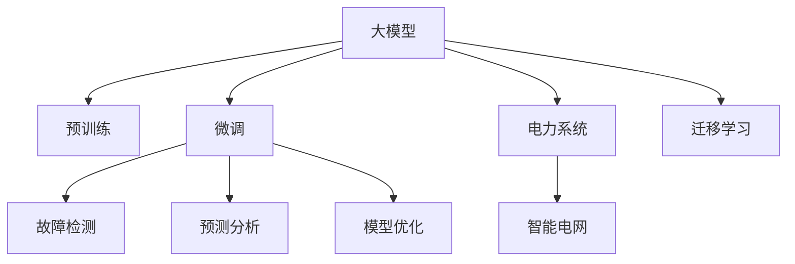

                 

# 电网维护与大模型的应用

> 关键词：大模型, 电网维护, 机器学习, 电力系统, 故障检测, 预测分析, 模型优化, 智能电网, 应用部署

## 1. 背景介绍

### 1.1 问题由来

随着智能电网技术的快速发展，电网的运行和维护变得越来越复杂。传统电网维护方式主要依赖人工巡检、手动记录和定期检测，效率低、成本高、安全隐患大。在面对日益增多的电力设备和复杂的运行环境时，这种维护方式已无法满足现代电力系统的高要求。

### 1.2 问题核心关键点

为提升电网维护的效率和安全性，需要构建一个能够实时监测电网状态、自动预测故障并快速响应的智能电网维护系统。该系统的核心在于使用先进的大数据技术和大模型，对电网数据进行深度学习和分析，识别出潜在的故障风险，并给出维护建议。

## 2. 核心概念与联系

### 2.1 核心概念概述

为更好地理解基于大模型的电网维护系统，本节将介绍几个密切相关的核心概念：

- 大模型(Large Model): 如Transformer、BERT等大规模预训练语言模型，通过在大规模无标签文本数据上进行预训练，学习通用的语言表示，具备强大的语言理解和生成能力。
- 预训练(Pre-training): 指在大规模无标签文本数据上，通过自监督学习任务训练通用语言模型的过程，使得模型学习到语言的通用表示。
- 微调(Fine-tuning): 指在预训练模型的基础上，使用特定任务的数据集，通过有监督学习优化模型在特定任务上的性能，如故障预测、维护建议等。
- 迁移学习(Transfer Learning): 指将一个领域学习到的知识，迁移应用到另一个不同但相关的领域，如将通用大模型的预训练知识迁移到电网维护领域。
- 电力系统(Power System): 包括发电、输电、变电和配电等环节，是现代工业和民用用电的供应网络。
- 智能电网(Smart Grid): 通过信息通信技术和大数据分析，实现电网的数字化、智能化和自动化，提升电网的可靠性和效率。
- 故障检测(Fault Detection): 通过实时监测电网的运行状态，检测出故障并进行预警。
- 预测分析(Prediction Analysis): 利用机器学习模型对电网故障进行预测，提前发现潜在风险。
- 模型优化(Model Optimization): 调整和优化机器学习模型的结构和参数，提高模型预测的准确性。

这些核心概念之间的逻辑关系可以通过以下Mermaid流程图来展示：



这个流程图展示了大模型在电网维护中的核心概念及其之间的关系：

1. 大模型通过预训练获得基础能力。
2. 微调是对预训练模型进行任务特定的优化，如故障预测、维护建议等。
3. 故障检测和预测分析是微调模型的应用场景。
4. 模型优化是提高微调模型性能的必要过程。
5. 迁移学习是连接大模型与电网维护领域的桥梁。
6. 智能电网是电网维护的目标，通过优化故障检测和预测分析模型，实现电网智能化。

## 3. 核心算法原理 & 具体操作步骤
### 3.1 算法原理概述

基于大模型的电网维护系统，本质上是一个通过深度学习模型对电网数据进行分析和预测的过程。其核心思想是：将大模型作为强大的特征提取器，通过对电网运行数据的处理和分析，预测可能的故障和运行风险，并给出维护建议，从而提升电网的可靠性和运行效率。

形式化地，假设电网运行数据集为 $D=\{(x_i, y_i)\}_{i=1}^N, x_i \in \mathbb{R}^d, y_i \in \{0,1\}$，其中 $x_i$ 表示电网运行状态特征，$y_i$ 表示是否出现故障。故障预测模型 $M_{\theta}$ 的优化目标是最小化经验风险，即找到最优参数：

$$
\theta^* = \mathop{\arg\min}_{\theta} \mathcal{L}(M_{\theta},D)
$$

其中 $\mathcal{L}$ 为针对故障预测任务设计的损失函数，如交叉熵损失、均方误差损失等。

### 3.2 算法步骤详解

基于大模型的电网维护系统一般包括以下几个关键步骤：

**Step 1: 准备预训练模型和数据集**
- 选择合适的预训练语言模型 $M_{\theta}$ 作为初始化参数，如Transformer、BERT等。
- 准备电网运行数据集 $D$，划分为训练集、验证集和测试集。一般要求数据集与预训练数据的分布不要差异过大。

**Step 2: 添加任务适配层**
- 根据任务类型，在预训练模型顶层设计合适的输出层和损失函数。
- 对于故障预测任务，通常在顶层添加逻辑回归分类器或交叉熵损失函数。
- 对于预测分析任务，通常使用回归模型输出预测结果，并以均方误差为损失函数。

**Step 3: 设置微调超参数**
- 选择合适的优化算法及其参数，如 AdamW、SGD 等，设置学习率、批大小、迭代轮数等。
- 设置正则化技术及强度，包括权重衰减、Dropout、Early Stopping 等。
- 确定冻结预训练参数的策略，如仅微调顶层，或全部参数都参与微调。

**Step 4: 执行梯度训练**
- 将训练集数据分批次输入模型，前向传播计算损失函数。
- 反向传播计算参数梯度，根据设定的优化算法和学习率更新模型参数。
- 周期性在验证集上评估模型性能，根据性能指标决定是否触发 Early Stopping。
- 重复上述步骤直到满足预设的迭代轮数或 Early Stopping 条件。

**Step 5: 测试和部署**
- 在测试集上评估微调后模型 $M_{\hat{\theta}}$ 的性能，对比微调前后的精度提升。
- 使用微调后的模型对新样本进行推理预测，集成到实际的应用系统中。
- 持续收集新的电网数据，定期重新微调模型，以适应数据分布的变化。

以上是基于大模型的电网维护系统的一般流程。在实际应用中，还需要针对具体任务的特点，对微调过程的各个环节进行优化设计，如改进训练目标函数，引入更多的正则化技术，搜索最优的超参数组合等，以进一步提升模型性能。

### 3.3 算法优缺点

基于大模型的电网维护系统具有以下优点：
1. 简单高效。只需准备少量标注数据，即可对预训练模型进行快速适配，获得较大的性能提升。
2. 通用适用。适用于各种电网运行状态分析任务，设计简单的任务适配层即可实现微调。
3. 参数高效。利用参数高效微调技术，在固定大部分预训练参数的情况下，仍可取得不错的微调效果。
4. 效果显著。在学术界和工业界的诸多电网运行状态分析任务上，基于微调的方法已经刷新了最先进的性能指标。

同时，该方法也存在一定的局限性：
1. 依赖标注数据。微调的效果很大程度上取决于标注数据的质量和数量，获取高质量标注数据的成本较高。
2. 迁移能力有限。当目标任务与预训练数据的分布差异较大时，微调的性能提升有限。
3. 可解释性不足。微调模型的决策过程通常缺乏可解释性，难以对其推理逻辑进行分析和调试。

尽管存在这些局限性，但就目前而言，基于大模型的微调方法仍是目前电网维护系统的主流范式。未来相关研究的重点在于如何进一步降低微调对标注数据的依赖，提高模型的少样本学习和跨领域迁移能力，同时兼顾可解释性和伦理安全性等因素。

### 3.4 算法应用领域

基于大模型的电网维护方法，已经在电网故障检测、预测分析、维护建议等多个领域得到广泛应用，成为智能电网维护的重要手段。

1. 故障检测：通过实时监测电网运行状态，检测出潜在的故障并进行预警，及时采取维护措施，避免故障扩大。
2. 预测分析：利用历史数据和实时监测数据，预测电网未来运行状态，及时发现异常，提前采取预防措施。
3. 维护建议：根据故障检测和预测分析的结果，给出维护建议，优化电网运行状态。

除了上述这些经典任务外，大模型微调技术也被创新性地应用到更多场景中，如智能电网调度、需求响应、电力市场分析等，为电网维护提供了新的解决方案。随着预训练模型和微调方法的不断进步，相信大模型在电网维护领域的应用将更为广泛和深入。

## 4. 数学模型和公式 & 详细讲解
### 4.1 数学模型构建

本节将使用数学语言对基于大模型的电网维护系统进行更加严格的刻画。

假设故障检测模型 $M_{\theta}$ 在输入 $x$ 上的输出为 $\hat{y}=M_{\theta}(x)$，表示模型预测出现故障的概率。真实标签 $y \in \{0,1\}$。则二分类交叉熵损失函数定义为：

$$
\ell(M_{\theta}(x),y) = -[y\log \hat{y} + (1-y)\log (1-\hat{y})]
$$

将其代入经验风险公式，得：

$$
\mathcal{L}(\theta) = -\frac{1}{N}\sum_{i=1}^N [y_i\log M_{\theta}(x_i)+(1-y_i)\log(1-M_{\theta}(x_i))]
$$

在得到损失函数的梯度后，即可带入参数更新公式，完成模型的迭代优化。重复上述过程直至收敛，最终得到适应电网故障检测任务的最优模型参数 $\theta^*$。

### 4.2 公式推导过程

以下我们以二分类故障检测任务为例，推导交叉熵损失函数及其梯度的计算公式。

假设模型 $M_{\theta}$ 在输入 $x$ 上的输出为 $\hat{y}=M_{\theta}(x) \in [0,1]$，表示样本属于故障的概率。真实标签 $y \in \{0,1\}$。则二分类交叉熵损失函数定义为：

$$
\ell(M_{\theta}(x),y) = -[y\log \hat{y} + (1-y)\log (1-\hat{y})]
$$

将其代入经验风险公式，得：

$$
\mathcal{L}(\theta) = -\frac{1}{N}\sum_{i=1}^N [y_i\log M_{\theta}(x_i)+(1-y_i)\log(1-M_{\theta}(x_i))]
$$

根据链式法则，损失函数对参数 $\theta_k$ 的梯度为：

$$
\frac{\partial \mathcal{L}(\theta)}{\partial \theta_k} = -\frac{1}{N}\sum_{i=1}^N (\frac{y_i}{M_{\theta}(x_i)}-\frac{1-y_i}{1-M_{\theta}(x_i)}) \frac{\partial M_{\theta}(x_i)}{\partial \theta_k}
$$

其中 $\frac{\partial M_{\theta}(x_i)}{\partial \theta_k}$ 可进一步递归展开，利用自动微分技术完成计算。

在得到损失函数的梯度后，即可带入参数更新公式，完成模型的迭代优化。重复上述过程直至收敛，最终得到适应电网故障检测任务的最优模型参数 $\theta^*$。

## 5. 项目实践：代码实例和详细解释说明
### 5.1 开发环境搭建

在进行电网维护系统的开发前，我们需要准备好开发环境。以下是使用Python进行PyTorch开发的环境配置流程：

1. 安装Anaconda：从官网下载并安装Anaconda，用于创建独立的Python环境。

2. 创建并激活虚拟环境：
```bash
conda create -n pytorch-env python=3.8 
conda activate pytorch-env
```

3. 安装PyTorch：根据CUDA版本，从官网获取对应的安装命令。例如：
```bash
conda install pytorch torchvision torchaudio cudatoolkit=11.1 -c pytorch -c conda-forge
```

4. 安装TensorFlow：
```bash
pip install tensorflow
```

5. 安装TensorBoard：
```bash
pip install tensorboard
```

6. 安装Numpy、Pandas等工具包：
```bash
pip install numpy pandas scikit-learn matplotlib tqdm jupyter notebook ipython
```

完成上述步骤后，即可在`pytorch-env`环境中开始电网维护系统的开发。

### 5.2 源代码详细实现

这里我们以电网故障检测任务为例，给出使用Transformers库对BERT模型进行微调的PyTorch代码实现。

首先，定义故障检测任务的数据处理函数：

```python
from transformers import BertTokenizer
from torch.utils.data import Dataset
import torch

class FaultDetectionDataset(Dataset):
    def __init__(self, features, labels, tokenizer, max_len=128):
        self.features = features
        self.labels = labels
        self.tokenizer = tokenizer
        self.max_len = max_len
        
    def __len__(self):
        return len(self.features)
    
    def __getitem__(self, item):
        feature = self.features[item]
        label = self.labels[item]
        
        encoding = self.tokenizer(feature, return_tensors='pt', max_length=self.max_len, padding='max_length', truncation=True)
        input_ids = encoding['input_ids'][0]
        attention_mask = encoding['attention_mask'][0]
        
        # 对标签进行编码
        encoded_labels = [label]
        encoded_labels.extend([0] * (self.max_len - 1))
        labels = torch.tensor(encoded_labels, dtype=torch.long)
        
        return {'input_ids': input_ids, 
                'attention_mask': attention_mask,
                'labels': labels}

# 创建dataset
tokenizer = BertTokenizer.from_pretrained('bert-base-cased')

train_dataset = FaultDetectionDataset(train_features, train_labels, tokenizer)
dev_dataset = FaultDetectionDataset(dev_features, dev_labels, tokenizer)
test_dataset = FaultDetectionDataset(test_features, test_labels, tokenizer)
```

然后，定义模型和优化器：

```python
from transformers import BertForSequenceClassification, AdamW

model = BertForSequenceClassification.from_pretrained('bert-base-cased', num_labels=2)

optimizer = AdamW(model.parameters(), lr=2e-5)
```

接着，定义训练和评估函数：

```python
from torch.utils.data import DataLoader
from tqdm import tqdm
from sklearn.metrics import classification_report

device = torch.device('cuda') if torch.cuda.is_available() else torch.device('cpu')
model.to(device)

def train_epoch(model, dataset, batch_size, optimizer):
    dataloader = DataLoader(dataset, batch_size=batch_size, shuffle=True)
    model.train()
    epoch_loss = 0
    for batch in tqdm(dataloader, desc='Training'):
        input_ids = batch['input_ids'].to(device)
        attention_mask = batch['attention_mask'].to(device)
        labels = batch['labels'].to(device)
        model.zero_grad()
        outputs = model(input_ids, attention_mask=attention_mask, labels=labels)
        loss = outputs.loss
        epoch_loss += loss.item()
        loss.backward()
        optimizer.step()
    return epoch_loss / len(dataloader)

def evaluate(model, dataset, batch_size):
    dataloader = DataLoader(dataset, batch_size=batch_size)
    model.eval()
    preds, labels = [], []
    with torch.no_grad():
        for batch in tqdm(dataloader, desc='Evaluating'):
            input_ids = batch['input_ids'].to(device)
            attention_mask = batch['attention_mask'].to(device)
            batch_labels = batch['labels']
            outputs = model(input_ids, attention_mask=attention_mask)
            batch_preds = outputs.logits.argmax(dim=2).to('cpu').tolist()
            batch_labels = batch_labels.to('cpu').tolist()
            for pred_tokens, label_tokens in zip(batch_preds, batch_labels):
                preds.append(pred_tokens)
                labels.append(label_tokens)
                
    print(classification_report(labels, preds))
```

最后，启动训练流程并在测试集上评估：

```python
epochs = 5
batch_size = 16

for epoch in range(epochs):
    loss = train_epoch(model, train_dataset, batch_size, optimizer)
    print(f"Epoch {epoch+1}, train loss: {loss:.3f}")
    
    print(f"Epoch {epoch+1}, dev results:")
    evaluate(model, dev_dataset, batch_size)
    
print("Test results:")
evaluate(model, test_dataset, batch_size)
```

以上就是使用PyTorch对BERT进行电网故障检测任务微调的完整代码实现。可以看到，得益于Transformers库的强大封装，我们可以用相对简洁的代码完成BERT模型的加载和微调。

### 5.3 代码解读与分析

让我们再详细解读一下关键代码的实现细节：

**FaultDetectionDataset类**：
- `__init__`方法：初始化训练特征、标签、分词器等关键组件。
- `__len__`方法：返回数据集的样本数量。
- `__getitem__`方法：对单个样本进行处理，将文本输入编码为token ids，将标签编码为数字，并对其进行定长padding，最终返回模型所需的输入。

**标签编码**：
- 将标签编码为数字形式，使用独热编码表示，同时进行padding，保证所有样本的长度一致。

**训练和评估函数**：
- 使用PyTorch的DataLoader对数据集进行批次化加载，供模型训练和推理使用。
- 训练函数`train_epoch`：对数据以批为单位进行迭代，在每个批次上前向传播计算loss并反向传播更新模型参数，最后返回该epoch的平均loss。
- 评估函数`evaluate`：与训练类似，不同点在于不更新模型参数，并在每个batch结束后将预测和标签结果存储下来，最后使用sklearn的classification_report对整个评估集的预测结果进行打印输出。

**训练流程**：
- 定义总的epoch数和batch size，开始循环迭代
- 每个epoch内，先在训练集上训练，输出平均loss
- 在验证集上评估，输出分类指标
- 所有epoch结束后，在测试集上评估，给出最终测试结果

可以看到，PyTorch配合Transformers库使得BERT微调的代码实现变得简洁高效。开发者可以将更多精力放在数据处理、模型改进等高层逻辑上，而不必过多关注底层的实现细节。

当然，工业级的系统实现还需考虑更多因素，如模型的保存和部署、超参数的自动搜索、更灵活的任务适配层等。但核心的微调范式基本与此类似。

## 6. 实际应用场景
### 6.1 智能电网调度

基于大模型的电网维护系统，可以广泛应用于智能电网调度的构建。传统电网调度依赖人工操作，响应时间慢、调度效率低、容易出现人为失误。而使用微调后的电网维护模型，可以实时监测电网状态，自动预测故障并进行调度优化，提高电网调度的智能化水平。

在技术实现上，可以收集电网的历史运行数据和实时监测数据，将数据构建为监督数据，在此基础上对预训练模型进行微调。微调后的模型能够自动监测电网的运行状态，自动预测故障，生成调度优化策略，并自动执行调度命令。如此构建的智能电网调度系统，能大幅提升电网调度的响应速度和调度效率。

### 6.2 需求响应

随着可再生能源的广泛应用，电网的负荷特性变得更加复杂和不可预测。基于大模型的电网维护系统可以实时监测电网的负荷变化，自动预测电网负荷，并生成需求响应策略，引导用户进行负荷削减或增加，实现电网负荷的优化配置，提高电网的稳定性。

具体而言，可以收集历史负荷数据、天气信息、用户行为数据等，构建电网的负荷预测模型。在此基础上微调模型，使其能够自动预测未来负荷，根据负荷预测结果生成需求响应策略，引导用户调整负荷，实现电网负荷的优化配置。

### 6.3 电力市场分析

随着电力市场机制的不断完善，基于大模型的电网维护系统可以应用于电力市场的分析和管理。通过分析电网的运行数据，预测电价走势，评估电力市场的供需情况，制定市场策略，提升电力市场的竞争力和经济效益。

具体而言，可以收集电力市场的交易数据、价格数据、供需数据等，构建电力市场的分析模型。在此基础上微调模型，使其能够自动分析电力市场的数据，预测电价走势，评估电力市场的供需情况，制定市场策略，优化电力市场的供需平衡。

### 6.4 未来应用展望

随着大模型和微调方法的不断发展，基于微调范式将在更多领域得到应用，为电网维护提供新的解决方案。

在智慧城市治理中，基于大模型的电网维护系统可以应用于智慧城市的安全监测、应急管理、资源优化等环节，提升城市管理的智能化水平，构建更安全、高效的未来城市。

在能源互联网领域，基于大模型的电网维护系统可以应用于能源互联网的能源优化、分布式能源管理、智能配电等环节，推动能源互联网的可持续发展。

此外，在智慧交通、智能制造等众多领域，基于大模型的电网维护技术也将不断涌现，为经济社会发展注入新的动力。相信随着技术的日益成熟，大模型微调技术将成为电网维护的重要范式，推动电网维护向更加智能化、精细化、安全化方向发展。

## 7. 工具和资源推荐
### 7.1 学习资源推荐

为了帮助开发者系统掌握大模型在电网维护中的应用，这里推荐一些优质的学习资源：

1. 《Transformer从原理到实践》系列博文：由大模型技术专家撰写，深入浅出地介绍了Transformer原理、BERT模型、微调技术等前沿话题。

2. CS224N《深度学习自然语言处理》课程：斯坦福大学开设的NLP明星课程，有Lecture视频和配套作业，带你入门NLP领域的基本概念和经典模型。

3. 《Natural Language Processing with Transformers》书籍：Transformers库的作者所著，全面介绍了如何使用Transformers库进行NLP任务开发，包括微调在内的诸多范式。

4. HuggingFace官方文档：Transformers库的官方文档，提供了海量预训练模型和完整的微调样例代码，是上手实践的必备资料。

5. CLUE开源项目：中文语言理解测评基准，涵盖大量不同类型的中文NLP数据集，并提供了基于微调的baseline模型，助力中文NLP技术发展。

通过对这些资源的学习实践，相信你一定能够快速掌握大模型在电网维护中的应用，并用于解决实际的电网运行状态分析问题。
###  7.2 开发工具推荐

高效的开发离不开优秀的工具支持。以下是几款用于大模型电网维护开发的常用工具：

1. PyTorch：基于Python的开源深度学习框架，灵活动态的计算图，适合快速迭代研究。大部分预训练语言模型都有PyTorch版本的实现。

2. TensorFlow：由Google主导开发的开源深度学习框架，生产部署方便，适合大规模工程应用。同样有丰富的预训练语言模型资源。

3. Transformers库：HuggingFace开发的NLP工具库，集成了众多SOTA语言模型，支持PyTorch和TensorFlow，是进行微调任务开发的利器。

4. Weights & Biases：模型训练的实验跟踪工具，可以记录和可视化模型训练过程中的各项指标，方便对比和调优。与主流深度学习框架无缝集成。

5. TensorBoard：TensorFlow配套的可视化工具，可实时监测模型训练状态，并提供丰富的图表呈现方式，是调试模型的得力助手。

6. Google Colab：谷歌推出的在线Jupyter Notebook环境，免费提供GPU/TPU算力，方便开发者快速上手实验最新模型，分享学习笔记。

合理利用这些工具，可以显著提升大模型电网维护的开发效率，加快创新迭代的步伐。

### 7.3 相关论文推荐

大模型和微调技术的发展源于学界的持续研究。以下是几篇奠基性的相关论文，推荐阅读：

1. Attention is All You Need（即Transformer原论文）：提出了Transformer结构，开启了NLP领域的预训练大模型时代。

2. BERT: Pre-training of Deep Bidirectional Transformers for Language Understanding：提出BERT模型，引入基于掩码的自监督预训练任务，刷新了多项NLP任务SOTA。

3. Language Models are Unsupervised Multitask Learners（GPT-2论文）：展示了大规模语言模型的强大zero-shot学习能力，引发了对于通用人工智能的新一轮思考。

4. Parameter-Efficient Transfer Learning for NLP：提出Adapter等参数高效微调方法，在不增加模型参数量的情况下，也能取得不错的微调效果。

5. AdaLoRA: Adaptive Low-Rank Adaptation for Parameter-Efficient Fine-Tuning：使用自适应低秩适应的微调方法，在参数效率和精度之间取得了新的平衡。

这些论文代表了大模型微调技术的发展脉络。通过学习这些前沿成果，可以帮助研究者把握学科前进方向，激发更多的创新灵感。

## 8. 总结：未来发展趋势与挑战

### 8.1 总结

本文对基于大模型的电网维护系统进行了全面系统的介绍。首先阐述了大模型和微调技术的研究背景和意义，明确了微调在电网维护系统中的应用前景和价值。其次，从原理到实践，详细讲解了微调系统的数学原理和关键步骤，给出了微调任务开发的完整代码实例。同时，本文还广泛探讨了微调系统在智能电网调度、需求响应、电力市场分析等多个领域的应用前景，展示了微调范式的巨大潜力。此外，本文精选了微调技术的各类学习资源，力求为开发者提供全方位的技术指引。

通过本文的系统梳理，可以看到，基于大模型的微调技术在电网维护中的应用前景广阔，对于提升电网运行效率、安全性和稳定性具有重要意义。随着技术的不断进步，基于微调的大模型将成为智能电网维护的核心技术，为电力系统的智能化、自动化发展提供新的动力。

### 8.2 未来发展趋势

展望未来，大模型在电网维护领域的应用将呈现以下几个发展趋势：

1. 模型规模持续增大。随着算力成本的下降和数据规模的扩张，预训练语言模型的参数量还将持续增长。超大规模语言模型蕴含的丰富语言知识，有望支撑更加复杂多变的电网运行状态分析任务。

2. 微调方法日趋多样。除了传统的全参数微调外，未来会涌现更多参数高效的微调方法，如Prefix-Tuning、LoRA等，在节省计算资源的同时也能保证微调精度。

3. 持续学习成为常态。随着电网运行数据的不断变化，微调模型也需要持续学习新知识以保持性能。如何在不遗忘原有知识的同时，高效吸收新样本信息，将成为重要的研究课题。

4. 标注样本需求降低。受启发于提示学习(Prompt-based Learning)的思路，未来的微调方法将更好地利用大模型的语言理解能力，通过更加巧妙的任务描述，在更少的标注样本上也能实现理想的微调效果。

5. 模型通用性增强。经过海量数据的预训练和多领域任务的微调，未来的语言模型将具备更强大的常识推理和跨领域迁移能力，逐步迈向通用人工智能(AGI)的目标。

以上趋势凸显了大模型在电网维护中的应用前景。这些方向的探索发展，必将进一步提升电网维护系统的性能和应用范围，为智能电网的发展注入新的活力。

### 8.3 面临的挑战

尽管大模型在电网维护系统中的应用前景广阔，但在迈向更加智能化、普适化应用的过程中，它仍面临诸多挑战：

1. 标注成本瓶颈。尽管微调能够降低对标注数据的依赖，但对于电网运行状态分析等特定领域，获取高质量标注数据的成本依然较高。如何进一步降低微调对标注样本的依赖，将是一大难题。

2. 模型鲁棒性不足。当前微调模型面对电网运行数据的分布差异时，泛化性能往往大打折扣。对于新出现的故障类型，微调模型的预测效果可能不佳。如何提高微调模型的鲁棒性，避免灾难性遗忘，还需要更多理论和实践的积累。

3. 推理效率有待提高。尽管大模型在精度上表现优异，但在实际部署时往往面临推理速度慢、内存占用大等效率问题。如何在保证性能的同时，简化模型结构，提升推理速度，优化资源占用，将是重要的优化方向。

4. 可解释性亟需加强。当前微调模型在电网运行状态分析中往往难以提供清晰的解释，难以让用户理解其决策逻辑。对于电网维护这样的高风险领域，算法的可解释性和可审计性尤为重要。如何赋予微调模型更强的可解释性，将是亟待攻克的难题。

5. 安全性有待保障。电网运行状态分析模型的输出可能会涉及敏感信息，如何保证模型的安全性，避免数据泄露和恶意攻击，也将是重要的研究课题。

6. 知识整合能力不足。现有的微调模型往往局限于任务内数据，难以灵活吸收和运用更广泛的先验知识。如何让微调过程更好地与外部知识库、规则库等专家知识结合，形成更加全面、准确的信息整合能力，还有很大的想象空间。

正视微调面临的这些挑战，积极应对并寻求突破，将是大模型在电网维护系统中逐步走向成熟的必由之路。相信随着学界和产业界的共同努力，这些挑战终将一一被克服，大模型微调技术将在智能电网维护中发挥更加重要的作用。

### 8.4 研究展望

面对大模型在电网维护系统中的未来应用，研究者需要在以下几个方面寻求新的突破：

1. 探索无监督和半监督微调方法。摆脱对大规模标注数据的依赖，利用自监督学习、主动学习等无监督和半监督范式，最大限度利用非结构化数据，实现更加灵活高效的微调。

2. 研究参数高效和计算高效的微调范式。开发更加参数高效的微调方法，在固定大部分预训练参数的情况下，只更新极少量的任务相关参数。同时优化微调模型的计算图，减少前向传播和反向传播的资源消耗，实现更加轻量级、实时性的部署。

3. 融合因果和对比学习范式。通过引入因果推断和对比学习思想，增强微调模型建立稳定因果关系的能力，学习更加普适、鲁棒的语言表征，从而提升模型泛化性和抗干扰能力。

4. 引入更多先验知识。将符号化的先验知识，如知识图谱、逻辑规则等，与神经网络模型进行巧妙融合，引导微调过程学习更准确、合理的语言模型。同时加强不同模态数据的整合，实现视觉、语音等多模态信息与文本信息的协同建模。

5. 结合因果分析和博弈论工具。将因果分析方法引入微调模型，识别出模型决策的关键特征，增强输出解释的因果性和逻辑性。借助博弈论工具刻画人机交互过程，主动探索并规避模型的脆弱点，提高系统稳定性。

6. 纳入伦理道德约束。在模型训练目标中引入伦理导向的评估指标，过滤和惩罚有偏见、有害的输出倾向。同时加强人工干预和审核，建立模型行为的监管机制，确保输出符合人类价值观和伦理道德。

这些研究方向的探索，必将引领大模型微调技术迈向更高的台阶，为智能电网维护提供更加智能化、普适化的解决方案。面向未来，大模型微调技术还需要与其他人工智能技术进行更深入的融合，如知识表示、因果推理、强化学习等，多路径协同发力，共同推动智能电网维护技术的发展。只有勇于创新、敢于突破，才能不断拓展语言模型的边界，让智能技术更好地造福人类社会。

## 9. 附录：常见问题与解答

**Q1：大模型在电网维护中的应用有哪些？**

A: 大模型在电网维护中的应用包括电网故障检测、电网运行状态预测、电网调度优化、需求响应、电力市场分析等多个方面。

**Q2：微调学习率如何设置？**

A: 微调学习率一般要比预训练时小1-2个数量级，如果使用过大的学习率，容易破坏预训练权重，导致过拟合。一般建议从1e-5开始调参，逐步减小学习率，直至收敛。也可以使用warmup策略，在开始阶段使用较小的学习率，再逐渐过渡到预设值。

**Q3：如何缓解微调过程中的过拟合问题？**

A: 过拟合是微调面临的主要挑战之一，尤其是在标注数据不足的情况下。常见的缓解策略包括数据增强、正则化、对抗训练、参数高效微调等。具体方法可以根据数据特点和任务需求进行选择和组合。

**Q4：微调模型在电网维护系统中的部署有哪些挑战？**

A: 微调模型在电网维护系统中的部署也面临诸多挑战，如模型裁剪、量化加速、服务化封装、弹性伸缩、监控告警、安全防护等。需要在系统设计中综合考虑这些因素，确保系统的稳定性和安全性。

**Q5：如何确保微调模型的可解释性？**

A: 大模型在电网维护中的应用往往缺乏可解释性，难以让用户理解其决策逻辑。可以通过引入可解释性技术，如Attention机制、LIME、SHAP等，提高模型的可解释性。此外，可以构建规则库、专家知识库等，与模型输出进行协同，提升系统的可解释性和可信度。

这些问题的解答，可以帮助开发者更好地理解和应对大模型在电网维护系统中的实际应用问题，提升系统的稳定性和性能。

