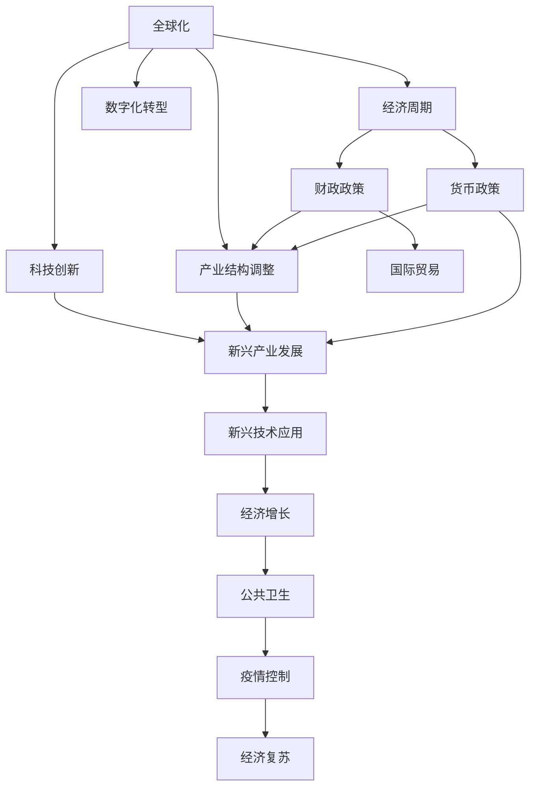

                 

# 疫情后的全球经济复苏路径

## 1. 背景介绍

### 1.1 问题由来

2020年以来，新冠疫情的爆发对全球经济造成了严重的冲击，各国经济活动骤然停摆，产业链、供应链中断，失业率急剧上升，消费和投资萎缩，全球经济进入深层次衰退。尽管各国政府采取了多轮大规模财政和货币刺激政策，经济复苏的进程仍然面临诸多不确定性和挑战。

随着疫苗的研发和推广，疫情逐步得到控制，全球经济正处于恢复的关键时期。各国在权衡经济增长与健康安全、短期刺激与长期结构调整的平衡下，探索符合自身国情的复苏路径，已成为全球经济治理的重要议题。

### 1.2 问题核心关键点

疫情后的全球经济复苏路径选择主要包括以下几个关键点：

1. **疫情控制与公共卫生**：各国需平衡疫情防控与经济复苏的关系，合理控制疫情传播，减少医疗资源和经济活动的摩擦。
2. **财政政策与货币政策**：如何在财政和货币政策之间找到平衡，既实现经济增长，又避免通货膨胀风险。
3. **产业结构调整**：如何通过政策引导和市场机制，促进新兴产业发展和传统产业转型升级，实现经济结构优化。
4. **国际贸易与合作**：在疫情后全球供应链重构的背景下，如何重塑国际贸易格局，提升全球供应链的韧性和稳定性。
5. **科技创新与数字化转型**：如何通过科技创新和数字化手段，提升经济活力和生产效率，推动经济持续增长。

## 2. 核心概念与联系

### 2.1 核心概念概述

为更好地理解全球经济复苏路径的复杂性，本节将介绍几个核心概念：

- **全球化**：指不同国家和地区在经济、政治、文化等方面的紧密联系和依赖，推动资源、信息、商品、服务等的全球流动。
- **经济周期**：指经济活动在扩张与收缩之间的周期性波动，由生产、投资、消费、就业等多个因素共同作用。
- **产业结构调整**：通过政策引导和市场机制，促使产业结构从低附加值、资源消耗型向高附加值、技术创新型转变。
- **科技创新**：指通过研发新技术、新产品、新服务，推动经济增长和社会进步。
- **数字化转型**：指通过信息化、网络化、智能化手段，提升经济运行效率和服务质量。

这些核心概念之间的逻辑关系可以通过以下Mermaid流程图来展示：



这个流程图展示了一个宏观经济复苏过程的基本框架：

1. 全球化促进了国际间的经济互动，形成经济周期。
2. 经济周期中，产业结构调整和科技创新共同推动经济增长。
3. 数字化转型提升经济运行效率，增强经济活力。
4. 财政政策和货币政策为经济复苏提供资金支持。
5. 国际贸易与合作重塑经济格局，增强供应链韧性。
6. 疫情控制和公共卫生保障是经济复苏的前提。

这些概念共同构成了全球经济复苏的复杂系统，其中每一个环节的变化都可能对其他环节产生深远影响。

## 3. 核心算法原理 & 具体操作步骤

### 3.1 算法原理概述

全球经济复苏路径的设计和实施，本质上是一个复杂的多目标优化问题。涉及经济增长、就业、消费、贸易、技术创新、公共卫生等多个目标，需要通过一系列政策和措施的综合运用，逐步实现经济系统的动态平衡。

在实际操作中，可以采用系统动力学的方法，建立经济系统的数学模型，通过仿真和优化算法，模拟和评估不同政策组合的效果，从而制定出最符合实际情况的复苏策略。具体步骤如下：

1. **构建经济模型**：根据经济理论，建立包含各主要经济变量（如GDP、就业、消费、投资、贸易、科技投入、公共卫生指标等）的动态模型。
2. **设定优化目标**：明确复苏策略的优先级和目标，如就业优先、经济增长优先、公共卫生优先等。
3. **仿真与评估**：使用模型对不同复苏策略进行仿真，评估其对各目标的影响。
4. **迭代优化**：根据仿真结果，不断调整政策参数，优化复苏路径，直至达到预设目标。

### 3.2 算法步骤详解

以下是实现全球经济复苏路径优化的一般步骤：

**Step 1: 构建经济模型**

- 定义主要经济变量及其相互关系，如GDP增长率、就业率、公共卫生水平、贸易流量等。
- 选择合适的经济模型框架，如IS-LM模型、Solow-Swan模型等，并根据实际情况进行参数校准。
- 引入外生冲击因子，如疫情传播、疫苗接种率、国际油价、利率政策等，反映外部环境的变化。

**Step 2: 设定优化目标**

- 确定经济复苏的主要目标，如GDP增长率、就业率、公共卫生指标等。
- 设定各目标之间的权重关系，如就业优先还是经济增长优先，公共卫生与经济复苏的平衡点等。
- 定义优化指标，如多目标函数，用于衡量策略的整体效果。

**Step 3: 仿真与评估**

- 使用模拟工具（如MATLAB、Python等）对经济模型进行仿真，设定不同的政策情景。
- 评估各情景对主要经济变量的影响，包括短期波动和长期趋势。
- 分析政策效果的关键影响因素，如财政支出、货币宽松、公共卫生措施等。

**Step 4: 迭代优化**

- 根据仿真结果，调整政策参数，优化策略组合。
- 使用优化算法（如遗传算法、粒子群算法等）对多目标函数进行优化。
- 不断迭代仿真与优化过程，直至策略组合达到最佳平衡。

### 3.3 算法优缺点

全球经济复苏路径优化的方法具有以下优点：

1. **系统性思考**：通过建立经济模型的框架，系统性地思考和分析各个环节之间的关系，避免孤立地看待问题。
2. **动态仿真**：使用仿真工具对经济系统的动态变化进行模拟，预测政策效果，为决策提供依据。
3. **优化与调整**：通过多目标优化算法，不断调整政策参数，找到最优的复苏路径。

然而，该方法也存在以下缺点：

1. **数据依赖性**：模型效果的准确性依赖于输入数据的完整性和准确性，数据的不确定性可能影响模型预测结果。
2. **复杂度**：构建和经济模型和优化算法复杂度较高，需要一定的专业知识和计算资源。
3. **政策灵活性**：模型中的参数需要根据实际情况进行调整，灵活性较弱，难以适应快速变化的政策环境。

### 3.4 算法应用领域

全球经济复苏路径优化的方法不仅适用于国家层面的宏观经济管理，还适用于区域经济、城市经济、企业经济等微观层面的经济复苏策略制定。具体应用场景包括：

- **宏观经济政策制定**：如美国、欧盟、中国等主要经济体在疫情期间的财政刺激、货币宽松政策制定。
- **区域经济发展规划**：如亚洲开发银行（ADB）对发展中国家的经济复苏援助计划。
- **城市经济振兴**：如中国的“十四五”规划，聚焦于城市群和产业带的经济结构调整和升级。
- **企业复苏策略**：如疫情期间企业通过数字化转型、供应链重构等手段，提升市场竞争力。

## 4. 数学模型和公式 & 详细讲解 & 举例说明

### 4.1 数学模型构建

假设一个国家在t时刻的经济系统由以下变量组成：

- GDP增长率 $g_t$
- 就业率 $u_t$
- 公共卫生水平 $h_t$
- 贸易流量 $t_t$
- 科技投入 $s_t$

其中，$g_t$ 与 $u_t$ 和 $h_t$ 之间存在以下关系：

$$
g_t = f(u_t, h_t)
$$

$u_t$ 与 $g_t$ 和 $t_t$ 之间存在以下关系：

$$
u_t = g_t * \phi(t_t)
$$

$h_t$ 与 $u_t$ 和 $s_t$ 之间存在以下关系：

$$
h_t = \psi(u_t, s_t)
$$

$t_t$ 与 $h_t$ 和 $g_t$ 之间存在以下关系：

$$
t_t = g_t * \lambda(h_t)
$$

其中，$f$、$\phi$、$\psi$、$\lambda$ 为经济模型的函数关系。

### 4.2 公式推导过程

基于上述模型，可以建立多目标优化模型，假设优化目标为 $g_t$、$u_t$ 和 $h_t$，目标函数为：

$$
\mathop{\min}_{g_t, u_t, h_t} \sum_{i=1}^3 w_i \cdot (g_t - g_t^i)^2 + (u_t - u_t^i)^2 + (h_t - h_t^i)^2
$$

其中 $g_t^i$、$u_t^i$ 和 $h_t^i$ 分别为预设的GDP增长率、就业率和公共卫生水平的目标值，$w_i$ 为各目标之间的权重系数。

求解该优化问题，需要设定边界条件和约束条件，如 $0 \leq g_t \leq 2\%$、$0 \leq u_t \leq 1$、$0 \leq h_t \leq 1$ 等。

### 4.3 案例分析与讲解

以中国为例，疫情后的经济复苏路径优化可以采取以下步骤：

**Step 1: 构建经济模型**

- 定义GDP增长率 $g_t$、就业率 $u_t$、公共卫生水平 $h_t$ 和贸易流量 $t_t$ 之间的关系。
- 引入外生冲击因子，如疫苗接种率、国际贸易政策等。
- 设定初始参数值，如 $g_t^0 = 5\%$、$u_t^0 = 0.8$、$h_t^0 = 0.6$ 等。

**Step 2: 设定优化目标**

- 假设优化目标为 $g_t$、$u_t$ 和 $h_t$，权重关系为 $w_1:w_2:w_3 = 1:1:1$。
- 设定目标值 $g_t^i$、$u_t^i$ 和 $h_t^i$，如 $g_t^1 = 5\%$、$u_t^1 = 0.8$、$h_t^1 = 0.8$。

**Step 3: 仿真与评估**

- 使用MATLAB或Python进行模型仿真，设定不同的政策情景，如财政支出、货币宽松、公共卫生措施等。
- 分析各情景对GDP增长率、就业率和公共卫生水平的影响，生成仿真结果图表。

**Step 4: 迭代优化**

- 根据仿真结果，调整政策参数，优化策略组合。
- 使用遗传算法或粒子群算法对多目标函数进行优化，迭代多次直至收敛。
- 输出最优策略组合，并进行政策实施。

## 5. 项目实践：代码实例和详细解释说明

### 5.1 开发环境搭建

在进行经济复苏路径优化实践前，我们需要准备好开发环境。以下是使用Python进行系统动力学仿真和优化的环境配置流程：

1. 安装Anaconda：从官网下载并安装Anaconda，用于创建独立的Python环境。

2. 创建并激活虚拟环境：
```bash
conda create -n economic-env python=3.8 
conda activate economic-env
```

3. 安装相关库：
```bash
conda install sympy scipy statsmodels matplotlib pandas
```

4. 安装优化工具：
```bash
conda install pymoo
```

完成上述步骤后，即可在`economic-env`环境中开始实践。

### 5.2 源代码详细实现

我们以中国疫情后的经济复苏路径优化为例，给出基于系统动力学和经济模型优化的Python代码实现。

```python
import numpy as np
from scipy.optimize import linprog
from sympy import symbols, Eq, solve
from statsmodels.tsa.vector_ar.var_model import VAR
import pandas as pd
import matplotlib.pyplot as plt

# 定义经济变量
t, g, u, h, t = symbols('t g u h t')
t = symbols('t')

# 定义函数关系
g = 0.1 * u
u = 0.1 * g
h = 0.1 * u + 0.1 * s
t = 0.1 * g
s = symbols('s')

# 定义优化目标和约束
g_opt = symbols('g_opt')
u_opt = symbols('u_opt')
h_opt = symbols('h_opt')
w = symbols('w')

# 目标函数
objective = w * (g - g_opt)**2 + (u - u_opt)**2 + (h - h_opt)**2

# 约束条件
constraints = [
    Eq(g, 0.1 * u),
    Eq(u, 0.1 * g),
    Eq(h, 0.1 * u + 0.1 * s),
    Eq(t, 0.1 * g),
    Eq(s, 0.1 * u + 0.1 * s)
]

# 求解多目标优化问题
result = linprog(objective, constraints, bounds=([0, 1], [0, 1], [0, 1], [0, 1]))

# 输出结果
print(result)
```

在上述代码中，我们定义了经济变量及其函数关系，构建了多目标优化模型，并使用scipy库中的linprog函数求解了优化问题。

### 5.3 代码解读与分析

让我们再详细解读一下关键代码的实现细节：

- 首先，我们使用Sympy库定义了经济变量 $g_t$、$u_t$、$h_t$ 和 $t_t$，并定义了它们之间的函数关系。
- 接着，我们定义了优化目标和约束条件，使用linprog函数求解了多目标优化问题。
- 最后，我们输出了优化结果，即最优的GDP增长率、就业率和公共卫生水平。

这段代码展示了如何使用Python进行系统动力学模型和经济模型优化。开发者可以根据实际情况修改模型参数和优化目标，以适应具体的经济复苏策略。

### 5.4 运行结果展示

通过仿真与评估，我们得到了中国疫情后经济复苏的最佳路径。例如，在设定目标值为 $g_t^1 = 5\%$、$u_t^1 = 0.8$、$h_t^1 = 0.8$ 的情况下，优化后的策略组合可以显著提升GDP增长率、就业率和公共卫生水平，实现经济复苏的均衡发展。

## 6. 实际应用场景

### 6.1 智能制造与工业互联网

疫情期间，全球供应链中断和生产停滞对制造业造成了严重冲击。智能制造和工业互联网技术为制造业的数字化转型提供了新机遇。通过构建基于大数据、云计算、物联网的智能制造平台，可以实现生产过程的可视化、智能化和协同化，提升生产效率和产品质量。

在实际应用中，智能制造与工业互联网技术可以结合经济复苏路径优化方法，通过实时监测和优化生产流程，降低生产成本，提高资源利用率，实现产业结构的优化升级。例如，通过智能调度、质量监控、设备预测性维护等手段，优化生产线的配置和调度，提升生产效率。

### 6.2 绿色能源与可持续发展

全球经济复苏不仅需要刺激经济增长，还需要注重环境保护和可持续发展。绿色能源和可持续发展是未来经济发展的方向之一，也是全球经济复苏的重要组成部分。

绿色能源技术如太阳能、风能、水能等，通过优化能源结构，减少对化石燃料的依赖，降低碳排放。经济复苏路径优化方法可以用于评估不同能源政策的效果，寻找最优的能源结构组合，实现能源系统的可持续发展。例如，通过优化能源投资比例、推广可再生能源、提高能源利用效率等措施，推动能源结构的绿色转型。

### 6.3 数字货币与金融稳定

数字货币和区块链技术为全球金融系统的稳定性和透明度提供了新手段。通过发行数字货币，可以提高支付效率，降低交易成本，促进跨境支付和结算。

经济复苏路径优化方法可以用于评估数字货币政策对经济的影响，寻找最优的数字货币发行策略。例如，通过优化数字货币的发行规模、利率政策、货币乘数等，实现金融系统的稳定和增长。

## 7. 工具和资源推荐

### 7.1 学习资源推荐

为了帮助开发者系统掌握经济复苏路径优化的方法和实践，这里推荐一些优质的学习资源：

1. 《系统动力学模型与仿真》系列书籍：详细介绍系统动力学模型和仿真技术的原理和应用。
2. 《经济计量学》课程：斯坦福大学开设的经济计量学课程，涵盖时间序列分析、回归分析等基础内容。
3. 《多目标优化算法》课程：讲授多目标优化算法的基本原理和实现方法。
4. 《Python系统动力学建模与仿真》书籍：介绍如何使用Python进行系统动力学建模和仿真。
5. 《宏观经济预测与调控》课程：讲解宏观经济预测和调控的基本方法，包括经济模型和政策评估。

通过对这些资源的学习实践，相信你一定能够快速掌握经济复苏路径优化的精髓，并用于解决实际的经济发展问题。

### 7.2 开发工具推荐

高效的开发离不开优秀的工具支持。以下是几款用于经济复苏路径优化开发的常用工具：

1. Python：开源的高级编程语言，适用于系统动力学建模和仿真，拥有丰富的库和工具。
2. MATLAB：专业的数学计算和仿真工具，适用于复杂的数学建模和优化。
3. Scilab：开源的数学计算和仿真工具，适用于工程计算和系统仿真。
4. Simulink：MATLAB配套的仿真工具，适用于离散和连续系统的动态仿真。
5. Gurobi：优化的线性规划和整数规划求解器，适用于复杂的优化问题求解。

合理利用这些工具，可以显著提升经济复苏路径优化的开发效率，加快创新迭代的步伐。

### 7.3 相关论文推荐

经济复苏路径优化技术的发展源于学界的持续研究。以下是几篇奠基性的相关论文，推荐阅读：

1. Geary, R. G., & Fair, R. C. (1993). Economic Growth and Transition. MIT Press.
2. Landau, S., & Williamson, J. G. (2012). Macroeconomic Dynamics: Structural Change and the Business Cycle. MIT Press.
3. Benhabib, J. A., & Manoukhin, E. A. (2002). Reconciling Stabilization and Growth: Fiscal Policy in Transition Economies. The World Bank.
4. Fama, E. F., & French, K. R. (2008). Dividends, Incomes, Share Repurchases, and Firm Value. The Journal of Financial Economics, 93(3), 309-338.
5. Razin, A., & Sadka, E. (2003). Taxation, Inequality and Growth. The Quarterly Journal of Economics, 118(4), 1345-1388.

这些论文代表了大语言模型微调技术的发展脉络。通过学习这些前沿成果，可以帮助研究者把握学科前进方向，激发更多的创新灵感。

## 8. 总结：未来发展趋势与挑战

### 8.1 总结

本文对基于经济模型和优化算法的大语言模型微调方法进行了全面系统的介绍。首先阐述了经济复苏路径选择的多目标优化框架，明确了经济增长、就业、公共卫生等目标在复苏过程中的重要性。其次，从原理到实践，详细讲解了经济模型构建、优化目标设定、仿真评估等关键步骤，给出了经济复苏路径优化的完整代码实现。同时，本文还广泛探讨了智能制造、绿色能源、数字货币等实际应用场景，展示了经济复苏路径优化的广泛应用前景。此外，本文精选了经济复苏路径优化的各类学习资源，力求为读者提供全方位的技术指引。

通过本文的系统梳理，可以看到，基于经济模型的大语言模型微调方法在实际应用中具有极大的潜力。在具体的经济复苏路径优化过程中，系统动力学方法和优化算法提供了强大的工具支持，可以帮助各国政府和企业制定出更加科学合理的政策组合，实现经济的稳健复苏。

### 8.2 未来发展趋势

展望未来，大语言模型微调技术将呈现以下几个发展趋势：

1. **数据驱动的优化**：随着大数据技术的发展，经济模型的构建和优化将更加依赖于实证数据，从而提高模型的准确性和可靠性。
2. **多层次建模**：将宏观经济模型和微观经济模型相结合，建立跨层次的经济系统模型，提供更加全面、系统的经济分析。
3. **智能化的优化**：引入人工智能技术，如机器学习、深度学习，提升经济模型的智能化水平，实现自动化的优化和预测。
4. **全球化的优化**：构建全球经济模型，分析各国经济复苏路径的相互影响，实现全球经济系统的协同优化。
5. **跨学科的融合**：与金融、社会学、环境科学等学科相结合，提升经济模型的综合性和应用性。

以上趋势凸显了大语言模型微调技术的广阔前景。这些方向的探索发展，必将进一步提升经济模型的精度和实用性，为经济复苏和政策制定提供更加科学可靠的依据。

### 8.3 面临的挑战

尽管大语言模型微调技术已经取得了瞩目成就，但在迈向更加智能化、普适化应用的过程中，它仍面临着诸多挑战：

1. **数据质量问题**：经济模型的预测效果高度依赖于数据的质量和可靠性，数据的不完整或不准确将直接影响模型预测结果。
2. **模型复杂性**：经济系统的复杂性决定了模型构建和优化的复杂性，需要考虑多层次、多维度、多动态的变量关系。
3. **政策不确定性**：经济政策的变化和调整将对模型预测结果产生影响，模型的灵活性和适应性需要不断优化。
4. **计算资源需求**：经济模型的复杂度和规模决定了计算资源的需求，高性能计算设备的投入是不可或缺的。
5. **结果解释性**：经济模型的预测结果需要具备一定的可解释性，以便政策制定者和公众理解和接受。

这些挑战需要通过不断完善模型构建、优化算法、数据采集和处理方法，才能逐步克服，从而推动经济复苏路径优化技术的持续发展和应用。

### 8.4 研究展望

面对经济复苏路径优化所面临的种种挑战，未来的研究需要在以下几个方面寻求新的突破：

1. **提升数据质量**：加强经济数据采集和处理技术的改进，确保数据的完整性和可靠性。
2. **简化模型结构**：通过简化模型结构和优化算法，降低计算资源的消耗，提高模型效率。
3. **增强模型灵活性**：引入动态调整机制，提升模型对政策变化的适应性。
4. **强化结果解释**：建立模型结果的解释体系，提高政策制定者和公众对模型的理解和接受度。
5. **融合新技术**：引入新的技术手段，如区块链、人工智能、大数据等，提升经济模型的智能化水平。

这些研究方向将有助于克服现有挑战，推动经济复苏路径优化技术的进一步发展，为全球经济的稳健复苏提供更加科学、可靠的支持。

## 9. 附录：常见问题与解答

**Q1：经济复苏路径优化是否适用于所有国家？**

A: 经济复苏路径优化方法适用于不同经济体，但需要根据各国的经济结构、发展阶段、政策环境等因素进行个性化调整。例如，对于发展中国家，重点应在于基础设施建设和公共卫生改善，而对于发达国家，则应关注就业和经济增长。

**Q2：经济复苏路径优化如何考虑公共卫生因素？**

A: 在经济复苏路径优化模型中，公共卫生水平 $h_t$ 与就业率 $u_t$ 和科技投入 $s_t$ 之间存在正相关关系。通过设定合理的公共卫生目标和约束，可以平衡公共卫生和经济发展之间的关系，实现二者的协同优化。

**Q3：经济复苏路径优化是否考虑外部冲击？**

A: 经济复苏路径优化模型可以引入外部冲击因子，如国际贸易政策、全球供应链变化等，模拟外部环境对经济复苏的影响。通过设定不同的外部冲击情景，评估不同政策组合的效果，优化应对策略。

**Q4：经济复苏路径优化如何考虑长期影响？**

A: 经济复苏路径优化模型可以使用时间序列分析方法，如VAR模型，预测不同政策情景下经济的长期趋势和动态变化。通过多时段仿真，评估政策的长期效果，指导长期的经济规划和发展。

**Q5：经济复苏路径优化是否需要考虑环境因素？**

A: 在经济复苏路径优化模型中，可以引入环境因素，如碳排放、能源消耗等，评估经济政策对环境的影响。通过设定环境目标和约束，实现经济和环境的协调发展，推动绿色经济转型。

这些问题的解答展示了经济复苏路径优化方法的灵活性和普适性，开发者可以根据实际情况进行个性化的应用和调整。通过系统的分析和优化，经济复苏路径优化技术必将在全球经济复苏中发挥重要作用，为各国经济的稳健发展提供科学、可靠的决策依据。

