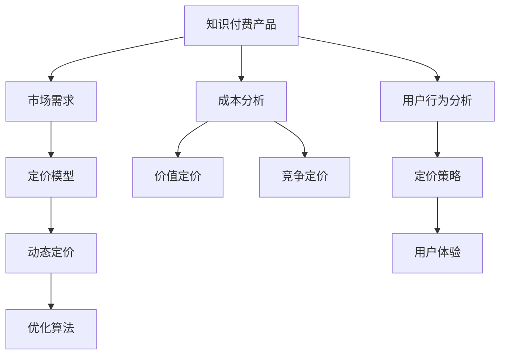

                 

# 知识付费产品定价策略详解

> 关键词：知识付费,定价策略,市场需求,成本分析,定价模型,价值定价,竞争定价,用户行为,优化算法,盈利模型

## 1. 背景介绍

### 1.1 问题由来
在互联网快速发展的今天，知识付费已成为一种新的内容消费方式。随着用户对专业知识和技能需求的增长，知识付费市场呈现出蓬勃发展的趋势。然而，如何制定合理的定价策略，是知识付费平台面临的重大挑战之一。

一方面，知识付费产品的定价直接关系到平台的用户留存和收益增长。定价过高可能抑制用户消费，导致用户流失；定价过低则可能无法覆盖成本，影响平台的长期健康发展。另一方面，不同知识付费产品的需求特性和价值认知存在较大差异，需要采取灵活多样的定价策略。

### 1.2 问题核心关键点
知识付费产品的定价策略主要包括以下几个核心关键点：
- 定价模型的选择与构建：基于市场需求和成本分析，构建科学合理的定价模型。
- 用户行为研究：分析用户对知识产品的需求特性和消费习惯，以便制定更符合用户期望的定价策略。
- 竞争分析：研究市场竞争格局，识别主要竞争者的定价策略，避免价格战对平台收益的负面影响。
- 动态定价策略：根据市场需求和平台运营状态，灵活调整定价策略，优化收益和用户体验。

## 2. 核心概念与联系

### 2.1 核心概念概述

为更好地理解知识付费产品定价策略的制定方法，本节将介绍几个密切相关的核心概念：

- 知识付费产品：指通过互联网平台向用户提供专业知识、技能和信息的内容消费方式，包括在线课程、电子书、咨询服务、专栏文章等。

- 市场需求：指用户对知识付费产品价值的主观认知和支付意愿。受用户收入水平、知识获取动机、信息获取方式等因素的影响。

- 成本分析：指分析知识付费产品生产、分发、维护等环节的成本构成和大小，为定价提供基础参考。

- 定价模型：指用于量化知识付费产品价值、成本和用户支付意愿的数学模型，常用的包括价值定价模型、竞争定价模型等。

- 价值定价：指根据知识产品的独特性和用户对产品的价值认知，制定高于市场平均价格的定价策略。

- 竞争定价：指基于市场竞争格局和主要竞争对手的定价水平，制定竞争力和价格优势的定价策略。

- 动态定价：指根据市场需求变化和平台运营状态，灵活调整定价策略，以实现最大化收益。

- 用户行为分析：指通过数据分析用户对知识付费产品的购买行为、评价反馈、消费路径等，以优化定价策略。

这些核心概念之间的逻辑关系可以通过以下Mermaid流程图来展示：



这个流程图展示了几大核心概念之间的关系：

1. 知识付费产品是定价策略的对象，其价值和成本需要通过定价模型进行量化。
2. 市场需求和成本分析为定价模型提供数据支持，共同决定定价水平。
3. 定价模型通过价值定价和竞争定价，为平台提供合适的定价策略。
4. 动态定价策略根据市场和平台运营状态进行灵活调整。
5. 用户行为分析为定价策略提供优化依据，以提升用户体验。

这些概念共同构成了知识付费产品定价策略制定的框架，帮助平台制定更科学合理的定价策略。

## 3. 核心算法原理 & 具体操作步骤
### 3.1 算法原理概述

知识付费产品定价策略的制定涉及多个领域的知识，包括经济学、统计学、运筹学和计算机科学等。其中，经济学理论和模型是定价策略制定的核心工具。常用的经济学模型包括：

1. **价值定价模型**：基于知识产品的独特性和用户对其价值的认知，制定高于市场平均价格的定价策略。
2. **竞争定价模型**：根据市场竞争格局和主要竞争对手的定价水平，制定具有竞争力和价格优势的定价策略。
3. **动态定价模型**：根据市场需求变化和平台运营状态，灵活调整定价策略，以实现最大化收益。

这些模型通常基于市场需求和成本分析，结合用户行为和市场竞争环境，构建数学公式进行量化。

### 3.2 算法步骤详解

知识付费产品定价策略的制定一般包括以下几个关键步骤：

**Step 1: 数据收集与分析**
- 收集用户行为数据、知识产品价格数据、市场调研数据等。
- 分析用户对知识产品的价值认知、支付意愿和消费行为。

**Step 2: 构建定价模型**
- 根据需求和成本分析，选择和构建合适的定价模型，如价值定价模型、竞争定价模型等。
- 使用统计学和运筹学方法，量化知识产品的价值和成本。

**Step 3: 优化定价策略**
- 根据定价模型计算出最优定价，结合平台运营状态和市场竞争环境，调整定价策略。
- 使用动态定价算法，灵活调整价格以最大化收益。

**Step 4: 实施与监测**
- 根据优化后的定价策略实施产品定价。
- 定期监测用户行为和市场反馈，评估定价策略的效果，及时调整。

### 3.3 算法优缺点

知识付费产品定价策略的制定方法具有以下优点：
1. 科学合理：基于经济理论和数据驱动的模型构建，制定科学的定价策略。
2. 灵活高效：根据市场需求和平台运营状态，动态调整定价策略，优化收益和用户体验。
3. 竞争力强：结合市场竞争环境，制定具有竞争力和价格优势的定价策略。

同时，该方法也存在一定的局限性：
1. 数据依赖：定价策略的制定依赖于高质量的数据，数据收集和分析成本较高。
2. 模型复杂：定价模型需要综合考虑多方面因素，模型构建和优化难度较大。
3. 市场变化：市场需求和竞争环境不断变化，定价策略需要及时调整，增加了实施难度。
4. 用户反馈：用户对知识产品的价值认知和支付意愿存在差异，定价策略需要灵活应对。

尽管存在这些局限性，但就目前而言，基于数据驱动的定价策略是知识付费平台最为常用的方法。未来相关研究的重点在于如何进一步降低数据收集和分析成本，提高定价模型的鲁棒性和灵活性，同时兼顾用户的价值认知和支付意愿。

### 3.4 算法应用领域

知识付费产品定价策略的制定方法在多个应用领域得到了广泛的应用，例如：

- 在线教育：根据课程内容和市场需求，制定合理的价格策略，提升用户购买意愿和课程收益。
- 咨询服务：根据服务内容和用户需求，制定具有竞争力的定价策略，优化服务体验和客户满意度。
- 专业培训：根据培训课程的价值和用户期望，制定科学合理的定价策略，吸引专业人才进行学习和交流。
- 职业指导：根据咨询服务质量和用户需求，制定灵活的定价策略，提升职业指导的效果和用户反馈。
- 技能培训：根据技能培训的难度和市场供需，制定合理的定价策略，促进技能传播和技能提升。

这些领域中的应用展示了知识付费产品定价策略的广泛适用性和重要性，有助于推动各行业知识内容的商业化和市场化进程。

## 4. 数学模型和公式 & 详细讲解 & 举例说明
### 4.1 数学模型构建

知识付费产品定价策略的制定涉及多个数学模型，包括价值定价模型、竞争定价模型和动态定价模型。

**价值定价模型**：
$$
P = \frac{V}{1 - e^{-\alpha M}}
$$
其中，$P$ 为知识产品定价，$V$ 为用户对知识产品的价值认知，$M$ 为用户对知识产品的市场需求，$\alpha$ 为调整系数。

**竞争定价模型**：
$$
P = P_{avg} \times (1 - \beta)
$$
其中，$P_{avg}$ 为市场平均定价，$\beta$ 为竞争系数。

**动态定价模型**：
$$
P = P_{base} + \gamma D
$$
其中，$P_{base}$ 为基础定价，$\gamma$ 为调整系数，$D$ 为市场需求指数。

### 4.2 公式推导过程

以价值定价模型为例，其推导过程如下：

设知识产品的价值为 $V$，市场需求为 $M$，用户支付意愿为 $W$，平台成本为 $C$。则知识产品的定价 $P$ 应满足以下条件：
$$
P = \frac{V}{1 - e^{-\alpha M}}
$$
$$
P \geq W - C
$$

将 $P$ 代入第二个不等式，得：
$$
\frac{V}{1 - e^{-\alpha M}} \geq W - C
$$

根据市场需求和成本分析，构建价值定价模型，满足用户支付意愿和平台收益要求。

### 4.3 案例分析与讲解

假设某知识付费平台的在线课程价值为 $V=1000$ 元，市场需求指数为 $M=0.5$，用户支付意愿为 $W=500$ 元，平台成本为 $C=200$ 元。根据价值定价模型，计算得到课程定价 $P$ 为：
$$
P = \frac{1000}{1 - e^{-0.5 \times 0.5}} = \frac{1000}{1 - e^{-0.25}} \approx 752.64
$$

可见，该知识付费平台应将课程定价定为 752.64 元，以最大化收益和用户支付意愿。

## 5. 项目实践：代码实例和详细解释说明
### 5.1 开发环境搭建

在进行知识付费产品定价策略的实践前，我们需要准备好开发环境。以下是使用Python进行代码实现的开发环境配置流程：

1. 安装Anaconda：从官网下载并安装Anaconda，用于创建独立的Python环境。

2. 创建并激活虚拟环境：
```bash
conda create -n pricing-env python=3.8 
conda activate pricing-env
```

3. 安装相关库：
```bash
pip install pandas numpy matplotlib scipy scikit-learn
```

4. 安装TensorFlow：
```bash
pip install tensorflow==2.x
```

5. 安装Keras：
```bash
pip install keras
```

完成上述步骤后，即可在`pricing-env`环境中开始定价策略的实践。

### 5.2 源代码详细实现

以下是使用Keras库对知识付费产品进行价值定价的Python代码实现：

```python
import numpy as np
import pandas as pd
from keras.models import Sequential
from keras.layers import Dense
from sklearn.model_selection import train_test_split

# 加载数据
data = pd.read_csv('price_data.csv')

# 数据预处理
X = data[['value', 'demand', 'cost']]
y = data['price']

# 划分训练集和测试集
X_train, X_test, y_train, y_test = train_test_split(X, y, test_size=0.2, random_state=42)

# 构建模型
model = Sequential()
model.add(Dense(10, input_dim=3, activation='relu'))
model.add(Dense(1, activation='linear'))
model.compile(loss='mean_squared_error', optimizer='adam')

# 训练模型
model.fit(X_train, y_train, epochs=100, batch_size=32, validation_data=(X_test, y_test))

# 预测定价
test_data = np.array([[1000, 0.5, 200]])
predicted_price = model.predict(test_data)[0][0]
print(f"预测定价为：{predicted_price:.2f} 元")
```

### 5.3 代码解读与分析

让我们再详细解读一下关键代码的实现细节：

**数据加载与预处理**：
- 使用Pandas库加载定价数据，包括知识产品的价值、市场需求、平台成本和定价。
- 对数据进行预处理，构建输入特征向量 $X$ 和输出目标向量 $y$。

**模型构建与训练**：
- 使用Keras库构建一个简单的全连接神经网络模型，包含两个隐藏层。
- 使用均方误差作为损失函数，Adam优化器进行优化。
- 在训练集上使用交叉验证进行模型训练，预测测试集上的定价。

**预测定价**：
- 对新的知识产品定价，输入其价值、市场需求和平台成本，得到预测定价。

可以看到，通过简单的机器学习模型，我们便能够预测知识产品的定价，这为知识付费产品定价策略的制定提供了新的思路。

## 6. 实际应用场景
### 6.1 在线教育

在线教育平台通过知识付费产品的定价策略，能够有效提升课程收益和用户满意度。平台可以根据课程的难度、内容和市场需求，制定合理的价格策略，吸引用户购买。例如，某在线教育平台将一门高级编程课程定价为 2000 元，但课程质量较高，用户反馈良好，能够获得较高的收益和用户评价。

### 6.2 咨询服务

专业咨询服务机构在知识付费产品定价策略的制定上，需要结合市场需求和用户期望，制定灵活的定价策略。例如，某咨询公司提供市场分析咨询服务，定价为 3000 元/次，但由于分析深度和准确度较高，能够获得用户的高度认可。

### 6.3 专业培训

专业培训平台可以根据培训课程的难度、师资力量和市场需求，制定科学合理的定价策略。例如，某培训机构将一门高级会计培训课程定价为 5000 元，虽然价格较高，但课程内容丰富，教学质量高，能够吸引专业人才进行学习和提升。

### 6.4 未来应用展望

随着知识付费市场的不断扩展，基于数据驱动的定价策略将更加广泛地应用于各类知识付费产品中。未来，知识付费产品定价策略的发展趋势可能包括以下几个方向：

1. 个性化定价：根据用户的学习进度、课程完成度等因素，进行个性化定价，提升用户满意度和留存率。
2. 动态定价：根据市场需求变化和平台运营状态，灵活调整定价策略，优化收益和用户体验。
3. 联合定价：与外部知识付费平台合作，共同制定定价策略，提升市场竞争力。
4. 多维度定价：结合用户画像、市场需求、平台流量等多维度因素，制定更加精细化的定价策略。

## 7. 工具和资源推荐
### 7.1 学习资源推荐

为了帮助开发者系统掌握知识付费产品定价策略的理论基础和实践技巧，这里推荐一些优质的学习资源：

1. 《定价策略与经济模型》系列书籍：详细讲解了各类定价策略的理论基础和实际应用，包括价值定价、竞争定价、动态定价等。
2. Coursera《经济学与商业分析》课程：斯坦福大学教授授课，涵盖经济学和商业分析的基础知识和高级应用，适合深入学习定价策略。
3. 《定价心理学》一书：分析了用户心理对定价策略的影响，提供实战经验和方法。
4. HBR《定价权》一书：揭示了全球顶尖企业的定价策略，提供了成功案例和经验分享。
5. Google Scholar：涵盖各类定价策略的学术论文，适合进行深入研究和理论学习。

通过对这些资源的学习实践，相信你一定能够快速掌握知识付费产品定价策略的精髓，并用于解决实际的定价问题。

### 7.2 开发工具推荐

高效的开发离不开优秀的工具支持。以下是几款用于知识付费产品定价策略开发的常用工具：

1. Python：广泛使用的编程语言，具有强大的数据分析和机器学习库支持，如Pandas、NumPy、SciPy等。
2. Keras：基于TensorFlow的高级神经网络库，简单易用，适合快速开发和原型设计。
3. TensorFlow：由Google主导开发的深度学习框架，适合大规模工程应用，提供丰富的模型和工具支持。
4. Matplotlib：数据可视化库，用于绘制各种图表，帮助分析和解释数据。
5. Jupyter Notebook：交互式编程环境，支持多种编程语言和工具库，适合研究和实验。

合理利用这些工具，可以显著提升知识付费产品定价策略的开发效率，加快创新迭代的步伐。

### 7.3 相关论文推荐

知识付费产品定价策略的研究源于学界的持续研究。以下是几篇奠基性的相关论文，推荐阅读：

1. "The Economics of Pricing" by William P. Smith：讨论了各类定价策略的经济基础和实际应用。
2. "Pricing Strategies in New Markets" by Michael E. Porter：分析了进入新市场时，定价策略的制定和实施。
3. "Dynamic Pricing in the Internet Economy" by James P. Nagarajan：介绍了动态定价在互联网经济中的应用和模型。
4. "Psychological Aspects of Pricing" by Paul B. Verde：探讨了用户心理对定价策略的影响。
5. "A Strategic Model of Pricing and Competition" by Richard Whiteman：构建了定价和竞争的战略模型，分析了市场竞争对定价策略的影响。

这些论文代表了大语言模型定价策略的发展脉络。通过学习这些前沿成果，可以帮助研究者把握学科前进方向，激发更多的创新灵感。

## 8. 总结：未来发展趋势与挑战
### 8.1 总结

本文对知识付费产品定价策略进行了全面系统的介绍。首先阐述了知识付费产品定价策略的研究背景和意义，明确了定价策略在知识付费平台的用户留存和收益增长中的重要地位。其次，从原理到实践，详细讲解了定价策略的数学模型和操作步骤，给出了定价策略开发的完整代码实例。同时，本文还广泛探讨了定价策略在在线教育、咨询服务等多个行业领域的应用前景，展示了定价策略的广泛适用性和重要性。

通过本文的系统梳理，可以看到，知识付费产品定价策略是知识付费平台最为核心的决策之一，能够显著影响平台的收益和用户满意度。科学合理的定价策略不仅能够提升平台收益，还能增强用户粘性和品牌影响力。未来，知识付费产品定价策略的发展将进一步深化和扩展，为知识付费平台带来更大的商业价值和用户价值。

### 8.2 未来发展趋势

展望未来，知识付费产品定价策略的发展趋势可能包括以下几个方向：

1. 数据驱动：随着大数据和人工智能技术的不断进步，数据驱动的定价策略将更加普及和精准，帮助平台制定更加科学的定价决策。
2. 动态定价：结合市场变化和用户行为，灵活调整定价策略，实现最大化收益。
3. 多维度定价：结合用户画像、市场需求、平台流量等多维度因素，制定更加精细化的定价策略。
4. 用户感知：提升用户对定价策略的感知和认可，增强用户粘性和满意度。
5. 联合定价：与外部平台合作，共同制定定价策略，提升市场竞争力。
6. 个性化定价：根据用户的学习进度、课程完成度等因素，进行个性化定价，提升用户满意度和留存率。

这些趋势展示了知识付费产品定价策略未来的发展方向，有助于推动知识付费平台更好地适应市场需求，提升用户价值和平台收益。

### 8.3 面临的挑战

尽管知识付费产品定价策略在实践中已取得了一定成效，但在迈向更加智能化、普适化应用的过程中，它仍面临诸多挑战：

1. 数据质量问题：定价策略的制定依赖于高质量的数据，但数据收集和预处理成本较高，数据质量问题难以避免。
2. 模型鲁棒性不足：定价模型需要具备较高的鲁棒性，能够应对市场变化和用户行为的变化，现有模型仍需进一步优化。
3. 用户行为分析：用户行为分析需要综合考虑多方面因素，分析难度较大，定价策略需要灵活应对。
4. 市场竞争：市场竞争环境复杂，定价策略需要及时调整，增加了实施难度。
5. 价格波动：市场价格波动较大，定价策略需要具备一定的灵活性和应对能力。
6. 用户感知：用户对定价策略的感知和认可需要进一步提升，定价策略需要更加透明和公平。

这些挑战需要知识付费平台不断优化定价策略，提升数据质量和模型鲁棒性，同时增强用户粘性和满意度，才能在激烈的市场竞争中保持优势。

### 8.4 研究展望

面对知识付费产品定价策略面临的挑战，未来的研究需要在以下几个方面寻求新的突破：

1. 数据质量提升：提升数据收集和预处理的质量，利用先进的数据清洗和增强技术，提高数据可用性。
2. 模型鲁棒性优化：开发更加鲁棒的定价模型，提高模型的泛化能力和应对能力。
3. 用户行为研究：深入研究用户行为和心理，提升用户对定价策略的感知和认可。
4. 市场竞争分析：加强市场竞争环境分析，及时调整定价策略，提升市场竞争力。
5. 联合定价策略：与外部平台合作，共同制定定价策略，提升市场影响力和用户认可度。
6. 个性化定价策略：结合用户行为和用户画像，进行个性化定价，提升用户满意度和留存率。

这些研究方向展示了知识付费产品定价策略未来的发展方向，有助于推动知识付费平台更好地适应市场需求，提升用户价值和平台收益。

## 9. 附录：常见问题与解答
**Q1: 知识付费产品的定价策略有哪些？**

A: 知识付费产品的定价策略主要包括：
1. 价值定价：根据知识产品的独特性和用户对其价值的认知，制定高于市场平均价格的定价策略。
2. 竞争定价：根据市场竞争格局和主要竞争对手的定价水平，制定具有竞争力和价格优势的定价策略。
3. 动态定价：根据市场需求变化和平台运营状态，灵活调整定价策略，以实现最大化收益。

**Q2: 如何构建科学合理的定价模型？**

A: 构建科学合理的定价模型需要考虑以下因素：
1. 市场需求：分析用户对知识产品的价值认知和支付意愿。
2. 成本分析：分析知识产品生产、分发、维护等环节的成本构成和大小。
3. 用户行为：分析用户对知识产品的需求特性和消费习惯。
4. 竞争环境：分析市场竞争格局和主要竞争对手的定价水平。

**Q3: 知识付费产品的定价策略如何实施和调整？**

A: 知识付费产品的定价策略实施和调整一般包括以下步骤：
1. 数据收集与分析：收集用户行为数据、知识产品价格数据、市场调研数据等，分析用户对知识产品的价值认知、支付意愿和消费行为。
2. 定价模型构建：根据需求和成本分析，选择和构建合适的定价模型，如价值定价模型、竞争定价模型等。
3. 优化定价策略：根据定价模型计算出最优定价，结合平台运营状态和市场竞争环境，调整定价策略。
4. 实施与监测：根据优化后的定价策略实施产品定价，定期监测用户行为和市场反馈，评估定价策略的效果，及时调整。

**Q4: 知识付费产品定价策略面临哪些挑战？**

A: 知识付费产品定价策略面临的挑战包括：
1. 数据质量问题：定价策略的制定依赖于高质量的数据，但数据收集和预处理成本较高。
2. 模型鲁棒性不足：定价模型需要具备较高的鲁棒性，能够应对市场变化和用户行为的变化。
3. 用户行为分析：用户行为分析需要综合考虑多方面因素，分析难度较大。
4. 市场竞争：市场竞争环境复杂，定价策略需要及时调整，增加了实施难度。
5. 价格波动：市场价格波动较大，定价策略需要具备一定的灵活性和应对能力。
6. 用户感知：用户对定价策略的感知和认可需要进一步提升，定价策略需要更加透明和公平。

**Q5: 如何提高知识付费产品定价策略的科学性和灵活性？**

A: 提高知识付费产品定价策略的科学性和灵活性，可以从以下几个方面入手：
1. 数据质量提升：提升数据收集和预处理的质量，利用先进的数据清洗和增强技术，提高数据可用性。
2. 模型鲁棒性优化：开发更加鲁棒的定价模型，提高模型的泛化能力和应对能力。
3. 用户行为研究：深入研究用户行为和心理，提升用户对定价策略的感知和认可。
4. 市场竞争分析：加强市场竞争环境分析，及时调整定价策略，提升市场竞争力。
5. 联合定价策略：与外部平台合作，共同制定定价策略，提升市场影响力和用户认可度。
6. 个性化定价策略：结合用户行为和用户画像，进行个性化定价，提升用户满意度和留存率。

**Q6: 知识付费产品的定价策略如何与用户行为结合？**

A: 知识付费产品的定价策略与用户行为结合，可以从以下几个方面入手：
1. 数据分析：收集用户行为数据，如学习进度、课程完成度等，分析用户对知识产品的价值认知和支付意愿。
2. 个性化定价：根据用户行为和用户画像，进行个性化定价，提升用户满意度和留存率。
3. 动态定价：根据用户行为变化和市场变化，灵活调整定价策略，实现最大化收益。
4. 用户反馈：收集用户对定价策略的反馈，及时调整定价策略，提升用户认可度。

以上是知识付费产品定价策略的详细介绍，希望能为读者提供有价值的参考和指导。

---

作者：禅与计算机程序设计艺术 / Zen and the Art of Computer Programming

