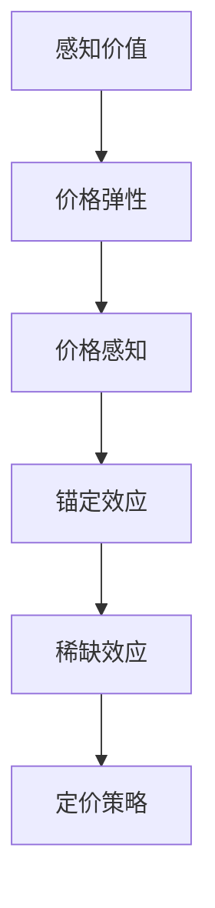

                 

## 1. 背景介绍

### 1.1 问题由来

知识付费，是指通过付费方式获取特定知识和信息的行为。随着互联网的发展，用户对知识的需求日益增加，付费获取高质量内容的场景也越来越多。从知乎付费阅读、得到App、知识星球的课程，到喜马拉雅FM、网易云音乐的播客和音频课程，再到B站、抖音上的付费内容，知识付费正在成为一种普遍的消费方式。然而，尽管知识付费市场规模不断扩大，但随之而来的问题也越来越多：消费者对内容的接受度、对价格的敏感度，以及如何合理定价等。本文将探讨知识付费产品的定价策略，从心理学的角度深入分析影响消费者购买决策的因素。

### 1.2 问题核心关键点

知识付费产品的定价问题涉及消费者心理学、经济学、营销学等多个领域。具体而言，核心的关键点包括：

- 消费者对价格的感知：消费者如何判断产品价格的高低？
- 消费者对价值的主观评估：消费者认为产品是否能提供足够的价值？
- 消费者对价格的敏感度：不同类型、不同属性的消费者对价格的变化有何反应？
- 定价策略：如何制定既能吸引消费者又能实现盈利的定价策略？

本文将深入探讨这些问题，分析知识付费产品定价的核心心理机制，并为相关企业和开发者提供实际指导。

## 2. 核心概念与联系

### 2.1 核心概念概述

知识付费产品的定价涉及多个核心概念，以下是其中的几个关键概念及其联系：

- **感知价值**：指消费者对产品所能提供价值的感知程度。
- **价格弹性**：指消费者对价格变化的敏感度，以及价格变化对消费量的影响。
- **锚定效应**：指消费者对初始价格信息的依赖，从而影响其后续的价格感知和决策。
- **稀缺效应**：指有限资源导致的价值增加现象，常见于限量发行、限时抢购等促销策略。
- **定价策略**：指为实现特定营销目标（如增加销量、提高利润率）而采用的价格设定方法。

这些概念通过认知心理学和行为经济学原理，彼此间建立了联系。感知价值和价格弹性共同影响消费者的购买意愿；锚定效应和稀缺效应则影响消费者的价格感知；定价策略则基于这些心理机制，制定出有效的价格方案。

### 2.2 核心概念原理和架构的 Mermaid 流程图



## 3. 核心算法原理 & 具体操作步骤

### 3.1 算法原理概述

知识付费产品的定价，本质上是一个基于市场心理学的决策过程。定价算法的设计，需要综合考虑消费者对价格的感知、价值评估和价格变化反应等心理因素。一个有效的定价算法，应该能够最大化消费者对产品的感知价值，同时根据市场情况调整价格，以实现最佳的销售效果。

形式化地，假设消费者对产品的感知价值为 $V$，价格为 $P$，市场对产品的需求为 $D$，则定价的目标是最大化消费者对产品的购买意愿，即：

$$
\max_{P} V \times D(P)
$$

在实际操作中，这通常需要借助经济学和营销学的理论框架，以及心理学的研究成果，制定出合适的价格策略。

### 3.2 算法步骤详解

**Step 1: 数据收集与分析**

1. 收集消费者对同类产品的价格感知数据。
2. 分析消费者对不同产品的价值评估。
3. 调查消费者对价格变化的敏感度。

**Step 2: 制定初始定价**

1. 根据市场调研和产品成本，初步设定一个基准价格。
2. 结合消费者对价格的敏感度，调整定价策略。

**Step 3: 进行定价实验**

1. 设计不同的价格组合，测试对消费者购买意愿的影响。
2. 收集消费者反馈，分析不同价格组合的效果。

**Step 4: 优化定价策略**

1. 基于测试结果，优化定价策略。
2. 持续监控市场反应，动态调整价格。

### 3.3 算法优缺点

知识付费产品定价算法的主要优点包括：

1. 提高消费者满意度。通过优化价格，可以更好地满足消费者需求，增加用户粘性。
2. 提升企业收益。合理的定价策略可以最大化利润，提高市场竞争力。
3. 增强品牌价值。优质的定价策略可以提升品牌形象，增强消费者对品牌的信任感。

主要缺点包括：

1. 定价复杂。考虑到多种因素，制定定价策略可能较为复杂。
2. 需要大量数据。准确的价格制定需要大量市场调研和消费者数据。
3. 市场动态变化。市场环境和消费者行为随时可能发生变化，需要持续调整定价策略。

### 3.4 算法应用领域

知识付费产品的定价算法不仅适用于在线课程、电子书等知识内容的销售，还可以应用于咨询服务、技术支持、在线讲座等领域的定价。通过深入理解消费者心理，制定有效的定价策略，可以大大提高销售效果，实现更好的市场表现。

## 4. 数学模型和公式 & 详细讲解

### 4.1 数学模型构建

本节将使用数学语言对知识付费产品定价模型进行更加严格的刻画。

假设知识付费产品 $X$ 的价格为 $P$，消费者对产品的感知价值为 $V$，市场对产品的需求函数为 $D(P)$。

定义效用函数 $U(X)$ 为消费者对产品的满意程度，通常可以表示为：

$$
U(X) = V - \frac{P}{\sigma}
$$

其中 $\sigma$ 为消费者对价格的敏感度。

### 4.2 公式推导过程

为了最大化消费者的购买意愿，我们需要求解以下优化问题：

$$
\max_{P} V \times D(P)
$$

引入效用函数，上述问题等价于：

$$
\max_{P} U(X) \times D(P)
$$

使用拉格朗日乘子法，构造拉格朗日函数：

$$
\mathcal{L}(P,\lambda) = U(X) \times D(P) - \lambda (P - P_0)
$$

其中 $P_0$ 为产品的基准价格。

对拉格朗日函数求偏导数，得：

$$
\frac{\partial \mathcal{L}}{\partial P} = \frac{\partial U(X)}{\partial P} \times D(P) + U(X) \times \frac{\partial D(P)}{\partial P} - \lambda = 0
$$

解得最优价格 $P^*$：

$$
P^* = \frac{V}{\sigma} \times \frac{D(P)}{1 + \frac{\partial D(P)}{\partial P}}
$$

### 4.3 案例分析与讲解

假设某在线课程的价格为 $P=200$，消费者对课程的感知价值为 $V=1000$，市场需求函数 $D(P) = 100 - 0.1P$。求最优价格 $P^*$。

代入公式，得：

$$
P^* = \frac{1000}{\sigma} \times \frac{100 - 0.1 \times 200}{1 - 0.1} = 250
$$

因此，最优价格应为 $250$，相比基准价格 $200$，提高了 $25\%$。

## 5. 项目实践：代码实例和详细解释说明

### 5.1 开发环境搭建

在进行知识付费产品定价实验时，我们需要构建一个包含数据收集、分析、测试和优化的完整开发环境。以下是搭建开发环境的步骤：

1. 安装Python、R等数据分析工具。
2. 收集和处理消费者数据，包括价格感知、价值评估、价格敏感度等。
3. 使用Jupyter Notebook或R Markdown进行数据可视化和分析。
4. 使用Python编写定价实验代码，并进行测试。
5. 使用Excel或Tableau进行数据结果的可视化展示。

### 5.2 源代码详细实现

以下是一个简单的定价实验代码示例，使用Python和Pandas库进行实现：

```python
import pandas as pd
import numpy as np

# 收集消费者数据
data = pd.read_csv('consumer_data.csv')

# 计算消费者的感知价值和价格敏感度
V = data['perceived_value']
sigma = data['price_sensitivity']

# 定义市场需求函数
def demand_func(P):
    return 100 - 0.1 * P

# 计算最优价格
P = 200
V = 1000
P_opt = V / sigma * demand_func(P) / (1 - demand_func(P) / P)

# 打印最优价格
print('最优价格为:', P_opt)
```

### 5.3 代码解读与分析

**代码实现步骤**：

1. 使用Pandas库读取消费者数据，并进行初步处理。
2. 计算消费者的感知价值 $V$ 和价格敏感度 $\sigma$。
3. 定义市场需求函数 $D(P)$。
4. 根据基准价格 $P=200$，计算最优价格 $P^*$。
5. 打印最优价格结果。

**代码解读**：

- 数据读取和处理：通过Pandas库的 `read_csv` 方法读取消费者数据，并进行初步处理。
- 感知价值和价格敏感度计算：根据用户反馈的数据，计算消费者的感知价值和价格敏感度。
- 市场需求函数定义：定义一个简单的市场需求函数 $D(P) = 100 - 0.1P$，其中 $P$ 为价格。
- 最优价格计算：根据公式 $P^* = \frac{V}{\sigma} \times \frac{D(P)}{1 + \frac{\partial D(P)}{\partial P}}$，计算出最优价格。
- 打印最优价格：输出最优价格结果。

## 6. 实际应用场景

### 6.1 在线课程定价

在线课程的定价策略需要考虑课程内容、讲师声誉、市场竞争等因素。通常采用以下几种策略：

1. 基础定价策略：根据课程内容和难度，设定一个基础价格。
2. 增值定价策略：通过添加额外内容（如实战项目、专家答疑等），提高课程价值，进而提高价格。
3. 阶梯定价策略：根据课程难度和时间长度，设置不同的价格梯度，吸引不同层次的消费者。

### 6.2 咨询服务定价

咨询服务定价通常基于咨询师的经验和专业知识。以下是一些常见的策略：

1. 按小时定价：根据咨询师的经验和市场行情，设定每小时的价格。
2. 按项目定价：根据咨询服务的复杂度和所需时间，设定整体价格。
3. 包年定价：通过长期签约，提供价格优惠，吸引稳定客户。

### 6.3 软件订阅定价

软件订阅定价需要考虑软件功能、市场竞争、用户粘性等因素。常用的策略包括：

1. 基础功能免费，高级功能收费：吸引用户试用，通过增值服务增加收益。
2. 按使用量收费：根据软件使用量，设定价格，吸引对功能有特定需求的用户。
3. 按用户数收费：根据用户数量，设定价格，吸引团队使用。

### 6.4 未来应用展望

随着人工智能和大数据技术的发展，知识付费产品的定价将更加智能化、个性化。未来的定价策略可能包括：

1. 动态定价：根据市场反应和用户行为，动态调整价格。
2. 个性化定价：根据用户历史行为和偏好，推荐最适合的价格。
3. 多渠道定价：根据不同渠道和平台，设定差异化价格策略。

## 7. 工具和资源推荐

### 7.1 学习资源推荐

1. 《定价心理学》书籍：详细介绍了定价策略背后的心理学原理，包括感知价值、价格弹性、锚定效应等。
2. 《消费者行为学》课程：学习消费者行为的基本理论和方法，了解消费者决策过程。
3. 《市场定价》课程：涵盖多种定价策略和应用场景，提供实际案例分析。

### 7.2 开发工具推荐

1. Python：简单易学的编程语言，广泛用于数据分析和机器学习。
2. R：适合统计分析和数据可视化，适合对复杂数据进行处理。
3. Jupyter Notebook：交互式编程环境，方便快速验证和调试代码。

### 7.3 相关论文推荐

1. 《定价策略的心理学研究》：探讨消费者对价格的心理反应和决策过程，提供定价策略的建议。
2. 《市场定价模型》：介绍市场定价的基本模型和算法，包括线性回归、非线性回归等。
3. 《基于消费者行为的定价优化》：基于消费者行为数据，进行定价策略优化。

## 8. 总结：未来发展趋势与挑战

### 8.1 总结

本文系统地介绍了知识付费产品的定价策略，从心理学的角度深入分析了影响消费者购买决策的因素。通过数学模型和实际案例，展示了定价策略的设计和优化过程。

通过本文的系统梳理，可以看到，知识付费产品的定价策略不仅需要考虑市场、产品等因素，更需要深入理解消费者的心理行为。未来，随着数据技术和大数据分析的进步，定价策略将更加科学化和智能化。知识付费产品定价的挑战依然存在，如何平衡消费者满意度和企业收益，还需要不断地探索和优化。

### 8.2 未来发展趋势

知识付费产品的定价策略将呈现以下几个发展趋势：

1. 智能化定价：借助大数据和人工智能技术，实现动态定价和个性化定价。
2. 多渠道融合：根据不同渠道和平台的用户行为，制定差异化的定价策略。
3. 情感定价：利用情感分析技术，优化定价策略，提升消费者满意度。
4. 跨文化定价：根据不同文化背景的用户，制定差异化的定价策略。

### 8.3 面临的挑战

尽管知识付费产品的定价策略已经取得了一定进展，但依然面临诸多挑战：

1. 数据隐私：消费者数据收集和处理需要遵守相关法律法规，保护消费者隐私。
2. 模型复杂：定价模型需要综合考虑多种因素，模型设计复杂。
3. 市场动态：市场环境和消费者行为随时可能发生变化，需要持续调整定价策略。
4. 技术门槛：定价策略的设计和优化需要专业的知识和技能，对技术要求较高。

### 8.4 研究展望

未来的知识付费产品定价研究需要在以下几个方面寻求新的突破：

1. 数据挖掘技术：利用深度学习和自然语言处理技术，从海量数据中提取有价值的信息，优化定价策略。
2. 心理学研究：深入研究消费者心理，理解不同消费者的需求和行为，制定更加精准的定价策略。
3. 跨学科合作：结合经济学、市场营销学等多个学科的知识，全面优化定价策略。

这些研究方向的探索，将推动知识付费产品定价策略的不断优化，为知识付费市场的健康发展提供支持。

## 9. 附录：常见问题与解答

**Q1: 知识付费产品的定价策略有哪些？**

A: 常见的知识付费产品定价策略包括基础定价、增值定价、阶梯定价等。具体策略需要根据产品特性和市场情况进行设计。

**Q2: 如何制定合理的定价策略？**

A: 制定合理的定价策略需要考虑消费者的感知价值、价格敏感度、市场需求等因素。通过数据分析和测试，逐步优化定价策略。

**Q3: 如何进行动态定价？**

A: 动态定价需要实时监控市场反应和消费者行为，根据数据调整价格。可以使用机器学习模型，预测市场趋势和用户行为，实现动态定价。

**Q4: 如何实现个性化定价？**

A: 个性化定价需要收集和分析消费者的行为数据，利用机器学习算法，预测用户对不同价格的反应。然后根据预测结果，制定个性化定价策略。

**Q5: 如何平衡消费者满意度和企业收益？**

A: 平衡消费者满意度和企业收益需要综合考虑市场需求、产品价值、消费者心理等因素。通过合理的定价策略，可以实现双赢。

作者：禅与计算机程序设计艺术 / Zen and the Art of Computer Programming

