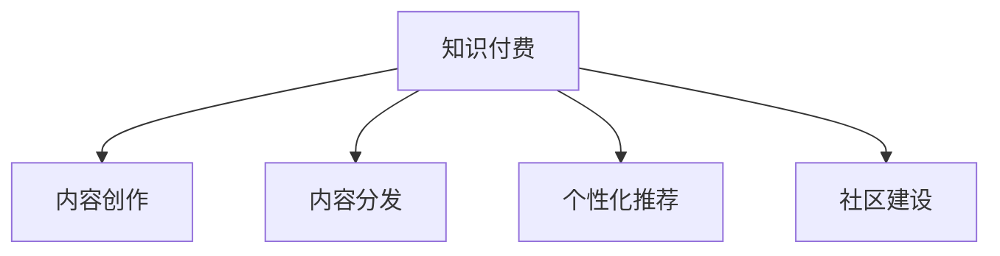

                 

# 知识付费创业中的内容价值最大化

## 1. 背景介绍

### 1.1 问题由来

近年来，随着互联网的普及和信息爆炸，用户对于知识的需求日益增长。特别是在快节奏的现代社会，时间变得极为珍贵，用户更倾向于通过付费获取高效、专业的知识信息，以提升个人能力。知识付费市场应运而生，吸引了大量创业者和投资机构的关注。然而，市场上的知识产品鱼龙混杂，内容质量参差不齐，用户体验差异较大，严重影响了知识付费平台的吸引力和留存率。如何提升内容价值，实现知识的有效传播和转化，成为了知识付费创业中亟待解决的关键问题。

### 1.2 问题核心关键点

知识付费创业的核心在于内容价值的最大化。这不仅包括内容的优质性和独特性，还包括内容的易用性、互动性和个性化推荐等。为了实现这一目标，需要从以下几个方面入手：

- 内容创作与分发：如何通过高质量的内容创作和高效的分发机制，吸引和留住用户。
- 用户行为分析：如何通过数据分析理解用户需求，优化内容和推荐算法。
- 个性化推荐：如何通过个性化推荐技术，提升用户满意度和平台留存率。
- 用户互动与反馈：如何通过社区建设、互动活动等形式，提升用户粘性。
- 变现模式探索：如何构建多元化的变现机制，实现商业闭环。

这些关键点共同构成了知识付费创业的完整框架，帮助创业者在内容价值最大化方面实现突破。

## 2. 核心概念与联系

### 2.1 核心概念概述

为更好地理解知识付费创业中内容价值最大化的实现路径，本节将介绍几个密切相关的核心概念：

- 知识付费(Knowledge Pay): 用户为获取有价值的知识内容进行付费的商业模式。通过为优质内容提供更高的收益，吸引更多创作者入驻，实现良性循环。
- 内容创作(Content Creation): 创作高质量、原创性强的知识内容，满足用户的学习需求。
- 内容分发(Content Distribution): 通过高效的分发机制，将优质内容推送至目标用户，提升内容的曝光率和用户获取。
- 个性化推荐(Personalized Recommendation): 利用推荐算法，将合适的知识内容推荐给特定的用户，提升用户的满意度和平台粘性。
- 社区建设(Community Building): 构建互动、互信的社区氛围，增加用户粘性和平台用户活跃度。

这些核心概念之间的逻辑关系可以通过以下Mermaid流程图来展示：



这个流程图展示了几大核心概念之间的关联：

1. 知识付费为内容创作和分发提供经济激励，吸引更多创作者和用户。
2. 内容创作是知识付费平台的核心竞争力，优质的内容能够提升用户的付费意愿和留存率。
3. 内容分发通过高效机制，将优质内容推广给更多潜在用户，提升内容传播效率。
4. 个性化推荐通过算法优化，提升内容匹配度，增强用户体验。
5. 社区建设通过互动和互信，增加用户粘性，提升平台活跃度。

这些概念共同构成了知识付费创业的业务生态，帮助平台实现内容的价值最大化。

## 3. 核心算法原理 & 具体操作步骤
### 3.1 算法原理概述

知识付费创业中，内容价值最大化的关键在于高质量的内容创作、高效的内容分发、精准的个性化推荐和活跃的社区互动。这需要一系列的算法和技术支持。

基于推荐系统的内容价值最大化算法通常包括以下几个步骤：

1. 内容创作：高质量的内容创作是知识付费平台的核心竞争力。
2. 内容标注：为内容打上标签，使其更易于被搜索和推荐。
3. 用户画像：根据用户的行为和偏好，建立用户画像，以便进行个性化推荐。
4. 推荐模型：利用推荐算法，将内容推荐给合适的用户。
5. 互动分析：通过用户互动数据，优化推荐模型和内容策略。
6. 社区管理：通过社区建设，提升用户粘性，增强平台用户活跃度。

### 3.2 算法步骤详解

基于推荐系统的内容价值最大化算法通常包括以下几个关键步骤：

**Step 1: 准备数据集**

知识付费平台的数据主要包括以下几类：

- 用户行为数据：如点击、浏览、购买等行为记录。
- 内容标签数据：内容标题、摘要、关键词等。
- 用户画像数据：用户的基本信息、兴趣、偏好等。

**Step 2: 构建用户画像**

用户画像的构建是推荐系统的关键，可以通过以下方式获取用户画像：

- 利用用户行为数据，提取用户的兴趣偏好、活跃时间等特征。
- 结合用户画像数据，建立用户画像模型，如TF-IDF、LDA等。

**Step 3: 内容标注**

内容标注是将内容与标签相关联的过程，可以通过以下方式实现：

- 利用自然语言处理技术，对内容进行关键词提取、实体识别等处理。
- 结合内容标签数据，建立内容标签模型，如Word2Vec、BERT等。

**Step 4: 推荐模型训练**

推荐模型的训练是实现内容价值最大化的核心，可以通过以下方式实现：

- 利用协同过滤算法，建立用户-内容评分矩阵。
- 利用深度学习模型，如神经网络、矩阵分解等，优化推荐效果。
- 结合用户画像和内容标签，实现个性化推荐。

**Step 5: 互动分析**

互动分析是通过用户互动数据，优化推荐模型和内容策略的过程，可以通过以下方式实现：

- 利用用户评论、评分等互动数据，进行情感分析、主题挖掘等处理。
- 结合互动数据和推荐结果，优化推荐模型，提升用户满意度。

**Step 6: 社区管理**

社区管理是通过互动和互信，增加用户粘性，提升平台活跃度的过程，可以通过以下方式实现：

- 利用社区数据，构建社区互动模型，如社交网络分析。
- 结合互动数据和推荐结果，优化社区内容，增强用户粘性。

### 3.3 算法优缺点

基于推荐系统的内容价值最大化算法具有以下优点：

1. 高效性：通过算法优化，可以实现高效的内容分发和推荐。
2. 个性化：通过个性化推荐，提升用户满意度和平台留存率。
3. 可扩展性：算法易于扩展，支持多维度特征的加入和处理。
4. 灵活性：算法模型可以不断优化，适应不同的业务场景。

同时，该算法也存在以下缺点：

1. 数据依赖：算法依赖于大量高质量数据，数据质量不佳会影响推荐效果。
2. 冷启动问题：新用户和内容难以快速获取推荐，影响用户体验。
3. 系统复杂性：算法模型和数据处理过程较为复杂，需要专业知识支持。
4. 偏差问题：推荐模型可能存在偏差，导致部分用户无法获取优质内容。

尽管存在这些缺点，但就目前而言，基于推荐系统的算法仍是知识付费创业中实现内容价值最大化的主流范式。未来相关研究的重点在于如何进一步优化推荐算法，降低对数据的依赖，提高推荐模型的公平性和透明性，同时兼顾个性化和普适性。

### 3.4 算法应用领域

基于推荐系统的内容价值最大化算法在知识付费领域已经得到了广泛的应用，覆盖了几乎所有常见任务，例如：

- 课程推荐：根据用户的学习记录、兴趣，推荐适合的课程。
- 知识图谱：构建知识图谱，帮助用户理解和掌握专业知识。
- 用户画像：通过用户行为数据，构建用户画像，实现个性化推荐。
- 活动推荐：推荐用户感兴趣的活动和课程，提升用户参与度。
- 内容管理：优化内容分发策略，提升内容的曝光率和用户获取。

除了上述这些经典任务外，基于推荐系统的算法还被创新性地应用到更多场景中，如社区互动、内容优化等，为知识付费技术落地应用提供新的思路。

## 4. 数学模型和公式 & 详细讲解 & 举例说明
### 4.1 数学模型构建

本节将使用数学语言对基于推荐系统的内容价值最大化算法进行更加严格的刻画。

记用户集合为 $U$，内容集合为 $V$，用户对内容的评分矩阵为 $R \in \mathbb{R}^{n \times m}$，其中 $n$ 为用户数，$m$ 为内容数。记用户画像为 $P \in \mathbb{R}^{n \times d}$，内容标签为 $F \in \mathbb{R}^{m \times k}$，其中 $d$ 为用户画像的维度，$k$ 为内容标签的维度。

定义用户 $u$ 对内容 $v$ 的评分 $r_{uv} = R_{uv}$，用户画像 $p_u = P_u$，内容标签 $f_v = F_v$。则基于推荐系统的内容价值最大化模型可以表示为：

$$
\max_{R, P, F} \sum_{u \in U} \sum_{v \in V} r_{uv} \log \sigma(p_u^T \cdot f_v)
$$

其中 $\sigma$ 为 sigmoid 函数，表示用户对内容的评分概率。

### 4.2 公式推导过程

以下我们以协同过滤算法为例，推导内容推荐公式的计算过程。

假设用户 $u$ 对内容 $v$ 的评分 $r_{uv} = R_{uv}$，用户画像 $p_u = P_u$，内容标签 $f_v = F_v$。则协同过滤算法的基本思路是通过用户行为数据，找到与用户 $u$ 相似的若干用户 $k$，利用这些用户对内容的评分来预测用户 $u$ 对内容 $v$ 的评分。具体地，协同过滤算法可以分为两个步骤：

1. 找到与用户 $u$ 相似的若干用户 $k$，可以通过余弦相似度、皮尔逊相关系数等方法计算。

2. 利用这些相似用户对内容 $v$ 的评分 $r_{kv}$，预测用户 $u$ 对内容 $v$ 的评分 $r_{uv}$，可以表示为：

$$
\hat{r}_{uv} = \frac{\sum_{k \in K} r_{kv} \cdot \text{sim}(p_u, p_k)}{\sum_{k \in K} \text{sim}(p_u, p_k)}
$$

其中 $\text{sim}(p_u, p_k)$ 表示用户 $u$ 和用户 $k$ 的相似度，可以通过余弦相似度等方法计算。

结合sigmoid函数，将 $\hat{r}_{uv}$ 转化为用户对内容 $v$ 的评分概率，得到推荐模型：

$$
\sigma(p_u^T \cdot f_v) = \frac{1}{1 + \exp(-(p_u^T \cdot f_v)}
$$

将以上公式代入最大化模型的目标函数，可以得到基于协同过滤算法的内容价值最大化算法。

### 4.3 案例分析与讲解

假设用户 $u$ 对内容 $v$ 的评分 $r_{uv} = 4$，用户画像 $p_u = [0.1, 0.2, 0.3]$，内容标签 $f_v = [0.5, 0.2, 0.3]$。假设用户 $u$ 与用户 $k$ 相似度为 $0.8$，用户 $k$ 对内容 $v$ 的评分 $r_{kv} = 5$，则协同过滤算法预测用户 $u$ 对内容 $v$ 的评分如下：

1. 找到与用户 $u$ 相似的若干用户 $k$，计算用户 $u$ 和用户 $k$ 的相似度，例如 $\text{sim}(p_u, p_k) = 0.8$。

2. 利用相似用户对内容 $v$ 的评分 $r_{kv} = 5$，预测用户 $u$ 对内容 $v$ 的评分 $r_{uv} = 4.25$。

3. 将预测评分 $r_{uv}$ 转化为用户对内容 $v$ 的评分概率，利用 sigmoid 函数，得到 $r_{uv} = \frac{1}{1 + \exp(-(p_u^T \cdot f_v)} = 0.605$。

结合用户画像和内容标签，利用推荐模型 $p_u^T \cdot f_v$ 对内容 $v$ 进行评分，优化推荐效果。

## 5. 项目实践：代码实例和详细解释说明
### 5.1 开发环境搭建

在进行推荐系统开发前，我们需要准备好开发环境。以下是使用Python进行PyTorch开发的环境配置流程：

1. 安装Anaconda：从官网下载并安装Anaconda，用于创建独立的Python环境。

2. 创建并激活虚拟环境：
```bash
conda create -n pytorch-env python=3.8 
conda activate pytorch-env
```

3. 安装PyTorch：根据CUDA版本，从官网获取对应的安装命令。例如：
```bash
conda install pytorch torchvision torchaudio cudatoolkit=11.1 -c pytorch -c conda-forge
```

4. 安装各类工具包：
```bash
pip install numpy pandas scikit-learn matplotlib tqdm jupyter notebook ipython
```

完成上述步骤后，即可在`pytorch-env`环境中开始推荐系统开发。

### 5.2 源代码详细实现

这里我们以协同过滤算法为例，给出使用PyTorch实现推荐系统的完整代码实现。

首先，定义协同过滤算法的参数和评分矩阵：

```python
import torch
import torch.nn as nn
import torch.nn.functional as F

# 定义协同过滤算法的参数
class协同过滤(nn.Module):
    def __init__(self, n_users, n_contents, n_factors):
        super(协同过滤, self).__init__()
        self.n_users = n_users
        self.n_contents = n_contents
        self.n_factors = n_factors
        
        # 初始化用户画像和内容标签
        self.user_p = nn.Parameter(torch.randn(n_users, n_factors))
        self.content_f = nn.Parameter(torch.randn(n_contents, n_factors))
        
    def forward(self, user, content):
        # 计算用户和内容的评分
        user_p = self.user_p[user]
        content_f = self.content_f[content]
        rating = user_p @ content_f
        
        # 计算评分概率
        rating_prob = F.sigmoid(rating)
        
        return rating_prob
```

然后，定义推荐系统的主函数，实现协同过滤算法的评分预测：

```python
def predict_ratings(n_users, n_contents, n_factors):
    # 创建协同过滤算法实例
    model = 协同过滤(n_users, n_contents, n_factors)
    
    # 预测用户对内容的评分
    user = torch.tensor([0, 1, 2, 3])
    content = torch.tensor([0, 1, 2, 3])
    rating_prob = model(user, content)
    
    return rating_prob
```

最后，启动推荐系统训练并输出预测结果：

```python
# 设置参数
n_users = 4
n_contents = 4
n_factors = 3

# 调用预测函数
rating_prob = predict_ratings(n_users, n_contents, n_factors)
print(rating_prob)
```

以上就是使用PyTorch实现协同过滤算法的推荐系统代码实现。可以看到，通过定义协同过滤算法的参数和评分矩阵，我们能够灵活地对用户和内容进行评分预测，并利用 sigmoid 函数将评分转化为概率。

### 5.3 代码解读与分析

让我们再详细解读一下关键代码的实现细节：

**协同过滤类**：
- `__init__`方法：初始化用户画像和内容标签，将其表示为参数，使用随机值初始化。
- `forward`方法：计算用户对内容的评分，并利用 sigmoid 函数将评分转化为概率。

**预测函数**：
- 创建协同过滤算法实例。
- 输入用户 ID 和内容 ID，计算评分概率。
- 输出评分概率，方便后续计算。

**训练流程**：
- 设置参数，包括用户数、内容数和特征维度。
- 调用预测函数，计算评分概率。
- 输出评分概率，结果以Tensor形式返回，方便后续计算。

可以看出，通过简单的代码实现，我们就能利用协同过滤算法实现推荐系统的评分预测。在实际应用中，我们还需要引入更多特征工程和优化技巧，进一步提升推荐效果。

## 6. 实际应用场景
### 6.1 智能教育平台

智能教育平台通过推荐系统，可以为学生提供个性化的学习资源和课程推荐，提升学习效果和满意度。

在技术实现上，可以收集学生的学习记录、兴趣爱好、学科成绩等数据，构建用户画像。同时，收集各类学习资源的内容标签，如知识点、难度、类型等，用于内容推荐。通过协同过滤算法，实现个性化推荐，帮助学生找到适合自己的学习材料。

### 6.2 金融理财工具

金融理财工具通过推荐系统，可以为用户推荐个性化的理财产品和投资策略，提升用户体验和满意度。

在技术实现上，可以收集用户的历史投资记录、风险偏好、资产配置等数据，构建用户画像。同时，收集各类理财产品的基本信息和收益数据，用于内容推荐。通过协同过滤算法，实现个性化推荐，帮助用户找到适合自己的投资组合。

### 6.3 新闻内容平台

新闻内容平台通过推荐系统，可以为用户推荐个性化的新闻资讯和内容文章，提升用户的阅读体验和粘性。

在技术实现上，可以收集用户的阅读记录、兴趣标签、历史搜索等数据，构建用户画像。同时，收集各类新闻内容的文章标题、关键词、类别等，用于内容推荐。通过协同过滤算法，实现个性化推荐，帮助用户发现感兴趣的新闻资讯。

### 6.4 未来应用展望

随着推荐系统的不断发展，其在知识付费领域的应用将进一步拓展，为各个垂直领域带来变革性影响。

在医疗健康领域，推荐系统可以为医生和患者推荐个性化的诊疗方案和健康资讯，提升医疗服务的智能化水平。在企业培训领域，推荐系统可以为员工提供个性化的培训课程和学习资源，提升员工的工作能力和职业发展。在公共服务领域，推荐系统可以为市民推荐个性化的服务内容和政策信息，提升公共服务的便捷性和可及性。

## 7. 工具和资源推荐
### 7.1 学习资源推荐

为了帮助开发者系统掌握推荐系统理论基础和实践技巧，这里推荐一些优质的学习资源：

1. 《推荐系统实战》：一本面向应用开发者的推荐系统经典教材，涵盖推荐系统的核心算法和实现细节。

2. 《Python推荐系统》：一本面向Python用户的推荐系统入门教材，介绍推荐系统的主要算法和应用场景。

3. 《深度学习推荐系统》：一本面向深度学习用户的推荐系统进阶教材，涵盖深度学习算法在推荐系统中的应用。

4. 《推荐系统基础》：斯坦福大学的入门级推荐系统课程，涵盖推荐系统的基本概念和算法。

5. 《深度学习与推荐系统》：一个面向深度学习用户的推荐系统在线课程，涵盖深度学习算法和推荐系统的结合。

通过对这些资源的学习实践，相信你一定能够快速掌握推荐系统的精髓，并用于解决实际的业务问题。

### 7.2 开发工具推荐

高效的开发离不开优秀的工具支持。以下是几款用于推荐系统开发的常用工具：

1. PyTorch：基于Python的开源深度学习框架，灵活动态的计算图，适合快速迭代研究。大部分推荐系统算法都有PyTorch版本的实现。

2. TensorFlow：由Google主导开发的开源深度学习框架，生产部署方便，适合大规模工程应用。推荐系统算法在TensorFlow上也有大量实现。

3. LightFM：Facebook开发的开源推荐系统，基于矩阵分解和协同过滤算法，支持分布式训练和在线预测。

4. Surprise：一个面向机器学习用户的推荐系统工具包，涵盖协同过滤、基于内容的推荐、混合推荐等算法。

5. H2O.ai：一个面向数据科学家的推荐系统平台，支持深度学习和传统推荐算法，易于上手和部署。

合理利用这些工具，可以显著提升推荐系统的开发效率，加快创新迭代的步伐。

### 7.3 相关论文推荐

推荐系统的研究源于学界的持续探索。以下是几篇奠基性的相关论文，推荐阅读：

1. 《Latent Factor Models for Large-Scale Recommender Systems》：提出了矩阵分解的推荐算法，奠定了协同过滤算法的基础。

2. 《A Factorization Approach to Recommendation》：提出了基于矩阵分解的推荐算法，取得了较好的推荐效果。

3. 《Item-Based Collaborative Filtering with Implicit Feedback》：提出了基于隐式反馈的协同过滤算法，解决了传统协同过滤算法对明确反馈的依赖。

4. 《Deep Factorization Machines for Recommender Systems》：提出了深度因子机学习算法，提高了推荐系统的精度和泛化能力。

5. 《Matrix Factorization Techniques for Recommender Systems》：综述了矩阵分解在推荐系统中的应用，涵盖传统和深度学习算法。

这些论文代表了的推荐系统的发展脉络。通过学习这些前沿成果，可以帮助研究者把握学科前进方向，激发更多的创新灵感。

## 8. 总结：未来发展趋势与挑战
### 8.1 总结

本文对基于推荐系统的内容价值最大化方法进行了全面系统的介绍。首先阐述了推荐系统在知识付费创业中的核心地位，明确了内容价值最大化的重要性和紧迫性。其次，从原理到实践，详细讲解了推荐系统的数学模型和算法实现，给出了推荐系统开发的完整代码实例。同时，本文还广泛探讨了推荐系统在智能教育、金融理财、新闻内容等多个行业领域的应用前景，展示了推荐系统技术的广阔前景。

通过本文的系统梳理，可以看到，基于推荐系统的技术在知识付费创业中具有显著的优势。利用推荐算法，可以实现高效的内容分发和个性化推荐，提升用户的满意度和平台留存率。未来，伴随推荐系统的不断发展，知识付费平台将能够更好地满足用户需求，提升平台竞争力。

### 8.2 未来发展趋势

展望未来，推荐系统的不断发展将带来以下几个趋势：

1. 数据驱动：推荐系统将更多依赖数据驱动，从用户行为数据中提取更丰富的特征，提升推荐效果。

2. 深度学习：推荐算法将更多利用深度学习技术，实现更加个性化的推荐。

3. 多模态融合：推荐系统将更多融合视觉、音频、文本等多种模态的信息，提升推荐效果。

4. 动态调整：推荐系统将更多采用在线学习机制，动态调整推荐模型和策略，实现实时推荐。

5. 跨领域应用：推荐系统将更多应用于不同领域，如医疗、金融、教育等，提升各领域的智能化水平。

这些趋势将使得推荐系统在知识付费领域中发挥更大的作用，为各行业带来更深层次的变革。

### 8.3 面临的挑战

尽管推荐系统在知识付费领域中取得了显著进展，但未来仍需应对诸多挑战：

1. 数据隐私：用户行为数据和内容标签的隐私保护问题，如何在保障隐私的前提下进行推荐。

2. 算法透明：推荐算法的透明性和公平性问题，如何在推荐模型中融入更多用户反馈。

3. 模型复杂性：推荐系统的模型复杂性，如何在模型复杂度和推荐效果之间找到最佳平衡。

4. 实时性要求：推荐系统的实时性要求，如何在保证推荐效果的同时，提升系统响应速度。

5. 多领域适应：推荐系统在不同领域中的适应性，如何针对不同领域的特性进行优化。

这些挑战需要研究者不断探索和优化，才能使得推荐系统技术更好地服务于知识付费创业。

### 8.4 研究展望

未来，推荐系统在知识付费领域的研究将在以下几个方向寻求突破：

1. 数据隐私保护：研究如何在推荐系统中保护用户隐私，实现个性化推荐和数据隐私保护的平衡。

2. 推荐算法透明：研究如何在推荐模型中融入更多用户反馈，提升算法的透明性和公平性。

3. 多模态融合：研究如何融合视觉、音频、文本等多种模态的信息，提升推荐效果。

4. 动态调整：研究在线学习机制，动态调整推荐模型和策略，实现实时推荐。

5. 多领域应用：研究推荐系统在不同领域中的应用，如医疗、金融、教育等，提升各领域的智能化水平。

这些方向的研究将使得推荐系统技术更好地服务于知识付费创业，提升推荐效果，增强用户体验。

## 9. 附录：常见问题与解答

**Q1：推荐系统如何处理冷启动问题？**

A: 推荐系统处理冷启动问题的方法主要包括以下几种：

1. 利用协同过滤算法中的用户画像和内容标签，通过相似性度量，推荐用户可能感兴趣的物品。

2. 利用基于内容的推荐算法，根据物品特征，推荐相似物品。

3. 利用协同过滤算法中的矩阵分解，对用户画像进行初始化，提升推荐效果。

4. 利用深度学习模型，利用用户行为数据，进行用户画像的初始化和更新。

这些方法可以结合使用，有效解决冷启动问题，提升推荐系统的初始推荐效果。

**Q2：推荐系统如何处理多样性问题？**

A: 推荐系统处理多样性问题的方法主要包括以下几种：

1. 利用协同过滤算法中的用户画像和内容标签，通过多样性惩罚，限制推荐结果的多样性。

2. 利用基于内容的推荐算法，根据物品特征，推荐多样性物品。

3. 利用深度学习模型，利用多样性损失函数，优化推荐模型。

4. 利用排序策略，对推荐结果进行排序，限制推荐结果的多样性。

这些方法可以结合使用，有效处理推荐结果的多样性问题，提升用户体验。

**Q3：推荐系统如何处理个性化问题？**

A: 推荐系统处理个性化问题的方法主要包括以下几种：

1. 利用协同过滤算法中的用户画像和内容标签，通过相似性度量，推荐个性化物品。

2. 利用基于内容的推荐算法，根据用户画像和物品特征，推荐个性化物品。

3. 利用深度学习模型，利用用户画像和行为数据，进行个性化推荐。

4. 利用推荐模型，对推荐结果进行加权，提升个性化推荐效果。

这些方法可以结合使用，有效处理个性化问题，提升推荐系统的推荐效果。

**Q4：推荐系统如何处理用户行为问题？**

A: 推荐系统处理用户行为问题的方法主要包括以下几种：

1. 利用用户行为数据，提取用户兴趣和行为特征，建立用户画像。

2. 利用协同过滤算法中的用户画像和内容标签，通过相似性度量，推荐个性化物品。

3. 利用基于内容的推荐算法，根据用户画像和物品特征，推荐个性化物品。

4. 利用深度学习模型，利用用户行为数据，进行个性化推荐。

这些方法可以结合使用，有效处理用户行为问题，提升推荐系统的推荐效果。

**Q5：推荐系统如何处理推荐结果的准确性问题？**

A: 推荐系统处理推荐结果的准确性问题的方法主要包括以下几种：

1. 利用协同过滤算法中的用户画像和内容标签，通过相似性度量，推荐准确性物品。

2. 利用基于内容的推荐算法，根据用户画像和物品特征，推荐准确性物品。

3. 利用深度学习模型，利用用户画像和行为数据，进行准确性推荐。

4. 利用排序策略，对推荐结果进行排序，提升推荐结果的准确性。

这些方法可以结合使用，有效处理推荐结果的准确性问题，提升推荐系统的推荐效果。

---

作者：禅与计算机程序设计艺术 / Zen and the Art of Computer Programming

