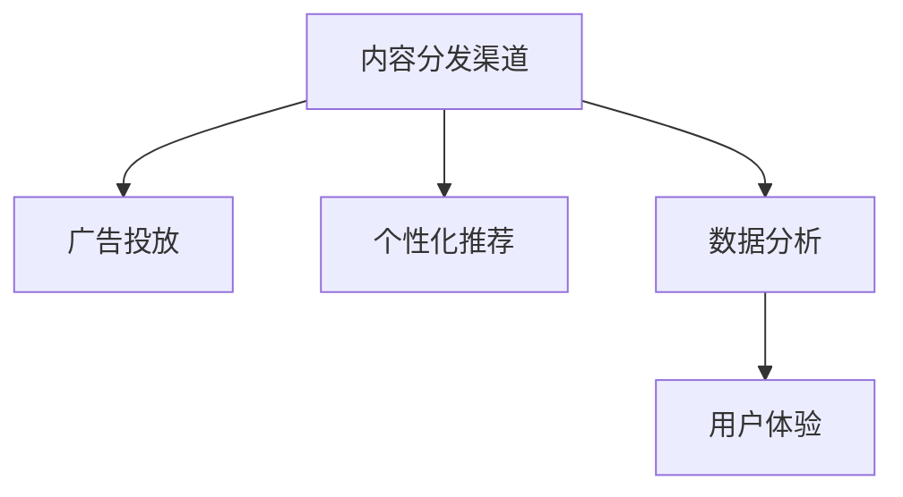

                 

## 1. 背景介绍

### 1.1 问题由来
随着知识付费的兴起，内容分发渠道的多样化成为知识创业的重要环节。内容分发渠道的效率直接影响到知识付费产品的流量获取、用户留存和商业变现能力。如何在有限的时间和资源下，优化内容分发渠道，提高渠道效率，成为知识创业者关注的焦点。

### 1.2 问题核心关键点
内容分发渠道优化是一个涉及广告投放、用户体验、数据分析等多个方面的综合性问题。核心关键点包括：

- **多渠道分发**：整合多个内容分发渠道，如微信公众号、APP、短视频平台、知识社区等，实现多平台联动。
- **广告精准投放**：基于用户画像和行为数据，进行精准的广告投放，提高广告转化率。
- **内容个性化推荐**：根据用户的历史行为和兴趣，提供个性化的内容推荐，提升用户体验和留存率。
- **数据分析优化**：通过数据分析工具，实时监测渠道表现，优化分发策略。
- **用户体验优化**：优化内容展示和交互设计，提升用户满意度和粘性。

### 1.3 问题研究意义
内容分发渠道优化不仅直接影响知识付费产品的流量和用户量，还关系到企业运营成本、收入增长和市场竞争力。优化内容分发渠道，能显著降低获客成本，提高用户转化率，最大化商业收益。同时，内容分发渠道的精细化管理，还能提升品牌形象和用户信任度。

## 2. 核心概念与联系

### 2.1 核心概念概述

为更好地理解内容分发渠道优化的技术框架，本节将介绍几个核心概念：

- **内容分发渠道**：指知识付费产品可利用的内容展示平台，如微信、知乎、B站等。
- **广告投放**：指通过在各大渠道上投放广告，吸引用户关注和下载。
- **个性化推荐**：指根据用户的行为和兴趣，推送个性化的内容，提高用户满意度。
- **数据分析**：指通过数据统计和分析，优化广告投放策略和内容推荐算法。
- **用户体验**：指通过优化界面设计、交互方式等，提升用户使用体验，增加用户粘性。

这些核心概念之间的逻辑关系可以通过以下Mermaid流程图来展示：



这个流程图展示出内容分发渠道优化的基本框架：

1. 内容分发渠道作为基础，通过广告投放、个性化推荐、数据分析、用户体验等多个维度进行优化。
2. 广告投放提高渠道流量，个性化推荐提升用户粘性，数据分析指导投放和推荐策略，用户体验增强用户满意度。
3. 这些优化措施相互配合，共同提升内容分发渠道的效率和效果。

## 3. 核心算法原理 & 具体操作步骤
### 3.1 算法原理概述

内容分发渠道优化涉及多个领域的算法和技术，主要包括广告投放优化算法、个性化推荐算法和用户体验优化算法。

- **广告投放优化算法**：通过机器学习模型预测用户点击率、转化率等指标，优化广告投放策略，提高广告转化率。
- **个性化推荐算法**：利用协同过滤、深度学习等方法，对用户进行个性化推荐，提升用户满意度。
- **用户体验优化算法**：通过用户行为分析，优化页面加载速度、页面交互方式等，提升用户体验。

### 3.2 算法步骤详解

#### 3.2.1 广告投放优化算法

广告投放优化算法主要包括以下几个步骤：

1. **数据采集与预处理**：采集用户点击、转化等行为数据，并进行预处理，如去重、归一化等。
2. **特征工程**：根据用户行为、广告特征等，构造用于模型训练的特征向量。
3. **模型训练与评估**：选择适合的模型，如逻辑回归、随机森林、深度神经网络等，进行训练和评估。
4. **投放策略优化**：根据模型预测结果，优化广告投放策略，如优化广告预算分配、调整广告投放位置等。
5. **实时调整**：实时监测广告效果，根据反馈进行策略调整。

#### 3.2.2 个性化推荐算法

个性化推荐算法主要包括以下几个步骤：

1. **数据采集与预处理**：采集用户行为数据，如浏览、点击、购买等行为。
2. **特征工程**：根据用户行为、物品属性等，构造用于模型训练的特征向量。
3. **模型训练与评估**：选择适合的模型，如协同过滤、深度学习等，进行训练和评估。
4. **推荐策略优化**：根据模型预测结果，优化推荐策略，如调整推荐算法、控制推荐内容多样性等。
5. **实时调整**：实时监测推荐效果，根据反馈进行策略调整。

#### 3.2.3 用户体验优化算法

用户体验优化算法主要包括以下几个步骤：

1. **用户行为分析**：采集用户行为数据，如页面加载时间、点击率等。
2. **性能优化**：优化页面加载速度、代码压缩、图片加载等，减少页面加载时间。
3. **交互优化**：优化页面交互方式，如简化操作流程、增加用户引导等，提升用户满意度。
4. **用户反馈收集**：收集用户反馈，如问卷调查、点击反馈等。
5. **迭代优化**：根据用户反馈，持续优化用户体验。

### 3.3 算法优缺点

广告投放优化算法的主要优点包括：

- 提高广告投放的精准度，降低广告成本。
- 通过多渠道联动，提高广告覆盖面和用户触达率。
- 动态调整广告策略，最大化广告效果。

其主要缺点包括：

- 对数据质量要求高，需要大量高质量的用户行为数据。
- 广告投放效果受平台规则影响较大。
- 存在一定的用户隐私风险。

个性化推荐算法的主要优点包括：

- 提升用户满意度，增加用户粘性。
- 根据用户行为数据，实现精准推荐。
- 提高内容转化率，增加商业收益。

其主要缺点包括：

- 对用户行为数据的依赖性较高。
- 算法复杂度较高，需要较多的计算资源。
- 存在一定的推荐偏差，导致用户满意度下降。

用户体验优化算法的主要优点包括：

- 提升用户满意度，增加用户粘性。
- 优化页面加载速度和交互方式，提高用户使用体验。
- 根据用户反馈进行迭代优化，实现持续改进。

其主要缺点包括：

- 用户体验优化需要持续投入技术资源，成本较高。
- 用户反馈数据收集和处理较为复杂。
- 用户体验优化效果存在一定滞后性。

### 3.4 算法应用领域

广告投放优化算法广泛应用于互联网广告投放、电子商务广告投放、移动应用推广等领域。

个性化推荐算法广泛应用于电商、视频、音乐、社交网络等多个行业。

用户体验优化算法广泛应用于网站、应用、移动端等平台，尤其在内容平台和社交平台应用广泛。

## 4. 数学模型和公式 & 详细讲解  
### 4.1 数学模型构建

本节将使用数学语言对广告投放优化算法、个性化推荐算法和用户体验优化算法进行更加严格的刻画。

#### 4.1.1 广告投放优化算法

假设用户行为数据为 $X$，广告特征数据为 $Y$，广告点击率为 $C$。广告投放优化算法的目标是最大化广告转化率，即：

$$
\max \sum_{i=1}^N C_i
$$

其中 $C_i$ 表示第 $i$ 次广告点击率。

广告点击率可以表示为：

$$
C_i = f(X_i, Y_i, \theta)
$$

其中 $\theta$ 为模型参数，包括特征工程生成的特征向量。

广告投放优化的目标函数可以表示为：

$$
\max \sum_{i=1}^N f(X_i, Y_i, \theta)
$$

通过优化算法求解上述目标函数，可以找到最优的模型参数 $\theta$，实现广告投放优化。

#### 4.1.2 个性化推荐算法

假设用户行为数据为 $X$，物品属性数据为 $Y$，物品推荐概率为 $P$。个性化推荐算法的目标是最大化推荐效果，即：

$$
\max \sum_{i=1}^N P_i
$$

其中 $P_i$ 表示第 $i$ 次物品推荐概率。

物品推荐概率可以表示为：

$$
P_i = g(X_i, Y_i, \theta)
$$

其中 $\theta$ 为模型参数，包括特征工程生成的特征向量。

个性化推荐优化的目标函数可以表示为：

$$
\max \sum_{i=1}^N g(X_i, Y_i, \theta)
$$

通过优化算法求解上述目标函数，可以找到最优的模型参数 $\theta$，实现个性化推荐。

#### 4.1.3 用户体验优化算法

假设用户行为数据为 $X$，用户体验评分 $S$。用户体验优化的目标是最大化用户满意度，即：

$$
\max \sum_{i=1}^N S_i
$$

其中 $S_i$ 表示第 $i$ 次用户体验评分。

用户体验评分可以表示为：

$$
S_i = h(X_i, \theta)
$$

其中 $\theta$ 为模型参数，包括用户行为数据。

用户体验优化的目标函数可以表示为：

$$
\max \sum_{i=1}^N h(X_i, \theta)
$$

通过优化算法求解上述目标函数，可以找到最优的模型参数 $\theta$，实现用户体验优化。

### 4.2 公式推导过程

以广告投放优化算法为例，进行公式推导。

假设广告投放的数据集为 $D = \{(X_i, Y_i, C_i)\}_{i=1}^N$，其中 $X_i$ 表示用户行为数据，$Y_i$ 表示广告特征数据，$C_i$ 表示广告点击率。

定义广告点击率的预测函数为 $f(X_i, Y_i, \theta)$，其中 $\theta$ 为模型参数。

广告投放优化的目标函数为：

$$
\max \sum_{i=1}^N C_i = \max \sum_{i=1}^N f(X_i, Y_i, \theta)
$$

假设 $f(X_i, Y_i, \theta)$ 为线性回归模型，则有：

$$
C_i = \theta_0 + \theta_1 X_{i,1} + \theta_2 X_{i,2} + \cdots + \theta_k X_{i,k} + \epsilon_i
$$

其中 $\epsilon_i$ 为随机误差项，$X_{i,j}$ 表示用户行为数据的第 $j$ 个特征。

通过最小二乘法求解上述线性回归模型，可以得到最优的模型参数 $\theta = (\theta_0, \theta_1, \cdots, \theta_k)$。

广告投放优化算法的步骤包括：

1. 数据采集与预处理：采集用户点击、转化等行为数据，并进行去重、归一化等预处理。
2. 特征工程：根据用户行为、广告特征等，构造用于模型训练的特征向量。
3. 模型训练与评估：选择线性回归模型，通过最小二乘法求解最优参数 $\theta$。
4. 投放策略优化：根据模型预测结果，优化广告投放策略，如优化广告预算分配、调整广告投放位置等。
5. 实时调整：实时监测广告效果，根据反馈进行策略调整。

### 4.3 案例分析与讲解

#### 4.3.1 广告投放优化算法案例

以某电商平台的广告投放优化为例。该平台包含服装、家居、美妆等多个品类，用户数据包括浏览历史、购买记录等。

**数据采集与预处理**：
- 采集用户点击、购买等行为数据，并进行去重、归一化等预处理。
- 构造广告点击率的预测函数 $f(X_i, Y_i, \theta)$，其中 $X_i$ 包括用户行为数据，$Y_i$ 包括广告特征数据。

**特征工程**：
- 根据用户行为、广告特征等，构造用于模型训练的特征向量。
- 例如，将用户历史购买记录、浏览时间等作为用户行为特征。
- 将广告类型、广告价格、广告投放时间等作为广告特征。

**模型训练与评估**：
- 选择线性回归模型，通过最小二乘法求解最优参数 $\theta$。
- 使用交叉验证等方法评估模型效果。

**投放策略优化**：
- 根据模型预测结果，优化广告投放策略。
- 例如，将高点击率的广告预算分配到点击率高的广告位。
- 调整广告投放位置，优化广告转化率。

**实时调整**：
- 实时监测广告效果，根据反馈进行策略调整。
- 例如，根据实时点击率反馈，动态调整广告预算和广告位。

#### 4.3.2 个性化推荐算法案例

以某在线视频平台的个性化推荐为例。该平台包含电影、电视剧、综艺等多个内容类别，用户数据包括观看历史、评分等。

**数据采集与预处理**：
- 采集用户观看历史、评分等行为数据，并进行去重、归一化等预处理。
- 构造物品推荐概率的预测函数 $g(X_i, Y_i, \theta)$，其中 $X_i$ 包括用户行为数据，$Y_i$ 包括物品属性数据。

**特征工程**：
- 根据用户行为、物品属性等，构造用于模型训练的特征向量。
- 例如，将用户历史观看记录、评分等作为用户行为特征。
- 将物品类型、时长、演员等作为物品属性特征。

**模型训练与评估**：
- 选择协同过滤模型，通过最小二乘法求解最优参数 $\theta$。
- 使用交叉验证等方法评估模型效果。

**推荐策略优化**：
- 根据模型预测结果，优化推荐策略。
- 例如，将用户评分高的内容优先推荐。
- 控制推荐内容多样性，避免推荐单一内容。

**实时调整**：
- 实时监测推荐效果，根据反馈进行策略调整。
- 例如，根据用户反馈，动态调整推荐算法和推荐内容。

#### 4.3.3 用户体验优化算法案例

以某在线教育平台的用户体验优化为例。该平台包含课程、视频、互动等多个内容形式，用户数据包括页面加载时间、交互方式等。

**用户行为分析**：
- 采集用户页面加载时间、点击率等行为数据，并进行分析。
- 优化页面加载速度，提高用户体验。

**性能优化**：
- 优化页面加载速度，如压缩图片、减少页面内容等。
- 使用缓存机制，提高页面加载速度。

**交互优化**：
- 优化页面交互方式，如简化操作流程、增加用户引导等。
- 使用动画效果，提高用户满意度。

**用户反馈收集**：
- 收集用户反馈，如问卷调查、点击反馈等。
- 分析用户反馈，了解用户体验不足。

**迭代优化**：
- 根据用户反馈，持续优化用户体验。
- 例如，根据用户反馈，优化页面加载速度和交互方式。

## 5. 项目实践：代码实例和详细解释说明
### 5.1 开发环境搭建

在进行内容分发渠道优化实践前，我们需要准备好开发环境。以下是使用Python进行TensorFlow开发的环境配置流程：

1. 安装Anaconda：从官网下载并安装Anaconda，用于创建独立的Python环境。

2. 创建并激活虚拟环境：
```bash
conda create -n tensorflow-env python=3.8 
conda activate tensorflow-env
```

3. 安装TensorFlow：根据CUDA版本，从官网获取对应的安装命令。例如：
```bash
conda install tensorflow -c tf -c conda-forge
```

4. 安装Keras：
```bash
pip install keras
```

5. 安装Flask：
```bash
pip install flask
```

6. 安装Pandas：
```bash
pip install pandas
```

7. 安装Numpy：
```bash
pip install numpy
```

完成上述步骤后，即可在`tensorflow-env`环境中开始内容分发渠道优化的实践。

### 5.2 源代码详细实现

下面我们以广告投放优化为例，给出使用TensorFlow进行广告点击率预测的代码实现。

首先，定义广告点击率的预测函数：

```python
import tensorflow as tf

class AdClickPredictor(tf.keras.Model):
    def __init__(self, feature_dim):
        super(AdClickPredictor, self).__init__()
        self.dnn = tf.keras.Sequential([
            tf.keras.layers.Dense(64, activation='relu', input_dim=feature_dim),
            tf.keras.layers.Dense(32, activation='relu'),
            tf.keras.layers.Dense(1)
        ])

    def call(self, inputs):
        return self.dnn(inputs)
```

然后，定义广告投放优化的代码：

```python
def train_model(model, train_dataset, epochs):
    model.compile(optimizer=tf.keras.optimizers.Adam(0.001), loss='mse', metrics=['mae'])
    model.fit(train_dataset, epochs=epochs, validation_split=0.2)
    return model

def evaluate_model(model, test_dataset):
    mse = tf.keras.metrics.Mean()
    mae = tf.keras.metrics.MeanAbsoluteError()
    for batch in test_dataset:
        predictions = model.predict(batch)
        mse.update_state(predictions, batch[2])
        mae.update_state(predictions, batch[2])
    return mse.result(), mae.result()
```

接着，定义广告投放优化的数据处理函数：

```python
def preprocess_data(data, feature_dim):
    X = data[:, :-1]
    y = data[:, -1]
    X = tf.keras.utils.to_categorical(X)
    return X, y, feature_dim

def load_data():
    train_data = pd.read_csv('train_data.csv')
    test_data = pd.read_csv('test_data.csv')
    X_train, y_train, feature_dim = preprocess_data(train_data, feature_dim)
    X_test, _, _ = preprocess_data(test_data, feature_dim)
    return X_train, y_train, X_test
```

最后，启动广告投放优化的训练流程：

```python
feature_dim = 5
X_train, y_train, X_test = load_data()

model = AdClickPredictor(feature_dim)
epochs = 10

model = train_model(model, X_train, epochs)
mse, mae = evaluate_model(model, X_test)
print(f'Mean Squared Error: {mse}')
print(f'Mean Absolute Error: {mae}')
```

以上就是使用TensorFlow对广告投放进行优化预测的完整代码实现。可以看到，得益于TensorFlow的强大封装，我们能够用相对简洁的代码完成广告点击率预测的模型训练和评估。

### 5.3 代码解读与分析

让我们再详细解读一下关键代码的实现细节：

**AdClickPredictor类**：
- `__init__`方法：初始化模型结构，包含多个全连接层。
- `call`方法：定义前向传播过程，通过多个全连接层进行广告点击率的预测。

**train_model函数**：
- 定义模型编译过程，包括优化器、损失函数和评价指标。
- 使用fit方法训练模型，并设置验证集。
- 返回训练后的模型。

**evaluate_model函数**：
- 定义评价指标，包括均方误差和平均绝对误差。
- 遍历测试集数据，计算评价指标的值，并返回。

**preprocess_data函数**：
- 定义数据预处理过程，将数据集转换为模型输入所需的格式。
- 返回预处理后的特征向量、标签和特征维度。

**load_data函数**：
- 定义数据加载过程，读取训练集和测试集。
- 使用preprocess_data函数进行数据预处理，返回预处理后的数据。

**train_model函数**：
- 定义训练过程，包括模型编译、训练和评估。
- 使用evaluator函数计算评价指标，输出结果。

可以看到，TensorFlow配合Keras库使得广告点击率预测的代码实现变得简洁高效。开发者可以将更多精力放在数据处理、模型改进等高层逻辑上，而不必过多关注底层的实现细节。

当然，工业级的系统实现还需考虑更多因素，如模型的保存和部署、超参数的自动搜索、更灵活的任务适配层等。但核心的优化范式基本与此类似。

## 6. 实际应用场景
### 6.1 智能推荐系统

智能推荐系统已经成为知识付费产品的重要组成部分，通过优化内容分发渠道，实现个性化推荐，提高用户满意度。

在技术实现上，可以收集用户历史行为数据，如浏览、购买、评分等，将数据作为训练集，训练推荐模型。通过微调模型参数，实现对新用户的推荐。对于用户行为数据较少的冷启动用户，可以利用用户画像和物品属性进行推荐。通过实时反馈，不断优化推荐算法，提高推荐效果。

### 6.2 广告精准投放

广告精准投放是内容分发渠道优化的重要环节，通过优化广告投放策略，提高广告转化率。

在技术实现上，可以采集用户行为数据，如点击、购买等行为，作为训练集，训练广告投放模型。通过优化广告投放位置、预算分配等策略，实现广告投放优化。通过实时反馈，动态调整广告投放策略，提高广告效果。

### 6.3 用户行为分析

用户行为分析是内容分发渠道优化的重要手段，通过分析用户行为数据，优化用户体验，提高用户粘性。

在技术实现上，可以采集用户行为数据，如页面加载时间、点击率等，作为训练集，训练用户体验模型。通过优化页面加载速度、交互方式等，实现用户体验优化。通过实时反馈，持续优化用户体验，提高用户满意度。

### 6.4 未来应用展望

随着内容分发渠道优化的不断发展，未来的知识付费产品将更加智能化、个性化和精细化。

在智慧教育领域，智能推荐系统将成为提升教育效果的重要手段，为学生提供个性化的学习资源。

在智慧医疗领域，基于用户行为数据的分析，可以实现精准的健康推荐，帮助用户进行健康管理。

在智慧旅游领域，基于用户行为数据的分析，可以实现精准的旅游推荐，提升旅游体验。

此外，在智慧农业、智慧制造、智慧能源等多个领域，基于内容分发渠道优化的技术也将得到广泛应用，为各行各业带来变革性影响。相信随着技术的不断进步，内容分发渠道优化必将在更多领域发挥更大的作用，推动智能技术的普及和应用。

## 7. 工具和资源推荐
### 7.1 学习资源推荐

为了帮助开发者系统掌握内容分发渠道优化的技术基础和实践技巧，这里推荐一些优质的学习资源：

1. 《深度学习入门：基于TensorFlow的实践》书籍：由TensorFlow官方推荐，适合入门深度学习，包含广告投放优化、个性化推荐等多个内容。

2. 《推荐系统实战》课程：由美团大讲堂推荐，系统介绍推荐系统理论和实践，涵盖广告投放优化、个性化推荐等多个内容。

3. 《TensorFlow实战Google AI》书籍：由Google官方推荐，包含TensorFlow的多种应用案例，包括广告投放优化、用户体验优化等多个内容。

4. 《推荐系统论文合集》论文集：由国内推荐系统专家推荐，包含推荐系统领域的经典论文，涵盖广告投放优化、个性化推荐等多个内容。

5. Kaggle平台：全球数据科学竞赛平台，提供丰富的数据集和算法竞赛，适合练习广告投放优化、个性化推荐等多个内容。

通过对这些资源的学习实践，相信你一定能够快速掌握内容分发渠道优化的精髓，并用于解决实际的NLP问题。

### 7.2 开发工具推荐

高效的开发离不开优秀的工具支持。以下是几款用于内容分发渠道优化的常用工具：

1. TensorFlow：基于Python的开源深度学习框架，灵活动态的计算图，适合快速迭代研究。TensorFlow提供了丰富的机器学习模型和优化工具，方便开发者进行广告投放优化、个性化推荐等多个内容的实践。

2. Keras：基于TensorFlow的高层次API，提供了简单易用的模型构建工具，适合快速搭建推荐系统、广告投放等模型。

3. Jupyter Notebook：基于Python的交互式编程工具，支持Python、R、SQL等多种语言，方便开发者进行模型训练和调试。

4. Data Studio：Google提供的可视化工具，支持多维度数据分析，方便开发者进行用户行为分析和广告投放效果评估。

5. ELK Stack：Elasticsearch、Logstash和Kibana的组合，提供全面的日志和数据可视化解决方案，方便开发者进行系统监控和异常告警。

合理利用这些工具，可以显著提升内容分发渠道优化的开发效率，加快创新迭代的步伐。

### 7.3 相关论文推荐

内容分发渠道优化涉及多个领域的算法和技术，以下是几篇奠基性的相关论文，推荐阅读：

1. Factorization Machines: Scalable Feature Learning for Ad-click Prediction：提出基于因子分解机的广告点击率预测模型，广泛应用于广告投放优化领域。

2. Deep Interest Network for Recommendation System：提出基于深度神经网络的推荐系统模型，广泛应用于个性化推荐领域。

3. Session-based Recommender Systems：提出基于会话的用户行为分析模型，广泛应用于智能推荐系统。

4. Neural Network Models for Representing User Preference：提出基于神经网络的个性化推荐模型，广泛应用于个性化推荐领域。

5. Dynamic Item Recommendation Using Deep Learning：提出基于深度学习的动态物品推荐模型，广泛应用于推荐系统。

这些论文代表了大模型微调技术的发展脉络。通过学习这些前沿成果，可以帮助研究者把握学科前进方向，激发更多的创新灵感。

## 8. 总结：未来发展趋势与挑战

### 8.1 总结

本文对内容分发渠道优化进行全面系统的介绍。首先阐述了内容分发渠道优化的背景和意义，明确了广告投放、个性化推荐、用户体验等多个维度的优化目标。其次，从原理到实践，详细讲解了广告投放优化算法、个性化推荐算法和用户体验优化算法，给出了内容分发渠道优化的完整代码实例。同时，本文还广泛探讨了内容分发渠道优化在智能推荐系统、广告精准投放、用户行为分析等多个行业领域的应用前景，展示了内容分发渠道优化的巨大潜力。最后，本文精选了内容分发渠道优化的各类学习资源，力求为读者提供全方位的技术指引。

通过本文的系统梳理，可以看到，内容分发渠道优化在大数据和人工智能技术的推动下，正在逐步实现精准化、个性化和自动化，极大地提升了知识付费产品的用户体验和商业价值。未来，随着技术的不断进步，内容分发渠道优化必将在更多领域发挥更大的作用，推动智能技术的普及和应用。

### 8.2 未来发展趋势

展望未来，内容分发渠道优化将呈现以下几个发展趋势：

1. **智能化增强**：通过深度学习和自然语言处理技术，提升内容分发的智能化水平，实现自动化的用户行为分析和个性化推荐。

2. **个性化优化**：通过个性化推荐算法，实现更加精准的用户推荐，提高用户满意度。

3. **全渠道整合**：将广告投放、个性化推荐、用户体验等多个渠道进行整合，实现多平台联动，提升内容分发效率。

4. **实时调整**：通过实时反馈机制，动态调整广告投放策略和推荐算法，提高内容分发效果。

5. **数据驱动**：通过大数据分析，挖掘用户行为规律，优化内容分发策略，提高内容分发效果。

6. **用户交互优化**：通过用户体验优化算法，提升用户粘性和满意度。

以上趋势凸显了内容分发渠道优化的未来发展方向，这些方向的探索发展，必将进一步提升知识付费产品的流量获取、用户留存和商业变现能力。

### 8.3 面临的挑战

尽管内容分发渠道优化已经取得了不小的进展，但在迈向更加智能化、普适化应用的过程中，它仍面临着诸多挑战：

1. **数据质量问题**：内容分发渠道优化依赖大量高质量的用户行为数据，数据质量差或数据不足将直接影响优化效果。

2. **模型复杂度**：深度学习模型复杂度高，训练和推理需要消耗大量计算资源，资源优化和效率提升仍需不断努力。

3. **用户隐私风险**：内容分发渠道优化涉及用户行为数据的采集和使用，用户隐私保护问题需要高度重视。

4. **多平台协同**：不同平台的规则和数据格式不同，多平台协同带来的数据整合和规则适配问题仍需解决。

5. **用户体验优化**：用户体验优化需要持续投入技术资源，成本较高，效果存在一定滞后性。

6. **模型效果平衡**：广告投放优化、个性化推荐和用户体验优化之间存在相互制约，如何在不同目标之间找到平衡，仍需深入研究。

### 8.4 研究展望

面对内容分发渠道优化所面临的种种挑战，未来的研究需要在以下几个方面寻求新的突破：

1. **数据预处理技术**：提升数据预处理和清洗的自动化水平，提高数据质量。

2. **模型压缩和优化**：研究模型压缩和优化技术，减少计算资源消耗，提高优化效率。

3. **用户隐私保护**：研究用户隐私保护技术，确保用户数据安全和隐私。

4. **跨平台协同**：研究跨平台数据整合和规则适配技术，实现多平台协同优化。

5. **用户体验改进**：研究用户体验优化技术，提升用户满意度和粘性。

6. **模型效果平衡**：研究不同目标之间的平衡优化技术，提升整体优化效果。

这些研究方向的探索，必将引领内容分发渠道优化技术迈向更高的台阶，为知识付费产品的智能化和普适化应用提供新的技术支撑。面向未来，内容分发渠道优化技术还需要与其他人工智能技术进行更深入的融合，如知识表示、因果推理、强化学习等，多路径协同发力，共同推动知识付费产品的发展。只有勇于创新、敢于突破，才能不断拓展内容分发渠道优化的边界，让智能技术更好地造福人类社会。

## 9. 附录：常见问题与解答

**Q1：内容分发渠道优化是否适用于所有知识付费产品？**

A: 内容分发渠道优化对于大多数知识付费产品都是适用的，尤其是对于用户行为数据较丰富的产品。对于用户行为数据较少的冷启动用户，可以利用用户画像和物品属性进行推荐。但不同产品的用户行为数据和业务场景不同，需要根据具体情况进行适配。

**Q2：如何选择合适的学习率和优化器？**

A: 选择合适的学习率和优化器是内容分发渠道优化的重要步骤。一般建议使用Adam优化器，学习率从0.001开始，根据模型训练效果逐步调整。对于广告投放优化，一般选择mse损失函数，对于个性化推荐，一般选择交叉熵损失函数。

**Q3：内容分发渠道优化是否依赖大量数据？**

A: 内容分发渠道优化依赖大量高质量的用户行为数据，数据质量差或数据不足将直接影响优化效果。因此，数据采集和预处理是内容分发渠道优化的重要环节。

**Q4：内容分发渠道优化是否会带来用户隐私风险？**

A: 内容分发渠道优化涉及用户行为数据的采集和使用，需要重视用户隐私保护。可以通过匿名化、去标识化等技术，确保用户数据安全和隐私。

**Q5：内容分发渠道优化是否会带来数据整合和规则适配问题？**

A: 不同平台的规则和数据格式不同，多平台协同带来的数据整合和规则适配问题需要重视。可以通过数据标准化、跨平台API等技术，实现多平台协同优化。

总之，内容分发渠道优化在大数据和人工智能技术的推动下，正在逐步实现精准化、个性化和自动化，极大地提升了知识付费产品的用户体验和商业价值。未来，随着技术的不断进步，内容分发渠道优化必将在更多领域发挥更大的作用，推动智能技术的普及和应用。

---

作者：禅与计算机程序设计艺术 / Zen and the Art of Computer Programming

