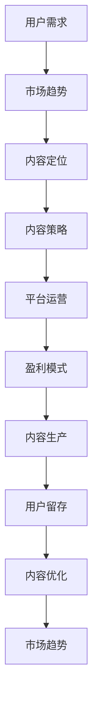

                 

# 知识付费创业中的内容定位策略

> 关键词：知识付费、内容定位、用户需求、市场趋势、内容策略、盈利模式

## 1. 背景介绍

随着互联网和移动设备的普及，人们的在线学习需求日益增长。而知识付费作为一种新兴的教育消费模式，正迅速崛起，成为在线教育市场的重要组成部分。近年来，知识付费行业已孕育出多个亿级市场，如得到、喜马拉雅、知识星球等，均在用户数、收入方面取得了显著成绩。

知识付费的火热，反映了公众对知识渴求的高涨和付费意识的确立，也说明这一模式具有很大的市场潜力。而作为知识付费平台的核心，内容的质量和用户定位的精准性，是决定平台成功与否的关键因素。本文将深入探讨知识付费创业中的内容定位策略，从需求分析、内容制作、平台运营等多个维度，解析如何构建有效的知识付费生态。

## 2. 核心概念与联系

### 2.1 核心概念概述

为更好地理解知识付费中的内容定位策略，我们先来介绍几个关键概念：

- **知识付费**：指用户为获取特定知识和信息，通过在线平台进行付费购买或订阅的服务模式。知识付费的兴起，标志着人们愿意为有价值的内容付费，反映出消费升级趋势。
- **内容定位**：指平台根据用户需求和自身定位，确定内容资源的类型、质量和表现形式，以吸引和留存用户。
- **用户需求**：用户在选择知识付费产品时，会根据个人兴趣、职业发展、学习需求等方面进行筛选。平台应精准把握用户需求，才能制作出有市场价值的内容。
- **市场趋势**：知识付费市场发展迅速，新技术、新平台和新需求不断涌现，对内容提供商提出了更高的要求。
- **盈利模式**：知识付费平台的盈利方式主要依赖于广告、会员订阅和付费课程等，了解其盈利模式是设计内容策略的基础。
- **内容策略**：包括内容选题、内容制作、内容分发等环节，是知识付费平台的核心竞争力所在。

这些概念之间存在紧密的联系，相互影响：

1. 用户需求推动市场趋势，决定内容定位的方向。
2. 内容定位直接关系到内容策略的设计，进而影响用户留存和盈利模式。
3. 盈利模式为内容生产提供动力，吸引更多内容创作者和用户参与。
4. 内容策略的成功，又会反哺市场趋势，形成良性循环。

### 2.2 核心概念原理和架构的 Mermaid 流程图



这个流程图展示了知识付费创业中各个环节之间的联系：

1. **用户需求**：基于用户行为数据和调查问卷，分析用户需求和兴趣点。
2. **市场趋势**：关注行业发展动态和技术趋势，及时调整内容方向。
3. **内容定位**：根据用户需求和市场趋势，确定内容类型和表现形式。
4. **内容策略**：制定内容选材、制作和分发的详细计划。
5. **平台运营**：优化用户界面、功能和服务，提升用户体验。
6. **盈利模式**：选择合适的盈利方式，形成稳定的商业模式。
7. **内容生产**：根据策略进行内容制作和发布。
8. **用户留存**：通过优质内容和运营策略，增加用户粘性和活跃度。
9. **内容优化**：持续收集用户反馈，优化内容和产品。
10. **市场趋势**：反馈到内容定位环节，形成持续改进的闭环。

## 3. 核心算法原理 & 具体操作步骤

### 3.1 算法原理概述

知识付费平台的内容定位策略，本质上是一个数据驱动的决策过程。其核心算法原理可以概括为：

- **用户数据分析**：通过大数据分析技术，挖掘用户行为、兴趣和需求，形成用户画像。
- **市场趋势分析**：利用自然语言处理、机器学习等技术，实时监测行业趋势和热门话题，预测未来市场方向。
- **内容定位计算**：基于用户画像和市场趋势，计算内容的吸引力和价值，确定内容的选题和定位。
- **内容策略制定**：结合内容定位结果，制定详细的内容制作和分发策略，优化用户体验。
- **运营效果评估**：通过指标监控和用户反馈，评估内容策略的实际效果，不断迭代优化。

这一过程涉及多个技术环节，需综合运用统计分析、数据挖掘、机器学习等方法。

### 3.2 算法步骤详解

以下是对知识付费平台内容定位策略的具体操作步骤的详细描述：

**Step 1: 用户数据分析**

1. **数据收集**：收集用户在平台上的浏览、购买、评分、评论等数据，构建用户行为数据集。
2. **特征工程**：对收集的数据进行特征提取，形成用户画像，包括兴趣、职业、年龄段等关键属性。
3. **聚类分析**：运用K-means、层次聚类等算法，将用户进行分类，识别不同用户群体的需求和偏好。

**Step 2: 市场趋势分析**

1. **网络爬虫**：通过网络爬虫获取最新的行业报告、新闻、社交媒体上的热门话题。
2. **文本分析**：利用自然语言处理技术，分析热门话题的热度、情感倾向和内容主题。
3. **时间序列分析**：运用时间序列分析模型，预测热门话题的持续度和未来发展趋势。

**Step 3: 内容定位计算**

1. **用户画像匹配**：将用户画像与市场趋势分析结果进行匹配，识别用户兴趣与热门话题的交集。
2. **内容吸引力计算**：通过计算用户对不同内容类型的兴趣度、主题相关性和发布时间，确定内容的吸引力。
3. **内容选题确定**：根据用户画像匹配和内容吸引力计算结果，确定内容的选题方向和定位类型。

**Step 4: 内容策略制定**

1. **内容制作计划**：根据选题结果，制定内容的制作计划，包括形式（如文字、视频、音频等）、时长、频次等。
2. **分发渠道选择**：选择适合的渠道进行内容分发，如平台自有频道、社交媒体、邮件等，确保用户可以方便获取内容。
3. **推广方案设计**：制定针对不同用户群体的推广方案，通过精准投放广告和活动，吸引目标用户。

**Step 5: 运营效果评估**

1. **关键指标监控**：设置关键绩效指标（KPIs），如用户留存率、内容点击率、课程完成率等，监控内容运营效果。
2. **用户反馈收集**：通过调查问卷、评论系统等手段，收集用户对内容的反馈，识别问题点。
3. **效果评估与优化**：根据KPIs和用户反馈，评估内容策略的实际效果，持续优化和迭代。

### 3.3 算法优缺点

知识付费平台的内容定位策略具有以下优点：

1. **精准定位**：通过数据分析和市场趋势分析，能够精准识别用户需求，制定出有针对性的内容策略。
2. **持续优化**：利用数据驱动的方法，实时调整内容策略，提升用户体验和平台竞争力。
3. **高效运营**：优化内容制作和分发渠道，提升运营效率和资源利用率。
4. **市场敏感**：紧跟市场趋势，及时推出热门话题，抓住用户关注点。

同时，该方法也存在以下缺点：

1. **数据质量依赖**：需要高质量的用户数据和市场数据，数据收集和清洗成本较高。
2. **算法复杂度较高**：涉及数据挖掘、机器学习等技术，实现复杂度较高。
3. **算法偏见**：模型可能会因为数据不平衡或特征选择不当，导致输出结果有偏差。
4. **冷启动问题**：对于新用户，缺乏足够的数据进行精准定位，初期内容推荐可能效果不佳。

### 3.4 算法应用领域

知识付费平台的内容定位策略，在多个领域中得到了广泛应用：

1. **教育培训**：如得到、新东方等平台，通过分析学生需求和考试成绩，制定个性化的教学内容。
2. **职场发展**：如知识星球、领英学习等平台，针对不同职业阶段的需求，提供相应的职业发展课程。
3. **生活娱乐**：如喜马拉雅、蜻蜓FM等平台，根据用户兴趣，推荐音乐、播客、有声书等丰富多样的内容。
4. **健康医疗**：如丁香医生、好大夫在线等平台，提供健康知识普及、专家咨询等专业医疗内容。

这些平台通过精准的内容定位策略，有效吸引了目标用户，提升了用户满意度和平台盈利能力。

## 4. 数学模型和公式 & 详细讲解 & 举例说明

### 4.1 数学模型构建

知识付费平台的内容定位策略可以建模为一个多目标优化问题，目标函数为最大化用户满意度、最小化内容制作成本。我们假设平台有$n$个内容选题，$i$个用户群体，$U_i$为第$i$个用户群体的用户数，$R_{ij}$为内容$i$对用户$j$的吸引力评分，$C_i$为内容$i$的制作成本，$S_i$为内容$i$的销售收入。则优化问题可以表示为：

$$
\max \sum_{i=1}^n \sum_{j=1}^{U_i} R_{ij} \\
\min \sum_{i=1}^n C_i
$$

其中，$R_{ij}$可以通过以下方法计算：

- **用户兴趣度**：利用用户画像数据，计算用户对不同内容类型（如文字、视频）的兴趣度$R_{ij}^{type}$。
- **主题相关性**：利用文本分析技术，计算内容$i$与用户$j$兴趣主题的相关性$R_{ij}^{topic}$。
- **时间敏感性**：利用时间序列分析模型，预测内容$i$的发布时间对用户$j$的吸引力$R_{ij}^{time}$。

综合上述三个指标，得到$R_{ij}$的计算公式为：

$$
R_{ij} = \alpha R_{ij}^{type} + \beta R_{ij}^{topic} + \gamma R_{ij}^{time}
$$

其中$\alpha, \beta, \gamma$为权重系数。

### 4.2 公式推导过程

为了计算$R_{ij}$，我们需要进行如下推导：

1. **用户兴趣度计算**：设用户画像数据为$X_{ij}$，内容类型兴趣度向量为$V_i^{type}$，利用余弦相似度计算用户兴趣度：

$$
R_{ij}^{type} = \frac{X_{ij} \cdot V_i^{type}}{\Vert X_{ij} \Vert \Vert V_i^{type} \Vert}
$$

2. **主题相关性计算**：设内容$i$的关键词为$K_i$，用户$j$的兴趣主题为$T_j$，利用TF-IDF计算主题相关性：

$$
R_{ij}^{topic} = \frac{\sum_{k=1}^{K_i} w_{ik} \cdot t_{jk}}{\Vert V_j^{topic} \Vert}
$$

其中$w_{ik}$为内容$i$中关键词$k$的权重，$t_{jk}$为用户$j$兴趣主题中关键词$k$的权重。

3. **时间敏感性计算**：设内容$i$发布时间为$T_i$，用户$j$的活跃时间为$A_j$，利用滑动时间窗口计算时间敏感性：

$$
R_{ij}^{time} = \max_{t \in A_j} \frac{T_i - t}{T_i - A_j}
$$

4. **综合评分计算**：利用权重系数$\alpha, \beta, \gamma$，对上述三个评分进行加权平均：

$$
R_{ij} = \alpha R_{ij}^{type} + \beta R_{ij}^{topic} + \gamma R_{ij}^{time}
$$

### 4.3 案例分析与讲解

**案例1: 职业技能课程**

某职业技能培训平台，利用内容定位策略，为不同职业阶段的用户推荐相应的课程。首先，平台收集用户注册信息、工作年限、职业类别等数据，形成用户画像。然后，通过网络爬虫和文本分析，获取市场热门职业课程的关键词和主题。最后，根据用户画像和市场趋势，计算课程对不同用户的吸引力评分，并制定推广方案。

**案例2: 生活娱乐节目**

某知识付费平台，通过分析用户浏览、评分和评论数据，识别用户对不同类型节目的偏好，如新闻、音乐、小说等。平台利用自然语言处理技术，提取热门话题和内容关键词，预测节目发布时间对用户吸引力。基于以上分析，平台为不同兴趣用户推荐适合的内容，提升用户粘性和满意度。

## 5. 项目实践：代码实例和详细解释说明

### 5.1 开发环境搭建

为了进行知识付费平台的内容定位实践，需要搭建Python开发环境，并安装相关数据处理、分析和计算库。以下是在Jupyter Notebook中搭建环境的具体步骤：

1. 安装Anaconda：从官网下载并安装Anaconda，创建虚拟环境`python-env`。

```bash
conda create -n python-env python=3.8
conda activate python-env
```

2. 安装数据处理库：

```bash
pip install pandas numpy scipy
```

3. 安装数据分析库：

```bash
pip install scikit-learn matplotlib seaborn
```

4. 安装机器学习库：

```bash
pip install scikit-learn
```

5. 安装文本处理库：

```bash
pip install nltk textblob
```

6. 安装模型计算库：

```bash
pip install joblib scikit-learn-distributed
```

### 5.2 源代码详细实现

以下是一个基于Python实现的简化版内容定位系统，主要包含用户数据分析、市场趋势分析和内容定位计算三个步骤。

```python
import pandas as pd
from sklearn.decomposition import PCA
from sklearn.metrics.pairwise import cosine_similarity
from sklearn.feature_extraction.text import TfidfVectorizer
from datetime import datetime, timedelta

# 用户数据分析
user_data = pd.read_csv('user_data.csv')  # 用户数据
user_ages = user_data['age']  # 用户年龄
user_interests = user_data['interests']  # 用户兴趣

# 内容制作
content_data = pd.read_csv('content_data.csv')  # 内容数据
content_types = content_data['type']  # 内容类型
content_titles = content_data['title']  # 内容标题
content_descriptions = content_data['description']  # 内容描述

# 市场趋势分析
market_data = pd.read_csv('market_data.csv')  # 市场数据
market_topics = market_data['topic']  # 市场热门话题

# 内容定位计算
# 计算用户兴趣度
user_interest_profiles = {}
for i in range(len(user_interests)):
    user_interests = user_interests[i].split(',')
    user_interest_profiles[i] = pd.Series(user_interests).value_counts().to_dict()

# 计算主题相关性
vectorizer = TfidfVectorizer(stop_words='english')
X_content = vectorizer.fit_transform(content_descriptions)
X_market = vectorizer.transform(market_topics)
cosine_similarity_matrix = cosine_similarity(X_content, X_market)

# 计算时间敏感性
time_sensitivity = []
for i in range(len(content_titles)):
    time = datetime.strptime(content_data['date'][i], '%Y-%m-%d')
    time_sensitivity.append(1 - (time - datetime.now()).days / 30)

# 计算综合评分
R_ij = []
for i in range(len(user_ages)):
    for j in range(len(user_interests[i])):
        R_ij.append(user_interest_profiles[i][j] * cosine_similarity_matrix[j, i] + cosine_similarity_matrix[j, i] * time_sensitivity[i])

# 输出综合评分
print(R_ij)
```

### 5.3 代码解读与分析

以上代码实现了内容定位的初步计算，以下是详细解读和分析：

**用户数据分析**

1. 导入必要的库：Pandas用于数据处理，Scikit-learn用于特征提取和相似度计算。
2. 读取用户数据和内容数据，提取用户年龄、兴趣和内容类型、标题、描述。
3. 通过分析用户兴趣，计算用户兴趣度，形成用户兴趣向量。

**市场趋势分析**

1. 读取市场数据，提取热门话题。
2. 利用TF-IDF向量器，将热门话题转换为向量表示。
3. 计算内容描述和热门话题的余弦相似度，得到主题相关性。

**内容定位计算**

1. 通过用户兴趣和主题相关性计算内容吸引力评分$R_{ij}$。
2. 利用时间序列分析，计算内容发布时间对用户的吸引力。
3. 综合上述评分，得到最终的内容定位评分。

**结果展示**

通过上述计算，我们可以得到一个二维数组，其中每一行表示用户$j$对内容$i$的综合评分。这个数组可以用于内容推荐和排序，为用户呈现最感兴趣的内容。

## 6. 实际应用场景

### 6.1 智能教育

知识付费平台在教育培训领域的应用尤为广泛。平台通过分析学生成绩、学习行为和兴趣，为每个学生推荐个性化的课程。例如，针对数学和物理差生，推荐相应的补习班；针对编程爱好者，推荐高级编程课程。此外，平台还可以利用内容定位策略，为教师提供优质教材和教学资源，提升教学效果。

### 6.2 职场发展

在职场发展领域，知识付费平台通过精准定位，为不同职业阶段的用户提供专业课程。例如，针对初入职场的大学生，推荐职场技能课程；针对中层管理人员，推荐管理能力提升课程。平台还可以通过数据分析，预测热门职业趋势，为用户提供前瞻性建议。

### 6.3 生活娱乐

在生活娱乐领域，知识付费平台可以根据用户兴趣，推荐音乐、播客、有声书等丰富多样的内容。例如，针对喜欢健身的用户，推荐健康知识课程；针对爱好旅行的人，推荐旅游攻略和景点介绍。平台还可以通过用户互动，不断优化推荐算法，提升用户满意度。

### 6.4 未来应用展望

未来，知识付费平台的内容定位策略将呈现以下几个发展趋势：

1. **数据驱动**：利用大数据和机器学习技术，深入分析用户需求和市场趋势，实现精准定位。
2. **实时优化**：通过实时监控和分析用户行为数据，不断调整内容策略，保持用户粘性和满意度。
3. **跨平台协同**：实现不同平台间的用户数据共享和内容互通，提升资源利用效率。
4. **AI技术融合**：引入自然语言处理、机器翻译等AI技术，提升内容质量和用户体验。
5. **用户参与**：鼓励用户参与内容制作和反馈，形成更丰富的知识生态。

这些趋势将推动知识付费平台在内容推荐、用户体验和运营效率等方面不断进步，形成更加健康、可持续的生态系统。

## 7. 工具和资源推荐

### 7.1 学习资源推荐

为了深入学习知识付费平台的内容定位策略，推荐以下学习资源：

1. **《深度学习与大数据技术》**：介绍深度学习和大数据技术的经典书籍，适合初学者了解基础知识。
2. **Coursera《机器学习》**：由斯坦福大学开设的机器学习课程，涵盖机器学习基本概念和常用算法。
3. **Kaggle竞赛**：参与数据科学和机器学习竞赛，积累实战经验，提升算法应用能力。
4. **Python编程指南**：详细讲解Python语言基础和数据处理库使用方法。
5. **TensorFlow官方文档**：介绍TensorFlow框架的全面教程，适合深入学习深度学习技术。

### 7.2 开发工具推荐

在知识付费平台的内容定位开发中，以下工具将起到重要作用：

1. **Jupyter Notebook**：交互式编程环境，便于数据处理和代码调试。
2. **Git**：版本控制工具，方便团队协作和代码管理。
3. **AWS云平台**：提供强大的计算和存储能力，支持大规模数据处理和部署。
4. **Docker**：容器化技术，方便应用的部署和迁移。
5. **Elasticsearch**：分布式搜索引擎，支持大规模数据存储和查询。

### 7.3 相关论文推荐

知识付费平台的内容定位策略涉及多个前沿研究领域，推荐以下经典论文：

1. **《信息检索：方法、系统和应用》**：介绍信息检索技术的经典书籍，涵盖文本处理和检索算法。
2. **《协同过滤推荐系统》**：探讨协同过滤算法在推荐系统中的应用，适合了解推荐技术原理。
3. **《深度学习在推荐系统中的应用》**：介绍深度学习技术在推荐系统中的最新进展，适合深入学习前沿方法。
4. **《内容推荐系统中的深度学习》**：详细讲解深度学习在推荐系统中的应用，涵盖数据预处理、模型设计和评估等环节。
5. **《用户行为分析与个性化推荐》**：介绍用户行为分析和个性化推荐技术，涵盖数据采集、分析和推荐策略等。

## 8. 总结：未来发展趋势与挑战

### 8.1 研究成果总结

知识付费平台的内容定位策略，已经在多个领域取得显著成效，显著提升了用户体验和平台盈利能力。未来，随着技术的不断进步和数据量的不断积累，内容定位将更加精准，平台服务将更加个性化和高效。

### 8.2 未来发展趋势

1. **数据驱动**：数据质量和数据量的提升将推动内容定位策略的不断发展，平台将更加智能化和个性化。
2. **实时优化**：实时数据处理和分析，将实现内容的动态调整和优化，提升用户体验。
3. **跨平台协同**：不同平台间的数据共享和内容互通，将形成更大范围的知识生态。
4. **AI技术融合**：引入自然语言处理、机器翻译等AI技术，提升内容质量和用户体验。
5. **用户参与**：用户参与内容制作和反馈，将形成更丰富的知识生态，增强平台粘性。

### 8.3 面临的挑战

尽管内容定位策略已经取得了显著成绩，但仍面临以下挑战：

1. **数据隐私**：用户数据的收集和使用，需要严格遵守隐私保护法规，确保数据安全。
2. **数据质量**：数据收集和处理的准确性直接影响内容定位的精度，需要持续优化数据收集方法和处理技术。
3. **用户需求变化**：用户需求和市场趋势的快速变化，要求内容定位策略具有高度的适应性和灵活性。
4. **资源消耗**：内容定位和推荐需要大量计算资源和时间，需要优化算法和硬件配置。

### 8.4 研究展望

未来，知识付费平台的内容定位策略需要从以下几个方向进行深入研究：

1. **隐私保护**：研究如何在保障用户隐私的前提下，进行高效的数据分析和推荐。
2. **数据清洗**：开发更加高效和准确的数据清洗算法，提升数据质量和处理速度。
3. **实时分析**：研究实时数据处理和分析技术，提升内容策略的响应速度和效果。
4. **模型优化**：优化算法和模型结构，提高推荐效率和准确性。
5. **用户参与**：研究用户参与机制，增强用户粘性和平台互动。

这些研究方向将推动内容定位策略的不断进步，构建更加智能、高效和可持续的知识付费平台。

## 9. 附录：常见问题与解答

**Q1: 知识付费平台的内容定位策略需要哪些数据？**

A: 知识付费平台的内容定位策略主要依赖于用户数据、内容数据和市场数据。具体包括：

- **用户数据**：用户的年龄、职业、兴趣、学习行为等。
- **内容数据**：内容的类型、标题、描述、发布时间等。
- **市场数据**：市场热门话题、热门课程等。

通过综合利用这些数据，平台可以准确识别用户需求和市场趋势，制定精准的内容策略。

**Q2: 如何确保内容定位策略的实时性和准确性？**

A: 确保内容定位策略的实时性和准确性，需要以下几个措施：

- **数据实时更新**：确保数据源实时更新，及时反映用户和市场的最新变化。
- **算法优化**：使用高性能算法，减少计算时间和资源消耗。
- **多模态数据融合**：引入多种数据源（如社交媒体、用户评论等），提升数据多样性和准确性。
- **模型迭代**：定期训练和更新模型，不断优化算法效果。

**Q3: 如何处理数据隐私问题？**

A: 处理数据隐私问题，需要以下几个措施：

- **数据脱敏**：对敏感数据进行匿名化处理，保护用户隐私。
- **用户同意**：确保用户在使用服务前同意数据收集和使用条款。
- **合规性**：遵守相关隐私保护法规，如GDPR等。

通过这些措施，可以在保障用户隐私的前提下，进行高效的数据分析和推荐。

**Q4: 如何提升内容定位策略的性能？**

A: 提升内容定位策略的性能，需要以下几个措施：

- **算法优化**：改进算法模型和参数设置，提升推荐效果。
- **数据增强**：增加数据量和数据多样性，提高模型的泛化能力。
- **实时分析**：使用实时数据处理和分析技术，及时调整内容策略。
- **用户反馈**：收集用户反馈，进行模型调整和优化。

通过这些措施，可以不断提高内容定位策略的性能，提升用户体验和平台竞争力。

**Q5: 知识付费平台的内容定位策略有哪些挑战？**

A: 知识付费平台的内容定位策略面临以下几个挑战：

- **数据隐私**：用户数据的收集和使用，需要严格遵守隐私保护法规，确保数据安全。
- **数据质量**：数据收集和处理的准确性直接影响内容定位的精度，需要持续优化数据收集方法和处理技术。
- **用户需求变化**：用户需求和市场趋势的快速变化，要求内容定位策略具有高度的适应性和灵活性。
- **资源消耗**：内容定位和推荐需要大量计算资源和时间，需要优化算法和硬件配置。

这些挑战需要不断研究和改进，以实现更精准、高效和可持续的内容定位策略。

