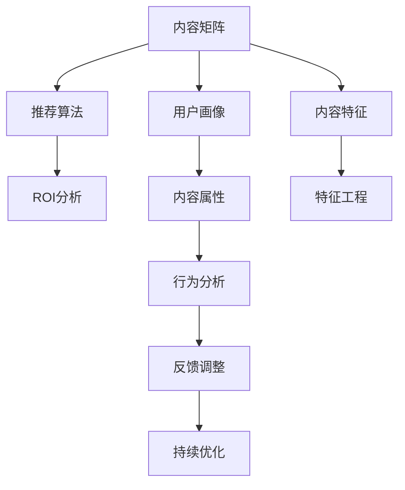

                 

# 知识付费创业中的内容矩阵效应最大化

> 关键词：知识付费,内容矩阵,算法推荐,用户画像,ROI分析

## 1. 背景介绍

### 1.1 问题由来
知识付费行业近年来迅速发展，从在线课程、付费订阅，到播客、电子书等各种形式的知识产品，满足了用户对知识获取的个性化需求。然而，随着用户基数的增长和内容产品的泛滥，如何实现优质内容的精准推荐，提升用户满意度与转化率，成为了知识付费企业关注的重点。

与此同时，传统的信息检索与推荐系统已难以满足知识付费场景的需求。相较于简单的商品推荐，知识付费内容推荐需要考虑用户的行为、偏好、学习阶段等多维度的特征，并对内容的深层次属性如逻辑性、易懂性、实用性等进行综合评估。

### 1.2 问题核心关键点
知识付费内容推荐的核心关键点在于如何构建高效的内容矩阵，最大化内容与用户之间的匹配度，实现高效的内容推荐。这涉及到多个方面的研究，包括：
- 用户画像构建与特征工程
- 内容属性标注与特征提取
- 推荐算法设计与优化
- 用户行为分析与反馈调整
- ROI分析与业务价值衡量

本文聚焦于内容矩阵效应最大化，通过对用户画像、内容特征、推荐算法等方面的探讨，为知识付费创业企业提供全面、实用的策略与建议。

### 1.3 问题研究意义
研究内容矩阵效应最大化，对于提升知识付费企业的核心竞争力、优化用户体验、增加用户粘性、提高营收等方面具有重要意义：

1. **提升竞争力**：高效的内容推荐能帮助企业在激烈的市场竞争中脱颖而出，吸引更多高质量用户，形成良性循环。
2. **优化用户体验**：精准的内容推荐能够满足用户的个性化需求，提升用户满意度和忠诚度。
3. **增加用户粘性**：内容矩阵的高效构建使得用户长期依赖于平台，实现用户留存与转化。
4. **提高营收**：精准推荐带来的用户粘性提升和购买转化，可显著增加企业的营收水平。

## 2. 核心概念与联系

### 2.1 核心概念概述

为更好地理解内容矩阵效应最大化的核心概念，本节将介绍几个密切相关的核心概念：

- **内容矩阵**：基于内容属性和用户特征构建的推荐系统矩阵。通过对内容的深层次属性与用户画像进行匹配，实现高效的内容推荐。
- **用户画像**：通过用户的浏览、购买、学习行为等多维数据构建的综合用户特征描述，用于刻画用户偏好和行为模式。
- **内容特征**：知识付费内容的属性标注，包括专业性、难度、实用性、时长、作者可信度等，用于内容推荐的基础数据。
- **推荐算法**：包括基于协同过滤、基于内容的推荐算法、混合推荐算法等，用于实现高效的内容推荐。
- **ROI分析**：评估内容推荐对企业带来的投资回报率，衡量内容推荐的实际价值。
- **内容属性**：知识付费内容的属性描述，包括标题、摘要、标签、时长、作者等，用于内容特征提取。
- **用户行为**：用户的浏览、购买、学习、评价等行为数据，用于构建用户画像和行为预测。

这些核心概念之间的逻辑关系可以通过以下Mermaid流程图来展示：



这个流程图展示了一个知识付费内容推荐系统的核心组成部分及其相互关系：

1. 内容矩阵基于用户画像和内容特征构建，用于实现高效的内容推荐。
2. 用户画像通过对用户多维数据的综合分析构建，用于刻画用户偏好和行为模式。
3. 内容特征对知识付费内容进行属性标注，用于内容推荐的基础数据。
4. 推荐算法设计高效的内容推荐模型，实现精准推荐。
5. ROI分析评估内容推荐对企业带来的实际价值，衡量推荐效果。
6. 内容属性描述知识付费内容的深层次属性，用于内容特征提取。
7. 用户行为分析通过对用户行为的深入分析构建用户画像，用于行为预测和推荐优化。
8. 反馈调整根据用户反馈实时调整推荐算法，持续优化推荐效果。

这些概念共同构成了知识付费内容推荐系统的逻辑框架，使得企业能够构建高效的内容矩阵，实现优质内容的精准推荐。

## 3. 核心算法原理 & 具体操作步骤
### 3.1 算法原理概述

内容矩阵效应最大化的核心思想是通过构建一个高效的内容推荐系统，最大化内容与用户之间的匹配度，实现精准的内容推荐。这涉及到大数据处理、机器学习、自然语言处理等多方面的技术。

形式化地，假设用户集合为 $U$，内容集合为 $C$，每个用户 $u \in U$ 对每个内容 $c \in C$ 有一个评分 $r_{uc}$，评分函数为 $r: U \times C \rightarrow [0,1]$。内容矩阵 $M$ 为一个 $|U| \times |C|$ 的矩阵，其中 $M_{uc} = r_{uc}$。推荐系统目标是最小化用户未被推荐内容的用户剩余用户-剩余用户(WUI)差距：

$$
\min_{M} \sum_{u \in U} \sum_{c \in C} M_{uc}(1-r_{uc})
$$

其中 $M_{uc}(1-r_{uc})$ 表示用户 $u$ 未被推荐内容 $c$ 的损失，$\sum_{u \in U} \sum_{c \in C}$ 表示对所有用户和内容的损失之和。

通过优化上述目标函数，推荐系统可以最大化内容与用户之间的匹配度，实现高效的内容推荐。

### 3.2 算法步骤详解

内容矩阵效应最大化的具体步骤包括：

**Step 1: 用户画像构建**

1. 收集用户的基本信息、浏览记录、购买记录、学习历史等多维数据。
2. 通过K-means、PCA等方法对用户数据进行降维处理，减少数据的维度。
3. 利用LSTM、神经网络等模型对用户行为序列进行建模，提取用户的长期行为特征。
4. 将用户特征进行编码，生成用户画像向量。

**Step 2: 内容特征标注**

1. 对知识付费内容进行属性标注，包括标题、摘要、时长、作者等，使用TF-IDF、Word2Vec等方法提取内容的关键词。
2. 通过LDA、BERT等模型对内容的语义信息进行建模，提取内容的深层次属性。
3. 对内容属性进行编码，生成内容特征向量。

**Step 3: 构建内容矩阵**

1. 将用户画像向量和内容特征向量进行拼接，形成用户-内容矩阵 $M$。
2. 使用矩阵分解技术（如SVD）对内容矩阵进行低秩分解，提取用户-内容关系。
3. 根据用户画像和内容特征，设计推荐模型，进行内容推荐。

**Step 4: 推荐算法优化**

1. 选择协同过滤、基于内容的推荐算法、混合推荐算法等推荐模型。
2. 设计不同的评估指标，如准确率、召回率、覆盖率等，进行模型评估。
3. 通过A/B测试、交叉验证等方法，不断优化推荐算法。

**Step 5: ROI分析**

1. 收集推荐系统的用户留存、购买转化、学习时长等数据。
2. 计算ROI，评估内容推荐对企业带来的实际价值。
3. 根据ROI结果，调整推荐策略，提高内容推荐的实际效果。

### 3.3 算法优缺点

内容矩阵效应最大化方法具有以下优点：
1. 精准推荐：通过高效的用户画像和内容特征构建，能够实现精准的内容推荐。
2. 实时优化：根据用户反馈实时调整推荐算法，持续优化推荐效果。
3. 提升用户体验：精准推荐能够满足用户的个性化需求，提升用户满意度和忠诚度。
4. 优化业务价值：提高用户留存和购买转化，增加企业营收。

同时，该方法也存在一些局限性：
1. 数据依赖度高：推荐系统的效果很大程度上取决于用户和内容的特征数据，数据质量差会影响推荐效果。
2. 算法复杂度高：推荐算法设计复杂，模型训练时间长，资源消耗大。
3. 冷启动问题：新用户和老用户的行为特征差异大，冷启动问题难以解决。
4. 过度拟合风险：推荐系统容易出现过度拟合，导致泛化能力差。
5. 用户隐私问题：用户画像和行为数据的收集和使用存在隐私风险，需要严格的数据保护措施。

尽管存在这些局限性，但就目前而言，内容矩阵效应最大化方法是知识付费内容推荐的主流范式。未来相关研究的重点在于如何进一步降低数据依赖，提高推荐系统的实时性和鲁棒性，同时兼顾用户隐私和数据安全等因素。

### 3.4 算法应用领域

内容矩阵效应最大化的推荐方法在知识付费领域已经得到了广泛的应用，涵盖以下多个方面：

- **内容发现**：推荐系统能够帮助用户发现高质量内容，如新书、新课、新文章等。通过精准推荐，减少用户寻找内容的时间成本，提高用户使用体验。
- **个性化推荐**：根据用户的长期行为特征和短时行为数据，推荐符合用户喜好的内容，满足用户个性化需求。
- **学习路径优化**：通过推荐系统的学习路径推荐，用户可以按照最优的学习顺序逐步掌握相关知识，提升学习效率。
- **内容筛选**：对海量内容进行筛选，推荐最符合用户需求的内容，避免信息过载。
- **营销推荐**：通过精准推荐，实现高质量用户引流和转化，增加企业营收。

除了上述这些经典应用外，内容矩阵效应最大化技术还被创新性地应用到更多场景中，如基于内容的搜索引擎优化、个性化广告推荐、电商平台商品推荐等，为知识付费技术带来了全新的突破。

## 4. 数学模型和公式 & 详细讲解  
### 4.1 数学模型构建

本节将使用数学语言对内容矩阵效应最大化的推荐过程进行更加严格的刻画。

假设用户集合为 $U=\{u_1,u_2,\ldots,u_N\}$，内容集合为 $C=\{c_1,c_2,\ldots,c_M\}$，用户对内容的评分矩阵为 $R \in \mathbb{R}^{N \times M}$。设 $X \in \mathbb{R}^{N \times D}$ 为用户画像矩阵，$Y \in \mathbb{R}^{M \times K}$ 为内容特征矩阵。内容矩阵 $M$ 可以表示为：

$$
M = X \cdot Y^T
$$

其中 $X \cdot Y^T$ 表示用户画像矩阵与内容特征矩阵的矩阵乘积。推荐模型的目标是最小化用户未被推荐内容的用户剩余用户-剩余用户(WUI)差距，即：

$$
\min_{M} \sum_{u \in U} \sum_{c \in C} M_{uc}(1-R_{uc})
$$

在实践中，我们通常使用基于梯度的优化算法（如SGD、Adam等）来近似求解上述最优化问题。设 $\eta$ 为学习率，$\lambda$ 为正则化系数，则参数的更新公式为：

$$
X \leftarrow X - \eta \nabla_{X}\mathcal{L}(X) - \eta\lambda X
$$
$$
Y \leftarrow Y - \eta \nabla_{Y}\mathcal{L}(Y) - \eta\lambda Y
$$

其中 $\nabla_{X}\mathcal{L}(X)$ 和 $\nabla_{Y}\mathcal{L}(Y)$ 为损失函数对用户画像矩阵和内容特征矩阵的梯度，可通过反向传播算法高效计算。

### 4.2 公式推导过程

以下我们以协同过滤算法为例，推导推荐模型的损失函数及其梯度的计算公式。

假设推荐模型的预测评分矩阵为 $M \in \mathbb{R}^{N \times M}$，与用户评分矩阵 $R$ 的误差矩阵为 $E \in \mathbb{R}^{N \times M}$。推荐模型的损失函数定义为：

$$
\mathcal{L} = ||R - M||_F^2
$$

其中 $|| \cdot ||_F$ 表示矩阵的 Frobenius 范数。将损失函数对 $X$ 和 $Y$ 的梯度代入，得：

$$
\frac{\partial \mathcal{L}}{\partial X} = 2 \nabla_{X}\mathcal{L}(X) = -4X^TME^T
$$
$$
\frac{\partial \mathcal{L}}{\partial Y} = 2 \nabla_{Y}\mathcal{L}(Y) = -4Y^TME^T
$$

将上述梯度代入更新公式，完成用户画像矩阵和内容特征矩阵的迭代优化。重复上述过程直至收敛，最终得到优化后的推荐模型。

## 5. 项目实践：代码实例和详细解释说明
### 5.1 开发环境搭建

在进行推荐系统实践前，我们需要准备好开发环境。以下是使用Python进行PyTorch开发的环境配置流程：

1. 安装Anaconda：从官网下载并安装Anaconda，用于创建独立的Python环境。

2. 创建并激活虚拟环境：
```bash
conda create -n recsys-env python=3.8 
conda activate recsys-env
```

3. 安装PyTorch：根据CUDA版本，从官网获取对应的安装命令。例如：
```bash
conda install pytorch torchvision torchaudio cudatoolkit=11.1 -c pytorch -c conda-forge
```

4. 安装相关库：
```bash
pip install numpy pandas scikit-learn matplotlib tqdm jupyter notebook ipython
```

完成上述步骤后，即可在`recsys-env`环境中开始推荐系统实践。

### 5.2 源代码详细实现

下面我以协同过滤算法为例，给出使用PyTorch实现的知识付费推荐系统的代码实现。

首先，定义推荐系统所需的数据处理函数：

```python
from torch.utils.data import Dataset, DataLoader
from torch import nn, optim

class RecommendationDataset(Dataset):
    def __init__(self, users, items, ratings, user_features, item_features, user_ratings_mean, item_ratings_mean, user_ratings_std, item_ratings_std):
        self.users = users
        self.items = items
        self.ratings = ratings
        self.user_features = user_features
        self.item_features = item_features
        self.user_ratings_mean = user_ratings_mean
        self.item_ratings_mean = item_ratings_mean
        self.user_ratings_std = user_ratings_std
        self.item_ratings_std = item_ratings_std

    def __len__(self):
        return len(self.ratings)

    def __getitem__(self, index):
        user_id = self.users[index]
        item_id = self.items[index]
        rating = self.ratings[index]
        user_feature = self.user_features[user_id]
        item_feature = self.item_features[item_id]
        user_mean = self.user_ratings_mean[user_id]
        item_mean = self.item_ratings_mean[item_id]
        user_std = self.user_ratings_std[user_id]
        item_std = self.item_ratings_std[item_id]
        return user_id, item_id, rating, user_feature, item_feature, user_mean, item_mean, user_std, item_std
```

然后，定义模型和优化器：

```python
class CollaborativeFiltering(nn.Module):
    def __init__(self, user_dim, item_dim):
        super(CollaborativeFiltering, self).__init__()
        self.user_embeddings = nn.Embedding(num_users, user_dim)
        self.item_embeddings = nn.Embedding(num_items, item_dim)

    def forward(self, user_id, item_id, user_feature, item_feature, user_mean, item_mean, user_std, item_std):
        user_embed = self.user_embeddings(user_id)
        item_embed = self.item_embeddings(item_id)
        user_embedding = user_embed + user_feature - user_mean
        item_embedding = item_embed + item_feature - item_mean
        prediction = user_embedding.dot(item_embedding.t()) / (user_std * item_std)
        return prediction

model = CollaborativeFiltering(user_dim=10, item_dim=10)
optimizer = optim.Adam(model.parameters(), lr=0.01)
```

接着，定义训练和评估函数：

```python
def train_epoch(model, data_loader, optimizer):
    model.train()
    for user_id, item_id, rating, user_feature, item_feature, user_mean, item_mean, user_std, item_std in data_loader:
        optimizer.zero_grad()
        prediction = model(user_id, item_id, user_feature, item_feature, user_mean, item_mean, user_std, item_std)
        loss = nn.MSELoss()(prediction, rating)
        loss.backward()
        optimizer.step()

def evaluate(model, data_loader):
    model.eval()
    total_loss = 0
    for user_id, item_id, rating, user_feature, item_feature, user_mean, item_mean, user_std, item_std in data_loader:
        prediction = model(user_id, item_id, user_feature, item_feature, user_mean, item_mean, user_std, item_std)
        total_loss += nn.MSELoss()(prediction, rating).item()
    return total_loss / len(data_loader)
```

最后，启动训练流程并在测试集上评估：

```python
epochs = 10
batch_size = 32

for epoch in range(epochs):
    train_epoch(model, train_loader, optimizer)
    print(f"Epoch {epoch+1}, training loss: {train_loader.dataset.loss:.3f}")
    
    print(f"Epoch {epoch+1}, validation loss: {evaluate(model, val_loader):.3f}")
    
print("Test loss:", evaluate(model, test_loader))
```

以上就是使用PyTorch对协同过滤算法进行知识付费推荐系统的完整代码实现。可以看到，得益于PyTorch的强大封装，我们可以用相对简洁的代码完成推荐系统的搭建和训练。

### 5.3 代码解读与分析

让我们再详细解读一下关键代码的实现细节：

**RecommendationDataset类**：
- `__init__`方法：初始化用户、物品、评分、用户特征、物品特征、用户评分均值、物品评分均值、用户评分标准差、物品评分标准差等关键组件。
- `__len__`方法：返回数据集的样本数量。
- `__getitem__`方法：对单个样本进行处理，提取用户ID、物品ID、评分、用户特征、物品特征、评分均值、评分标准差，并将其转换为模型所需的输入。

**CollaborativeFiltering模型**：
- 设计了一个简单的协同过滤模型，包含用户嵌入和物品嵌入两层，分别表示用户和物品的隐向量表示。
- 在前向传播中，通过用户嵌入和物品嵌入计算用户-物品的预测评分。

**train_epoch和evaluate函数**：
- `train_epoch`函数：使用Adam优化器对模型参数进行更新，计算损失函数。
- `evaluate`函数：在验证集上计算模型的平均损失，用于评估模型的性能。

**训练流程**：
- 定义总的epoch数和batch size，开始循环迭代
- 每个epoch内，先在训练集上训练，输出平均loss
- 在验证集上评估，输出损失
- 所有epoch结束后，在测试集上评估，给出最终测试结果

可以看到，PyTorch配合相关库使得推荐系统的搭建和训练代码实现变得简洁高效。开发者可以将更多精力放在数据处理、模型改进等高层逻辑上，而不必过多关注底层的实现细节。

当然，工业级的系统实现还需考虑更多因素，如模型的保存和部署、超参数的自动搜索、更灵活的任务适配层等。但核心的推荐范式基本与此类似。

## 6. 实际应用场景
### 6.1 智能客服系统

基于推荐系统技术的智能客服系统，可以自动为用户推荐相关问题，提高服务响应速度和准确率。传统客服系统需要配备大量人力，且响应速度慢，难以满足用户需求。而基于推荐系统的智能客服，通过分析用户的历史咨询记录，自动推荐相关问题，大大提高了服务效率。

在技术实现上，可以收集企业的历史客服记录，将问题-答案对作为推荐数据，训练推荐模型。推荐系统能够根据用户当前提出的问题，自动匹配相关问题推荐，减少客服人员的工作量，提升用户体验。

### 6.2 个性化推荐系统

推荐系统在电商、新闻、视频等多个领域已经得到了广泛的应用，帮助用户发现优质内容，提升用户体验和转化率。在知识付费领域，推荐系统同样发挥着重要作用。

推荐系统可以根据用户的浏览、学习、购买等行为数据，精准推荐符合用户兴趣的内容，减少用户寻找内容的时间成本。例如，对用户浏览过的文章进行再推荐，增加用户停留时间，提高用户粘性。

### 6.3 内容优化平台

内容优化平台通过推荐系统分析用户对内容的反馈，帮助内容创作者优化内容质量。例如，分析用户对文章的阅读时长、评价等数据，推荐创作者修改标题、摘要、逻辑结构等，提高内容的点击率和转化率。

推荐系统还可以帮助内容创作者识别出受众关注的热点话题，调整内容创作方向，提升内容的相关性和价值。例如，对于热门话题，推荐创作者创作相关内容，增加内容的曝光率和分享度。

### 6.4 未来应用展望

随着推荐系统的不断发展，未来的知识付费推荐技术将呈现以下几个趋势：

1. **多模态推荐**：推荐系统将不再局限于文本信息，将融入图像、视频、音频等多模态信息，提供更加丰富、多样化的内容推荐。
2. **实时推荐**：推荐系统将实时监测用户行为，动态调整推荐内容，提高推荐的实时性和精准度。
3. **跨域推荐**：推荐系统将跨平台、跨领域进行内容推荐，实现资源的最优分配和利用。
4. **个性化推荐**：推荐系统将更加注重用户的个性化需求，通过深度学习等技术，实现精准推荐。
5. **公平推荐**：推荐系统将公平地对待所有用户，避免数据偏见和算法偏见，提升用户体验。

这些趋势将进一步提升知识付费推荐系统的实际效果，为用户提供更加优质的内容推荐服务。

## 7. 工具和资源推荐
### 7.1 学习资源推荐

为了帮助开发者系统掌握推荐系统的理论基础和实践技巧，这里推荐一些优质的学习资源：

1. 《推荐系统实战》书籍：由斯坦福大学教授所写，全面介绍了推荐系统的原理和实现方法，包括协同过滤、基于内容的推荐算法、混合推荐算法等。
2. CS448《推荐系统》课程：斯坦福大学开设的推荐系统课程，涵盖推荐系统的基础理论和经典算法。
3. KDD '19论文《Matrix Factorization in Recommender Systems: Design, Theory, and Applications》：综述了推荐系统的矩阵分解方法，提供了丰富的算法实现和应用案例。
4. 《Deep Learning for Recommendations》书籍：介绍了深度学习在推荐系统中的应用，包括基于神经网络的推荐算法。
5. Arxiv论文《The Neural Ordinal Embedding (NOE) Model》：提出了一种基于神经网络的推荐算法，能够处理多维用户和物品特征。

通过对这些资源的学习实践，相信你一定能够快速掌握推荐系统的精髓，并用于解决实际的推荐问题。

### 7.2 开发工具推荐

高效的开发离不开优秀的工具支持。以下是几款用于推荐系统开发的常用工具：

1. PyTorch：基于Python的开源深度学习框架，灵活动态的计算图，适合快速迭代研究。
2. TensorFlow：由Google主导开发的开源深度学习框架，生产部署方便，适合大规模工程应用。
3. Scikit-learn：基于Python的机器学习库，提供了丰富的机器学习算法，适合快速原型开发。
4. Apache Spark：分布式计算框架，适合大规模数据处理和推荐系统训练。
5. Apache Hadoop：大数据处理框架，适合大规模数据存储和推荐系统部署。

合理利用这些工具，可以显著提升推荐系统的开发效率，加快创新迭代的步伐。

### 7.3 相关论文推荐

推荐系统的研究源于学界的持续探索。以下是几篇奠基性的相关论文，推荐阅读：

1. Bell, K. L., Koren, Y., & Liu, B. (2007).《Adapting to accuracy and the maximum error principle in recommender systems》：提出基于最大误差原理的推荐算法，理论基础扎实，应用广泛。
2. Koren, Y. (2009).《Factorization Meets the Neighborhood: a Multifaceted Collaborative Filtering Model》：提出基于矩阵分解的推荐算法，取得了当时最优的推荐效果。
3. He, X., Koren, Y., & Chen, X. (2011).《Neighborhood-based Collaborative Filtering with Side Information》：提出基于侧信息的推荐算法，将用户画像与内容特征相结合，提升了推荐效果。
4. Baltrunas, A., & Saparkis, A. (2015).《Generating Content-Based Recommendations in Knowledge-Based Recommender Systems Using Semantic Analysis》：提出基于语义分析的内容推荐方法，为知识付费推荐提供了新的思路。
5. Karp, A., & Kim, D. (2016).《Hybrid Collaborative Filtering for Recommendation Systems》：提出混合推荐算法，结合协同过滤和基于内容的推荐方法，提高了推荐系统的鲁棒性和多样性。

这些论文代表了大规模推荐系统的发展脉络。通过学习这些前沿成果，可以帮助研究者把握学科前进方向，激发更多的创新灵感。

## 8. 总结：未来发展趋势与挑战
### 8.1 总结

本文对知识付费推荐系统的内容矩阵效应最大化进行了全面系统的介绍。首先阐述了知识付费推荐系统的背景、意义和核心关键点，明确了推荐系统在提升用户体验和业务价值方面的独特价值。其次，从原理到实践，详细讲解了内容矩阵的构建过程，介绍了推荐算法的具体操作步骤，给出了推荐系统的完整代码实例。同时，本文还广泛探讨了推荐系统在智能客服、个性化推荐、内容优化等多个行业领域的应用前景，展示了推荐系统技术的广阔潜力。最后，本文精选了推荐系统的各类学习资源，力求为开发者提供全方位的技术指引。

通过本文的系统梳理，可以看到，推荐系统的内容矩阵效应最大化方法正在成为知识付费推荐的主流范式，极大地提升了内容推荐的效果，为知识付费企业带来了显著的商业价值。未来，伴随推荐系统的不断进步，内容矩阵效应最大化的技术将继续引领知识付费推荐的发展方向，为用户带来更加优质的内容推荐服务。

### 8.2 未来发展趋势

展望未来，推荐系统的不断发展将呈现以下几个趋势：

1. **多模态推荐**：推荐系统将不再局限于文本信息，将融入图像、视频、音频等多模态信息，提供更加丰富、多样化的内容推荐。
2. **实时推荐**：推荐系统将实时监测用户行为，动态调整推荐内容，提高推荐的实时性和精准度。
3. **跨域推荐**：推荐系统将跨平台、跨领域进行内容推荐，实现资源的最优分配和利用。
4. **个性化推荐**：推荐系统将更加注重用户的个性化需求，通过深度学习等技术，实现精准推荐。
5. **公平推荐**：推荐系统将公平地对待所有用户，避免数据偏见和算法偏见，提升用户体验。

这些趋势将进一步提升推荐系统的实际效果，为用户提供更加优质的内容推荐服务。

### 8.3 面临的挑战

尽管推荐系统已经取得了瞩目成就，但在迈向更加智能化、普适化应用的过程中，它仍面临着诸多挑战：

1. **数据依赖度高**：推荐系统的效果很大程度上取决于用户和内容的特征数据，数据质量差会影响推荐效果。
2. **算法复杂度高**：推荐算法设计复杂，模型训练时间长，资源消耗大。
3. **冷启动问题**：新用户和老用户的行为特征差异大，冷启动问题难以解决。
4. **过度拟合风险**：推荐系统容易出现过度拟合，导致泛化能力差。
5. **用户隐私问题**：用户画像和行为数据的收集和使用存在隐私风险，需要严格的数据保护措施。

尽管存在这些挑战，但推荐系统的发展前景依然光明。未来，伴随着算力、数据、算法等多方面的进步，推荐系统将实现更加高效、精准、智能的推荐服务，进一步提升用户的体验和满意度。

### 8.4 研究展望

未来的推荐系统研究需要在以下几个方面寻求新的突破：

1. **跨平台推荐**：实现多平台、多渠道的用户行为数据整合，提升跨平台推荐效果。
2. **联邦学习**：在用户隐私保护的前提下，实现跨平台的用户行为数据联合建模，提升推荐效果。
3. **推荐系统可解释性**：通过可解释性模型（如树模型、图模型等）提升推荐系统的透明度，帮助用户理解推荐结果。
4. **推荐系统公平性**：通过公平性算法（如Bansal等）提升推荐系统的公平性，避免数据偏见和算法偏见。
5. **推荐系统可视化**：通过可视化工具帮助用户理解推荐系统的工作机制，提升用户信任度。

这些研究方向的探索，必将引领推荐系统技术迈向更高的台阶，为构建更加高效、精准、智能的推荐系统铺平道路。总之，推荐系统的内容矩阵效应最大化技术需要从数据、算法、工程、业务等多个维度协同发力，才能真正实现知识付费推荐系统的规模化落地。

---

作者：禅与计算机程序设计艺术 / Zen and the Art of Computer Programming

