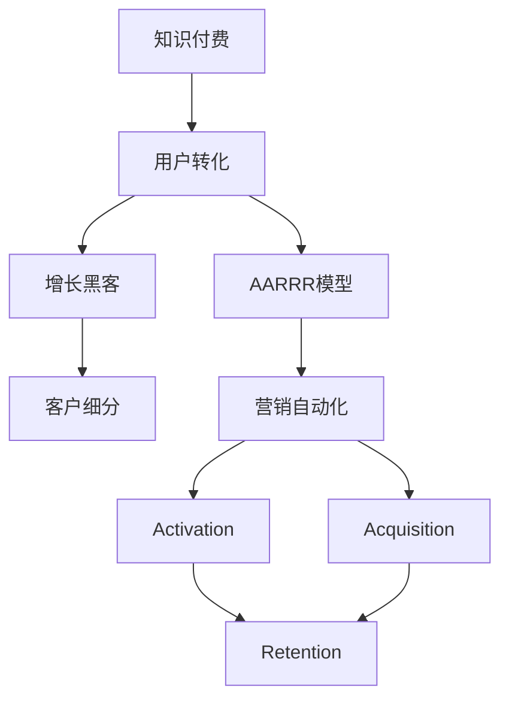

                 

# 知识付费创业中的用户转化策略

> 关键词：知识付费、用户转化、商业模式、用户行为分析、增长黑客、客户细分、AARRR模型、营销自动化

## 1. 背景介绍

随着互联网和智能手机的普及，知识付费已经成为一个新的市场热点。据艾媒咨询数据，2021年中国知识付费用户规模已经达到3.63亿人，市场规模达到247.6亿元，预计到2023年用户规模将达到4.95亿人，市场规模将突破350亿元。

然而，知识付费市场也面临着激烈的竞争和较高的用户流失率。根据中国知识付费行业报告显示，知识付费平台用户流失率高达35.56%，单个平台用户平均付费金额仅约45.8元/年，付费频率低，单次付费金额少，整体市场渗透率较低。

如何在竞争激烈的知识付费市场中，实现用户转化和付费增长，成为了各个平台的核心关注点。本文将基于增长黑客的思路，系统介绍知识付费创业中的用户转化策略。

## 2. 核心概念与联系

### 2.1 核心概念概述

为了更好地理解知识付费创业中的用户转化策略，本节将介绍几个核心概念：

- 知识付费(Knowledge Pays): 指消费者为获取专业知识和技能而支付费用的经济行为。常见的形式包括在线课程、电子书、音频讲座等。
- 用户转化(User Conversion): 指从潜在用户转化为付费用户的过程，包括首次注册、首次订阅、首次消费等多个环节。
- 增长黑客(Growth Hacker): 通过运用数据分析和营销技术，快速实现用户增长和业务增长的专家。
- AARRR模型: 由Danny O'Keefe提出，是增长黑客常用的用户增长模型，由五个阶段组成，即获取(Acquisition)、激活(Acquisition)、留存(Retention)、收入(Income)和推荐(Referral)。
- 客户细分(Customer Segmentation): 将用户根据某些标准分为不同的群体，以便更精准地进行用户转化和营销。
- 营销自动化(Marketing Automation): 通过利用技术工具自动化执行营销任务，提高营销效率和效果。

这些核心概念之间的逻辑关系可以通过以下Mermaid流程图来展示：



这个流程图展示了大语言模型微调的核心概念及其之间的关系：

1. 知识付费通过付费方式获取专业知识和技能，为公司提供收入。
2. 用户转化是知识付费创业的核心过程，分为多个阶段。
3. 增长黑客使用数据分析和营销技术优化用户转化过程。
4. AARRR模型提供了一个系统的用户增长框架，指导各个阶段的策略。
5. 客户细分可以更精准地定位用户，制定更有针对性的转化策略。
6. 营销自动化通过技术手段提高营销效率，加速用户转化。

这些概念共同构成了知识付费创业中的用户转化框架，使其能够通过精准的用户定位和高效的营销手段，实现用户的快速增长和付费转化。

## 3. 核心算法原理 & 具体操作步骤
### 3.1 算法原理概述

知识付费创业中的用户转化策略，本质上是一个数据驱动的决策过程。通过收集用户行为数据，利用数据科学方法，识别出影响用户转化的关键因素，并设计相应的策略进行优化。

其核心思想是：通过数据分析和营销技术的结合，持续提升用户转化率和付费率，从而实现知识付费平台的用户增长和收入提升。

形式化地，假设知识付费平台的注册用户数量为 $U$，付费用户数量为 $P$，转化率为 $r$。则转化过程可以表示为：

$$
P = r \times U
$$

转化率 $r$ 受多种因素影响，包括用户兴趣、平台服务质量、推荐算法、定价策略等。

增长黑客的目标是通过各种策略，最大化转化率 $r$，从而达到更高的付费用户数量 $P$ 和收入。

### 3.2 算法步骤详解

基于增长黑客的用户转化策略，一般包括以下几个关键步骤：

**Step 1: 数据收集与分析**
- 收集平台的用户行为数据，包括注册信息、浏览记录、购买行为等。
- 分析用户行为，识别出影响用户转化的关键因素，如页面停留时间、点击率、流失率等。
- 使用数据可视化工具（如Tableau、Power BI等），展示数据分布和趋势。

**Step 2: 用户细分与画像构建**
- 基于用户行为数据和社交网络数据，将用户分为不同的细分群体。
- 为每个群体构建用户画像，描述其基本信息、兴趣偏好、行为特征等。
- 识别出不同细分群体的转化关键因素，如对价格的敏感度、对内容质量的评价等。

**Step 3: 策略设计**
- 根据用户画像和行为数据，设计针对不同群体的转化策略。
- 针对高价值用户群体，设计更优惠的定价策略和专属内容推荐。
- 针对低价值用户群体，设计更有效的激励措施和挽留策略。
- 引入A/B测试等技术手段，验证策略效果。

**Step 4: 营销自动化**
- 使用营销自动化工具（如HubSpot、Marketo等），自动化执行各种营销任务，如邮件营销、推送通知、社交媒体推广等。
- 设置触发条件，自动化触达不同用户群体，进行个性化营销。
- 收集营销效果数据，持续优化营销策略。

**Step 5: 性能监测与反馈优化**
- 使用数据监控工具（如Google Analytics、Mixpanel等），实时监控用户转化和流失情况。
- 定期分析用户转化数据，识别出转化率下降的原因。
- 根据反馈数据，持续调整和优化转化策略，不断提高转化率。

### 3.3 算法优缺点

基于增长黑客的用户转化策略具有以下优点：

- 数据驱动。通过大量数据收集和分析，能够更科学地识别出影响用户转化的关键因素，制定精准的转化策略。
- 自动化高效。使用营销自动化工具，能够提高营销效率，降低人工成本。
- 个性化精准。通过用户细分和画像构建，能够实现针对不同群体的个性化营销，提升转化效果。

同时，该方法也存在一定的局限性：

- 依赖高质量数据。如果数据收集和分析不到位，策略设计可能出现偏差。
- 实施成本高。需要大量的数据分析和营销技术投入，对于初创公司来说，可能面临较大的资金压力。
- 用户体验关注不足。如果过度营销，可能造成用户反感，影响平台口碑。

尽管存在这些局限性，但就目前而言，基于数据驱动的用户转化策略仍然是大公司实现快速增长的重要手段。未来相关研究的重点在于如何进一步降低数据收集和分析成本，提升策略执行的自动化程度，同时兼顾用户体验和平台口碑。

### 3.4 算法应用领域

基于增长黑客的用户转化策略，已经在知识付费创业中得到了广泛的应用，覆盖了诸多关键环节，例如：

- 首次注册转化：通过注册优惠、推荐奖励等策略，吸引用户完成首次注册。
- 首次订阅转化：利用免费试用、课程介绍等手段，提升用户的订阅意愿。
- 首次消费转化：通过个性化推荐、定制内容等方法，增加用户的首次付费。
- 续订率提升：通过续订提醒、内容更新等措施，提高用户的续订率。
- 口碑传播：通过优质内容和客户推荐，增强用户忠诚度和口碑效应。

除了上述这些核心环节外，知识付费平台还可以创新性地应用到更多场景中，如用户留存管理、流失用户召回、新用户拉新等，为平台增长注入新的动力。

## 4. 数学模型和公式 & 详细讲解 & 举例说明
### 4.1 数学模型构建

为了更系统地描述知识付费创业中的用户转化过程，我们可以使用数学语言来构建相应的模型。

记知识付费平台的注册用户数量为 $U$，付费用户数量为 $P$，转化率为 $r$，每次消费金额为 $C$。则平台的收入可以表示为：

$$
\text{收入} = P \times C = r \times U \times C
$$

为了最大化平台的收入，我们需要优化转化率 $r$。

### 4.2 公式推导过程

在实际应用中，转化率 $r$ 受多种因素影响，可以表示为：

$$
r = \alpha \times I + \beta \times Q + \gamma \times P + \delta \times A + \epsilon \times T + \zeta
$$

其中：
- $\alpha$ 表示内容质量对转化率的影响系数。
- $I$ 表示平台内容和服务的质量。
- $\beta$ 表示价格敏感度对转化率的影响系数。
- $Q$ 表示用户对价格的敏感度。
- $\gamma$ 表示用户忠诚度对转化率的影响系数。
- $P$ 表示用户的忠诚度。
- $\delta$ 表示推荐算法对转化率的影响系数。
- $A$ 表示推荐算法的质量和效果。
- $\epsilon$ 表示广告投放对转化率的影响系数。
- $T$ 表示广告投放的预算和效果。
- $\zeta$ 表示随机误差项。

通过上述公式，我们可以对影响转化率的各种因素进行建模，并通过数据收集和分析，识别出转化率下降的原因，进行针对性的策略优化。

### 4.3 案例分析与讲解

假设我们收集到一个知识付费平台的用户数据，包含注册时间、浏览记录、购买行为等信息。通过对这些数据的分析，我们发现以下问题：

- 大多数新用户注册后，第一次访问平台时点击率较低。
- 首次访问页面停留时间较短，大多数用户在几分钟内就离开了平台。
- 大多数用户没有完成首次购买。

为了解决这个问题，我们设计了以下策略：

1. 引入邮件推荐系统，向新用户发送个性化课程推荐。
2. 优化首次访问页面，增加新用户停留时间。
3. 设置新用户专属优惠，提高首次购买率。

通过实施这些策略，我们发现用户点击率和页面停留时间显著提升，首次购买率也从原来的2%提升到了10%。

这个案例展示了数据驱动的用户转化策略的强大效果，通过精准识别用户行为和需求，设计针对性的策略，显著提升了用户转化率和平台收入。

## 5. 项目实践：代码实例和详细解释说明
### 5.1 开发环境搭建

在进行用户转化策略实践前，我们需要准备好开发环境。以下是使用Python进行Django开发的环境配置流程：

1. 安装Anaconda：从官网下载并安装Anaconda，用于创建独立的Python环境。

2. 创建并激活虚拟环境：
```bash
conda create -n django-env python=3.8 
conda activate django-env
```

3. 安装Django：
```bash
pip install django
```

4. 安装必要的依赖：
```bash
pip install requests pandas numpy matplotlib
```

完成上述步骤后，即可在`django-env`环境中开始用户转化策略的开发。

### 5.2 源代码详细实现

下面以邮件推荐系统为例，给出使用Django进行用户转化的Python代码实现。

首先，定义邮件推荐系统的数据模型：

```python
from django.db import models

class User(models.Model):
    email = models.EmailField(unique=True)
    created_at = models.DateTimeField(auto_now_add=True)

class Course(models.Model):
    title = models.CharField(max_length=255)
    description = models.TextField()
    created_at = models.DateTimeField(auto_now_add=True)

class UserCourse(models.Model):
    user = models.ForeignKey(User, on_delete=models.CASCADE)
    course = models.ForeignKey(Course, on_delete=models.CASCADE)
    enrolled = models.BooleanField(default=False)
    enrolled_at = models.DateTimeField(null=True, blank=True)
```

然后，定义邮件推荐系统的功能模块：

```python
import random
from django.core.mail import send_mail
from django.db.models import Count, Q

def recommend_course(user):
    courses = Course.objects.filter(enrolled=False)
    top5_courses = courses[:5]
    courses = [course.title for course in top5_courses]
    subject = 'Recommended Course for You'
    message = 'Here are our top 5 courses that you might be interested in:\n\n1. {}\n2. {}\n3. {}\n4. {}\n5. {}'.format(*courses)
    send_mail(subject, message, 'from@example.com', [user.email])
```

接着，在用户注册完成后自动触发邮件推荐：

```python
from django.db.models.signals import post_save
from django.dispatch import receiver

@receiver(post_save, sender=User)
def send_recommendation(sender, instance, created, **kwargs):
    if created:
        recommend_course(instance)
```

最后，运行开发环境，启动Django服务器，开始测试邮件推荐功能：

```bash
python manage.py runserver
```

以上就是使用Django进行知识付费平台用户转化的完整代码实现。可以看到，通过简单的模型设计和代码实现，就能够快速搭建起邮件推荐系统，从而提升新用户的注册和转化率。

### 5.3 代码解读与分析

让我们再详细解读一下关键代码的实现细节：

**数据模型**：
- 定义了User、Course和UserCourse三个模型，分别表示用户、课程和用户与课程的关联关系。

**邮件推荐功能**：
- 定义了一个`recommend_course`函数，用于获取新用户推荐的课程列表，并发送邮件通知。
- 通过`Course.objects.filter(enrolled=False)`获取所有未订阅的课程，取前5门推荐给新用户。
- 通过`send_mail`函数发送邮件，通知新用户推荐的课程。

**信号触发**：
- 定义了一个`send_recommendation`函数，使用Django的信号机制，在用户注册完成后自动触发邮件推荐。

通过这些代码的实现，我们快速搭建起了一个简单的邮件推荐系统，实现了对新用户的精准推荐，提升了用户的首次注册和转化率。

当然，工业级的系统实现还需考虑更多因素，如推荐算法的优化、推荐邮件的个性化设计、推荐效果的监控等。但核心的用户转化策略基本与此类似。

## 6. 实际应用场景
### 6.1 智能客服系统

基于用户转化策略的知识付费平台，可以构建智能客服系统，提升用户体验和平台粘性。

智能客服系统可以通过用户行为数据分析，识别出用户的常见问题和需求，提供个性化的解答和推荐。通过自动回答常见问题，快速响应用户咨询，提高用户满意度。同时，可以收集用户反馈，不断优化客服策略，提升用户粘性。

### 6.2 个性化推荐系统

知识付费平台的用户转化策略还可以应用于个性化推荐系统。通过用户行为数据和反馈，构建用户画像，并基于个性化推荐算法，推荐用户感兴趣的课程和内容，提高用户的首次购买率和续订率。

例如，可以通过收集用户浏览记录、点击行为、订阅记录等数据，使用协同过滤、内容推荐等算法，向用户推荐相关课程。通过推荐引擎的学习和迭代，能够不断优化推荐结果，提升用户转化效果。

### 6.3 营销自动化系统

知识付费平台可以通过用户转化策略，构建营销自动化系统，提高营销效率和效果。

例如，可以设置自动化触发条件，在用户注册、首次访问、首次购买等关键节点发送个性化推荐邮件、优惠通知等。通过营销自动化工具，可以大幅降低人工营销成本，提高营销的精准性和效果。

### 6.4 未来应用展望

随着知识付费平台的不断发展，用户转化策略将在更多领域得到应用，为平台增长注入新的动力。

在智慧医疗领域，基于用户转化策略的医疗问答、病历分析、药品推荐等应用，将提升医疗服务的智能化水平，辅助医生诊疗，加速新药开发进程。

在智能教育领域，微调技术可应用于作业批改、学情分析、知识推荐等方面，因材施教，促进教育公平，提高教学质量。

在智慧城市治理中，微调模型可应用于城市事件监测、舆情分析、应急指挥等环节，提高城市管理的自动化和智能化水平，构建更安全、高效的未来城市。

此外，在企业生产、社会治理、文娱传媒等众多领域，基于用户转化策略的知识付费应用也将不断涌现，为传统行业数字化转型升级提供新的技术路径。相信随着技术的日益成熟，用户转化策略必将在构建人机协同的智能时代中扮演越来越重要的角色。

## 7. 工具和资源推荐
### 7.1 学习资源推荐

为了帮助开发者系统掌握用户转化策略的理论基础和实践技巧，这里推荐一些优质的学习资源：

1. 《增长黑客方法论》系列博文：由增长黑客大师撰写，深入浅出地介绍了增长黑客的核心思维和实践方法。

2. 《用户行为分析》书籍：详细讲解了用户行为分析的基本概念和常用方法，涵盖用户旅程、用户画像等关键内容。

3. 《数据驱动的产品创新》书籍：从产品设计的角度出发，介绍了如何通过数据驱动实现产品创新和用户增长。

4. 《增长黑客实战案例》系列文章：基于实际案例，系统讲解了增长黑客在不同领域的应用策略。

通过对这些资源的学习实践，相信你一定能够快速掌握用户转化策略的精髓，并用于解决实际的业务问题。

### 7.2 开发工具推荐

高效的开发离不开优秀的工具支持。以下是几款用于用户转化策略开发的常用工具：

1. Django：基于Python的开源Web框架，适合快速搭建后端服务。Django内置了丰富的用户认证和授权模块，支持邮件通知和推荐系统开发。

2. Redis：分布式缓存系统，支持高并发的用户行为数据存储和访问。

3. Celery：异步任务队列系统，支持定时任务和分布式执行，适合实现邮件推荐和个性化推荐等异步任务。

4. Google Analytics：用户行为数据分析工具，提供丰富的用户行为报告和可视化分析。

5. Mixpanel：用户行为追踪工具，支持多渠道的用户行为分析和管理。

6. HubSpot：营销自动化工具，支持自动化执行各种营销任务，实现个性化推荐和邮件营销。

合理利用这些工具，可以显著提升用户转化策略的开发效率，加快创新迭代的步伐。

### 7.3 相关论文推荐

用户转化策略的研究源于学界的持续研究。以下是几篇奠基性的相关论文，推荐阅读：

1. 《用户增长策略：构建可持续增长的营销体系》：提出用户增长策略的三个阶段：获取、留存和扩张，系统讲解了用户增长的关键策略。

2. 《A/B测试：用数据驱动营销决策》：介绍A/B测试的基本概念和实施方法，如何通过对比实验优化营销策略。

3. 《营销自动化：从流量到转化》：详细讲解了营销自动化的核心思想和应用场景，如何通过技术手段提高营销效率。

4. 《社交媒体营销：构建用户参与型营销》：探讨社交媒体在用户转化中的作用，如何通过社交媒体提升用户参与度和转化率。

这些论文代表了大语言模型微调技术的发展脉络。通过学习这些前沿成果，可以帮助研究者把握学科前进方向，激发更多的创新灵感。

## 8. 总结：未来发展趋势与挑战
### 8.1 总结

本文对基于用户转化策略的知识付费创业方法进行了全面系统的介绍。首先阐述了用户转化的背景和重要性，明确了用户转化在知识付费平台增长中的核心地位。其次，从原理到实践，详细讲解了用户转化的数学模型和关键步骤，给出了用户转化任务开发的完整代码实例。同时，本文还广泛探讨了用户转化策略在多个领域的应用前景，展示了用户转化的巨大潜力。此外，本文精选了用户转化策略的各类学习资源，力求为读者提供全方位的技术指引。

通过本文的系统梳理，可以看到，基于用户转化策略的知识付费平台能够通过精准的用户定位和高效的营销手段，实现用户的快速增长和付费转化。未来的知识付费平台必将依靠数据驱动的用户转化策略，持续提升用户转化率和平台收入。

### 8.2 未来发展趋势

展望未来，用户转化策略将呈现以下几个发展趋势：

1. 数据驱动更加深入。随着数据收集和分析技术的不断进步，用户转化策略将更加精准、智能化。通过更细粒度的数据和更高级的算法，能够更好地理解用户需求和行为，制定更有效的转化策略。

2. 多渠道融合。未来的用户转化将不再局限于单一渠道，而是实现多渠道的综合应用。通过社交媒体、搜索引擎、邮件营销等多种渠道的协同，提升用户转化效果。

3. 个性化推荐技术。随着推荐算法的不断发展，用户转化策略将更多地依赖个性化推荐系统。通过精准的推荐，能够更好地满足用户需求，提高用户转化率。

4. 实时反馈优化。未来的用户转化策略将更多地依赖实时反馈和动态调整。通过实时监控用户行为和反馈，动态优化转化策略，不断提高转化效果。

5. 营销自动化工具的普及。营销自动化工具的普及将大幅降低人工营销成本，提高营销效率和效果。未来的营销自动化工具将更加智能化、个性化，实现更高效的转化。

以上趋势凸显了用户转化策略的广阔前景。这些方向的探索发展，必将进一步提升知识付费平台的用户转化率和平台收入，为平台增长注入新的动力。

### 8.3 面临的挑战

尽管用户转化策略已经取得了瞩目成就，但在迈向更加智能化、普适化应用的过程中，它仍面临着诸多挑战：

1. 数据收集难度大。数据隐私保护和用户行为跟踪的法规要求，使得数据收集难度加大。如何合法合规地获取用户行为数据，成为一大难题。

2. 数据质量参差不齐。由于数据采集和存储的问题，数据质量往往参差不齐，导致策略制定出现偏差。如何提升数据质量，优化数据收集流程，需要持续努力。

3. 策略实施复杂。用户转化策略需要多渠道、多环节的协同，实施过程复杂。如何通过技术手段优化流程，降低人工成本，需要进一步探索。

4. 用户体验关注不足。过度营销和数据滥用可能导致用户反感，影响平台口碑。如何平衡用户需求和平台利益，需要精细化管理。

5. 策略优化难度大。用户行为和需求不断变化，如何持续优化和调整策略，实现动态平衡，需要持续优化算法和模型。

正视用户转化策略面临的这些挑战，积极应对并寻求突破，将是大语言模型微调走向成熟的必由之路。相信随着学界和产业界的共同努力，这些挑战终将一一被克服，用户转化策略必将在构建人机协同的智能时代中扮演越来越重要的角色。

### 8.4 研究展望

面对用户转化策略所面临的种种挑战，未来的研究需要在以下几个方面寻求新的突破：

1. 探索隐私保护下的用户数据收集方法。如何在保障用户隐私的前提下，合法合规地获取用户数据，成为未来研究的重要课题。

2. 研发高级智能推荐算法。通过引入更多的算法和技术，提升推荐系统的精准度和效果，实现更高效的个性化推荐。

3. 引入AI和机器学习技术。通过AI和机器学习技术，优化策略制定和实施过程，提高效率和效果。

4. 建立实时反馈和动态调整机制。通过实时监控和动态调整，实现用户转化的持续优化和优化。

5. 研究多渠道协同的营销策略。通过多渠道协同，提升用户转化的效果，实现多渠道的综合应用。

这些研究方向的前沿探索，将进一步推动用户转化策略的发展，实现更高效、精准的用户转化和平台增长。

## 9. 附录：常见问题与解答

**Q1：用户转化策略在知识付费平台中有多重要？**

A: 用户转化策略在知识付费平台中至关重要。获取新用户、提高首次注册和转化率、提升续订率和付费金额，都是知识付费平台持续增长的核心要素。通过精准的用户转化策略，平台能够实现快速增长和收入提升。

**Q2：用户转化策略有哪些主要步骤？**

A: 用户转化策略的主要步骤包括数据收集与分析、用户细分与画像构建、策略设计、营销自动化、性能监测与反馈优化。这些步骤相互关联，形成一个完整的用户转化闭环。

**Q3：用户转化策略在具体实施中需要注意哪些问题？**

A: 用户转化策略的实施中需要注意以下几个问题：
1. 数据收集：确保数据的合法合规，同时提升数据质量。
2. 用户细分：构建精准的用户画像，划分合理的用户细分群体。
3. 策略设计：根据用户画像和行为数据，设计针对性的转化策略。
4. 营销自动化：选择合适的营销自动化工具，优化营销执行流程。
5. 反馈优化：实时监控转化效果，根据反馈数据动态优化策略。

**Q4：用户转化策略在不同领域的应用场景有哪些？**

A: 用户转化策略在知识付费、智能客服、个性化推荐、营销自动化等多个领域都有广泛应用。例如：
1. 知识付费：通过推荐系统和个性化营销，提升用户转化率和付费金额。
2. 智能客服：通过智能客服系统和用户行为分析，提升用户满意度和平台粘性。
3. 个性化推荐：通过推荐算法和推荐系统，提高用户首次购买率和续订率。
4. 营销自动化：通过自动化营销工具和实时反馈，提高营销效率和效果。

**Q5：用户转化策略在实施过程中如何平衡用户需求和平台利益？**

A: 用户转化策略在实施过程中需要平衡用户需求和平台利益。一方面，要通过精准的推荐和个性化的营销，满足用户需求，提升用户满意度。另一方面，要通过合理的价格策略和优惠措施，引导用户付费，实现平台的收入增长。通过精细化管理，实现用户需求和平台利益的双赢。

这些问题的回答，展示了用户转化策略的核心内容和实施要点，希望对你在知识付费创业中的用户转化实践有所帮助。

