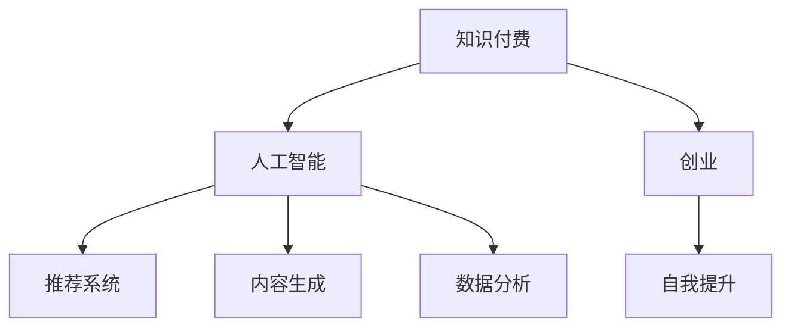

                 

# 知识付费创业者的自我提升策略

> 关键词：知识付费, 人工智能, 创业, 自我提升, 营销策略, 内容创作

## 1. 背景介绍

随着互联网和数字技术的飞速发展，知识付费平台如雨后春笋般涌现，知识创业者也成为新的风口。在这个时代，如何提升自我，抢占市场先机，成为每一位创业者面临的重要课题。本文将从技术、市场、内容等多方面，为知识付费创业者提供全面的自我提升策略。

## 2. 核心概念与联系

### 2.1 核心概念概述

为了更好地理解如何提升知识付费创业者的自我能力，本节将介绍几个核心概念：

- **知识付费**：通过互联网平台提供知识服务，用户需支付一定费用获取有价值的内容。知识付费改变了传统的“先消费后服务”的商业模式，成为数字化时代的新宠。
- **人工智能(AI)**：以深度学习为代表的AI技术，正被广泛应用于知识付费领域，如推荐系统、内容生成、数据分析等，大幅提升了用户体验和运营效率。
- **创业**：指创立新企业、创新商业模式，寻找市场机会的过程。知识付费作为新兴领域，蕴含着巨大的市场潜力和技术挑战。
- **自我提升**：指创业者不断学习、反思、优化自身能力和资源，以适应市场变化，推动企业发展的过程。

这些概念之间的关系可以通过以下Mermaid流程图来展示：



这个流程图展示了几大核心概念及其之间的关系：

1. 知识付费作为应用场景，推动了人工智能等技术的广泛应用。
2. 创业需要创业者不断提升自身能力，以应对市场和技术的复杂变化。
3. 推荐系统、内容生成、数据分析等AI技术，为知识付费创业者提供了强大的技术支撑。

## 3. 核心算法原理 & 具体操作步骤
### 3.1 算法原理概述

知识付费创业者的自我提升，本质上是一个通过持续学习和实践，优化自身能力和资源的过程。其核心思想是：利用AI技术提升内容质量和用户体验，同时通过市场调研和数据反馈，不断优化商业模式和运营策略，从而实现企业的持续发展和创新。

### 3.2 算法步骤详解

以下是知识付费创业者进行自我提升的具体操作步骤：

**Step 1: 市场调研与定位**

- 分析目标用户群体，了解其需求、偏好、行为特征。
- 研究竞争对手，评估市场趋势和机会。
- 确定自身的核心竞争力和市场定位，制定明确的战略目标。

**Step 2: 技术应用与创新**

- 引入AI技术，提升内容推荐、生成、分析的精度和效率。
- 应用机器学习算法，对用户行为数据进行深度挖掘，优化用户体验。
- 通过大数据和云计算技术，构建数据驱动的决策支持系统。

**Step 3: 内容创作与优化**

- 持续学习，提升自身专业能力和知识水平。
- 定期更新和优化课程内容，确保其时效性和实用性。
- 与专家学者合作，引入前沿知识和研究成果。

**Step 4: 运营与市场营销**

- 利用社交媒体和SEO策略，提升内容曝光率和用户转化率。
- 通过数据分析，调整内容和运营策略，提升用户粘性和满意度。
- 引入SaaS技术，实现产品服务的可扩展性和灵活性。

**Step 5: 评估与反馈**

- 定期评估产品和服务的效果，收集用户反馈。
- 根据市场变化和用户需求，动态调整战略和运营策略。
- 持续改进，实现自我迭代和升级。

### 3.3 算法优缺点

知识付费创业者进行自我提升的算法方法，具有以下优点：

1. **效率高**：利用AI和大数据技术，可以快速获取和分析大量用户数据，指导内容生产和运营决策。
2. **灵活性强**：通过持续学习和自我迭代，能够适应市场变化，快速调整策略。
3. **用户体验好**：AI技术的应用可以提升内容推荐和生成的精准度，提高用户满意度。

同时，该方法也存在以下局限性：

1. **依赖数据质量**：数据的质量和完整性直接影响AI算法的准确性和效果。
2. **技术门槛高**：需要较强的技术背景和资源投入，才能有效应用AI技术。
3. **用户体验风险**：过度依赖AI可能导致内容同质化，降低用户体验。
4. **成本较高**：初期技术应用和数据收集成本较高，需要持续投入。

尽管存在这些局限性，但整体而言，AI技术在知识付费领域的应用，为创业者提供了强大的工具和方法，显著提升了创业成功率。

### 3.4 算法应用领域

基于自我提升的算法方法，在知识付费领域已得到广泛应用，具体包括：

- **推荐系统**：通过分析用户行为数据，个性化推荐课程和内容，提高用户转化率。
- **内容生成**：利用自然语言处理技术，自动生成课程大纲、回答用户问题等，提升内容创作效率。
- **数据分析**：应用机器学习算法，分析用户数据，发现用户需求和行为特征，优化运营策略。
- **运营管理**：利用大数据和云计算技术，进行用户行为分析，优化产品和服务，提高用户粘性。
- **营销推广**：通过社交媒体和搜索引擎优化(SEO)，提升课程曝光率和用户转化率。

## 4. 数学模型和公式 & 详细讲解 & 举例说明

### 4.1 数学模型构建

本节将使用数学语言对知识付费创业者的自我提升策略进行更加严格的刻画。

假设知识付费平台的总用户数为 $N$，其中活跃用户数为 $N_a$，课程总数为 $C$，总收益为 $R$。令 $u_i$ 表示第 $i$ 个课程的用户评分，$c_j$ 表示第 $j$ 个课程的点击率，$p_k$ 表示第 $k$ 个用户的行为数据（如访问时长、购买次数等）。

定义知识付费平台的综合评分 $S$ 为所有课程评分的平均值：

$$ S = \frac{1}{C}\sum_{i=1}^C u_i $$

用户转化率 $T$ 定义为购买课程的用户占比：

$$ T = \frac{N_a}{N} $$

用户平均收益 $A$ 为总收益除以总用户数：

$$ A = \frac{R}{N} $$

根据上述定义，构建知识付费平台的数学模型：

$$ R = N_a \times A \times T $$

该模型反映了用户转化率和平均收益对平台总收益的影响。

### 4.2 公式推导过程

以下我们以用户转化率为例，推导用户转化率的计算公式：

假设用户点击课程 $j$ 的概率为 $c_j$，购买课程的概率为 $p_j$，则用户点击但不购买的概率为 $1 - p_j$。在一定时间内，用户点击课程的总次数为 $N_a \times c_j$，购买课程的总次数为 $N_a \times p_j$。

根据定义，用户转化率 $T$ 为购买课程的用户占比：

$$ T = \frac{N_a \times p_j}{N_a \times c_j} = \frac{p_j}{c_j} $$

通过这个公式，可以看出用户转化率受点击率和购买率的影响。因此，提升用户点击率和购买率，是提高用户转化率的关键。

### 4.3 案例分析与讲解

以在线教育平台为例，应用上述数学模型进行分析：

假设平台共有1000门课程，平均每门课程的点击率为0.5，用户点击课程后购买的概率为0.2。若平台的活跃用户数为1000，则总收益为：

$$ R = 1000 \times 0.2 \times \frac{0.2}{0.5} = 800 $$

通过分析，可以发现提升用户点击率和购买率，可以显著提高平台的总收益。利用AI和大数据技术，平台可以精准推荐用户感兴趣的课程，提高点击率。同时，通过数据分析，优化购买路径和用户体验，提升购买率。

## 5. 项目实践：代码实例和详细解释说明
### 5.1 开发环境搭建

在进行自我提升策略实践前，我们需要准备好开发环境。以下是使用Python进行数据分析和机器学习开发的环境配置流程：

1. 安装Anaconda：从官网下载并安装Anaconda，用于创建独立的Python环境。

2. 创建并激活虚拟环境：
```bash
conda create -n my_env python=3.8 
conda activate my_env
```

3. 安装必要的库：
```bash
conda install numpy pandas scikit-learn matplotlib
```

4. 安装机器学习库：
```bash
pip install scikit-learn
```

完成上述步骤后，即可在`my_env`环境中进行数据分析和机器学习的实践。

### 5.2 源代码详细实现

以下是一个简单的用户行为分析项目，使用Scikit-learn进行机器学习建模：

```python
from sklearn.model_selection import train_test_split
from sklearn.linear_model import LogisticRegression
from sklearn.metrics import accuracy_score
from sklearn.preprocessing import StandardScaler

# 假设数据为 pandas DataFrame
X = df.drop('购买', axis=1)
y = df['购买']

# 标准化处理
scaler = StandardScaler()
X_scaled = scaler.fit_transform(X)

# 分割训练集和测试集
X_train, X_test, y_train, y_test = train_test_split(X_scaled, y, test_size=0.2, random_state=42)

# 训练模型
model = LogisticRegression()
model.fit(X_train, y_train)

# 预测并评估
y_pred = model.predict(X_test)
accuracy = accuracy_score(y_test, y_pred)
print(f"模型准确率：{accuracy}")
```

通过上述代码，我们可以看到如何从数据预处理、模型训练到评估的完整流程。

### 5.3 代码解读与分析

让我们再详细解读一下关键代码的实现细节：

**数据处理**：
- `drop`方法：删除不需要的特征列。
- `StandardScaler`：对特征数据进行标准化处理，使其符合正态分布。

**模型训练**：
- `train_test_split`：将数据集分为训练集和测试集。
- `LogisticRegression`：建立逻辑回归模型。

**评估与优化**：
- `accuracy_score`：计算模型预测的准确率。
- 模型评估：通过准确率等指标，了解模型的性能，进行优化调整。

**机器学习实践**：
- 数据处理：通过特征选择、归一化、降维等方法，提升模型性能。
- 模型训练：选择合适的算法和超参数，进行交叉验证等优化。
- 模型评估：通过混淆矩阵、ROC曲线等指标，综合评价模型性能。

## 6. 实际应用场景

### 6.1 在线教育平台

在线教育平台是知识付费创业者的典型代表。通过利用AI和大数据技术，平台可以实现以下功能：

- **推荐系统**：根据用户的历史学习行为，推荐感兴趣课程，提升学习效果和转化率。
- **内容生成**：利用自然语言处理技术，自动生成课程大纲、答案，提高内容创作效率。
- **数据分析**：应用机器学习算法，分析用户数据，优化课程内容和运营策略，提升用户粘性和满意度。

### 6.2 职业培训平台

职业培训平台专注于提升职业技能，帮助用户获得职业发展所需的知识和技能。应用AI技术，可以提升以下方面：

- **课程推荐**：根据用户职业背景和需求，推荐适合的课程和学习路径。
- **学习效果评估**：利用数据分析，评估学习效果，提供个性化反馈和建议。
- **知识图谱**：建立知识图谱，帮助用户构建知识体系，提升学习效率。

### 6.3 在线咨询平台

在线咨询平台为用户提供专家咨询服务，解决用户在工作和生活中遇到的各种问题。应用AI技术，可以实现：

- **问题分类**：通过自然语言处理，自动分类用户问题，提高服务效率。
- **专家推荐**：根据用户需求，推荐合适的专家进行咨询。
- **知识库**：建立知识库，收集和整理专家解答，提供检索和参考。

### 6.4 未来应用展望

伴随AI技术的不断进步，知识付费创业者的自我提升策略将不断演进，应用场景也将更加丰富。未来，我们预计以下领域将迎来重大突破：

1. **个性化推荐**：通过深度学习和推荐系统，实现高度个性化的内容推荐，提升用户体验。
2. **跨领域融合**：将AI技术与其他技术进行整合，如区块链、物联网、增强现实等，拓展知识付费的边界。
3. **情感计算**：应用情感分析技术，提升用户情感识别和情感互动，增强平台粘性。
4. **边缘计算**：利用边缘计算技术，提高数据处理效率和响应速度，提升用户体验。

这些应用场景展示了AI技术在知识付费领域的巨大潜力和未来发展方向，为创业者提供了广阔的想象空间。

## 7. 工具和资源推荐
### 7.1 学习资源推荐

为了帮助知识付费创业者系统掌握相关知识和技能，这里推荐一些优质的学习资源：

1. **Coursera**：提供众多在线课程，涵盖数据科学、机器学习、商业分析等多个领域。
2. **edX**：提供来自全球顶尖高校的在线课程，涵盖计算机科学、人工智能、商业管理等多个方向。
3. **Kaggle**：数据科学竞赛平台，提供丰富的数据集和竞赛，帮助用户提升实战能力。
4. **Scikit-learn官方文档**：提供详细的机器学习库使用手册，帮助用户深入理解各种算法和技术。
5. **TensorFlow官方文档**：提供深度学习框架的使用指南，帮助用户构建和优化模型。

通过这些资源的学习实践，相信你一定能够快速掌握知识付费创业所需的技术知识和技能，提升自己的竞争力。

### 7.2 开发工具推荐

高效的开发离不开优秀的工具支持。以下是几款用于知识付费平台开发的常用工具：

1. **Jupyter Notebook**：开源的交互式数据科学环境，支持Python、R等多种语言。
2. **TensorFlow**：由Google主导开发的深度学习框架，生产部署方便，适合大规模工程应用。
3. **PyTorch**：基于Python的开源深度学习框架，灵活动态，适合快速迭代研究。
4. **Scikit-learn**：简单易用的机器学习库，包含各种算法和数据处理工具。
5. **Pandas**：数据分析和处理工具，支持多维数据结构，灵活高效。

合理利用这些工具，可以显著提升知识付费平台的开发效率，加快创新迭代的步伐。

### 7.3 相关论文推荐

知识付费创业者的自我提升策略涉及多个前沿技术和理论，以下是几篇奠基性的相关论文，推荐阅读：

1. **《深度学习在知识图谱中的应用》**：介绍深度学习在知识图谱中的运用，提升知识推荐和检索效果。
2. **《基于用户行为的数据驱动推荐系统》**：探讨用户行为数据在推荐系统中的重要性，提升推荐效果。
3. **《个性化学习路径设计》**：通过机器学习算法，设计个性化学习路径，提升学习效果和用户体验。
4. **《情感分析在客户服务中的应用》**：介绍情感分析技术在客户服务中的应用，提升用户满意度和粘性。
5. **《在线教育平台的数据驱动运营》**：探讨数据驱动的在线教育平台运营策略，提升平台收益和用户粘性。

这些论文代表了大数据和AI技术在知识付费领域的研究进展，为创业者提供了宝贵的理论指导。

## 8. 总结：未来发展趋势与挑战

### 8.1 总结

本文对知识付费创业者的自我提升策略进行了全面系统的介绍。首先阐述了知识付费的发展背景和AI技术的广泛应用，明确了自我提升在推动企业发展中的重要性。其次，从技术、市场、内容等多方面，详细讲解了知识付费创业者如何进行自我提升，包括技术应用、内容创作、运营优化等环节。

通过本文的系统梳理，可以看到，知识付费创业者通过利用AI技术提升自我能力，可以有效应对市场和技术的复杂变化，提升企业的竞争力和市场地位。未来，伴随AI技术的不断进步，知识付费平台将迎来更加智能、高效、个性化的服务体验，为社会带来更加深远的影响。

### 8.2 未来发展趋势

展望未来，知识付费领域的自我提升策略将呈现以下几个发展趋势：

1. **技术驱动的智能化**：AI和大数据技术的不断应用，将推动知识付费平台的智能化水平不断提升。

2. **数据驱动的个性化**：通过深度学习和大数据分析，实现高度个性化的内容推荐和服务，提升用户体验。

3. **跨领域的融合**：AI技术与其他技术的融合，如物联网、区块链、增强现实等，将拓展知识付费的边界，带来新的商业模式和应用场景。

4. **情感计算的应用**：通过情感分析技术，提升用户情感识别和情感互动，增强平台粘性和用户满意度。

5. **知识图谱的构建**：建立知识图谱，帮助用户构建知识体系，提升学习效率和效果。

这些趋势展示了知识付费领域的广阔前景，为创业者提供了更多的发展机会和创新空间。

### 8.3 面临的挑战

尽管知识付费领域的自我提升策略在不断演进，但在迈向更加智能化、普适化应用的过程中，它仍面临诸多挑战：

1. **技术门槛高**：需要较强的技术背景和资源投入，才能有效应用AI技术，提升自身能力。

2. **数据质量风险**：数据的质量和完整性直接影响AI算法的准确性和效果，需要持续关注和优化。

3. **用户体验风险**：过度依赖AI可能导致内容同质化，降低用户体验，需要持续优化和改进。

4. **成本高**：初期技术应用和数据收集成本较高，需要持续投入，难以大规模推广。

5. **伦理和安全问题**：AI算法可能存在偏见和歧视，需要加强伦理和安全控制，保护用户隐私和数据安全。

这些挑战需要创业者在实践中不断探索和应对，才能推动知识付费平台健康发展。

### 8.4 研究展望

未来的知识付费领域需要更多的创新和突破，以下是几个值得关注的研究方向：

1. **智能推荐系统**：通过深度学习和推荐系统，实现高度个性化的内容推荐，提升用户体验。

2. **知识图谱和内容管理**：构建知识图谱，提升内容质量和用户学习效率。

3. **情感计算和用户互动**：应用情感分析技术，提升用户情感识别和情感互动，增强平台粘性。

4. **隐私保护和数据安全**：加强隐私保护和数据安全措施，确保用户数据安全。

5. **多模态学习**：结合图像、音频、文本等多模态数据，提升学习效果和用户体验。

6. **跨领域融合**：将AI技术与其他技术进行整合，如区块链、物联网、增强现实等，拓展知识付费的边界。

这些研究方向的探索，将推动知识付费平台向更加智能、高效、个性化的方向发展，为社会带来更加深远的影响。

## 9. 附录：常见问题与解答

**Q1：如何提升知识付费平台的用户转化率？**

A: 提升用户转化率的关键在于精准推荐和优质内容。通过AI技术，可以分析用户行为数据，生成个性化推荐，提高点击率和购买率。同时，优化课程内容和形式，提升用户体验，降低流失率。

**Q2：如何优化知识付费平台的用户体验？**

A: 用户体验是知识付费平台的核心竞争力之一。通过自然语言处理和推荐系统，实现高度个性化的内容推荐，提升学习效果。应用情感分析技术，增强用户互动和情感共鸣，提升粘性。同时，构建知识图谱，帮助用户构建知识体系，提升学习效率。

**Q3：知识付费创业者如何持续提升自我能力？**

A: 持续学习和自我提升是知识付费创业者的必修课。通过参加在线课程、阅读专业书籍、参与技术社区等途径，不断更新自己的知识体系。同时，关注市场动态和新技术，持续优化和改进产品和服务，保持竞争优势。

**Q4：如何利用AI技术提升知识付费平台的运营效率？**

A: AI技术在知识付费平台的运营中具有广泛应用。通过推荐系统提升用户转化率，应用自然语言处理技术提升内容创作效率，利用数据分析优化运营策略，实现智能化运营。

这些问题的解答展示了知识付费创业者在技术、市场、内容等多方面的自我提升策略，为创业者提供了全面的参考和指导。

---

作者：禅与计算机程序设计艺术 / Zen and the Art of Computer Programming

