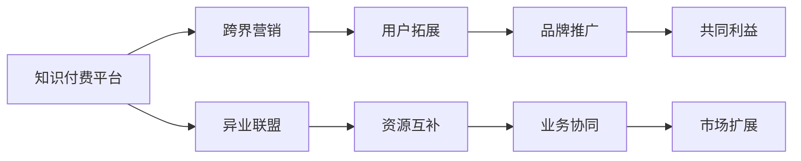

                 

# 知识付费如何实现跨界营销与异业联盟？

## 1. 背景介绍

随着互联网时代的到来，知识付费已经成为一个快速增长的市场。在各大知识付费平台，如得到、喜马拉雅、荔枝微课等，用户付费订阅内容、享受优质知识的趋势愈发明显。知识付费不仅满足了用户对信息需求的不断增长，也帮助创作者和机构在互联网经济中找到了新的盈利模式。

在知识付费的快速发展过程中，跨界营销和异业联盟成为平台和创作者寻求新的增长点的重要手段。一方面，跨界营销能够帮助知识付费平台和内容创作者扩大用户群体，拓展市场空间；另一方面，异业联盟则通过与各行业的合作，实现资源的互补和共赢，提升品牌价值。

本文将从知识付费的跨界营销与异业联盟的原理、操作步骤、具体案例及未来发展趋势等方面进行深入探讨，帮助平台和创作者更好地实现商业价值和用户价值的双重提升。

## 2. 核心概念与联系

### 2.1 核心概念概述

在探讨知识付费的跨界营销与异业联盟时，需要理解以下关键概念：

- **知识付费**：基于互联网技术，用户通过付费方式获取知识和信息，实现高质量内容的分发和消费。
- **跨界营销**：不同行业之间通过资源共享、共同推广等方式，实现互利共赢。
- **异业联盟**：不同行业企业或机构之间的战略合作，通过资源整合，实现业务协同和品牌共赢。

### 2.2 核心概念原理和架构的 Mermaid 流程图



## 3. 核心算法原理 & 具体操作步骤

### 3.1 算法原理概述

知识付费平台的跨界营销与异业联盟，本质上是一种以用户为中心的营销策略。通过将知识付费平台与不同行业进行整合，实现资源共享和品牌协同，从而扩大用户基础，提升品牌影响力。

### 3.2 算法步骤详解

#### 3.2.1 需求分析

首先需要对知识付费平台的目标用户进行分析，确定其需求和兴趣点。这包括用户的年龄、职业、教育背景、消费习惯等。

#### 3.2.2 合作伙伴选择

根据用户需求，选择具有相关资源和用户基础的行业合作伙伴。如教育、医疗、金融、文化等领域的企业和机构。

#### 3.2.3 整合资源

整合知识付费平台与合作伙伴的资源，包括课程内容、用户数据、营销渠道等。这可以通过API接口、数据共享等方式实现。

#### 3.2.4 跨界营销活动设计

根据整合的资源，设计跨界营销活动，如联合推广、共同举办线上线下活动、共同推出专属课程等。

#### 3.2.5 效果评估

通过用户数据、课程订阅量、用户反馈等指标，评估跨界营销与异业联盟的效果，并根据反馈进行优化调整。

### 3.3 算法优缺点

#### 3.3.1 优点

1. **用户拓展**：通过与其他行业的合作，可以触及更广泛的潜在用户群体，提升平台的知名度和用户量。
2. **资源互补**：跨界合作能够带来资源整合，实现资源的最优配置和利用。
3. **品牌提升**：联合推广和活动能够增强品牌的影响力，提升用户的忠诚度和粘性。

#### 3.3.2 缺点

1. **成本投入**：跨界合作需要投入一定的资源和成本，如活动策划、数据整合等。
2. **协调难度**：不同行业之间的合作协调可能存在一定难度，需要较高的沟通和管理能力。
3. **用户适应**：跨界营销需要确保用户能够接受和理解跨界活动，避免产生逆反心理。

### 3.4 算法应用领域

跨界营销与异业联盟的应用领域非常广泛，可以应用于以下场景：

- **教育行业**：与学校、培训机构合作，推出联合课程，共享教学资源。
- **医疗行业**：与医院、健康管理公司合作，推出健康类课程，提供专业医学知识。
- **金融行业**：与银行、保险机构合作，推出理财类课程，提升用户理财水平。
- **文化行业**：与博物馆、剧院合作，推出文化类课程，丰富用户文化生活。

## 4. 数学模型和公式 & 详细讲解 & 举例说明

### 4.1 数学模型构建

知识付费平台的跨界营销与异业联盟可以通过以下数学模型进行量化分析：

设知识付费平台的目标用户量为 $U$，合作伙伴的潜在用户量为 $V$，跨界营销后的总用户量为 $W$。

则有：

$$
W = U + V - \Delta
$$

其中 $\Delta$ 表示由于合作伙伴间的协同作用，导致用户流失的部分。

### 4.2 公式推导过程

通过上述模型，可以得出跨界营销对平台用户量的影响。假设合作伙伴的用户流失率为 $\alpha$，则：

$$
\Delta = \alpha (U + V)
$$

代入公式，得：

$$
W = U + V - \alpha (U + V) = (1 - \alpha) (U + V)
$$

这表明，跨界营销可以有效提升平台的总用户量，但需要控制合作伙伴的用户流失率。

### 4.3 案例分析与讲解

以知识付费平台与银行合作推出理财课程为例：

- **需求分析**：银行客户对理财知识的需求量大，但缺乏高效、系统的学习渠道。
- **合作伙伴选择**：选择与银行合作，利用银行的客户资源和渠道优势。
- **整合资源**：银行提供客户数据和推广渠道，平台提供课程内容和知识服务。
- **跨界营销活动设计**：银行举办线下理财讲座，平台推出线上理财课程，联合推广。
- **效果评估**：通过银行客户数据，评估理财课程的订阅量和用户反馈，优化课程内容和推广策略。

通过这种跨界营销，平台可以引入银行的用户流量，提升理财课程的订阅量，同时银行也能够提升品牌影响力，增加客户黏性。

## 5. 项目实践：代码实例和详细解释说明

### 5.1 开发环境搭建

在进行知识付费平台的跨界营销与异业联盟实践前，需要搭建好开发环境。以下是Python开发环境搭建的流程：

1. 安装Python：从官网下载并安装Python 3.x版本，确保环境配置正确。
2. 安装必要的第三方库：如Flask、Django、Flask-SQLAlchemy等，用于搭建Web应用和数据库连接。
3. 安装API接口：如RESTful API接口，用于跨平台数据交互。
4. 安装数据分析库：如Pandas、NumPy、Matplotlib等，用于数据分析和可视化。

### 5.2 源代码详细实现

以下是一个简单的知识付费平台与银行合作的代码实现示例：

```python
# 导入必要的库
from flask import Flask, request, jsonify
import pandas as pd

# 初始化Flask应用
app = Flask(__name__)

# 加载数据
data = pd.read_csv('bank_data.csv')

# 定义API接口
@app.route('/bank', methods=['POST'])
def bank_api():
    # 接收银行推送的客户数据
    customer_data = request.json

    # 根据客户需求，推荐理财课程
    recommendations = recommend_course(customer_data)

    # 返回推荐结果
    return jsonify(recommendations)

# 推荐课程
def recommend_course(customer_data):
    # 分析客户数据，提取关键特征
    features = extract_features(customer_data)

    # 加载课程数据
    courses = pd.read_csv('courses.csv')

    # 计算相似度
    similarity = calculate_similarity(features, courses)

    # 排序推荐课程
    recommendations = sort_recommendations(similarity)

    return recommendations

# 特征提取
def extract_features(customer_data):
    # 提取客户的关键特征
    # ...

# 相似度计算
def calculate_similarity(features, courses):
    # 计算特征向量之间的相似度
    # ...

# 推荐排序
def sort_recommendations(similarity):
    # 根据相似度排序推荐课程
    # ...

# 启动Flask应用
if __name__ == '__main__':
    app.run(debug=True)
```

### 5.3 代码解读与分析

**Flask框架**：
- 使用Flask框架搭建Web应用，提供RESTful API接口，接收银行推送的客户数据，返回推荐课程。

**数据处理**：
- 通过Pandas库加载银行客户数据和课程数据，提取客户的关键特征，计算特征之间的相似度，排序推荐课程。

**推荐算法**：
- 推荐算法可以根据客户数据特征和课程特征之间的相似度，计算推荐结果，并返回给银行。

### 5.4 运行结果展示

可以通过测试API接口，输入银行客户数据，验证推荐课程的功能和准确性。例如：

```python
# 测试API接口
import requests

# 发送POST请求
response = requests.post('http://localhost:5000/bank', json={'customer_id': '12345', 'age': 30, 'income': 50000})

# 解析响应
recommendations = response.json()

# 打印推荐结果
print(recommendations)
```

## 6. 实际应用场景

### 6.1 智慧教育

知识付费平台与教育机构的合作，可以推出各种教育类课程，如中小学教育、职业教育、成人教育等。通过跨界营销，可以借助教育机构的知名度和用户基础，快速扩大知识付费平台的市场影响力。

### 6.2 医疗健康

知识付费平台与医疗健康机构的合作，可以推出健康类课程，如健康饮食、心理健康、疾病预防等。通过跨界营销，可以借助医疗健康机构的权威性和专业性，提升平台的用户信任度。

### 6.3 文化旅游

知识付费平台与文化旅游机构的合作，可以推出文化旅游类课程，如历史文化、旅游攻略、艺术欣赏等。通过跨界营销，可以借助文化旅游机构的资源和渠道，吸引更多用户关注知识付费平台。

### 6.4 未来应用展望

随着知识付费市场的进一步成熟，跨界营销与异业联盟将越来越重要。未来，知识付费平台可以通过更多的跨界合作，实现业务的全面扩展和市场的多元化。

## 7. 工具和资源推荐

### 7.1 学习资源推荐

为了帮助开发者系统掌握知识付费平台的跨界营销与异业联盟的理论基础和实践技巧，以下是一些推荐的学习资源：

1. 《知识付费：如何利用技术驱动商业模式创新》：全面介绍了知识付费市场的背景、模式和商业模式创新方法。
2. 《互联网营销：跨界营销与异业联盟的实践》：深入探讨了跨界营销与异业联盟的原理和应用，提供了丰富的案例分析。
3. 《数据科学：机器学习在推荐系统中的应用》：介绍了机器学习算法在推荐系统中的应用，帮助开发者设计高效的推荐算法。
4. 《API设计规范》：详细讲解了API接口的设计规范，帮助开发者构建可扩展、可维护的API系统。
5. 《大数据分析：数据处理与可视化》：讲解了大数据分析的基本原理和常用工具，帮助开发者处理和分析大规模数据。

### 7.2 开发工具推荐

知识付费平台的跨界营销与异业联盟开发需要多种工具的支持。以下是几款常用的开发工具：

1. Flask：轻量级的Web框架，易于搭建RESTful API接口，支持Python开发。
2. Django：功能强大的Web框架，适合构建复杂的数据库应用。
3. SQLAlchemy：Python数据库ORM框架，提供灵活的数据库操作功能。
4. TensorFlow：开源机器学习框架，支持深度学习模型的构建和训练。
5. PyTorch：另一个流行的深度学习框架，支持动态图和静态图计算。

### 7.3 相关论文推荐

以下是几篇关于知识付费平台跨界营销与异业联盟的经典论文，推荐阅读：

1. 《知识付费平台跨界营销策略研究》：详细探讨了知识付费平台与教育、医疗、金融等行业的跨界合作策略。
2. 《异业联盟的理论与实践》：从理论角度分析了异业联盟的合作机制和效果评估方法。
3. 《推荐系统在知识付费平台中的应用》：介绍了推荐系统在知识付费平台中的设计和实现方法。
4. 《基于数据驱动的跨界营销策略》：利用数据科学方法，设计了跨界营销策略，并进行了实证分析。
5. 《知识付费平台的市场策略分析》：从市场角度分析了知识付费平台的营销策略和竞争优势。

## 8. 总结：未来发展趋势与挑战

### 8.1 总结

本文对知识付费平台的跨界营销与异业联盟进行了系统介绍，涵盖从理论到实践的各个方面。通过分析需求、选择合作伙伴、整合资源、设计活动、评估效果等步骤，全面展示了跨界营销与异业联盟的核心原理和操作步骤。

### 8.2 未来发展趋势

未来，知识付费平台的跨界营销与异业联盟将呈现以下几个发展趋势：

1. **数据驱动**：通过大数据分析，精准识别用户需求，优化跨界合作策略。
2. **技术融合**：结合人工智能、区块链等前沿技术，提升跨界营销的智能化和安全性。
3. **用户个性化**：利用推荐系统，实现用户的个性化推荐，提升用户体验和满意度。
4. **全球化扩展**：借助互联网技术，实现跨国家、跨地区的市场扩展。

### 8.3 面临的挑战

尽管跨界营销与异业联盟具有巨大的发展潜力，但在实际应用中仍面临以下挑战：

1. **数据隐私**：跨界合作需要共享用户数据，如何保护用户隐私，避免数据泄露，是重要问题。
2. **协同机制**：不同行业间的协同机制和利益分配需要协调，确保各方都能从合作中获益。
3. **用户适应**：跨界营销需要确保用户能够理解和接受新形式的服务，避免产生抵触情绪。
4. **效果评估**：如何科学评估跨界营销的效果，优化合作策略，是重要挑战。

### 8.4 研究展望

未来，知识付费平台的跨界营销与异业联盟需要在以下方面进行深入研究：

1. **数据隐私保护**：研究如何通过数据加密、匿名化等技术手段，保护用户数据隐私。
2. **协同机制优化**：设计更加灵活、高效的企业间协同机制，确保各方利益最大化。
3. **用户个性化推荐**：结合机器学习算法，实现更加精准、个性化的推荐服务。
4. **跨界营销效果评估**：研究更加科学的跨界营销效果评估方法，优化合作策略。

这些研究方向将推动知识付费平台的跨界营销与异业联盟向更加智能化、高效化的方向发展，为知识付费市场带来新的增长点。

## 9. 附录：常见问题与解答

**Q1：知识付费平台如何选择合作伙伴？**

A: 知识付费平台选择合作伙伴时，需要考虑以下因素：
- 合作伙伴的行业与平台业务是否相关
- 合作伙伴的用户群体是否与平台目标用户重叠
- 合作伙伴的资源是否能够互补平台的需求

**Q2：跨界营销与异业联盟的协同机制如何设计？**

A: 设计跨界营销与异业联盟的协同机制时，需要考虑以下因素：
- 确定各方的角色和职责
- 设计利益分配机制
- 制定合作目标和评估标准

**Q3：如何评估跨界营销与异业联盟的效果？**

A: 评估跨界营销与异业联盟的效果，可以通过以下指标：
- 用户增长率
- 课程订阅量
- 用户满意度
- 合作伙伴的反馈

通过这些指标，可以全面评估跨界营销与异业联盟的效果，并根据反馈进行优化调整。

**Q4：跨界营销与异业联盟的实施难点有哪些？**

A: 跨界营销与异业联盟的实施难点包括：
- 数据隐私保护
- 协同机制设计
- 用户适应性
- 效果评估

需要采取相应的措施，如数据加密、协同协议、用户教育等，克服这些难点，确保合作的顺利进行。

**Q5：知识付费平台如何进行跨界营销与异业联盟的资源整合？**

A: 知识付费平台进行跨界营销与异业联盟的资源整合时，需要考虑以下步骤：
- 确定各方资源
- 设计数据共享协议
- 实现API接口对接
- 进行资源整合和优化

通过这些步骤，可以实现知识付费平台与合作伙伴之间的资源整合，提升合作效果。

---

作者：禅与计算机程序设计艺术 / Zen and the Art of Computer Programming

