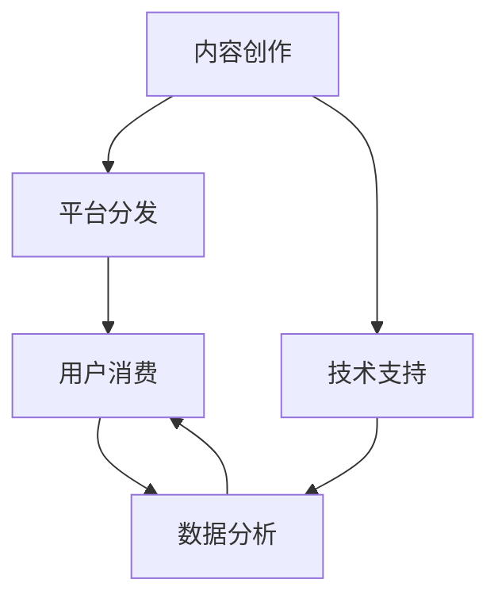

                 

# 知识付费要加强与产业链上下游的融合发展

在数字化时代，知识付费已经成为一个不可逆转的趋势。无论是在线教育、职业培训、内容创作，还是市场咨询、技术研发，知识付费都在各行业蓬勃发展，为人们提供了便利、高效、多元化的知识获取途径。然而，随着知识付费市场日益成熟，仅靠内容创作的单打独斗已难以为继。知识付费要持续发展，就必须加强与产业链上下游的融合发展，形成合力，才能更好地服务用户，实现商业价值的最大化。

## 1. 背景介绍

### 1.1 问题由来

知识付费的兴起，源于人们对优质知识的需求增长和获取渠道的数字化转型。早期知识付费主要通过线上讲座、付费阅读、付费咨询等形式，为需求者提供专业化的知识服务。但这些形式往往局限于特定领域，内容生产和消费难以形成闭环。随着知识付费市场的逐渐成熟，用户对知识内容的需求也更加多元化，涉及知识生产、内容分发、用户需求等环节的融合，已成为知识付费发展的必然要求。

### 1.2 问题核心关键点

知识付费产业链包括内容生产、平台分发、用户消费等环节，每个环节都有其独特价值，但它们之间又相互依存、互为条件。加强产业链上下游的融合发展，不仅能够提升知识产品的整体质量，还能拓展用户需求，实现商业模式的创新。

具体而言，知识付费产业的融合发展需要关注以下几个关键点：
1. **内容创作与用户需求的精准对接**：提高内容生产的针对性和实用性，确保知识产品的精准投放。
2. **平台分发与技术创新的深度结合**：借助技术手段优化分发流程，提升用户获取知识的效率和体验。
3. **消费体验与数据反馈的闭环管理**：通过数据分析优化内容推荐，提升用户满意度，同时反向推动内容优化和创新。

## 2. 核心概念与联系

### 2.1 核心概念概述

为更好地理解知识付费产业链上下游的融合发展，本节将介绍几个关键概念及其联系：

- **知识付费**：指用户通过付费获取知识产品，如在线课程、电子书、技术咨询等。知识付费帮助用户高效、系统地获取专业知识和技能，同时为创作者提供了稳定的收入来源。

- **内容创作**：指创作者利用专业知识，通过文字、音频、视频等形式，创作有价值的内容。内容创作是知识付费产业链的起点，决定了产品的质量和价值。

- **平台分发**：指通过在线平台将知识产品推送给用户。平台分发是知识付费产业链的重要环节，决定了用户获取知识的方式和效率。

- **用户消费**：指用户通过付费平台获取知识产品，并实际使用和应用。用户消费是知识付费产业链的终点，决定了产业链的盈利模式和用户粘性。

- **产业链上下游融合**：指知识付费产业链中的内容创作、平台分发、用户消费等环节，通过协同合作，实现技术、数据、服务等多维度的深度整合，形成一体化、高效、精准的知识服务体系。

这些概念之间的逻辑关系可以通过以下Mermaid流程图来展示：



这个流程图展示出知识付费产业链上下游的融合路径：

1. 内容创作者利用技术支持（如AI辅助创作、数据分析洞察等）进行内容创作。
2. 平台分发的技术优化（如推荐算法、流媒体技术等），帮助用户高效获取内容。
3. 用户消费体验的优化（如个性化推荐、支付便捷性等），提升用户满意度和粘性。
4. 数据分析的闭环管理（如消费行为分析、内容效果评估等），推动内容优化和商业模式创新。

## 3. 核心算法原理 & 具体操作步骤

### 3.1 算法原理概述

知识付费产业链上下游的融合发展，涉及算法驱动的内容推荐、用户行为分析、支付平台优化等多个方面。其中，推荐算法是最核心的技术手段之一，它通过分析用户历史行为和偏好，精准推荐相关内容，提高用户满意度和平台转化率。

推荐算法一般包括以下几个关键步骤：

1. **用户画像建模**：通过分析用户的历史行为、消费记录等，构建用户的兴趣模型，用于预测用户未来的行为和偏好。
2. **内容特征提取**：对知识产品进行特征提取，如文本关键词、标签、评分等，用于描述内容的核心特点。
3. **相似度计算**：根据用户画像和内容特征，计算用户与内容之间的相似度，筛选出最相关的内容进行推荐。
4. **实时更新与优化**：通过不断收集用户反馈和数据，动态调整推荐策略，优化推荐效果。

### 3.2 算法步骤详解

以下是推荐算法在知识付费平台上的具体操作步骤：

**Step 1: 数据收集与预处理**
- 收集用户的行为数据，如浏览记录、购买记录、评价等。
- 对数据进行清洗、去重、标准化处理，消除噪音数据，确保数据的质量和一致性。

**Step 2: 用户画像建模**
- 利用机器学习算法（如协同过滤、内容嵌入等）构建用户画像，描述用户的基本兴趣和偏好。
- 引入时间因素，考虑用户兴趣随时间变化的情况，动态更新用户画像。

**Step 3: 内容特征提取**
- 对知识产品进行特征提取，如提取文章关键词、课程标签、视频片段等。
- 利用自然语言处理(NLP)技术，如TF-IDF、Word2Vec等，对内容进行语义分析。

**Step 4: 相似度计算与推荐**
- 根据用户画像和内容特征，计算用户与内容之间的相似度。
- 利用排序算法（如协同过滤、矩阵分解等），对相似度进行排序，推荐最相关的知识产品。

**Step 5: 评估与优化**
- 通过A/B测试、用户满意度调查等方法，评估推荐效果。
- 根据反馈结果，优化推荐算法，调整参数设置，提升推荐精准度。

### 3.3 算法优缺点

推荐算法在知识付费平台上的应用，具有以下优点：
1. 提升用户体验：通过精准推荐，满足用户个性化需求，提升用户体验和满意度。
2. 提高转化率：精准推荐能够提高用户对知识产品的转化率，增加平台收入。
3. 数据驱动：推荐算法能够基于数据进行动态优化，持续提升推荐效果。

但推荐算法也存在一些局限性：
1. 数据依赖性强：推荐算法的效果高度依赖于数据的全面性和准确性，数据不全或噪声数据会影响推荐效果。
2. 冷启动问题：新用户或冷门内容缺乏足够的历史数据，难以进行精准推荐。
3. 协同过滤风险：推荐算法可能过于依赖其他用户的行为，导致信息泄露和隐私风险。
4. 算法透明性不足：用户难以理解推荐算法的决策过程，缺乏透明性和可解释性。

### 3.4 算法应用领域

推荐算法在知识付费平台上的应用非常广泛，涉及以下领域：

- **个性化推荐**：根据用户的历史行为，推荐个性化的知识产品。
- **新用户推荐**：为新用户推荐高质量内容，促使其快速转化。
- **内容发现**：帮助用户发现他们可能感兴趣但未接触过的知识产品。
- **商品搭配**：推荐相关商品或课程，增加附加值。
- **活动推广**：根据用户兴趣推荐相关活动或课程，提升活动参与度。

除了推荐算法，知识付费产业链上下游的融合发展还涉及多种技术手段，如数据分析、技术支持、支付平台优化等，下面将逐一介绍。

## 4. 数学模型和公式 & 详细讲解 & 举例说明

### 4.1 数学模型构建

推荐算法的数学模型构建，主要涉及以下几个部分：

- **用户兴趣模型**：
  - 用户画像建模：$u_{i,j}$ 表示用户$i$在特征$j$上的兴趣评分，$j$可以是关键词、评分、时间戳等。
  
- **内容特征模型**：
  - 内容嵌入：$c_{j,k}$ 表示内容$j$在特征$k$上的嵌入向量。
  
- **相似度计算**：
  - 用户-内容相似度：$s_{i,j} = \sum_{k} u_{i,k} \cdot c_{j,k}$。

### 4.2 公式推导过程

假设我们有一个用户$i$，对内容$j$有$n$个特征评分，内容$j$对特征$k$有$m$个嵌入向量，相似度计算公式如下：

$$
s_{i,j} = \sum_{k=1}^{m} c_{j,k} \cdot \sum_{n=1}^{n} u_{i,n} \cdot c_{n,k}
$$

其中 $u_{i,j}$ 表示用户$i$在特征$j$上的兴趣评分，$c_{j,k}$ 表示内容$j$在特征$k$上的嵌入向量，$s_{i,j}$ 表示用户$i$和内容$j$的相似度评分。

### 4.3 案例分析与讲解

假设我们要为用户$i$推荐内容$j_1$和$j_2$。根据上述相似度计算公式，我们可以先计算用户$i$和内容$j_1$、$j_2$的相似度评分：

$$
s_{i,j_1} = \sum_{k=1}^{m} c_{j_1,k} \cdot \sum_{n=1}^{n} u_{i,n} \cdot c_{n,k}
$$

$$
s_{i,j_2} = \sum_{k=1}^{m} c_{j_2,k} \cdot \sum_{n=1}^{n} u_{i,n} \cdot c_{n,k}
$$

然后，根据相似度评分对内容进行排序，选择前$k$个相关度最高的内容进行推荐。这里 $k$ 可以是用户画像和内容特征的维度，也可以是预定义的阈值。

## 5. 项目实践：代码实例和详细解释说明

### 5.1 开发环境搭建

在进行知识付费推荐系统的开发前，我们需要准备好开发环境。以下是使用Python进行推荐系统开发的常见环境配置流程：

1. 安装Anaconda：从官网下载并安装Anaconda，用于创建独立的Python环境。

2. 创建并激活虚拟环境：
```bash
conda create -n recommender-env python=3.8 
conda activate recommender-env
```

3. 安装相关库：
```bash
pip install pandas numpy scikit-learn tqdm
```

4. 安装机器学习库：
```bash
pip install xgboost lightgbm catboost
```

5. 安装推荐算法库：
```bash
pip install recommendations
```

完成上述步骤后，即可在`recommender-env`环境中开始推荐系统开发。

### 5.2 源代码详细实现

以下是一个简单的推荐系统实现代码示例，使用Python编写，基于协同过滤算法进行推荐：

```python
import pandas as pd
import numpy as np
from sklearn.metrics.pairwise import cosine_similarity
from sklearn.model_selection import train_test_split

# 读入数据
data = pd.read_csv('user_item_data.csv')

# 数据预处理
user_ids = data['user_id'].unique()
item_ids = data['item_id'].unique()
user_item_matrix = np.zeros((len(user_ids), len(item_ids)))
for i, user_id in enumerate(user_ids):
    for j, item_id in enumerate(item_ids):
        user_item_matrix[i, j] = data[(data['user_id'] == user_id) & (data['item_id'] == item_id)]['rating'].values[0]

# 拆分数据集
train_data, test_data = train_test_split(user_item_matrix, test_size=0.2, random_state=42)

# 计算相似度矩阵
similarity_matrix = cosine_similarity(train_data)

# 推荐模型
def predict(user_id, n_recommendations=10):
    user_index = user_ids.index(user_id)
    similarities = similarity_matrix[user_index]
    recommendations = []
    for i, item_index in enumerate(item_ids):
        recommendations.append((item_ids[i], similarities[i]))
    recommendations.sort(key=lambda x: -x[1])
    return recommendations[:n_recommendations]

# 测试推荐模型
user_id = '123456'
recommendations = predict(user_id)
print('推荐内容：', [item_id for item_id, _ in recommendations])
```

这段代码首先读入用户-物品评分数据，并进行预处理和特征提取，然后基于协同过滤算法计算相似度矩阵，最后根据相似度排序推荐前$n$个物品。

### 5.3 代码解读与分析

**数据预处理**：
- 首先，我们读取用户-物品评分数据，并提取出所有用户和物品的唯一标识。
- 然后，使用Numpy库初始化一个用户-物品评分矩阵，将用户-物品评分数据填充到矩阵中。

**数据拆分**：
- 使用Scikit-Learn库中的train_test_split方法，将评分矩阵拆分为训练集和测试集。

**相似度计算**：
- 使用Scikit-Learn库中的cosine_similarity方法，计算训练集的相似度矩阵。

**推荐模型**：
- 定义一个推荐函数predict，根据用户ID和推荐数量n_recommendations，返回前n_recommendations个物品的推荐列表。
- 在推荐函数中，首先获取用户ID在用户列表中的索引，然后从相似度矩阵中取出该用户的所有物品相似度。
- 根据相似度从高到低排序，获取前n_recommendations个物品的索引和相似度。
- 返回按照相似度排序的推荐物品列表。

**测试推荐模型**：
- 最后，我们测试推荐函数，传入用户ID，并输出推荐列表。

可以看到，这个简单的推荐系统代码实现，通过协同过滤算法，实现了基于用户行为数据的推荐功能。在实际应用中，还需要根据业务需求进行进一步优化，如引入时间因素、用户画像建模、多算法融合等。

## 6. 实际应用场景

### 6.1 智能教育平台

在智能教育平台中，推荐系统帮助用户根据其学习进度和兴趣，推荐相应的课程和练习，提高学习效果和效率。同时，平台也可以根据用户的学习数据，进行个性化推荐和辅导，提升用户体验和满意度。

### 6.2 在线咨询系统

在线咨询平台通过推荐系统，为用户推荐相关领域的专家和咨询问题，帮助用户快速找到匹配的咨询师。此外，平台还可以根据用户历史咨询记录，进行个性化推荐，提升服务质量和用户粘性。

### 6.3 内容推荐系统

内容推荐系统广泛应用于新闻、视频、音乐等平台，通过推荐系统，平台能够根据用户的浏览、收藏、评论等行为，推荐用户可能感兴趣的内容，提升用户粘性和活跃度。

### 6.4 未来应用展望

随着推荐算法的不断优化和完善，知识付费平台将能够提供更加精准、个性化的内容推荐服务。未来，推荐系统将在以下几个方面实现突破：

1. **跨领域推荐**：打破知识付费平台的界限，整合更多行业领域的知识产品，进行跨领域推荐。
2. **深度学习应用**：引入深度学习算法，如RNN、LSTM等，提高推荐模型的复杂度和精度。
3. **实时推荐**：通过实时数据分析和动态调整，实现实时推荐，满足用户即时需求。
4. **冷启动优化**：针对新用户和冷门内容，引入更多数据驱动的推荐策略，提高推荐效果。
5. **隐私保护**：增强隐私保护机制，确保用户数据的安全和透明。

## 7. 工具和资源推荐

### 7.1 学习资源推荐

为了帮助开发者系统掌握推荐系统理论基础和实践技巧，这里推荐一些优质的学习资源：

1. 《推荐系统实践》书籍：陈毅达所著，全面介绍了推荐系统的原理、算法和工程实践。
2. Coursera《推荐系统》课程：由斯坦福大学教授讲授，涵盖推荐系统的基本概念和经典算法。
3. Kaggle推荐系统竞赛：参加Kaggle的推荐系统竞赛，实践推荐算法，提升实战能力。
4. GitHub推荐系统代码库：收录了大量开源推荐系统的代码，可以参考和学习。

通过对这些资源的学习实践，相信你一定能够快速掌握推荐系统的精髓，并用于解决实际的推荐问题。

### 7.2 开发工具推荐

高效的开发离不开优秀的工具支持。以下是几款用于推荐系统开发的常用工具：

1. PyTorch：基于Python的开源深度学习框架，适合推荐算法的实现和优化。
2. TensorFlow：由Google主导开发的开源深度学习框架，支持分布式训练和部署。
3. Scikit-Learn：Python的机器学习库，提供了丰富的推荐算法实现，如协同过滤、矩阵分解等。
4. Jupyter Notebook：开源的交互式编程环境，方便代码调试和结果展示。

合理利用这些工具，可以显著提升推荐系统开发的效率，加快创新迭代的步伐。

### 7.3 相关论文推荐

推荐系统的发展源于学界的持续研究。以下是几篇奠基性的相关论文，推荐阅读：

1. "Collaborative Filtering for Implicit Feedback Datasets"：Liu et al.，提出基于隐式反馈数据的协同过滤算法。
2. "Item-based Collaborative Filtering"：Sarwar et al.，提出基于物品的协同过滤算法。
3. "Feature-Rich Collaborative Filtering with Matrix Factorization"：Liu et al.，提出基于矩阵分解的协同过滤算法。
4. "Neural Collaborative Filtering"：He et al.，提出基于神经网络的协同过滤算法。

这些论文代表了大数据推荐技术的发展脉络。通过学习这些前沿成果，可以帮助研究者把握学科前进方向，激发更多的创新灵感。

## 8. 总结：未来发展趋势与挑战

### 8.1 总结

本文对知识付费产业链上下游的融合发展进行了全面系统的介绍。首先阐述了知识付费产业链的关键环节及其关系，明确了产业链上下游融合的必要性和目标。其次，从算法原理到实际应用，详细讲解了推荐算法的构建和优化过程，给出了推荐系统开发的完整代码实现。同时，本文还探讨了推荐系统在智能教育、在线咨询、内容推荐等领域的广泛应用，展示了知识付费平台的巨大潜力。此外，本文精选了推荐系统的各类学习资源，力求为读者提供全方位的技术指引。

通过本文的系统梳理，可以看到，知识付费产业链上下游的融合发展已经成为行业共识，各大平台纷纷布局。推荐算法作为其中的关键技术，不仅提升了用户体验和平台转化率，还推动了知识付费产业的持续创新和升级。未来，随着推荐算法的不断优化和完善，知识付费平台必将在用户获取知识、创造价值等方面发挥更加重要的作用。

### 8.2 未来发展趋势

展望未来，知识付费产业链上下游的融合发展将呈现以下几个趋势：

1. **智能化推荐**：通过引入深度学习、自然语言处理等技术，提升推荐算法的复杂度和精度，实现更加智能化、精准化的推荐。
2. **个性化推荐**：基于用户画像和行为数据，进行深度分析和建模，提供更加个性化的知识推荐服务。
3. **跨平台融合**：打破平台界限，实现跨平台、跨领域的知识资源整合和推荐，提升资源利用率。
4. **数据驱动决策**：通过大数据分析，实时监控用户行为和反馈，优化推荐策略，提高用户体验。
5. **隐私保护和伦理**：引入隐私保护技术，确保用户数据安全，同时建立透明的伦理标准，保障推荐系统的公正性和可解释性。

这些趋势凸显了知识付费产业链上下游融合的广阔前景。这些方向的探索发展，必将进一步提升推荐系统的性能和应用范围，为知识付费产业带来新的商业价值和社会影响。

### 8.3 面临的挑战

尽管知识付费产业链上下游的融合发展已经取得了一定的成果，但在迈向更加智能化、普适化应用的过程中，仍面临诸多挑战：

1. **数据质量和安全**：推荐系统高度依赖高质量的数据，但数据收集、清洗、标注等环节存在困难，且用户隐私保护成为重要问题。
2. **算法复杂度**：深度学习等复杂算法需要大量计算资源，如何高效实现和优化，是当前的主要技术难题。
3. **冷启动问题**：新用户或冷门内容缺乏足够的数据，难以进行精准推荐，需要引入更多数据驱动的推荐策略。
4. **跨领域融合**：不同领域的内容质量和用户需求差异大，跨领域推荐难度高。
5. **伦理和公平性**：推荐系统可能存在偏见和歧视，如何确保公平性和透明性，是一个重要的伦理问题。

这些挑战需要通过技术创新和行业规范来解决，才能实现知识付费产业链上下游的深度融合，提升整体竞争力。

### 8.4 研究展望

未来的知识付费产业链上下游融合研究，需要在以下几个方面进行探索：

1. **数据治理和隐私保护**：建立规范的数据治理机制，确保数据质量和安全，同时提升隐私保护技术。
2. **算法优化和模型融合**：探索更多高效、智能的推荐算法，实现多算法融合，提升推荐精度和效率。
3. **用户画像建模**：通过深度学习和NLP技术，构建更加全面、精准的用户画像，提升个性化推荐效果。
4. **跨领域内容整合**：引入知识图谱、专家系统等技术，实现跨领域知识的整合和推荐，提升资源利用率。
5. **算法透明性和可解释性**：研究推荐算法的透明性和可解释性，提升用户信任度，保障推荐系统的公平性和公正性。

这些研究方向的探索，必将引领知识付费产业链上下游的融合发展，推动智能推荐系统的进步，为知识付费产业带来更多商业机会和创新可能。

## 9. 附录：常见问题与解答

**Q1：推荐系统如何根据用户行为进行个性化推荐？**

A: 推荐系统通过分析用户的历史行为数据，构建用户画像模型，描述用户的基本兴趣和偏好。在推荐时，根据用户画像和物品特征，计算用户与物品之间的相似度，筛选出最相关的物品进行推荐。此外，推荐系统还可以引入实时数据，动态调整推荐策略，提升推荐效果。

**Q2：推荐算法是否需要大量的用户数据？**

A: 推荐算法的效果高度依赖于数据的质量和全面性。对于推荐系统来说，一般需要大量的用户行为数据，才能构建有效的用户画像和物品特征模型。但在实际应用中，可以通过数据增强、用户画像迁移等技术，提升推荐系统的鲁棒性和泛化能力。

**Q3：推荐系统如何处理冷启动问题？**

A: 冷启动问题是推荐系统面临的常见问题，可以通过以下方法来解决：
1. 引入用户画像迁移：利用已有用户的相似行为数据，推断新用户的兴趣。
2. 引入推荐模型训练：通过K近邻、内容嵌入等方法，提升推荐模型的泛化能力。
3. 引入知识图谱：利用知识图谱中的关系，推断新用户和物品之间的关系。

**Q4：推荐系统如何保证隐私和安全性？**

A: 推荐系统需要保证用户数据的安全和隐私，可以通过以下方法来实现：
1. 数据匿名化：对用户数据进行匿名化处理，确保数据隐私。
2. 数据加密：对用户数据进行加密存储和传输，防止数据泄露。
3. 访问控制：设置严格的数据访问权限，确保只有授权人员才能访问敏感数据。
4. 用户授权：在推荐过程中，告知用户数据的使用情况，并取得用户授权。

**Q5：推荐系统如何优化推荐效果？**

A: 推荐系统的优化可以从以下几个方面入手：
1. 数据优化：提升数据收集和处理的效率，确保数据质量和一致性。
2. 算法优化：引入更加复杂和高效的推荐算法，提升推荐精度和效率。
3. 模型融合：采用多算法融合的方法，提升推荐效果和鲁棒性。
4. 实时优化：利用实时数据，动态调整推荐策略，优化推荐效果。

这些优化方法需要根据具体业务需求进行灵活应用，才能实现推荐系统的持续改进和优化。

---

作者：禅与计算机程序设计艺术 / Zen and the Art of Computer Programming

