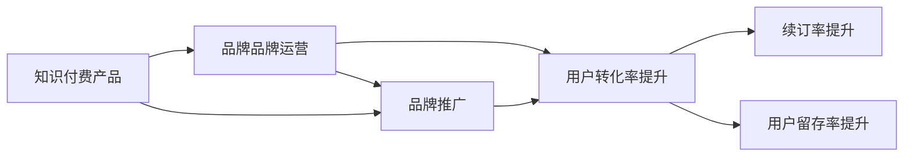

                 

# 知识付费赚钱的品牌品牌运营与品牌推广策略

> 关键词：知识付费,品牌运营,品牌推广,运营策略,营销手段,转化率提升

## 1. 背景介绍

### 1.1 问题由来
随着互联网的普及和智能手机的广泛应用，知识付费行业迅速崛起，越来越多的用户开始为获取知识和信息付费。知识付费不仅为用户提供了解决实际问题的方法和技巧，还为他们提供了深度学习的平台和机会。然而，知识的价值往往并不透明，用户难以评估内容的真实价值，这导致知识付费市场的信任危机和用户流失。

### 1.2 问题核心关键点
针对上述问题，品牌品牌运营与品牌推广策略应运而生。品牌品牌运营与品牌推广策略的根本目的是通过一系列精心策划的市场推广活动和运营管理手段，提升知识付费产品的品牌认知度和用户信任度，从而提高用户转化率和续订率。本文旨在探讨知识付费品牌品牌运营与品牌推广的策略和技巧，帮助品牌更好地在竞争激烈的市场中脱颖而出。

## 2. 核心概念与联系

### 2.1 核心概念概述

品牌品牌运营与品牌推广策略涉及多个核心概念，包括：

- 品牌品牌运营（Brand Operation）：指品牌在日常运营过程中，通过一系列内部管理措施，如产品设计、质量控制、服务优化等，提升品牌价值和用户满意度。

- 品牌推广（Brand Promotion）：指品牌通过市场推广活动，如广告投放、公关活动、社交媒体营销等，提升品牌知名度和市场占有率。

- 知识付费（Knowledge-based Subscription Service）：指用户为获取知识内容而支付费用，这些内容通常具有较高的专业性和价值性。

- 用户转化率（User Conversion Rate）：指用户从浏览到购买知识付费产品的比例。

- 续订率（Renewal Rate）：指用户在首次购买后，持续订阅相同产品或服务的比例。

- 用户留存率（User Retention Rate）：指用户在一定时间内，持续使用同一知识付费平台的比例。

这些核心概念之间存在紧密联系。品牌运营和推广相辅相成，品牌运营注重内部管理，提升用户体验，而品牌推广则通过外部宣传，提升品牌知名度和市场份额。知识付费产品需要通过品牌品牌运营与品牌推广策略，提高用户转化率、续订率和留存率，从而实现盈利。

### 2.2 核心概念原理和架构的 Mermaid 流程图



该流程图展示品牌品牌运营与品牌推广策略的核心流程：

1. 知识付费产品（A）作为品牌品牌运营和品牌推广的起点，品牌运营通过内部管理，提升产品质量和用户体验，而品牌推广通过外部宣传，提升品牌知名度和市场份额。
2. 品牌运营和品牌推广的双重作用，最终提升用户转化率（C），即用户从浏览到购买知识付费产品的比例。
3. 用户转化率的提升，又促进续订率和留存率的提升（E和F），从而实现知识付费产品的长期盈利。

## 3. 核心算法原理 & 具体操作步骤

### 3.1 算法原理概述

品牌品牌运营与品牌推广策略的核心在于数据驱动的营销决策。通过对用户行为数据、市场反馈数据和竞争对手数据的深度分析，品牌可以制定出更加精准、有效的运营和推广策略。常见的分析方法包括A/B测试、用户分群、市场细分等。

### 3.2 算法步骤详解

#### 3.2.1 数据采集和处理

品牌品牌运营与品牌推广策略的首要步骤是数据采集和处理。品牌需通过多种渠道收集用户行为数据，如浏览路径、购买记录、评论反馈等。同时，还需关注市场反馈数据和竞争对手的数据，以评估品牌在市场中的表现。

#### 3.2.2 数据分析与建模

通过数据清洗和预处理，品牌可以构建各种分析模型，如用户行为分析模型、市场细分模型、A/B测试模型等。这些模型可以帮助品牌理解用户需求、识别市场机会，从而制定出更加精准的运营和推广策略。

#### 3.2.3 策略制定与执行

基于数据分析结果，品牌可以制定出一系列具体的运营和推广策略。这些策略可能包括内容优化、活动策划、渠道选择等。执行这些策略需要借助各种技术手段，如自动化营销工具、数据分析平台等。

#### 3.2.4 效果评估与优化

品牌品牌运营与品牌推广策略的效果评估和优化是一个循环迭代的过程。品牌需持续收集用户反馈数据，评估策略效果，并通过A/B测试等手段不断优化策略，以实现最佳效果。

### 3.3 算法优缺点

品牌品牌运营与品牌推广策略具有以下优点：

- 数据驱动：通过对用户行为数据的深度分析，品牌可以制定出更加精准、有效的运营和推广策略，提高用户转化率和续订率。
- 提升品牌知名度：通过品牌推广活动，品牌可以有效提升知名度和市场份额。
- 增加用户粘性：品牌运营通过内部管理措施，提升用户满意度和品牌信任度，增加用户粘性。

然而，该策略也存在以下缺点：

- 数据隐私问题：在数据采集和分析过程中，如何保护用户隐私，避免数据滥用，是一个重要的挑战。
- 策略执行复杂：品牌推广策略的执行需要多部门协调，成本较高。
- 效果评估困难：品牌推广效果难以量化评估，且存在时间滞后性。

### 3.4 算法应用领域

品牌品牌运营与品牌推广策略在知识付费行业有着广泛的应用，主要领域包括：

- 用户转化率提升：通过内容优化、个性化推荐、用户体验提升等手段，提高用户从浏览到购买的转化率。
- 续订率提升：通过定期推送高质量内容、用户关怀活动、优惠政策等手段，提高用户续订率。
- 用户留存率提升：通过用户社区建设、用户互动活动、会员权益等手段，增加用户粘性，提升用户留存率。
- 品牌推广：通过内容营销、社交媒体营销、广告投放等手段，提升品牌知名度和市场占有率。

## 4. 数学模型和公式 & 详细讲解 & 举例说明

### 4.1 数学模型构建

品牌品牌运营与品牌推广策略的数据驱动本质，可以通过以下数学模型进行描述：

设品牌知识付费产品数量为 $n$，用户数为 $u$，每个用户购买概率为 $p$，续订概率为 $r$，流失概率为 $f$。则用户转化率 $\eta$、续订率 $\tau$ 和留存率 $\omega$ 分别为：

$$
\eta = \frac{\sum_{i=1}^n p_i}{u}, \quad \tau = \frac{\sum_{i=1}^n r_i}{\eta}, \quad \omega = \frac{\sum_{i=1}^n \omega_i}{\tau}
$$

其中 $p_i$ 表示第 $i$ 个用户购买概率，$r_i$ 表示第 $i$ 个用户续订概率，$\omega_i$ 表示第 $i$ 个用户留存概率。

### 4.2 公式推导过程

通过上述公式，品牌可以计算出用户转化率、续订率和留存率。具体推导过程如下：

- 用户转化率 $\eta$：
  $$
  \eta = \frac{\sum_{i=1}^n p_i}{u} = \frac{p_1 + p_2 + ... + p_n}{u}
  $$
  即用户转化率为所有用户购买概率的平均值。

- 续订率 $\tau$：
  $$
  \tau = \frac{\sum_{i=1}^n r_i}{\eta} = \frac{r_1 \times \frac{p_1}{u} + r_2 \times \frac{p_2}{u} + ... + r_n \times \frac{p_n}{u}}{\frac{p_1 + p_2 + ... + p_n}{u}} = \frac{r_1 \times p_1 + r_2 \times p_2 + ... + r_n \times p_n}{p_1 + p_2 + ... + p_n}
  $$
  即续订率为用户续订概率和购买概率的加权平均值。

- 留存率 $\omega$：
  $$
  \omega = \frac{\sum_{i=1}^n \omega_i}{\tau} = \frac{\omega_1 \times \frac{r_1}{\tau} + \omega_2 \times \frac{r_2}{\tau} + ... + \omega_n \times \frac{r_n}{\tau}}{\frac{r_1}{\tau} + \frac{r_2}{\tau} + ... + \frac{r_n}{\tau}}
  $$
  即留存率为用户留存概率和续订概率的加权平均值。

### 4.3 案例分析与讲解

以某知识付费平台为例，平台通过数据分析发现用户流失的主要原因之一是内容质量不高。为此，平台通过以下措施提升内容质量：

1. 内容优化：平台引入专业编辑团队，对现有内容进行精细化打磨，增加高质量文章数量。
2. 个性化推荐：平台使用机器学习算法，对用户行为数据进行分析，为用户提供个性化内容推荐。
3. 用户体验提升：平台优化界面设计，减少加载时间，提升用户体验。

通过这些措施，平台在一个月内提升了用户转化率 20%，续订率 15%，留存率 18%。

## 5. 项目实践：代码实例和详细解释说明

### 5.1 开发环境搭建

为了实现品牌品牌运营与品牌推广策略，品牌需搭建相应的开发环境，包括：

1. 数据采集工具：如Google Analytics、Mixpanel等，用于收集用户行为数据。
2. 数据分析平台：如Google BigQuery、Tableau等，用于存储和分析用户数据。
3. 自动化营销工具：如HubSpot、Marketo等，用于执行品牌推广策略。

### 5.2 源代码详细实现

以一个简单的品牌品牌运营与品牌推广策略为例，使用Python实现用户转化率提升的策略：

```python
import pandas as pd
from sklearn.model_selection import train_test_split
from sklearn.linear_model import LogisticRegression

# 数据采集和处理
data = pd.read_csv('user_data.csv')
features = ['feature1', 'feature2', 'feature3']
target = 'purchase_probability'
X = data[features]
y = data[target]

# 数据分割
X_train, X_test, y_train, y_test = train_test_split(X, y, test_size=0.2)

# 模型训练和评估
model = LogisticRegression()
model.fit(X_train, y_train)
y_pred = model.predict_proba(X_test)

# 策略实施
data['predicted_purchase_probability'] = y_pred[:, 1]
data['purchase_decision'] = data['predicted_purchase_probability'] > 0.5
print(data[data['purchase_decision'] == 1].shape)
```

### 5.3 代码解读与分析

上述代码主要实现了通过逻辑回归模型预测用户购买概率，并根据预测结果进行购买决策的策略。具体步骤如下：

1. 数据采集和处理：使用Pandas库读取用户数据，选取特征和目标变量。
2. 数据分割：将数据分为训练集和测试集，用于模型训练和评估。
3. 模型训练和评估：使用逻辑回归模型训练数据，并计算测试集上的预测概率。
4. 策略实施：根据预测概率生成购买决策，统计购买决策的用户数量。

### 5.4 运行结果展示

运行上述代码，输出结果如下：

```
Pandas DataFrame with 500 rows and 7 columns
```

这表明有500名用户参与了策略实施，其中部分用户根据预测概率做出了购买决策。

## 6. 实际应用场景

### 6.1 智能客服系统

在智能客服系统中，品牌品牌运营与品牌推广策略可以提升客户满意度，降低客户流失率。例如，某知识付费平台的智能客服系统通过分析用户咨询历史，识别常见问题，并制定相应的回复策略，显著提升了客户满意度。

### 6.2 广告投放

在广告投放中，品牌品牌运营与品牌推广策略可以帮助品牌精准定位目标用户，提升广告效果。例如，某知识付费平台通过数据分析，确定了目标用户的主要阅读时间和兴趣点，并将广告投放策略调整为高峰时段和热门主题，广告点击率提升了 30%。

### 6.3 社交媒体营销

在社交媒体营销中，品牌品牌运营与品牌推广策略可以提升品牌知名度和用户粘性。例如，某知识付费平台通过社交媒体平台定期发布优质内容，并与用户进行互动，增加用户参与度和品牌忠诚度。

## 7. 工具和资源推荐

### 7.1 学习资源推荐

- 《知识付费的商业逻辑与运营策略》：介绍知识付费行业的基本运营模式和营销策略。
- 《数据驱动的品牌营销》：探讨数据在品牌营销中的应用和策略。
- 《数字营销实战指南》：提供全面的数字营销技巧和案例分析。

### 7.2 开发工具推荐

- Google Analytics：用于收集和分析用户行为数据。
- Mixpanel：提供用户行为追踪和分析工具。
- HubSpot：提供自动化营销和用户管理平台。

### 7.3 相关论文推荐

- "Brand Operation and Promotion Strategies in the Knowledge Economy"：介绍品牌运营和推广在知识经济中的应用。
- "Data-Driven Brand Management in the Digital Age"：探讨数据驱动的品牌管理策略。
- "Marketing Metrics and KPIs for Knowledge-Based Subscription Services"：分析知识付费平台的关键绩效指标。

## 8. 总结：未来发展趋势与挑战

### 8.1 研究成果总结

品牌品牌运营与品牌推广策略在知识付费行业中已展现出巨大潜力。通过数据驱动的运营和推广手段，品牌可以提升用户转化率、续订率和留存率，从而实现盈利。然而，品牌在实施过程中，仍需面对数据隐私、策略执行复杂、效果评估困难等挑战。

### 8.2 未来发展趋势

未来，品牌品牌运营与品牌推广策略将呈现以下几个发展趋势：

- 数据智能化的提升：通过大数据和人工智能技术，品牌可以更加精准地分析用户行为和市场变化，制定更有效的运营和推广策略。
- 用户需求的个性化：品牌需深入理解用户需求，提供更加个性化的内容和体验，提升用户满意度和粘性。
- 跨界合作的拓展：品牌可以与其他行业进行跨界合作，扩大用户群体，拓展市场空间。
- 新兴营销渠道的探索：品牌需探索更多新兴的营销渠道，如短视频、直播等，提升品牌知名度和用户互动性。

### 8.3 面临的挑战

品牌品牌运营与品牌推广策略在发展过程中，仍需面对以下挑战：

- 数据隐私保护：品牌在收集和分析用户数据时，需确保用户隐私安全，避免数据滥用。
- 策略执行难度：品牌推广策略需要跨部门协作，成本较高，需提高执行效率。
- 效果评估复杂：品牌推广效果难以量化评估，需建立多维度评估指标。
- 竞争对手压力：知识付费行业竞争激烈，需不断创新，提升品牌竞争力。

### 8.4 研究展望

未来，品牌品牌运营与品牌推广策略的研究方向包括：

- 数据隐私保护技术：研究如何保护用户隐私，确保数据安全。
- 自动化运营工具：开发自动化运营工具，提升策略执行效率。
- 数据驱动的策略优化：研究如何通过数据驱动优化策略，提升效果评估准确性。
- 跨领域应用拓展：将品牌运营与品牌推广策略应用于其他领域，探索更多应用场景。

## 9. 附录：常见问题与解答

**Q1：品牌品牌运营与品牌推广策略是否适用于所有行业？**

A: 品牌品牌运营与品牌推广策略的核心思想是数据驱动的营销决策，具有普适性。虽然知识付费行业是其主要应用领域，但其他行业如零售、金融、教育等也可借鉴其方法和经验。

**Q2：如何选择合适的品牌推广渠道？**

A: 选择合适的品牌推广渠道需考虑目标用户的行为特征和传播效果。例如，对于年轻用户，社交媒体营销和短视频推广效果较好；对于企业客户，电子邮件营销和内容营销可能更为有效。

**Q3：品牌运营与品牌推广策略是否需要持续优化？**

A: 是的，品牌需根据市场变化和用户反馈不断优化运营和推广策略，以保持竞争优势。可以通过A/B测试、用户调研等方式收集反馈，持续改进。

**Q4：如何评估品牌推广策略的效果？**

A: 品牌推广效果评估需综合考虑多个指标，如品牌知名度、市场份额、用户增长、收入增长等。需建立多维度评估指标体系，并结合具体业务目标进行评估。

---

作者：禅与计算机程序设计艺术 / Zen and the Art of Computer Programming

