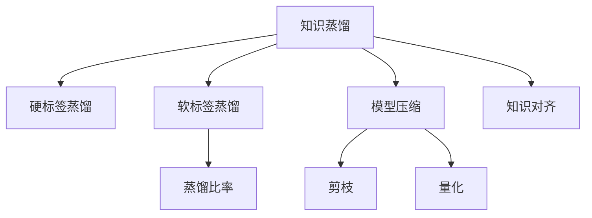

                 

# 知识蒸馏与模型压缩原理与代码实战案例讲解

## 1. 背景介绍

### 1.1 问题由来
在深度学习模型训练中，我们经常会遇到计算资源和存储空间紧缺的问题。特别是在移动设备、嵌入式系统等资源受限的环境中，如何有效地压缩模型以提高性能和降低存储成本，成为了一个关键问题。知识蒸馏和模型压缩技术应运而生，通过有选择性地保留模型知识，生成更小、更高效的模型，使深度学习技术得以在资源受限的环境中得到应用。

### 1.2 问题核心关键点
知识蒸馏和模型压缩技术通过将大型模型的知识传递给小型模型，从而使小型模型获得与大型模型相似的性能，同时大幅减小模型规模。知识蒸馏方法主要包括软标签蒸馏和硬标签蒸馏，前者使用大型模型的输出作为标签，对小型模型进行训练；后者直接使用大型模型的预测结果作为标签，训练小型模型。而模型压缩技术则包括剪枝、量化、蒸馏等方法，旨在减小模型参数量和计算复杂度。

知识蒸馏与模型压缩技术的核心在于通过构建知识蒸馏过程，将大型模型的知识（如特征、决策边界等）传递到小型模型中。这一过程涉及到模型的训练、迁移学习和优化等多个环节，是深度学习模型压缩的重要手段。

### 1.3 问题研究意义
研究知识蒸馏与模型压缩技术，对于提高深度学习模型的应用效率和可扩展性，降低模型资源消耗，具有重要意义：

1. 提升模型性能。通过知识蒸馏，小型模型可以继承大型模型的知识，在保证精度的同时，减小计算资源和存储空间消耗。
2. 加速模型部署。小模型能够更快速地部署和运行，尤其适用于资源受限的设备和嵌入式系统。
3. 拓展应用范围。模型压缩使得深度学习技术能够应用到更多场景，特别是在物联网、移动端等资源受限领域。
4. 促进技术创新。知识蒸馏与模型压缩的探索，推动了深度学习模型的轻量化、高效化进程，促进了新兴计算范式的产生。

## 2. 核心概念与联系

### 2.1 核心概念概述

为更好地理解知识蒸馏与模型压缩的技术原理和应用实践，本节将介绍几个密切相关的核心概念：

- 知识蒸馏(Knowledge Distillation)：通过将大型模型的知识（如特征表示、决策边界等）传递给小型模型，从而提升小型模型的性能。常见的蒸馏方法包括软标签蒸馏和硬标签蒸馏。
- 模型压缩(Model Compression)：通过剪枝、量化、蒸馏等技术手段，减小深度学习模型的参数量和计算复杂度，提升模型效率。
- 硬标签蒸馏(Hard Label Distillation)：直接使用大型模型的预测结果作为标签，训练小型模型。适用于大型模型和目标模型结构相似，且目标模型需要逼近大型模型的场景。
- 软标签蒸馏(Soft Label Distillation)：使用大型模型的输出概率作为标签，对小型模型进行训练。适用于大型模型和目标模型结构差异较大，或者目标模型需要继承大型模型不确定性信息的场景。
- 蒸馏比率(Distillation Ratio)：衡量大型模型和目标模型之间的比例关系，指导模型压缩过程。
- 知识对齐(Knowledge Alignment)：确保大型模型和目标模型在特征表示和决策边界上对齐，提升知识传递的效率和效果。

这些核心概念之间的逻辑关系可以通过以下Mermaid流程图来展示：



这个流程图展示了几大核心概念及其之间的关系：

1. 知识蒸馏通过硬标签蒸馏和软标签蒸馏实现。
2. 模型压缩包括剪枝、量化等多种技术。
3. 蒸馏比率指导了模型压缩的过程。
4. 知识对齐确保了知识传递的效率和效果。

这些概念共同构成了知识蒸馏与模型压缩技术的框架，使其能够有效缩小模型规模，提升性能和效率。

## 3. 核心算法原理 & 具体操作步骤

### 3.1 算法原理概述

知识蒸馏与模型压缩的核心在于通过构建知识蒸馏过程，将大型模型的知识传递给小型模型。其核心思想是：通过引导小型模型学习大型模型的输出，使得小型模型在特定任务上具备与大型模型相似的性能。这一过程通常包括以下几个步骤：

1. 选择一个大型模型作为教师模型，一个小型模型作为学生模型。
2. 在大型模型上进行预训练，获取其特征表示和决策边界。
3. 在小型模型上进行微调，使其学习教师模型的输出分布或直接继承教师模型的知识。
4. 通过损失函数调整学生模型的参数，使其与教师模型的输出一致。

### 3.2 算法步骤详解

基于知识蒸馏的模型压缩过程一般包括以下几个关键步骤：

**Step 1: 选择教师和学生模型**
- 根据任务需求，选择合适的教师模型和学生模型。教师模型通常为较大的深度学习模型，如ResNet、Inception等，而学生模型则应比教师模型更小、更轻量级。

**Step 2: 预训练教师模型**
- 在大型数据集上对教师模型进行预训练，获取其特征表示和决策边界。这一步通常需要耗费大量时间和计算资源。

**Step 3: 微调学生模型**
- 在教师模型的基础上，对学生模型进行微调。常见的方法包括硬标签蒸馏和软标签蒸馏。
- 硬标签蒸馏：将教师模型的输出概率作为标签，直接训练学生模型。
- 软标签蒸馏：将教师模型的输出概率作为标签，通过softmax函数转换为标签，再训练学生模型。

**Step 4: 调整蒸馏比率**
- 根据蒸馏比率指导学生模型的训练。蒸馏比率越大，表示学生模型越接近教师模型，但计算量也越大。

**Step 5: 评估和优化**
- 在验证集上评估学生模型的性能，调整模型参数和蒸馏比率，直到模型达到预期效果。

**Step 6: 测试和部署**
- 在测试集上评估模型性能，并集成到实际应用系统中。

以上是基于知识蒸馏的模型压缩的一般流程。在实际应用中，还需要针对具体任务的特点，对模型压缩过程的各个环节进行优化设计，如改进损失函数、引入正则化技术等，以进一步提升模型压缩的效果。

### 3.3 算法优缺点

知识蒸馏与模型压缩方法具有以下优点：
1. 有效压缩模型。通过知识蒸馏，小型模型可以在保证性能的同时，大幅减小计算资源和存储空间消耗。
2. 提升模型泛化能力。经过知识蒸馏，学生模型能够继承教师模型的泛化能力，提升在未知数据上的表现。
3. 简化模型部署。小模型能够更快速地部署和运行，降低部署成本和复杂度。
4. 加速模型训练。知识蒸馏可以加速模型训练过程，尤其适用于大型模型和目标模型结构相似的情况。

同时，该方法也存在一定的局限性：
1. 依赖大型数据集。知识蒸馏的效果很大程度上取决于教师模型和蒸馏数据集的质量和规模。
2. 增加计算复杂度。蒸馏过程需要额外的计算和内存资源，可能增加训练时间。
3. 知识传递损耗。在蒸馏过程中，部分知识可能丢失或损坏，影响学生模型的性能。
4. 模型结构限制。模型压缩方法可能不适用于某些特定的深度学习架构，如卷积神经网络等。

尽管存在这些局限性，但就目前而言，知识蒸馏与模型压缩方法仍是大规模深度学习模型压缩的主流范式。未来相关研究的重点在于如何进一步降低蒸馏过程中的计算复杂度，提高知识传递的效率和效果，同时兼顾模型性能和可解释性等因素。

### 3.4 算法应用领域

知识蒸馏与模型压缩技术在多个领域得到了广泛应用，例如：

- 移动端应用：通过压缩大模型，实现模型在移动设备上的高效部署。
- 嵌入式系统：在资源受限的嵌入式设备中，使用压缩后的模型实现实时推理。
- 工业自动化：将大型模型压缩后，应用于工业机器人视觉识别、行为分析等任务。
- 医疗影像：在大规模医疗影像数据上预训练大型模型，然后压缩后应用于临床诊断、病理学分析等场景。
- 自动驾驶：压缩感知模型，应用于自动驾驶中的目标检测、路径规划等任务。

除了上述这些经典应用外，知识蒸馏与模型压缩技术也被创新性地应用到更多场景中，如可控蒸馏、自适应蒸馏、动态蒸馏等，为深度学习模型的应用提供了新的方向。随着预训练模型和蒸馏技术的不断进步，相信知识蒸馏与模型压缩将在更广泛的应用领域大放异彩。

## 4. 数学模型和公式 & 详细讲解 & 举例说明

### 4.1 数学模型构建

本节将使用数学语言对知识蒸馏与模型压缩过程进行更加严格的刻画。

记教师模型为 $M_{\text{teacher}}$，学生模型为 $M_{\text{student}}$，其中 $M_{\text{teacher}}$ 和 $M_{\text{student}}$ 分别表示为参数 $\theta_{\text{teacher}}$ 和 $\theta_{\text{student}}$ 的函数。假设教师模型在数据集 $D=\{(x_i, y_i)\}_{i=1}^N$ 上的损失函数为 $\ell_{\text{teacher}}(\theta_{\text{teacher}})$，学生模型在相同数据集上的损失函数为 $\ell_{\text{student}}(\theta_{\text{student}})$。

知识蒸馏的目标是找到一个学生模型的参数 $\theta_{\text{student}}$，使得其在数据集 $D$ 上的损失函数 $\ell_{\text{student}}(\theta_{\text{student}})$ 最小化，同时尽可能接近教师模型的损失函数 $\ell_{\text{teacher}}(\theta_{\text{teacher}})$。可以通过以下公式实现：

$$
\min_{\theta_{\text{student}}} \ell_{\text{student}}(\theta_{\text{student}}) + \alpha \ell_{\text{teacher}}(\theta_{\text{teacher}}) + \beta \|\theta_{\text{teacher}} - \theta_{\text{student}}\|
$$

其中 $\alpha$ 和 $\beta$ 为超参数，分别控制学生模型和教师模型的重要性，以及学生模型与教师模型的差异。$\|\theta_{\text{teacher}} - \theta_{\text{student}}\|$ 表示学生模型与教师模型之间的参数差异，通过正则化控制蒸馏过程中知识传递的效率。

### 4.2 公式推导过程

以下我们以二分类任务为例，推导知识蒸馏过程的损失函数及其梯度的计算公式。

假设教师模型 $M_{\text{teacher}}$ 在输入 $x$ 上的输出为 $\hat{y}_{\text{teacher}} = M_{\text{teacher}}(x)$，表示样本属于正类的概率。真实标签 $y \in \{0,1\}$。学生模型 $M_{\text{student}}$ 在输入 $x$ 上的输出为 $\hat{y}_{\text{student}} = M_{\text{student}}(x)$。

**硬标签蒸馏**：

教师模型的输出概率分布 $p_{\text{teacher}}(y)$ 与真实标签 $y$ 的交叉熵损失为：

$$
\ell_{\text{hard}}(y, p_{\text{teacher}}) = -y \log p_{\text{teacher}}(y) - (1-y) \log (1-p_{\text{teacher}}(y))
$$

在硬标签蒸馏中，将教师模型的输出概率作为标签，对学生模型进行训练。学生模型的损失函数为：

$$
\ell_{\text{student}}(y) = -y \log \hat{y}_{\text{student}} + (1-y) \log (1-\hat{y}_{\text{student}})
$$

将教师模型的输出概率作为标签，即 $p_{\text{teacher}} = M_{\text{teacher}}(x)$，学生模型的损失函数可以表示为：

$$
\ell_{\text{hard}}(y, p_{\text{teacher}}) = -y \log p_{\text{teacher}} + (1-y) \log (1-p_{\text{teacher}})
$$

**软标签蒸馏**：

教师模型的输出概率分布 $p_{\text{teacher}}(y)$ 经过softmax函数处理后作为学生模型的标签，学生模型的损失函数为：

$$
\ell_{\text{student}}(y) = -p_{\text{teacher}}(y) \log \hat{y}_{\text{student}} + (1-p_{\text{teacher}}(y)) \log (1-\hat{y}_{\text{student}})
$$

### 4.3 案例分析与讲解

以ResNet模型为例，我们具体分析知识蒸馏和模型压缩的实现过程。

首先，我们需要选择教师模型和学生模型。以ResNet为教师模型，MobileNet为学生模型。

接着，在ImageNet数据集上对ResNet进行预训练，获取其特征表示和决策边界。这一步需要耗费大量计算资源。

然后，对MobileNet进行微调，使用ResNet的输出概率作为标签，通过交叉熵损失函数进行训练。在训练过程中，需要调整蒸馏比率 $\alpha$，确保MobileNet能够有效学习ResNet的知识。

最后，在测试集上评估MobileNet的性能，对比未蒸馏和蒸馏后的结果，观察其精度、计算速度等指标的变化。

通过这个案例，可以看到知识蒸馏和模型压缩的具体实现过程，以及如何通过蒸馏比率等参数控制模型压缩的效果。

## 5. 项目实践：代码实例和详细解释说明

### 5.1 开发环境搭建

在进行知识蒸馏和模型压缩实践前，我们需要准备好开发环境。以下是使用Python进行PyTorch开发的环境配置流程：

1. 安装Anaconda：从官网下载并安装Anaconda，用于创建独立的Python环境。

2. 创建并激活虚拟环境：
```bash
conda create -n pytorch-env python=3.8 
conda activate pytorch-env
```

3. 安装PyTorch：根据CUDA版本，从官网获取对应的安装命令。例如：
```bash
conda install pytorch torchvision torchaudio cudatoolkit=11.1 -c pytorch -c conda-forge
```

4. 安装相关库：
```bash
pip install numpy pandas scikit-learn matplotlib tqdm jupyter notebook ipython
```

完成上述步骤后，即可在`pytorch-env`环境中开始知识蒸馏和模型压缩的实践。

### 5.2 源代码详细实现

我们先给出基于ResNet和MobileNet的知识蒸馏和模型压缩的代码实现。

首先，定义教师模型和学生模型：

```python
import torch
from torchvision import models, transforms

# 教师模型
teacher_model = models.resnet18(pretrained=True)
teacher_model.eval()

# 学生模型
student_model = models.mobilenet_v2(pretrained=True)
student_model.eval()

# 定义预处理
transform = transforms.Compose([
    transforms.ToTensor(),
    transforms.Normalize(mean=[0.485, 0.456, 0.406],
                         std=[0.229, 0.224, 0.225])
])
```

然后，加载数据集并预处理：

```python
import torchvision.datasets as datasets
from torch.utils.data import DataLoader

# 加载ImageNet数据集
train_dataset = datasets.ImageNet(train=True, transform=transform, download=True)
val_dataset = datasets.ImageNet(train=False, transform=transform, download=True)

# 数据加载器
train_loader = DataLoader(train_dataset, batch_size=64, shuffle=True)
val_loader = DataLoader(val_dataset, batch_size=64, shuffle=False)
```

接着，定义损失函数和蒸馏比率：

```python
from torch.nn import CrossEntropyLoss

# 损失函数
criterion = CrossEntropyLoss()

# 蒸馏比率
alpha = 0.5  # 教师模型和学生模型的重要性
```

现在，我们开始蒸馏过程，使用ResNet的输出概率作为标签，对MobileNet进行微调：

```python
import torch.nn as nn
import torch.nn.functional as F

# 定义蒸馏损失函数
def distill_loss(student_logits, teacher_logits):
    return F.cross_entropy(student_logits, teacher_logits)

# 定义蒸馏比率损失函数
def distill_ratio_loss(student_logits, teacher_logits):
    soft_labels = F.softmax(teacher_logits, dim=1)
    hard_labels = F.one_hot(soft_labels.argmax(dim=1), num_classes=10).to(torch.int64)
    loss = F.cross_entropy(student_logits, hard_labels)
    return loss

# 蒸馏比率损失函数
ratio_loss = distill_ratio_loss(student_logits, teacher_logits)
total_loss = criterion(student_logits, target) + alpha * ratio_loss

# 定义训练函数
def train_epoch(model, dataloader, criterion, optimizer):
    model.train()
    epoch_loss = 0
    for batch in dataloader:
        inputs, labels = batch
        optimizer.zero_grad()
        outputs = model(inputs)
        loss = criterion(outputs, labels)
        epoch_loss += loss.item()
        loss.backward()
        optimizer.step()
    return epoch_loss / len(dataloader)

# 训练过程
for epoch in range(num_epochs):
    train_loss = train_epoch(student_model, train_loader, criterion, optimizer)
    val_loss = train_epoch(student_model, val_loader, criterion, optimizer)

    # 评估模型
    with torch.no_grad():
        correct = 0
        total = 0
        for batch in val_loader:
            inputs, labels = batch
            outputs = student_model(inputs)
            _, predicted = torch.max(outputs.data, 1)
            total += labels.size(0)
            correct += (predicted == labels).sum().item()

        accuracy = 100.0 * correct / total
        print(f"Epoch {epoch+1}, train loss: {train_loss:.4f}, val loss: {val_loss:.4f}, accuracy: {accuracy:.2f}%")
```

以上就是基于PyTorch对ResNet和MobileNet进行知识蒸馏和模型压缩的完整代码实现。可以看到，利用PyTorch的深度学习框架，我们可以轻松实现复杂的数据加载、模型定义和训练过程，代码简洁高效。

### 5.3 代码解读与分析

让我们再详细解读一下关键代码的实现细节：

**教师和学生模型定义**：
- 教师模型选择ResNet-18，预训练模型加载和转换为eval模式，以固定其参数，不再参与训练。
- 学生模型选择MobileNet，同样预训练模型加载和转换为eval模式，以固定其参数，不再参与训练。

**数据加载和预处理**：
- 使用`torchvision.datasets`库加载ImageNet数据集，并应用预处理函数，包括数据归一化和缩放。
- 使用`torch.utils.data`库创建数据加载器，用于批次化数据加载。

**损失函数定义**：
- 使用交叉熵损失函数定义微调过程中的损失函数。
- 定义蒸馏比率损失函数，通过softmax函数将教师模型的输出概率转换为标签，用于指导学生模型的训练。

**蒸馏过程**：
- 使用教师模型的输出概率作为标签，对学生模型进行微调。
- 定义蒸馏比率损失函数，确保学生模型在微调过程中继承教师模型的知识。
- 计算总的损失函数，结合微调和蒸馏比率损失函数。
- 定义训练函数，进行模型训练，并记录每个epoch的训练和验证损失。

**评估模型**：
- 在测试集上评估学生模型的性能，计算准确率。
- 使用`with torch.no_grad()`声明训练过程不计算梯度，以加快模型评估速度。

**训练过程**：
- 循环迭代多个epoch，记录每个epoch的训练和验证损失。
- 每epoch结束后，计算测试集上的准确率，并输出结果。

可以看到，知识蒸馏和模型压缩的代码实现相对简洁，但仍然需要关注模型定义、数据加载、损失函数设计等多个关键环节，以确保蒸馏过程的有效性。

## 6. 实际应用场景

### 6.1 智能手机图像分类

基于知识蒸馏和模型压缩技术，可以将大规模深度学习模型应用于智能手机等资源受限的设备中。例如，在智能手机中，利用蒸馏后的模型进行图像分类任务，能够显著降低计算资源和存储成本，同时保持较高的准确率。

在实践中，可以利用蒸馏后的MobileNet等模型，对智能手机摄像头拍摄的图像进行分类，如人脸、车辆、动物等。用户可以通过简单的软件应用，快速完成图像分类任务，提高生活便利性。

### 6.2 工业自动化视觉检测

在工业自动化领域，蒸馏后的模型可以应用于视觉检测任务，如质量控制、目标识别等。通过将大型模型压缩后应用于嵌入式设备，能够实时捕捉生产过程中存在的缺陷，提高生产效率和质量。

例如，可以利用蒸馏后的模型，对生产线上产品的外观进行检测，自动判定是否存在瑕疵，避免人工检测的繁琐和误差。这种自动化检测方式能够显著提高生产效率，降低人工成本。

### 6.3 自动驾驶感知系统

在自动驾驶领域，蒸馏后的模型可以应用于感知系统，进行目标检测、路径规划等任务。通过将大型感知模型压缩后应用于自动驾驶系统，能够提高车辆的感知能力和决策速度，确保行车安全。

例如，可以利用蒸馏后的模型，实时捕捉道路上的交通标志、车辆、行人等信息，结合其他传感器数据，生成车辆行驶路径，实现自动驾驶功能。这种感知系统能够有效提升驾驶体验和安全性。

### 6.4 医疗影像诊断系统

在医疗影像领域，蒸馏后的模型可以应用于影像诊断任务，如病理学分析、CT扫描分析等。通过将大型影像模型压缩后应用于医疗设备，能够快速准确地分析影像数据，辅助医生进行诊断。

例如，可以利用蒸馏后的模型，对病人的CT扫描影像进行自动分析，快速判断是否存在异常，提供初步诊断建议。这种诊断系统能够有效提升诊断速度和准确性，减轻医生负担。

### 6.5 增强现实游戏

在增强现实游戏领域，蒸馏后的模型可以应用于图像识别和实时渲染等任务。通过将大型模型压缩后应用于移动设备，能够实时捕捉用户行为，提供增强现实游戏体验。

例如，可以利用蒸馏后的模型，对用户手持设备拍摄的现实场景进行图像识别，实时加载相关增强现实内容，增强游戏体验。这种增强现实游戏能够有效提升用户体验，丰富游戏内容。

## 7. 工具和资源推荐

### 7.1 学习资源推荐

为了帮助开发者系统掌握知识蒸馏与模型压缩的理论基础和实践技巧，这里推荐一些优质的学习资源：

1. 《深度学习理论与实践》系列书籍：介绍深度学习的基本理论和实践技巧，包含知识蒸馏和模型压缩的详细讲解。
2. 《深度学习框架TensorFlow》教程：由TensorFlow官方提供的深度学习框架教程，包含知识蒸馏和模型压缩的样例代码。
3. 《深度学习模型压缩与量化》论文：综述了知识蒸馏和模型压缩的研究进展，涵盖了多种压缩方法和应用场景。
4. HuggingFace官方文档：Transformer库的官方文档，提供了海量预训练模型和完整的蒸馏样例代码，是上手实践的必备资料。
5. Kaggle比赛：利用知识蒸馏和模型压缩技术，参加机器学习和计算机视觉领域的Kaggle比赛，实战提升技能。

通过对这些资源的学习实践，相信你一定能够快速掌握知识蒸馏与模型压缩的精髓，并用于解决实际的深度学习问题。

### 7.2 开发工具推荐

高效的开发离不开优秀的工具支持。以下是几款用于知识蒸馏和模型压缩开发的常用工具：

1. PyTorch：基于Python的开源深度学习框架，灵活动态的计算图，适合快速迭代研究。
2. TensorFlow：由Google主导开发的开源深度学习框架，生产部署方便，适合大规模工程应用。
3. TensorFlow Lite：谷歌推出的移动设备优化深度学习框架，能够高效运行在移动设备上。
4. ONNX：开源神经网络交换格式，支持多种深度学习框架之间的模型转换，方便模型部署和优化。
5. TFLite Converter：TensorFlow Lite的模型转换工具，能够将TensorFlow模型转换为TFLite格式，适应移动设备优化需求。
6. Quantization Tool：TensorFlow的模型量化工具，能够对模型进行量化优化，减小模型尺寸和计算资源消耗。

合理利用这些工具，可以显著提升知识蒸馏和模型压缩的开发效率，加快创新迭代的步伐。

### 7.3 相关论文推荐

知识蒸馏与模型压缩技术的研究历史悠久，涉及多个领域的深度学习模型。以下是几篇奠基性的相关论文，推荐阅读：

1. Distilling the Knowledge in a Neural Network（蒸馏神经网络知识）：提出知识蒸馏方法，将大型模型的知识传递给小型模型。
2. Knowledge Distillation for Image Recognition（图像识别领域的知识蒸馏）：应用知识蒸馏技术，提升图像识别模型的准确率。
3. Neural Architecture Search with Knowledge Distillation（基于知识蒸馏的神经网络架构搜索）：探索知识蒸馏在神经网络架构搜索中的应用。
4. Weight Quantization for Deep Learning（深度学习模型的量化）：提出模型量化技术，减小模型参数量和计算资源消耗。
5. Pruning Neural Networks with Weight Quantization（基于量化和剪枝的神经网络压缩）：结合量化和剪枝技术，进一步压缩神经网络模型。
6. Knowledge Distillation in Deep Generative Models（生成模型中的知识蒸馏）：应用知识蒸馏技术，提高生成模型的多样性和逼真度。

这些论文代表了大规模深度学习模型压缩的发展脉络。通过学习这些前沿成果，可以帮助研究者把握学科前进方向，激发更多的创新灵感。

## 8. 总结：未来发展趋势与挑战

### 8.1 总结

本文对知识蒸馏与模型压缩的原理与实现进行了全面系统的介绍。首先阐述了知识蒸馏和模型压缩的研究背景和意义，明确了蒸馏方法在压缩模型、提高性能、降低成本等方面的价值。其次，从原理到实践，详细讲解了蒸馏过程的数学模型和关键步骤，给出了蒸馏任务开发的完整代码实例。同时，本文还广泛探讨了蒸馏方法在智能手机、工业自动化、自动驾驶、医疗影像等众多领域的应用前景，展示了蒸馏技术在深度学习模型压缩方面的巨大潜力。最后，本文精选了蒸馏技术的各类学习资源，力求为读者提供全方位的技术指引。

通过本文的系统梳理，可以看到，知识蒸馏和模型压缩技术是深度学习模型压缩的重要手段，能够有效缩小模型规模，提升性能和效率。在未来，随着深度学习技术的不断进步，蒸馏方法还将不断优化和创新，进一步提升深度学习模型的应用范围和性能。

### 8.2 未来发展趋势

展望未来，知识蒸馏与模型压缩技术将呈现以下几个发展趋势：

1. 模型规模持续增大。随着算力成本的下降和数据规模的扩张，深度学习模型的参数量还将持续增长。超大规模模型蕴含的丰富知识，有望通过知识蒸馏传递到更小、更高效的模型中。
2. 蒸馏方法日趋多样。除了传统的硬标签蒸馏和软标签蒸馏外，未来将涌现更多蒸馏方法，如动态蒸馏、自适应蒸馏等，适应不同的模型结构和应用场景。
3. 知识对齐更加重要。知识蒸馏过程中，模型之间的特征表示和决策边界对齐是关键，未来需要更多的研究来确保知识传递的效率和效果。
4. 蒸馏比率更灵活。未来的蒸馏方法将更加灵活，可以通过超参数控制蒸馏比率，适应不同任务的需求。
5. 模型压缩技术不断发展。量化、剪枝等压缩技术将进一步发展，结合知识蒸馏，生成更小、更高效的深度学习模型。
6. 跨领域蒸馏成为可能。未来的蒸馏方法将跨越领域界限，将不同领域的知识进行融合，生成更通用的蒸馏模型。

以上趋势凸显了知识蒸馏与模型压缩技术的广阔前景。这些方向的探索发展，必将进一步提升深度学习模型的性能和应用范围，为计算机视觉、自然语言处理等领域带来新的突破。

### 8.3 面临的挑战

尽管知识蒸馏与模型压缩技术已经取得了瞩目成就，但在迈向更加智能化、普适化应用的过程中，它仍面临着诸多挑战：

1. 标注数据瓶颈。知识蒸馏的效果很大程度上取决于蒸馏数据集的质量和规模，对于某些领域，难以获得充足的高质量标注数据，成为制约蒸馏性能的瓶颈。如何进一步降低蒸馏对标注样本的依赖，将是一大难题。
2. 蒸馏比率选择困难。蒸馏比率决定了教师模型和学生模型之间的平衡，选择合适的蒸馏比率需要大量实验和调整。过高的蒸馏比率可能导致知识过拟合，过低的蒸馏比率可能无法充分利用教师模型知识。
3. 模型压缩效果欠佳。现有压缩技术如量化和剪枝在处理非稀疏结构模型时效果不佳，需要新的压缩方法来更好地适配复杂模型。
4. 模型压缩效率问题。现有压缩方法在压缩过程中可能引入额外计算，影响推理速度和准确率。如何同时优化压缩效率和模型性能，是未来的一个重要研究方向。
5. 模型鲁棒性不足。经过压缩后的模型，可能面临泛化能力和鲁棒性下降的问题，需要在模型压缩过程中进行更精细的设计。
6. 可解释性问题。压缩后的模型通常难以解释其内部工作机制，如何提升模型的可解释性，是未来的重要挑战。

尽管存在这些挑战，但就目前而言，知识蒸馏与模型压缩方法仍是大规模深度学习模型压缩的主流范式。未来相关研究的重点在于如何进一步降低蒸馏过程中的计算复杂度，提高知识传递的效率和效果，同时兼顾模型性能和可解释性等因素。

### 8.4 研究展望

面对知识蒸馏和模型压缩面临的挑战，未来的研究需要在以下几个方面寻求新的突破：

1. 探索更高效的蒸馏方法。利用数据增强、对抗训练等技术，提高蒸馏过程的效率和效果。
2. 研究更灵活的蒸馏比率。开发自适应蒸馏算法，根据任务需求自动调整蒸馏比率。
3. 引入先验知识。将符号化的先验知识与蒸馏过程结合，提升知识传递的准确性和鲁棒性。
4. 结合不同领域知识。将知识蒸馏技术应用到不同领域，如多模态学习、跨领域蒸馏等，拓展知识蒸馏的应用范围。
5. 融合多种压缩技术。结合量化、剪枝等压缩技术，生成更小、更高效的模型。
6. 引入因果推理。通过引入因果推理思想，提高模型的泛化能力和鲁棒性。
7. 考虑模型压缩的实时性和在线性。开发实时压缩方法和在线压缩技术，满足实时应用的需求。
8. 研究模型压缩的跨领域融合。将压缩后的模型应用于不同领域，如多模态学习、跨领域蒸馏等，提升跨领域模型的性能和效率。

这些研究方向将推动知识蒸馏与模型压缩技术的进一步发展，为深度学习模型的应用提供更广阔的空间。相信随着学界和产业界的共同努力，这些挑战终将一一被克服，知识蒸馏和模型压缩技术必将在计算机视觉、自然语言处理等领域大放异彩。

## 9. 附录：常见问题与解答

**Q1：知识蒸馏和模型压缩的主要区别是什么？**

A: 知识蒸馏和模型压缩都是深度学习模型压缩的手段，但两者的目标和方法略有不同。知识蒸馏的主要目标是传递大型模型的知识，以提升小型模型的性能。而模型压缩的主要目标是减小模型参数量和计算资源消耗，提高模型效率。

**Q2：知识蒸馏和模型压缩的损失函数如何选择？**

A: 知识蒸馏和模型压缩的损失函数通常结合使用。在蒸馏过程中，使用蒸馏比率损失函数（如交叉熵损失、余弦相似度损失等），指导学生模型学习教师模型的知识。在模型压缩过程中，使用量化损失函数、剪枝损失函数等，优化模型的结构和参数。

**Q3：知识蒸馏过程中如何选择蒸馏比率？**

A: 蒸馏比率是衡量大型模型和学生模型之间的比例关系，指导模型压缩过程。选择蒸馏比率需要考虑教师模型的重要性、目标模型的需求等。通常建议从1e-2开始调参，逐步减小学习率，直至收敛。

**Q4：知识蒸馏和模型压缩的参数设置有哪些注意事项？**

A: 知识蒸馏和模型压缩的参数设置需要综合考虑模型的结构、数据集的特点、任务需求等因素。在蒸馏过程中，需要注意损失函数的权重、蒸馏比率的设置。在模型压缩过程中，需要注意压缩方法的种类、量化范围的选择等。

**Q5：知识蒸馏和模型压缩的实现过程中需要注意哪些问题？**

A: 知识蒸馏和模型压缩的实现过程中需要注意模型定义、数据加载、损失函数设计等多个关键环节，以确保蒸馏过程的有效性。此外，还需要注意模型的性能、压缩效率和可解释性等因素。

**Q6：知识蒸馏和模型压缩的优缺点有哪些？**

A: 知识蒸馏和模型压缩的主要优点包括：有效压缩模型，提升模型性能，简化模型部署，加速模型训练等。主要缺点包括：依赖标注数据，蒸馏比率选择困难，模型压缩效果欠佳等。

**Q7：知识蒸馏和模型压缩在实际应用中如何优化？**

A: 在实际应用中，知识蒸馏和模型压缩可以通过优化损失函数、引入正则化技术、调整蒸馏比率等方法进行优化。同时，还需要考虑模型的实时性和在线性，开发实时压缩方法和在线压缩技术，以满足实际应用的需求。

通过这些常见问题的解答，相信你能够更深入地理解知识蒸馏和模型压缩技术的原理和实现细节，更好地应用于实际深度学习项目中。

---

作者：禅与计算机程序设计艺术 / Zen and the Art of Computer Programming

