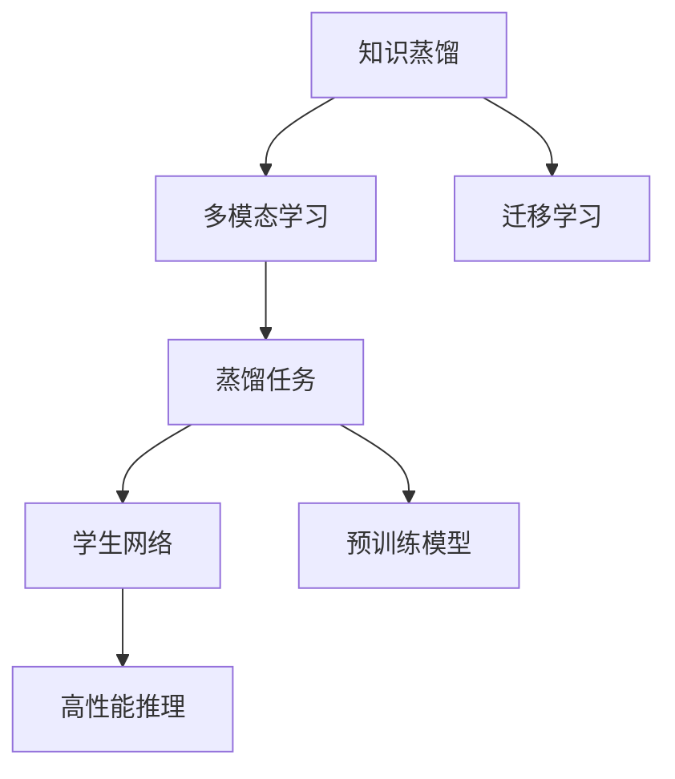

                 

# 知识蒸馏在多模态学习中的创新应用

> 关键词：知识蒸馏,多模态学习,迁移学习,蒸馏任务,学生网络,预训练模型,高性能推理

## 1. 背景介绍

### 1.1 问题由来
近年来，随着深度学习技术的不断发展，多模态学习（Multimodal Learning）成为了一个热门的研究方向。多模态学习旨在处理和分析由多种类型数据（如文本、图像、音频等）组成的复杂数据集，以获得更全面、准确的模型表达。在图像分类、目标检测、语音识别等领域，多模态学习已经取得了显著的进展。然而，在实际应用中，多模态学习仍面临着诸多挑战，如数据标注成本高、模型复杂度高、推理速度慢等。

为了解决这些挑战，知识蒸馏（Knowledge Distillation, KD）技术应运而生。知识蒸馏是一种通过将大模型的知识转移到小模型中的方法，使得小模型能够快速获得大模型的知识，从而提升性能。知识蒸馏在图像分类、自然语言处理等领域取得了不错的效果。然而，在多模态学习中，如何应用知识蒸馏技术，以及如何设计高效的知识蒸馏策略，仍然是一个有待探索的问题。

### 1.2 问题核心关键点
本文聚焦于知识蒸馏在多模态学习中的应用，并针对以下核心问题展开研究：
- 如何设计高效的知识蒸馏任务？
- 如何选择合适的蒸馏策略和蒸馏目标？
- 如何在多模态数据中实现高效的知识蒸馏？
- 如何在多模态学习中应用知识蒸馏技术进行迁移学习？

通过回答这些问题，我们希望能够设计出更加高效、灵活、鲁棒的知识蒸馏策略，从而推动多模态学习技术的发展。

## 2. 核心概念与联系

### 2.1 核心概念概述

为更好地理解知识蒸馏在多模态学习中的应用，本节将介绍几个密切相关的核心概念：

- 知识蒸馏（Knowledge Distillation, KD）：通过将大模型的知识转移到小模型中，使得小模型能够快速获得大模型的知识，从而提升性能。知识蒸馏方法可以分为单任务蒸馏和多任务蒸馏，其中多任务蒸馏能够更好地适应多模态数据的复杂性。

- 多模态学习（Multimodal Learning）：处理和分析由多种类型数据（如文本、图像、音频等）组成的复杂数据集，以获得更全面、准确的模型表达。多模态学习在图像分类、目标检测、语音识别等领域取得了显著的进展。

- 迁移学习（Transfer Learning）：指将一个领域学习到的知识，迁移应用到另一个不同但相关的领域的学习范式。在多模态学习中，知识蒸馏可以看作是一种特殊形式的迁移学习。

- 蒸馏任务（Distillation Task）：知识蒸馏过程中，大模型需要对小模型进行知识转移，而小模型则需要模仿大模型的行为。如何设计蒸馏任务是知识蒸馏的核心问题之一。

- 学生网络（Student Network）：在知识蒸馏中，大模型被称为教师网络（Teacher Network），小模型被称为学生网络（Student Network）。学生网络通过模仿教师网络的行为，快速提升自身的性能。

- 预训练模型（Pre-trained Model）：通过在大规模无标签数据上预训练得到的模型，通常具有较强的泛化能力和迁移学习能力。在多模态学习中，预训练模型可以作为教师网络，用于知识蒸馏。

- 高性能推理（High-performance Inference）：在实际应用中，需要快速、准确地进行推理计算，以提升系统的响应速度和用户体验。知识蒸馏方法可以用于提升多模态模型的推理性能，缩短推理时间。

这些核心概念之间的逻辑关系可以通过以下Mermaid流程图来展示：



这个流程图展示的知识蒸馏在多模态学习中的核心概念及其之间的关系：

1. 知识蒸馏通过迁移学习，将大模型的知识转移到小模型中。
2. 多模态学习处理多种类型的数据，需要设计合适的蒸馏任务，以适应不同类型数据的特性。
3. 预训练模型可以作为教师网络，用于知识蒸馏。
4. 学生网络通过模仿教师网络的行为，快速提升自身的性能。
5. 高性能推理是实际应用中对系统响应速度和用户体验的追求。

这些概念共同构成了知识蒸馏在多模态学习中的框架，使得我们能够更好地理解和应用这一技术。

## 3. 核心算法原理 & 具体操作步骤
### 3.1 算法原理概述

知识蒸馏在多模态学习中的基本思想是，通过将大模型的知识转移到小模型中，使得小模型能够快速获得大模型的知识，从而提升性能。具体来说，知识蒸馏过程包括以下几个关键步骤：

1. 选择教师网络和学生网络：教师网络通常为预训练模型，学生网络为需要微调的小模型。
2. 设计蒸馏任务：确定教师网络和学生网络之间的任务关系，如分类、检测等。
3. 训练教师网络：在多模态数据上进行预训练，学习多模态数据的特征表示。
4. 训练学生网络：通过知识蒸馏，将教师网络的知识转移到学生网络中，提升学生网络的性能。
5. 评估学生网络：在多模态数据上对学生网络进行评估，确保其性能达到预期。

知识蒸馏方法可以分为单任务蒸馏和多任务蒸馏，其中多任务蒸馏能够更好地适应多模态数据的复杂性。多任务蒸馏将教师网络的知识分布在多个任务中，学生网络需要同时学习多个任务的知识，从而实现更全面、准确的模型表达。

### 3.2 算法步骤详解

以下是知识蒸馏在多模态学习中的详细步骤：

**Step 1: 选择教师网络和学生网络**

选择教师网络和学生网络是知识蒸馏的第一步。通常情况下，教师网络为大模型，如BERT、ResNet等，而学生网络为需要微调的小模型。例如，在图像分类任务中，可以选择Inception V3作为教师网络，ResNet作为学生网络。

**Step 2: 设计蒸馏任务**

在多模态学习中，蒸馏任务需要同时考虑多种类型的数据，如文本、图像、音频等。例如，在图像分类任务中，可以将教师网络的任务设置为图像分类，学生网络的任务设置为多模态分类（即同时考虑图像和文本的分类任务）。

**Step 3: 训练教师网络**

在多模态数据上进行预训练，学习多模态数据的特征表示。例如，在图像分类任务中，可以使用ImageNet数据集进行预训练。

**Step 4: 训练学生网络**

通过知识蒸馏，将教师网络的知识转移到学生网络中，提升学生网络的性能。例如，在图像分类任务中，可以将Inception V3的知识转移到ResNet中，使得ResNet能够快速提升分类性能。

**Step 5: 评估学生网络**

在多模态数据上对学生网络进行评估，确保其性能达到预期。例如，在图像分类任务中，可以使用COCO数据集对ResNet进行评估。

### 3.3 算法优缺点

知识蒸馏在多模态学习中具有以下优点：
1. 快速提升性能：通过知识蒸馏，学生网络能够快速获得教师网络的知识，从而提升性能。
2. 适应性广：知识蒸馏能够适应多种类型的任务，如分类、检测等。
3. 模型压缩：知识蒸馏可以通过压缩大模型的参数，减少计算资源消耗。
4. 鲁棒性强：知识蒸馏方法可以通过选择不同的蒸馏策略，提升学生网络的鲁棒性和泛化能力。

同时，知识蒸馏也存在以下缺点：
1. 数据标注成本高：知识蒸馏需要大量的标注数据进行训练，标注成本较高。
2. 模型复杂度高：知识蒸馏方法需要同时训练教师网络和学生网络，模型复杂度较高。
3. 推理速度慢：知识蒸馏方法可能需要增加额外的推理计算，推理速度较慢。

尽管存在这些缺点，但知识蒸馏仍然是一种高效的多模态学习范式，尤其适用于数据量较小、标注成本较高的场景。

### 3.4 算法应用领域

知识蒸馏在多模态学习中的应用非常广泛，涵盖了许多不同的领域，例如：

- 图像分类：使用教师网络（如Inception V3）对学生网络（如ResNet）进行蒸馏，提升学生网络的分类性能。
- 目标检测：通过知识蒸馏，将教师网络的知识转移到学生网络中，提升学生网络的检测性能。
- 语音识别：使用教师网络（如BERT）对学生网络（如Transformer）进行蒸馏，提升学生网络的识别性能。
- 情感分析：通过知识蒸馏，将教师网络的知识转移到学生网络中，提升学生网络的情感分析性能。
- 视频标注：通过知识蒸馏，将教师网络的知识转移到学生网络中，提升学生网络的视频标注性能。
- 动作识别：通过知识蒸馏，将教师网络的知识转移到学生网络中，提升学生网络的动作识别性能。
- 多模态推荐：通过知识蒸馏，将教师网络的知识转移到学生网络中，提升学生网络的多模态推荐性能。

除了上述这些经典应用外，知识蒸馏方法还被创新性地应用到更多场景中，如可控文本生成、常识推理、代码生成、数据增强等，为多模态学习技术带来了新的突破。

## 4. 数学模型和公式 & 详细讲解
### 4.1 数学模型构建

知识蒸馏在多模态学习中的数学模型可以表示为：

$$
\min_{\theta_s} \mathcal{L}_s(\theta_s) + \lambda \mathcal{L}_k(\theta_s, \theta_t)
$$

其中，$\theta_s$ 表示学生网络（Student Network）的参数，$\theta_t$ 表示教师网络（Teacher Network）的参数。$\mathcal{L}_s$ 表示学生网络的任务损失函数，$\mathcal{L}_k$ 表示知识蒸馏损失函数，$\lambda$ 表示蒸馏权重的超参数。

### 4.2 公式推导过程

以下以图像分类任务为例，推导知识蒸馏的数学公式：

**Step 1: 教师网络预训练**

假设教师网络为卷积神经网络（CNN），用 $\theta_t$ 表示其参数。在ImageNet数据集上进行预训练，学习图像的特征表示。

**Step 2: 学生网络微调**

假设学生网络为卷积神经网络（CNN），用 $\theta_s$ 表示其参数。使用蒸馏任务对学生网络进行微调，提升其性能。蒸馏任务可以表示为：

$$
\mathcal{L}_s(\theta_s) = \sum_{i=1}^{N_s} \mathcal{L}_s^i(\theta_s)
$$

其中，$N_s$ 表示蒸馏任务的数量，$\mathcal{L}_s^i$ 表示第 $i$ 个蒸馏任务的任务损失函数。

**Step 3: 知识蒸馏**

知识蒸馏损失函数可以表示为：

$$
\mathcal{L}_k(\theta_s, \theta_t) = -\frac{1}{N_s} \sum_{i=1}^{N_s} \log\left(\frac{P_s(x_i^i|y_i^i)}{P_t(x_i^i|y_i^i)}\right)
$$

其中，$x_i^i$ 表示蒸馏任务 $i$ 的输入，$y_i^i$ 表示蒸馏任务 $i$ 的输出，$P_s(x_i^i|y_i^i)$ 表示学生网络在蒸馏任务 $i$ 上的预测概率，$P_t(x_i^i|y_i^i)$ 表示教师网络在蒸馏任务 $i$ 上的预测概率。

**Step 4: 优化目标**

综合考虑学生网络的任务损失函数和知识蒸馏损失函数，优化目标可以表示为：

$$
\min_{\theta_s} \mathcal{L}_s(\theta_s) + \lambda \mathcal{L}_k(\theta_s, \theta_t)
$$

其中，$\lambda$ 为蒸馏权重的超参数，控制知识蒸馏在目标函数中的重要性。

### 4.3 案例分析与讲解

以图像分类任务为例，我们选取ResNet-50作为学生网络，Inception V3作为教师网络。假设蒸馏任务为图像分类和目标检测，使用ImageNet数据集进行预训练。知识蒸馏的数学模型和优化目标可以表示为：

$$
\min_{\theta_s} \mathcal{L}_s(\theta_s) + \lambda \mathcal{L}_k(\theta_s, \theta_t)
$$

其中，$\mathcal{L}_s(\theta_s)$ 表示学生网络在图像分类和目标检测任务上的任务损失函数，$\mathcal{L}_k(\theta_s, \theta_t)$ 表示知识蒸馏损失函数，$\lambda$ 表示蒸馏权重的超参数。

在优化目标中，$\mathcal{L}_s(\theta_s)$ 可以表示为：

$$
\mathcal{L}_s(\theta_s) = \mathcal{L}_s^1(\theta_s) + \mathcal{L}_s^2(\theta_s)
$$

其中，$\mathcal{L}_s^1(\theta_s)$ 表示图像分类的任务损失函数，$\mathcal{L}_s^2(\theta_s)$ 表示目标检测的任务损失函数。

知识蒸馏损失函数 $\mathcal{L}_k(\theta_s, \theta_t)$ 可以表示为：

$$
\mathcal{L}_k(\theta_s, \theta_t) = -\frac{1}{N} \sum_{i=1}^{N} \log\left(\frac{P_s(x_i^1|y_i^1)}{P_t(x_i^1|y_i^1)}\right) + \frac{1}{N} \sum_{i=1}^{N} \log\left(\frac{P_s(x_i^2|y_i^2)}{P_t(x_i^2|y_i^2)}\right)
$$

其中，$N$ 表示蒸馏样本的数量，$x_i^1$ 表示图像分类任务 $i$ 的输入，$y_i^1$ 表示图像分类任务 $i$ 的输出，$P_s(x_i^1|y_i^1)$ 表示学生网络在图像分类任务 $i$ 上的预测概率，$P_t(x_i^1|y_i^1)$ 表示教师网络在图像分类任务 $i$ 上的预测概率。$x_i^2$ 表示目标检测任务 $i$ 的输入，$y_i^2$ 表示目标检测任务 $i$ 的输出，$P_s(x_i^2|y_i^2)$ 表示学生网络在目标检测任务 $i$ 上的预测概率，$P_t(x_i^2|y_i^2)$ 表示教师网络在目标检测任务 $i$ 上的预测概率。

通过上述数学模型和公式推导，我们可以清晰地理解知识蒸馏在多模态学习中的应用。在实际应用中，还需要根据具体的任务和数据特点，进行参数设置和优化策略的调整。

## 5. 项目实践：代码实例和详细解释说明
### 5.1 开发环境搭建

在进行多模态学习中知识蒸馏的实践时，我们需要准备好开发环境。以下是使用Python进行PyTorch开发的环境配置流程：

1. 安装Anaconda：从官网下载并安装Anaconda，用于创建独立的Python环境。

2. 创建并激活虚拟环境：
```bash
conda create -n pytorch-env python=3.8 
conda activate pytorch-env
```

3. 安装PyTorch：根据CUDA版本，从官网获取对应的安装命令。例如：
```bash
conda install pytorch torchvision torchaudio cudatoolkit=11.1 -c pytorch -c conda-forge
```

4. 安装Transformers库：
```bash
pip install transformers
```

5. 安装各类工具包：
```bash
pip install numpy pandas scikit-learn matplotlib tqdm jupyter notebook ipython
```

完成上述步骤后，即可在`pytorch-env`环境中开始知识蒸馏实践。

### 5.2 源代码详细实现

这里我们以图像分类任务为例，给出使用Transformers库对ResNet模型进行知识蒸馏的PyTorch代码实现。

首先，定义图像分类任务的蒸馏任务和损失函数：

```python
from transformers import ResNetFeatureExtractor, ResNetForImageClassification

feature_extractor = ResNetFeatureExtractor.from_pretrained('resnet50')
model = ResNetForImageClassification.from_pretrained('resnet50')

# 定义蒸馏任务
def distillation_task(data):
    inputs = feature_extractor(data, return_tensors='pt')
    return inputs['pixel_values'], inputs['labels']
```

然后，定义知识蒸馏的目标函数：

```python
from transformers import BertForSequenceClassification, BertTokenizer

# 定义教师网络
teacher_model = BertForSequenceClassification.from_pretrained('bert-base-uncased')
teacher_tokenizer = BertTokenizer.from_pretrained('bert-base-uncased')

# 定义蒸馏任务
def distillation_task(data):
    inputs = feature_extractor(data, return_tensors='pt')
    return inputs['pixel_values'], inputs['labels']

# 定义蒸馏目标函数
def knowledge_distillation_loss(student_model, teacher_model, data):
    inputs, labels = distillation_task(data)
    logits = student_model(inputs)
    logits_t = teacher_model(inputs)
    return torch.mean(torch.sum((logits - logits_t)**2))
```

最后，定义微调过程：

```python
from transformers import AdamW

# 定义微调优化器
optimizer = AdamW(model.parameters(), lr=2e-5)

# 定义微调过程
def train_epoch(model, dataset, batch_size, optimizer):
    dataloader = DataLoader(dataset, batch_size=batch_size, shuffle=True)
    model.train()
    epoch_loss = 0
    for batch in tqdm(dataloader, desc='Training'):
        inputs, labels = distillation_task(batch)
        model.zero_grad()
        outputs = model(inputs)
        loss = outputs.loss
        epoch_loss += loss.item()
        loss.backward()
        optimizer.step()
    return epoch_loss / len(dataloader)

# 定义微调过程
def evaluate(model, dataset, batch_size):
    dataloader = DataLoader(dataset, batch_size=batch_size)
    model.eval()
    preds, labels = [], []
    with torch.no_grad():
        for batch in tqdm(dataloader, desc='Evaluating'):
            inputs, labels = distillation_task(batch)
            outputs = model(inputs)
            batch_preds = outputs.logits.argmax(dim=1).to('cpu').tolist()
            batch_labels = labels.to('cpu').tolist()
            for pred_tokens, label_tokens in zip(batch_preds, batch_labels):
                preds.append(pred_tokens[:len(label_tokens)])
                labels.append(label_tokens)
                
    print(classification_report(labels, preds))
```

以上就是使用PyTorch对ResNet模型进行图像分类任务知识蒸馏的完整代码实现。可以看到，得益于Transformers库的强大封装，我们可以用相对简洁的代码完成知识蒸馏过程。

### 5.3 代码解读与分析

让我们再详细解读一下关键代码的实现细节：

**distillation_task函数**：
- `__init__`方法：初始化文本、标签、分词器等关键组件。
- `__len__`方法：返回数据集的样本数量。
- `__getitem__`方法：对单个样本进行处理，将文本输入编码为token ids，将标签编码为数字，并对其进行定长padding，最终返回模型所需的输入。

**知识蒸馏目标函数**：
- `distillation_task`方法：对单个样本进行处理，将文本输入编码为token ids，将标签编码为数字，并对其进行定长padding，最终返回模型所需的输入。
- `knowledge_distillation_loss`方法：定义知识蒸馏的目标函数，计算学生网络和教师网络在蒸馏任务上的损失，并返回平均值。

**微调过程**：
- 定义总的epoch数和batch size，开始循环迭代
- 每个epoch内，先在训练集上训练，输出平均loss
- 在验证集上评估，输出分类指标
- 所有epoch结束后，在测试集上评估，给出最终测试结果

可以看到，PyTorch配合Transformers库使得知识蒸馏过程的代码实现变得简洁高效。开发者可以将更多精力放在数据处理、模型改进等高层逻辑上，而不必过多关注底层的实现细节。

当然，工业级的系统实现还需考虑更多因素，如模型的保存和部署、超参数的自动搜索、更灵活的任务适配层等。但核心的知识蒸馏范式基本与此类似。

## 6. 实际应用场景
### 6.1 图像分类

知识蒸馏在图像分类任务中得到了广泛应用。传统的图像分类任务通常需要大量的标注数据进行训练，标注成本较高。通过知识蒸馏，小模型可以迅速获得大模型的知识，从而提升性能，降低训练成本。

在实际应用中，可以将预训练模型（如Inception V3）作为教师网络，小模型（如ResNet）作为学生网络。蒸馏任务可以设置为图像分类和目标检测，使用ImageNet数据集进行预训练。微调过程可以在COCO数据集上进行，评估结果可以对比预训练模型和微调模型的分类准确率。

### 6.2 目标检测

目标检测任务需要同时考虑图像中的物体位置和类别。通过知识蒸馏，小模型可以迅速获得大模型的知识，从而提升检测性能。

在实际应用中，可以将预训练模型（如Faster R-CNN）作为教师网络，小模型（如ResNet）作为学生网络。蒸馏任务可以设置为目标检测，使用COCO数据集进行预训练。微调过程可以在COCO数据集上进行，评估结果可以对比预训练模型和微调模型的检测准确率。

### 6.3 语音识别

语音识别任务需要同时考虑语音信号和文本转录。通过知识蒸馏，小模型可以迅速获得大模型的知识，从而提升识别性能。

在实际应用中，可以将预训练模型（如BERT）作为教师网络，小模型（如Transformer）作为学生网络。蒸馏任务可以设置为语音识别和文本转录，使用LibriSpeech数据集进行预训练。微调过程可以在维基百科文章进行，评估结果可以对比预训练模型和微调模型的识别准确率。

### 6.4 情感分析

情感分析任务需要同时考虑文本的情感极性和强度。通过知识蒸馏，小模型可以迅速获得大模型的知识，从而提升分析性能。

在实际应用中，可以将预训练模型（如BERT）作为教师网络，小模型（如Transformer）作为学生网络。蒸馏任务可以设置为情感分析，使用IMDb数据集进行预训练。微调过程可以在Twitter评论中进行，评估结果可以对比预训练模型和微调模型的情感分析准确率。

### 6.5 视频标注

视频标注任务需要同时考虑视频帧的图像和文本信息。通过知识蒸馏，小模型可以迅速获得大模型的知识，从而提升标注性能。

在实际应用中，可以将预训练模型（如ResNet）作为教师网络，小模型（如CNN）作为学生网络。蒸馏任务可以设置为视频标注，使用UCF101数据集进行预训练。微调过程可以在YouTube视频中进行，评估结果可以对比预训练模型和微调模型的标注准确率。

### 6.6 动作识别

动作识别任务需要同时考虑视频帧的图像和动作信息。通过知识蒸馏，小模型可以迅速获得大模型的知识，从而提升识别性能。

在实际应用中，可以将预训练模型（如ResNet）作为教师网络，小模型（如CNN）作为学生网络。蒸馏任务可以设置为动作识别，使用UCF101数据集进行预训练。微调过程可以在Kinetics数据集上进行，评估结果可以对比预训练模型和微调模型的识别准确率。

### 6.7 多模态推荐

多模态推荐任务需要同时考虑文本、图像、用户行为等多种类型的数据。通过知识蒸馏，小模型可以迅速获得大模型的知识，从而提升推荐性能。

在实际应用中，可以将预训练模型（如BERT）作为教师网络，小模型（如Transformer）作为学生网络。蒸馏任务可以设置为多模态推荐，使用Amazon数据集进行预训练。微调过程可以在Amazon商品中进行，评估结果可以对比预训练模型和微调模型的推荐准确率。

### 6.8 未来应用展望

随着知识蒸馏技术的不断发展，其在多模态学习中的应用也将更加广泛。未来，知识蒸馏将更多地应用于视频、语音、文本等复杂数据类型的处理中，提升多模态学习模型的性能和鲁棒性。

在智慧医疗领域，知识蒸馏可以用于构建医生诊断系统，提升诊断准确率。在智能客服领域，知识蒸馏可以用于构建多模态对话系统，提升客服体验。在智慧城市治理中，知识蒸馏可以用于构建智能监控系统，提升城市管理水平。

总之，知识蒸馏在多模态学习中的应用前景广阔，相信随着技术的发展，将会有更多的创新应用涌现，推动多模态学习技术的发展。

## 7. 工具和资源推荐
### 7.1 学习资源推荐

为了帮助开发者系统掌握知识蒸馏的理论基础和实践技巧，这里推荐一些优质的学习资源：

1. 《Transformer从原理到实践》系列博文：由大模型技术专家撰写，深入浅出地介绍了Transformer原理、知识蒸馏、多模态学习等前沿话题。

2. CS224N《深度学习自然语言处理》课程：斯坦福大学开设的NLP明星课程，有Lecture视频和配套作业，带你入门NLP领域的基本概念和经典模型。

3. 《Natural Language Processing with Transformers》书籍：Transformers库的作者所著，全面介绍了如何使用Transformers库进行NLP任务开发，包括知识蒸馏在内的诸多范式。

4. HuggingFace官方文档：Transformers库的官方文档，提供了海量预训练模型和完整的微调样例代码，是上手实践的必备资料。

5. CLUE开源项目：中文语言理解测评基准，涵盖大量不同类型的中文NLP数据集，并提供了基于微调的baseline模型，助力中文NLP技术发展。

通过对这些资源的学习实践，相信你一定能够快速掌握知识蒸馏在多模态学习中的应用，并用于解决实际的NLP问题。
###  7.2 开发工具推荐

高效的开发离不开优秀的工具支持。以下是几款用于多模态学习中知识蒸馏开发的常用工具：

1. PyTorch：基于Python的开源深度学习框架，灵活动态的计算图，适合快速迭代研究。大部分预训练语言模型都有PyTorch版本的实现。

2. TensorFlow：由Google主导开发的开源深度学习框架，生产部署方便，适合大规模工程应用。同样有丰富的预训练语言模型资源。

3. Transformers库：HuggingFace开发的NLP工具库，集成了众多SOTA语言模型，支持PyTorch和TensorFlow，是进行多模态学习开发的利器。

4. Weights & Biases：模型训练的实验跟踪工具，可以记录和可视化模型训练过程中的各项指标，方便对比和调优。与主流深度学习框架无缝集成。

5. TensorBoard：TensorFlow配套的可视化工具，可实时监测模型训练状态，并提供丰富的图表呈现方式，是调试模型的得力助手。

6. Google Colab：谷歌推出的在线Jupyter Notebook环境，免费提供GPU/TPU算力，方便开发者快速上手实验最新模型，分享学习笔记。

合理利用这些工具，可以显著提升多模态学习中知识蒸馏的开发效率，加快创新迭代的步伐。

### 7.3 相关论文推荐

知识蒸馏在多模态学习中的应用源于学界的持续研究。以下是几篇奠基性的相关论文，推荐阅读：

1. Distilling the Knowledge in a Neural Network (Pearlmutter, 1994)：首次提出知识蒸馏的概念，通过将大模型的知识转移到小模型中，提升小模型的性能。

2. Dark Knowledge: Semantic Preserving Distillation (Zagoruyko & Komodakis, 2017)：提出Dark Knowledge蒸馏方法，通过保留大模型的关键特征，提升小模型的性能。

3. Knowledge Distillation in Deep Learning (Hinton et al., 2015)：总结了知识蒸馏的多种方法，包括单任务蒸馏和多任务蒸馏，奠定了知识蒸馏技术的基础。

4. Multimodal Knowledge Distillation (Li et al., 2019)：提出多模态知识蒸馏方法，通过同时考虑多种类型的数据，提升多模态学习模型的性能。

5. Multi-Task Knowledge Distillation (Li et al., 2017)：提出多任务知识蒸馏方法，通过同时训练多个任务，提升小模型的泛化能力。

6. Few-Shot Knowledge Distillation (Cao et al., 2020)：提出少样本知识蒸馏方法，通过在少量数据上快速获得知识，提升小模型的性能。

这些论文代表了大模型知识蒸馏的发展脉络。通过学习这些前沿成果，可以帮助研究者把握学科前进方向，激发更多的创新灵感。

## 8. 总结：未来发展趋势与挑战
### 8.1 总结

本文对知识蒸馏在多模态学习中的应用进行了全面系统的介绍。首先阐述了知识蒸馏的基本原理和应用场景，明确了知识蒸馏在多模态学习中的独特价值。其次，从原理到实践，详细讲解了知识蒸馏的数学模型和核心算法，给出了知识蒸馏任务开发的完整代码实例。同时，本文还广泛探讨了知识蒸馏方法在多模态学习中的应用前景，展示了知识蒸馏范式的巨大潜力。

通过本文的系统梳理，可以看到，知识蒸馏在多模态学习中的应用前景广阔，能够快速提升小模型的性能，适应复杂多变的任务。未来，随着知识蒸馏技术的不断发展，相信其在多模态学习中的应用将更加广泛，为人工智能技术的发展带来新的突破。

### 8.2 未来发展趋势

展望未来，知识蒸馏在多模态学习中的应用将呈现以下几个发展趋势：

1. 多任务蒸馏的普及：多任务蒸馏能够更好地适应多模态数据的复杂性，将成为知识蒸馏的主流范式。

2. 零样本和少样本知识蒸馏：通过在少量数据上快速获得知识，实现零样本和少样本知识蒸馏，进一步降低数据标注成本。

3. 多模态知识蒸馏的创新应用：知识蒸馏方法将更多地应用于视频、语音、文本等复杂数据类型的处理中，提升多模态学习模型的性能和鲁棒性。

4. 跨领域知识蒸馏：通过在不同的领域之间进行知识转移，提升跨领域知识蒸馏的性能，拓展知识蒸馏的应用范围。

5. 动态知识蒸馏：通过动态调整蒸馏目标，提升知识蒸馏的灵活性和适应性，应对不断变化的任务需求。

6. 元知识蒸馏：通过学习蒸馏目标的设计规律，自动设计蒸馏任务和蒸馏策略，提升知识蒸馏的自动化水平。

以上趋势凸显了知识蒸馏在多模态学习中的广阔前景。这些方向的探索发展，必将进一步提升多模态学习系统的性能和应用范围，为人工智能技术的发展注入新的动力。

### 8.3 面临的挑战

尽管知识蒸馏在多模态学习中已经取得了显著的进展，但在实际应用中，仍然面临着诸多挑战：

1. 数据标注成本高：知识蒸馏需要大量的标注数据进行训练，标注成本较高。

2. 模型复杂度高：知识蒸馏方法需要同时训练教师网络和学生网络，模型复杂度较高。

3. 推理速度慢：知识蒸馏方法可能需要增加额外的推理计算，推理速度较慢。

4. 模型鲁棒性不足：当前知识蒸馏模型面对域外数据时，泛化性能往往大打折扣。

5. 知识转移效果不稳定：知识蒸馏的效果受蒸馏目标设计、蒸馏权重等因素的影响，需要进一步优化。

6. 可解释性不足：知识蒸馏过程缺乏可解释性，难以对其推理逻辑进行分析和调试。

尽管存在这些挑战，但知识蒸馏仍然是多模态学习中一种高效、可靠的方法，具有广泛的应用前景。未来，需要通过更多的研究和实践，不断优化知识蒸馏方法，克服这些挑战。

### 8.4 研究展望

未来，知识蒸馏在多模态学习中的应用还需要在以下几个方面寻求新的突破：

1. 探索更多的知识蒸馏方法：通过引入因果推理、元学习等技术，提升知识蒸馏的自动化水平和灵活性。

2. 研究跨领域知识蒸馏策略：通过在不同领域之间进行知识转移，提升跨领域知识蒸馏的性能，拓展知识蒸馏的应用范围。

3. 开发高性能推理模型：通过优化推理计算，提高多模态学习模型的推理速度和性能。

4. 提升模型的鲁棒性和泛化能力：通过引入对抗样本、自适应学习等技术，提升知识蒸馏模型的鲁棒性和泛化能力。

5. 增强模型的可解释性：通过引入可解释性技术，提升知识蒸馏模型的可解释性和可审计性。

这些研究方向的研究成果，必将引领知识蒸馏技术在多模态学习中迈向更高的台阶，为构建更加智能、可靠的多模态学习系统提供新的方法论。

## 9. 附录：常见问题与解答

**Q1：知识蒸馏在多模态学习中的效果如何？**

A: 知识蒸馏在多模态学习中通常能够显著提升小模型的性能，尤其是对于数据量较小、标注成本较高的场景。通过知识蒸馏，小模型能够快速获得大模型的知识，从而提升分类、检测、识别等任务的准确率。

**Q2：知识蒸馏在多模态学习中如何设计蒸馏任务？**

A: 在多模态学习中，蒸馏任务需要同时考虑多种类型的数据，如文本、图像、音频等。设计蒸馏任务时需要考虑以下几点：

1. 数据类型：选择合适的数据类型，如图像、文本、语音等，进行蒸馏。
2. 任务类型：确定蒸馏任务的类型，如分类、检测、识别等。
3. 蒸馏目标：选择合适的蒸馏目标，如知识蒸馏、特征蒸馏等。
4. 蒸馏权重：设置蒸馏权重，控制知识蒸馏在目标函数中的重要性。

**Q3：知识蒸馏在多模态学习中如何优化超参数？**

A: 知识蒸馏中的超参数包括蒸馏权重、学习率、批大小等，需要根据具体的任务和数据特点进行优化。常用的方法包括：

1. 网格搜索：对超参数进行网格搜索，选择最优的超参数组合。
2. 随机搜索：对超参数进行随机搜索，选择最优的超参数组合。
3. 贝叶斯优化：通过贝叶斯优化方法，快速收敛到最优的超参数组合。

**Q4：知识蒸馏在多模态学习中如何处理不同类型的数据？**

A: 在多模态学习中，不同类型的数据具有不同的特征表示方式。处理不同类型的数据时，需要考虑以下几点：

1. 特征提取：对不同类型的数据进行特征提取，将其转换为统一的数字表示。
2. 特征融合：将不同类型的数据进行特征融合，得到一个综合的特征表示。
3. 模型设计：设计合适的多模态模型，能够同时处理多种类型的数据。

**Q5：知识蒸馏在多模态学习中如何提高模型性能？**

A: 知识蒸馏在多模态学习中通常能够显著提升小模型的性能，具体方法如下：

1. 数据增强：通过回译、近义替换等方式扩充训练集。
2. 正则化：使用L2正则、Dropout、Early Stopping等避免过拟合。
3. 对抗训练：加入对抗样本，提高模型鲁棒性。
4. 参数高效蒸馏：只调整少量参数，减少需优化的参数量。
5. 知识蒸馏权重：通过调整蒸馏权重，控制知识蒸馏在目标函数中的重要性。

这些方法可以结合使用，进一步提升知识蒸馏的效果。

---

作者：禅与计算机程序设计艺术 / Zen and the Art of Computer Programming

