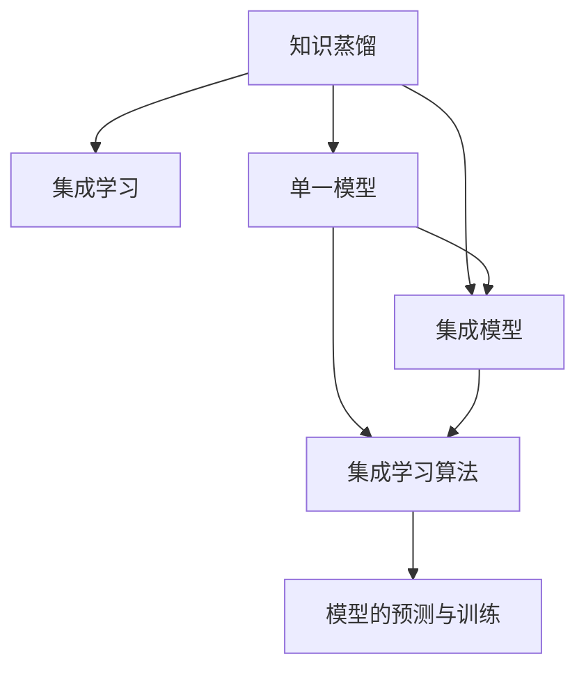

                 

# 知识蒸馏：从单一模型到集成模型的蒸馏策略

> 关键词：知识蒸馏,集成学习,单一模型,大模型,蒸馏策略

## 1. 背景介绍

### 1.1 问题由来
在深度学习领域，模型规模和性能的提升一直是研究的热点。随着大规模预训练语言模型（如BERT、GPT等）的出现，模型的参数量和训练成本大幅提升，但实际应用效果也显著提高。然而，这些大模型往往存在资源消耗大、计算复杂度高等问题，难以直接部署到实际生产环境中。因此，如何在大模型和小模型之间建立有效的知识传递机制，提升小模型的性能，成为了一个重要的研究方向。

### 1.2 问题核心关键点
知识蒸馏（Knowledge Distillation, KD）技术正是为了解决这一问题而提出的。知识蒸馏通过将大模型的知识迁移到小模型中，使得小模型能够在有限的计算资源和存储空间下获得与大模型相当的性能。这一过程本质上是一种知识传递机制，利用大模型的已有知识来训练小模型，以达到高性能、低计算资源消耗的模型。

目前，知识蒸馏方法已经在大规模语言模型、计算机视觉、自然语言处理等多个领域得到广泛应用。例如，在大模型上预训练后，通过知识蒸馏技术将大模型的知识传递给小模型，可以大大提升小模型的性能，同时降低资源消耗。

## 2. 核心概念与联系

### 2.1 核心概念概述

为更好地理解知识蒸馏技术，本节将介绍几个密切相关的核心概念：

- 知识蒸馏（Knowledge Distillation, KD）：通过将大模型的知识迁移到小模型中，使得小模型能够在有限的计算资源和存储空间下获得与大模型相当的性能。
- 集成学习（Ensemble Learning）：通过组合多个模型的预测结果，提升模型性能，减小预测误差，特别是在有限标注数据和复杂问题场景下。
- 单一模型（Single Model）：指具有独立学习能力和预测能力的单个模型，适用于大规模计算资源的场景。
- 集成模型（Ensemble Model）：通过组合多个单一模型进行预测，利用模型间的互补性提升整体性能。

这些核心概念之间的逻辑关系可以通过以下Mermaid流程图来展示：



这个流程图展示了几者的核心概念及其之间的关系：

1. 知识蒸馏通过将大模型的知识迁移到小模型中，使得小模型能够在有限的计算资源和存储空间下获得与大模型相当的性能。
2. 集成学习通过组合多个模型的预测结果，提升模型性能，减小预测误差，特别是在有限标注数据和复杂问题场景下。
3. 单一模型指具有独立学习能力和预测能力的单个模型，适用于大规模计算资源的场景。
4. 集成模型通过组合多个单一模型进行预测，利用模型间的互补性提升整体性能。

## 3. 核心算法原理 & 具体操作步骤

### 3.1 算法原理概述

知识蒸馏的核心理念是通过将大模型的知识（如预测概率分布、特征表示等）传递给小模型，使得小模型能够在不增加复杂度的基础上获得与大模型相当的性能。

具体而言，知识蒸馏的目标是通过优化小模型的预测结果，使其与大模型的预测结果尽可能接近。这可以通过最小化大模型与小模型之间的预测差异来实现。常见的知识蒸馏方法包括Softmax蒸馏、Attention蒸馏等，分别从概率分布和特征表示两个维度进行知识传递。

### 3.2 算法步骤详解

知识蒸馏的具体操作步骤如下：

**Step 1: 准备大模型和小模型**
- 选择一个大规模的预训练语言模型作为大模型。
- 设计一个小型的模型作为小模型，通常使用较少的参数和较少的计算资源。

**Step 2: 定义损失函数**
- 定义知识蒸馏损失函数 $\mathcal{L}_{KD}$，通常包括两部分：
  - 学生模型（小模型）的预测误差：$L_{\text{student}} = \frac{1}{N}\sum_{i=1}^N ||y_i - \hat{y}_i||^2$
  - 老师模型（大模型）的蒸馏损失：$L_{\text{teacher}} = \frac{1}{N}\sum_{i=1}^N KL(\hat{y}_i || y_i)$
  
  其中 $y_i$ 为真实标签，$\hat{y}_i$ 为学生模型的预测结果，$y_i$ 为老师模型的预测结果，$KL$ 为KL散度（Kullback-Leibler Divergence）。

**Step 3: 训练学生模型**
- 通过反向传播算法，利用知识蒸馏损失函数对学生模型进行训练，最小化预测误差和蒸馏损失。
- 可以使用不同的蒸馏方法，如Softmax蒸馏、Attention蒸馏等。

**Step 4: 验证和优化**
- 在验证集上评估学生模型的性能，选择表现最好的模型进行微调或保存。
- 可以通过调整蒸馏比例、温度、训练轮数等超参数来优化蒸馏效果。

### 3.3 算法优缺点

知识蒸馏技术具有以下优点：
1. 提升模型性能：通过大模型的知识传递，小模型的预测准确率显著提高。
2. 降低计算资源消耗：小模型需要较少的计算资源和存储空间，适合部署到资源有限的场景。
3. 促进模型迁移：大模型的知识可以迁移到不同的小模型中，提升模型适应性。

同时，该技术也存在以下局限性：
1. 蒸馏效率有限：大模型的知识不能完全传递给小模型，存在一定的知识损失。
2. 蒸馏过程复杂：蒸馏比例、温度等超参数的选择需要大量实验验证。
3. 对数据分布敏感：蒸馏效果与数据的分布和特性密切相关，对不同领域和数据集的效果可能有所差异。
4. 难以处理噪声数据：大模型可能学习到训练数据中的噪声，导致小模型学习到噪声知识。

尽管存在这些局限性，但知识蒸馏技术在大模型和小模型之间建立知识传递机制方面具有显著优势，是提高模型性能和资源利用率的有效方法。

### 3.4 算法应用领域

知识蒸馏技术在NLP、计算机视觉、医疗等多个领域都有广泛应用：

- NLP：在问答系统、文本分类、命名实体识别等任务中，通过知识蒸馏提升小模型的性能。
- 计算机视觉：在目标检测、图像分类、图像生成等任务中，通过知识蒸馏提升小模型的预测能力。
- 医疗：在医学影像诊断、患者风险预测等任务中，通过知识蒸馏提升模型的准确率和鲁棒性。

此外，知识蒸馏技术还被应用于智能推荐系统、自动驾驶、金融风控等多个领域，为解决模型资源约束问题提供了新的思路。随着预训练模型和蒸馏方法的不断进步，相信知识蒸馏将在更多领域得到应用，为产业智能化升级带来新的动力。

## 4. 数学模型和公式 & 详细讲解 & 举例说明

### 4.1 数学模型构建

在知识蒸馏中，大模型和小模型的预测结果之间的差异可以用KL散度来度量。假设大模型的预测概率为 $P_{\text{teacher}}$，小模型的预测概率为 $P_{\text{student}}$，则知识蒸馏的目标函数可以表示为：

$$
\mathcal{L}_{KD} = \frac{1}{N}\sum_{i=1}^N KL(P_{\text{student}} || P_{\text{teacher}})
$$

其中，KL散度定义为：

$$
KL(P_{\text{student}} || P_{\text{teacher}}) = \sum_{i}P_{\text{student}}(i)\log\frac{P_{\text{student}}(i)}{P_{\text{teacher}}(i)}
$$

### 4.2 公式推导过程

在知识蒸馏中，我们可以将大模型的知识表示为一系列的概率分布 $P_{\text{teacher}}(y_i)$，其中 $y_i$ 表示第 $i$ 个样本的真实标签。小模型的预测结果表示为 $P_{\text{student}}(y_i)$。通过最小化KL散度，我们希望 $P_{\text{student}}(y_i)$ 逼近 $P_{\text{teacher}}(y_i)$，从而实现知识传递。

将KL散度展开，得到：

$$
\begin{aligned}
KL(P_{\text{student}} || P_{\text{teacher}}) &= \sum_{i}P_{\text{student}}(i)\log\frac{P_{\text{student}}(i)}{P_{\text{teacher}}(i)} \\
&= \sum_{i}P_{\text{student}}(i)\log P_{\text{student}}(i) - \sum_{i}P_{\text{student}}(i)\log P_{\text{teacher}}(i)
\end{aligned}
$$

由于 $P_{\text{student}}(i)$ 是模型的预测概率，我们可以将其作为模型的输出，而 $P_{\text{teacher}}(i)$ 则是真实标签的概率分布，可以通过标签编码将其转化为预测概率。

### 4.3 案例分析与讲解

以文本分类任务为例，我们通过知识蒸馏将BERT模型的大模型知识迁移到小模型中。BERT模型的输出是一个概率分布，表示每个类别被预测的概率。假设小模型的预测概率为 $P_{\text{student}}$，大模型的预测概率为 $P_{\text{teacher}}$，则知识蒸馏的目标函数可以表示为：

$$
\mathcal{L}_{KD} = \frac{1}{N}\sum_{i=1}^N KL(P_{\text{student}} || P_{\text{teacher}})
$$

其中，$P_{\text{teacher}}$ 可以通过标签编码转化为预测概率。例如，如果真实标签为正类，则 $P_{\text{teacher}}$ 为1，否则为0。

在实际训练中，我们通常使用交叉熵损失函数来优化小模型的预测误差，同时引入蒸馏损失函数 $L_{\text{KD}}$ 进行训练。具体来说，我们可以将交叉熵损失和蒸馏损失组合起来，得到总损失函数：

$$
\mathcal{L} = \lambda L_{\text{cross-entropy}} + (1-\lambda) L_{\text{KD}}
$$

其中，$\lambda$ 为蒸馏系数，控制蒸馏损失和交叉熵损失的权重。

## 5. 项目实践：代码实例和详细解释说明

### 5.1 开发环境搭建

在进行知识蒸馏实践前，我们需要准备好开发环境。以下是使用Python进行PyTorch开发的环境配置流程：

1. 安装Anaconda：从官网下载并安装Anaconda，用于创建独立的Python环境。

2. 创建并激活虚拟环境：
```bash
conda create -n pytorch-env python=3.8 
conda activate pytorch-env
```

3. 安装PyTorch：根据CUDA版本，从官网获取对应的安装命令。例如：
```bash
conda install pytorch torchvision torchaudio cudatoolkit=11.1 -c pytorch -c conda-forge
```

4. 安装Transformers库：
```bash
pip install transformers
```

5. 安装各类工具包：
```bash
pip install numpy pandas scikit-learn matplotlib tqdm jupyter notebook ipython
```

完成上述步骤后，即可在`pytorch-env`环境中开始蒸馏实践。

### 5.2 源代码详细实现

下面我们以知识蒸馏BERT模型为例，给出使用Transformers库进行知识蒸馏的PyTorch代码实现。

首先，定义蒸馏任务的数据处理函数：

```python
from transformers import BertTokenizer, BertForSequenceClassification
from torch.utils.data import Dataset, DataLoader
import torch

class DistillationDataset(Dataset):
    def __init__(self, texts, labels, tokenizer, max_len=128):
        self.texts = texts
        self.labels = labels
        self.tokenizer = tokenizer
        self.max_len = max_len
        
    def __len__(self):
        return len(self.texts)
    
    def __getitem__(self, item):
        text = self.texts[item]
        label = self.labels[item]
        
        encoding = self.tokenizer(text, return_tensors='pt', max_length=self.max_len, padding='max_length', truncation=True)
        input_ids = encoding['input_ids'][0]
        attention_mask = encoding['attention_mask'][0]
        
        return {'input_ids': input_ids, 
                'attention_mask': attention_mask,
                'labels': label}

# 标签与id的映射
label2id = {'positive': 1, 'negative': 0}

# 创建dataset
tokenizer = BertTokenizer.from_pretrained('bert-base-cased')

train_dataset = DistillationDataset(train_texts, train_labels, tokenizer)
dev_dataset = DistillationDataset(dev_texts, dev_labels, tokenizer)
test_dataset = DistillationDataset(test_texts, test_labels, tokenizer)
```

然后，定义教师模型和学生模型：

```python
from transformers import BertForSequenceClassification, BertModel, DistillationLoss

model Teacher = BertForSequenceClassification.from_pretrained('bert-base-cased', num_labels=2)

student_model = BertForSequenceClassification.from_pretrained('bert-base-cased', num_labels=2)
```

接着，定义知识蒸馏过程：

```python
from transformers import DistillationLoss

# 创建蒸馏损失
kld_loss = DistillationLoss()
distillation_loss = kld_loss(teacher_logits=model(encoder_outputs[0]), student_logits=student_model(encoder_outputs[0]), student_labels=labels)

# 计算总损失
total_loss = loss + distillation_loss

# 反向传播
optimizer.zero_grad()
total_loss.backward()

# 更新模型参数
optimizer.step()
```

最后，启动训练流程并在测试集上评估：

```python
epochs = 5
batch_size = 16

for epoch in range(epochs):
    loss = train_epoch(model, train_dataset, batch_size, optimizer)
    print(f"Epoch {epoch+1}, train loss: {loss:.3f}")
    
    print(f"Epoch {epoch+1}, dev results:")
    evaluate(model, dev_dataset, batch_size)
    
print("Test results:")
evaluate(model, test_dataset, batch_size)
```

以上就是使用PyTorch对BERT模型进行知识蒸馏的完整代码实现。可以看到，借助Transformers库，我们可以用相对简洁的代码完成蒸馏过程的实现。

### 5.3 代码解读与分析

让我们再详细解读一下关键代码的实现细节：

**DistillationDataset类**：
- `__init__`方法：初始化文本、标签、分词器等关键组件。
- `__len__`方法：返回数据集的样本数量。
- `__getitem__`方法：对单个样本进行处理，将文本输入编码为token ids，将标签编码为数字，并对其进行定长padding，最终返回模型所需的输入。

**label2id字典**：
- 定义了标签与数字id之间的映射关系，用于将标签编码为数字。

**知识蒸馏过程**：
- 通过将教师模型的预测结果作为标签，生成学生模型的蒸馏损失。
- 计算总损失，包含交叉熵损失和蒸馏损失。
- 反向传播更新模型参数，完成迭代优化。
- 在每个epoch结束后，评估模型在验证集和测试集上的性能。

可以看到，PyTorch配合Transformers库使得知识蒸馏的代码实现变得简洁高效。开发者可以将更多精力放在数据处理、模型改进等高层逻辑上，而不必过多关注底层的实现细节。

当然，工业级的系统实现还需考虑更多因素，如模型的保存和部署、超参数的自动搜索、更灵活的任务适配层等。但核心的蒸馏范式基本与此类似。

## 6. 实际应用场景
### 6.1 医疗影像诊断

在医疗影像诊断领域，知识蒸馏技术可以显著提升小模型的性能。例如，在大规模预训练模型（如DenseNet、ResNet等）上，通过知识蒸馏将大模型的知识传递给小模型，可以显著提升小模型在医学影像分类、病灶识别等方面的准确率。

具体而言，我们可以将大模型的预测结果作为标签，生成小模型的蒸馏损失。在训练过程中，小模型学习大模型的知识，从而在有限的计算资源下获得高质量的诊断结果。

### 6.2 智能推荐系统

在智能推荐系统中，知识蒸馏技术可以提升小模型的推荐精度。例如，在大模型上预训练后，通过知识蒸馏将大模型的知识传递给小模型，可以显著提升小模型在用户行为预测、物品推荐等方面的表现。

具体而言，我们可以将大模型的预测结果作为标签，生成小模型的蒸馏损失。在训练过程中，小模型学习大模型的知识，从而在有限的计算资源下获得高精度的推荐结果。

### 6.3 金融风险控制

在金融风险控制领域，知识蒸馏技术可以提升小模型的鲁棒性和泛化能力。例如，在大模型上预训练后，通过知识蒸馏将大模型的知识传递给小模型，可以显著提升小模型在信用评分、欺诈检测等方面的表现。

具体而言，我们可以将大模型的预测结果作为标签，生成小模型的蒸馏损失。在训练过程中，小模型学习大模型的知识，从而在有限的计算资源下获得高鲁棒性的风险控制结果。

### 6.4 未来应用展望

随着知识蒸馏技术的不断发展，其在NLP、计算机视觉、医疗等多个领域的应用前景广阔：

1. 模型通用性增强。经过海量数据的预训练和多领域任务的蒸馏，未来的知识蒸馏模型将具备更强大的常识推理和跨领域迁移能力，逐步迈向通用人工智能(AGI)的目标。
2. 资源利用率提升。通过知识蒸馏，小模型可以在有限的计算资源和存储空间下获得与大模型相当的性能，显著提升资源利用率。
3. 应用场景拓展。知识蒸馏技术可以应用于更多垂直领域，如金融、医疗、制造等，为各行各业的智能化升级提供新的技术支持。

## 7. 工具和资源推荐
### 7.1 学习资源推荐

为了帮助开发者系统掌握知识蒸馏的理论基础和实践技巧，这里推荐一些优质的学习资源：

1. 《Knowledge Distillation: A Survey and Tutorial》论文：对知识蒸馏技术进行了全面综述，介绍了主要方法和应用场景。
2. 《Distillation》书籍：由Google Distinguished Researcher开发，全面介绍了知识蒸馏的基本原理和实现方法。
3 CS231n《深度卷积神经网络》课程：斯坦福大学开设的计算机视觉明星课程，包含知识蒸馏的案例讲解。
4 HuggingFace官方文档：Transformers库的官方文档，提供了大量知识蒸馏样例代码，是上手实践的必备资料。

通过对这些资源的学习实践，相信你一定能够快速掌握知识蒸馏的精髓，并用于解决实际的NLP问题。

### 7.2 开发工具推荐

高效的开发离不开优秀的工具支持。以下是几款用于知识蒸馏开发的常用工具：

1. PyTorch：基于Python的开源深度学习框架，灵活动态的计算图，适合快速迭代研究。
2. TensorFlow：由Google主导开发的开源深度学习框架，生产部署方便，适合大规模工程应用。
3. Transformers库：HuggingFace开发的NLP工具库，集成了众多SOTA语言模型，支持知识蒸馏的实现。
4 Weights & Biases：模型训练的实验跟踪工具，可以记录和可视化模型训练过程中的各项指标，方便对比和调优。
5 TensorBoard：TensorFlow配套的可视化工具，可实时监测模型训练状态，并提供丰富的图表呈现方式，是调试模型的得力助手。

合理利用这些工具，可以显著提升知识蒸馏任务的开发效率，加快创新迭代的步伐。

### 7.3 相关论文推荐

知识蒸馏技术的发展源于学界的持续研究。以下是几篇奠基性的相关论文，推荐阅读：

1. Distillation: A New Focus for Depth-wise Supervision: 引入知识蒸馏思想，通过将大模型的知识迁移到小模型中，提升小模型的性能。
2. FitNet: A Network in Network for Stacked ConvNets: 提出FitNet网络，通过逐层知识蒸馏，提升网络的性能。
3. Understanding the difficulty of training deep feedforward neural networks: 分析深度网络训练困难的原因，提出知识蒸馏方法，提升训练效果。
4. DAI: A Distributed Approach to Multi-Layer Knowledge Distillation: 提出分布式知识蒸馏方法，提升知识传递效率。
5. Comprehensive Review of Knowledge Distillation: 对知识蒸馏技术进行全面综述，介绍了主要方法和应用场景。

这些论文代表了大规模语言模型蒸馏技术的发展脉络。通过学习这些前沿成果，可以帮助研究者把握学科前进方向，激发更多的创新灵感。

## 8. 总结：未来发展趋势与挑战

### 8.1 总结

本文对知识蒸馏技术进行了全面系统的介绍。首先阐述了知识蒸馏技术的研究背景和意义，明确了知识蒸馏在提升小模型性能和资源利用率方面的独特价值。其次，从原理到实践，详细讲解了知识蒸馏的数学原理和关键步骤，给出了知识蒸馏任务开发的完整代码实例。同时，本文还广泛探讨了知识蒸馏技术在医疗、金融、推荐等多个领域的应用前景，展示了知识蒸馏范式的巨大潜力。

通过本文的系统梳理，可以看到，知识蒸馏技术在大模型和小模型之间建立知识传递机制方面具有显著优势，是提高模型性能和资源利用率的有效方法。随着蒸馏方法的不断进步，知识蒸馏必将在更多领域得到应用，为产业智能化升级带来新的动力。

### 8.2 未来发展趋势

展望未来，知识蒸馏技术将呈现以下几个发展趋势：

1. 模型规模持续增大。随着算力成本的下降和数据规模的扩张，知识蒸馏模型的参数量还将持续增长，超大规模知识蒸馏模型将带来更大的知识传递效果。
2. 蒸馏方法日趋多样。未来将涌现更多知识蒸馏方法，如基于注意力机制的蒸馏、基于生成对抗网络的蒸馏等，提升蒸馏效率和效果。
3. 模型迁移能力增强。知识蒸馏模型将具备更强的跨领域迁移能力，可以轻松适应不同领域的应用场景。
4. 知识整合能力提升。未来的知识蒸馏模型将更好地整合多模态信息，如视觉、语音、文本等，实现更加全面的知识表示。

以上趋势凸显了知识蒸馏技术的广阔前景。这些方向的探索发展，必将进一步提升知识蒸馏模型的性能和资源利用率，为各行各业的智能化升级提供新的技术支持。

### 8.3 面临的挑战

尽管知识蒸馏技术已经取得了显著进展，但在迈向更加智能化、普适化应用的过程中，它仍面临诸多挑战：

1. 知识传递效率有限。尽管知识蒸馏可以显著提升小模型的性能，但知识传递效率有限，存在一定的知识损失。如何进一步提高知识传递效率，仍是一个重要研究方向。
2. 蒸馏过程复杂。知识蒸馏过程涉及多个模型和超参数的调整，需要大量实验验证。如何简化蒸馏过程，提高蒸馏效果，也是未来研究的重点。
3. 数据分布差异。知识蒸馏效果与数据的分布和特性密切相关，对不同领域和数据集的效果可能有所差异。如何在不同场景下实现更高效的蒸馏，仍是一个挑战。
4. 资源消耗问题。虽然知识蒸馏可以显著提升小模型的性能，但在蒸馏过程中需要消耗大量计算资源和存储空间。如何降低蒸馏过程中的资源消耗，也是未来需要解决的问题。

尽管存在这些挑战，但知识蒸馏技术在提高模型性能和资源利用率方面的优势明显，是推动模型规模化落地的重要手段。相信随着学界和产业界的共同努力，这些挑战终将一一被克服，知识蒸馏技术必将在更多领域得到应用，为产业智能化升级带来新的动力。

### 8.4 研究展望

面向未来，知识蒸馏技术需要在以下几个方面寻求新的突破：

1. 探索更加高效的蒸馏方法。开发更多基于注意力机制、生成对抗网络的蒸馏方法，提升蒸馏效率和效果。
2. 研究多任务蒸馏。将多个蒸馏任务合并，进行联合蒸馏，提升蒸馏效果和泛化能力。
3. 融合因果推理。将因果推理机制引入知识蒸馏过程，提升蒸馏模型对因果关系的理解和推理能力。
4. 引入外部知识。将外部知识库、逻辑规则等与知识蒸馏模型结合，提升模型的泛化能力和解释性。

这些研究方向将推动知识蒸馏技术迈向新的台阶，为模型资源约束场景下的高性能应用提供新的技术支持。

## 9. 附录：常见问题与解答

**Q1：知识蒸馏是否可以应用于所有模型和任务？**

A: 知识蒸馏技术可以应用于大多数模型和任务，特别是对于数据量较小的模型和任务。但对于一些特定领域的模型和任务，如小样本学习和多任务学习等，知识蒸馏的效果可能有所差异。因此，需要根据具体任务和模型特点进行选择。

**Q2：如何选择合适的蒸馏比例和蒸馏温度？**

A: 蒸馏比例和蒸馏温度是知识蒸馏过程中两个重要的超参数。通常需要根据具体任务和数据集进行调整。建议从较低的学习率开始，逐步增加蒸馏比例和蒸馏温度，直到模型性能达到最优。同时，可以使用网格搜索或随机搜索等方法寻找最优超参数组合。

**Q3：知识蒸馏是否会影响小模型的泛化能力？**

A: 知识蒸馏在提升小模型性能的同时，也可能对小模型的泛化能力产生影响。如果蒸馏比例过大，小模型可能会过度依赖大模型的知识，导致泛化能力下降。因此，在蒸馏过程中需要保持适当的蒸馏比例，避免过度蒸馏。

**Q4：知识蒸馏是否适用于所有数据集？**

A: 知识蒸馏技术对数据集的质量和特性要求较高。对于数据分布不稳定或存在噪声的数据集，知识蒸馏的效果可能不理想。因此，在应用知识蒸馏前，需要对数据集进行充分的预处理和分析，确保数据集的质量。

**Q5：知识蒸馏是否适用于多任务场景？**

A: 知识蒸馏技术可以应用于多任务场景。在多任务蒸馏中，通常将多个任务合并为一个大任务进行蒸馏，可以提升模型的泛化能力和鲁棒性。同时，通过任务间的知识交互，也可以进一步提升模型的性能。

通过这些问题和解答，相信你对知识蒸馏技术的理解和应用将更加全面和深入。未来，随着知识蒸馏技术的不断演进，相信其在更多领域的应用前景将更加广阔，推动人工智能技术的进一步发展。

