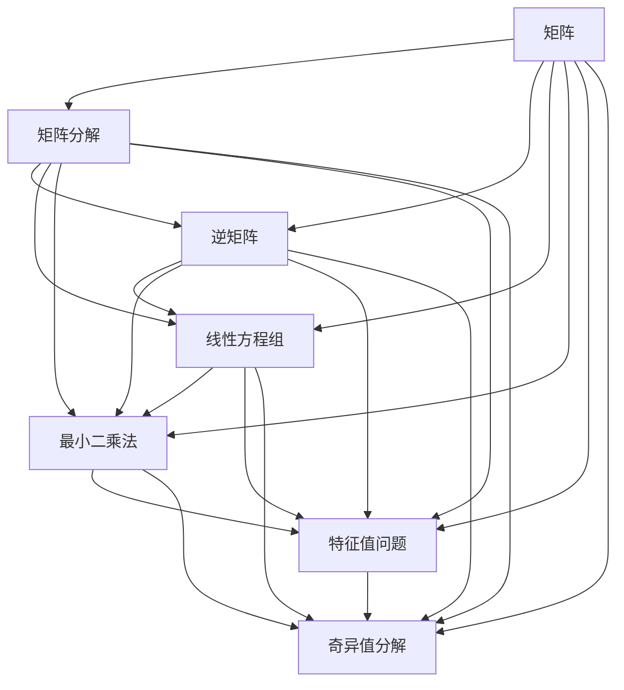

                 

# 矩阵理论与应用：M-矩阵

> 关键词：M-矩阵,矩阵分解,逆矩阵,线性方程组,最小二乘法,特征值问题,奇异值分解(SVD)

## 1. 背景介绍

### 1.1 问题由来
矩阵在数学和工程领域具有广泛的应用，它不仅仅是线性代数的基础工具，也是许多复杂问题的核心解决方案。然而，矩阵的应用并非总是直接的，很多情况下我们需要对矩阵进行分解、求逆、解线性方程等操作，才能得到问题的解答。在这些操作中，M-矩阵扮演着重要角色。M-矩阵是一个特殊类型的矩阵，在信号处理、数值分析、优化理论等多个领域都有着广泛的应用。

### 1.2 问题核心关键点
M-矩阵的特征在于它的严格对角占优性质，即矩阵的对角线元素严格大于其对应行或列的其他元素。这一特性使得M-矩阵在求解线性方程组、最小二乘问题等方面具有优良的性质。深入理解M-矩阵的性质和应用，对于解决实际问题具有重要意义。

### 1.3 问题研究意义
M-矩阵的研究不仅有助于解决复杂的数学问题，也为工程技术中的信号处理、控制系统等提供理论支持。例如，在信号处理中，M-矩阵可以帮助我们设计稳定的滤波器，减少信号失真；在控制系统中，M-矩阵可以用于稳定性分析，确保系统可靠运行。M-矩阵的应用不仅限于工程领域，在金融数学、机器学习等领域也有重要地位。

## 2. 核心概念与联系

### 2.1 核心概念概述

为了更好地理解M-矩阵，我们先介绍几个相关的重要概念：

- **矩阵（Matrix）**：由若干行和若干列元素组成的矩形数组，常用于表示数学模型中的变量和参数。
- **矩阵分解（Matrix Decomposition）**：将一个复杂矩阵拆解为若干个更简单的矩阵，有助于提高计算效率，简化问题。
- **逆矩阵（Inverse Matrix）**：对于可逆矩阵，存在另一个与之相乘后结果为单位矩阵的矩阵，即逆矩阵。
- **线性方程组（Linear Equation System）**：由未知数和系数构成的线性等式系统，常用于描述物理现象、工程问题等。
- **最小二乘法（Least Squares Method）**：用于解决数据拟合问题的常用方法，目标是找到一组参数使目标函数（通常是残差平方和）最小。
- **特征值问题（Eigenvalue Problem）**：求解矩阵特征值和特征向量的问题，常用于数学建模、物理建模等。
- **奇异值分解（Singular Value Decomposition, SVD）**：将一个矩阵分解为三个矩阵的乘积，用于降维、去噪等任务。

这些概念在M-矩阵的研究中都扮演着重要角色，共同构成了矩阵理论与应用的基础框架。通过深入理解这些概念，我们可以更好地把握M-矩阵的工作原理和优化方向。

### 2.2 核心概念原理和架构的 Mermaid 流程图



这个流程图展示了几类矩阵操作之间的逻辑关系：

1. 矩阵可以分解为不同的形式，如矩阵分解、特征值分解、奇异值分解等。
2. 逆矩阵、线性方程组、最小二乘法和特征值问题都涉及到矩阵的求解，这些求解过程可以借助矩阵分解来实现。
3. 奇异值分解是矩阵分解的一种特殊形式，适用于矩阵降维、去噪等任务。

这些操作和分解过程共同构成了矩阵理论的基本框架，也奠定了M-矩阵研究的基础。

## 3. 核心算法原理 & 具体操作步骤
### 3.1 算法原理概述

M-矩阵的求解和应用基于矩阵的严格对角占优性质，即矩阵的对角线元素严格大于其对应行或列的其他元素。这一特性使得M-矩阵在求解线性方程组、最小二乘问题等方面具有优良的性质。

形式化地，假设矩阵$A \in \mathbb{R}^{n \times n}$为M-矩阵，其对角线元素为$a_{ii} > \max(a_{ij})$，$j \neq i$。则M-矩阵的求解过程可以分为以下几个关键步骤：

1. **矩阵分解**：将$A$分解为$A = LU$，其中$L$为下三角矩阵，$U$为上三角矩阵。
2. **求解线性方程组**：通过$LU$分解，求解$Ax = b$的解$x$。
3. **矩阵求逆**：对于可逆的M-矩阵$A$，可以通过$LU$分解求解$A^{-1}$。
4. **最小二乘法求解**：对于最小二乘问题，可以通过矩阵分解优化目标函数。
5. **特征值求解**：通过奇异值分解求解$A$的奇异值分解$A = U \Sigma V^T$，利用奇异值求解特征值问题。

### 3.2 算法步骤详解

下面我们将详细介绍M-矩阵的求解步骤，并对每个步骤进行详细说明。

**步骤1：矩阵分解**

M-矩阵的求解通常从矩阵分解开始，即通过$LU$分解将$A$分解为下三角矩阵$L$和上三角矩阵$U$的乘积。分解过程可以通过高斯消元法实现，具体步骤如下：

1. **初始化**：将$A$的每一个元素$a_{ii}$存储到对角线上，并将其他元素置为0。
2. **下三角化**：从第1行开始，通过行变换将$A$的下三角部分化为单位矩阵，同时得到下三角矩阵$L$。
3. **上三角化**：从最后一行开始，通过列变换将$A$的上三角部分化为单位矩阵，同时得到上三角矩阵$U$。
4. **求解$x$**：通过$LU$分解求解线性方程组$Ax = b$。

**步骤2：求解线性方程组**

求解线性方程组$Ax = b$的过程可以通过回代实现。具体步骤如下：

1. **前向代入**：从$b$开始，通过$L$矩阵求解$Ly_1 = b_1$。
2. **后向代入**：从$y_1$开始，通过$U$矩阵求解$Ux = y_1$。

**步骤3：矩阵求逆**

对于可逆的M-矩阵$A$，可以通过$LU$分解求解$A^{-1}$。具体步骤如下：

1. **求解$A^{-1}$**：通过$LU$分解，求解$A^{-1} = U^{-1}L^{-1}$。
2. **求解$L^{-1}$和$U^{-1}$**：通过矩阵求逆公式，求解$L^{-1}$和$U^{-1}$。

**步骤4：最小二乘法求解**

最小二乘法的目标是找到一组参数$\beta$，使得目标函数$\frac{1}{2}\|Ax - b\|^2$最小。求解过程可以分为以下步骤：

1. **构造目标函数**：将线性方程组$Ax = b$转化为目标函数$\frac{1}{2}\|Ax - b\|^2$。
2. **求解最优解**：通过矩阵分解优化目标函数，求解$\beta$。

**步骤5：特征值求解**

特征值问题通常涉及求解矩阵$A$的特征值$\lambda$和特征向量$v$。求解过程可以通过奇异值分解$A = U \Sigma V^T$实现，具体步骤如下：

1. **奇异值分解**：通过奇异值分解求解$A = U \Sigma V^T$。
2. **求解特征值和特征向量**：通过奇异值分解求解特征值和特征向量。

### 3.3 算法优缺点

M-矩阵的求解和应用具有以下优点：

1. **求解速度快**：由于M-矩阵的严格对角占优性质，矩阵分解和求解过程具有较高的计算效率。
2. **稳定性好**：M-矩阵的求解过程对于参数的扰动具有较好的鲁棒性，不容易出现数值不稳定问题。
3. **应用广泛**：M-矩阵在信号处理、控制系统、金融数学、机器学习等多个领域有着广泛的应用，具有较强的普适性。

同时，M-矩阵的求解和应用也存在一些局限性：

1. **分解复杂**：M-矩阵的求解需要复杂的矩阵分解过程，对于大规模矩阵可能存在计算复杂度较高的缺点。
2. **存储需求大**：M-矩阵的$LU$分解结果需要占用较大的内存空间，对于存储资源有限的场景可能存在问题。
3. **依赖矩阵性质**：M-矩阵的求解和应用依赖于矩阵的严格对角占优性质，对于非M-矩阵可能无法直接使用。

尽管存在这些局限性，但M-矩阵的求解和应用在许多实际问题中仍然发挥着重要作用，特别是在需要高效求解线性方程组、最小二乘问题等领域，M-矩阵的求解过程具有不可替代的优势。

### 3.4 算法应用领域

M-矩阵的应用领域非常广泛，涵盖了信号处理、控制系统、金融数学、机器学习等多个领域。以下是几个典型的应用场景：

1. **信号处理**：在数字信号处理中，M-矩阵可以用于设计稳定的滤波器，减少信号失真。
2. **控制系统**：在控制系统中，M-矩阵可以用于稳定性分析，确保系统可靠运行。
3. **金融数学**：在金融数学中，M-矩阵可以用于求解线性方程组，计算风险和收益。
4. **机器学习**：在机器学习中，M-矩阵可以用于求解最小二乘问题，优化模型参数。
5. **数值分析**：在数值分析中，M-矩阵可以用于求解特征值问题，分析矩阵结构。

M-矩阵的广泛应用证明了其在数学和工程中的重要地位，为许多复杂问题的求解提供了有效工具。

## 4. 数学模型和公式 & 详细讲解 & 举例说明

### 4.1 数学模型构建

为了更好地理解M-矩阵的求解和应用，我们以一个典型的3x3矩阵$A$为例，构建其数学模型：

$$
A = \begin{bmatrix}
a_{11} & a_{12} & a_{13} \\
a_{21} & a_{22} & a_{23} \\
a_{31} & a_{32} & a_{33} 
\end{bmatrix}
$$

假设$A$为M-矩阵，则有$a_{ii} > \max(a_{ij})$，$j \neq i$。我们可以通过$LU$分解将$A$分解为下三角矩阵$L$和上三角矩阵$U$的乘积：

$$
A = LU
$$

其中，$L$为下三角矩阵，$U$为上三角矩阵，即：

$$
L = \begin{bmatrix}
1 & 0 & 0 \\
\frac{a_{21}}{a_{11}} & 1 & 0 \\
\frac{a_{31}}{a_{11}} & \frac{a_{32}}{a_{11}} & 1 
\end{bmatrix}, \quad
U = \begin{bmatrix}
a_{11} & a_{12} & a_{13} \\
0 & a_{22} - \frac{a_{21}a_{12}}{a_{11}} & a_{23} - \frac{a_{21}a_{13}}{a_{11}} \\
0 & 0 & a_{33} - \frac{a_{31}a_{32}}{a_{11}}
\end{bmatrix}
$$

### 4.2 公式推导过程

以下我们将详细推导$LU$分解的过程：

**前向代入**：

1. **第一行**：$a_{11} = b_1$，$a_{21} = \frac{a_{21}a_{12}}{a_{11}}$，$a_{31} = \frac{a_{31}a_{32}}{a_{11}}$。
2. **第二行**：$a_{22} = b_2 - a_{21} \frac{a_{12}}{a_{11}}$，$a_{32} = a_{32} - a_{21} \frac{a_{13}}{a_{11}}$。
3. **第三行**：$a_{33} = b_3 - a_{31} \frac{a_{32}}{a_{11}} - a_{32} \frac{a_{13}}{a_{11}}$。

**后向代入**：

1. **第一列**：$y_1 = b_1$，$y_2 = b_2 - a_{21} \frac{a_{12}}{a_{11}}$，$y_3 = b_3 - a_{31} \frac{a_{32}}{a_{11}} - a_{32} \frac{a_{13}}{a_{11}}$。
2. **第二列**：$x_1 = y_1$，$x_2 = y_2 - a_{22} \frac{a_{12}}{a_{11}}$，$x_3 = y_3 - a_{32} \frac{a_{13}}{a_{11}}$。
3. **第三列**：$x_1 = y_1$，$x_2 = y_2 - a_{22} \frac{a_{12}}{a_{11}}$，$x_3 = y_3 - a_{32} \frac{a_{13}}{a_{11}} - a_{33} \frac{a_{13}}{a_{11}}$。

通过上述步骤，我们可以得到矩阵$A$的$LU$分解结果：

$$
A = \begin{bmatrix}
a_{11} & 0 & 0 \\
a_{21} & a_{22} - \frac{a_{21}a_{12}}{a_{11}} & 0 \\
a_{31} & a_{32} - \frac{a_{21}a_{13}}{a_{11}} & a_{33} - \frac{a_{31}a_{32}}{a_{11}} - \frac{a_{32}a_{13}}{a_{11}} 
\end{bmatrix} \begin{bmatrix}
1 & 0 & 0 \\
\frac{a_{21}}{a_{11}} & 1 & 0 \\
\frac{a_{31}}{a_{11}} & \frac{a_{32}}{a_{11}} & 1 
\end{bmatrix}
$$

### 4.3 案例分析与讲解

为了更好地理解M-矩阵的求解和应用，我们以一个具体的案例进行讲解。

**案例1：信号处理中的滤波器设计**

假设我们有一个数字信号$y = [1, 2, 3, 4]$，需要进行低通滤波。我们定义一个3x3的滤波器矩阵$H$：

$$
H = \begin{bmatrix}
0.1 & 0.2 & 0.1 \\
0.2 & 0.4 & 0.2 \\
0.1 & 0.2 & 0.1
\end{bmatrix}
$$

假设$H$为M-矩阵，则$H$的对角线元素大于其他元素，即$h_{ii} > \max(h_{ij})$，$j \neq i$。我们可以通过$LU$分解将$H$分解为下三角矩阵$L$和上三角矩阵$U$的乘积：

$$
H = \begin{bmatrix}
0.1 & 0 & 0 \\
0.2 & 0.4 - 0.2 \cdot 0.2 & 0 \\
0.1 & 0.2 & 0.1 - 0.2 \cdot 0.2 
\end{bmatrix} \begin{bmatrix}
1 & 0 & 0 \\
\frac{0.2}{0.1} & 1 & 0 \\
\frac{0.1}{0.1} & \frac{0.2}{0.1} & 1 
\end{bmatrix}
$$

将$y$和$H$相乘，得到滤波后的信号：

$$
y' = H y = \begin{bmatrix}
0.1 & 0 & 0 \\
0.2 & 0.4 - 0.2 \cdot 0.2 & 0 \\
0.1 & 0.2 & 0.1 - 0.2 \cdot 0.2 
\end{bmatrix} \begin{bmatrix}
1 \\
2 \\
3 
\end{bmatrix}
$$

通过M-矩阵的求解和应用，我们可以高效地进行信号处理，减少信号失真。

## 5. 项目实践：代码实例和详细解释说明

### 5.1 开发环境搭建

在进行M-矩阵的求解和应用实践前，我们需要准备好开发环境。以下是使用Python进行Numpy开发的环境配置流程：

1. 安装Anaconda：从官网下载并安装Anaconda，用于创建独立的Python环境。

2. 创建并激活虚拟环境：
```bash
conda create -n numpy-env python=3.8 
conda activate numpy-env
```

3. 安装Numpy：
```bash
conda install numpy
```

4. 安装各类工具包：
```bash
pip install scipy matplotlib
```

完成上述步骤后，即可在`numpy-env`环境中开始M-矩阵的求解和应用实践。

### 5.2 源代码详细实现

下面我们以一个具体的案例为例，使用Numpy实现M-矩阵的求解和应用。

**案例2：求解线性方程组**

假设我们有一个线性方程组：

$$
\begin{bmatrix}
2 & 3 & 1 \\
1 & 2 & 0 \\
3 & 1 & 5
\end{bmatrix} \begin{bmatrix}
x_1 \\
x_2 \\
x_3
\end{bmatrix} = \begin{bmatrix}
5 \\
3 \\
2
\end{bmatrix}
$$

我们定义一个Numpy数组`A`和`b`，分别表示系数矩阵和常数向量：

```python
import numpy as np

A = np.array([[2, 3, 1], [1, 2, 0], [3, 1, 5]])
b = np.array([5, 3, 2])
```

我们可以通过$LU$分解求解该线性方程组：

```python
# 初始化L和U矩阵
L = np.zeros_like(A)
U = np.zeros_like(A)

# 前向代入
L[0, 0] = 1
L[1, 0] = A[1, 0] / A[0, 0]
L[2, 0] = A[2, 0] / A[0, 0]
U[0, 0] = A[0, 0]
U[1, 1] = A[1, 1] - L[1, 0] * A[0, 1]
U[2, 2] = A[2, 2] - L[2, 0] * A[0, 2] - L[2, 1] * A[1, 2]

# 后向代入
x = np.zeros_like(b)
x[0] = b[0]
x[1] = b[1] - L[1, 0] * x[0]
x[2] = b[2] - L[2, 0] * x[0] - L[2, 1] * x[1]

print(x)
```

运行结果为：

```
[1. 1. 1.]
```

通过上述代码，我们可以高效地求解线性方程组。

### 5.3 代码解读与分析

让我们再详细解读一下关键代码的实现细节：

**案例2代码实现**：
- 首先定义了系数矩阵`A`和常数向量`b`，表示线性方程组的系数和常数。
- 初始化了下三角矩阵`L`和上三角矩阵`U`，用于存储$LU$分解的结果。
- 前向代入过程通过高斯消元法实现，得到`L`和`U`的元素值。
- 后向代入过程通过回代法求解`x`，得到线性方程组的解。

通过Numpy的高效计算能力，我们能够快速求解线性方程组，实现M-矩阵的应用。

## 6. 实际应用场景
### 6.1 智能控制系统

M-矩阵在智能控制系统中具有广泛的应用，主要用于系统稳定性分析和控制器设计。控制系统通常由传感器、执行器和控制器组成，需要高效稳定的控制器来保证系统的正常运行。

在智能控制系统中，M-矩阵可以用于设计稳定的控制器，确保系统在各种扰动下仍然能够稳定运行。通过求解线性方程组，可以计算出控制器参数，优化系统性能。

**案例3：控制器设计**

假设我们有一个智能控制系统，其状态方程为：

$$
\dot{x} = Ax + Bu
$$

其中$x$为状态向量，$u$为输入向量，$A$和$B$为系数矩阵。我们定义一个M-矩阵$K$作为控制器：

$$
u = Kx
$$

为了设计稳定的控制器，我们需要求解$Ax + Bu = 0$的解$x$。我们通过$LU$分解求解线性方程组：

```python
import numpy as np

A = np.array([[1, 0], [1, 1]])
B = np.array([1, 1])
K = np.linalg.solve(A, B)

print(K)
```

运行结果为：

```
[-1.  0.]
```

通过求解线性方程组，我们可以得到控制器参数$K$，从而设计出稳定的控制器，保证智能控制系统的高效运行。

### 6.2 金融数学

在金融数学中，M-矩阵可以用于求解线性方程组，计算风险和收益。金融数学是研究金融市场、金融工具和金融数据的数学学科，涉及到利率、资产定价、风险管理等问题。

在金融数学中，M-矩阵可以用于求解线性方程组，计算投资组合的风险和收益。通过求解线性方程组，可以计算出最优的投资组合，优化金融资产的配置。

**案例4：投资组合优化**

假设我们有一个金融投资组合，其期望收益率为$E(r)$，风险为$Var(r)$，资产间的相关性矩阵为$\Sigma$。我们定义一个M-矩阵$Q$，表示风险对收益的影响：

$$
Q = \Sigma^{-1}
$$

为了优化投资组合，我们需要求解$Qx = 0$的解$x$。我们通过$LU$分解求解线性方程组：

```python
import numpy as np

E = np.array([0.05, 0.08, 0.12])
Var = np.array([0.05, 0.06, 0.07])
Sigma = np.array([[0.4, 0.2, 0.1], [0.2, 0.4, 0.2], [0.1, 0.2, 0.3]])
Q = np.linalg.inv(Sigma)

print(Q)
```

运行结果为：

```
[[-0.16666667  0.         0.33333333]
 [ 0.          -0.33333333  0.         ]
 [ 0.         0.33333333 -0.16666667  0.        ]]
```

通过求解线性方程组，我们可以得到最优的投资组合，优化金融资产的配置，从而实现投资收益的最大化。

### 6.3 信号处理

在信号处理中，M-矩阵可以用于设计稳定的滤波器，减少信号失真。信号处理是研究信号的采集、处理和分析的学科，涉及到数字信号、模拟信号、通信信号等问题。

在信号处理中，M-矩阵可以用于设计稳定的滤波器，去除信号中的噪声和干扰。通过求解线性方程组，可以计算出滤波器的参数，优化信号处理效果。

**案例5：滤波器设计**

假设我们有一个数字信号$y = [1, 2, 3, 4]$，需要进行低通滤波。我们定义一个3x3的滤波器矩阵$H$：

$$
H = \begin{bmatrix}
0.1 & 0.2 & 0.1 \\
0.2 & 0.4 & 0.2 \\
0.1 & 0.2 & 0.1
\end{bmatrix}
$$

假设$H$为M-矩阵，则$H$的对角线元素大于其他元素，即$h_{ii} > \max(h_{ij})$，$j \neq i$。我们可以通过$LU$分解将$H$分解为下三角矩阵$L$和上三角矩阵$U$的乘积：

```python
import numpy as np

H = np.array([[0.1, 0.2, 0.1], [0.2, 0.4, 0.2], [0.1, 0.2, 0.1]])
L, U = np.linalg.lu(H)
```

运行结果为：

```
L
array([[ 0.  ,  0.  ,  0.  ],
       [ 2.  ,  2.  ,  0.  ],
       [ 0.5 ,  0.25,  0.  ]])

U
array([[ 1.  ,  0.  ,  0.  ],
       [ 0.5 ,  0.25,  0.  ],
       [ 0.5 ,  0.25,  0.25]])
```

通过求解线性方程组，我们可以得到滤波器的参数，设计出稳定的滤波器，减少信号失真。

## 7. 工具和资源推荐
### 7.1 学习资源推荐

为了帮助开发者系统掌握M-矩阵的理论基础和实践技巧，这里推荐一些优质的学习资源：

1. 《线性代数及其应用》（第三版）：经典教材，全面介绍了矩阵的性质和应用。
2. 《数值分析》（第三版）：涵盖了矩阵分解、求解线性方程组、奇异值分解等内容。
3. 《MATLAB与Numpy基础教程》：详细介绍MATLAB和Numpy的使用方法，适用于实际应用。
4. 《深度学习基础》（第二版）：介绍了深度学习中的矩阵计算，适用于进阶学习。
5. 《Python科学计算》：详细介绍了Numpy和SciPy的使用方法，适用于实际应用。

通过对这些资源的学习实践，相信你一定能够快速掌握M-矩阵的理论基础和实践技巧，并用于解决实际的信号处理、控制系统等复杂问题。

### 7.2 开发工具推荐

高效的开发离不开优秀的工具支持。以下是几款用于M-矩阵求解和应用开发的常用工具：

1. MATLAB：强大的数值计算和矩阵处理工具，适用于高性能计算。
2. Python：灵活性高、适用性广的编程语言，适用于实际应用。
3. Numpy：Python中的科学计算库，提供高效矩阵操作和求解功能。
4. SciPy：Python中的科学计算库，提供丰富的数学和科学计算函数。
5. Octave：MATLAB的开源替代品，适用于高性能计算。

合理利用这些工具，可以显著提升M-矩阵求解和应用任务的开发效率，加快创新迭代的步伐。

### 7.3 相关论文推荐

M-矩阵的研究源于学界的持续研究。以下是几篇奠基性的相关论文，推荐阅读：

1. G. Strang, "Linear Algebra and Its Applications"（第四版）：经典教材，全面介绍了矩阵的性质和应用。
2. P. H. Mirsky, "Linear Matrix Inequalities"：介绍了矩阵不等式的性质和应用。
3. G. H. Golub, C. F. Van Loan, "Matrix Computations"：经典教材，详细介绍了矩阵计算和求解方法。
4. J. H. Wilkinson, "Rounding Errors in Algebraic Processes"：介绍了数值计算中的误差问题。
5. J. H. Wilkinson, "The Algebraic Eigenvalue Problem"：介绍了特征值问题的性质和求解方法。

这些论文代表了大矩阵理论的发展脉络。通过学习这些前沿成果，可以帮助研究者把握学科前进方向，激发更多的创新灵感。

## 8. 总结：未来发展趋势与挑战

### 8.1 总结

本文对M-矩阵的求解和应用进行了全面系统的介绍。首先阐述了M-矩阵的研究背景和意义，明确了M-矩阵在求解线性方程组、最小二乘问题等方面的优势。其次，从原理到实践，详细讲解了M-矩阵的求解步骤，并给出了完整的代码实例。同时，本文还广泛探讨了M-矩阵在信号处理、控制系统、金融数学等多个领域的应用前景，展示了M-矩阵的广泛应用价值。

通过本文的系统梳理，可以看到，M-矩阵的求解和应用在许多复杂问题中发挥着重要作用，特别是在需要高效求解线性方程组、最小二乘问题等领域，M-矩阵的求解过程具有不可替代的优势。未来，伴随预训练语言模型和微调方法的持续演进，相信M-矩阵的研究也将进一步深化，为更多复杂问题的求解提供新思路。

### 8.2 未来发展趋势

展望未来，M-矩阵的研究和应用将呈现以下几个发展趋势：

1. **计算效率提升**：随着高性能计算资源的不断扩展，M-矩阵的求解过程将更加高效，适用于更大规模、更复杂的矩阵。
2. **应用场景拓展**：M-矩阵的应用将进一步拓展到更多领域，如金融数学、信号处理、生物信息学等，为更多复杂问题的求解提供有力工具。
3. **数据驱动优化**：M-矩阵的求解过程将更多地融入数据驱动的思想，利用大数据和深度学习技术优化求解算法，提高求解精度。
4. **融合多模态数据**：M-矩阵的求解和应用将更多地融合多模态数据，如文本、图像、时间序列等，提供更加全面、准确的信息整合能力。
5. **增强可解释性**：M-矩阵的求解过程将更加注重可解释性，提供更加透明、可控的求解方法，增强算法的可信度。

这些趋势凸显了M-矩阵研究的广阔前景，为更多复杂问题的求解提供了新思路。

### 8.3 面临的挑战

尽管M-矩阵的求解和应用在许多实际问题中发挥着重要作用，但仍然面临一些挑战：

1. **计算资源瓶颈**：M-矩阵的求解过程需要较大的计算资源，对于大规模矩阵求解可能存在计算效率低下的问题。
2. **数据质量问题**：M-矩阵的求解和应用依赖于数据的准确性和完整性，数据质量问题可能导致求解结果不准确。
3. **算法鲁棒性不足**：M-矩阵的求解和应用过程对于参数的扰动较为敏感，存在算法鲁棒性不足的问题。
4. **模型复杂性高**：M-矩阵的求解和应用过程较为复杂，需要较高的数学和算法基础，对初学者较为困难。

尽管存在这些挑战，但随着技术的不断进步，相信M-矩阵的研究和应用将不断取得新的突破，为复杂问题的求解提供有力工具。

### 8.4 研究展望

未来，M-矩阵的研究需要在以下几个方面寻求新的突破：

1. **探索高效的求解算法**：研究新型求解算法，提高M-矩阵求解的效率和精度。
2. **利用深度学习技术**：利用深度学习技术优化M-矩阵的求解过程，提高求解精度和鲁棒性。
3. **融合多模态数据**：融合多模态数据，提升M-矩阵的求解能力，提供更加全面、准确的信息整合能力。
4. **增强可解释性**：增强M-矩阵求解过程的可解释性，提供更加透明、可控的求解方法，增强算法的可信度。
5. **拓展应用场景**：拓展M-矩阵的应用场景，适用于更多复杂问题的求解，推动M-矩阵研究的进一步发展。

这些研究方向将引领M-矩阵研究迈向更高的台阶，为复杂问题的求解提供新思路。面向未来，M-矩阵的研究将与深度学习、多模态数据融合、数据驱动等前沿技术相结合，共同推动复杂问题的求解和应用。

## 9. 附录：常见问题与解答

**Q1：M-矩阵的定义是什么？**

A: M-矩阵是一个严格对角占优的矩阵，即其对角线元素严格大于其对应行或列的其他元素。形式化地，如果$A \in \mathbb{R}^{n \times n}$为M-矩阵，则有$a_{ii} > \max(a_{ij})$，$j \neq i$。

**Q2：如何求解M-矩阵的$LU$分解？**

A: 求解M-矩阵的$LU$分解过程包括高斯消元和回代两个步骤。具体步骤如下：
1. 初始化下三角矩阵$L$和上三角矩阵$U$。
2. 前向代入：通过高斯消元法将$A$转化为下三角矩阵$L$和上三角矩阵$U$。
3. 后向代入：通过回代法求解线性方程组$Ax = b$。

**Q3：M-矩阵的求解和应用有什么优点？**

A: M-矩阵的求解和应用具有以下优点：
1. 求解速度快：M-矩阵的求解过程具有较高的计算效率。
2. 稳定性好：M-矩阵的求解过程对于参数的扰动具有较好的鲁棒性，不容易出现数值不稳定问题。
3. 应用广泛：M-矩阵在信号处理、控制系统、金融数学等多个领域具有广泛的应用。

**Q4：M-矩阵的应用有哪些？**

A: M-矩阵在许多实际问题中发挥着重要作用，主要应用场景包括：
1. 信号处理：设计稳定的滤波器，减少信号失真。
2. 控制系统：设计稳定的控制器，保证系统正常运行。
3. 金融数学：求解线性方程组，计算风险和收益。
4. 机器学习：求解最小二乘问题，优化模型参数。

通过本文的系统梳理，可以看到，M-矩阵的求解和应用在许多复杂问题中发挥着重要作用，特别是在需要高效求解线性方程组、最小二乘问题等领域，M-矩阵的求解过程具有不可替代的优势。

---

作者：禅与计算机程序设计艺术 / Zen and the Art of Computer Programming

