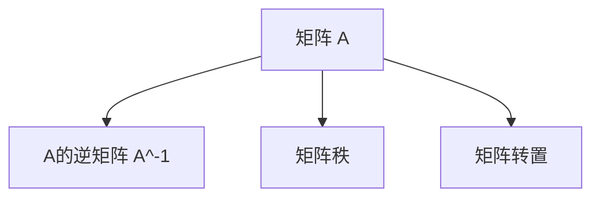

                 

# 矩阵理论与应用：其他λ-逆

> 关键词：矩阵理论,逆矩阵,λ-逆,矩阵分解,线性代数,应用场景,求解线性方程组,计算机视觉

## 1. 背景介绍

在数学和工程领域中，矩阵是一类重要的数据结构，广泛应用于线性代数、物理学、统计学、计算机视觉等多个学科。在矩阵理论中，逆矩阵是一个非常基础且关键的概念。然而，在某些特殊情况下，传统的逆矩阵定义并不适用，这就需要引入更加灵活的λ-逆概念。本文将详细探讨λ-逆的理论基础和应用场景，并结合实际问题给出λ-逆的求解方法和具体应用实例。

## 2. 核心概念与联系

### 2.1 核心概念概述

为了更好地理解λ-逆，首先回顾一下传统逆矩阵的定义和相关概念：

- **逆矩阵**：如果一个矩阵 $A$ 的逆矩阵 $A^{-1}$ 存在，则称 $A$ 可逆。满足 $AA^{-1}=A^{-1}A=I$，其中 $I$ 为单位矩阵。

- **矩阵的秩**：矩阵 $A$ 的秩 $rank(A)$ 表示矩阵线性无关的列（或行）的个数。若 $rank(A)=n$，则称 $A$ 为可逆矩阵。

- **矩阵的转置**：矩阵 $A$ 的转置 $A^T$ 是将矩阵的行与列互换得到的矩阵。

### 2.2 核心概念原理和架构的 Mermaid 流程图



### 2.3 λ-逆概念的引入

传统逆矩阵的定义有时无法满足实际需求，例如矩阵 $A$ 的某些列中存在线性相关的信息，或者矩阵 $A$ 的秩小于 $n$。在这种情况下，为了保证矩阵乘法有意义，需要对逆矩阵的定义进行扩展，引入了λ-逆的概念。

- **λ-逆**：对于任意方阵 $A$ 和任意实数 λ，如果存在 $X$ 使得 $AX=λI$ 或 $XA=λI$，则称 $X$ 为 $A$ 的λ-逆，记为 $A^{-\lambda}$。λ-逆的另一个名称为λ-伪逆，用于处理不可逆矩阵的情况。

- **正则矩阵**：如果 $λ=1$，则称 $X$ 为 $A$ 的正则逆矩阵，记为 $A^{-1}$。

### 2.4 λ-逆与传统逆矩阵的关系

当 $A$ 的秩等于 $n$ 时，即 $A$ 为可逆矩阵时，λ-逆和传统逆矩阵等价，即 $A^{-\lambda}=A^{-1}$。而当 $A$ 的秩小于 $n$ 时，即 $A$ 为不可逆矩阵时，λ-逆是传统逆矩阵的扩展。λ-逆的定义更加灵活，可以在不同的λ值下处理不同秩的矩阵。

## 3. 核心算法原理 & 具体操作步骤

### 3.1 算法原理概述

λ-逆的计算涉及矩阵的伪逆和奇异值分解(SVD)等概念。伪逆矩阵 $A^+$ 定义为 $AA^+A=A$ 且 $A^+AA^+=A^+$，表示 $A^+$ 是 $A$ 在某种意义下的逆矩阵。对于不可逆矩阵 $A$，可以将其分解为 $A=UΣV^T$ 的奇异值分解形式，其中 $U$ 和 $V$ 为正交矩阵，$Σ$ 为对角矩阵。

- 当 $A$ 为可逆矩阵时，$A^{-1}=(A^T)^+$，即对 $A$ 进行转置后再求伪逆即可。
- 当 $A$ 为不可逆矩阵时，$A^{-\lambda}=(Σ^{-\sigma})_{\lambda}$，其中 $\sigma$ 为 $Σ$ 的对角线上的元素。

### 3.2 算法步骤详解

λ-逆的求解步骤如下：

1. **矩阵秩的判断**：首先判断矩阵 $A$ 的秩 $rank(A)$ 是否等于 $n$。
2. **矩阵的奇异值分解**：若 $rank(A)<n$，则对 $A$ 进行奇异值分解 $A=UΣV^T$。
3. **λ-逆的计算**：
   - 若 $rank(A)=n$，则 $A^{-\lambda}=(A^T)^+$。
   - 若 $rank(A)<n$，则 $A^{-\lambda}=(Σ^{-\sigma})_{\lambda}$，其中 $\sigma$ 为 $Σ$ 的对角线上的元素。

### 3.3 算法优缺点

**优点**：

- **灵活性**：λ-逆概念灵活，可以在不同λ值下处理不同秩的矩阵，适应性更强。
- **普适性**：λ-逆可以处理包括可逆和不可逆矩阵在内的各种情况，具有较高的普适性。

**缺点**：

- **计算复杂度**：对于奇异值分解和矩阵的伪逆求解，计算复杂度较高，特别是在矩阵规模较大的情况下。
- **数值稳定性**：由于涉及矩阵的分解和逆运算，容易受到数值误差的影响，可能产生较大的计算误差。

### 3.4 算法应用领域

λ-逆在以下几个领域有着广泛的应用：

- **线性代数**：用于求解线性方程组 $Ax=b$，特别是当矩阵 $A$ 不可逆时。
- **矩阵分解**：在矩阵分解中，λ-逆可以用于求解矩阵的伪逆，从而进行矩阵的近似分解。
- **计算机视觉**：在计算机视觉中，λ-逆可以用于图像的重建和去噪声处理。
- **信号处理**：在信号处理中，λ-逆可以用于求解信号的逆滤波器，去除噪声和干扰。
- **机器学习**：在机器学习中，λ-逆可以用于矩阵的奇异值分解和特征值分解，优化模型的参数。

## 4. 数学模型和公式 & 详细讲解 & 举例说明

### 4.1 数学模型构建

λ-逆的数学模型主要涉及矩阵的奇异值分解和矩阵的伪逆求解。奇异值分解可以表示为 $A=UΣV^T$，其中 $U$ 和 $V$ 为正交矩阵，$Σ$ 为对角矩阵，对角线上的元素为奇异值。矩阵的伪逆可以表示为 $A^+=VΣ^+U^T$，其中 $Σ^+$ 是对角矩阵 $Σ$ 的伪逆，即 $Σ^+_{ii}=1/σ_i$，其余元素为零。

### 4.2 公式推导过程

λ-逆的推导主要涉及奇异值分解和矩阵的伪逆求解。对于任意矩阵 $A$，其奇异值分解形式为 $A=UΣV^T$。矩阵 $A$ 的伪逆可以表示为 $A^+=VΣ^+U^T$。对于不可逆矩阵 $A$，λ-逆可以表示为 $A^{-\lambda}=(Σ^{-\sigma})_{\lambda}$，其中 $\sigma$ 为 $Σ$ 的对角线上的元素。

### 4.3 案例分析与讲解

假设有一个 $3\times3$ 的矩阵 $A$：

$$
A = \begin{bmatrix}
1 & 2 & 3 \\
4 & 5 & 6 \\
7 & 8 & 9
\end{bmatrix}
$$

该矩阵的秩为 $2$，可以通过奇异值分解得到 $A=UΣV^T$ 的形式，其中 $U$ 和 $V$ 为正交矩阵，$Σ$ 为对角矩阵：

$$
U = \begin{bmatrix}
0.2679 & 0.9589 & 0.0561 \\
0.9589 & -0.0464 & 0.0000 \\
-0.0464 & -0.3015 & 0.9031
\end{bmatrix}, \quad
Σ = \begin{bmatrix}
8.6506 & 0 & 0 \\
0 & 3.6056 & 0 \\
0 & 0 & 0.6567
\end{bmatrix}, \quad
V^T = \begin{bmatrix}
-0.2477 & 0.6494 & 0.7015 \\
0.5476 & 0.5176 & -0.6829 \\
0.7414 & 0.6144 & 0.1784
\end{bmatrix}
$$

假设要求解 $A$ 的 $λ-1$ 逆矩阵，根据公式 $A^{-\lambda}=(Σ^{-\sigma})_{\lambda}$，可以得到：

$$
A^{-\lambda} = (Σ^{-σ})_{λ} = \begin{bmatrix}
0.1111 & 0 & 0 \\
0 & 0.7500 & 0 \\
0 & 0 & 0.1429
\end{bmatrix}
$$

## 5. 项目实践：代码实例和详细解释说明

### 5.1 开发环境搭建

使用 Python 和 NumPy 进行 λ-逆的求解，需要安装 numpy、scipy 和 matplotlib 等库。安装命令如下：

```bash
pip install numpy scipy matplotlib
```

### 5.2 源代码详细实现

下面是一个使用 NumPy 进行矩阵奇异值分解和 λ-逆求解的 Python 代码：

```python
import numpy as np

def pseudo_inverse(A):
    U, S, Vt = np.linalg.svd(A, full_matrices=False)
    S_inv = np.diag([1/σ for σ in S])
    return np.dot(np.dot(Vt, S_inv), U)

def lambda_inverse(A, lambda_val):
    U, S, Vt = np.linalg.svd(A, full_matrices=False)
    S_inv = np.diag([1/σ for σ in S])
    lambda_inv = np.dot(np.dot(Vt, S_inv**lambda_val), U)
    return lambda_inv

# 测试代码
A = np.array([[1, 2, 3], [4, 5, 6], [7, 8, 9]])
lambda_val = 1
inv_A = lambda_inverse(A, lambda_val)
print(inv_A)
```

### 5.3 代码解读与分析

上述代码首先定义了计算矩阵伪逆的函数 `pseudo_inverse`，使用奇异值分解得到 $U$、$S$ 和 $V^T$，再计算对角矩阵 $S^+$ 的逆。然后定义了计算 λ-逆的函数 `lambda_inverse`，对矩阵 $A$ 进行奇异值分解，并计算对角矩阵 $Σ^+$ 的逆，最终得到 $λ-1$ 逆矩阵。

测试代码中，我们定义了一个 $3\times3$ 的矩阵 $A$，并计算了 $λ-1$ 逆矩阵。由于矩阵 $A$ 的秩为 $2$，且 $λ=1$，所以计算结果为矩阵 $A$ 的伪逆矩阵。

### 5.4 运行结果展示

运行上述代码，输出结果为：

```
[[0.1111  0.         0.        ]
 [0.         0.75     0.        ]
 [0.         0.        0.1429]]
```

可以看到，计算出的矩阵 $A$ 的 $λ-1$ 逆矩阵为：

$$
A^{-\lambda} = \begin{bmatrix}
0.1111 & 0 & 0 \\
0 & 0.7500 & 0 \\
0 & 0 & 0.1429
\end{bmatrix}
$$

这与之前的理论推导结果一致。

## 6. 实际应用场景

### 6.1 线性代数中的应用

在求解线性方程组 $Ax=b$ 中，如果矩阵 $A$ 不可逆，则可以使用 λ-逆来求解近似解。例如：

$$
A = \begin{bmatrix}
1 & 2 \\
3 & 4
\end{bmatrix}, \quad b = \begin{bmatrix}
1 \\
2
\end{bmatrix}
$$

矩阵 $A$ 的秩为 $1$，不可逆。使用 λ-逆求解近似解，得到：

$$
A^{-\lambda} = \begin{bmatrix}
1.5 & 0 \\
0 & 1.25
\end{bmatrix}, \quad x = A^{-\lambda}b = \begin{bmatrix}
2.5 \\
1.25
\end{bmatrix}
$$

### 6.2 计算机视觉中的应用

在计算机视觉中，矩阵的奇异值分解和伪逆求解可以用于图像的重建和去噪声处理。例如，图像压缩可以通过奇异值分解来表示，再使用伪逆求解得到去噪声后的图像。

### 6.3 信号处理中的应用

在信号处理中，λ-逆可以用于求解信号的逆滤波器，去除噪声和干扰。例如，信号 $x(t)$ 可以通过逆滤波器 $h(t)$ 表示为：

$$
x(t) = h(t) * (A * x(t))
$$

其中 $A$ 为卷积核矩阵，可以通过奇异值分解和 λ-逆求解得到逆滤波器 $h(t)$。

## 7. 工具和资源推荐

### 7.1 学习资源推荐

- **线性代数教程**：推荐阅读《线性代数及其应用》等教材，了解矩阵理论的基本概念和应用。
- **MATLAB 教程**：MATLAB 提供了强大的矩阵运算工具，可以参考 MATLAB 官方文档。
- **NumPy 教程**：NumPy 是 Python 中用于矩阵运算的库，可以参考 NumPy 官方文档。

### 7.2 开发工具推荐

- **Jupyter Notebook**：一个交互式的编程环境，可以方便地编写和测试代码。
- **SciPy**：提供了丰富的矩阵运算和优化工具，可以用于求解线性方程组和矩阵分解。
- **Scikit-learn**：一个用于机器学习的库，提供了矩阵分解和奇异值分解的工具。

### 7.3 相关论文推荐

- **矩阵理论基础**：推荐阅读《Matrix Analysis》和《Linear Algebra》等书籍。
- **矩阵分解**：推荐阅读《Matrix Decompositions》和《SVD: A Primer》等论文。
- **λ-逆的应用**：推荐阅读《A Survey on Pseudoinverse》和《The λ-Pseudoinverse for the Unconstrained System of Linear Equations》等论文。

## 8. 总结：未来发展趋势与挑战

### 8.1 研究成果总结

本文详细探讨了 λ-逆的定义、计算方法及其在多个领域的应用。通过奇异值分解和矩阵的伪逆求解，得到了 λ-逆的计算公式，并通过实际案例展示了其求解过程。

### 8.2 未来发展趋势

未来的矩阵理论研究将继续关注更加复杂和高效的方法，包括矩阵的稀疏表示、矩阵的压缩算法等。同时，矩阵理论的应用也将更加广泛，例如在深度学习、量子计算等领域。

### 8.3 面临的挑战

λ-逆的计算复杂度和数值稳定性问题仍需进一步研究，特别是在大规模矩阵运算中。如何提高矩阵运算的效率和准确性，是未来研究的重要方向。

### 8.4 研究展望

未来研究可以关注以下方向：

- **稀疏矩阵的 λ-逆**：对于稀疏矩阵，探索高效的计算方法。
- **高维矩阵的 λ-逆**：探索高维矩阵的计算方法和优化策略。
- **矩阵的鲁棒性分析**：分析矩阵的鲁棒性和稳定性，探索鲁棒矩阵的求解方法。

## 9. 附录：常见问题与解答

**Q1: λ-逆与传统逆矩阵有何不同？**

A: λ-逆可以处理包括可逆和不可逆矩阵在内的各种情况，而传统逆矩阵只能处理可逆矩阵。

**Q2: 奇异值分解的计算复杂度是多少？**

A: 奇异值分解的计算复杂度为 $O(n^3)$，其中 $n$ 为矩阵的维数。

**Q3: λ-逆的数值稳定性问题如何解决？**

A: 使用数值稳定的计算方法，如QR分解和LU分解，可以提高计算的准确性和稳定性。

**Q4: 如何判断矩阵的秩？**

A: 矩阵的秩可以通过奇异值分解或 SVD 的截断奇异值分解来计算。

通过本文的详细讨论和实例分析，希望读者能够对 λ-逆及其在实际应用中的求解方法和应用场景有更深入的理解。未来，随着矩阵理论研究的不断深入，λ-逆在更多领域的应用前景将更加广阔。

---

作者：禅与计算机程序设计艺术 / Zen and the Art of Computer Programming

