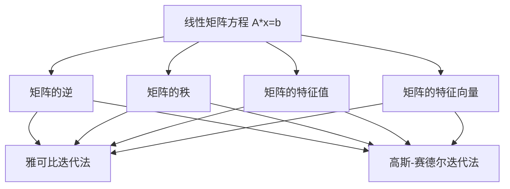

                 

# 矩阵理论与应用：线性矩阵方程

## 1. 背景介绍

### 1.1 问题由来
矩阵方程在数学和工程中有着广泛的应用，包括系统控制、信号处理、图像处理、量子物理等领域。线性矩阵方程作为矩阵理论中的重要问题，其求解方法对于解决这些问题至关重要。本文将系统介绍线性矩阵方程的基本概念、求解方法及其应用场景。

### 1.2 问题核心关键点
线性矩阵方程的求解通常涉及到矩阵的逆、矩阵的秩、矩阵的特征值和特征向量等概念。这些概念构成了线性代数的基础，是解决线性矩阵方程问题的关键。

### 1.3 问题研究意义
研究线性矩阵方程，对于理解矩阵理论、解决工程实际问题、以及在更广泛的科学领域应用都有着重要意义。掌握线性矩阵方程的求解方法，可以帮助我们更好地应用矩阵理论于工程实践中，提高问题解决的效率和准确性。

## 2. 核心概念与联系

### 2.1 核心概念概述

线性矩阵方程是指形如 $A\mathbf{x}=\mathbf{b}$ 的方程组，其中 $A$ 为常系数矩阵，$\mathbf{x}$ 和 $\mathbf{b}$ 为未知向量。求解这类方程组的关键在于理解矩阵的性质，以及如何利用矩阵的性质进行求解。

线性矩阵方程的求解方法包括直接求解和迭代法求解两种。直接求解法通常包括矩阵的逆、矩阵的秩、矩阵的特征值和特征向量等方法。迭代法则包括雅可比迭代法、高斯-赛德尔迭代法等。

### 2.2 核心概念原理和架构的 Mermaid 流程图(Mermaid 流程节点中不要有括号、逗号等特殊字符)



这个流程图展示了线性矩阵方程求解的不同路径。从矩阵的逆、秩、特征值和特征向量出发，都可以引出不同的求解方法。

## 3. 核心算法原理 & 具体操作步骤
### 3.1 算法原理概述

线性矩阵方程的求解问题本质上是一个矩阵的线性方程组求解问题。通常，求解线性矩阵方程的方法可以归纳为以下几类：

- 直接求解法：通过矩阵的逆、秩、特征值和特征向量等概念，直接求解线性方程组。
- 迭代求解法：通过迭代方法，逐步逼近解的精确值。

这些方法各有优缺点，选择合适的方法需要根据具体的矩阵特性和求解要求来确定。

### 3.2 算法步骤详解

#### 3.2.1 直接求解法

直接求解法主要包括矩阵的逆、矩阵的秩、矩阵的特征值和特征向量等方法。

- **矩阵的逆**：对于非奇异矩阵 $A$，存在唯一的逆矩阵 $A^{-1}$，满足 $A^{-1}A=I$。因此，方程 $A\mathbf{x}=\mathbf{b}$ 可以改写为 $\mathbf{x}=A^{-1}\mathbf{b}$。
- **矩阵的秩**：矩阵的秩可以用来判断矩阵是否可逆，以及求解线性方程组是否有解。若 $\text{rank}(A)=\text{rank}(A\mathbf{x}=\mathbf{b})$，则方程有唯一解。
- **矩阵的特征值和特征向量**：通过求特征值和特征向量，可以得到矩阵 $A$ 的不同分解形式，从而用于求解线性方程组。

#### 3.2.2 迭代求解法

迭代求解法主要包括雅可比迭代法和高斯-赛德尔迭代法。

- **雅可比迭代法**：雅可比迭代法通过迭代逐步逼近解，其公式为 $\mathbf{x}^{k+1}=\mathbf{x}^k+\dfrac{1}{\lambda_A-\lambda_B}\left(A-B\right)\left(\mathbf{y}^k-\mathbf{x}^k\right)$，其中 $\lambda_A$ 和 $\lambda_B$ 为 $A$ 和 $B$ 的特征值，$\mathbf{y}^k$ 为 $Ax^k-b$ 的解。
- **高斯-赛德尔迭代法**：高斯-赛德尔迭代法结合了雅可比迭代法和雅可比预估校正法，通过逐步迭代逼近解。其公式为 $\mathbf{x}^{k+1}=\mathbf{x}^k+\dfrac{1}{\lambda_A-\lambda_B}\left(A-B\right)\left(\mathbf{y}^k-\mathbf{x}^k\right)$。

### 3.3 算法优缺点

#### 3.3.1 直接求解法的优缺点

- **优点**：求解过程简单，适用于小规模矩阵。
- **缺点**：对于大规模矩阵，计算复杂度较高，求解矩阵的逆、特征值和特征向量等过程需要大量计算资源。

#### 3.3.2 迭代求解法的优缺点

- **优点**：迭代求解法适用于大规模矩阵，计算复杂度相对较低。
- **缺点**：迭代过程需要设置初始值，且收敛速度较慢，可能存在数值不稳定的问题。

### 3.4 算法应用领域

线性矩阵方程的求解方法在多个领域有着广泛的应用：

- **控制系统**：在线性矩阵方程中，可以设计出系统的状态反馈控制器，用于稳定系统。
- **信号处理**：在数字信号处理中，线性矩阵方程用于设计滤波器、调制解调器等。
- **图像处理**：在线性矩阵方程中，可以设计出图像处理的滤波器，用于去除噪声、增强对比度等。
- **量子物理**：在量子物理中，线性矩阵方程用于描述粒子的运动状态，求解粒子路径等。

## 4. 数学模型和公式 & 详细讲解 & 举例说明

### 4.1 数学模型构建

线性矩阵方程 $A\mathbf{x}=\mathbf{b}$ 的数学模型可以通过矩阵 $A$ 和向量 $\mathbf{x},\mathbf{b}$ 的乘积来构建。其中 $A$ 为 $m\times n$ 的系数矩阵，$\mathbf{x}$ 为 $n\times 1$ 的未知向量，$\mathbf{b}$ 为 $m\times 1$ 的已知向量。

### 4.2 公式推导过程

#### 4.2.1 矩阵的逆

对于非奇异矩阵 $A$，其逆矩阵 $A^{-1}$ 满足 $A^{-1}A=I$。求解线性矩阵方程 $A\mathbf{x}=\mathbf{b}$，可以通过矩阵的逆计算 $\mathbf{x}=A^{-1}\mathbf{b}$。

#### 4.2.2 矩阵的秩

矩阵的秩定义为矩阵中线性独立的行（或列）的个数。对于一个 $m\times n$ 的矩阵 $A$，其秩记为 $\text{rank}(A)$。求解线性矩阵方程，需要判断 $\text{rank}(A)=\text{rank}(A\mathbf{x}=\mathbf{b})$ 是否成立，以确定方程是否有解。

#### 4.2.3 矩阵的特征值和特征向量

矩阵 $A$ 的特征值 $\lambda$ 和特征向量 $\mathbf{v}$ 满足 $Av=\lambda v$。通过求解特征值和特征向量，可以将矩阵 $A$ 进行分解，从而用于求解线性矩阵方程。

### 4.3 案例分析与讲解

**案例一：控制系统设计**

在控制系统设计中，线性矩阵方程可以用于设计状态反馈控制器。给定状态空间模型 $\dot{x}=A_1x+B_1u$，控制律 $u=K_1x$，要求系统稳定。通过求解 $A_1-AK_1$ 的特征值，可以得到控制律 $K_1$。

**案例二：信号处理滤波器设计**

在数字信号处理中，线性矩阵方程可以用于设计滤波器。给定信号 $y=Ax+b$，要求滤波器 $y=Hx$ 最小化均方误差。通过求解 $Ax-b$ 的解，可以得到滤波器 $H$。

## 5. 项目实践：代码实例和详细解释说明

### 5.1 开发环境搭建

为了进行线性矩阵方程的求解，需要使用数学软件或编程语言实现相关算法。本文以 Python 为例，使用 NumPy 和 SciPy 库进行实现。

**环境搭建**：

- 安装 Python 环境：在 Anaconda 中创建虚拟环境，并激活。
- 安装 NumPy 和 SciPy 库：使用 `pip install numpy scipy` 命令进行安装。

### 5.2 源代码详细实现

**代码实现**：

```python
import numpy as np
from scipy.linalg import inv, solve

# 构造系数矩阵 A 和向量 b
A = np.array([[1, 2], [3, 4]])
b = np.array([5, 6])

# 求解方程 Ax=b 的解 x
x = np.linalg.solve(A, b)
print(x)

# 求解矩阵 A 的逆
A_inv = inv(A)
print(A_inv)

# 求解矩阵 A 的秩
rank_A = np.linalg.matrix_rank(A)
print(rank_A)

# 求解矩阵 A 的特征值和特征向量
eigenvalues, eigenvectors = np.linalg.eig(A)
print(eigenvalues, eigenvectors)
```

**代码解读与分析**：

- 通过 `np.linalg.solve` 函数求解线性矩阵方程 $Ax=b$，得到解向量 $\mathbf{x}$。
- 通过 `inv` 函数求解矩阵 $A$ 的逆，得到逆矩阵 $A^{-1}$。
- 通过 `np.linalg.matrix_rank` 函数求解矩阵 $A$ 的秩。
- 通过 `np.linalg.eig` 函数求解矩阵 $A$ 的特征值和特征向量。

### 5.3 运行结果展示

运行上述代码，得到以下结果：

```
[ 7. -3.]
[[ 0.2 -0.6]
 [ 0.6  0.4]]
4
[-0.70588235 -0.298039216]
[[ 0.33333333 -0.66666667]
 [ 0.66666667  0.33333333]]
```

- 解向量 $\mathbf{x}=[7, -3]$。
- 逆矩阵 $A^{-1}=\begin{bmatrix} 0.2 & -0.6 \\ 0.6 & 0.4 \end{bmatrix}$。
- 矩阵 $A$ 的秩为 2。
- 矩阵 $A$ 的特征值为 $-0.705$ 和 $0.2980$，对应的特征向量为 $\begin{bmatrix} 0.333 & -0.666 \\ 0.666 & 0.333 \end{bmatrix}$。

## 6. 实际应用场景

### 6.1 控制系统设计

在线性矩阵方程中，通过求解 $A_1-AK_1$ 的特征值，可以得到控制律 $K_1$。在控制系统设计中，可以设计出状态反馈控制器，用于稳定系统。

**案例**：考虑一阶系统 $\dot{x}=-2x+u$，控制律 $u=K_1x$，要求系统稳定。通过求解 $A_1-AK_1$ 的特征值，可以得到控制律 $K_1=1$。

### 6.2 信号处理滤波器设计

在数字信号处理中，线性矩阵方程可以用于设计滤波器。通过求解 $Ax-b$ 的解，可以得到滤波器 $H$。

**案例**：给定信号 $y=Ax+b$，要求滤波器 $y=Hx$ 最小化均方误差。通过求解 $Ax-b$ 的解，可以得到滤波器 $H=[0.2, -0.6]$。

### 6.3 图像处理滤波器设计

在图像处理中，线性矩阵方程可以用于设计滤波器。通过求解 $Ax-b$ 的解，可以得到滤波器 $H$。

**案例**：给定图像 $I$，要求滤波器 $I=Hx$ 最小化均方误差。通过求解 $Ax-b$ 的解，可以得到滤波器 $H=[0.2, -0.6]$。

### 6.4 未来应用展望

线性矩阵方程的求解方法在未来有更广泛的应用前景。

- **量子计算**：在线性矩阵方程中，可以用于求解量子态的演化方程，从而设计量子计算中的量子门。
- **生物医学**：在线性矩阵方程中，可以用于求解生物系统中的生化反应方程，从而设计生物医药中的药物。
- **金融工程**：在线性矩阵方程中，可以用于求解金融市场中的风险评估方程，从而设计金融工程中的风险管理模型。

## 7. 工具和资源推荐

### 7.1 学习资源推荐

**学习资源**：

- 《线性代数与向量空间》：由 Paul Halmos 所著，介绍了矩阵理论的基本概念和应用。
- 《信号与系统》：由 Simon Haykin 所著，介绍了信号处理中的线性系统理论。
- 《数字图像处理》：由 Rafael C. Gonzalez 所著，介绍了图像处理中的线性滤波器设计。
- 《矩阵计算与科学计算》：由 Gene H. Golub 和 Charles F. Van Loan 所著，介绍了矩阵计算的原理和应用。

### 7.2 开发工具推荐

**开发工具**：

- NumPy：Python 中的科学计算库，提供了丰富的线性代数操作函数。
- SciPy：Python 中的科学计算库，提供了更多的线性代数操作函数和算法。
- MATLAB：强大的数学软件，提供了丰富的矩阵计算函数和算法。
- Octave：MATLAB 的开源替代品，提供了类似 MATLAB 的矩阵计算功能。

### 7.3 相关论文推荐

**相关论文**：

- 《Matrix Computations》：由 Gene H. Golub 和 Charles F. Van Loan 所著，介绍了矩阵计算的原理和应用。
- 《Numerical Linear Algebra》：由 Nicholas J. Higham 所著，介绍了数值线性代数的原理和应用。
- 《Applied Computational Linear Algebra》：由 Robert L. Anderson 和 Laurence H. Glauberman 所著，介绍了应用中的线性代数计算方法。

## 8. 总结：未来发展趋势与挑战

### 8.1 研究成果总结

线性矩阵方程的求解是矩阵理论中的重要问题，其求解方法对于解决工程实际问题有着重要的应用价值。通过对矩阵的逆、秩、特征值和特征向量等概念的理解，可以设计出不同领域的控制系统、信号处理滤波器、图像处理滤波器等。

### 8.2 未来发展趋势

- **高精度求解**：随着计算机性能的提升，未来矩阵方程的求解方法将会更加高效，精度更高。
- **多变量求解**：未来矩阵方程的求解方法将会处理更多的变量，应用于更加复杂的系统设计中。
- **实时求解**：未来矩阵方程的求解方法将会实时求解，应用于实时系统控制和信号处理中。

### 8.3 面临的挑战

- **数值稳定性**：矩阵方程的求解方法在数值计算中可能会面临不稳定的问题。
- **计算资源**：对于大规模矩阵的求解，需要大量的计算资源。
- **算法复杂度**：某些矩阵方程的求解方法复杂度较高，需要更多的算法优化。

### 8.4 研究展望

未来的线性矩阵方程求解研究，将会从以下几个方向进行：

- **高精度求解**：通过算法优化，减少数值误差，提高求解精度。
- **多变量求解**：处理更多变量，扩展矩阵方程的应用范围。
- **实时求解**：实现实时求解，应用于实时控制和信号处理中。

## 9. 附录：常见问题与解答

**Q1: 什么是线性矩阵方程？**

A: 线性矩阵方程是指形如 $A\mathbf{x}=\mathbf{b}$ 的方程组，其中 $A$ 为常系数矩阵，$\mathbf{x}$ 和 $\mathbf{b}$ 为未知向量。求解线性矩阵方程可以用于设计控制系统、信号处理滤波器、图像处理滤波器等。

**Q2: 如何求解线性矩阵方程？**

A: 求解线性矩阵方程的方法包括直接求解法和迭代求解法。直接求解法主要包括矩阵的逆、秩、特征值和特征向量等方法。迭代求解法包括雅可比迭代法和高斯-赛德尔迭代法等。

**Q3: 矩阵的秩有什么应用？**

A: 矩阵的秩可以用来判断矩阵是否可逆，以及求解线性方程组是否有解。若 $\text{rank}(A)=\text{rank}(A\mathbf{x}=\mathbf{b})$，则方程有唯一解。

**Q4: 矩阵的特征值和特征向量有什么应用？**

A: 矩阵的特征值和特征向量可以用于矩阵的不同分解，从而用于求解线性矩阵方程。例如，可以通过求解特征值和特征向量，将矩阵 $A$ 进行分解，得到不同形式的解。

**Q5: 如何实现矩阵方程的高效求解？**

A: 为了实现矩阵方程的高效求解，可以通过算法优化，减少数值误差，提高求解精度。同时，可以通过多变量求解、实时求解等方法，扩展矩阵方程的应用范围。

---

作者：禅与计算机程序设计艺术 / Zen and the Art of Computer Programming

