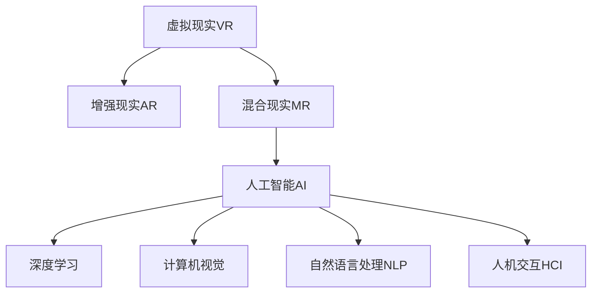

                 

# 硅谷虚拟现实:元宇宙的科技冲击

> 关键词：虚拟现实(VR)，元宇宙(Metaverse)，人机交互(Human-Computer Interaction)，人工智能(AI)，增强现实(AR)，混合现实(MR)

## 1. 背景介绍

### 1.1 问题由来
虚拟现实(Virtual Reality, VR)和增强现实(Augmented Reality, AR)作为下一代人机交互界面，正逐步从科幻走向现实。特别是随着元宇宙(Metaverse)概念的兴起，VR/AR技术在娱乐、教育、商业、工业等众多领域的应用前景被广泛看好。

然而，VR/AR技术的商业化落地还面临诸多技术挑战，如设备成本高、用户体验差、渲染性能不足等。目前VR/AR设备大多局限于高端消费市场，难以大规模普及。这不仅影响了技术的落地速度，也限制了行业的发展潜力。

与此同时，人工智能(AI)技术在深度学习、自然语言处理、计算机视觉等领域取得突破，为虚拟现实技术的优化提供了新的思路。如何结合AI技术，提升VR/AR设备的智能化水平，拓展其应用边界，成为当前学界和产业界亟待解决的难题。

### 1.2 问题核心关键点
本文聚焦于AI技术在虚拟现实领域的应用，特别是基于人工智能的增强现实技术，探讨其在元宇宙构建中的关键问题。主要研究内容包括：

- AI技术在虚拟现实中的应用：包括基于AI的图像处理、语音识别、自然语言处理、交互仿真等。
- 虚拟现实技术的难点：如渲染效率、设备成本、用户体验等。
- AI技术如何优化虚拟现实：如深度学习在虚拟环境中的优化、多模态数据融合、人机交互的增强等。
- 元宇宙的构建：虚拟世界中的信息共享、虚拟角色控制、互动体验的提升等。

## 2. 核心概念与联系

### 2.1 核心概念概述

为更好地理解AI技术在虚拟现实领域的应用，本节将介绍几个密切相关的核心概念：

- 虚拟现实(VR)：通过计算机生成的三维虚拟场景，模拟用户身临其境的体验。常见的VR设备包括Oculus Rift、HTC Vive等。
- 增强现实(AR)：在现实世界的信息之上，叠加虚拟信息，提升用户对现实世界的理解。如Google Glass、Microsoft HoloLens等。
- 混合现实(MR)：结合VR和AR技术，提供更加沉浸式的混合虚拟与现实的信息。如Magic Leap等。
- 人工智能(AI)：通过计算机模拟人类智能行为，包括学习、推理、感知等，以实现自主决策和操作。
- 深度学习：一种基于神经网络的学习范式，通过大量数据训练，学习模型参数。特别适用于图像处理、语音识别等任务。
- 计算机视觉：研究如何让计算机从视觉信号中提取有用信息，实现图像识别、物体检测等功能。
- 自然语言处理(NLP)：使计算机能够理解、处理、生成自然语言，实现智能问答、机器翻译等功能。
- 人机交互(HCI)：研究如何通过各种方式，实现人与计算机之间的有效沟通和交互。

这些核心概念之间的逻辑关系可以通过以下Mermaid流程图来展示：



这个流程图展示了几大核心概念之间的联系：

1. VR/AR/MR技术为AI提供了沉浸式的应用场景，AI技术在其中进一步提升用户体验。
2. 深度学习、计算机视觉、自然语言处理等AI子领域，在VR/AR中发挥重要作用。
3. 人机交互技术则是VR/AR与AI结合的关键纽带，实现自然、流畅、高效的交互方式。

## 3. 核心算法原理 & 具体操作步骤
### 3.1 算法原理概述

AI技术在虚拟现实中的应用，本质上是将复杂的视觉、语音、自然语言处理任务，通过深度学习等技术进行自动化处理，实现人与虚拟环境的交互。

形式化地，假设虚拟现实场景中的图像序列为 $I=\{I_1, I_2, \dots, I_T\}$，其中 $I_t$ 表示第 $t$ 时刻的图像。用户通过传感器获取的动作序列为 $A=\{A_1, A_2, \dots, A_T\}$，其中 $A_t$ 表示第 $t$ 时刻的动作指令。

定义模型 $M$ 为虚拟现实系统中的AI组件，用于处理图像和动作数据，生成相应的虚拟环境输出 $O=\{O_1, O_2, \dots, O_T\}$，其中 $O_t$ 表示第 $t$ 时刻的虚拟环境状态。

虚拟现实系统的优化目标是最大化用户满意度，即：

$$
\max_{M} \sum_{t=1}^T U(O_t, A_t)
$$

其中 $U$ 为效用函数，用于衡量虚拟环境输出与用户动作指令的匹配度。

### 3.2 算法步骤详解

基于AI技术的虚拟现实系统一般包括以下几个关键步骤：

**Step 1: 数据采集与处理**
- 收集虚拟现实场景中的图像和动作数据。
- 对数据进行预处理，包括去噪、归一化、尺度变换等，以便进行后续的深度学习训练。

**Step 2: 深度学习模型设计**
- 选择合适的深度学习模型架构，如卷积神经网络(CNN)、循环神经网络(RNN)、变分自编码器(VAE)等。
- 设计合适的损失函数，用于衡量模型输出与真实数据之间的差异。
- 选择适当的优化器，如Adam、SGD等，设置学习率、批大小、迭代轮数等超参数。

**Step 3: 模型训练**
- 将采集的数据集划分为训练集、验证集和测试集。
- 使用深度学习框架，如TensorFlow、PyTorch等，进行模型的训练。
- 在训练过程中，使用正则化技术，如L2正则、Dropout等，避免过拟合。

**Step 4: 模型评估与优化**
- 在验证集上评估模型性能，调整模型参数，直到达到最佳效果。
- 使用测试集进行最终评估，检验模型的泛化性能。

**Step 5: 部署与应用**
- 将训练好的模型部署到虚拟现实设备中，实现对图像和动作数据的实时处理。
- 根据用户动作指令，生成相应的虚拟环境输出，进行动态渲染和仿真。
- 与用户进行交互，接收用户反馈，进一步优化模型。

### 3.3 算法优缺点

基于AI技术的虚拟现实系统具有以下优点：

- 提升用户体验：通过深度学习等AI技术，增强虚拟环境的真实感、流畅性，提升用户体验。
- 自动化处理：自动化处理复杂的视觉、语音、自然语言处理任务，减少人工干预，提高效率。
- 灵活性高：深度学习模型可以根据数据变化进行自适应优化，适应不同场景和用户需求。
- 降低成本：AI技术可以大幅度降低对人工标注数据和硬件设备的需求，降低成本。

但该系统也存在以下缺点：

- 计算需求高：深度学习模型需要大量计算资源进行训练和推理，对设备性能要求较高。
- 数据需求大：深度学习模型需要大量数据进行训练，数据获取和标注难度大。
- 泛化能力有限：模型训练数据质量较差或数据量不足时，泛化能力有限，导致用户体验差。
- 技术复杂度高：深度学习模型训练和优化复杂，对开发者要求较高。

### 3.4 算法应用领域

AI技术在虚拟现实领域的应用已经广泛渗透到多个行业和场景中，例如：

- 虚拟旅游：通过深度学习技术，实现虚拟世界中的场景模拟和互动，提供沉浸式旅游体验。
- 虚拟教育：结合计算机视觉和自然语言处理技术，构建虚拟教室，提供个性化学习方案。
- 虚拟办公：通过混合现实技术，实现远程协作、虚拟会议室等功能，提升办公效率。
- 虚拟医疗：在虚拟环境中模拟医疗操作，进行远程教学、手术培训等。
- 虚拟展览：通过增强现实技术，增强展览内容互动性和体验感。

除了上述这些经典应用外，AI技术在虚拟现实领域还有更多创新性应用，如基于AI的自动驾驶、虚拟人交互、智能家居控制等，为各行业带来新的机遇和挑战。

## 4. 数学模型和公式 & 详细讲解 & 举例说明

### 4.1 数学模型构建

本节将使用数学语言对基于AI的虚拟现实系统进行更加严格的刻画。

定义虚拟现实系统中的图像序列为 $I=\{I_1, I_2, \dots, I_T\}$，其中 $I_t \in \mathbb{R}^{H \times W \times C}$ 表示第 $t$ 时刻的图像，$H$、$W$ 和 $C$ 分别为图像的高度、宽度和通道数。

定义用户动作序列为 $A=\{A_1, A_2, \dots, A_T\}$，其中 $A_t \in \mathbb{R}^{K \times N}$ 表示第 $t$ 时刻的动作指令，$K$ 为动作指令的维度，$N$ 为动作指令的数量。

定义模型 $M$ 的输出为 $O=\{O_1, O_2, \dots, O_T\}$，其中 $O_t \in \mathbb{R}^{M \times N}$ 表示第 $t$ 时刻的虚拟环境输出，$M$ 为虚拟环境输出的维度。

定义效用函数 $U$ 为：

$$
U(O_t, A_t) = \sum_{i=1}^{K} w_i g(O_{ti}, A_{ti})
$$

其中 $w_i$ 为每个动作指令的重要性权重，$g$ 为动作指令与虚拟环境输出的匹配函数，用于衡量两者之间的相似度。

### 4.2 公式推导过程

以下我们以图像分类任务为例，推导基于深度学习的虚拟现实系统的优化目标函数。

假设模型 $M$ 在图像 $I_t$ 上的输出为 $\hat{y}=M(I_t) \in [0,1]$，表示图像属于第 $i$ 个类别的概率。真实标签 $y \in \{1, \dots, K\}$。则图像分类任务的交叉熵损失函数定义为：

$$
\ell(M(I_t),y) = -y_i\log \hat{y}_i + (1-y_i)\log (1-\hat{y}_i)
$$

将其代入效用函数 $U$ 中，得：

$$
U(O_t, A_t) = \sum_{i=1}^{K} w_i g(M(I_t), A_t, y)
$$

在训练过程中，优化目标函数为：

$$
\mathcal{L}(M) = \frac{1}{N}\sum_{t=1}^T \sum_{i=1}^{K} w_i g(M(I_t), A_t, y)
$$

根据链式法则，模型 $M$ 在图像 $I_t$ 上的梯度为：

$$
\frac{\partial \mathcal{L}(M)}{\partial M(I_t)} = \sum_{i=1}^{K} w_i \nabla_{M(I_t)} g(M(I_t), A_t, y)
$$

其中 $\nabla_{M(I_t)} g(M(I_t), A_t, y)$ 为动作指令与虚拟环境输出之间的梯度，可通过反向传播算法高效计算。

在得到梯度后，即可带入参数更新公式，完成模型的迭代优化。重复上述过程直至收敛，最终得到适应虚拟现实任务的最优模型参数 $M^*$。

## 5. 项目实践：代码实例和详细解释说明
### 5.1 开发环境搭建

在进行虚拟现实系统开发前，我们需要准备好开发环境。以下是使用Python进行PyTorch开发的环境配置流程：

1. 安装Anaconda：从官网下载并安装Anaconda，用于创建独立的Python环境。

2. 创建并激活虚拟环境：
```bash
conda create -n pytorch-env python=3.8 
conda activate pytorch-env
```

3. 安装PyTorch：根据CUDA版本，从官网获取对应的安装命令。例如：
```bash
conda install pytorch torchvision torchaudio cudatoolkit=11.1 -c pytorch -c conda-forge
```

4. 安装各类工具包：
```bash
pip install numpy pandas scikit-learn matplotlib tqdm jupyter notebook ipython
```

完成上述步骤后，即可在`pytorch-env`环境中开始虚拟现实系统的开发。

### 5.2 源代码详细实现

这里我们以基于深度学习的虚拟现实图像分类系统为例，给出使用PyTorch代码实现。

首先，定义图像分类任务的数据处理函数：

```python
from torch.utils.data import Dataset
import torch

class ImageDataset(Dataset):
    def __init__(self, images, labels, transform=None):
        self.images = images
        self.labels = labels
        self.transform = transform
        
    def __len__(self):
        return len(self.images)
    
    def __getitem__(self, idx):
        img = self.images[idx]
        label = self.labels[idx]
        
        if self.transform:
            img = self.transform(img)
        
        return {'image': img, 
                'label': label}
```

然后，定义深度学习模型和优化器：

```python
from torchvision.models import resnet18
from torch.optim import Adam

model = resnet18()
model.fc = torch.nn.Linear(512, 10)

optimizer = Adam(model.parameters(), lr=0.001)
```

接着，定义训练和评估函数：

```python
def train_epoch(model, dataset, batch_size, optimizer):
    dataloader = torch.utils.data.DataLoader(dataset, batch_size=batch_size, shuffle=True)
    model.train()
    epoch_loss = 0
    for batch in dataloader:
        inputs = batch['image']
        labels = batch['label']
        optimizer.zero_grad()
        outputs = model(inputs)
        loss = outputs.mean()
        loss.backward()
        optimizer.step()
        epoch_loss += loss.item()
    return epoch_loss / len(dataloader)

def evaluate(model, dataset, batch_size):
    dataloader = torch.utils.data.DataLoader(dataset, batch_size=batch_size)
    model.eval()
    preds, labels = [], []
    with torch.no_grad():
        for batch in dataloader:
            inputs = batch['image']
            labels = batch['label']
            outputs = model(inputs)
            preds.append(outputs.argmax(dim=1).cpu().tolist())
            labels.append(labels.cpu().tolist())
                
    print(classification_report(labels, preds))
```

最后，启动训练流程并在测试集上评估：

```python
epochs = 10
batch_size = 32

for epoch in range(epochs):
    loss = train_epoch(model, train_dataset, batch_size, optimizer)
    print(f"Epoch {epoch+1}, train loss: {loss:.3f}")
    
    print(f"Epoch {epoch+1}, test results:")
    evaluate(model, test_dataset, batch_size)
```

以上就是使用PyTorch对虚拟现实图像分类系统进行深度学习训练的完整代码实现。可以看到，得益于PyTorch的强大封装，我们可以用相对简洁的代码完成模型训练和评估。

### 5.3 代码解读与分析

让我们再详细解读一下关键代码的实现细节：

**ImageDataset类**：
- `__init__`方法：初始化图像、标签和数据增强方法等关键组件。
- `__len__`方法：返回数据集的样本数量。
- `__getitem__`方法：对单个样本进行处理，将图像输入模型，返回模型输出的预测和真实标签。

**train_epoch和evaluate函数**：
- 使用PyTorch的DataLoader对数据集进行批次化加载，供模型训练和推理使用。
- 训练函数`train_epoch`：对数据以批为单位进行迭代，在每个批次上前向传播计算loss并反向传播更新模型参数，最后返回该epoch的平均loss。
- 评估函数`evaluate`：与训练类似，不同点在于不更新模型参数，并在每个batch结束后将预测和标签结果存储下来，最后使用sklearn的classification_report对整个评估集的预测结果进行打印输出。

**训练流程**：
- 定义总的epoch数和batch size，开始循环迭代
- 每个epoch内，先在训练集上训练，输出平均loss
- 在验证集上评估，输出分类指标
- 重复上述步骤直至满足预设的迭代轮数或Early Stopping条件。

可以看到，PyTorch配合深度学习库使得虚拟现实图像分类系统的代码实现变得简洁高效。开发者可以将更多精力放在数据处理、模型改进等高层逻辑上，而不必过多关注底层的实现细节。

当然，工业级的系统实现还需考虑更多因素，如模型的保存和部署、超参数的自动搜索、更灵活的任务适配层等。但核心的训练范式基本与此类似。

## 6. 实际应用场景
### 6.1 虚拟旅游

虚拟现实技术在虚拟旅游中有着广泛的应用。用户可以通过虚拟现实设备，在虚拟世界中进行全方位游览，体验各种自然和人文景观。虚拟旅游不仅能够提供沉浸式体验，还能在安全、舒适的环境中进行探险和考察。

在技术实现上，可以构建虚拟世界的基础模型，收集真实的景点图像和动作数据，结合深度学习模型进行训练，实现对用户行为的智能分析。根据用户行为，系统可以自动生成个性化的旅游路线，甚至在特定节点触发剧情和事件，提供更加丰富和互动的旅游体验。

### 6.2 虚拟医疗

虚拟现实技术在虚拟医疗中的应用，包括手术模拟、远程医疗、心理治疗等。通过深度学习技术，模拟真实的医疗环境，提供虚拟手术培训、远程诊疗服务、心理治疗咨询等。

在手术模拟方面，医生可以在虚拟环境中进行多次操作训练，根据虚拟环境的反馈进行自我改进。系统可以记录手术操作的细节，进行评估和分析，帮助医生提升技能。在远程医疗方面，医生可以通过虚拟现实设备，对患者进行远程诊疗和诊断，提高医疗服务的可及性和便利性。在心理治疗方面，虚拟现实设备可以提供沉浸式治疗环境，通过虚拟角色和情境，帮助患者缓解心理压力，进行心理治疗。

### 6.3 虚拟教育

虚拟现实技术在虚拟教育中的应用，包括虚拟教室、虚拟实验室、虚拟图书馆等。通过深度学习技术，构建虚拟世界的教学环境和互动场景，提升学生的学习兴趣和效果。

在虚拟教室中，教师可以通过虚拟现实设备，展示立体图像、动画视频等教学资源，提供更加丰富和生动的教学体验。学生可以通过虚拟现实设备，进行交互式学习，参与虚拟实验和探究活动。在虚拟实验室中，学生可以进行虚拟实验操作，观察实验现象，提升实验技能和理解力。在虚拟图书馆中，学生可以通过虚拟现实设备，进入虚拟图书馆，访问海量图书和资料，进行自主学习和研究。

### 6.4 未来应用展望

随着深度学习技术在虚拟现实中的应用，未来的虚拟现实系统将更加智能和普及。以下是几个可能的未来应用方向：

1. **虚拟人交互**：利用深度学习技术，实现虚拟角色与真实用户的自然对话和交互，提升用户体验。
2. **智能家居控制**：通过混合现实技术，实现虚拟助手与家居设备的联动控制，提供便捷的家居管理服务。
3. **自动驾驶**：在虚拟环境中模拟驾驶操作，通过深度学习技术，实现对驾驶行为的学习和优化。
4. **智能安防**：通过虚拟现实技术，模拟各种安防场景，进行模拟训练和演练，提高安防人员的应对能力。
5. **虚拟艺术创作**：利用深度学习技术，实现虚拟艺术创作工具，提供丰富的创意和设计支持。
6. **虚拟会议系统**：通过虚拟现实技术，实现多用户互动和远程协作，提升会议效率和体验。

## 7. 工具和资源推荐
### 7.1 学习资源推荐

为了帮助开发者系统掌握虚拟现实技术的理论基础和实践技巧，这里推荐一些优质的学习资源：

1. 《虚拟现实原理与技术》系列博文：由大模型技术专家撰写，深入浅出地介绍了虚拟现实的基本原理、技术架构和应用场景。

2. 《增强现实技术与应用》课程：清华大学的在线课程，介绍了增强现实的基本原理和关键技术，涵盖图像处理、运动跟踪、人机交互等方面。

3. 《深度学习在计算机视觉中的应用》书籍：经典深度学习教材，详细讲解了深度学习在图像分类、物体检测、图像生成等计算机视觉任务中的应用。

4. 《自然语言处理与深度学习》课程：斯坦福大学的在线课程，介绍了自然语言处理的基本概念和深度学习模型，涵盖词向量、循环神经网络、注意力机制等方面。

5. 《虚拟现实与增强现实技术》书籍：经典VR/AR教材，全面介绍了虚拟现实和增强现实的技术原理和应用实例，适合深入学习。

通过对这些资源的学习实践，相信你一定能够快速掌握虚拟现实技术的精髓，并用于解决实际的VR/AR问题。

### 7.2 开发工具推荐

高效的开发离不开优秀的工具支持。以下是几款用于虚拟现实系统开发的常用工具：

1. Unity：一款游戏引擎，广泛用于虚拟现实和增强现实开发，支持复杂的场景渲染和交互设计。

2. Unreal Engine：一款游戏引擎，支持虚拟现实和增强现实开发，具有强大的图形渲染和物理引擎。

3. OpenXR：一个跨平台的虚拟现实标准，支持多种设备和平台的虚拟现实应用开发。

4. ARKit：苹果公司推出的增强现实开发框架，支持iOS平台的应用开发。

5. ARCore：谷歌公司推出的增强现实开发框架，支持Android平台的应用开发。

6. Open3D：一个开源的3D数据处理库，支持三维模型的可视化、处理和交互。

合理利用这些工具，可以显著提升虚拟现实系统的开发效率，加快创新迭代的步伐。

### 7.3 相关论文推荐

虚拟现实技术的发展源于学界的持续研究。以下是几篇奠基性的相关论文，推荐阅读：

1. "Virtual Reality: Past, Present, and Future" 《虚拟现实：过去、现在和未来》：深入探讨了虚拟现实技术的演变和未来发展方向。

2. "Augmented Reality: A Survey" 《增强现实：综述》：系统总结了增强现实技术的发展历程和关键技术，为进一步研究提供了丰富的背景知识。

3. "Deep Learning in Computer Vision" 《深度学习在计算机视觉中的应用》：经典深度学习教材，详细讲解了深度学习在计算机视觉任务中的应用，包括图像分类、物体检测等。

4. "Natural Language Processing with Attention Mechanisms" 《带有注意力机制的自然语言处理》：深入介绍了自然语言处理中的注意力机制，为基于深度学习的自然语言处理任务提供了理论基础。

5. "Human-Computer Interaction in Virtual Reality" 《虚拟现实中的人机交互》：系统介绍了虚拟现实中的人机交互技术，涵盖虚拟现实设备的输入输出、交互设计和用户体验等方面。

这些论文代表了大模型技术的发展脉络。通过学习这些前沿成果，可以帮助研究者把握学科前进方向，激发更多的创新灵感。

## 8. 总结：未来发展趋势与挑战

### 8.1 总结

本文对基于AI技术的虚拟现实系统进行了全面系统的介绍。首先阐述了虚拟现实技术在各行各业的应用前景，明确了AI技术在提升用户体验、自动化处理等方面的独特价值。其次，从原理到实践，详细讲解了基于深度学习的虚拟现实系统的设计思路和训练流程，给出了虚拟现实系统的完整代码实现。同时，本文还广泛探讨了AI技术在虚拟现实中的应用场景，展示了其在虚拟旅游、虚拟医疗、虚拟教育等领域的潜力。此外，本文精选了虚拟现实技术的各类学习资源，力求为读者提供全方位的技术指引。

通过本文的系统梳理，可以看到，基于AI技术的虚拟现实系统正在成为新一代人机交互的重要范式，极大地拓展了虚拟现实技术的边界，催生了更多的应用场景。AI技术为虚拟现实系统带来了更加智能化的处理能力，提升了系统的实时性和互动性，降低了开发难度和成本。未来，伴随深度学习技术的不停迭代，虚拟现实系统必将在更多领域得到广泛应用，为各行各业带来新的机遇和挑战。

### 8.2 未来发展趋势

展望未来，虚拟现实技术的发展趋势将呈现以下几个方向：

1. **智能虚拟角色**：通过深度学习技术，实现虚拟角色的自适应行为和学习，提升与用户的互动体验。
2. **多模态交互**：结合视觉、语音、触觉等多种感官输入，提升用户对虚拟环境的感知和交互。
3. **大规模应用**：随着设备成本的降低和技术的成熟，虚拟现实技术将在更多行业和场景中得到应用，如教育、医疗、工业等。
4. **实时渲染**：采用新的图形渲染技术，提升虚拟环境的实时渲染性能，增强用户体验。
5. **跨平台集成**：实现虚拟现实应用在不同平台之间的无缝集成，提升系统的可扩展性和可操作性。
6. **沉浸式体验**：通过多感官数据的融合，提供更加沉浸式的虚拟现实体验，增强用户的参与感和满足感。

### 8.3 面临的挑战

尽管虚拟现实技术已经取得了显著进展，但在落地应用过程中，仍然面临诸多挑战：

1. **计算资源消耗高**：深度学习模型和渲染技术需要大量计算资源，对设备性能要求较高。
2. **用户体验复杂**：虚拟现实系统的交互设计复杂，需要考虑用户的多感官体验，提升操作的易用性和舒适度。
3. **内容开发难度大**：虚拟现实内容开发需要较高的技术门槛，开发周期长、成本高。
4. **隐私和伦理问题**：虚拟现实设备收集大量用户数据，数据隐私和伦理问题需要引起重视。
5. **技术标准缺失**：虚拟现实技术的标准化不足，不同设备间的兼容性、互操作性仍需完善。
6. **产业生态未成熟**：虚拟现实技术的产业生态尚未完全形成，产业链、供应链、服务体系等有待完善。

### 8.4 研究展望

面对虚拟现实技术面临的挑战，未来的研究需要在以下几个方面寻求新的突破：

1. **优化深度学习模型**：开发更加轻量级、高效的深度学习模型，提升模型的计算效率和实时性。
2. **提升渲染技术**：采用新的图形渲染技术，如GPU加速、光追渲染等，提升虚拟环境的渲染性能。
3. **增强用户交互体验**：开发更加智能化的虚拟角色和交互界面，提升用户的操作便捷性和互动体验。
4. **保护用户隐私和伦理**：建立虚拟现实设备的隐私保护机制，制定相关法律法规，确保用户数据的安全和隐私。
5. **推动产业生态建设**：加强虚拟现实技术的标准化和产业化，形成完善的产业链和生态体系，推动技术的规模化应用。
6. **拓展应用领域**：将虚拟现实技术应用到更多行业和场景中，如智能制造、智慧城市、教育培训等，提升行业的数字化水平。

这些研究方向和突破，必将引领虚拟现实技术的进一步发展，为虚拟现实技术的产业化进程注入新的动力。面向未来，虚拟现实技术需要从技术、生态、应用等多个维度进行全面创新，才能真正实现大规模普及和应用。

## 9. 附录：常见问题与解答

**Q1：虚拟现实设备有哪些常见类型？**

A: 虚拟现实设备主要包括以下几类：

1. **头戴式虚拟现实设备(HMD)**：如Oculus Rift、HTC Vive、PlayStation VR等。
2. **手势追踪器**：如Leap Motion、Kinect等，用于手势识别和交互。
3. **体感控制器**：如Oculus Touch、HTC Vive Tracking等，用于增强沉浸感。
4. **虚拟现实手柄**：如Oculus Touch、HTC Vive Controllers等，用于控制虚拟对象和角色。
5. **摄像头和传感器**：如RGB-D相机、IMU传感器等，用于捕捉用户动作和环境数据。

**Q2：虚拟现实系统如何提升用户体验？**

A: 虚拟现实系统通过深度学习技术，实现了对复杂视觉、语音和自然语言处理任务的自动化处理，提升了用户体验。具体而言，主要通过以下方式：

1. **实时渲染**：通过高效的图形渲染技术，实现虚拟环境的实时渲染，提供流畅的视觉体验。
2. **沉浸式互动**：结合手势追踪和体感控制器，实现自然、流畅的人机交互，提升用户的沉浸感和互动体验。
3. **个性化定制**：根据用户的行为和偏好，自动生成个性化的虚拟环境和交互体验，提供量身定做的服务。
4. **多感官融合**：结合视觉、听觉、触觉等多种感官输入，提供多维度的沉浸式体验，提升用户的参与感和满足感。

**Q3：虚拟现实系统的计算资源需求如何？**

A: 虚拟现实系统的计算资源需求较高，主要体现在以下几个方面：

1. **深度学习模型**：深度学习模型需要大量的计算资源进行训练和推理，特别是在大规模数据集和复杂网络结构下。
2. **图形渲染**：虚拟环境的渲染需要高性能的图形处理器(GPU)，特别是在实时渲染和高质量渲染场景下。
3. **手势追踪和体感控制器**：手势追踪和体感控制器需要高性能的传感器和控制器，支持复杂的手势识别和体感交互。
4. **用户动作捕捉**：用户动作捕捉需要高性能的摄像头和传感器，支持高精度的动作跟踪和还原。

**Q4：虚拟现实技术面临哪些技术挑战？**

A: 虚拟现实技术面临以下主要技术挑战：

1. **计算性能**：深度学习模型和渲染技术需要大量计算资源，对设备性能要求较高。
2. **用户体验**：虚拟现实系统的交互设计复杂，需要考虑用户的多感官体验，提升操作的易用性和舒适度。
3. **内容开发**：虚拟现实内容开发需要较高的技术门槛，开发周期长、成本高。
4. **隐私保护**：虚拟现实设备收集大量用户数据，数据隐私和伦理问题需要引起重视。
5. **标准化和互操作性**：虚拟现实技术的标准化不足，不同设备间的兼容性、互操作性仍需完善。
6. **产业生态**：虚拟现实技术的产业生态尚未完全形成，产业链、供应链、服务体系等有待完善。

**Q5：虚拟现实技术的未来发展方向有哪些？**

A: 虚拟现实技术的未来发展方向主要包括以下几个方向：

1. **智能虚拟角色**：通过深度学习技术，实现虚拟角色的自适应行为和学习，提升与用户的互动体验。
2. **多模态交互**：结合视觉、语音、触觉等多种感官输入，提升用户对虚拟环境的感知和交互。
3. **大规模应用**：随着设备成本的降低和技术的成熟，虚拟现实技术将在更多行业和场景中得到应用，如教育、医疗、工业等。
4. **实时渲染**：采用新的图形渲染技术，提升虚拟环境的实时渲染性能，增强用户体验。
5. **跨平台集成**：实现虚拟现实应用在不同平台之间的无缝集成，提升系统的可扩展性和可操作性。
6. **沉浸式体验**：通过多感官数据的融合，提供更加沉浸式的虚拟现实体验，增强用户的参与感和满足感。

**Q6：虚拟现实系统如何保护用户隐私？**

A: 虚拟现实系统在保护用户隐私方面需要考虑以下几个方面：

1. **数据加密**：采用数据加密技术，保护用户数据的机密性，防止数据泄露。
2. **匿名化处理**：对用户数据进行匿名化处理，防止用户身份信息的泄露。
3. **用户授权**：在虚拟现实设备中，提供明确的用户授权机制，确保用户在使用设备时知情并同意数据的使用。
4. **隐私政策**：制定严格的隐私政策，明确规定数据的收集、存储、使用和分享方式，保护用户隐私。
5. **隐私保护机制**：采用隐私保护技术，如差分隐私、联邦学习等，保护用户数据的隐私和安全。

以上是虚拟现实技术在隐私保护方面的一些措施，开发者需要根据具体应用场景，选择适当的隐私保护策略，确保用户数据的安全和隐私。

---

作者：禅与计算机程序设计艺术 / Zen and the Art of Computer Programming

