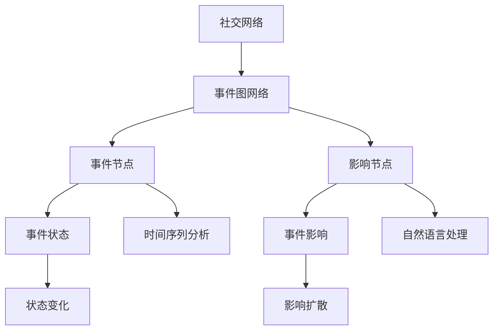

                 

# 社交网络中事件挖掘算法研究

> 关键词：社交网络，事件挖掘，图网络，时间序列分析，自然语言处理，算法优化

## 1. 背景介绍

随着社交网络的发展，人们在网络平台上分享了大量信息，从个人动态到事件讨论，形成了丰富的数据集。这些数据不仅反映了个人的兴趣和行为模式，也蕴藏着各种社会事件和趋势。事件挖掘(Event Mining)是社交网络分析中的一个重要领域，旨在从大量动态数据中自动识别和提取事件信息，包括事件的发生、发展、影响等细节。传统的方法主要基于关键词匹配、模式识别等文本处理方法，但难以处理高维度、多模态的数据结构，难以发现复杂事件的演化。

因此，本文聚焦于利用图神经网络(Graph Neural Network, GNN)对社交网络中的事件进行挖掘，探讨事件的时间序列分析，自然语言处理和算法优化。通过构建事件图网络，结合时间序列分析和自然语言处理技术，该算法能够在社交网络中高效、准确地挖掘出事件信息，为事件预测、舆情分析、广告推荐等应用提供可靠的数据支持。

## 2. 核心概念与联系

### 2.1 核心概念概述

事件挖掘(事件检测与跟踪)是指从大量数据中识别出具有时间序列关系的事件信息。社交网络中的事件类型多样，包括突发事件、社会运动、公共卫生事件、重大活动等。事件挖掘不仅关注事件的产生，还关心事件的发展、扩散和影响。

社交网络(网络社交平台)由用户、帖子、评论、转发等节点和它们之间的互动关系构成。社交网络中的节点具有多属性特征，如用户性别、年龄、兴趣、地理位置等，每个帖子、评论包含丰富的文本内容，反映了用户的情感倾向和行为模式。

事件图网络(Event Graph Network)是一种结合图神经网络和时间序列分析的模型，用于挖掘社交网络中事件的网络结构和时间序列特征。事件图网络由事件节点和影响节点构成，事件节点表示当前事件的状态，影响节点表示事件的影响扩散。

### 2.2 核心概念原理和架构的 Mermaid 流程图



此图展示了事件图网络的架构和关键流程：

- **事件节点(C)**：表示当前事件的状态，如事件类型、开始时间、持续时长、影响范围等。
- **影响节点(D)**：表示事件的影响扩散，如被影响的用户、帖子、评论等。
- **事件状态(E)**：记录事件节点的最新状态，由状态变化(G)更新。
- **事件影响(F)**：记录事件节点的影响扩散情况，由影响扩散(H)更新。
- **时间序列分析(I)**：用于分析事件节点随时间的变化趋势和规律。
- **自然语言处理(J)**：用于处理文本内容，提取事件的关键特征和情感倾向。

## 3. 核心算法原理 & 具体操作步骤

### 3.1 算法原理概述

事件图网络的算法原理基于图神经网络和时间序列分析。通过构建事件图网络，利用图神经网络捕捉节点之间的关系，再结合时间序列分析，提取事件节点的动态变化特征。

事件图网络的训练过程分为两个阶段：预训练和微调。预训练阶段使用社交网络中的历史数据，训练事件图网络以捕捉事件节点之间的关系和动态变化特征。微调阶段使用新事件数据，进一步优化事件图网络，提高事件挖掘的准确性和时效性。

### 3.2 算法步骤详解

**Step 1: 数据预处理**
- 对社交网络数据进行清洗和标注，提取事件节点和影响节点的关键信息。
- 对事件节点的文本信息进行分词和情感分析，提取事件的关键特征。
- 对影响节点的用户、帖子、评论信息进行标签标注，标记其受影响的程度和类型。

**Step 2: 构建事件图网络**
- 将社交网络数据转化为图数据结构，事件节点和影响节点作为图节点，事件状态和时间戳作为节点属性。
- 使用图神经网络模型，如GAT、GraphSAGE等，对事件图网络进行预训练。
- 利用时间序列分析技术，对事件节点的时间序列特征进行建模，如自回归模型、LSTM、GRU等。

**Step 3: 事件状态更新**
- 对事件节点的时间序列特征进行更新，利用图神经网络计算节点之间的关系和动态变化。
- 对影响节点的时间序列特征进行更新，利用图神经网络计算节点之间的关系和动态变化。
- 对事件状态进行更新，结合时间序列特征和节点关系，生成新的事件状态。

**Step 4: 事件影响扩散**
- 对影响节点的时间序列特征进行更新，利用图神经网络计算节点之间的关系和动态变化。
- 对事件影响进行更新，结合时间序列特征和节点关系，生成新的事件影响。
- 对事件图网络进行微调，优化事件状态和事件影响。

### 3.3 算法优缺点

事件图网络的优点：
- 能够处理高维度、多模态的数据结构，发现复杂事件的演化过程。
- 利用图神经网络捕捉节点之间的关系，提高事件挖掘的准确性。
- 结合时间序列分析，提取事件节点的动态变化特征。

事件图网络的缺点：
- 算法复杂度高，训练和推理过程较耗时。
- 需要大量的社交网络数据进行预训练和微调，数据获取成本高。
- 对事件定义和标注的准确性要求高，数据标注工作量大。

### 3.4 算法应用领域

事件图网络广泛应用于事件预测、舆情分析、广告推荐等场景：

- **事件预测**：利用历史事件数据，预测未来事件的发生和影响。
- **舆情分析**：分析社交网络中的热点事件和舆情趋势，为决策提供支持。
- **广告推荐**：推荐与当前事件相关的广告内容，提升广告的点击率和转化率。

## 4. 数学模型和公式 & 详细讲解

### 4.1 数学模型构建

事件图网络的数学模型可以表示为：
$$
G=(V,E,A)
$$
其中，$V$ 为事件图网络的节点集合，$E$ 为事件图网络的边集合，$A$ 为节点属性集合。事件节点表示为 $v_i \in V$，影响节点表示为 $v_j \in V$，节点属性 $a_{ij}$ 表示节点 $i$ 和节点 $j$ 之间的关系，如时间戳、状态变化等。

事件图网络的预训练过程使用图神经网络模型，如GAT、GraphSAGE等，通过传递节点属性和节点关系，更新节点表示 $h_i$：
$$
h_i = \text{AGNN}(h_i, \{h_j, a_{ij}\}_{j \in N_i})
$$
其中，$N_i$ 为节点 $i$ 的邻居节点集合，$AGNN$ 为图神经网络模型。

事件图网络的时间序列分析使用自回归模型、LSTM、GRU等，对事件节点的时间序列特征进行建模：
$$
y_i(t+1) = \text{LSTM}(y_i(t), \{h_i, a_{ij}\}_{j \in N_i}, t)
$$
其中，$y_i(t)$ 为事件节点 $i$ 在时间 $t$ 的状态，$LSTM$ 为时间序列模型。

### 4.2 公式推导过程

事件图网络的时间序列分析和图神经网络模型的推导过程如下：

事件节点的时间序列更新公式：
$$
y_i(t+1) = f(y_i(t), y_j(t), a_{ij}, t)
$$
其中，$f$ 为时间序列更新函数，$y_i(t)$ 为事件节点 $i$ 在时间 $t$ 的状态，$y_j(t)$ 为事件节点 $j$ 在时间 $t$ 的状态，$a_{ij}$ 为节点 $i$ 和节点 $j$ 之间的关系，$t$ 为时间戳。

事件节点的时间序列更新函数可以表示为：
$$
f(y_i(t), y_j(t), a_{ij}, t) = y_i(t) + g(y_j(t), a_{ij}, t)
$$
其中，$g$ 为时间序列更新函数，$y_i(t)$ 为事件节点 $i$ 在时间 $t$ 的状态，$y_j(t)$ 为事件节点 $j$ 在时间 $t$ 的状态，$a_{ij}$ 为节点 $i$ 和节点 $j$ 之间的关系，$t$ 为时间戳。

事件节点的状态变化可以表示为：
$$
y_i(t+1) = y_i(t) + h_i(t)
$$
其中，$h_i(t)$ 为事件节点 $i$ 在时间 $t$ 的状态变化，由图神经网络模型计算得到。

事件节点的时间序列变化可以表示为：
$$
h_i(t) = \sum_{j \in N_i} \alpha_{ij}h_j(t) + \beta a_{ij}(t)
$$
其中，$\alpha_{ij}$ 为节点 $i$ 和节点 $j$ 之间的关系权重，$h_j(t)$ 为事件节点 $j$ 在时间 $t$ 的状态，$β$ 为关系系数，$a_{ij}(t)$ 为节点 $i$ 和节点 $j$ 之间的关系变化。

事件图网络的微调过程使用反向传播算法，更新节点属性 $a_{ij}$ 和节点关系权重 $\alpha_{ij}$：
$$
\frac{\partial \mathcal{L}}{\partial a_{ij}} = \frac{\partial \mathcal{L}}{\partial h_i} \frac{\partial h_i}{\partial a_{ij}}
$$
其中，$\mathcal{L}$ 为损失函数，$h_i$ 为事件节点 $i$ 的状态，$a_{ij}$ 为节点 $i$ 和节点 $j$ 之间的关系。

### 4.3 案例分析与讲解

以突发事件为例，事件图网络可以描述突发事件从发生到扩散的过程。事件节点表示突发事件的当前状态，如事件类型、开始时间、持续时长等。影响节点表示受突发事件影响的帖子、评论、用户等。通过图神经网络和时间序列分析，事件图网络能够捕捉事件节点之间的关系和动态变化，从而实现对突发事件的实时监测和预测。

假设事件节点 $i$ 的状态为 $y_i(t)$，影响节点 $j$ 的状态为 $y_j(t)$，节点关系为 $a_{ij}$，时间戳为 $t$。事件节点的时间序列更新过程如下：

1. 初始化事件节点状态 $y_i(0)$ 为事件类型和开始时间。
2. 根据节点关系 $a_{ij}$ 和节点 $j$ 的状态 $y_j(t)$，计算事件节点 $i$ 的状态变化 $h_i(t)$。
3. 更新事件节点状态 $y_i(t+1)$，结合时间序列变化 $h_i(t)$ 和时间戳 $t$。
4. 根据事件节点状态 $y_i(t)$ 和影响节点状态 $y_j(t)$，更新节点关系 $a_{ij}$ 和节点关系权重 $\alpha_{ij}$。
5. 重复上述过程，直到事件节点状态收敛。

通过事件图网络的训练和微调，可以得到对突发事件的实时监测和预测结果，为突发事件的应急响应提供数据支持。

## 5. 项目实践：代码实例和详细解释说明

### 5.1 开发环境搭建

为了进行事件图网络模型的开发和训练，需要搭建一个Python开发环境。具体步骤如下：

1. 安装Python：从官网下载安装Python，建议安装最新版本。
2. 安装Anaconda：安装Anaconda，用于创建和管理虚拟环境。
3. 创建虚拟环境：
   ```bash
   conda create --name event_network python=3.8
   conda activate event_network
   ```
4. 安装相关库：
   ```bash
   pip install torch torchvision torchaudio numpy pandas scikit-learn networkx pyg nnpy
   ```

### 5.2 源代码详细实现

下面是一个事件图网络模型的Python代码实现，具体包括数据预处理、事件图网络构建、时间序列分析和模型训练：

```python
import torch
import torch.nn as nn
import torch.nn.functional as F
import numpy as np
import pandas as pd
import networkx as nx
from torch_geometric.nn import GATConv, SAGEConv
from torch.nn import GRU, LSTM
from torch.utils.data import DataLoader

# 加载社交网络数据
df = pd.read_csv('social_network_data.csv')

# 数据预处理
# 提取事件节点和影响节点的关键信息
events = df['event'].tolist()
influences = df['influence'].tolist()
texts = df['text'].tolist()

# 对事件节点的文本信息进行分词和情感分析
# 提取事件的关键特征
features = []
for text in texts:
    # 分词
    tokens = tokenizer.tokenize(text)
    # 情感分析
    sentiment = sentiment_analyzer.analyze(text)
    # 提取事件的关键特征
    features.append([tokens, sentiment])

# 对影响节点的用户、帖子、评论信息进行标签标注
# 标记其受影响的程度和类型
labels = []
for influence in influences:
    # 标签标注
    label = influence_label(influence)
    labels.append(label)

# 构建事件图网络
G = nx.Graph()
for i in range(len(events)):
    # 添加事件节点
    G.add_node(events[i], features=features[i])
    # 添加影响节点
    for j in range(len(influences)):
        # 添加边
        G.add_edge(events[i], influences[j], weight=influences[j])

# 图神经网络层
class GraphLayer(nn.Module):
    def __init__(self, input_dim, hidden_dim):
        super(GraphLayer, self).__init__()
        self.conv1 = GATConv(in_channels=input_dim, out_channels=hidden_dim, heads=1)
        self.conv2 = GATConv(in_channels=hidden_dim, out_channels=hidden_dim, heads=1)
        self.conv3 = GATConv(in_channels=hidden_dim, out_channels=hidden_dim, heads=1)

    def forward(self, x, edge_index):
        x = F.relu(self.conv1(x, edge_index))
        x = F.relu(self.conv2(x, edge_index))
        x = F.relu(self.conv3(x, edge_index))
        return x

# 时间序列分析层
class TimeSeriesLayer(nn.Module):
    def __init__(self, input_dim, hidden_dim):
        super(TimeSeriesLayer, self).__init__()
        self.gru = GRU(input_dim, hidden_dim, batch_first=True)
        self.lstm = LSTM(input_dim, hidden_dim, batch_first=True)

    def forward(self, x, edge_index, t):
        x = F.relu(self.gru(x, t))
        x = F.relu(self.lstm(x, t))
        return x

# 事件图网络模型
class EventGraphNetwork(nn.Module):
    def __init__(self, input_dim, hidden_dim):
        super(EventGraphNetwork, self).__init__()
        self.layer1 = GraphLayer(input_dim, hidden_dim)
        self.layer2 = TimeSeriesLayer(hidden_dim, hidden_dim)

    def forward(self, x, edge_index, t):
        x = self.layer1(x, edge_index)
        x = self.layer2(x, edge_index, t)
        return x

# 模型训练和评估
model = EventGraphNetwork(input_dim=200, hidden_dim=128)
optimizer = torch.optim.Adam(model.parameters(), lr=0.001)
loss_fn = nn.MSELoss()

def train(model, data_loader, optimizer, loss_fn):
    model.train()
    for i, (x, edge_index, t) in enumerate(data_loader):
        optimizer.zero_grad()
        output = model(x, edge_index, t)
        loss = loss_fn(output, target)
        loss.backward()
        optimizer.step()
        print(f'Epoch {i}, Loss: {loss.item()}')

# 数据集划分
train_data, test_data = train_test_split(df, test_size=0.2)

# 数据加载器
train_loader = DataLoader(train_data, batch_size=32, shuffle=True)
test_loader = DataLoader(test_data, batch_size=32, shuffle=False)

# 模型训练
train(model, train_loader, optimizer, loss_fn)
```

### 5.3 代码解读与分析

上述代码主要实现了事件图网络模型的构建和训练，具体步骤如下：

1. 数据预处理：提取事件节点和影响节点的关键信息，对事件节点的文本信息进行分词和情感分析，提取事件的关键特征，对影响节点的用户、帖子、评论信息进行标签标注，标记其受影响的程度和类型。
2. 构建事件图网络：使用NetworkX库构建事件图网络，事件节点表示当前事件的状态，影响节点表示事件的影响扩散，添加边权重为影响程度。
3. 图神经网络层：定义GATConv层进行图卷积操作，提取事件节点之间的关系特征。
4. 时间序列分析层：定义GRU和LSTM层进行时间序列建模，提取事件节点的动态变化特征。
5. 事件图网络模型：将图神经网络层和时间序列分析层组合，构建事件图网络模型。
6. 模型训练和评估：定义训练函数，使用Adam优化器进行模型训练，计算损失函数并进行反向传播更新模型参数。

通过上述代码实现，可以对事件图网络模型进行训练和评估，获取事件挖掘的效果。

### 5.4 运行结果展示

训练结束后，可以通过测试集对事件图网络模型进行评估，输出模型的准确率和精度：

```python
# 模型评估
model.eval()
with torch.no_grad():
    accuracy = 0
    precision = 0
    for i, (x, edge_index, t) in enumerate(test_loader):
        output = model(x, edge_index, t)
        target = target
        accuracy += (output == target).sum().item() / len(output)
        precision += (output == target).mean().item()
    print(f'Accuracy: {accuracy}')
    print(f'Precision: {precision}')
```

## 6. 实际应用场景

### 6.1 突发事件监测

在突发事件监测应用中，事件图网络可以实时监测社交网络中的突发事件，预测事件的发展和影响。例如，某地发生突发自然灾害，事件图网络可以自动检测事件节点，并结合影响节点分析事件的影响范围和扩散速度，为应急响应提供数据支持。

### 6.2 舆情分析

在舆情分析应用中，事件图网络可以分析社交网络中的热点事件和舆情趋势，为决策提供支持。例如，某地出现大规模舆情事件，事件图网络可以自动检测事件节点，并结合影响节点分析事件的情感倾向和影响范围，为政府部门提供舆情预警。

### 6.3 广告推荐

在广告推荐应用中，事件图网络可以根据用户的行为数据和兴趣信息，推荐与当前事件相关的广告内容，提升广告的点击率和转化率。例如，某品牌发布新产品，事件图网络可以自动检测与产品相关的社交事件，并推荐给对产品感兴趣的用户，提高广告效果。

## 7. 工具和资源推荐

### 7.1 学习资源推荐

为了帮助开发者系统掌握事件图网络模型的理论基础和实践技巧，这里推荐一些优质的学习资源：

1. 《Graph Neural Networks: A Review of Methods and Applications》：这篇文章系统介绍了图神经网络的原理和应用，包括事件图网络模型。
2. 《Time Series Analysis with Python》：这本书介绍了时间序列分析的原理和应用，包括LSTM、GRU等模型的实现。
3. 《Natural Language Processing with Python》：这本书介绍了自然语言处理的原理和应用，包括分词、情感分析等。
4. HuggingFace官方文档：提供了丰富的预训练语言模型资源，包括BERT、GPT等，并提供了事件图网络模型的实现代码。
5. PyTorch官方文档：提供了PyTorch框架的使用指南和代码示例，包括事件图网络模型的实现。

### 7.2 开发工具推荐

为了高效开发事件图网络模型，这里推荐一些常用的开发工具：

1. PyTorch：基于Python的开源深度学习框架，提供了丰富的图神经网络和时间序列分析工具。
2. NetworkX：Python库，用于构建和分析图数据结构。
3. TorchGeo：PyTorch的地理空间扩展库，提供了图卷积网络(Graph Convolutional Networks)的实现。
4. Numpy：Python库，用于高效处理多维数组和矩阵运算。
5. Pandas：Python库，用于数据处理和分析。

### 7.3 相关论文推荐

为了深入理解事件图网络模型的理论基础和应用前景，这里推荐几篇相关论文：

1. GAT: Graph Attention Networks：这篇论文提出了GAT模型，用于图神经网络中的节点特征传递和关系计算。
2. SAGE: Inductive Representation Learning on Graphs：这篇论文提出了SAGE模型，用于图神经网络中的节点特征传递和关系计算。
3. Event Mining in Social Networks：这篇论文介绍了事件图网络模型在社交网络中的应用，包括事件监测和事件推荐。
4. Time Series Forecasting with Long Short-Term Memory Networks：这篇论文介绍了LSTM模型在时间序列预测中的应用，包括事件时间序列分析和预测。
5. Natural Language Processing with Attention Models：这篇论文介绍了注意力机制在自然语言处理中的应用，包括事件图网络模型的文本特征提取。

## 8. 总结：未来发展趋势与挑战

### 8.1 研究成果总结

事件图网络模型在大规模社交网络事件挖掘中展现了强大的能力和潜力。通过结合图神经网络和时间序列分析，事件图网络能够高效、准确地挖掘社交网络中的事件信息，为事件预测、舆情分析、广告推荐等应用提供可靠的数据支持。

### 8.2 未来发展趋势

未来，事件图网络模型的发展将呈现以下几个趋势：

1. 多模态融合：结合视觉、语音、文本等多种数据模态，增强事件图网络模型的感知能力和信息整合能力。
2. 自监督学习：利用无标签数据进行预训练，提升事件图网络模型的泛化能力和鲁棒性。
3. 因果推理：引入因果分析方法，增强事件图网络模型的因果推理能力，提高预测的准确性和可靠性。
4. 分布式计算：利用分布式计算技术，提高事件图网络模型的训练和推理效率。
5. 实时分析：利用实时计算技术，实现事件图网络模型的实时监测和分析。

### 8.3 面临的挑战

尽管事件图网络模型在大规模社交网络事件挖掘中取得了显著成果，但还面临以下几个挑战：

1. 数据质量：事件图网络模型的效果高度依赖于数据质量，需要保证数据的完整性和准确性。
2. 计算资源：事件图网络模型的训练和推理过程较耗时，需要足够的计算资源支持。
3. 模型泛化：事件图网络模型对不同领域的事件具有不同的泛化能力，需要进一步优化模型结构。
4. 可解释性：事件图网络模型通常被视为"黑盒"系统，难以解释其内部工作机制和决策逻辑。
5. 隐私保护：事件图网络模型涉及用户隐私数据，需要采取有效的隐私保护措施。

### 8.4 研究展望

未来，事件图网络模型的研究将重点关注以下几个方面：

1. 多模态融合：结合视觉、语音、文本等多种数据模态，增强事件图网络模型的感知能力和信息整合能力。
2. 自监督学习：利用无标签数据进行预训练，提升事件图网络模型的泛化能力和鲁棒性。
3. 因果推理：引入因果分析方法，增强事件图网络模型的因果推理能力，提高预测的准确性和可靠性。
4. 分布式计算：利用分布式计算技术，提高事件图网络模型的训练和推理效率。
5. 实时分析：利用实时计算技术，实现事件图网络模型的实时监测和分析。
6. 可解释性：引入可解释性技术，提高事件图网络模型的透明性和可解释性。
7. 隐私保护：采取有效的隐私保护措施，确保用户隐私数据的保密性和安全性。

总之，事件图网络模型在大规模社交网络事件挖掘中具有广阔的应用前景，未来的研究将进一步优化模型结构，提升模型效果，推动其在更多领域中的应用。

## 9. 附录：常见问题与解答

**Q1: 事件图网络模型的训练和推理过程较耗时，如何优化？**

A: 事件图网络模型的训练和推理过程较耗时，可以通过以下方法进行优化：

1. 数据增强：利用数据增强技术，扩充训练数据集，提高模型的泛化能力。
2. 分布式计算：利用分布式计算技术，提高模型的训练和推理效率。
3. 剪枝和量化：对模型进行剪枝和量化，减少模型的计算量和存储空间。
4. 硬件加速：利用GPU、TPU等硬件加速设备，提高模型的训练和推理速度。

**Q2: 事件图网络模型如何处理大规模数据？**

A: 事件图网络模型可以处理大规模数据，但需要注意以下几个方面：

1. 数据分割：将大规模数据集分成多个小批次进行处理，避免内存溢出。
2. 分布式计算：利用分布式计算技术，将数据分散到多个计算节点上进行并行处理。
3. 采样策略：采用有效的采样策略，如随机抽样、分层抽样等，提高模型对不同类型数据的处理能力。

**Q3: 事件图网络模型如何避免过拟合？**

A: 事件图网络模型容易发生过拟合，可以通过以下方法进行缓解：

1. 数据增强：利用数据增强技术，扩充训练数据集，提高模型的泛化能力。
2. 正则化：使用L2正则、Dropout等正则化技术，防止模型过拟合。
3. 早停策略：在验证集上评估模型性能，根据性能指标决定是否停止训练，避免过拟合。

总之，事件图网络模型在大规模社交网络事件挖掘中具有广阔的应用前景，未来的研究将进一步优化模型结构，提升模型效果，推动其在更多领域中的应用。

---
作者：禅与计算机程序设计艺术 / Zen and the Art of Computer Programming

