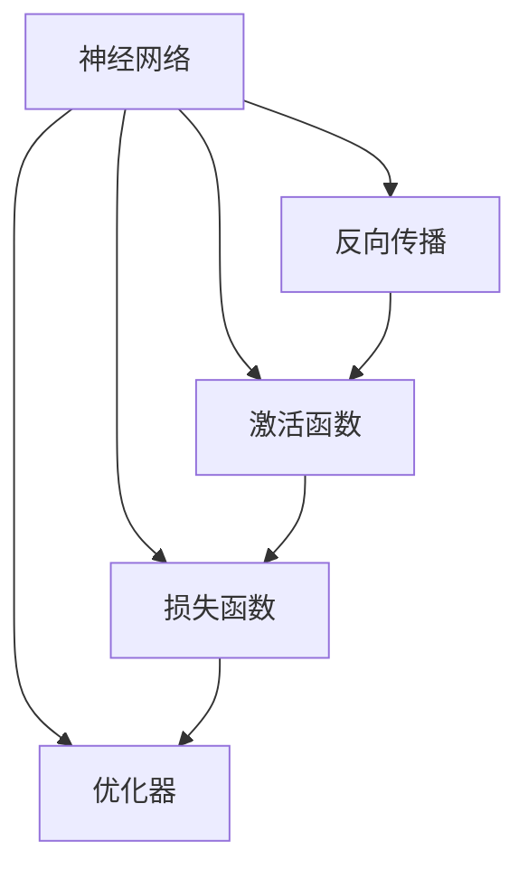

                 

# 神经网络：开启智能新纪元

## 1. 背景介绍

### 1.1 问题由来

随着人工智能技术的飞速发展，深度学习已成为推动智能技术进步的核心驱动力。其中，神经网络作为深度学习的重要分支，以其强大的建模能力和广泛的应用前景，正在引领一场智能科技的革命。

神经网络源于对人类神经系统的模拟，通过大量的数据和复杂的计算，逐步训练出一个可以完成特定任务的高效模型。它的成功应用，已在图像识别、自然语言处理、语音识别、推荐系统等领域展现出强大的能力，并逐渐渗透到各个行业的核心业务中。

本博客将从神经网络的基本原理入手，逐步深入探索其在各个领域的应用，并探讨未来发展的趋势与挑战。

### 1.2 问题核心关键点

神经网络的核心在于其能够通过学习大量数据中的模式和规律，自动调整内部参数，以完成复杂的非线性映射任务。这使得神经网络能够处理大规模的数据集，并在某些特定任务上达到甚至超越人类专家的水平。

神经网络的关键技术包括：
- **反向传播算法**：用于计算神经网络中的梯度，进而更新模型参数。
- **激活函数**：将神经元的输出映射到特定的非线性区域，增强模型的表达能力。
- **损失函数**：用于衡量模型预测结果与真实标签之间的差异，指导模型优化。
- **优化器**：如梯度下降、Adam等，用于更新模型参数，加速收敛。

## 2. 核心概念与联系

### 2.1 核心概念概述

为了更好地理解神经网络的基本原理和应用，本节将介绍几个核心概念及其相互联系：

- **神经网络**：由多个层次（如输入层、隐藏层、输出层）组成的计算图，用于学习和表示数据中的复杂模式。
- **反向传播算法**：通过链式法则计算梯度，用于更新模型参数。
- **激活函数**：如Sigmoid、ReLU等，用于增强神经网络的非线性特性。
- **损失函数**：如均方误差、交叉熵等，用于衡量模型预测结果的准确性。
- **优化器**：如SGD、Adam等，用于更新模型参数，使损失函数最小化。

这些概念之间的关系可以通过以下Mermaid流程图来展示：



这个流程图展示出神经网络的基本组成及其相互关系：

1. 神经网络由多个层次组成，其中每个层次包含多个神经元。
2. 反向传播算法通过链式法则计算损失函数对每个参数的梯度。
3. 激活函数增强了神经元的非线性特性，提升了模型的表达能力。
4. 损失函数衡量模型预测结果与真实标签之间的差异。
5. 优化器根据梯度信息，调整模型参数，最小化损失函数。

这些核心概念共同构成了神经网络的基础架构，使其能够处理复杂的数据分布和复杂的非线性映射。

## 3. 核心算法原理 & 具体操作步骤
### 3.1 算法原理概述

神经网络的训练过程基于损失函数最小化。假设给定一个神经网络模型 $M$ 和一个训练集 $D$，目标是最小化模型在训练集上的平均损失 $L(D; M)$。训练过程分为前向传播和反向传播两个步骤。

前向传播时，将训练样本输入模型，计算每个神经元的输出，并最终得到模型的预测结果。假设第 $i$ 个训练样本的输入为 $x_i$，输出为 $y_i$，则前向传播过程可表示为：

$$
\hat{y}_i = M(x_i; \theta)
$$

其中 $\theta$ 为模型参数。

反向传播时，计算模型输出与真实标签之间的差异，即损失函数 $L(D; M)$，并根据损失函数的梯度更新模型参数。设 $L_i$ 为第 $i$ 个训练样本的损失，则有：

$$
L(D; M) = \frac{1}{N} \sum_{i=1}^N L_i
$$

其中 $N$ 为训练集大小。假设激活函数为 $\sigma$，则损失函数对第 $l$ 层的梯度 $g^{(l)}_i$ 可表示为：

$$
g^{(l)}_i = \frac{\partial L_i}{\partial z^{(l)}_i} \cdot \frac{\partial z^{(l)}_i}{\partial w^{(l)}_i}
$$

其中 $z^{(l)}_i$ 为第 $l$ 层的激活值，$w^{(l)}_i$ 为第 $l$ 层的权重。通过链式法则，可以计算出每个参数的梯度，并使用优化器进行参数更新。

### 3.2 算法步骤详解

基于神经网络的训练过程通常包含以下几个关键步骤：

**Step 1: 数据准备**
- 收集训练集 $D$，每个样本包含输入 $x_i$ 和标签 $y_i$。
- 对数据进行预处理，如归一化、标准化、数据增强等，以提高模型泛化能力。

**Step 2: 模型搭建**
- 选择适合的神经网络结构，如全连接神经网络、卷积神经网络、循环神经网络等。
- 定义神经元的激活函数、损失函数和优化器。

**Step 3: 前向传播**
- 将训练集样本输入模型，计算每个神经元的输出。
- 将输出结果与真实标签进行对比，计算损失函数。

**Step 4: 反向传播**
- 根据损失函数的梯度，计算每个参数的梯度。
- 使用优化器根据梯度信息更新模型参数。

**Step 5: 模型评估**
- 在测试集上评估模型性能，如准确率、召回率、F1分数等指标。
- 根据评估结果调整模型结构或超参数，重新训练模型。

**Step 6: 模型部署**
- 将训练好的模型保存为文件，部署到实际应用系统中。
- 使用模型进行实时预测和推理，提供服务。

### 3.3 算法优缺点

神经网络训练具有以下优点：
- **自适应能力**：通过大量的数据和复杂的计算，能够学习到数据的复杂模式，适应各种复杂任务。
- **泛化能力强**：通过正则化技术，可以控制模型复杂度，避免过拟合。
- **计算效率高**：利用并行计算和GPU加速，可以显著提高模型训练和推理速度。

同时，神经网络训练也存在一些局限性：
- **模型复杂度高**：神经网络模型参数众多，训练过程复杂，容易过拟合。
- **训练时间较长**：大数据集和高参数量的模型训练需要大量时间和计算资源。
- **依赖数据质量**：训练效果很大程度上依赖于训练数据的质量和多样性。

## 4. 数学模型和公式 & 详细讲解
### 4.1 数学模型构建

神经网络的训练过程可以形式化地表示为以下数学模型：

假设给定训练集 $D = \{(x_i, y_i)\}_{i=1}^N$，其中 $x_i$ 为输入，$y_i$ 为标签，$M(x; \theta)$ 为神经网络模型，$\theta$ 为模型参数，$L$ 为损失函数。训练目标是最小化平均损失：

$$
\theta^* = \mathop{\arg\min}_{\theta} \frac{1}{N} \sum_{i=1}^N L(y_i, M(x_i; \theta))
$$

在实际应用中，常用的损失函数包括均方误差（MSE）、交叉熵（CE）、对数损失（Log Loss）等。这些损失函数的目标是使模型预测结果与真实标签之间的差异最小化。

### 4.2 公式推导过程

以交叉熵损失函数为例，其推导过程如下：

设 $y_i \in \{0,1\}$ 为标签，$\hat{y}_i = M(x_i; \theta)$ 为模型预测结果，则交叉熵损失函数定义为：

$$
L(y_i, \hat{y}_i) = -(y_i \log \hat{y}_i + (1-y_i) \log (1-\hat{y}_i))
$$

平均损失为：

$$
L(D; M) = \frac{1}{N} \sum_{i=1}^N L(y_i, M(x_i; \theta))
$$

通过反向传播算法，可以计算出损失函数对每个参数的梯度。假设激活函数为 $\sigma$，则梯度 $g_i$ 可表示为：

$$
g_i = \frac{\partial L(y_i, \hat{y}_i)}{\partial z_i} \cdot \frac{\partial z_i}{\partial w_i}
$$

其中 $z_i = \sigma(w_i x_i + b_i)$，$w_i$ 为权重，$b_i$ 为偏置。通过链式法则，可以计算出每个参数的梯度。

### 4.3 案例分析与讲解

以图像分类为例，使用卷积神经网络（CNN）进行训练。卷积神经网络包括卷积层、池化层、全连接层等，用于提取图像的特征和进行分类。假设使用LeNet网络进行图像分类，其训练过程如下：

1. **数据准备**：收集图像数据集，并对数据进行预处理，如归一化、数据增强等。
2. **模型搭建**：定义LeNet网络结构，包括卷积层、池化层、全连接层等，并设置激活函数、损失函数和优化器。
3. **前向传播**：将图像输入LeNet网络，计算每个神经元的输出。
4. **反向传播**：计算损失函数，并根据梯度信息更新模型参数。
5. **模型评估**：在测试集上评估模型性能，如准确率、召回率、F1分数等指标。
6. **模型部署**：将训练好的模型保存为文件，部署到实际应用系统中。

通过这种方式，LeNet网络能够学习到图像中的特征，并在测试集上取得较高的分类精度。

## 5. 项目实践：代码实例和详细解释说明
### 5.1 开发环境搭建

进行神经网络项目开发，首先需要搭建好开发环境。以下是使用Python进行TensorFlow开发的Python环境配置流程：

1. 安装Anaconda：从官网下载并安装Anaconda，用于创建独立的Python环境。
```bash
conda create -n tf-env python=3.8 
conda activate tf-env
```

2. 安装TensorFlow：根据CUDA版本，从官网获取对应的安装命令。例如：
```bash
conda install tensorflow tensorflow-gpu=2.6 -c conda-forge
```

3. 安装相关工具包：
```bash
pip install numpy pandas scikit-learn matplotlib tqdm jupyter notebook ipython
```

完成上述步骤后，即可在`tf-env`环境中开始神经网络开发。

### 5.2 源代码详细实现

下面以图像分类任务为例，给出使用TensorFlow进行LeNet网络训练的Python代码实现。

```python
import tensorflow as tf
from tensorflow.keras import layers, models
from tensorflow.keras.datasets import mnist

# 加载MNIST数据集
(x_train, y_train), (x_test, y_test) = mnist.load_data()

# 数据预处理
x_train, x_test = x_train / 255.0, x_test / 255.0
x_train = x_train.reshape(-1, 28, 28, 1)
x_test = x_test.reshape(-1, 28, 28, 1)

# 定义LeNet模型
model = models.Sequential()
model.add(layers.Conv2D(6, (5, 5), activation='relu', input_shape=(28, 28, 1)))
model.add(layers.MaxPooling2D((2, 2)))
model.add(layers.Flatten())
model.add(layers.Dense(120, activation='relu'))
model.add(layers.Dense(84, activation='relu'))
model.add(layers.Dense(10, activation='softmax'))

# 编译模型
model.compile(optimizer='adam',
              loss='sparse_categorical_crossentropy',
              metrics=['accuracy'])

# 训练模型
model.fit(x_train, y_train, epochs=10, batch_size=64, validation_data=(x_test, y_test))

# 评估模型
test_loss, test_acc = model.evaluate(x_test, y_test)
print('Test accuracy:', test_acc)
```

以上就是使用TensorFlow进行LeNet网络训练的完整代码实现。可以看到，TensorFlow的高级API使得网络模型的搭建和训练过程非常简单高效。

### 5.3 代码解读与分析

让我们再详细解读一下关键代码的实现细节：

**数据预处理**：
- 使用`mnist.load_data()`加载MNIST数据集。
- 对数据进行归一化，将像素值从0到255缩放到0到1。
- 将二维图像数据转换为四维张量，以便进行卷积操作。

**模型定义**：
- 使用`Sequential`定义LeNet模型。
- 添加卷积层、池化层、全连接层等层次，并设置激活函数、损失函数和优化器。
- 最后添加输出层，使用softmax激活函数进行多分类。

**模型编译**：
- 使用`model.compile()`编译模型，设置优化器、损失函数和评估指标。

**模型训练**：
- 使用`model.fit()`训练模型，设置训练轮数和批量大小。
- 在每个epoch结束后，计算模型在验证集上的性能。

**模型评估**：
- 使用`model.evaluate()`评估模型在测试集上的性能，输出准确率。

通过这段代码，我们完成了LeNet网络的搭建、训练和评估。整个过程简单易懂，适合初学者学习和实践。

## 6. 实际应用场景
### 6.1 计算机视觉

神经网络在计算机视觉领域的应用非常广泛。传统的图像识别、物体检测、人脸识别等任务，以及新兴的图像生成、图像风格转换、图像超分辨率等任务，都可以通过神经网络实现。

以物体检测为例，Yolov3模型是当前最流行的神经网络模型之一。Yolov3通过多尺度特征提取、残差块、锚点等技术，实现了高精度和高效率的物体检测。在实际应用中，通过训练Yolov3模型，可以实现实时视频中的物体检测，如行人检测、车辆检测、交通标志检测等。

### 6.2 自然语言处理

神经网络在自然语言处理领域也有广泛应用。传统的文本分类、命名实体识别、机器翻译等任务，以及新兴的文本生成、对话系统、问答系统等任务，都可以通过神经网络实现。

以机器翻译为例，Transformer模型是目前最先进的神经网络模型之一。Transformer通过自注意力机制，能够自动捕捉长距离依赖关系，实现高效的多语言翻译。在实际应用中，通过训练Transformer模型，可以实现实时多语言翻译，如谷歌翻译、百度翻译等。

### 6.3 语音识别

神经网络在语音识别领域也有广泛应用。传统的语音识别任务，以及新兴的语音情感识别、语音合成等任务，都可以通过神经网络实现。

以语音情感识别为例，通过训练神经网络模型，可以将语音信号转化为情感标签，用于分析用户情感状态。在实际应用中，语音情感识别技术可以用于心理健康监测、客户服务分析、情感分析等领域。

### 6.4 未来应用展望

随着神经网络技术的不断发展，其应用场景将进一步拓展，为各个行业带来深刻的变革：

1. **自动驾驶**：神经网络可以用于自动驾驶系统的图像识别、路径规划、决策制定等任务，提升驾驶安全性和舒适性。
2. **智能家居**：神经网络可以用于智能家居的语音识别、图像识别、行为分析等任务，提升家居的智能化水平。
3. **医疗诊断**：神经网络可以用于医学影像识别、疾病预测、个性化医疗等任务，提升医疗诊断的准确性和效率。
4. **金融风控**：神经网络可以用于金融交易分析、信用评估、风险预测等任务，提升金融机构的决策能力。
5. **教育科技**：神经网络可以用于个性化学习、智能推荐、情感分析等任务，提升教育科技的应用效果。

## 7. 工具和资源推荐
### 7.1 学习资源推荐

为了帮助开发者系统掌握神经网络的基本原理和实践技巧，这里推荐一些优质的学习资源：

1. **《深度学习》课程**：斯坦福大学开设的深度学习课程，由Andrew Ng主讲，详细介绍了深度学习的基本概念和算法。
2. **《神经网络与深度学习》书籍**：Michael Nielsen的经典之作，全面介绍了神经网络的基础理论和应用实例。
3. **Kaggle竞赛**：Kaggle是一个数据科学竞赛平台，可以通过参加各种竞赛，实践神经网络模型。
4. **TensorFlow官方文档**：TensorFlow的官方文档，提供了丰富的API和样例代码，是学习和实践神经网络的重要资料。
5. **PyTorch官方文档**：PyTorch的官方文档，提供了丰富的API和样例代码，是学习和实践神经网络的重要资料。

通过对这些资源的学习实践，相信你一定能够快速掌握神经网络的技术精髓，并用于解决实际的NLP问题。

### 7.2 开发工具推荐

高效的开发离不开优秀的工具支持。以下是几款用于神经网络开发常用的工具：

1. **PyTorch**：由Facebook开发的深度学习框架，提供了丰富的API和强大的GPU加速能力，适合研究和实验。
2. **TensorFlow**：由Google开发的深度学习框架，支持分布式计算和跨平台部署，适合工程应用。
3. **Keras**：由François Chollet开发的高级深度学习框架，易于上手和使用，适合快速原型设计。
4. **JAX**：由Google开发的自动微分库，支持JIT编译和分布式计算，适合高性能计算。
5. **MXNet**：由Apache开发的深度学习框架，支持多种编程语言和分布式计算，适合工程应用。

合理利用这些工具，可以显著提升神经网络模型的开发效率，加速创新迭代的步伐。

### 7.3 相关论文推荐

神经网络技术的发展离不开学界的持续研究。以下是几篇奠基性的相关论文，推荐阅读：

1. **AlexNet**：ImageNet数据集上的突破性结果，展示了卷积神经网络在图像识别任务上的强大能力。
2. **ResNet**：引入了残差块，解决了深度神经网络训练中的梯度消失问题，提升了模型深度和性能。
3. **Transformer**：一种基于自注意力机制的神经网络模型，在机器翻译、文本生成等任务上取得了SOTA。
4. **GPT-3**：展示了大规模神经网络在自然语言处理任务上的强大能力，推动了预训练模型的发展。
5. **BERT**：一种预训练语言模型，通过双向编码器表示，实现了语言理解的突破性进展。

这些论文代表了大规模神经网络的发展脉络，为未来的神经网络研究提供了重要的参考和指导。

## 8. 总结：未来发展趋势与挑战
### 8.1 总结

本文对神经网络的基本原理、训练过程和应用场景进行了全面系统的介绍。从神经网络的基本概念入手，逐步深入探索其在计算机视觉、自然语言处理、语音识别等领域的应用，并探讨了未来发展的趋势与挑战。

通过本文的系统梳理，可以看到，神经网络正在成为人工智能技术的重要基石，引领了一场智能科技的革命。神经网络在各个领域的应用，极大地提升了数据处理和决策制定的能力，推动了各行各业的智能化升级。

### 8.2 未来发展趋势

展望未来，神经网络技术将呈现以下几个发展趋势：

1. **模型规模更大**：随着算力成本的下降和数据规模的扩张，神经网络模型的参数量将持续增长。超大规模神经网络蕴含的丰富知识，有望实现更加复杂和准确的推理和生成。
2. **计算效率更高**：随着GPU、TPU等硬件设备的不断优化，神经网络的计算速度将显著提升。未来可能会引入更高效的计算方式，如量子计算、光子计算等，进一步加速模型训练和推理。
3. **迁移能力更强**：通过预训练和微调，神经网络可以实现跨领域、跨任务的学习，提升模型在新的应用场景中的性能。未来可能会引入更多的迁移学习范式，如多任务学习、元学习等，增强模型的泛化能力。
4. **融合技术更多**：神经网络可以与其他技术进行更深入的融合，如强化学习、因果推理、知识表示等，提升模型的决策能力和解释能力。未来可能会引入更多的融合技术，如图神经网络、时空网络等，增强模型的综合能力。
5. **伦理和安全保障更全面**：神经网络可能会引入更多的伦理和安全保障机制，如隐私保护、模型公平性、安全防御等，确保模型的可解释性和安全性。未来可能会引入更多的技术手段，如差分隐私、公平学习等，提升模型的伦理水平。

以上趋势凸显了神经网络技术的广阔前景。这些方向的探索发展，必将进一步提升神经网络系统的性能和应用范围，为人类智能的进化带来深远影响。

### 8.3 面临的挑战

尽管神经网络技术已经取得了瞩目成就，但在迈向更加智能化、普适化应用的过程中，它仍面临着诸多挑战：

1. **计算资源瓶颈**：大规模神经网络模型的训练和推理需要大量的计算资源，未来可能会引入更多的硬件优化技术，如GPU、TPU、FPGA等，以满足计算需求。
2. **数据依赖性强**：神经网络模型的性能很大程度上依赖于训练数据的质量和多样性，未来可能会引入更多的数据增强技术，如数据合成、数据扩增等，提升模型泛化能力。
3. **模型解释性不足**：神经网络模型的决策过程难以解释，未来可能会引入更多的可解释性技术，如模型可视化、模型蒸馏等，提升模型的可解释性和可信度。
4. **安全性和鲁棒性问题**：神经网络模型可能会引入恶意攻击，如对抗样本攻击、模型毒化等，未来可能会引入更多的安全防御技术，如对抗训练、鲁棒训练等，提升模型的鲁棒性和安全性。

### 8.4 研究展望

面对神经网络技术面临的挑战，未来的研究需要在以下几个方面寻求新的突破：

1. **高效计算**：通过硬件优化、算法改进等方式，提高神经网络模型的计算效率，提升模型训练和推理速度。
2. **数据增强**：通过数据合成、数据扩增等方式，提升神经网络模型的泛化能力，降低数据依赖性。
3. **可解释性增强**：通过模型可视化、模型蒸馏等方式，提升神经网络模型的可解释性，增强模型的可信度和透明度。
4. **安全性保障**：通过对抗训练、鲁棒训练等方式，提升神经网络模型的安全性，确保模型的鲁棒性和抗攻击能力。

总之，神经网络技术需要在计算效率、数据依赖、模型解释性和安全性等方面进行全面优化，才能进一步拓展其应用边界，推动人工智能技术的发展。只有勇于创新、敢于突破，才能真正实现人工智能技术的智能化和普适化。

## 9. 附录：常见问题与解答

**Q1：神经网络训练过程中如何防止过拟合？**

A: 过拟合是神经网络训练中常见的问题，可以通过以下几种方法进行缓解：

1. **数据增强**：通过旋转、裁剪、缩放等技术，生成更多的训练数据，提升模型的泛化能力。
2. **正则化技术**：如L2正则、Dropout等，约束模型的复杂度，避免过拟合。
3. **早停技术**：在验证集上监测模型性能，当性能不再提升时，停止训练，防止过拟合。
4. **模型集成**：通过组合多个模型，取平均值或加权平均，降低过拟合风险。

这些方法需要根据具体任务和数据特点进行灵活组合。只有在数据、模型、训练、推理等各环节进行全面优化，才能最大限度地发挥神经网络模型的潜力。

**Q2：神经网络在图像识别任务中如何实现高效的特征提取？**

A: 神经网络中的卷积层可以实现高效的特征提取，通过卷积核在图像上滑动，提取不同尺度和方向的特征。具体来说，卷积核可以学习到边缘、角点、纹理等特征，用于图像分类、物体检测等任务。通过增加卷积层的深度和宽度，可以提高特征提取的复杂度和准确性，但同时也会增加模型的计算量和存储量。

**Q3：神经网络在自然语言处理任务中如何实现高效的序列建模？**

A: 神经网络中的循环神经网络（RNN）和长短期记忆网络（LSTM）可以实现高效的序列建模，通过循环结构捕捉时间序列中的依赖关系。具体来说，RNN和LSTM通过循环神经元对序列数据进行迭代处理，学习到不同时间步的依赖关系，用于文本分类、命名实体识别、机器翻译等任务。通过增加RNN和LSTM的深度和宽度，可以提高序列建模的复杂度和准确性，但同时也会增加模型的计算量和存储量。

**Q4：神经网络在推荐系统中如何实现高效的个性化推荐？**

A: 神经网络中的深度学习模型可以实现高效的个性化推荐，通过学习用户的历史行为数据和物品特征，预测用户对不同物品的兴趣度。具体来说，可以使用协同过滤、内容过滤、混合过滤等方法，构建推荐模型。其中，深度学习模型可以通过自编码器、神经网络等方法，学习到用户和物品的隐含表示，用于推荐。通过增加模型的深度和宽度，可以提高推荐模型的复杂度和准确性，但同时也会增加模型的计算量和存储量。

通过本文的系统梳理，可以看到，神经网络正在成为人工智能技术的重要基石，引领了一场智能科技的革命。神经网络在各个领域的应用，极大地提升了数据处理和决策制定的能力，推动了各行各业的智能化升级。未来，随着神经网络技术的不断发展和优化，其应用场景将进一步拓展，为人类智能的进化带来深远影响。

作者：禅与计算机程序设计艺术 / Zen and the Art of Computer Programming

