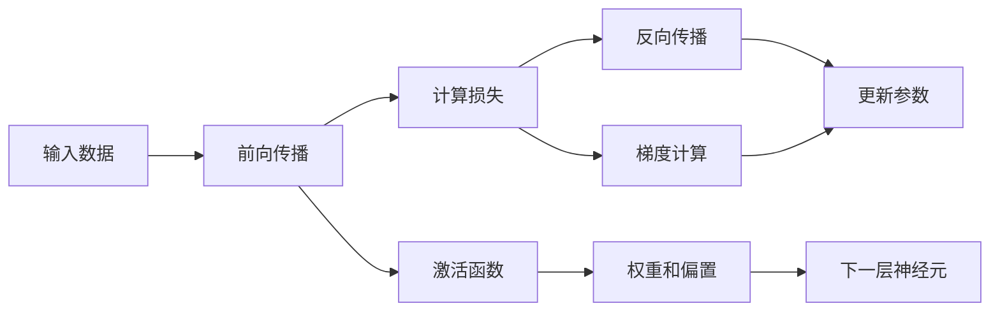

                 

# 神经网络：机器学习的新范式

## 1. 背景介绍

### 1.1 问题由来
近年来，随着深度学习技术的快速发展，人工智能(AI)技术在各行各业得到了广泛应用。其中，神经网络(Neural Networks)作为一种高效的机器学习模型，以其强大的特征提取和预测能力，成为实现复杂非线性映射的重要工具。

神经网络在图像识别、语音识别、自然语言处理等诸多领域取得了突破性进展，推动了机器学习技术从传统统计学习向深度学习时代的转变。然而，传统的神经网络架构在处理大规模数据和高复杂度问题时，仍面临训练时间长、参数过多等挑战。为了克服这些问题，研究者们不断探索新的神经网络模型架构和训练方法，逐渐形成了更加灵活、高效、通用的深度学习模型。

### 1.2 问题核心关键点
本节将介绍神经网络的基本概念、架构以及其在机器学习中的重要应用，并对比传统的统计学习模型，阐述神经网络作为新范式的优势。

- 神经网络：由大量神经元（节点）连接而成，通过多层次的抽象和特征提取，实现非线性映射和复杂模式识别。
- 前馈神经网络(Feedforward Neural Network, FNN)：最基本的神经网络形式，信息单向传递。
- 卷积神经网络(Convolutional Neural Network, CNN)：专门用于处理图像数据的神经网络架构。
- 循环神经网络(Recurrent Neural Network, RNN)：适用于处理序列数据，具有记忆功能。
- 长短时记忆网络(Long Short-Term Memory, LSTM)：一种特殊的RNN，用于解决梯度消失问题。
- 深度神经网络(Deep Neural Network, DNN)：多层次的神经网络，能够自动提取层次化特征。
- 自动编码器(Autencoder)：无监督学习模型，通过重构输入数据进行特征学习。
- 生成对抗网络(Generative Adversarial Network, GAN)：由生成器和判别器两部分组成，通过对抗训练生成逼真的样本。

## 2. 核心概念与联系

### 2.1 核心概念概述

为更好地理解神经网络的基本原理和架构，本节将介绍几个关键概念：

- 神经元（Neuron）：神经网络的基本单位，接收输入并计算输出。
- 激活函数（Activation Function）：决定神经元是否被激活的函数，常用的有sigmoid、ReLU等。
- 权重（Weight）：神经元之间的连接权重，用于调整信息传递。
- 偏置（Bias）：每个神经元的偏置值，影响输出偏移。
- 损失函数（Loss Function）：用于评估模型预测与真实标签之间差异的函数，常用的有均方误差、交叉熵等。
- 反向传播（Backpropagation）：一种训练算法，通过反向传播误差信号来更新模型参数。
- 梯度下降（Gradient Descent）：一种常见的优化算法，通过迭代优化损失函数最小化参数更新。
- 前向传播（Forward Propagation）：模型接受输入并计算输出过程。
- 后向传播（Backward Propagation）：模型计算梯度并更新参数的过程。
- 卷积（Convolution）：一种提取局部特征的操作，常用于图像处理。
- 池化（Pooling）：对卷积特征图进行降维处理，减少计算量。
- 池化（Pooling）：常用于图像处理，减少特征图的维度。
- 梯度消失（Vanishing Gradient）：深层神经网络中常见的训练问题，导致信息传递困难。
- 梯度爆炸（Exploding Gradient）：深层神经网络中常见的训练问题，导致梯度过大。
- Dropout：一种正则化方法，通过随机丢弃神经元减少过拟合。

这些核心概念构成了神经网络的基础架构，并通过信息传递和参数更新实现复杂模式识别和预测。

### 2.2 核心概念原理和架构的 Mermaid 流程图



这张图展示了神经网络的基本工作流程，包括前向传播、激活函数、权重和偏置、计算损失、反向传播和参数更新。从输入数据开始，信息经过多个神经元处理后计算输出，通过损失函数评估预测结果，最后通过反向传播更新参数。

## 3. 核心算法原理 & 具体操作步骤
### 3.1 算法原理概述

神经网络的基本原理是通过多个神经元的组合，实现非线性映射和复杂模式识别。网络中的每个神经元接收输入，通过激活函数计算输出，多个神经元组合形成网络层，通过权重和偏置调整信息传递。网络的输出通过损失函数与真实标签比较，利用反向传播算法和梯度下降优化算法不断调整模型参数，使得损失函数最小化，从而提高模型的预测准确性。

### 3.2 算法步骤详解

神经网络的训练一般包括以下几个关键步骤：

**Step 1: 数据准备和预处理**
- 收集训练数据和测试数据。
- 对数据进行预处理，如归一化、数据增强、划分训练集、验证集和测试集等。

**Step 2: 模型定义和初始化**
- 定义神经网络的结构，包括层数、每层的神经元数量、激活函数、损失函数等。
- 初始化神经网络的参数，如权重和偏置。

**Step 3: 前向传播**
- 将训练数据输入模型，通过前向传播计算输出结果。
- 将输出结果与真实标签进行比较，计算损失函数。

**Step 4: 反向传播**
- 利用反向传播算法计算损失函数对每个参数的梯度。
- 更新模型参数，使得损失函数最小化。

**Step 5: 模型评估**
- 在测试数据上评估模型性能，如准确率、召回率、F1分数等。
- 调整模型超参数，如学习率、批量大小、迭代轮数等，优化模型性能。

**Step 6: 模型保存和部署**
- 将训练好的模型保存为文件或部署到实际应用系统中。
- 对新的数据进行预测，输出模型结果。

这些步骤通常构成了一个完整的神经网络训练流程。通过不断迭代和优化，神经网络能够逐步提高预测准确性，适应不同的应用场景。

### 3.3 算法优缺点

神经网络作为机器学习的新范式，具有以下优点：
1. 强大的特征提取能力：能够自动学习输入数据的特征，无需手动设计特征提取器。
2. 可扩展性强：神经网络层数和神经元数量可以根据任务复杂度进行灵活调整。
3. 处理非线性数据：通过多层神经元组合，能够处理非线性数据和复杂模式。
4. 可解释性差：神经网络被视为黑箱模型，难以解释其内部决策过程。
5. 需要大量标注数据：训练神经网络需要大量的标注数据，增加了成本和难度。
6. 训练时间长：神经网络需要较长的训练时间和计算资源，难以实现快速部署。

同时，神经网络也面临一些挑战：
1. 梯度消失和梯度爆炸：深层神经网络中的常见问题，导致训练困难。
2. 过拟合：在训练数据过少或模型复杂度过高的情况下，容易出现过拟合现象。
3. 参数数量庞大：大规模神经网络需要调整大量的参数，增加了训练和存储成本。
4. 网络结构设计复杂：神经网络结构复杂，需要大量经验和知识进行设计。

尽管存在这些挑战，神经网络以其强大的处理能力和灵活性，在计算机视觉、自然语言处理、语音识别等多个领域取得了显著进展，成为机器学习的重要技术范式。

### 3.4 算法应用领域

神经网络在各个领域都有广泛的应用，以下是一些典型应用场景：

- 图像识别：神经网络通过卷积层和池化层提取图像特征，再通过全连接层进行分类，已经成为图像识别的主流方法。
- 语音识别：通过循环神经网络或卷积神经网络，神经网络能够处理时序数据，实现语音识别和转录。
- 自然语言处理：神经网络通过循环神经网络或Transformer等架构，能够处理文本数据，实现文本分类、情感分析、机器翻译等任务。
- 推荐系统：神经网络通过全连接层或稀疏连接层，能够处理用户行为数据，实现个性化推荐。
- 异常检测：通过神经网络对正常数据和异常数据的区分，实现异常检测和入侵检测。
- 自动驾驶：通过神经网络处理传感器数据，实现自动驾驶和智能交通。
- 自然语言生成：通过生成对抗网络等架构，神经网络能够生成自然语言文本，如文章、对话等。

## 4. 数学模型和公式 & 详细讲解  
### 4.1 数学模型构建

本节将使用数学语言对神经网络的基本模型进行严格刻画。

记神经网络模型为 $N(\theta)$，其中 $\theta$ 表示所有可调参数，如权重和偏置。假设输入数据为 $x$，输出结果为 $y$，则神经网络的数学模型可表示为：

$$
y = N(\theta)(x) = \sigma(W^{[L]}x^{[L-1]} + b^{[L]})
$$

其中，$\sigma$ 表示激活函数，$W^{[L]}$ 和 $b^{[L]}$ 分别表示第 $L$ 层的权重矩阵和偏置向量。

在训练过程中，神经网络的损失函数通常为交叉熵损失函数（Cross-Entropy Loss）：

$$
\mathcal{L}(\theta) = -\frac{1}{N}\sum_{i=1}^N \sum_{j=1}^C y_{ij} \log(N(\theta)(x^{(i)}))
$$

其中，$y_{ij}$ 表示第 $i$ 个样本的第 $j$ 个类别的真实标签，$C$ 表示类别数。

### 4.2 公式推导过程

以下我们以二分类任务为例，推导交叉熵损失函数及其梯度的计算公式。

假设神经网络 $N(\theta)$ 输出 $y$，真实标签 $y_{ij} \in \{0,1\}$。则二分类交叉熵损失函数定义为：

$$
\mathcal{L}(\theta) = -\frac{1}{N}\sum_{i=1}^N \sum_{j=1}^2 y_{ij} \log(N(\theta)(x^{(i)}))
$$

将其代入数学模型公式，得：

$$
\mathcal{L}(\theta) = -\frac{1}{N}\sum_{i=1}^N \sum_{j=1}^2 y_{ij} \log(N(\theta)(x^{(i)}))
$$

根据链式法则，损失函数对参数 $\theta_k$ 的梯度为：

$$
\frac{\partial \mathcal{L}(\theta)}{\partial \theta_k} = -\frac{1}{N}\sum_{i=1}^N \sum_{j=1}^2 y_{ij} \frac{\partial N(\theta)(x^{(i)})}{\partial x_k} \frac{\partial x_k}{\partial \theta_k}
$$

其中，$\frac{\partial N(\theta)(x^{(i)})}{\partial x_k}$ 可进一步递归展开，利用反向传播算法完成计算。

在得到损失函数的梯度后，即可带入参数更新公式，完成模型的迭代优化。重复上述过程直至收敛，最终得到适应训练数据集 $D$ 的最优模型参数 $\theta^*$。

## 5. 项目实践：代码实例和详细解释说明
### 5.1 开发环境搭建

在进行神经网络实践前，我们需要准备好开发环境。以下是使用Python进行PyTorch开发的环境配置流程：

1. 安装Anaconda：从官网下载并安装Anaconda，用于创建独立的Python环境。

2. 创建并激活虚拟环境：
```bash
conda create -n pytorch-env python=3.8 
conda activate pytorch-env
```

3. 安装PyTorch：根据CUDA版本，从官网获取对应的安装命令。例如：
```bash
conda install pytorch torchvision torchaudio cudatoolkit=11.1 -c pytorch -c conda-forge
```

4. 安装TensorFlow：使用以下命令安装TensorFlow：
```bash
pip install tensorflow
```

5. 安装各类工具包：
```bash
pip install numpy pandas scikit-learn matplotlib tqdm jupyter notebook ipython
```

完成上述步骤后，即可在`pytorch-env`环境中开始神经网络实践。

### 5.2 源代码详细实现

下面我们以手写数字识别(MNIST)任务为例，给出使用PyTorch对卷积神经网络进行训练和测试的PyTorch代码实现。

首先，定义数据处理函数：

```python
import torch
from torchvision import datasets, transforms
import torch.nn as nn
import torch.optim as optim

# 数据预处理
transform = transforms.Compose([
    transforms.ToTensor(),
    transforms.Normalize((0.5,), (0.5,))
])

train_dataset = datasets.MNIST(root='data', train=True, download=True, transform=transform)
test_dataset = datasets.MNIST(root='data', train=False, download=True, transform=transform)
```

然后，定义模型和优化器：

```python
class CNN(nn.Module):
    def __init__(self):
        super(CNN, self).__init__()
        self.conv1 = nn.Conv2d(1, 32, kernel_size=3, padding=1)
        self.relu = nn.ReLU()
        self.maxpool = nn.MaxPool2d(kernel_size=2)
        self.fc1 = nn.Linear(32*8*8, 128)
        self.fc2 = nn.Linear(128, 10)
        
    def forward(self, x):
        x = self.relu(self.conv1(x))
        x = self.maxpool(x)
        x = x.view(-1, 32*8*8)
        x = self.relu(self.fc1(x))
        x = self.fc2(x)
        return x

model = CNN()

optimizer = optim.SGD(model.parameters(), lr=0.01, momentum=0.5)
```

接着，定义训练和评估函数：

```python
def train(model, train_loader, optimizer, criterion):
    model.train()
    total_loss = 0
    for data, target in train_loader:
        optimizer.zero_grad()
        output = model(data)
        loss = criterion(output, target)
        loss.backward()
        optimizer.step()
        total_loss += loss.item()
    return total_loss / len(train_loader)

def evaluate(model, test_loader, criterion):
    model.eval()
    total_loss = 0
    total_correct = 0
    for data, target in test_loader:
        output = model(data)
        loss = criterion(output, target)
        total_loss += loss.item()
        total_correct += (output.argmax(1) == target).sum().item()
    return total_loss / len(test_loader), total_correct / len(test_loader.dataset)
```

最后，启动训练流程并在测试集上评估：

```python
epochs = 5

criterion = nn.CrossEntropyLoss()
train_loader = torch.utils.data.DataLoader(train_dataset, batch_size=64, shuffle=True)
test_loader = torch.utils.data.DataLoader(test_dataset, batch_size=64, shuffle=False)

for epoch in range(epochs):
    train_loss = train(model, train_loader, optimizer, criterion)
    test_loss, accuracy = evaluate(model, test_loader, criterion)
    print(f"Epoch {epoch+1}, train loss: {train_loss:.4f}, test loss: {test_loss:.4f}, test accuracy: {accuracy:.4f}")
```

以上就是使用PyTorch对卷积神经网络进行手写数字识别任务训练的完整代码实现。可以看到，得益于PyTorch的强大封装，我们可以用相对简洁的代码完成神经网络模型的加载和训练。

### 5.3 代码解读与分析

让我们再详细解读一下关键代码的实现细节：

**数据处理函数**：
- 定义了数据预处理步骤，包括将像素值归一化到[0,1]之间，并进行数据增强。
- 使用`transforms.Compose`将多个预处理步骤组合起来，实现数据转换。

**模型定义类**：
- 定义了卷积神经网络的结构，包括卷积层、激活函数、池化层和全连接层。
- 使用`nn.Module`和`super`方法定义了模型类，并重写了`forward`方法实现前向传播。

**训练函数**：
- 在训练时，将模型设置为训练模式，计算输出结果，计算损失函数并反向传播更新参数。
- 使用`optimizer.zero_grad()`清除梯度，防止累加。
- 将损失函数输出累加，并在训练结束后计算平均值。

**评估函数**：
- 在测试时，将模型设置为评估模式，计算输出结果，计算损失函数和准确率。
- 计算测试集上的损失和准确率，返回结果。

**训练流程**：
- 定义总轮数和批量大小，开始循环迭代。
- 在每个epoch内，先在训练集上训练，输出训练损失和测试损失。
- 在测试集上评估，输出测试损失和准确率。
- 所有epoch结束后，记录最终结果。

可以看到，PyTorch提供了丰富的工具和接口，使得神经网络的实现变得简单高效。开发者可以更专注于模型设计、数据处理和算法优化，而不必过多关注底层实现细节。

当然，工业级的系统实现还需考虑更多因素，如模型的保存和部署、超参数的自动搜索、更灵活的任务适配层等。但核心的训练流程和评估方法基本与此类似。

## 6. 实际应用场景
### 6.1 图像分类

图像分类是神经网络最常见的应用之一。通过卷积神经网络提取图像特征，再通过全连接层进行分类，可以实现高精度的图像分类任务。神经网络在图像分类领域的应用包括但不限于：

- 物体识别：如 pedestrian、car、dog 等常见物体的分类。
- 场景识别：如 beach、forest、urban 等场景分类。
- 面部识别：如人脸识别、情绪识别等。

### 6.2 自然语言处理

自然语言处理是神经网络在文本领域的重要应用。通过循环神经网络或Transformer等架构，神经网络能够处理文本数据，实现文本分类、情感分析、机器翻译等任务。神经网络在自然语言处理领域的应用包括但不限于：

- 文本分类：如 spam、news、tweet 等分类。
- 情感分析：如 positive、negative、neutral 等情感分类。
- 机器翻译：如 English to Chinese、Chinese to Japanese 等翻译任务。

### 6.3 语音识别

语音识别是神经网络在声音领域的重要应用。通过循环神经网络或卷积神经网络，神经网络能够处理时序数据，实现语音识别和转录。神经网络在语音识别领域的应用包括但不限于：

- 语音转文本：如自动转录视频中的对话。
- 语音命令识别：如智能家居、车载等场景的语音交互。
- 语音合成：如 TTS（Text-to-Speech）技术。

### 6.4 未来应用展望

随着神经网络技术的不断发展，未来的应用场景将更加广泛和多样化。以下是一些潜在的未来应用：

- 医疗诊断：神经网络可以用于医学影像分析、疾病预测、个性化治疗等医疗领域。
- 自动驾驶：神经网络可以用于感知环境、路径规划、决策分析等自动驾驶场景。
- 金融预测：神经网络可以用于股票预测、风险评估、市场分析等金融领域。
- 智能制造：神经网络可以用于设备状态监控、故障预测、质量控制等制造业场景。
- 智能客服：神经网络可以用于自动回答客户咨询、情感分析、意图识别等客服场景。

## 7. 工具和资源推荐
### 7.1 学习资源推荐

为了帮助开发者系统掌握神经网络的基本原理和实践技巧，这里推荐一些优质的学习资源：

1. 《深度学习》书籍：Ian Goodfellow 的《深度学习》一书，详细介绍了深度学习的基本原理和算法。
2. CS231n《Convolutional Neural Networks for Visual Recognition》课程：斯坦福大学开设的计算机视觉课程，涵盖了卷积神经网络的理论和实践。
3. CS224N《Natural Language Processing with Deep Learning》课程：斯坦福大学开设的NLP课程，涵盖了自然语言处理中的深度学习算法。
4. Coursera《Deep Learning Specialization》系列课程：Andrew Ng 开设的深度学习系列课程，详细介绍了深度学习的理论和实践。
5. PyTorch官方文档：PyTorch官方文档，提供了丰富的API和示例代码，方便开发者快速上手。

通过这些资源的学习实践，相信你一定能够快速掌握神经网络的基本原理和实践技巧，并用于解决实际的机器学习问题。
###  7.2 开发工具推荐

高效的开发离不开优秀的工具支持。以下是几款用于神经网络开发的常用工具：

1. PyTorch：基于Python的开源深度学习框架，灵活高效的计算图，适合快速迭代研究。
2. TensorFlow：由Google主导开发的开源深度学习框架，生产部署方便，适合大规模工程应用。
3. Keras：基于Python的深度学习框架，简单易用，适合快速原型开发。
4. MXNet：由Apache开发的深度学习框架，支持多种语言和设备，适合分布式训练。
5. Caffe：由UC Berkeley开发的深度学习框架，适合图像处理和计算机视觉任务。
6. Theano：由蒙特利尔大学开发的深度学习框架，适合GPU加速。
7. TensorBoard：TensorFlow配套的可视化工具，可以实时监测模型训练状态，并提供丰富的图表呈现方式。

合理利用这些工具，可以显著提升神经网络开发的效率，加快创新迭代的步伐。

### 7.3 相关论文推荐

神经网络技术的发展离不开学界的不懈探索。以下是几篇奠基性的相关论文，推荐阅读：

1. Deep Neural Networks with a Large Number of Parameters(1988)：Yann LeCun 等人，提出多层感知器（MLP）的深度学习模型。
2. Convolutional Neural Networks for Images, Patterns, and Objects(2012)：Alex Krizhevsky 等人，提出卷积神经网络（CNN）。
3. Recurrent Neural Network Learning(1997)：Geoffrey Hinton 等人，提出循环神经网络（RNN）。
4. Learning to Generate Captions for Image(2015)：Andrej Karpathy 等人，提出使用LSTM进行图像描述生成。
5. Generative Adversarial Nets(2014)：Ian Goodfellow 等人，提出生成对抗网络（GAN）。
6. AlphaGo Zero: Mastering the Game of Go without Human Knowledge(2017)：David Silver 等人，提出使用深度学习进行策略游戏。

这些论文代表了大规模神经网络在机器学习领域的开创性贡献，值得深入研究。

## 8. 总结：未来发展趋势与挑战
### 8.1 总结

本文对神经网络的基本概念、架构以及其在机器学习中的应用进行了全面系统的介绍。首先阐述了神经网络的基本原理和优势，并通过代码实例展示了卷积神经网络在图像分类任务中的实际应用。其次，对比了传统统计学习模型与神经网络的优劣，揭示了神经网络作为新范式的独特优势。最后，探讨了神经网络在不同领域的应用场景，并展望了未来发展的方向和挑战。

通过本文的系统梳理，可以看到，神经网络作为机器学习的重要技术范式，已经在多个领域取得了显著进展。未来，随着深度学习技术的不断发展，神经网络的应用领域将更加广泛和深入，成为实现复杂非线性映射和模式识别的重要工具。

### 8.2 未来发展趋势

展望未来，神经网络技术将呈现以下几个发展趋势：

1. 大规模模型：随着算力成本的下降和数据规模的扩张，神经网络的参数量将持续增长。大规模模型能够学习到更丰富的特征表示，提高模型的泛化能力和性能。
2. 模型自适应：神经网络将逐步具备自适应学习能力，能够自动调整模型结构和参数，适应不同的任务和数据分布。
3. 多模态融合：神经网络将实现多模态数据的融合，如文本、图像、语音等，提升模型在复杂多模态场景中的表现。
4. 联邦学习：神经网络将支持分布式训练，如联邦学习（Federated Learning），通过在多个设备上进行分布式训练，提高模型的鲁棒性和安全性。
5. 模型压缩：神经网络将支持模型压缩和优化，如知识蒸馏（Knowledge Distillation）、剪枝（Pruning）、量化（Quantization）等，减少模型的计算和存储成本。
6. 模型解释：神经网络将支持模型解释和可视化，如注意力机制（Attention Mechanism）、可解释模型（Explainable Model）等，提高模型的可解释性和可信度。
7. 模型优化：神经网络将支持模型优化，如自动化超参数搜索（Hyperparameter Optimization）、自适应学习率（Adaptive Learning Rate）等，提高模型的训练效率和性能。

这些趋势将使得神经网络技术更加高效、灵活、安全，为更多应用场景提供支持。

### 8.3 面临的挑战

尽管神经网络技术取得了显著进展，但在实际应用中也面临诸多挑战：

1. 数据依赖：神经网络需要大量的标注数据进行训练，数据获取成本较高，且数据质量对模型性能影响较大。
2. 训练时间：大规模神经网络的训练需要较长的训练时间和计算资源，难以实现实时性和高效性。
3. 模型复杂：神经网络模型结构复杂，难以设计和调试，需要大量经验和知识。
4. 可解释性：神经网络被视为黑箱模型，难以解释其内部决策过程，影响模型可信度和安全性。
5. 过拟合和泛化：神经网络在训练集上表现较好，但在测试集上泛化性能可能较差，导致模型鲁棒性不足。
6. 模型偏见：神经网络容易学习到数据中的偏见和噪声，导致模型输出不公平或不稳定。
7. 隐私和安全：神经网络涉及大量敏感数据，需要保证数据隐私和模型安全性，防止恶意攻击。

这些问题需要通过模型优化、数据增强、正则化等手段加以解决。未来，需要从算法、数据、技术等多方面协同发力，提升神经网络的性能和可靠性。

### 8.4 研究展望

面对神经网络技术面临的挑战，未来的研究需要在以下几个方面寻求新的突破：

1. 无监督学习：探索无监督学习范式，减少对标注数据的依赖，提高模型的泛化能力和鲁棒性。
2. 自适应学习：研究自适应学习算法，提高模型的自适应能力和鲁棒性。
3. 多模态融合：研究多模态融合技术，提高模型在复杂多模态场景中的表现。
4. 联邦学习：研究联邦学习算法，支持分布式训练，提高模型的鲁棒性和安全性。
5. 模型压缩：研究模型压缩和优化技术，提高模型的训练效率和性能。
6. 模型解释：研究模型解释和可视化技术，提高模型的可解释性和可信度。
7. 隐私保护：研究数据隐私保护技术，保护用户隐私和模型安全性。

这些研究方向将推动神经网络技术的不断进步，为更多应用场景提供支持，带来新的突破。

## 9. 附录：常见问题与解答
**Q1：神经网络需要大量的标注数据，如何解决数据获取问题？**

A: 神经网络训练需要大量标注数据，数据获取成本较高，但可以通过以下方法解决：
1. 数据增强：通过对原始数据进行旋转、裁剪、翻转等操作，生成更多的训练样本。
2. 半监督学习：使用少量标注数据和大量未标注数据进行联合训练，提高模型泛化能力。
3. 无监督学习：使用无监督学习算法，如自编码器、GAN等，从原始数据中学习特征表示，减少对标注数据的依赖。

**Q2：神经网络训练时间长，如何提高训练效率？**

A: 神经网络训练时间较长，但可以通过以下方法提高训练效率：
1. 硬件加速：使用GPU、TPU等高性能设备进行加速，缩短训练时间。
2. 分布式训练：使用多机多卡进行分布式训练，提高训练速度。
3. 模型压缩：使用剪枝、量化等技术，减少模型参数量，降低计算复杂度。
4. 小批量训练：使用小批量数据进行训练，提高模型收敛速度。
5. 数据预处理：使用数据预处理技术，如归一化、数据增强等，提高模型训练效率。

**Q3：神经网络的可解释性差，如何解决？**

A: 神经网络被视为黑箱模型，难以解释其内部决策过程，但可以通过以下方法解决：
1. 可解释模型：使用可解释模型（Explainable Model），如LIME、SHAP等，解释模型的决策过程。
2. 可视化工具：使用可视化工具，如TensorBoard、ONNX等，可视化模型结构、特征图、梯度图等，帮助理解模型行为。
3. 模型蒸馏：使用模型蒸馏技术，将复杂模型转换为简洁模型，提高模型的可解释性。

**Q4：神经网络容易出现过拟合，如何解决？**

A: 神经网络容易出现过拟合，但可以通过以下方法解决：
1. 正则化：使用L2正则、Dropout等正则化技术，防止模型过拟合。
2. 早停法：在训练过程中，监控验证集上的性能，提前停止训练，防止模型过拟合。
3. 数据增强：通过对数据进行旋转、裁剪、翻转等操作，生成更多的训练样本，减少过拟合风险。
4. 模型压缩：使用剪枝、量化等技术，减少模型参数量，降低过拟合风险。

**Q5：神经网络的训练数据分布与测试数据分布差异较大，如何解决？**

A: 神经网络的训练数据分布与测试数据分布差异较大，会导致模型泛化性能下降，但可以通过以下方法解决：
1. 迁移学习：使用迁移学习技术，将预训练模型在特定任务上进行微调，提高模型的泛化能力。
2. 数据增强：通过对数据进行旋转、裁剪、翻转等操作，生成更多的训练样本，提高模型的泛化能力。
3. 数据重采样：使用数据重采样技术，如SMOTE等，生成更多的训练样本，减少数据分布差异。

**Q6：神经网络的训练过程中，如何优化模型参数？**

A: 神经网络的训练过程中，可以使用以下方法优化模型参数：
1. 梯度下降：使用梯度下降算法，通过反向传播计算梯度，更新模型参数。
2. 自适应学习率：使用自适应学习率算法，如Adam、Adagrad等，动态调整学习率，提高训练效率。
3. 学习率调度：使用学习率调度算法，如学习率衰减、周期性学习率等，调整学习率，提高训练效果。
4. 正则化：使用L2正则、Dropout等正则化技术，防止模型过拟合。

通过这些方法，可以最大化地优化模型参数，提高神经网络的性能和可靠性。

---

作者：禅与计算机程序设计艺术 / Zen and the Art of Computer Programming

