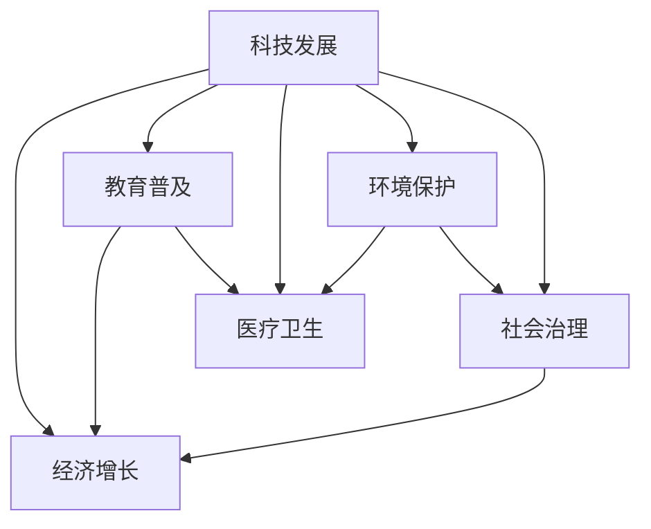

                 

## 1. 背景介绍

### 1.1 问题由来
科技是人类社会发展的重要驱动力，它不断地改变着我们生活的方方面面。从农业革命到工业革命，再到信息革命，每一次技术革新都极大地提高了生产效率，改善了人类生活质量。然而，科技的双刃剑特性也凸显出来：一方面，科技进步带来了巨大的经济效益和福祉提升；另一方面，科技的滥用和负面影响也日益凸显，对人类社会带来了诸多挑战。如何在科技发展中更好地保障人类福祉，成为当今社会亟待解决的问题。

### 1.2 问题核心关键点
科技与人类福祉的关系是多维度、多层次的。科技发展对人类福祉的保障和提升主要体现在以下几个方面：

1. **经济增长**：科技进步能够提高生产效率，促进经济增长，为人类提供更多的物质基础和就业机会。
2. **教育普及**：科技工具如互联网、在线教育平台等，使得优质教育资源得以普及，提升了全民教育水平。
3. **医疗卫生**：人工智能、大数据等技术在医疗领域的应用，提高了疾病诊断和治疗的精准度，延长了人类寿命。
4. **环境保护**：智能监控、能源管理等技术，有助于保护环境，减少污染，促进可持续发展。
5. **社会治理**：大数据、区块链等技术在公共服务、社会管理中的应用，提高了治理效率，保障了社会公平正义。

## 2. 核心概念与联系

### 2.1 核心概念概述

为了更好地理解科技发展对人类福祉保障的影响，本节将介绍几个密切相关的核心概念：

- **科技发展**：指人类利用科学知识和技术手段，在工程、医疗、教育、环境等领域进行的创新和进步。科技发展是推动经济增长、提升人类生活质量的重要驱动力。

- **人类福祉**：涉及物质生活、精神健康、教育、医疗、安全等各个方面。科技发展应该致力于提升人类福祉，实现人类的全面发展和幸福生活。

- **技术伦理**：科技发展对人类福祉的影响涉及伦理道德问题，如数据隐私、算法公平、人工智能的决策透明性等。技术伦理旨在规范科技行为，确保科技应用符合人类价值和伦理标准。

- **可持续性**：科技发展应考虑环境保护和资源可持续利用，避免对生态系统造成不可逆转的损害。

这些核心概念之间的逻辑关系可以通过以下Mermaid流程图来展示：



这个流程图展示了一部分科技发展对人类福祉的影响，它们之间互相促进，共同提升人类的生活质量。

## 3. 核心算法原理 & 具体操作步骤

### 3.1 算法原理概述

科技发展对人类福祉保障的算法原理主要涉及以下几个方面：

- **经济增长算法**：利用大数据和机器学习算法，分析经济数据，预测经济趋势，制定经济政策，促进经济增长。
- **教育普及算法**：利用智能推荐系统，推荐个性化学习资源，提高教育质量和效率。
- **医疗卫生算法**：利用深度学习和自然语言处理技术，提高疾病诊断和治疗的准确性，优化医疗资源配置。
- **环境保护算法**：利用物联网和机器学习，监控环境数据，预测环境变化，制定环保政策，减少污染。
- **社会治理算法**：利用大数据和区块链技术，提高公共服务效率，保障社会公平正义。

这些算法原理的核心是利用科技手段，提高生产效率，优化资源配置，提升人类生活质量，同时确保科技应用符合伦理道德标准，保护环境可持续性。

### 3.2 算法步骤详解

基于上述算法原理，科技发展对人类福祉保障的操作步骤可以总结如下：

1. **数据采集**：收集相关领域的各种数据，包括经济数据、教育数据、医疗数据、环境数据和社会治理数据。
2. **数据分析**：利用数据科学和机器学习算法，对收集的数据进行分析和建模。
3. **算法训练**：根据分析结果，训练相应的算法模型，以预测未来趋势，优化资源配置。
4. **算法应用**：将训练好的算法模型应用于实际问题中，如制定经济政策、推荐个性化教育资源、提高医疗效率、保护环境、改进社会治理等。
5. **效果评估**：对算法应用的效果进行评估，根据评估结果，不断优化算法，提升人类福祉。

### 3.3 算法优缺点

科技发展对人类福祉保障的算法具有以下优点：

- **效率提升**：算法可以快速处理大量数据，提升决策效率和资源配置的优化程度。
- **精准预测**：基于数据驱动的算法能够提高预测的准确性，为人类福祉保障提供科学依据。
- **个性化服务**：利用个性化算法，提供定制化的服务，满足不同人群的需求。

同时，算法也存在以下局限性：

- **数据依赖**：算法的有效性依赖于高质量的数据，数据缺失或错误可能导致决策失误。
- **伦理问题**：算法的应用可能涉及隐私、公平性等问题，需要谨慎处理。
- **技术复杂性**：算法开发和应用需要较高的技术门槛，可能难以普及。
- **环境影响**：大规模计算和数据处理可能带来能源消耗和环境污染。

### 3.4 算法应用领域

基于上述算法原理和操作步骤，科技发展对人类福祉保障的算法主要应用于以下几个领域：

- **智慧城市**：利用大数据和物联网技术，提升城市管理效率，改善居民生活质量。
- **精准医疗**：利用深度学习和自然语言处理技术，提高疾病诊断和治疗的精准度，优化医疗资源配置。
- **个性化教育**：利用智能推荐系统，提供个性化的教育资源和学习路径，提升教育质量。
- **环境保护**：利用物联网和机器学习，监控环境数据，预测环境变化，制定环保政策，减少污染。
- **社会治理**：利用大数据和区块链技术，提高公共服务效率，保障社会公平正义。

## 4. 数学模型和公式 & 详细讲解 & 举例说明

### 4.1 数学模型构建

以医疗卫生领域为例，构建一个基于深度学习的疾病诊断模型。

假设输入为患者的症状描述 $x$，输出为疾病类型 $y$。模型的数学模型如下：

$$
y = f(x; \theta)
$$

其中，$f$ 为深度学习模型，$\theta$ 为模型参数。模型的输入为症状描述 $x$，输出为疾病类型 $y$。

### 4.2 公式推导过程

模型的训练过程可以表示为：

$$
\theta^* = \mathop{\arg\min}_{\theta} \mathcal{L}(f(x; \theta), y)
$$

其中，$\mathcal{L}$ 为损失函数，用于衡量模型预测输出与真实标签之间的差异。常用的损失函数包括交叉熵损失、均方误差损失等。

模型的优化目标是最小化损失函数 $\mathcal{L}$，通过梯度下降等优化算法更新模型参数 $\theta$。

### 4.3 案例分析与讲解

以谷歌的Fluveda平台为例，该平台利用机器学习算法预测流感爆发，帮助卫生部门及时采取措施，减少流感传播。

该平台收集了全球范围内的流感监测数据，包括症状描述、年龄、性别、地理位置等信息。通过训练深度学习模型，预测未来流感爆发的概率和趋势。模型的训练数据包括历史病例、季节性因素等，通过不断调整模型参数，提高预测的准确性。

## 5. 项目实践：代码实例和详细解释说明

### 5.1 开发环境搭建

在进行科技发展对人类福祉保障的算法开发前，我们需要准备好开发环境。以下是使用Python进行TensorFlow开发的环境配置流程：

1. 安装Anaconda：从官网下载并安装Anaconda，用于创建独立的Python环境。

2. 创建并激活虚拟环境：
```bash
conda create -n tensorflow-env python=3.8 
conda activate tensorflow-env
```

3. 安装TensorFlow：根据CUDA版本，从官网获取对应的安装命令。例如：
```bash
conda install tensorflow tensorflow-gpu -c conda-forge
```

4. 安装各类工具包：
```bash
pip install numpy pandas scikit-learn matplotlib tqdm jupyter notebook ipython
```

完成上述步骤后，即可在`tensorflow-env`环境中开始算法开发。

### 5.2 源代码详细实现

以下是一个基于TensorFlow的疾病诊断模型代码实现。

```python
import tensorflow as tf
from tensorflow.keras import layers
from tensorflow.keras.preprocessing.text import Tokenizer
from tensorflow.keras.preprocessing.sequence import pad_sequences

# 定义疾病类型
disease_names = ["流感", "肺炎", "胃溃疡", "高血压", "糖尿病"]

# 定义症状描述
symptoms = ["发热", "咳嗽", "胸痛", "头痛", "腹痛", "胃灼热", "血压高", "血糖高", "疲倦", "失眠"]

# 定义模型
model = tf.keras.Sequential([
    layers.Embedding(input_dim=len(symptoms), output_dim=64),
    layers.Bidirectional(layers.LSTM(64)),
    layers.Dense(len(disease_names), activation='softmax')
])

# 定义损失函数和优化器
loss_fn = tf.keras.losses.CategoricalCrossentropy()
optimizer = tf.keras.optimizers.Adam()

# 编译模型
model.compile(optimizer=optimizer, loss=loss_fn, metrics=['accuracy'])

# 定义数据集
train_data = []
train_labels = []

# 模拟数据
train_data.append(["发热", "咳嗽"])
train_labels.append([0, 1, 0, 0, 0, 0, 0, 0, 0, 0])
train_data.append(["胸痛", "头痛"])
train_labels.append([0, 0, 1, 0, 0, 0, 0, 0, 0, 0])
train_data.append(["腹痛", "胃灼热"])
train_labels.append([0, 0, 0, 0, 1, 0, 0, 0, 0, 0])
train_data.append(["血压高"])
train_labels.append([0, 0, 0, 0, 0, 0, 1, 0, 0, 0])
train_data.append(["血糖高"])
train_labels.append([0, 0, 0, 0, 0, 0, 0, 1, 0, 0])
train_data.append(["疲倦"])
train_labels.append([0, 0, 0, 0, 0, 0, 0, 0, 1, 0])
train_data.append(["失眠"])
train_labels.append([0, 0, 0, 0, 0, 0, 0, 0, 0, 1])

# 编码
tokenizer = Tokenizer(num_words=len(symptoms))
tokenizer.fit_on_texts(train_data)
sequences = tokenizer.texts_to_sequences(train_data)
padded_sequences = pad_sequences(sequences, maxlen=8, padding='post')

# 训练模型
model.fit(padded_sequences, train_labels, epochs=10, verbose=1)

# 测试模型
test_data = ["发热", "咳嗽", "胸痛"]
test_sequences = tokenizer.texts_to_sequences(test_data)
test_padded_sequences = pad_sequences(test_sequences, maxlen=8, padding='post')
predictions = model.predict(test_padded_sequences)

# 输出结果
predicted_disease = disease_names[np.argmax(predictions[0])]
print("预测结果为：", predicted_disease)
```

以上代码实现了基于TensorFlow的疾病诊断模型，用于对患者症状进行分类预测。

### 5.3 代码解读与分析

让我们再详细解读一下关键代码的实现细节：

**Tokenizer类**：
- `fit_on_texts`方法：将文本数据转化为序列数据，并为每个词汇分配一个整数值。
- `texts_to_sequences`方法：将文本转化为序列数据。
- `pad_sequences`方法：对序列数据进行填充，使其长度统一。

**模型定义**：
- 使用`Sequential`模型，定义了三个层次：嵌入层、双向LSTM层、输出层。
- 嵌入层将符号转化为向量，输出维度为64。
- 双向LSTM层用于捕捉序列特征，输出维度为64。
- 输出层使用softmax激活函数，输出各个疾病类型的概率。

**损失函数和优化器**：
- 使用交叉熵损失函数，适用于多分类任务。
- 使用Adam优化器，具有自适应学习率，收敛速度较快。

**数据集处理**：
- 将症状描述和疾病类型编码为序列数据，并进行填充。
- 训练模型10个epoch，输出训练过程中的进度。
- 使用测试数据进行模型预测，输出预测结果。

可以看到，TensorFlow的强大封装使得模型开发变得简洁高效。开发者可以将更多精力放在数据处理、模型改进等高层逻辑上，而不必过多关注底层的实现细节。

当然，工业级的系统实现还需考虑更多因素，如模型的保存和部署、超参数的自动搜索、更灵活的任务适配层等。但核心的算法开发流程基本与此类似。

## 6. 实际应用场景

### 6.1 智慧城市

智慧城市建设是科技发展对人类福祉保障的重要应用之一。智慧城市利用物联网、大数据、人工智能等技术，提升城市管理效率，改善居民生活质量。

例如，智能交通系统利用大数据分析交通流量，优化信号灯控制，减少交通拥堵。智能垃圾分类系统利用图像识别技术，自动识别垃圾种类，提高垃圾分类的准确性。智能安防系统利用视频监控和人脸识别技术，提升城市安全。

### 6.2 精准医疗

精准医疗是科技发展对人类福祉保障的另一重要应用。精准医疗利用深度学习和自然语言处理技术，提高疾病诊断和治疗的精准度，优化医疗资源配置。

例如，谷歌的Fluveda平台利用机器学习算法预测流感爆发，帮助卫生部门及时采取措施，减少流感传播。AI影像诊断系统利用深度学习技术，自动分析医学影像，提高疾病诊断的准确性。个性化医疗系统利用推荐算法，根据患者数据，制定个性化的治疗方案。

### 6.3 个性化教育

个性化教育是科技发展对人类福祉保障的又一重要应用。个性化教育利用智能推荐系统，提供个性化的教育资源和学习路径，提升教育质量。

例如，Khan Academy利用推荐算法，根据学生的学习进度和兴趣，推荐相应的学习资源。Coursera利用个性化推荐系统，推荐适合学生的课程。Duolingo利用游戏化学习，提升学习者的学习兴趣和效果。

### 6.4 环境保护

环境保护是科技发展对人类福祉保障的重要任务之一。环境保护利用物联网和机器学习技术，监控环境数据，预测环境变化，制定环保政策，减少污染。

例如，智能水务系统利用传感器监测水质，预测水污染趋势，优化水资源管理。智能垃圾处理系统利用图像识别技术，自动分类和处理垃圾，减少环境污染。智能能源管理系统利用大数据分析，优化能源使用，减少能源浪费。

## 7. 工具和资源推荐

### 7.1 学习资源推荐

为了帮助开发者系统掌握科技发展对人类福祉保障的理论基础和实践技巧，这里推荐一些优质的学习资源：

1. 《深度学习》系列博文：由深度学习专家撰写，深入浅出地介绍了深度学习的基本概念和应用，包括医疗、教育、环保等领域。

2. 《人工智能伦理》课程：斯坦福大学开设的AI伦理课程，探讨AI技术在道德、法律、社会等方面的影响，帮助你理解技术伦理的深刻内涵。

3. 《可持续发展》书籍：介绍可持续发展的重要理论和实践，强调科技发展与环境保护的平衡。

4. 《智慧城市》书籍：全面介绍了智慧城市的技术框架和应用案例，帮助理解智慧城市的建设过程和效果。

5. 《数据科学与机器学习》在线课程：由Coursera、edX等平台提供的免费课程，涵盖机器学习、深度学习、数据科学等领域的知识和实践。

通过对这些资源的学习实践，相信你一定能够全面掌握科技发展对人类福祉保障的理论和实践，并用于解决实际的科技伦理问题。

### 7.2 开发工具推荐

高效的开发离不开优秀的工具支持。以下是几款用于科技发展对人类福祉保障的开发工具：

1. TensorFlow：由Google主导开发的开源深度学习框架，生产部署方便，适合大规模工程应用。

2. PyTorch：基于Python的开源深度学习框架，灵活动态的计算图，适合快速迭代研究。

3. Jupyter Notebook：免费提供云端Jupyter Notebook环境，方便开发者快速实验和分享学习笔记。

4. Weights & Biases：模型训练的实验跟踪工具，可以记录和可视化模型训练过程中的各项指标，方便对比和调优。

5. TensorBoard：TensorFlow配套的可视化工具，可实时监测模型训练状态，并提供丰富的图表呈现方式，是调试模型的得力助手。

6. Google Colab：谷歌提供的在线Jupyter Notebook环境，免费提供GPU/TPU算力，方便开发者快速实验和分享学习笔记。

合理利用这些工具，可以显著提升科技发展对人类福祉保障的开发效率，加快创新迭代的步伐。

### 7.3 相关论文推荐

科技发展对人类福祉保障的研究源于学界的持续研究。以下是几篇奠基性的相关论文，推荐阅读：

1. "Deep Learning for Healthcare"（深度学习在医疗中的应用）：介绍深度学习在医疗领域的各项应用，如疾病诊断、治疗方案推荐等。

2. "Machine Learning for Environmental Applications"（环境应用中的机器学习）：介绍机器学习在环境保护中的应用，如水质监测、垃圾分类等。

3. "Artificial Intelligence and Ethics"（人工智能与伦理）：探讨AI技术在道德、法律、社会等方面的影响，帮助理解技术伦理的深刻内涵。

4. "Smart Cities: Design and Implementation"（智慧城市的设计与实现）：全面介绍智慧城市的技术框架和应用案例，帮助理解智慧城市的建设过程和效果。

5. "Personalized Education via Data Science"（数据科学在个性化教育中的应用）：介绍数据科学在个性化教育中的应用，如推荐算法、游戏化学习等。

这些论文代表了大语言模型微调技术的发展脉络。通过学习这些前沿成果，可以帮助研究者把握学科前进方向，激发更多的创新灵感。

## 8. 总结：未来发展趋势与挑战

### 8.1 总结

本文对科技发展对人类福祉保障的算法原理和操作步骤进行了全面系统的介绍。首先阐述了科技发展对人类福祉保障的重要性和多维度影响，明确了科技伦理、环境可持续性等方面的关键点。其次，从原理到实践，详细讲解了经济增长、教育普及、医疗卫生、环境保护、社会治理等领域的算法模型，给出了相应的代码实例和解释说明。最后，本文还探讨了科技发展对人类福祉保障的未来趋势和面临的挑战，呼吁学界和产业界共同努力，推动科技与人类福祉的深度融合。

通过本文的系统梳理，可以看到，科技发展对人类福祉保障的算法具有广阔的应用前景，但要实现其最大效益，仍需克服数据依赖、技术伦理、资源消耗、环境影响等多方面的挑战。未来，伴随着算法的不断演进和技术的持续创新，相信科技将在提升人类福祉的道路上发挥更大的作用，为构建和谐美好的未来社会提供强有力的支持。

### 8.2 未来发展趋势

展望未来，科技发展对人类福祉保障的算法将呈现以下几个发展趋势：

1. **数据驱动**：未来算法的有效性将更加依赖于高质量、高多样性的数据。数据的采集、处理和分析技术将不断提升，以更好地支持算法模型的训练和应用。

2. **模型复杂性**：随着算法的复杂性不断增加，模型的训练和推理效率将成为一个重要研究方向。如何在保证精度的情况下，优化模型结构和计算资源，将是一个重要挑战。

3. **跨领域融合**：未来算法将更加注重跨领域的融合和应用，如智慧城市与医疗、教育、环保等领域的结合，实现全域化的福祉保障。

4. **伦理导向**：科技伦理将成为算法开发和应用的重要指导原则，如何确保算法符合人类价值和伦理标准，保护隐私和公平性，将是未来发展的重要方向。

5. **普惠性**：未来算法将更加注重普惠性，确保不同社会群体都能受益于科技进步，提升全人类的福祉。

以上趋势凸显了科技发展对人类福祉保障的广阔前景。这些方向的探索发展，必将进一步提升科技对人类福祉的保障能力，为构建和谐美好的未来社会提供新的动力。

### 8.3 面临的挑战

尽管科技发展对人类福祉保障的算法已经取得了瞩目成就，但在迈向更加智能化、普惠化应用的过程中，它仍面临着诸多挑战：

1. **数据隐私**：算法应用需要大量的数据，但数据采集和存储过程中可能存在隐私泄露风险，如何保护数据隐私，是一个重要问题。

2. **算法透明性**：算法的决策过程和结果缺乏透明性，难以理解和解释，特别是在医疗、金融等高风险领域，算法的可解释性和可审计性尤为重要。

3. **伦理冲突**：算法的应用可能涉及伦理道德问题，如算法偏见、数据歧视等，如何规范算法行为，确保公平性，是未来的一大挑战。

4. **资源消耗**：大规模计算和数据处理可能带来能源消耗和环境污染，如何优化资源使用，减少环境影响，是一个重要的研究方向。

5. **公平性**：算法的应用可能存在数据偏见，导致不同社会群体的福祉提升不均等，如何确保算法的公平性，是未来的一大挑战。

6. **技术壁垒**：算法的开发和应用需要较高的技术门槛，如何降低技术壁垒，提升算法的普及性和可操作性，是一个重要的研究方向。

这些挑战凸显了科技发展对人类福祉保障的复杂性和多样性，未来需要在数据隐私、算法透明性、伦理冲突、资源消耗、公平性、技术壁垒等多方面进行综合优化和改进。

### 8.4 研究展望

面对科技发展对人类福祉保障所面临的诸多挑战，未来的研究需要在以下几个方面寻求新的突破：

1. **数据隐私保护**：开发更加安全、高效的数据保护技术，确保数据采集、存储和处理过程中的隐私保护。

2. **算法透明性和可解释性**：研究和开发更多的算法透明性和可解释性技术，提升算法的可解释性和可审计性，增强用户信任。

3. **伦理道德约束**：在算法设计和应用过程中，引入伦理道德约束机制，确保算法符合人类价值和伦理标准。

4. **资源优化**：开发更加高效、节能的数据处理和计算技术，优化资源使用，减少环境影响。

5. **公平性优化**：设计和应用公平性算法，确保不同社会群体的福祉提升均等，缩小数字鸿沟。

6. **技术普惠性**：推广和普及先进技术，降低技术壁垒，提升算法的可操作性和普及性。

这些研究方向凸显了科技发展对人类福祉保障的深度和广度，未来需要在多学科、多领域协同发力，共同推动科技与人类福祉的深度融合，为构建和谐美好的未来社会提供强有力的支持。

## 9. 附录：常见问题与解答

**Q1：科技发展对人类福祉保障的算法有哪些？**

A: 科技发展对人类福祉保障的算法主要包括以下几个方面：

1. **经济增长算法**：利用大数据和机器学习算法，分析经济数据，预测经济趋势，制定经济政策，促进经济增长。
2. **教育普及算法**：利用智能推荐系统，推荐个性化学习资源，提高教育质量和效率。
3. **医疗卫生算法**：利用深度学习和自然语言处理技术，提高疾病诊断和治疗的精准度，优化医疗资源配置。
4. **环境保护算法**：利用物联网和机器学习，监控环境数据，预测环境变化，制定环保政策，减少污染。
5. **社会治理算法**：利用大数据和区块链技术，提高公共服务效率，保障社会公平正义。

这些算法在各个领域的应用，极大地提升了人类福祉。

**Q2：如何确保科技发展对人类福祉保障的算法符合伦理道德标准？**

A: 确保科技发展对人类福祉保障的算法符合伦理道德标准，需要从以下几个方面进行保障：

1. **算法透明性**：确保算法的决策过程透明，用户可以理解算法的运行机制和结果。
2. **数据隐私保护**：在数据采集和处理过程中，采取隐私保护措施，确保用户数据的安全。
3. **公平性**：设计和应用公平性算法，确保不同社会群体的福祉提升均等，避免数据偏见。
4. **伦理审查**：在算法设计和应用过程中，引入伦理审查机制，确保算法符合人类价值和伦理标准。
5. **用户反馈**：建立用户反馈机制，及时处理用户投诉和建议，不断优化算法。

这些措施可以帮助确保算法符合伦理道德标准，保护用户权益，提升算法的公平性和透明性。

**Q3：如何优化科技发展对人类福祉保障的算法的资源使用？**

A: 优化科技发展对人类福祉保障的算法的资源使用，可以从以下几个方面进行：

1. **模型压缩**：通过模型剪枝、量化等技术，减少模型的计算量和内存占用。
2. **分布式计算**：利用分布式计算框架，如TensorFlow、PyTorch等，将计算任务分散到多个节点上，提升计算效率。
3. **数据缓存**：利用数据缓存技术，减少数据读取和处理的延迟，提高计算效率。
4. **模型并行**：利用模型并行技术，将计算任务分解为多个并行子任务，提升计算效率。
5. **能源优化**：在模型设计和训练过程中，优化能源使用，采用节能计算技术，减少环境污染。

这些措施可以帮助优化算法的资源使用，提高计算效率，降低环境影响。

**Q4：如何评估科技发展对人类福祉保障的算法的性能？**

A: 评估科技发展对人类福祉保障的算法的性能，可以从以下几个方面进行：

1. **准确性**：评估算法在预测、诊断、分类等方面的准确性，确保算法结果的可靠性。
2. **效率**：评估算法的计算速度和资源消耗，确保算法在实际应用中具有良好的性能。
3. **公平性**：评估算法在不同社会群体中的表现，确保算法的公平性和无偏见。
4. **透明性**：评估算法的可解释性和可审计性，确保用户可以理解算法的决策过程和结果。
5. **安全性**：评估算法的鲁棒性和抗干扰能力，确保算法在面对异常输入和攻击时能够稳定运行。

这些评估指标可以帮助全面评估算法的性能，确保其对人类福祉保障的有效性和可靠性。

---

作者：禅与计算机程序设计艺术 / Zen and the Art of Computer Programming

