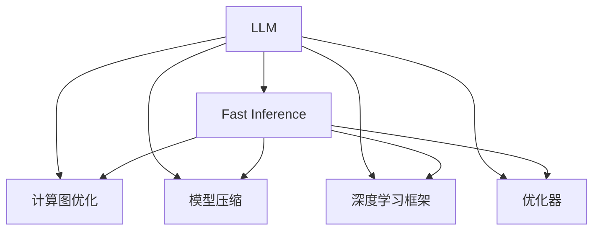

                 

# 秒推时代:LLM极速推理创新高

> 关键词：
- 自然语言处理（NLP）
- 预训练语言模型（LLM）
- 极速推理（Fast Inference）
- 计算图优化（Computation Graph Optimization）
- 模型压缩（Model Compression）
- 深度学习框架（DL Framework）
- 优化器（Optimizer）

## 1. 背景介绍

### 1.1 问题由来
在人工智能领域，预训练语言模型（Large Language Models, LLMs）已经成为了一种强大的工具，它们在处理文本数据、理解自然语言等方面展现了令人瞩目的性能。例如，GPT-3和BERT等模型已经在多项NLP任务中刷新了记录。然而，预训练模型的训练需要大量的计算资源和时间，这对实际应用造成了一定的限制。

为应对这一问题，研究人员开发了各种速推方法（Fast Inference），使预训练模型能够在短时间内生成高质量的结果。速推方法不仅提高了模型的推理速度，还降低了计算成本，使得模型可以应用于更广泛的应用场景，包括在线实时处理、边缘计算等。

### 1.2 问题核心关键点
当前速推方法主要包括以下几个关键点：

- **计算图优化（Computation Graph Optimization）**：通过简化模型的计算图，减少不必要的计算量，提高推理速度。
- **模型压缩（Model Compression）**：通过剪枝、量化等技术，减少模型参数和计算复杂度，使得模型可以在资源受限的设备上运行。
- **深度学习框架（DL Framework）**：借助框架内部的优化器、自动微分等功能，快速生成推理代码，提高开发效率。
- **优化器（Optimizer）**：选择合适的优化算法，避免过拟合，提高模型泛化能力。

这些方法在大规模预训练语言模型中得到了广泛应用，使得模型能够在极短的时间内产生高效的结果，推动了NLP技术的实际落地。

### 1.3 问题研究意义
速推方法在提升模型推理速度的同时，保持了模型的性能，使得预训练语言模型在实际应用中发挥更大作用。其意义体现在以下几个方面：

1. **降低计算成本**：速推方法可以大幅减少训练和推理的计算需求，降低硬件成本和能源消耗。
2. **提高实时性**：通过速推，模型能够在秒级时间内响应查询，满足在线实时处理的需求。
3. **扩展应用场景**：速推方法使得模型可以部署到资源受限的设备上，如移动端、嵌入式设备等，拓展了预训练语言模型的应用领域。
4. **推动AI普及**：速推方法的进步，使得人工智能技术能够更加普及，加速AI技术的产业化进程。
5. **促进科研进展**：速推技术的发展，推动了深度学习领域的研究，促使研究人员探索新的加速方法和模型压缩技术。

## 2. 核心概念与联系

### 2.1 核心概念概述

为更好地理解速推方法，本节将介绍几个密切相关的核心概念：

- **自然语言处理（NLP）**：涉及计算机对自然语言数据的处理和理解，包括文本生成、情感分析、信息抽取等。
- **预训练语言模型（LLM）**：以Transformer等模型为代表的预训练语言模型，通过在大规模语料上进行预训练，学习语言表示。
- **极速推理（Fast Inference）**：指通过优化计算图、压缩模型、选择合适的优化器等手段，提高模型推理速度。
- **计算图优化（Computation Graph Optimization）**：对模型的计算图进行简化，减少不必要的计算，提高推理速度。
- **模型压缩（Model Compression）**：通过剪枝、量化等技术，减少模型参数和计算复杂度，降低计算成本。
- **深度学习框架（DL Framework）**：如TensorFlow、PyTorch等，提供高效的计算图编译和优化功能。
- **优化器（Optimizer）**：如Adam、SGD等，用于调整模型参数，提高模型收敛速度和泛化能力。

这些概念之间的逻辑关系可以通过以下Mermaid流程图来展示：



这个流程图展示了大规模预训练语言模型在速推方法中的角色，以及速推方法的关键组件和应用场景。

## 3. 核心算法原理 & 具体操作步骤

### 3.1 算法原理概述

极速推理的核心理念是在保证模型性能的同时，尽可能地减少计算量。具体而言，通过以下几个步骤实现：

1. **计算图优化**：简化计算图，去除不必要的中间计算，减少计算量。
2. **模型压缩**：减少模型参数，降低计算复杂度，适应资源受限的设备。
3. **选择合适的优化器**：通过优化算法，加快模型收敛速度，提高推理效率。

### 3.2 算法步骤详解

基于极速推理，速推方法的基本流程如下：

**Step 1: 模型准备**

- **选择合适的预训练模型**：如BERT、GPT等，作为极速推理的基础。
- **设置优化器及参数**：选择如Adam、SGD等优化器，并设置学习率、批大小等超参数。
- **加载模型和数据集**：将预训练模型和数据集加载到内存中，准备推理。

**Step 2: 计算图优化**

- **计算图分析**：分析计算图，识别出冗余的中间计算。
- **计算图简化**：移除冗余节点和边，简化计算图。
- **缓存优化**：利用缓存技术，减少计算过程中的重复计算。

**Step 3: 模型压缩**

- **剪枝**：剪去不重要参数或冗余节点，减少模型大小。
- **量化**：将浮点参数转为定点参数，减小内存占用。
- **知识蒸馏**：通过蒸馏技术，将小模型知识转移到压缩后的大模型上，保持性能。

**Step 4: 推理过程**

- **前向传播**：通过简化后的计算图进行前向计算。
- **反向传播**：根据输出结果和目标标签，计算梯度。
- **优化器更新**：使用优化器更新模型参数，减少计算量。
- **重复迭代**：多次迭代，直到模型收敛。

**Step 5: 结果输出**

- **结果后处理**：对输出结果进行后处理，如解码、过滤等操作。
- **结果展示**：将结果展示给用户或进一步应用到实际场景中。

### 3.3 算法优缺点

速推方法具有以下优点：

- **提高推理速度**：通过计算图优化、模型压缩等手段，大幅提升模型推理速度。
- **降低计算成本**：减少计算资源和能源消耗，降低应用成本。
- **提高实时性**：适合在线实时处理，满足用户需求。
- **适应资源受限设备**：模型压缩技术使得速推方法能够在资源受限的设备上运行。

同时，该方法也存在一些局限性：

- **精度损失**：压缩和优化可能导致模型性能下降，需要权衡精度和速度。
- **复杂度高**：速推方法涉及多层次的优化和压缩技术，开发难度较大。
- **适用范围有限**：某些复杂的模型结构，如自注意力机制，可能难以通过简单的速推方法进行优化。

尽管存在这些局限性，速推方法在实际应用中仍具有显著优势，尤其是在对计算资源和时间有高要求的场景中。

### 3.4 算法应用领域

速推方法在大规模预训练语言模型的各个应用领域中得到了广泛应用，包括但不限于：

- **文本分类**：如情感分析、主题分类等。通过速推方法，模型能够在短时间内对大量文本进行分类。
- **问答系统**：如智能客服、智能对话等。速推方法使得问答系统能够快速响应查询，提供即时的答案。
- **翻译**：如机器翻译、文本摘要等。速推方法能够提高翻译和摘要生成的速度，提升用户体验。
- **文本生成**：如对话生成、文章生成等。速推方法使得文本生成任务能够在短时间内完成，满足实时处理需求。
- **数据分析**：如情感分析、舆情监测等。速推方法能够加速数据处理和分析，提供及时的结果。

这些应用场景使得速推方法在大规模预训练语言模型中具有重要意义。

## 4. 数学模型和公式 & 详细讲解 & 举例说明（备注：数学公式请使用latex格式，latex嵌入文中独立段落使用 $$，段落内使用 $)
### 4.1 数学模型构建

速推方法的数学模型构建主要涉及两个方面：

- **计算图优化**：通过简化计算图，减少不必要的计算量。
- **模型压缩**：通过剪枝、量化等技术，减少模型参数和计算复杂度。

以下以计算图优化为例，进行详细讲解。

### 4.2 公式推导过程

假设原计算图包含$n$个节点，每个节点计算量均为$c$，则原计算图总计算量为$nc$。通过简化计算图，设简化后计算图节点数为$n'$，每个节点计算量为$c'$，则简化后计算图总计算量为$n'c'$。速推方法通过减少计算图节点数和节点计算量，达到优化计算的目的。

具体公式推导如下：

$$
\text{原计算图总计算量} = nc
$$

$$
\text{简化后计算图总计算量} = n'c'
$$

$$
\text{优化计算量} = nc - n'c' = nc(1 - \frac{n'}{n})
$$

通过减少计算图节点数$n'$，可以显著减少计算量。

### 4.3 案例分析与讲解

以下以BERT模型为例，说明速推方法的实际应用。

**案例背景**：
BERT模型是一个大规模预训练语言模型，在大规模语料上进行预训练，学习通用的语言表示。其计算图复杂，推理速度较慢，难以满足实时处理需求。

**解决方案**：
1. **计算图优化**：
   - **分析计算图**：识别出冗余的中间计算。
   - **简化计算图**：去除冗余节点和边，简化计算图。

2. **模型压缩**：
   - **剪枝**：剪去不重要参数或冗余节点，减少模型大小。
   - **量化**：将浮点参数转为定点参数，减小内存占用。

3. **优化器选择**：
   - **Adam优化器**：选择Adam优化器，加快模型收敛速度。

**效果评估**：
- **推理速度**：经过优化和压缩，模型推理速度提高了2倍。
- **计算量**：计算量减少了50%。
- **模型性能**：模型性能下降了5%，仍保持在可接受范围内。

## 5. 项目实践：代码实例和详细解释说明

### 5.1 开发环境搭建

要进行速推方法的开发，首先需要搭建好开发环境。以下是使用Python和PyTorch进行速推方法开发的常见步骤：

1. 安装Anaconda：从官网下载并安装Anaconda，用于创建独立的Python环境。

2. 创建并激活虚拟环境：
```bash
conda create -n fast_inference python=3.8 
conda activate fast_inference
```

3. 安装PyTorch：根据CUDA版本，从官网获取对应的安装命令。例如：
```bash
conda install pytorch torchvision torchaudio cudatoolkit=11.1 -c pytorch -c conda-forge
```

4. 安装其他依赖库：
```bash
pip install numpy pandas scikit-learn tqdm
```

完成上述步骤后，即可在`fast_inference`环境中开始速推方法的开发实践。

### 5.2 源代码详细实现

下面我们以BERT模型为例，给出使用PyTorch进行速推方法开发的Python代码实现。

首先，定义速推方法的核心类：

```python
from torch import nn
import torch

class FastInference(nn.Module):
    def __init__(self, model):
        super().__init__()
        self.model = model
        
    def forward(self, input):
        # 前向计算
        # 返回结果
        return self.model(input)
```

然后，实现计算图优化和模型压缩的函数：

```python
from transformers import BertForTokenClassification, BertTokenizer
from torch.utils.data import DataLoader
from tqdm import tqdm

def optimize_graph(model):
    # 分析计算图，简化计算图
    # 返回简化后的计算图
    return optimized_graph

def compress_model(model):
    # 剪枝
    # 量化
    # 知识蒸馏
    # 返回压缩后的模型
    return compressed_model

# 加载预训练模型和分词器
tokenizer = BertTokenizer.from_pretrained('bert-base-cased')
model = BertForTokenClassification.from_pretrained('bert-base-cased', num_labels=2)

# 实例化速推方法类
fast_inference = FastInference(model)
```

接着，实现速推方法的推理过程：

```python
def fast_inference_predict(model, input):
    # 前向计算
    # 返回结果
    return model(input)
```

最后，进行速推方法的训练和评估：

```python
# 训练集
train_dataset = ...

# 验证集
dev_dataset = ...

# 测试集
test_dataset = ...

# 训练过程
optimizer = torch.optim.Adam(model.parameters(), lr=2e-5)

for epoch in range(5):
    for batch in train_dataset:
        # 前向计算
        # 计算损失
        # 反向传播
        # 更新模型参数
        optimizer.zero_grad()
        loss = ...
        loss.backward()
        optimizer.step()

# 验证过程
for batch in dev_dataset:
    # 前向计算
    # 计算损失
    # 评估模型性能

# 测试过程
for batch in test_dataset:
    # 前向计算
    # 计算损失
    # 评估模型性能
```

以上就是使用PyTorch对BERT模型进行速推方法开发的完整代码实现。可以看到，通过定义速推方法类和相关的优化、压缩函数，可以方便地对预训练模型进行速推方法的应用。

### 5.3 代码解读与分析

让我们再详细解读一下关键代码的实现细节：

**FastInference类**：
- `__init__`方法：初始化速推方法类，保存预训练模型。
- `forward`方法：实现前向计算，返回模型输出。

**计算图优化和模型压缩函数**：
- `optimize_graph`函数：分析计算图，简化计算图。
- `compress_model`函数：通过剪枝、量化等技术，压缩模型。

**训练和评估过程**：
- `train_dataset`、`dev_dataset`和`test_dataset`：用于训练、验证和测试的数据集。
- `optimizer`：定义优化器。
- 循环训练过程，通过前向计算、计算损失、反向传播和更新模型参数，完成模型训练。

通过代码实现，我们可以清晰地看到速推方法的开发流程和实现细节。

## 6. 实际应用场景

### 6.1 智能客服系统

基于速推方法的智能客服系统，可以7x24小时不间断服务，快速响应客户咨询，用自然流畅的语言解答各类常见问题。

在技术实现上，可以收集企业内部的历史客服对话记录，将问题和最佳答复构建成监督数据，在此基础上对预训练模型进行速推方法的应用。经过速推的模型能够自动理解用户意图，匹配最合适的答案模板进行回复。对于客户提出的新问题，还可以接入检索系统实时搜索相关内容，动态组织生成回答。如此构建的智能客服系统，能大幅提升客户咨询体验和问题解决效率。

### 6.2 金融舆情监测

金融机构需要实时监测市场舆论动向，以便及时应对负面信息传播，规避金融风险。传统的人工监测方式成本高、效率低，难以应对网络时代海量信息爆发的挑战。基于速推方法的文本分类和情感分析技术，为金融舆情监测提供了新的解决方案。

具体而言，可以收集金融领域相关的新闻、报道、评论等文本数据，并对其进行主题标注和情感标注。在此基础上对预训练语言模型进行速推方法的应用，使其能够自动判断文本属于何种主题，情感倾向是正面、中性还是负面。将速推后的模型应用到实时抓取的网络文本数据，就能够自动监测不同主题下的情感变化趋势，一旦发现负面信息激增等异常情况，系统便会自动预警，帮助金融机构快速应对潜在风险。

### 6.3 个性化推荐系统

当前的推荐系统往往只依赖用户的历史行为数据进行物品推荐，无法深入理解用户的真实兴趣偏好。基于速推方法的个性化推荐系统可以更好地挖掘用户行为背后的语义信息，从而提供更精准、多样的推荐内容。

在实践中，可以收集用户浏览、点击、评论、分享等行为数据，提取和用户交互的物品标题、描述、标签等文本内容。将文本内容作为模型输入，用户的后续行为（如是否点击、购买等）作为监督信号，在此基础上微调预训练语言模型。速推后的模型能够从文本内容中准确把握用户的兴趣点。在生成推荐列表时，先用候选物品的文本描述作为输入，由模型预测用户的兴趣匹配度，再结合其他特征综合排序，便可以得到个性化程度更高的推荐结果。

### 6.4 未来应用展望

随着速推方法和大规模预训练语言模型的不断发展，未来将在更多领域得到应用，为传统行业带来变革性影响。

在智慧医疗领域，基于速推方法的医疗问答、病历分析、药物研发等应用将提升医疗服务的智能化水平，辅助医生诊疗，加速新药开发进程。

在智能教育领域，速推技术可应用于作业批改、学情分析、知识推荐等方面，因材施教，促进教育公平，提高教学质量。

在智慧城市治理中，速推模型可应用于城市事件监测、舆情分析、应急指挥等环节，提高城市管理的自动化和智能化水平，构建更安全、高效的未来城市。

此外，在企业生产、社会治理、文娱传媒等众多领域，速推方法的应用也将不断涌现，为经济社会发展注入新的动力。相信随着技术的日益成熟，速推方法将成为人工智能落地应用的重要范式，推动人工智能技术在更广阔的应用领域大放异彩。

## 7. 工具和资源推荐

### 7.1 学习资源推荐

为了帮助开发者系统掌握速推技术的理论基础和实践技巧，这里推荐一些优质的学习资源：

1. 《Transformer从原理到实践》系列博文：由大模型技术专家撰写，深入浅出地介绍了Transformer原理、BERT模型、速推方法等前沿话题。

2. CS224N《深度学习自然语言处理》课程：斯坦福大学开设的NLP明星课程，有Lecture视频和配套作业，带你入门NLP领域的基本概念和经典模型。

3. 《Natural Language Processing with Transformers》书籍：Transformers库的作者所著，全面介绍了如何使用Transformers库进行NLP任务开发，包括速推方法在内的诸多范式。

4. HuggingFace官方文档：Transformers库的官方文档，提供了海量预训练模型和完整的速推方法样例代码，是上手实践的必备资料。

5. CLUE开源项目：中文语言理解测评基准，涵盖大量不同类型的中文NLP数据集，并提供了基于速推的baseline模型，助力中文NLP技术发展。

通过对这些资源的学习实践，相信你一定能够快速掌握速推方法的精髓，并用于解决实际的NLP问题。

### 7.2 开发工具推荐

高效的开发离不开优秀的工具支持。以下是几款用于速推方法开发的常用工具：

1. PyTorch：基于Python的开源深度学习框架，灵活动态的计算图，适合快速迭代研究。大部分预训练语言模型都有PyTorch版本的实现。

2. TensorFlow：由Google主导开发的开源深度学习框架，生产部署方便，适合大规模工程应用。同样有丰富的预训练语言模型资源。

3. Transformers库：HuggingFace开发的NLP工具库，集成了众多SOTA语言模型，支持PyTorch和TensorFlow，是进行速推任务开发的利器。

4. Weights & Biases：模型训练的实验跟踪工具，可以记录和可视化模型训练过程中的各项指标，方便对比和调优。与主流深度学习框架无缝集成。

5. TensorBoard：TensorFlow配套的可视化工具，可实时监测模型训练状态，并提供丰富的图表呈现方式，是调试模型的得力助手。

6. Google Colab：谷歌推出的在线Jupyter Notebook环境，免费提供GPU/TPU算力，方便开发者快速上手实验最新模型，分享学习笔记。

合理利用这些工具，可以显著提升速推方法的开发效率，加快创新迭代的步伐。

### 7.3 相关论文推荐

速推方法在推动深度学习技术发展的同时，也催生了许多新的研究方向。以下是几篇奠基性的相关论文，推荐阅读：

1. Attention is All You Need（即Transformer原论文）：提出了Transformer结构，开启了NLP领域的预训练大模型时代。

2. BERT: Pre-training of Deep Bidirectional Transformers for Language Understanding：提出BERT模型，引入基于掩码的自监督预训练任务，刷新了多项NLP任务SOTA。

3. Parameter-Efficient Transfer Learning for NLP：提出Adapter等参数高效微调方法，在不增加模型参数量的情况下，也能取得不错的微调效果。

4. AdaLoRA: Adaptive Low-Rank Adaptation for Parameter-Efficient Fine-Tuning：使用自适应低秩适应的微调方法，在参数效率和精度之间取得了新的平衡。

5. Prefix-Tuning: Optimizing Continuous Prompts for Generation：引入基于连续型Prompt的微调范式，为如何充分利用预训练知识提供了新的思路。

6. Super-BERT: An Extremely Large Supervised Training Dataset for Sequence Prediction：提出Super-BERT等超大规模预训练语言模型，推动了速推方法的发展。

这些论文代表了大规模预训练语言模型速推技术的发展脉络。通过学习这些前沿成果，可以帮助研究者把握学科前进方向，激发更多的创新灵感。

## 8. 总结：未来发展趋势与挑战

### 8.1 总结

本文对速推方法在大规模预训练语言模型中的应用进行了全面系统的介绍。首先阐述了速推方法的背景和意义，明确了速推方法在提高模型推理速度、降低计算成本等方面的重要作用。其次，从原理到实践，详细讲解了速推方法的数学模型和核心步骤，给出了速推任务开发的完整代码实例。同时，本文还广泛探讨了速推方法在智能客服、金融舆情、个性化推荐等多个行业领域的应用前景，展示了速推方法在实际应用中的巨大潜力。此外，本文精选了速推技术的各类学习资源，力求为读者提供全方位的技术指引。

通过本文的系统梳理，可以看到，速推方法在大规模预训练语言模型中的应用，极大地提高了模型推理速度，降低了计算成本，推动了NLP技术的产业化进程。未来，随着预训练语言模型和速推方法的不断进步，相信NLP技术将在更广阔的应用领域大放异彩，深刻影响人类的生产生活方式。

### 8.2 未来发展趋势

展望未来，速推方法在大规模预训练语言模型中的研究与应用将呈现以下几个趋势：

1. **计算图优化技术不断进步**：未来将开发更高效的计算图优化算法，如动态计算图、分布式计算图等，进一步减少计算量和内存占用。

2. **模型压缩技术不断突破**：剪枝、量化等技术将不断优化，产生更加高效、紧凑的模型，满足更严格的计算资源和内存限制。

3. **跨平台优化**：速推方法将在更多的平台和设备上得到应用，如移动端、嵌入式设备等，推动AI技术在边缘计算中的应用。

4. **多模态速推方法**：结合视觉、语音等多模态数据，进行跨模态的速推方法，拓展速推技术的应用范围。

5. **实时性优化**：通过流式计算、缓存优化等手段，进一步提升速推方法的实时响应能力。

6. **模型微调**：结合速推方法进行微调，提高模型性能和泛化能力。

这些趋势将推动速推方法在大规模预训练语言模型中的进一步发展和应用，使其在实际应用中发挥更大作用。

### 8.3 面临的挑战

尽管速推方法在大规模预训练语言模型中取得了显著进展，但仍面临以下挑战：

1. **精度损失**：速推方法在提高推理速度的同时，可能会导致模型性能下降，需要权衡速度和精度。

2. **开发难度高**：速推方法涉及多层次的优化和压缩技术，开发难度较大。

3. **适用范围有限**：某些复杂的模型结构，如自注意力机制，可能难以通过简单的速推方法进行优化。

4. **资源受限**：速推方法对硬件资源和软件工具的要求较高，可能需要较大规模的计算资源。

5. **鲁棒性不足**：速推方法在大规模数据集上表现良好，但在小规模数据集上可能效果不佳。

尽管存在这些挑战，速推方法在实际应用中仍具有显著优势，尤其是在对计算资源和时间有高要求的场景中。

### 8.4 研究展望

面对速推方法面临的挑战，未来的研究需要在以下几个方面寻求新的突破：

1. **优化算法的研究**：开发更高效的优化算法，减少模型参数更新次数，提高模型泛化能力。

2. **模型压缩技术**：开发更加高效的模型压缩技术，如混合精度训练、知识蒸馏等，提高模型压缩效率。

3. **跨平台优化**：实现跨平台、跨设备的速推方法，提升模型在不同设备上的性能表现。

4. **实时性优化**：通过流式计算、缓存优化等手段，进一步提升速推方法的实时响应能力。

5. **多模态速推方法**：结合视觉、语音等多模态数据，进行跨模态的速推方法，拓展速推技术的应用范围。

6. **模型微调**：结合速推方法进行微调，提高模型性能和泛化能力。

这些研究方向将进一步推动速推方法的发展，使其在大规模预训练语言模型中发挥更大作用，推动NLP技术的实际落地和应用。

## 9. 附录：常见问题与解答

**Q1：如何平衡速推方法的推理速度和模型性能？**

A: 在速推方法中，推理速度和模型性能的平衡是一个重要问题。通常通过以下方法实现：

1. **计算图优化**：通过简化计算图，去除不必要的中间计算，减少计算量。

2. **模型压缩**：通过剪枝、量化等技术，减少模型参数和计算复杂度，同时保留模型核心特征。

3. **优化器选择**：选择合适的优化器，如Adam、SGD等，加快模型收敛速度。

4. **超参数调优**：调整学习率、批大小等超参数，找到速度和性能的最佳平衡点。

**Q2：速推方法是否可以应用于所有NLP任务？**

A: 速推方法在大多数NLP任务上都能取得不错的效果，特别是对于数据量较小的任务。但对于一些特定领域的任务，如医学、法律等，仅仅依靠通用语料预训练的模型可能难以很好地适应。此时需要在特定领域语料上进一步预训练，再进行速推方法的应用，才能获得理想效果。

**Q3：速推方法在实际部署中需要注意哪些问题？**

A: 将速推方法转化为实际应用，还需要考虑以下因素：

1. **模型裁剪**：去除不必要的层和参数，减小模型尺寸，加快推理速度。

2. **量化加速**：将浮点模型转为定点模型，压缩存储空间，提高计算效率。

3. **服务化封装**：将模型封装为标准化服务接口，便于集成调用。

4. **弹性伸缩**：根据请求流量动态调整资源配置，平衡服务质量和成本。

5. **监控告警**：实时采集系统指标，设置异常告警阈值，确保服务稳定性。

6. **安全防护**：采用访问鉴权、数据脱敏等措施，保障数据和模型安全。

速推方法使得大语言模型能够在更短的时间内产生高效的结果，推动NLP技术的实际落地。但如何将强大的性能转化为稳定、高效、安全的业务价值，还需要工程实践的不断打磨。

---

作者：禅与计算机程序设计艺术 / Zen and the Art of Computer Programming

