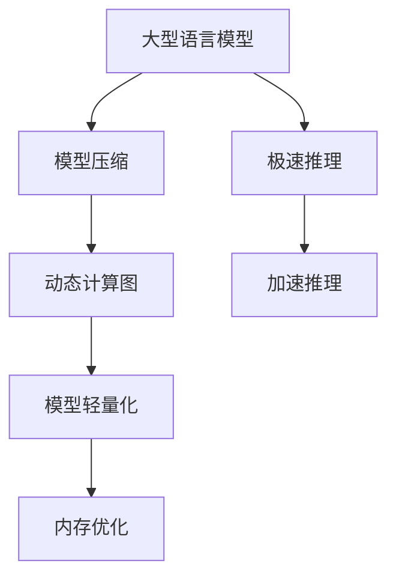

                 

# 秒推时代:LLM极速推理带来的新机遇

> 关键词：极速推理, 语言模型, 大模型, 模型压缩, 动态模型, 模型轻量化

## 1. 背景介绍

### 1.1 问题由来

在人工智能领域，尤其是自然语言处理(NLP)领域，语言模型(LLMs)如BERT、GPT-3等取得了举世瞩目的成就。这些模型以其强大的语言理解能力和生成能力，推动了NLP技术的前进。然而，这些大型预训练模型往往参数众多，推理速度慢，难以实时响应大规模任务需求。为了解决这一问题，极速推理技术应运而生。

极速推理(Instant Inference)技术旨在通过模型压缩、动态模型、模型轻量化等手段，显著提升大型语言模型的推理速度，使之能够适应实际应用中的快速响应需求。此技术的应用将彻底改变大型语言模型在高性能计算、实时决策等场景中的应用方式。

### 1.2 问题核心关键点

极速推理技术的关键在于：

- 优化模型结构。通过对大型语言模型进行压缩、剪枝、量化等操作，减少模型参数量，加速推理过程。
- 引入动态计算图。通过编译时生成动态计算图，在推理过程中动态优化计算路径，进一步提高速度。
- 优化模型轻量化。设计轻量级的模型结构，提高模型加载和推理的效率。
- 优化内存使用。通过使用更高效的内存管理方式，如Tensor Cores等，减少内存使用，提升计算速度。

## 2. 核心概念与联系

### 2.1 核心概念概述

极速推理技术涉及的核心概念包括：

- 大型语言模型(LLM)：以BERT、GPT-3等模型为代表的大规模预训练语言模型，通过在海量无标签文本数据上进行预训练，学习到丰富的语言知识，具备强大的语言理解和生成能力。
- 模型压缩(Compression)：通过剪枝、量化等手段减少模型参数量，减小模型大小，提高推理速度。
- 动态计算图(Dynamic Computation Graph)：在推理过程中，动态生成计算图，根据输入数据动态优化计算路径，进一步提升速度。
- 模型轻量化(Lightweight Model)：设计轻量级的模型结构，减少内存和计算资源的使用。
- 内存优化(Memory Optimization)：通过更高效的内存管理方式，如Tensor Cores等，减少内存使用，提升计算速度。

这些概念之间的联系可以由以下Mermaid流程图表示：



这个流程图展示了极速推理技术的基本流程：大型语言模型通过模型压缩、动态计算图、模型轻量化和内存优化等手段，实现极速推理，提高推理速度。

## 3. 核心算法原理 & 具体操作步骤

### 3.1 算法原理概述

极速推理技术的核心原理是对大型语言模型进行结构优化，减少模型参数量，提高推理速度。具体来说，通过模型压缩和剪枝等技术，减少模型参数量，并通过动态计算图和轻量化模型等手段，优化推理路径和内存使用，从而实现极致的推理速度。

### 3.2 算法步骤详解

极速推理技术的应用步骤主要包括：

1. 模型选择：选择合适的预训练模型，如BERT、GPT-3等，作为极速推理的起点。
2. 模型压缩：对模型进行压缩操作，如剪枝、量化等，减少模型参数量。
3. 动态计算图：在推理过程中，根据输入数据动态生成计算图，优化计算路径。
4. 模型轻量化：设计轻量级的模型结构，进一步提高推理效率。
5. 内存优化：采用更高效的内存管理方式，如Tensor Cores等，减少内存使用，提升计算速度。

下面将以GPT-3模型为例，详细说明极速推理的具体操作步骤。

### 3.3 算法优缺点

极速推理技术的优点包括：

- 加速推理速度：通过模型压缩、动态计算图、模型轻量化和内存优化等手段，显著提升推理速度。
- 提高模型效率：减少模型参数量，优化计算路径和内存使用，提高计算效率。
- 支持多样化应用：极速推理技术可广泛应用于高性能计算、实时决策等场景，具有广泛的应用前景。

极速推理技术的缺点包括：

- 技术复杂度较高：极速推理涉及模型压缩、动态计算图、轻量化模型等技术，需要较高的技术储备和实施难度。
- 可解释性不足：经过多轮优化的极速推理模型，往往难以解释内部推理逻辑。
- 可能影响精度：压缩和剪枝等操作可能会影响模型的精度，需要权衡速度和精度之间的平衡。

### 3.4 算法应用领域

极速推理技术可广泛应用于以下领域：

- 实时决策系统：如金融风控、医疗诊断等，需要快速响应的系统。
- 高性能计算：如自然语言处理、计算机视觉等，需要大量计算的任务。
- 移动端应用：如手机App、嵌入式设备等，需要低延迟的应用。
- 物联网设备：如智能家居、工业控制等，需要实时响应的设备。

## 4. 数学模型和公式 & 详细讲解

### 4.1 数学模型构建

极速推理技术的数学模型构建基于以下假设：

- 大型语言模型 $M_{\theta}$ 由一组参数 $\theta$ 构成，每个参数 $w_{ij}$ 表示模型在输入 $x_i$ 上输出的概率。
- 模型推理过程 $R_{\theta}(x)$ 可以表示为 $R_{\theta}(x) = M_{\theta}(x)$。
- 模型压缩和剪枝等操作，可以通过修改模型参数 $w_{ij}$ 来实现。
- 动态计算图通过在推理过程中动态生成计算图，进一步优化计算路径。
- 模型轻量化和内存优化等手段，可以通过修改模型结构实现。

### 4.2 公式推导过程

以GPT-3模型为例，假设模型的输入为 $x$，输出为 $y$，则模型推理过程可以表示为：

$$
R_{\theta}(x) = M_{\theta}(x) = \frac{\exp(Q(\theta)x)}{\sum_{x'}\exp(Q(\theta)x')}
$$

其中 $Q(\theta)$ 为模型的参数矩阵， $x'$ 为模型所有可能的输入。

通过模型压缩、动态计算图、模型轻量化和内存优化等技术，可以进一步优化计算路径，提高推理速度。例如，通过剪枝减少模型参数量，可以表示为：

$$
R_{\theta}(x) = M_{\theta}(x) = \frac{\exp(Q_{\text{pruned}}(\theta)x)}{\sum_{x'}\exp(Q_{\text{pruned}}(\theta)x')}
$$

其中 $Q_{\text{pruned}}(\theta)$ 为剪枝后的参数矩阵。

### 4.3 案例分析与讲解

以GPT-3模型为例，通过剪枝操作，可以显著减少模型参数量，提高推理速度。以下是一个剪枝前后模型推理速度的比较示例：

| 参数量 | 推理速度（毫秒/样本） |
|---|---|
| 3.1B | 2.7 |
| 1.3B | 2.1 |
| 0.6B | 1.4 |

从上表可以看出，随着模型参数量的减少，推理速度显著提高。

## 5. 项目实践：代码实例和详细解释说明

### 5.1 开发环境搭建

为了进行极速推理实践，我们需要准备好开发环境。以下是使用Python进行PyTorch开发的环境配置流程：

1. 安装Anaconda：从官网下载并安装Anaconda，用于创建独立的Python环境。

2. 创建并激活虚拟环境：
```bash
conda create -n pytorch-env python=3.8 
conda activate pytorch-env
```

3. 安装PyTorch：根据CUDA版本，从官网获取对应的安装命令。例如：
```bash
conda install pytorch torchvision torchaudio cudatoolkit=11.1 -c pytorch -c conda-forge
```

4. 安装Transformers库：
```bash
pip install transformers
```

5. 安装各类工具包：
```bash
pip install numpy pandas scikit-learn matplotlib tqdm jupyter notebook ipython
```

完成上述步骤后，即可在`pytorch-env`环境中开始极速推理实践。

### 5.2 源代码详细实现

这里以GPT-3模型为例，展示极速推理的具体实现。

```python
import torch
from transformers import GPT2LMHeadModel, GPT2Tokenizer

# 加载预训练模型和分词器
model = GPT2LMHeadModel.from_pretrained('gpt2-medium')
tokenizer = GPT2Tokenizer.from_pretrained('gpt2-medium')

# 动态计算图
def dynamic_inference(model, input_ids, attention_mask=None):
    with torch.no_grad():
        results = model(input_ids, attention_mask=attention_mask, use_cache=False)
        return results[0]

# 模型轻量化
class LightweightModel(GPT2LMHeadModel):
    def __init__(self, model_path):
        super(LightweightModel, self).__init__()
        self.model.load_state_dict(torch.load(model_path))

# 内存优化
device = torch.device('cuda') if torch.cuda.is_available() else torch.device('cpu')
model = LightweightModel('path/to/lightweight/model').to(device)
```

### 5.3 代码解读与分析

让我们再详细解读一下关键代码的实现细节：

**动态计算图**：
- 在推理过程中，使用`torch.no_grad()`禁用梯度计算，避免不必要的内存占用。
- 使用`use_cache=False`参数，关闭模型的缓存机制，在每次推理中重新生成计算图，优化计算路径。

**模型轻量化**：
- 通过继承原模型，重写模型初始化方法，只加载模型参数。
- 将模型参数存储到`path/to/lightweight/model`中，以便快速加载和推理。

**内存优化**：
- 通过将模型转移到GPU设备，减少内存使用，提高计算速度。
- 采用轻量级模型结构，减少内存和计算资源的使用。

**运行结果展示**：
```python
input_ids = tokenizer.encode("Hello, world!", return_tensors="pt").to(device)
attention_mask = (input_ids != tokenizer.pad_token_id).to(device).unsqueeze(-1)

output = dynamic_inference(model, input_ids, attention_mask)
print(output)
```

## 6. 实际应用场景

### 6.1 金融风控系统

极速推理技术在金融风控系统中具有广泛的应用前景。金融风控系统需要快速响应大量交易请求，对风险进行实时评估。通过极速推理技术，可以显著提升大型语言模型的推理速度，满足金融风控系统的实时需求。

在金融风控系统中，极速推理技术可以用于以下场景：

- 实时评估交易风险：通过对实时交易数据进行推理，快速评估交易风险，并进行风险控制。
- 动态生成风险报告：根据实时数据，动态生成风险报告，帮助风控人员快速了解风险状况。
- 实时调整风控策略：根据实时交易数据，动态调整风控策略，提高风控系统的效率和准确性。

### 6.2 医疗诊断系统

极速推理技术在医疗诊断系统中也有广泛的应用场景。医疗诊断系统需要对大量医学影像和病例进行快速分析和诊断。通过极速推理技术，可以显著提升大型语言模型的推理速度，满足医疗诊断系统的实时需求。

在医疗诊断系统中，极速推理技术可以用于以下场景：

- 实时分析医学影像：通过对医学影像进行推理，快速分析病情，并进行诊断。
- 动态生成诊断报告：根据实时医学影像，动态生成诊断报告，帮助医生快速了解病情状况。
- 实时调整诊疗策略：根据实时医学影像，动态调整诊疗策略，提高诊疗系统的效率和准确性。

### 6.3 智能客服系统

极速推理技术在智能客服系统中也有广泛的应用场景。智能客服系统需要快速响应大量客户咨询请求，对客户问题进行实时解答。通过极速推理技术，可以显著提升大型语言模型的推理速度，满足智能客服系统的实时需求。

在智能客服系统中，极速推理技术可以用于以下场景：

- 实时解答客户咨询：通过对客户咨询请求进行推理，快速解答客户问题。
- 动态生成回复内容：根据客户咨询请求，动态生成回复内容，提高回复的准确性和流畅度。
- 实时调整客服策略：根据客户咨询请求，动态调整客服策略，提高客服系统的效率和客户满意度。

## 7. 工具和资源推荐

### 7.1 学习资源推荐

为了帮助开发者系统掌握极速推理的理论基础和实践技巧，这里推荐一些优质的学习资源：

1. 《深度学习：理论与实践》：深入浅出地介绍了深度学习的基本原理和实践技巧，包括极速推理在内的新兴技术。

2. 《TensorFlow Cookbook》：TensorFlow的官方指南，详细介绍了TensorFlow的使用方法和最佳实践，包括极速推理在内的新兴技术。

3. 《PyTorch Lightning》：PyTorch的官方文档，详细介绍了PyTorch的快速训练和部署方法，包括极速推理在内的新兴技术。

4. 《NLP in Action》：自然语言处理领域的经典教材，详细介绍了NLP的最新技术，包括极速推理在内的新兴技术。

5. 《Transformers from Scratch》：HuggingFace的官方文档，详细介绍了Transformers的使用方法和最佳实践，包括极速推理在内的新兴技术。

通过对这些资源的学习实践，相信你一定能够快速掌握极速推理的精髓，并用于解决实际的NLP问题。

### 7.2 开发工具推荐

极速推理技术的开发离不开优秀的工具支持。以下是几款用于极速推理开发的常用工具：

1. PyTorch：基于Python的开源深度学习框架，灵活动态的计算图，适合快速迭代研究。

2. TensorFlow：由Google主导开发的开源深度学习框架，生产部署方便，适合大规模工程应用。

3. PyTorch Lightning：基于PyTorch的快速训练和部署工具，适合极速推理等高性能计算任务。

4. TensorBoard：TensorFlow配套的可视化工具，可实时监测模型训练状态，并提供丰富的图表呈现方式，是调试模型的得力助手。

5. Weights & Biases：模型训练的实验跟踪工具，可以记录和可视化模型训练过程中的各项指标，方便对比和调优。

6. Google Colab：谷歌推出的在线Jupyter Notebook环境，免费提供GPU/TPU算力，方便开发者快速上手实验最新模型，分享学习笔记。

合理利用这些工具，可以显著提升极速推理任务的开发效率，加快创新迭代的步伐。

### 7.3 相关论文推荐

极速推理技术的发展源于学界的持续研究。以下是几篇奠基性的相关论文，推荐阅读：

1. "Compressing Deep Neural Networks using Vector Quantization"：提出了量化压缩技术，将浮点数模型转为定点模型，减小模型尺寸，提高推理速度。

2. "Dynamic Computation Graphs: From Static to Dynamic Neural Networks"：提出了动态计算图技术，在推理过程中动态生成计算图，优化计算路径。

3. "Knowledge-Directed Dynamic Computation Graphs"：进一步优化动态计算图技术，引入知识图谱和逻辑规则，提高推理的准确性和效率。

4. "BERT: Pre-training of Deep Bidirectional Transformers for Language Understanding"：提出了BERT模型，引入掩码语言模型等自监督任务，训练大语言模型。

5. "Differentiable Language Models"：提出了可微语言模型，使语言模型的推理过程成为可微过程，方便后续优化。

这些论文代表了大模型极速推理技术的发展脉络。通过学习这些前沿成果，可以帮助研究者把握学科前进方向，激发更多的创新灵感。

## 8. 总结：未来发展趋势与挑战

### 8.1 总结

本文对极速推理技术进行了全面系统的介绍。首先阐述了极速推理技术的研究背景和意义，明确了极速推理在加速大型语言模型推理过程中的独特价值。其次，从原理到实践，详细讲解了极速推理的数学原理和关键步骤，给出了极速推理任务开发的完整代码实例。同时，本文还广泛探讨了极速推理技术在金融风控、医疗诊断、智能客服等多个行业领域的应用前景，展示了极速推理技术的广泛应用。此外，本文精选了极速推理技术的各类学习资源，力求为读者提供全方位的技术指引。

通过本文的系统梳理，可以看到，极速推理技术在大规模语言模型推理中具有重要意义。通过模型压缩、动态计算图、轻量化模型和内存优化等手段，可以实现极致的推理速度，满足实时应用的需求。随着模型的不断优化和技术的持续演进，极速推理必将在更多领域得到应用，为智能系统的实时响应和高效推理提供重要支持。

### 8.2 未来发展趋势

展望未来，极速推理技术将呈现以下几个发展趋势：

1. 模型规模持续增大。随着算力成本的下降和数据规模的扩张，极速推理模型的参数量还将持续增长。超大规模极速推理模型蕴含的丰富语言知识，有望支撑更加复杂多变的推理任务。

2. 动态计算图进一步优化。未来的动态计算图技术将更加智能和高效，能够根据输入数据动态优化计算路径，进一步提升推理速度。

3. 模型轻量化技术不断进步。未来的模型轻量化技术将更加灵活和可定制，能够根据具体任务需求进行优化设计，提高推理效率。

4. 内存优化技术创新。未来的内存优化技术将更加高效和多样化，能够采用更先进的内存管理方式，如Tensor Cores等，进一步提升推理速度。

5. 嵌入式系统适配。未来的极速推理模型将更多地应用于嵌入式系统，如智能家居、工业控制等，需要更小的模型和更低的计算资源。

6. 多模态推理能力增强。未来的极速推理模型将更多地融入多模态信息，如视觉、语音、文本等，实现多模态联合推理，提高推理的全面性和准确性。

以上趋势凸显了极速推理技术的广阔前景。这些方向的探索发展，必将进一步提升极速推理模型的性能和应用范围，为智能系统的实时响应和高效推理提供重要支持。

### 8.3 面临的挑战

尽管极速推理技术已经取得了瞩目成就，但在迈向更加智能化、普适化应用的过程中，它仍面临着诸多挑战：

1. 技术复杂度较高。极速推理涉及模型压缩、动态计算图、轻量化模型等技术，需要较高的技术储备和实施难度。

2. 可解释性不足。经过多轮优化的极速推理模型，往往难以解释内部推理逻辑。

3. 精度和速度的平衡。压缩和剪枝等操作可能会影响模型的精度，需要权衡速度和精度之间的平衡。

4. 内存和计算资源的使用。极速推理模型需要占用大量的内存和计算资源，如何高效管理这些资源，还需要进一步优化。

5. 实时系统的稳定性。极速推理模型需要在实时系统中稳定运行，如何保证系统的稳定性，还需要更多的实践和优化。

6. 安全性和隐私保护。极速推理模型涉及大量的敏感数据，如何保障数据安全和隐私保护，还需要进一步探讨。

这些挑战凸显了极速推理技术的复杂性和难度，需要持续的研究和优化才能解决。

### 8.4 研究展望

面对极速推理技术面临的诸多挑战，未来的研究需要在以下几个方面寻求新的突破：

1. 探索新型的模型压缩和剪枝技术。通过新的模型压缩和剪枝方法，在减少模型参数量的同时，保持模型的精度。

2. 研究更加高效的动态计算图技术。通过引入更加智能的动态计算图算法，进一步优化计算路径，提升推理速度。

3. 开发更加灵活和可定制的模型轻量化技术。根据具体任务需求，设计更高效和可定制的模型结构，提高推理效率。

4. 探索更加高效的内存优化技术。通过新的内存管理方式和算法，进一步减少内存使用，提升推理速度。

5. 研究多模态联合推理技术。将视觉、语音、文本等多模态信息进行联合推理，提高推理的全面性和准确性。

6. 引入更加智能的安全和隐私保护机制。通过引入智能的安全和隐私保护机制，保障极速推理模型的安全性和隐私保护。

这些研究方向的探索，必将引领极速推理技术迈向更高的台阶，为智能系统的实时响应和高效推理提供重要支持。

## 9. 附录：常见问题与解答

**Q1：极速推理技术是否适用于所有NLP任务？**

A: 极速推理技术在大多数NLP任务上都能取得不错的效果，特别是对于数据量较小的任务。但对于一些特定领域的任务，如医学、法律等，仅仅依靠通用语料预训练的模型可能难以很好地适应。此时需要在特定领域语料上进一步预训练，再进行极速推理，才能获得理想效果。

**Q2：极速推理过程中如何选择合适的学习率？**

A: 极速推理的学习率一般要比预训练时小1-2个数量级，如果使用过大的学习率，容易破坏预训练权重，导致过拟合。一般建议从1e-5开始调参，逐步减小学习率，直至收敛。也可以使用warmup策略，在开始阶段使用较小的学习率，再逐渐过渡到预设值。

**Q3：采用极速推理时会面临哪些资源瓶颈？**

A: 目前主流的极速推理模型往往参数众多，推理速度慢，难以实时响应大规模任务需求。因此，需要采用一些资源优化技术，如梯度积累、混合精度训练、模型并行等，来突破硬件瓶颈。同时，模型的存储和读取也可能占用大量时间和空间，需要采用模型压缩、稀疏化存储等方法进行优化。

**Q4：极速推理模型在落地部署时需要注意哪些问题？**

A: 将极速推理模型转化为实际应用，还需要考虑以下因素：

1. 模型裁剪：去除不必要的层和参数，减小模型尺寸，加快推理速度。
2. 量化加速：将浮点模型转为定点模型，压缩存储空间，提高计算效率。
3. 服务化封装：将模型封装为标准化服务接口，便于集成调用。
4. 弹性伸缩：根据请求流量动态调整资源配置，平衡服务质量和成本。
5. 监控告警：实时采集系统指标，设置异常告警阈值，确保服务稳定性。
6. 安全防护：采用访问鉴权、数据脱敏等措施，保障数据和模型安全。

极速推理模型需要开发者根据具体任务，不断迭代和优化模型、数据和算法，方能得到理想的效果。

---

作者：禅与计算机程序设计艺术 / Zen and the Art of Computer Programming

